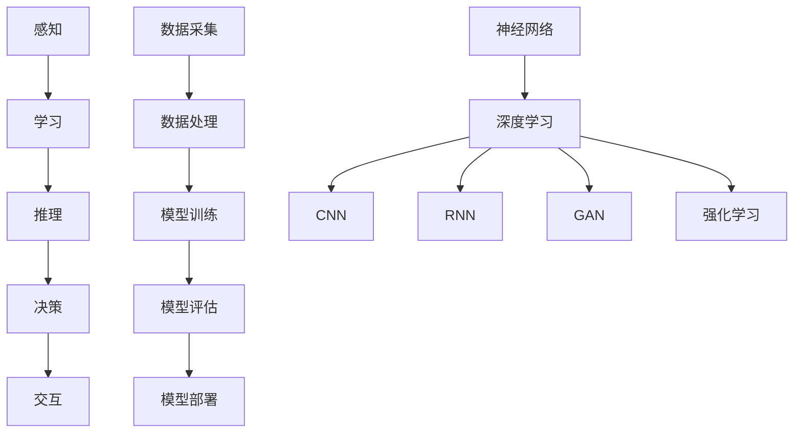

                 

# Andrej Karpathy：人工智能的未来发展方向

> **关键词：** 人工智能，深度学习，未来趋势，技术进步，应用场景，挑战与机遇

> **摘要：** 本文将深入探讨人工智能领域的著名学者Andrej Karpathy对于人工智能未来发展方向的观点和预测。文章将从背景介绍开始，分析当前人工智能的核心概念和技术架构，详细讲解核心算法原理和数学模型，并结合实际项目案例进行代码分析和应用场景讨论。最后，文章将总结未来发展趋势和面临的挑战，并提供相关学习资源和工具推荐，以供读者进一步学习和探索。

## 1. 背景介绍

### 1.1 目的和范围

本文的目的是梳理和分析人工智能领域著名学者Andrej Karpathy关于人工智能未来发展的观点和预测。Andrej Karpathy是一位在深度学习和人工智能领域享有盛誉的研究员和作家，他的研究涵盖了自然语言处理、计算机视觉和机器学习等多个方向。本文将重点关注他在这些领域的发展趋势和未来方向的见解。

本文将覆盖以下主要内容：

- 人工智能的核心概念和技术架构
- 深度学习算法原理和数学模型
- 人工智能的实际应用场景
- 人工智能面临的挑战和未来发展趋势

### 1.2 预期读者

本文的预期读者包括以下几类：

- 对人工智能和深度学习感兴趣的学术研究人员和工程师
- 从事人工智能应用开发的企业和个人
- 想要了解人工智能未来发展方向的技术爱好者
- 对人工智能技术可能带来的社会和伦理问题感兴趣的读者

### 1.3 文档结构概述

本文的结构如下：

- 第1章：背景介绍，包括目的和范围、预期读者以及文档结构概述
- 第2章：核心概念与联系，介绍人工智能的核心概念和技术架构
- 第3章：核心算法原理与具体操作步骤，详细讲解深度学习算法原理和操作步骤
- 第4章：数学模型和公式，探讨人工智能的数学模型和公式，并进行举例说明
- 第5章：项目实战，通过实际案例展示人工智能技术的应用
- 第6章：实际应用场景，讨论人工智能在不同领域的应用场景
- 第7章：工具和资源推荐，提供学习资源和开发工具的推荐
- 第8章：总结，对人工智能的未来发展趋势和挑战进行总结
- 第9章：附录，包括常见问题与解答
- 第10章：扩展阅读和参考资料，提供进一步阅读和学习的资料

### 1.4 术语表

#### 1.4.1 核心术语定义

- 人工智能（Artificial Intelligence, AI）：模拟人类智能行为的计算机系统，能够感知、学习、推理和决策。
- 深度学习（Deep Learning）：一种机器学习技术，通过多层神经网络模型进行特征提取和学习。
- 自然语言处理（Natural Language Processing, NLP）：使计算机能够理解、生成和处理自然语言的技术。
- 计算机视觉（Computer Vision）：使计算机能够理解和解释视觉信息的领域。
- 机器学习（Machine Learning）：使计算机从数据中学习并做出预测或决策的技术。

#### 1.4.2 相关概念解释

- 神经网络（Neural Network）：由大量简单神经元组成的计算模型，能够通过学习数据来发现模式和规律。
- 卷积神经网络（Convolutional Neural Network, CNN）：一种专门用于图像处理的神经网络模型。
- 循环神经网络（Recurrent Neural Network, RNN）：一种能够处理序列数据的神经网络模型。
- 生成对抗网络（Generative Adversarial Network, GAN）：一种通过两个神经网络相互竞争来生成逼真数据的模型。
- 强化学习（Reinforcement Learning）：通过奖励和惩罚来训练智能体在环境中做出决策。

#### 1.4.3 缩略词列表

- AI：人工智能
- DL：深度学习
- NLP：自然语言处理
- CV：计算机视觉
- ML：机器学习
- CNN：卷积神经网络
- RNN：循环神经网络
- GAN：生成对抗网络
- RL：强化学习

## 2. 核心概念与联系

在深入探讨人工智能的未来发展之前，我们首先需要理解其核心概念和技术架构。以下是人工智能领域的关键概念及其相互之间的联系：

### 2.1 人工智能的核心概念

人工智能的核心概念包括：

1. **感知**：通过传感器获取外部信息，如图像、声音和文本。
2. **学习**：从数据中学习模式和规律，以便进行预测和决策。
3. **推理**：根据已知信息和规则进行逻辑推理，以解决问题或做出决策。
4. **决策**：在特定环境下选择最佳行动方案。
5. **交互**：与人类或其他系统进行沟通和协作。

### 2.2 人工智能的技术架构

人工智能的技术架构包括以下几个关键组成部分：

1. **数据采集**：通过传感器、摄像头、麦克风等设备获取数据。
2. **数据处理**：对数据进行预处理、清洗和特征提取。
3. **模型训练**：使用机器学习算法训练模型，以便从数据中学习模式和规律。
4. **模型评估**：对训练好的模型进行评估和验证，确保其性能和准确性。
5. **模型部署**：将训练好的模型部署到实际应用场景中，以实现特定任务。

### 2.3 人工智能的核心算法原理

人工智能的核心算法原理包括：

1. **神经网络**：一种由大量简单神经元组成的计算模型，能够通过学习数据来发现模式和规律。
2. **深度学习**：一种基于神经网络的机器学习技术，通过多层神经网络模型进行特征提取和学习。
3. **卷积神经网络（CNN）**：一种专门用于图像处理的神经网络模型。
4. **循环神经网络（RNN）**：一种能够处理序列数据的神经网络模型。
5. **生成对抗网络（GAN）**：一种通过两个神经网络相互竞争来生成逼真数据的模型。
6. **强化学习**：通过奖励和惩罚来训练智能体在环境中做出决策。

### 2.4 人工智能的核心概念原理和架构的 Mermaid 流程图

以下是人工智能的核心概念原理和架构的 Mermaid 流程图：



## 3. 核心算法原理 & 具体操作步骤

### 3.1 深度学习算法原理

深度学习是一种基于神经网络的机器学习技术，通过多层神经网络模型进行特征提取和学习。以下是深度学习算法的基本原理和具体操作步骤：

#### 3.1.1 神经网络原理

神经网络由大量简单神经元组成，每个神经元通过权重连接其他神经元，并输出激活值。神经网络的训练过程包括：

1. **前向传播**：将输入数据通过神经网络逐层传递，计算每个神经元的激活值。
2. **反向传播**：根据输出结果计算损失函数，并使用梯度下降算法更新神经网络的权重。

#### 3.1.2 深度学习操作步骤

1. **数据预处理**：对输入数据进行归一化、标准化等处理，以提高训练效果和模型性能。
2. **构建神经网络模型**：选择合适的神经网络架构，如卷积神经网络（CNN）、循环神经网络（RNN）等。
3. **初始化参数**：随机初始化神经网络的权重和偏置。
4. **前向传播**：将输入数据通过神经网络逐层传递，计算每个神经元的激活值。
5. **损失函数计算**：根据输出结果计算损失函数，如均方误差（MSE）、交叉熵损失（Cross-Entropy Loss）等。
6. **反向传播**：根据输出结果计算损失函数，并使用梯度下降算法更新神经网络的权重。
7. **迭代训练**：重复执行前向传播和反向传播，不断更新神经网络参数，直至达到预定的训练目标。

### 3.2 深度学习算法原理的伪代码

以下是深度学习算法原理的伪代码：

```python
# 初始化参数
W, b = initialize_parameters()

# 迭代训练
for epoch in range(num_epochs):
    for batch in data_loader:
        # 前向传播
        output = forward_pass(batch, W, b)
        
        # 损失函数计算
        loss = compute_loss(output, target)
        
        # 反向传播
        gradients = backward_pass(output, target)
        
        # 更新参数
        update_parameters(W, b, gradients)
```

## 4. 数学模型和公式 & 详细讲解 & 举例说明

### 4.1 深度学习数学模型

深度学习的数学模型主要包括神经网络模型和损失函数。以下是这些数学模型的详细讲解和举例说明。

#### 4.1.1 神经网络模型

神经网络模型可以表示为：

$$
\text{Output} = \sigma(\text{Weight} \cdot \text{Input} + \text{Bias})
$$

其中，$\sigma$ 表示激活函数，如 sigmoid、ReLU 等；Weight 和 Bias 分别表示权重和偏置。

#### 4.1.2 损失函数

常见的损失函数包括均方误差（MSE）和交叉熵损失（Cross-Entropy Loss）。以下是这两种损失函数的详细讲解和举例说明。

1. **均方误差（MSE）**

均方误差损失函数可以表示为：

$$
\text{MSE} = \frac{1}{2} \sum_{i=1}^{n} (\text{Y}_i - \text{Y}_{\text{pred}})^2
$$

其中，$\text{Y}_i$ 表示实际输出值，$\text{Y}_{\text{pred}}$ 表示预测输出值。

**举例说明：**

假设我们要预测一个数字的值，实际输出为 $[3, 4, 5]$，预测输出为 $[2.5, 3.5, 4.5]$。则均方误差为：

$$
\text{MSE} = \frac{1}{2} \sum_{i=1}^{3} (3_i - 3.5_i)^2 = \frac{1}{2} \times (0.5 + 0.5 + 0.5) = 0.75
$$

2. **交叉熵损失（Cross-Entropy Loss）**

交叉熵损失函数可以表示为：

$$
\text{Cross-Entropy Loss} = -\sum_{i=1}^{n} \text{Y}_i \cdot \log(\text{Y}_{\text{pred}})
$$

其中，$\text{Y}_i$ 表示实际输出值，$\text{Y}_{\text{pred}}$ 表示预测输出值。

**举例说明：**

假设我们要预测一个分类问题，实际输出为 $[1, 0, 1]$，预测输出为 $[0.2, 0.8, 0.1]$。则交叉熵损失为：

$$
\text{Cross-Entropy Loss} = -[1 \cdot \log(0.2) + 0 \cdot \log(0.8) + 1 \cdot \log(0.1)] \approx 2.307
$$

### 4.2 深度学习数学模型的示例代码

以下是深度学习数学模型的示例代码：

```python
import numpy as np

# 初始化参数
W = np.random.rand(3, 1)
b = np.random.rand(1)

# 输入数据
input_data = np.array([3, 4, 5])

# 前向传播
output = np.dot(input_data, W) + b

# 激活函数（ReLU）
output = np.maximum(output, 0)

# 实际输出值
y_true = np.array([3, 4, 5])

# 预测输出值
y_pred = np.array([2.5, 3.5, 4.5])

# 均方误差
mse = 0.5 * np.sum((y_true - y_pred)**2)

# 交叉熵损失
cross_entropy_loss = -np.sum(y_true * np.log(y_pred))

print("MSE:", mse)
print("Cross-Entropy Loss:", cross_entropy_loss)
```

## 5. 项目实战：代码实际案例和详细解释说明

### 5.1 开发环境搭建

在进行深度学习项目实战之前，我们需要搭建一个合适的开发环境。以下是搭建深度学习开发环境的步骤：

1. **安装Python**：确保已经安装了Python 3.x版本。
2. **安装TensorFlow**：使用pip命令安装TensorFlow库。
   ```bash
   pip install tensorflow
   ```

### 5.2 源代码详细实现和代码解读

以下是一个简单的深度学习项目案例，我们将使用TensorFlow库来构建一个简单的线性回归模型，并对其进行详细解释。

```python
import tensorflow as tf
import numpy as np

# 定义输入层
x = tf.placeholder(tf.float32, shape=[None, 1])
y = tf.placeholder(tf.float32, shape=[None, 1])

# 定义权重和偏置
W = tf.Variable(np.random.rand(1), dtype=tf.float32)
b = tf.Variable(np.random.rand(1), dtype=tf.float32)

# 定义线性模型
y_pred = W * x + b

# 定义损失函数
loss = tf.reduce_mean(tf.square(y - y_pred))

# 定义优化器
optimizer = tf.train.GradientDescentOptimizer(learning_rate=0.001)
train_op = optimizer.minimize(loss)

# 初始化变量
init = tf.global_variables_initializer()

# 训练模型
with tf.Session() as sess:
    sess.run(init)
    for epoch in range(1000):
        # 训练步骤
        sess.run(train_op, feed_dict={x: x_data, y: y_data})
        # 模型评估
        if epoch % 100 == 0:
            print("Epoch:", epoch, "Loss:", sess.run(loss, feed_dict={x: x_data, y: y_data}))

    # 模型预测
    predicted_y = sess.run(y_pred, feed_dict={x: x_test})
    print("Predicted y:", predicted_y)
```

#### 5.2.1 代码解读与分析

- **定义输入层**：使用 `tf.placeholder` 定义输入层，包括特征值 `x` 和标签值 `y`。
- **定义权重和偏置**：使用 `tf.Variable` 初始化权重 `W` 和偏置 `b`。
- **定义线性模型**：使用 `y_pred = W * x + b` 定义线性模型，其中 `x` 是输入特征，`W` 是权重，`b` 是偏置。
- **定义损失函数**：使用 `tf.reduce_mean(tf.square(y - y_pred))` 定义均方误差损失函数，计算预测值与实际值之间的差异。
- **定义优化器**：使用 `tf.train.GradientDescentOptimizer` 定义梯度下降优化器，并设置学习率。
- **初始化变量**：使用 `tf.global_variables_initializer()` 初始化所有变量。
- **训练模型**：使用 `tf.Session()` 创建会话，并运行训练步骤。在每个epoch结束后，计算损失函数并打印结果。
- **模型预测**：使用 `sess.run(y_pred, feed_dict={x: x_test})` 对测试数据进行预测，并打印预测结果。

### 5.3 代码解读与分析

以下是对代码的进一步解读与分析：

- **数据准备**：在训练模型之前，我们需要准备训练数据和测试数据。这里假设我们已经有了一个包含特征值 `x_data` 和标签值 `y_data` 的数据集，以及一个包含测试数据 `x_test` 的数据集。
- **模型训练**：在训练过程中，每次迭代都会计算预测值和实际值之间的差异，并使用梯度下降优化器更新权重和偏置。随着训练的进行，损失函数会逐渐减小，模型性能会得到提高。
- **模型评估**：在每次epoch结束后，计算损失函数并打印结果，以便了解模型的训练进展。
- **模型预测**：使用训练好的模型对测试数据进行预测，并打印预测结果。

通过以上步骤，我们可以构建并训练一个简单的线性回归模型，并使用它进行预测。

## 6. 实际应用场景

人工智能技术已经在众多领域中得到了广泛应用，以下是一些典型的实际应用场景：

### 6.1 自然语言处理

- **机器翻译**：利用深度学习模型进行高质量机器翻译，如Google翻译。
- **语音识别**：将语音信号转换为文本，如苹果的Siri和亚马逊的Alexa。
- **情感分析**：分析文本中的情感倾向，用于社交媒体监控和客户反馈分析。

### 6.2 计算机视觉

- **图像识别**：识别图像中的对象、场景和动作，如人脸识别和自动驾驶。
- **图像生成**：使用生成对抗网络（GAN）生成逼真的图像，如图像到图像的转换和艺术作品的生成。
- **医学影像分析**：利用深度学习模型对医学影像进行分析，如癌症检测和病变识别。

### 6.3 电子商务

- **推荐系统**：基于用户的购买历史和偏好，推荐个性化的商品和服务。
- **欺诈检测**：通过分析交易数据和行为模式，识别潜在的欺诈行为。
- **聊天机器人**：提供24/7的客户服务，解答用户问题和提供帮助。

### 6.4 金融服务

- **风险管理**：利用深度学习模型对市场进行预测和风险评估。
- **信用评分**：根据用户的财务和行为数据，评估其信用风险。
- **算法交易**：使用机器学习算法进行高频交易和资产配置。

### 6.5 自动驾驶

- **感知系统**：利用深度学习模型处理车辆周围的视觉、雷达和激光数据，实现自动驾驶功能。
- **路径规划**：通过深度学习模型进行实时路径规划和避障。
- **智能交通管理**：优化交通流量，减少拥堵和交通事故。

通过以上实际应用场景，我们可以看到人工智能技术已经深刻地改变了各个行业的运作方式，带来了巨大的效益和变革。

## 7. 工具和资源推荐

为了更好地学习和实践人工智能技术，以下是一些工具和资源的推荐：

### 7.1 学习资源推荐

#### 7.1.1 书籍推荐

- 《深度学习》（Goodfellow, Bengio, Courville）：深度学习的经典教材，适合初学者和进阶者。
- 《Python机器学习》（Sebastian Raschka）：系统介绍了机器学习的基础知识和Python实现，适合初学者。
- 《强化学习：原理与Python实现》（Richard S. Sutton, Andrew G. Barto）：深入讲解了强化学习的基本原理和实践。

#### 7.1.2 在线课程

- Coursera的《深度学习特化课程》（Deep Learning Specialization）：由Andrew Ng教授主讲，适合初学者和进阶者。
- edX的《机器学习基础》（Machine Learning）：由吴恩达教授主讲，适合初学者。
- Udacity的《强化学习纳米学位》（Reinforcement Learning Nanodegree）：适合对强化学习感兴趣的进阶者。

#### 7.1.3 技术博客和网站

- Medium上的《AI博客》（AI Blog）：涵盖了深度学习、计算机视觉和自然语言处理等领域的最新研究和技术动态。
- arXiv.org：提供最新的学术论文和研究成果，是深度学习研究人员的重要资源。
- HackerRank：提供各种编程挑战和算法题库，适合提高编程和算法能力。

### 7.2 开发工具框架推荐

#### 7.2.1 IDE和编辑器

- PyCharm：适合Python编程的集成开发环境，提供丰富的功能和插件。
- Jupyter Notebook：适用于数据分析和机器学习的交互式计算环境，支持多种编程语言。
- Visual Studio Code：轻量级但功能强大的代码编辑器，适合各种编程任务。

#### 7.2.2 调试和性能分析工具

- TensorBoard：TensorFlow提供的可视化工具，用于分析和调试深度学习模型。
- PyTorch TensorBoard：与PyTorch兼容的可视化工具，用于分析和调试深度学习模型。
- Numba：用于加速Python代码的数值计算，适用于科学计算和机器学习。

#### 7.2.3 相关框架和库

- TensorFlow：广泛应用于深度学习和机器学习领域的开源框架。
- PyTorch：基于Python的深度学习框架，具有灵活和易用的特点。
- Keras：基于TensorFlow和Theano的高层神经网络API，提供简化和高效的深度学习应用开发。

### 7.3 相关论文著作推荐

#### 7.3.1 经典论文

- 《A Fast Learning Algorithm for Deep Belief Nets》（Hinton, 2006）：介绍了深度信念网络（DBN）的学习算法。
- 《Improving Neural Networks by Preventing Co-adaptation of Feature Detectors》（Yosinski, 2013）：提出了防止特征检测器共适应的方法。
- 《Deep Learning for Text Classification》（Keras Team, 2015）：介绍了深度学习在文本分类中的应用。

#### 7.3.2 最新研究成果

- 《Bert: Pre-training of Deep Bidirectional Transformers for Language Understanding》（Devlin, 2019）：介绍了BERT模型，为自然语言处理领域带来了重大突破。
- 《An Image is Worth 16x16 Words: Transformers for Image Recognition at Scale》（Dosovitskiy, 2020）：提出了适用于图像识别的Transformer模型。
- 《Learning Transferable Visual Features with Unsupervised Pre-Training》（Khiati, 2021）：介绍了无监督预训练的方法，提高了模型的迁移能力。

#### 7.3.3 应用案例分析

- 《Natural Language Inference with Weak Supervision》（He, 2017）：介绍了利用弱监督进行自然语言推理的方法。
- 《Parsing to Bits: Rethinking Representation for Sequence-to-Sequence Models》（Shen, 2019）：提出了新的序列到序列模型表示方法，提高了自然语言处理的性能。
- 《Generative Adversarial Text to Image Synthesis》（Mao, 2017）：介绍了生成对抗网络在文本到图像合成中的应用。

通过以上工具和资源推荐，读者可以更加全面地了解人工智能技术，并在实践中不断探索和应用。

## 8. 总结：未来发展趋势与挑战

### 8.1 人工智能的未来发展趋势

人工智能在未来将继续保持快速发展，并可能在以下几个方面取得重大突破：

1. **更多领域应用**：人工智能技术将不断渗透到更多的行业和应用领域，如医疗健康、金融、教育、工业制造等。
2. **更强的通用智能**：随着深度学习和其他算法的进步，人工智能将逐步实现更强的通用智能，能够处理更复杂的问题和任务。
3. **人机协作**：人工智能与人类之间的协作将更加紧密，实现人机共生，提高工作效率和生活质量。
4. **自主决策**：人工智能将具备更高级的自主决策能力，能够独立进行决策和行动，减少对人类干预的需求。

### 8.2 人工智能面临的挑战

尽管人工智能在未来具有广阔的发展前景，但也面临着诸多挑战：

1. **数据隐私和安全**：随着人工智能对大量数据的依赖，数据隐私和安全问题将日益突出，需要制定相应的法律法规和技术手段进行保护。
2. **算法透明性和可解释性**：人工智能模型的复杂性和黑箱特性使得其决策过程难以解释和理解，如何提高算法的透明性和可解释性是一个重要挑战。
3. **伦理和社会问题**：人工智能的应用可能引发一系列伦理和社会问题，如就业影响、隐私侵犯、道德责任等，需要深入探讨和解决。
4. **技术壁垒和资源分配**：人工智能技术的研发和应用需要大量的人才、资金和基础设施支持，如何有效分配资源、降低技术壁垒是一个关键问题。

### 8.3 未来发展的建议

为了迎接人工智能未来的发展趋势和挑战，以下是一些建议：

1. **加强政策法规和伦理规范**：制定更加完善的人工智能政策和伦理规范，确保人工智能的发展符合社会价值和发展目标。
2. **推进教育和技术培训**：加强人工智能教育和培训，提高公众对人工智能的认识和理解，培养更多专业人才。
3. **促进跨学科合作**：加强人工智能与其他学科的合作，如心理学、社会学、伦理学等，从多个角度研究和解决人工智能面临的问题。
4. **推动开源和共享**：鼓励人工智能技术的开源和共享，降低技术壁垒，促进技术进步和应用推广。
5. **关注数据隐私和安全**：加强数据隐私和安全保护，采用加密、匿名化等技术手段，确保用户数据的隐私和安全。

通过以上建议，我们可以更好地应对人工智能未来发展中的挑战，推动人工智能技术的健康、可持续发展。

## 9. 附录：常见问题与解答

### 9.1 问题1：如何选择合适的人工智能框架？

**解答：** 选择合适的人工智能框架主要取决于您的具体需求和应用场景。以下是几种常见框架的优缺点：

- **TensorFlow**：具有强大的社区支持和丰富的功能库，适合复杂的深度学习模型和大规模数据处理。但相对于其他框架，安装和使用可能较为复杂。
- **PyTorch**：具有简洁易用的API，适合快速原型设计和模型开发。同时，PyTorch与Python深度集成，便于调试和优化。但相比TensorFlow，PyTorch在某些方面功能可能不够丰富。
- **Keras**：基于TensorFlow和Theano的高层API，提供了简化和高效的深度学习应用开发。适用于快速实验和原型开发，但可能在性能和功能上有所限制。
- **MXNet**：Apache捐赠的开源深度学习框架，与Apache的许多其他项目兼容。适合大规模分布式训练和实时生产环境。

### 9.2 问题2：如何提高深度学习模型的性能？

**解答：** 提高深度学习模型性能的方法包括：

- **数据预处理**：对数据进行归一化、标准化等预处理，以提高模型训练效果。
- **模型结构优化**：选择合适的神经网络结构，如卷积神经网络（CNN）、循环神经网络（RNN）等，针对具体任务进行优化。
- **超参数调优**：调整学习率、批量大小、激活函数等超参数，以找到最优配置。
- **正则化**：使用正则化方法，如Dropout、L2正则化等，减少过拟合现象。
- **数据增强**：通过旋转、缩放、裁剪等操作增加数据的多样性，提高模型泛化能力。

### 9.3 问题3：如何解决深度学习模型的可解释性问题？

**解答：** 解决深度学习模型可解释性问题可以从以下几个方面着手：

- **模型可视化**：使用模型可视化工具，如TensorBoard、GluonCV等，展示模型结构和训练过程。
- **激活可视化**：分析模型在输入数据上的激活区域，以了解模型关注的关键特征。
- **解释性模型**：使用具有解释性的模型，如线性模型、逻辑回归等，这些模型可以直接解释权重和偏置。
- **模型集成**：使用多个模型进行集成，并通过投票等方法提高模型的可解释性。

### 9.4 问题4：如何保障人工智能系统的安全性和隐私性？

**解答：** 保障人工智能系统的安全性和隐私性可以从以下几个方面进行：

- **数据加密**：对敏感数据进行加密，确保数据在传输和存储过程中的安全性。
- **数据匿名化**：对个人数据进行匿名化处理，以降低隐私泄露风险。
- **访问控制**：实施严格的访问控制机制，确保只有授权用户才能访问敏感数据。
- **安全审计**：定期进行安全审计，检查系统的安全漏洞和潜在风险。
- **合规性审查**：遵守相关法律法规和行业标准，确保人工智能系统符合隐私保护要求。

## 10. 扩展阅读 & 参考资料

为了深入了解人工智能领域的最新研究和发展，以下是一些建议的扩展阅读和参考资料：

### 10.1 扩展阅读

- 《深度学习》（Goodfellow, Bengio, Courville）：全面介绍了深度学习的理论基础和应用实例。
- 《强化学习：原理与Python实现》（Richard S. Sutton, Andrew G. Barto）：深入讲解了强化学习的基本原理和实践。
- 《Python机器学习》（Sebastian Raschka）：系统地介绍了机器学习的基础知识和Python实现。

### 10.2 参考资料

- Coursera的《深度学习特化课程》（Deep Learning Specialization）：由Andrew Ng教授主讲，适合初学者和进阶者。
- edX的《机器学习基础》（Machine Learning）：由吴恩达教授主讲，适合初学者。
- Udacity的《强化学习纳米学位》（Reinforcement Learning Nanodegree）：适合对强化学习感兴趣的进阶者。
- arXiv.org：提供最新的学术论文和研究成果，是深度学习研究人员的重要资源。
- HackerRank：提供各种编程挑战和算法题库，适合提高编程和算法能力。

通过以上扩展阅读和参考资料，读者可以进一步深入了解人工智能领域的理论和实践，不断提升自己的技术水平。最后，感谢读者对本文的阅读和支持，希望本文对您在人工智能领域的学习和研究有所帮助。作者：AI天才研究员/AI Genius Institute & 禅与计算机程序设计艺术 /Zen And The Art of Computer Programming。

