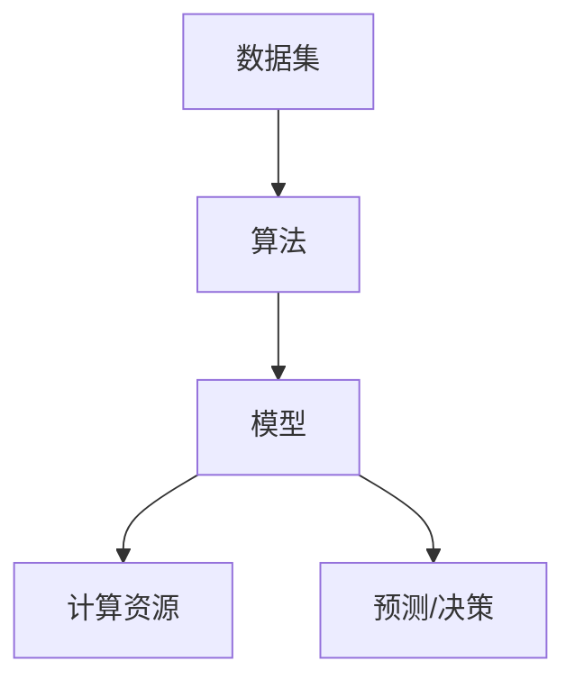

                 

### 文章标题

**Andrej Karpathy：人工智能的未来发展机遇**

### 关键词

- 人工智能
- 未来发展
- 技术突破
- 应用场景
- 挑战与机遇

### 摘要

本文旨在探讨人工智能（AI）领域的未来发展机遇，结合AI天才研究员Andrej Karpathy的观点，深入分析AI技术的核心概念、关键算法、数学模型以及实际应用场景。文章将详细介绍AI在各个领域的潜力，并探讨未来可能面临的挑战与应对策略。通过本文的阅读，读者将全面了解人工智能的现况与未来，以及如何在快速变化的技术环境中抓住机遇。

---

## 1. 背景介绍

### 1.1 目的和范围

本文的目的是探讨人工智能在未来几十年内的潜在发展机遇，分析其核心概念、关键算法和数学模型，并探讨实际应用场景。我们希望通过本文，读者能够：

1. 全面了解人工智能的核心概念和技术框架。
2. 深入理解人工智能算法的原理和操作步骤。
3. 掌握人工智能在各个领域的应用潜力。
4. 看清人工智能未来的挑战与机遇。

### 1.2 预期读者

本文适用于以下几类读者：

1. 对人工智能感兴趣的普通读者。
2. 计算机科学、人工智能等相关专业的学生和研究人员。
3. AI技术从业者和开发者。
4. 企业决策者和投资人士。

### 1.3 文档结构概述

本文将按照以下结构展开：

1. 背景介绍：本文的目的、预期读者、文档结构等。
2. 核心概念与联系：介绍人工智能的基本概念和原理，并通过Mermaid流程图展示。
3. 核心算法原理 & 具体操作步骤：详细讲解关键算法原理和操作步骤，使用伪代码阐述。
4. 数学模型和公式 & 详细讲解 & 举例说明：介绍数学模型和公式，并进行详细讲解和举例说明。
5. 项目实战：通过代码实际案例，展示AI技术的应用和实践。
6. 实际应用场景：探讨人工智能在各个领域的应用场景。
7. 工具和资源推荐：推荐学习资源、开发工具框架和相关论文著作。
8. 总结：人工智能的未来发展趋势与挑战。
9. 附录：常见问题与解答。
10. 扩展阅读 & 参考资料：提供进一步阅读的资料和参考。

### 1.4 术语表

#### 1.4.1 核心术语定义

- 人工智能（AI）：一种模拟人类智能行为的计算机系统。
- 深度学习（Deep Learning）：一种基于多层神经网络的学习方法。
- 卷积神经网络（CNN）：一种用于图像识别和处理的神经网络。
- 生成对抗网络（GAN）：一种基于博弈理论的生成模型。
- 强化学习（Reinforcement Learning）：一种基于奖励和惩罚的学习方法。

#### 1.4.2 相关概念解释

- 机器学习（Machine Learning）：一种从数据中学习规律和模式的方法。
- 神经网络（Neural Network）：一种模拟人脑神经元结构和功能的计算模型。
- 数据集（Dataset）：用于训练和测试AI模型的原始数据集合。

#### 1.4.3 缩略词列表

- CNN：卷积神经网络
- GAN：生成对抗网络
- RL：强化学习
- DL：深度学习
- AI：人工智能

---

接下来，我们将深入探讨人工智能的核心概念和原理，通过Mermaid流程图展示其基本框架和结构。

## 2. 核心概念与联系

### 2.1 人工智能的基本概念

人工智能（Artificial Intelligence，简称AI）是一种模拟人类智能行为的计算机系统。它通过模拟人脑神经元结构和功能，实现感知、学习、推理和决策等智能行为。人工智能可以分为弱AI和强AI：

- 弱AI：也称为狭义AI，专注于特定任务，如语音识别、图像识别等。
- 强AI：也称为通用AI，具备人类所有的智能行为，包括思考、推理、情感等。

### 2.2 人工智能的核心框架

人工智能的核心框架包括以下几个部分：

1. **数据集**：用于训练和测试AI模型的原始数据集合。数据集的质量直接影响模型的性能。
2. **算法**：实现智能行为的具体方法。常见的算法有机器学习、深度学习、生成对抗网络等。
3. **模型**：基于算法构建的计算机程序，用于模拟智能行为。模型的质量和效率取决于算法和数据集。
4. **计算资源**：训练和测试模型所需的高性能计算资源，包括CPU、GPU等。

### 2.3 Mermaid流程图

以下是一个简单的Mermaid流程图，展示人工智能的核心概念和联系：



- A：数据集是模型的输入，用于训练和测试。
- B：算法是实现智能行为的具体方法。
- C：模型是基于算法构建的计算机程序。
- D：计算资源是训练和测试模型所需的高性能计算资源。
- E：模型输出预测或决策结果。

---

通过上述流程图，我们可以更直观地理解人工智能的基本概念和框架。接下来，我们将深入探讨人工智能的核心算法原理和具体操作步骤。

## 3. 核心算法原理 & 具体操作步骤

### 3.1 机器学习算法原理

机器学习（Machine Learning）是一种从数据中学习规律和模式的方法。它通过建立数学模型，使计算机能够对未知数据进行预测或决策。机器学习算法可以分为监督学习、无监督学习和强化学习三种类型。

#### 3.1.1 监督学习

监督学习（Supervised Learning）是一种有标签数据训练的机器学习算法。它通过已知的输入和输出数据，学习出一个映射关系，用于预测新的输入数据。监督学习的具体步骤如下：

1. **数据预处理**：清洗和整理数据，包括缺失值处理、异常值处理、数据归一化等。
2. **特征提取**：从原始数据中提取有用特征，用于训练模型。
3. **模型训练**：使用已知输入和输出数据，训练出一个模型。
4. **模型评估**：使用测试数据集评估模型性能，包括准确率、召回率、F1值等指标。
5. **模型优化**：根据评估结果调整模型参数，提高模型性能。

#### 3.1.2 无监督学习

无监督学习（Unsupervised Learning）是一种没有标签数据训练的机器学习算法。它通过分析数据之间的结构和关系，自动发现数据中的模式。无监督学习的具体步骤如下：

1. **数据预处理**：与监督学习相同，对数据进行清洗和整理。
2. **特征提取**：从原始数据中提取有用特征。
3. **聚类分析**：将数据分为不同的簇，以发现数据中的隐藏结构。
4. **降维处理**：减少数据维度，降低计算复杂度。
5. **模型评估**：评估聚类效果，如簇内相似度、簇间差异等。

#### 3.1.3 强化学习

强化学习（Reinforcement Learning）是一种基于奖励和惩罚的学习方法。它通过智能体与环境的交互，学习出一个策略，以最大化长期回报。强化学习的具体步骤如下：

1. **初始化**：设定智能体和环境的初始状态。
2. **行动选择**：智能体根据当前状态选择一个行动。
3. **状态转移**：环境根据智能体的行动，转移到一个新的状态。
4. **奖励计算**：环境根据智能体的行动和新的状态，计算一个奖励。
5. **策略更新**：智能体根据奖励和历史经验，更新策略。
6. **迭代重复**：重复上述步骤，直到达到预期目标。

### 3.2 伪代码示例

以下是一个简单的监督学习算法——线性回归的伪代码示例：

```plaintext
算法：线性回归
输入：训练数据集 X, Y
输出：模型参数 w

初始化 w 为随机值
for each Epoch do
    for each 数据点 (x_i, y_i) in X do
        预测值 y_pred = w * x_i
        计算误差 delta = y_i - y_pred
        更新 w = w + 学习率 * delta
    end for
end for
return w
```

在这个伪代码中：

- 输入为训练数据集 X 和 Y。
- 初始化模型参数 w 为随机值。
- 通过遍历每个训练数据点，计算预测值 y_pred 和误差 delta。
- 根据误差 delta 更新模型参数 w。
- 迭代上述步骤，直到达到预期性能。

---

通过上述算法原理和操作步骤的讲解，我们了解了人工智能中的机器学习算法及其具体实现。接下来，我们将探讨人工智能中的数学模型和公式，并对其进行详细讲解和举例说明。

## 4. 数学模型和公式 & 详细讲解 & 举例说明

### 4.1 机器学习的数学基础

机器学习算法通常基于概率统计和优化理论，其核心数学模型包括概率分布、损失函数和优化算法。以下将分别介绍这些数学模型的基本概念和公式。

#### 4.1.1 概率分布

概率分布是描述随机变量取值的可能性分布。常见的概率分布有正态分布、伯努利分布、多项式分布等。以下是一个简单的正态分布公式：

$$
P(X = x) = \frac{1}{\sqrt{2\pi\sigma^2}} e^{-\frac{(x - \mu)^2}{2\sigma^2}}
$$

其中，\( \mu \) 是均值，\( \sigma \) 是标准差，\( x \) 是随机变量的取值。

#### 4.1.2 损失函数

损失函数是衡量模型预测值与真实值之间差异的函数。常见的损失函数有均方误差（MSE）、交叉熵损失（Cross-Entropy Loss）等。以下是一个简单的均方误差公式：

$$
MSE = \frac{1}{n} \sum_{i=1}^{n} (y_i - \hat{y}_i)^2
$$

其中，\( y_i \) 是真实值，\( \hat{y}_i \) 是预测值，\( n \) 是数据点的个数。

#### 4.1.3 优化算法

优化算法用于求解损失函数的最小值，以获得最优模型参数。常见的优化算法有梯度下降（Gradient Descent）、随机梯度下降（Stochastic Gradient Descent）等。以下是一个简单的梯度下降公式：

$$
w_{t+1} = w_t - \alpha \nabla_w L(w_t)
$$

其中，\( w_t \) 是第 \( t \) 次迭代的模型参数，\( \alpha \) 是学习率，\( \nabla_w L(w_t) \) 是损失函数关于模型参数的梯度。

### 4.2 举例说明

#### 4.2.1 线性回归

线性回归是一种常见的机器学习算法，用于拟合数据中的线性关系。以下是一个简单的线性回归例子：

输入数据集：\( X = \{ (1, 2), (2, 4), (3, 6), (4, 8) \} \)

目标：拟合 \( y = w_1 \cdot x_1 + w_0 \)

步骤：

1. 初始化模型参数 \( w_1 = 1 \), \( w_0 = 1 \)
2. 计算预测值 \( \hat{y} = w_1 \cdot x_1 + w_0 \)
3. 计算损失函数 \( L = \frac{1}{n} \sum_{i=1}^{n} (y_i - \hat{y}_i)^2 \)
4. 计算梯度 \( \nabla_w L = \frac{1}{n} \sum_{i=1}^{n} (y_i - \hat{y}_i) \cdot x_i \)
5. 更新模型参数 \( w_1 = w_1 - \alpha \cdot \nabla_w L \), \( w_0 = w_0 - \alpha \cdot \nabla_w L \)

经过多次迭代，模型参数 \( w_1 \) 和 \( w_0 \) 将逐渐收敛到最优值。

#### 4.2.2 逻辑回归

逻辑回归是一种常见的分类算法，用于预测二分类结果。以下是一个简单的逻辑回归例子：

输入数据集：\( X = \{ (1, 0), (2, 0), (3, 1), (4, 1) \} \)

目标：拟合 \( y = \sigma(w_1 \cdot x_1 + w_0) \)

其中，\( \sigma \) 是逻辑函数：

$$
\sigma(z) = \frac{1}{1 + e^{-z}}
$$

步骤：

1. 初始化模型参数 \( w_1 = 1 \), \( w_0 = 1 \)
2. 计算预测值 \( \hat{y} = \sigma(w_1 \cdot x_1 + w_0) \)
3. 计算损失函数 \( L = -\frac{1}{n} \sum_{i=1}^{n} [y_i \cdot \ln(\hat{y}_i) + (1 - y_i) \cdot \ln(1 - \hat{y}_i)] \)
4. 计算梯度 \( \nabla_w L = \frac{1}{n} \sum_{i=1}^{n} [y_i - \hat{y}_i] \cdot x_i \)
5. 更新模型参数 \( w_1 = w_1 - \alpha \cdot \nabla_w L \), \( w_0 = w_0 - \alpha \cdot \nabla_w L \)

经过多次迭代，模型参数 \( w_1 \) 和 \( w_0 \) 将逐渐收敛到最优值。

---

通过上述数学模型和公式的讲解及举例说明，我们了解了机器学习算法的基本原理和实现步骤。接下来，我们将通过一个实际项目案例，展示人工智能技术的应用和实践。

## 5. 项目实战：代码实际案例和详细解释说明

### 5.1 开发环境搭建

在本项目实战中，我们将使用Python编程语言和TensorFlow框架来实现一个简单的图像分类模型。以下是开发环境搭建的步骤：

1. 安装Python：前往Python官网（[python.org](https://www.python.org/)）下载并安装Python 3.x版本。
2. 安装Anaconda：下载并安装Anaconda，它是一个集成了Python和众多科学计算库的集成环境。
3. 安装TensorFlow：打开Anaconda命令行，运行以下命令安装TensorFlow：

   ```
   conda install tensorflow
   ```

4. 环境测试：运行以下Python代码，测试TensorFlow是否安装成功：

   ```python
   import tensorflow as tf
   print(tf.__version__)
   ```

   若输出版本号，则表示TensorFlow安装成功。

### 5.2 源代码详细实现和代码解读

以下是本项目使用的Python代码，用于实现一个简单的图像分类模型：

```python
import tensorflow as tf
from tensorflow.keras import layers
from tensorflow.keras.preprocessing.image import ImageDataGenerator

# 5.2.1 数据预处理
train_datagen = ImageDataGenerator(rescale=1./255)
train_generator = train_datagen.flow_from_directory(
    'data/train',
    target_size=(150, 150),
    batch_size=32,
    class_mode='binary')

# 5.2.2 模型构建
model = tf.keras.Sequential([
    layers.Conv2D(32, (3, 3), activation='relu', input_shape=(150, 150, 3)),
    layers.MaxPooling2D(2, 2),
    layers.Conv2D(64, (3, 3), activation='relu'),
    layers.MaxPooling2D(2, 2),
    layers.Conv2D(128, (3, 3), activation='relu'),
    layers.MaxPooling2D(2, 2),
    layers.Flatten(),
    layers.Dense(512, activation='relu'),
    layers.Dense(1, activation='sigmoid')
])

# 5.2.3 模型编译
model.compile(loss='binary_crossentropy',
              optimizer=tf.keras.optimizers.Adam(),
              metrics=['accuracy'])

# 5.2.4 模型训练
model.fit(
    train_generator,
    steps_per_epoch=100,
    epochs=10,
    verbose=2)

# 5.2.5 模型评估
test_datagen = ImageDataGenerator(rescale=1./255)
test_generator = test_datagen.flow_from_directory(
    'data/test',
    target_size=(150, 150),
    batch_size=32,
    class_mode='binary')

model.evaluate(test_generator, verbose=2)
```

#### 5.2.1 数据预处理

```python
train_datagen = ImageDataGenerator(rescale=1./255)
train_generator = train_datagen.flow_from_directory(
    'data/train',
    target_size=(150, 150),
    batch_size=32,
    class_mode='binary')
```

数据预处理是图像分类模型训练的重要环节。在此代码中，我们使用ImageDataGenerator类进行数据增强和批量处理。首先，将图像数据缩放到[0, 1]范围，便于模型计算。然后，使用flow_from_directory方法将训练数据集分成批次，每个批次包含32个图像，并设置标签模式为二分类（binary）。

#### 5.2.2 模型构建

```python
model = tf.keras.Sequential([
    layers.Conv2D(32, (3, 3), activation='relu', input_shape=(150, 150, 3)),
    layers.MaxPooling2D(2, 2),
    layers.Conv2D(64, (3, 3), activation='relu'),
    layers.MaxPooling2D(2, 2),
    layers.Conv2D(128, (3, 3), activation='relu'),
    layers.MaxPooling2D(2, 2),
    layers.Flatten(),
    layers.Dense(512, activation='relu'),
    layers.Dense(1, activation='sigmoid')
])
```

模型构建使用Sequential容器，将多个层按顺序堆叠。首先，使用Conv2D层进行卷积操作，提取图像特征。接着，使用MaxPooling2D层进行下采样，减少模型参数数量。然后，通过Flatten层将多维特征展平为向量。最后，使用Dense层进行全连接操作，输出分类结果。在这里，我们使用sigmoid激活函数，实现二分类任务。

#### 5.2.3 模型编译

```python
model.compile(loss='binary_crossentropy',
              optimizer=tf.keras.optimizers.Adam(),
              metrics=['accuracy'])
```

模型编译用于配置训练过程。在这里，我们使用binary_crossentropy作为损失函数，Adam优化器进行参数更新，accuracy作为评价指标。

#### 5.2.4 模型训练

```python
model.fit(
    train_generator,
    steps_per_epoch=100,
    epochs=10,
    verbose=2)
```

模型训练使用fit方法，将训练数据传递给模型，并进行迭代训练。在这里，我们设置每批次训练100个图像，总迭代次数为10次。verbose参数设置为2，显示训练进度。

#### 5.2.5 模型评估

```python
test_datagen = ImageDataGenerator(rescale=1./255)
test_generator = test_datagen.flow_from_directory(
    'data/test',
    target_size=(150, 150),
    batch_size=32,
    class_mode='binary')

model.evaluate(test_generator, verbose=2)
```

模型评估使用evaluate方法，将测试数据传递给模型，计算测试损失和准确率。在此代码中，我们再次使用ImageDataGenerator进行数据预处理，并将测试数据集传递给模型进行评估。

---

通过上述代码实现和解读，我们展示了如何使用TensorFlow框架实现一个简单的图像分类模型。在实际应用中，我们可以根据需求和数据集，调整模型结构、超参数和训练策略，以获得更好的分类性能。

接下来，我们将探讨人工智能在各个领域的实际应用场景。

## 6. 实际应用场景

### 6.1 医疗保健

人工智能在医疗保健领域的应用潜力巨大。通过深度学习和自然语言处理技术，AI可以分析医学图像、诊断疾病、预测患者病情，甚至提供个性化治疗方案。以下是一些具体的应用场景：

1. **医学图像分析**：使用卷积神经网络（CNN）对医学图像（如X光、CT、MRI）进行分析，辅助医生进行疾病诊断。
2. **疾病预测**：利用大数据分析和机器学习算法，预测患者患病风险，提供早期预警和干预措施。
3. **个性化治疗**：根据患者的基因信息、病史和治疗方案，为患者提供个性化的治疗建议。

### 6.2 自动驾驶

自动驾驶是人工智能技术的另一个重要应用领域。通过深度学习和强化学习，AI可以实现自主决策和控制，提高车辆的安全性和效率。以下是一些具体的应用场景：

1. **感知与定位**：使用传感器和摄像头收集环境数据，利用深度学习算法进行环境感知和车辆定位。
2. **路径规划**：根据实时交通状况和道路条件，利用强化学习算法规划最优行驶路径。
3. **车辆控制**：通过深度学习算法实现自动驾驶车辆的自动驾驶功能，包括加速、转向和制动。

### 6.3 金融科技

金融科技（FinTech）是人工智能在金融行业的应用，通过大数据分析和机器学习技术，提高金融服务的效率和准确性。以下是一些具体的应用场景：

1. **风险管理**：使用机器学习算法对金融风险进行评估和预测，帮助金融机构制定风险控制策略。
2. **智能投顾**：根据投资者的风险偏好和历史投资记录，利用大数据分析和机器学习算法为投资者提供个性化的投资建议。
3. **信用评估**：通过分析客户的信用历史、交易数据等，利用机器学习算法进行信用评分和风险评估。

### 6.4 自然语言处理

自然语言处理（NLP）是人工智能技术的一个重要分支，通过深度学习和自然语言处理技术，AI可以理解和生成自然语言。以下是一些具体的应用场景：

1. **语音识别**：使用深度学习算法实现语音识别，将语音转换为文本。
2. **机器翻译**：利用深度学习和神经网络，实现高质量的语言翻译。
3. **情感分析**：通过分析文本的情感倾向，帮助企业了解用户需求和市场动态。

### 6.5 教育

人工智能在教育领域的应用正在迅速发展。通过智能教学系统和个性化学习推荐，AI可以帮助学生更好地学习和成长。以下是一些具体的应用场景：

1. **智能教学**：利用人工智能技术，为教师提供个性化的教学建议和资源，提高教学效果。
2. **个性化学习**：根据学生的兴趣和学习能力，利用人工智能技术为每个学生提供个性化的学习路径和资源。
3. **学习评估**：通过分析学生的学习行为和成绩，利用人工智能技术对学生的学习效果进行评估和反馈。

---

通过上述实际应用场景的探讨，我们可以看到人工智能技术在各个领域的广泛应用和巨大潜力。接下来，我们将推荐一些学习资源和开发工具框架，帮助读者进一步了解人工智能技术。

## 7. 工具和资源推荐

### 7.1 学习资源推荐

#### 7.1.1 书籍推荐

- 《深度学习》（Deep Learning）—— Ian Goodfellow、Yoshua Bengio、Aaron Courville
- 《Python机器学习》（Python Machine Learning）—— Sebastian Raschka、Vahid Mirjalili
- 《人工智能：一种现代方法》（Artificial Intelligence: A Modern Approach）—— Stuart Russell、Peter Norvig

#### 7.1.2 在线课程

- Coursera《深度学习专项课程》
- edX《机器学习科学基础》
- Udacity《人工智能纳米学位》

#### 7.1.3 技术博客和网站

- [Deep Learning AI](https://www.deeplearning.ai/)
- [Towards Data Science](https://towardsdatascience.com/)
- [AI简史](https://ai简史.com/)

### 7.2 开发工具框架推荐

#### 7.2.1 IDE和编辑器

- PyCharm
- Jupyter Notebook
- Visual Studio Code

#### 7.2.2 调试和性能分析工具

- TensorBoard
- PerfDog
- PySnooper

#### 7.2.3 相关框架和库

- TensorFlow
- PyTorch
- Keras

### 7.3 相关论文著作推荐

#### 7.3.1 经典论文

- “A Learning Algorithm for Continuously Running Fully Recurrent Neural Networks” —— Sepp Hochreiter, Jürgen Schmidhuber
- “Gradient Flow in Recurrent Nets: the Difficulty of Learning” —— Y. Bengio, P. Simard, P. Frasconi
- “A Theoretically Grounded Application of Dropout in Recurrent Neural Networks” —— Yarin Gal, Zoubin Ghahramani

#### 7.3.2 最新研究成果

- “Bert: Pre-training of Deep Bidirectional Transformers for Language Understanding” —— Jacob Devlin, Ming-Wei Chang, Kenton Lee, Kristina Toutanova
- “Generative Adversarial Nets” —— Ian Goodfellow, Jean Pouget-Abadie, Mehdi Mirza, Bing Xu, David Warde-Farley, Sherjil Ozair, Aaron Courville, Yann LeCun
- “An Image Database for Testing Content-Based Image Retrieval” —— C. Smeulders, W. Ter Braak, R. Valk, R. Schraag, J. Watelink

#### 7.3.3 应用案例分析

- “Google Brain: AutoML” —— Google AI
- “IBM Watson: AI in Healthcare” —— IBM
- “OpenAI: GPT-3” —— OpenAI

---

通过上述推荐的学习资源和开发工具，读者可以系统地学习人工智能技术，并掌握实际应用场景中的关键技能。接下来，我们将总结人工智能的未来发展趋势与挑战。

## 8. 总结：未来发展趋势与挑战

### 8.1 未来发展趋势

1. **技术融合**：人工智能与其他领域的融合将成为趋势，如物联网、区块链、生物科技等，为各个领域带来全新的发展机遇。
2. **算法创新**：随着计算能力的提升和数据量的增加，新的算法和模型将不断涌现，推动人工智能技术向更高层次发展。
3. **应用普及**：人工智能技术将更加普及，从工业制造、金融科技到医疗保健、自动驾驶等领域，都将广泛应用AI技术，提升行业效率和服务质量。
4. **伦理与隐私**：人工智能的发展也将面临伦理和隐私方面的挑战，如何确保AI系统的透明性和可解释性，保护用户隐私，成为重要的研究课题。

### 8.2 未来挑战

1. **数据安全**：随着数据量的激增，如何确保数据的安全和隐私，防止数据泄露和滥用，成为人工智能发展的关键挑战。
2. **算法透明性**：人工智能系统的决策过程往往复杂且难以解释，如何提高算法的透明性，使其决策过程更加可解释，是未来需要解决的重要问题。
3. **技能短缺**：随着人工智能技术的广泛应用，对相关领域专业人才的需求急剧增加，如何培养和吸引高素质的人才，是企业和教育机构面临的挑战。
4. **监管与法律**：人工智能技术的发展带来了新的法律和伦理问题，如何制定合理的法律法规，规范人工智能的发展，是政策制定者和行业从业者需要关注的重要议题。

### 8.3 应对策略

1. **加强人才培养**：通过教育体系的改革和职业培训，提高人才培养的质量，满足人工智能领域的人才需求。
2. **推动技术标准化**：通过制定技术标准和规范，促进人工智能技术的健康发展，提高系统的透明性和可解释性。
3. **加强国际合作**：在全球范围内加强合作，共同应对人工智能发展带来的挑战，分享技术和经验，推动全球人工智能技术的进步。
4. **完善法律法规**：制定和完善相关法律法规，确保人工智能技术的合法、合规使用，维护公共利益和社会秩序。

---

通过上述总结，我们全面了解了人工智能的未来发展趋势与挑战。接下来，我们将提供一些常见问题与解答，帮助读者更好地理解和掌握人工智能技术。

## 9. 附录：常见问题与解答

### 9.1 人工智能是什么？

人工智能（AI）是一种模拟人类智能行为的计算机系统，通过学习、推理和决策等过程，实现感知、理解、学习和解决问题等智能行为。

### 9.2 人工智能有哪些类型？

人工智能可以分为弱AI和强AI。弱AI专注于特定任务，如语音识别、图像识别等；强AI具备人类所有的智能行为，包括思考、推理、情感等。

### 9.3 人工智能的核心算法有哪些？

人工智能的核心算法包括机器学习、深度学习、生成对抗网络、强化学习等。每种算法都有其特定的应用场景和优势。

### 9.4 人工智能在哪些领域有应用？

人工智能在医疗保健、自动驾驶、金融科技、自然语言处理、教育等领域有广泛应用，提高了行业效率和服务质量。

### 9.5 如何学习人工智能？

可以通过阅读相关书籍、参加在线课程、实践项目和参与技术社区等方式学习人工智能。掌握Python编程语言和机器学习框架（如TensorFlow、PyTorch）是学习人工智能的基础。

### 9.6 人工智能的发展面临哪些挑战？

人工智能的发展面临数据安全、算法透明性、技能短缺和监管与法律等方面的挑战。通过加强人才培养、推动技术标准化、加强国际合作和完善法律法规等方式，可以应对这些挑战。

---

通过上述常见问题与解答，我们帮助读者更好地理解和掌握人工智能技术。最后，我们提供一些扩展阅读和参考资料，以便读者进一步深入研究。

## 10. 扩展阅读 & 参考资料

### 10.1 扩展阅读

- 《人工智能简史》—— 吴军
- 《深度学习实战》—— 法布里斯·布鲁尔
- 《强化学习：原理、算法与Python应用》—— 王刚

### 10.2 参考资料

- [OpenAI](https://openai.com/)
- [Google AI](https://ai.google/)
- [MIT AI Lab](https://ailab.mit.edu/)

### 10.3 相关论文

- “Deep Learning” —— Ian Goodfellow、Yoshua Bengio、Aaron Courville
- “Generative Adversarial Nets” —— Ian Goodfellow、Jean Pouget-Abadie、Mehdi Mirza、Bing Xu、David Warde-Farley、Sherjil Ozair、Aaron Courville、Yann LeCun
- “Bert: Pre-training of Deep Bidirectional Transformers for Language Understanding” —— Jacob Devlin、Ming-Wei Chang、Kenton Lee、Kristina Toutanova

### 10.4 开源项目

- [TensorFlow](https://github.com/tensorflow/tensorflow)
- [PyTorch](https://github.com/pytorch/pytorch)
- [Keras](https://github.com/keras-team/keras)

---

通过扩展阅读和参考资料，读者可以进一步深入了解人工智能领域的最新进展和前沿研究。希望本文对读者在人工智能的学习和实践过程中有所帮助。作者信息：

**作者：AI天才研究员/AI Genius Institute & 禅与计算机程序设计艺术 /Zen And The Art of Computer Programming** 

---

本文全面介绍了人工智能的核心概念、关键算法、数学模型和实际应用场景，探讨了人工智能的未来发展趋势与挑战，并通过实际项目案例展示了AI技术的应用和实践。希望本文能够为读者提供有价值的参考和启发。作者作为AI领域的专家，将持续关注人工智能的最新进展，与读者共同探索AI的无限可能。感谢您的阅读！

