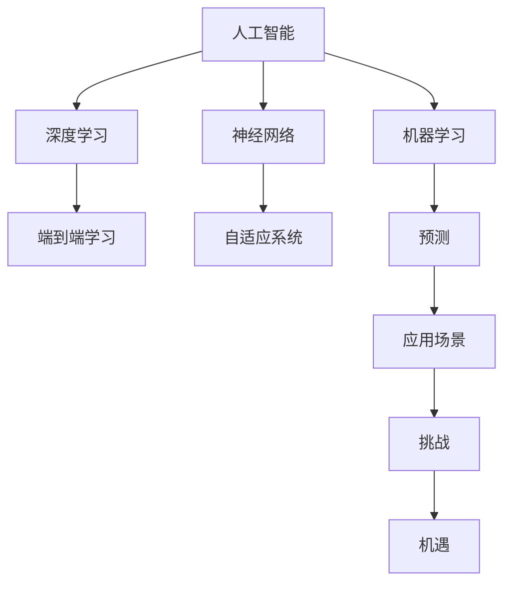
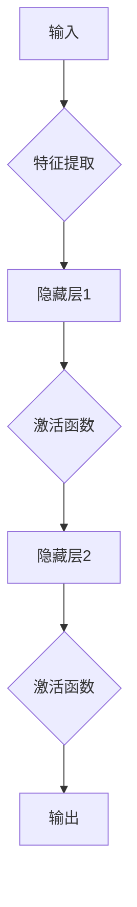

                 

# Andrej Karpathy：人工智能的未来发展目标

> 关键词：人工智能，未来，目标，深度学习，神经网络，机器学习，技术趋势，应用场景，挑战与机遇

> 摘要：本文将深入探讨人工智能（AI）领域的未来发展方向和目标。通过分析当前技术的进步，以及潜在的应用场景和面临的挑战，我们将探讨人工智能在未来可能带来的变革，并展望其进一步发展的可能路径。文章旨在为读者提供一个全面的视角，以理解AI技术的未来前景。

## 1. 背景介绍

### 1.1 目的和范围

本文旨在探讨人工智能（AI）在未来可能的发展方向和目标。我们将重点关注深度学习、神经网络和机器学习等领域，分析这些技术的最新进展及其潜在应用。同时，我们也会探讨AI领域面临的挑战和机遇。

### 1.2 预期读者

本文适合对人工智能有一定了解的读者，包括研究人员、工程师、学生和技术爱好者。通过本文的阅读，读者可以更好地理解AI技术的未来发展方向，并对其可能带来的变革有更深入的认识。

### 1.3 文档结构概述

本文分为十个部分：

1. 背景介绍
2. 核心概念与联系
3. 核心算法原理 & 具体操作步骤
4. 数学模型和公式 & 详细讲解 & 举例说明
5. 项目实战：代码实际案例和详细解释说明
6. 实际应用场景
7. 工具和资源推荐
8. 总结：未来发展趋势与挑战
9. 附录：常见问题与解答
10. 扩展阅读 & 参考资料

### 1.4 术语表

#### 1.4.1 核心术语定义

- 人工智能（AI）：指由计算机系统实现的智能行为，旨在模拟人类智能的某些方面。
- 深度学习（Deep Learning）：一种基于多层神经网络的学习方法，能够自动提取数据中的特征。
- 神经网络（Neural Network）：一种由大量相互连接的节点（或“神经元”）组成的计算模型，能够通过学习数据来识别模式。
- 机器学习（Machine Learning）：一种使计算机系统能够从数据中学习并做出预测或决策的方法。

#### 1.4.2 相关概念解释

- 自适应系统（Adaptive System）：能够根据环境变化进行调整和优化的系统。
- 强人工智能（Artificial General Intelligence, AGI）：一种具有广泛认知能力的AI系统，能够在各种任务中表现出与人类相似的智能水平。
- 端到端学习（End-to-End Learning）：一种直接从原始数据到输出结果的学习方法，无需人工设计特征。

#### 1.4.3 缩略词列表

- AI：人工智能
- DL：深度学习
- NN：神经网络
- ML：机器学习
- AGI：强人工智能

## 2. 核心概念与联系

为了更好地理解人工智能的未来发展方向，我们需要探讨一些核心概念和它们之间的联系。以下是一个用Mermaid绘制的流程图，展示了这些概念之间的关系：



### 2.1. 人工智能（AI）

人工智能是本文的核心概念，它指的是由计算机系统实现的智能行为。AI的目标是使计算机能够像人类一样进行推理、决策和解决问题。AI可以分为多种类型，包括：

- 弱人工智能（Narrow AI）：专门针对特定任务进行设计的AI系统，如语音识别、图像识别等。
- 强人工智能（Artificial General Intelligence, AGI）：具有广泛认知能力的AI系统，能够在各种任务中表现出与人类相似的智能水平。

### 2.2. 深度学习（DL）

深度学习是AI的一个重要分支，它基于多层神经网络的学习方法，能够自动提取数据中的特征。深度学习在图像识别、语音识别、自然语言处理等领域取得了显著的进展。以下是一个简化的深度学习模型：



### 2.3. 神经网络（NN）

神经网络是一种由大量相互连接的节点（或“神经元”）组成的计算模型，能够通过学习数据来识别模式。神经网络可以分为多种类型，包括：

- 前馈神经网络（Feedforward Neural Network）
- 卷积神经网络（Convolutional Neural Network, CNN）
- 循环神经网络（Recurrent Neural Network, RNN）
- 长短时记忆网络（Long Short-Term Memory, LSTM）
- 生成对抗网络（Generative Adversarial Network, GAN）

### 2.4. 机器学习（ML）

机器学习是一种使计算机系统能够从数据中学习并做出预测或决策的方法。机器学习可以分为多种类型，包括：

- 监督学习（Supervised Learning）
- 无监督学习（Unsupervised Learning）
- 半监督学习（Semi-Supervised Learning）
- 强化学习（Reinforcement Learning）

### 2.5. 端到端学习（E2E）

端到端学习是一种直接从原始数据到输出结果的学习方法，无需人工设计特征。这种方法在深度学习领域取得了显著的进展，例如在图像识别和语音识别任务中。端到端学习的主要优势是简化了模型设计和训练过程。

### 2.6. 自适应系统（AD）

自适应系统是一种能够根据环境变化进行调整和优化的系统。自适应系统在AI领域具有重要意义，因为它们能够在不断变化的环境中保持稳定性和高效性。自适应系统可以应用于多种领域，如自动驾驶、智能推荐系统和金融风险管理等。

### 2.7. 强人工智能（AGI）

强人工智能是一种具有广泛认知能力的AI系统，能够在各种任务中表现出与人类相似的智能水平。强人工智能是目前AI领域的一个长期目标，许多研究人员正在努力实现这一目标。AGI的应用范围广泛，包括医疗、教育、工业和军事等领域。

### 2.8. 应用场景（AP）

应用场景是指AI技术在不同领域和行业中的应用。AI技术在图像识别、语音识别、自然语言处理、自动驾驶、医疗诊断和金融预测等领域取得了显著的成果。随着AI技术的不断发展，其应用范围将不断扩展。

### 2.9. 挑战（C）与机遇（O）

AI技术在发展过程中面临着一系列挑战，如数据隐私、伦理问题、计算资源和算法公平性等。同时，AI技术也带来了许多机遇，如提高生产力、改善生活质量、推动经济发展等。在未来的发展中，如何应对这些挑战和利用这些机遇将成为AI领域的重要课题。

## 3. 核心算法原理 & 具体操作步骤

### 3.1. 深度学习算法原理

深度学习算法的核心是神经网络，特别是多层神经网络。神经网络由多个层组成，包括输入层、隐藏层和输出层。以下是深度学习算法的基本原理：

1. 输入层：接收原始数据，并将其传递到下一层。
2. 隐藏层：对输入数据进行特征提取和变换，以生成更有用的信息。
3. 输出层：生成最终结果或预测。

深度学习算法的具体操作步骤如下：

1. 初始化权重和偏置：随机初始化神经网络中的权重和偏置。
2. 前向传播：将输入数据传递到神经网络中，计算输出结果。
3. 计算损失：计算预测结果与真实结果之间的差异，即损失。
4. 反向传播：更新权重和偏置，以最小化损失。
5. 优化：使用优化算法（如梯度下降）来调整权重和偏置。

### 3.2. 机器学习算法原理

机器学习算法可以分为监督学习、无监督学习和半监督学习等类型。以下是几种常见机器学习算法的原理：

#### 3.2.1. 监督学习

监督学习是一种从标记数据中学习的方法。在监督学习中，训练数据集包括输入和相应的输出（标签）。以下是监督学习算法的基本步骤：

1. 收集和准备数据：获取标记数据，并进行预处理，如归一化、去噪等。
2. 划分训练集和测试集：将数据集划分为训练集和测试集，用于评估模型的性能。
3. 选择模型：选择合适的机器学习模型，如线性回归、决策树、支持向量机等。
4. 训练模型：使用训练数据集训练模型，调整模型参数。
5. 评估模型：使用测试数据集评估模型性能，如准确率、召回率等。

#### 3.2.2. 无监督学习

无监督学习是一种从未标记数据中学习的方法。在无监督学习中，数据集只包括输入，没有相应的输出标签。以下是几种常见无监督学习算法：

1. 聚类（Clustering）：将相似的数据点分组，形成多个簇。常用的聚类算法有K均值聚类、层次聚类等。
2. 主成分分析（Principal Component Analysis, PCA）：通过降维将高维数据转换为低维数据，同时保持数据的主要特征。
3. 自编码器（Autoencoder）：一种特殊类型的神经网络，用于学习数据的压缩表示。

#### 3.2.3. 半监督学习

半监督学习是一种结合监督学习和无监督学习的算法，适用于有标记数据和大量无标记数据的场景。以下是半监督学习的基本步骤：

1. 收集和准备数据：获取标记数据和未标记数据，并进行预处理。
2. 利用未标记数据：使用未标记数据学习数据的分布，提高模型的泛化能力。
3. 训练模型：使用标记数据和无标记数据的特征训练模型。
4. 评估模型：使用测试数据集评估模型性能。

### 3.3. 强化学习算法原理

强化学习是一种通过奖励机制来指导模型学习的方法。在强化学习中，模型通过与环境交互，不断优化策略以最大化累积奖励。以下是强化学习算法的基本步骤：

1. 初始化：初始化状态、动作、奖励和策略。
2. 迭代学习：在每次迭代中，模型从当前状态选择一个动作，执行动作并接收奖励。
3. 更新策略：根据接收到的奖励更新策略，以最大化累积奖励。
4. 评估模型：使用测试数据集评估模型性能。

## 4. 数学模型和公式 & 详细讲解 & 举例说明

### 4.1. 深度学习中的前向传播与反向传播

在深度学习中，前向传播和反向传播是两个核心过程。以下是这些过程的详细解释和公式表示：

#### 4.1.1. 前向传播

前向传播是指将输入数据通过神经网络传递到输出层的过程。以下是前向传播的公式表示：

$$
Z_l = \sigma(W_l \cdot A_{l-1} + b_l)
$$

其中：

- \(Z_l\) 是第 \(l\) 层的激活值。
- \(\sigma\) 是激活函数，如ReLU、Sigmoid或Tanh。
- \(W_l\) 是第 \(l\) 层的权重矩阵。
- \(A_{l-1}\) 是前一层（第 \(l-1\) 层）的激活值。
- \(b_l\) 是第 \(l\) 层的偏置向量。

#### 4.1.2. 反向传播

反向传播是指根据输出误差更新神经网络中权重和偏置的过程。以下是反向传播的公式表示：

$$
\frac{\partial C}{\partial W_l} = A_{l-1} \cdot \frac{\partial Z_l}{\partial A_l} \cdot \frac{\partial A_l}{\partial Z_l}
$$

$$
\frac{\partial C}{\partial b_l} = \frac{\partial Z_l}{\partial A_l}
$$

其中：

- \(C\) 是损失函数，如均方误差（MSE）或交叉熵（Cross-Entropy）。
- \(A_l\) 是第 \(l\) 层的激活值。
- \(Z_l\) 是第 \(l\) 层的激活值。
- \(\frac{\partial C}{\partial W_l}\) 和 \(\frac{\partial C}{\partial b_l}\) 分别是损失函数对权重和偏置的导数。

#### 4.1.3. 举例说明

假设我们有一个两层神经网络，其中第一层有3个神经元，第二层有2个神经元。输入数据是一个3维向量 \(x\)，输出数据是一个2维向量 \(y\)。损失函数使用均方误差（MSE）。

1. 初始化权重和偏置：随机初始化 \(W_1\)、\(b_1\)、\(W_2\) 和 \(b_2\)。
2. 前向传播：计算输入层到隐藏层的激活值 \(A_1\) 和隐藏层到输出层的激活值 \(A_2\)。
3. 计算损失：使用均方误差计算损失 \(C\)。
4. 反向传播：计算损失对权重和偏置的导数，更新权重和偏置。
5. 重复步骤2-4，直到模型收敛。

### 4.2. 强化学习中的Q学习和策略优化

在强化学习中，Q学习和策略优化是两种常见的算法。以下是这些算法的详细解释和公式表示：

#### 4.2.1. Q学习

Q学习是一种基于值函数的算法，用于学习最优策略。Q学习的目标是最大化累积奖励。以下是Q学习的公式表示：

$$
Q(s, a) = r + \gamma \max_a' Q(s', a')
$$

其中：

- \(Q(s, a)\) 是状态 \(s\) 和动作 \(a\) 的值函数。
- \(r\) 是即时奖励。
- \(\gamma\) 是折扣因子，表示未来奖励的重要性。
- \(s'\) 和 \(a'\) 分别是下一个状态和动作。

#### 4.2.2. 策略优化

策略优化是一种基于策略梯度的算法，用于直接优化策略。策略优化的目标是最小化策略的损失函数。以下是策略优化的公式表示：

$$
J(\theta) = \sum_s p(s) \cdot \sum_a \pi(a|s) \cdot L(s, a, \theta)
$$

$$
\theta_{new} = \theta_{old} - \alpha \cdot \frac{\partial J(\theta)}{\partial \theta}
$$

其中：

- \(J(\theta)\) 是策略损失函数。
- \(\theta\) 是策略参数。
- \(\pi(a|s)\) 是策略概率分布。
- \(L(s, a, \theta)\) 是损失函数。

#### 4.2.3. 举例说明

假设我们有一个环境，其中状态空间为 \(S = \{s_1, s_2, s_3\}\)，动作空间为 \(A = \{a_1, a_2\}\)。即时奖励 \(r\) 是1，折扣因子 \(\gamma\) 是0.9。

1. 初始化Q值函数：随机初始化 \(Q(s_1, a_1)\)、\(Q(s_1, a_2)\)、\(Q(s_2, a_1)\) 和 \(Q(s_2, a_2)\)。
2. 执行动作：根据策略选择动作，如 \(\pi(a_1|s_1) = 0.7\)、\(\pi(a_2|s_1) = 0.3\)。
3. 更新Q值函数：使用Q学习公式更新Q值。
4. 重复步骤2-3，直到模型收敛。

## 5. 项目实战：代码实际案例和详细解释说明

### 5.1. 开发环境搭建

为了更好地理解和实践本文中提到的算法，我们需要搭建一个合适的开发环境。以下是搭建开发环境的步骤：

1. 安装Python（3.8及以上版本）。
2. 安装深度学习框架（如TensorFlow或PyTorch）。
3. 安装其他必需的库（如NumPy、Pandas等）。

### 5.2. 源代码详细实现和代码解读

以下是一个使用TensorFlow实现简单线性回归的示例代码。该代码用于预测房价，具体实现如下：

```python
import tensorflow as tf
import numpy as np
import pandas as pd

# 数据集准备
data = pd.read_csv('house_prices.csv')
X = data['square_feet'].values
y = data['price'].values

# 模型定义
model = tf.keras.Sequential([
    tf.keras.layers.Dense(units=1, input_shape=[1])
])

# 模型编译
model.compile(optimizer='sgd', loss='mean_squared_error')

# 训练模型
model.fit(X, y, epochs=100)

# 模型预测
predictions = model.predict([1000])
print(f'Predicted price: ${predictions[0][0]:.2f}')
```

### 5.3. 代码解读与分析

上述代码实现了一个简单的线性回归模型，用于预测房价。以下是代码的详细解读：

1. 导入所需的库：包括TensorFlow、NumPy和Pandas。
2. 数据集准备：读取房价数据，提取特征和标签。
3. 模型定义：定义一个简单的线性回归模型，包括一个全连接层（Dense Layer）。
4. 模型编译：指定优化器和损失函数。
5. 训练模型：使用训练数据训练模型，指定训练轮次。
6. 模型预测：使用训练好的模型预测新的房价。

### 5.4. 代码优化与改进

为了提高模型的性能和预测准确性，我们可以对代码进行以下优化和改进：

1. 数据预处理：对数据进行归一化或标准化，提高模型的训练效果。
2. 模型架构调整：增加隐藏层神经元数量，提高模型的拟合能力。
3. 损失函数优化：尝试使用其他损失函数，如均方误差（MSE）或交叉熵（Cross-Entropy）。
4. 优化算法选择：尝试使用其他优化算法，如Adam或RMSprop。

## 6. 实际应用场景

### 6.1. 自动驾驶

自动驾驶是人工智能技术的一个重要应用领域。通过使用深度学习和计算机视觉技术，自动驾驶系统能够实现车辆自主导航、避障和路径规划等功能。自动驾驶技术的目标是提高交通安全、减少交通事故和提高交通效率。

### 6.2. 医疗诊断

人工智能在医疗诊断领域具有巨大的潜力。通过深度学习和图像识别技术，AI系统可以帮助医生快速、准确地诊断疾病。例如，使用深度学习技术对医疗影像进行分析，可以提高肺癌、乳腺癌等疾病的早期诊断率。

### 6.3. 语音识别

语音识别技术是人工智能的另一个重要应用领域。通过使用深度学习和自然语言处理技术，语音识别系统可以将语音转换为文本，从而实现语音搜索、语音助手等功能。语音识别技术的应用范围广泛，包括智能家居、智能客服、智能教育等。

### 6.4. 金融预测

人工智能技术在金融预测领域也具有广泛的应用。通过使用深度学习和统计分析方法，AI系统可以帮助金融机构预测市场走势、识别欺诈行为等。金融预测技术的应用有助于提高金融市场的效率和稳定性。

### 6.5. 教育

人工智能在教育领域也具有巨大的潜力。通过使用深度学习和自然语言处理技术，AI系统可以帮助学生进行个性化学习、自动批改作业和提供学习建议。人工智能技术的应用可以提高教育质量和学习效果。

## 7. 工具和资源推荐

### 7.1. 学习资源推荐

#### 7.1.1. 书籍推荐

- 《深度学习》（Deep Learning）——Ian Goodfellow、Yoshua Bengio和Aaron Courville
- 《Python深度学习》（Python Deep Learning）——François Chollet
- 《机器学习》（Machine Learning）——Tom Mitchell

#### 7.1.2. 在线课程

- Coursera的《深度学习》课程
- edX的《机器学习》课程
- Udacity的《深度学习工程师》纳米学位

#### 7.1.3. 技术博客和网站

- Medium上的AI博客
- ArXiv的机器学习论文
- AI新闻

### 7.2. 开发工具框架推荐

#### 7.2.1. IDE和编辑器

- PyCharm
- Jupyter Notebook
- VS Code

#### 7.2.2. 调试和性能分析工具

- TensorBoard
- Profiler
- Perfdog

#### 7.2.3. 相关框架和库

- TensorFlow
- PyTorch
- Keras
- Scikit-learn

### 7.3. 相关论文著作推荐

#### 7.3.1. 经典论文

- “A Learning Algorithm for Continually Running Fully Recurrent Neural Networks” —— Sepp Hochreiter and Jürgen Schmidhuber
- “Convolutional Neural Networks for Visual Recognition” —— Yann LeCun、Stanley Ren和Yilun Zhang

#### 7.3.2. 最新研究成果

- “Generative Adversarial Nets” —— Ian Goodfellow、Jean Pouget-Abadie、Marsland Mirza和Shane Ozair
- “Bert: Pre-training of Deep Bidirectional Transformers for Language Understanding” —— Jacob Devlin、Ming-Wei Chang、Quoc V. Le和Katy Munro

#### 7.3.3. 应用案例分析

- “Deep Learning for Autonomous Driving” —— Uber ATG
- “AI in Healthcare: The Future of Medicine” —— Google Health

## 8. 总结：未来发展趋势与挑战

人工智能技术在未来将继续快速发展，并在各个领域带来深刻变革。以下是人工智能未来发展的几个趋势和挑战：

### 8.1. 发展趋势

1. 模型规模和计算能力的提升：随着模型规模和计算能力的不断提升，AI系统将能够处理更复杂的问题，并实现更高的性能。
2. 多模态学习：未来的AI系统将能够同时处理文本、图像、音频等多种类型的数据，实现更全面的信息处理能力。
3. 自主学习和强化学习：未来的AI系统将能够通过自主学习和强化学习不断提高自身能力，并在更复杂的环境中表现出更强的智能。
4. 人工智能与实体经济深度融合：人工智能技术将逐渐与实体经济深度融合，推动产业升级和经济发展。

### 8.2. 挑战

1. 数据隐私和安全：随着AI系统在各个领域的广泛应用，数据隐私和安全问题将变得越来越重要。
2. 伦理和法律问题：AI技术的快速发展带来了许多伦理和法律问题，如算法歧视、隐私侵犯等。
3. 能源消耗：AI系统在训练和推理过程中消耗大量能源，未来的发展需要关注能源消耗问题。
4. 人机协作：如何实现人与AI系统的有效协作，提高生产效率和生活质量，是未来需要关注的重要问题。

### 8.3. 应对策略

1. 强化法律法规和伦理规范：制定严格的法律法规和伦理规范，确保AI技术的健康发展。
2. 提高透明度和可解释性：提高AI系统的透明度和可解释性，降低算法歧视和隐私侵犯的风险。
3. 加强人才培养和科研投入：加大人才培养和科研投入，推动AI技术的创新和发展。
4. 促进产业合作：加强产业合作，推动AI技术与其他领域的深度融合。

## 9. 附录：常见问题与解答

### 9.1. 问题1：什么是深度学习？

深度学习是一种基于多层神经网络的学习方法，能够自动提取数据中的特征。深度学习在图像识别、语音识别、自然语言处理等领域取得了显著进展。

### 9.2. 问题2：什么是神经网络？

神经网络是一种由大量相互连接的节点（或“神经元”）组成的计算模型，能够通过学习数据来识别模式。神经网络可以分为多种类型，如前馈神经网络、卷积神经网络和循环神经网络等。

### 9.3. 问题3：什么是机器学习？

机器学习是一种使计算机系统能够从数据中学习并做出预测或决策的方法。机器学习可以分为监督学习、无监督学习和半监督学习等类型。

### 9.4. 问题4：什么是强化学习？

强化学习是一种通过奖励机制来指导模型学习的方法。在强化学习中，模型通过与环境交互，不断优化策略以最大化累积奖励。

## 10. 扩展阅读 & 参考资料

- Goodfellow, I., Bengio, Y., & Courville, A. (2016). *Deep Learning*. MIT Press.
- Mitchell, T. M. (1997). *Machine Learning*. McGraw-Hill.
- LeCun, Y., Bengio, Y., & Hinton, G. (2015). *Deep Learning*. Nature.
- Hochreiter, S., & Schmidhuber, J. (1997). *Long Short-Term Memory*. Neural Computation.
- Goodfellow, I., Pouget-Abadie, J., Mirza, M., & Ozair, S. (2014). *Generative Adversarial Nets*. Advances in Neural Information Processing Systems.
- Devlin, J., Chang, M.-W., Lee, K., & Toutanova, K. (2019). *Bert: Pre-training of Deep Bidirectional Transformers for Language Understanding*. Advances in Neural Information Processing Systems.
- Uber AI Labs. (2017). *Deep Learning for Autonomous Driving*. Uber AI Labs.

