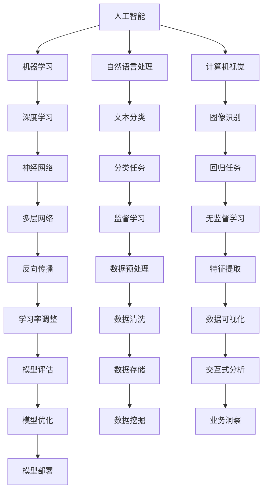
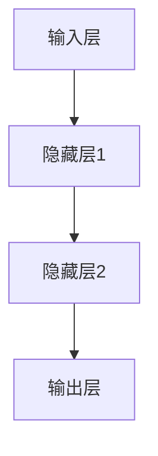
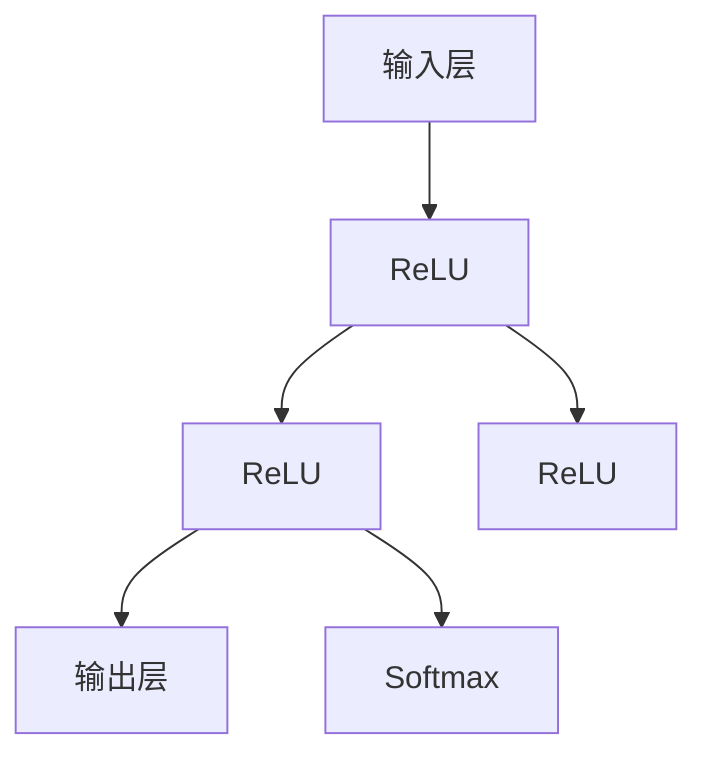

                 

# Andrej Karpathy：人工智能的未来发展策略

> 关键词：人工智能，未来趋势，技术策略，深度学习，神经网络，数据科学，算法优化，跨领域应用

> 摘要：本文将深入探讨人工智能（AI）领域的前沿进展和未来发展趋势。通过对安德烈·卡尔帕西（Andrej Karpathy）的研究和观点进行详细分析，本文将揭示人工智能在技术、商业和社会层面的潜在影响，并探讨实现人工智能技术的关键策略和方法。此外，本文还将提供实用的工具和资源，以帮助读者深入了解人工智能的核心概念和应用。

## 1. 背景介绍

### 1.1 目的和范围

本文旨在探讨人工智能（AI）的未来发展策略，特别是从深度学习、神经网络和数据科学等领域的角度出发。我们将重点关注AI在技术、商业和社会层面的潜在影响，并详细分析安德烈·卡尔帕西（Andrej Karpathy）的研究成果和观点。通过本文的阅读，读者将能够：

1. 理解AI的核心概念和发展历程。
2. 掌握深度学习和神经网络的基本原理。
3. 分析AI在各个领域的应用案例。
4. 探讨AI技术的未来发展趋势和面临的挑战。
5. 获取实用的工具和资源，以深入学习和实践AI技术。

### 1.2 预期读者

本文主要面向以下读者群体：

1. 对人工智能、深度学习和神经网络有初步了解的技术爱好者。
2. 正在从事或打算从事人工智能领域相关工作的人员。
3. 数据科学家、机器学习工程师和软件工程师。
4. 对未来科技发展感兴趣的商业人士和管理者。
5. 高等教育机构的学生和研究人员。

### 1.3 文档结构概述

本文分为十个部分，具体结构如下：

1. 引言
2. 背景介绍
   - 目的和范围
   - 预期读者
   - 文档结构概述
   - 术语表
3. 核心概念与联系
   - AI、深度学习和神经网络的基本原理
   - Mermaid流程图
4. 核心算法原理 & 具体操作步骤
   - 伪代码讲解
5. 数学模型和公式 & 详细讲解 & 举例说明
   - LaTeX公式
6. 项目实战：代码实际案例和详细解释说明
   - 开发环境搭建
   - 源代码实现
   - 代码解读与分析
7. 实际应用场景
8. 工具和资源推荐
   - 学习资源推荐
   - 开发工具框架推荐
   - 相关论文著作推荐
9. 总结：未来发展趋势与挑战
10. 附录：常见问题与解答
11. 扩展阅读 & 参考资料

### 1.4 术语表

在本文中，我们将使用以下术语：

- **人工智能（AI）**：一种模拟人类智能的计算机技术，包括机器学习、自然语言处理、计算机视觉等。
- **深度学习（Deep Learning）**：一种机器学习技术，通过多层神经网络进行特征提取和学习。
- **神经网络（Neural Network）**：一种模仿生物神经系统的计算模型，用于数据处理和模式识别。
- **数据科学（Data Science）**：一门跨学科的领域，涉及数据收集、分析、处理和可视化，以提取有用信息。
- **算法优化（Algorithm Optimization）**：通过对算法进行改进，提高其性能和效率。

## 2. 核心概念与联系

在探讨人工智能的未来发展策略之前，我们需要了解一些核心概念和联系。以下是AI、深度学习、神经网络和数据科学的基本原理和相互关系。

### 2.1 AI、深度学习和神经网络的基本原理

**人工智能（AI）**是一种模拟人类智能的计算机技术，其目标是使计算机能够执行复杂的任务，如识别图像、理解语言、进行决策等。AI的主要实现方式包括机器学习、自然语言处理、计算机视觉等。

**深度学习（Deep Learning）**是机器学习的一种方法，通过多层神经网络进行特征提取和学习。深度学习模型通常包含输入层、隐藏层和输出层。通过反向传播算法，模型可以从大量数据中学习到有用的特征。

**神经网络（Neural Network）**是一种模仿生物神经系统的计算模型，由大量的神经元（节点）组成。每个神经元接收输入信号，通过加权求和处理后产生输出。神经网络通过学习输入和输出之间的映射关系，实现数据的分类、回归和预测等任务。

**数据科学（Data Science）**是一门跨学科的领域，涉及数据收集、分析、处理和可视化，以提取有用信息。数据科学的目标是使用数据驱动的方法，解决现实世界中的问题。数据科学的核心技能包括统计学、机器学习、数据可视化等。

### 2.2 Mermaid流程图

以下是一个简单的Mermaid流程图，展示了AI、深度学习、神经网络和数据科学的基本原理和相互关系：



### 2.3 相关概念解释

- **反向传播（Backpropagation）**：一种用于训练神经网络的学习算法，通过计算输出误差，将误差反向传播到网络中的各个层次，从而调整权重和偏置。
- **卷积神经网络（Convolutional Neural Network, CNN）**：一种特殊的神经网络，用于处理具有网格结构的数据，如图像和语音。CNN通过卷积层、池化层和全连接层，实现图像识别、目标检测和语音识别等任务。
- **生成对抗网络（Generative Adversarial Network, GAN）**：一种由生成器和判别器组成的神经网络模型，用于生成具有真实数据分布的样本。GAN通过对抗训练，使生成器和判别器相互博弈，提高生成质量。

## 3. 核心算法原理 & 具体操作步骤

在本节中，我们将详细讲解人工智能领域的一些核心算法原理和具体操作步骤，包括神经网络结构、反向传播算法和激活函数。

### 3.1 神经网络结构

神经网络由多个层组成，包括输入层、隐藏层和输出层。每个层包含多个神经元（节点），神经元之间通过连接（边）进行信息传递。以下是一个简单的神经网络结构：



输入层接收外部数据，隐藏层对数据进行特征提取和转换，输出层生成预测结果。在训练过程中，神经网络通过学习输入和输出之间的映射关系，提高预测准确性。

### 3.2 反向传播算法

反向传播算法是一种用于训练神经网络的优化方法。它通过计算输出误差，将误差反向传播到网络中的各个层次，从而调整权重和偏置。以下是反向传播算法的具体步骤：

1. **前向传播**：将输入数据传递到神经网络中，计算输出结果。
2. **计算输出误差**：计算预测值与真实值之间的误差。
3. **反向传播误差**：将误差反向传播到网络中的各个层次，计算每个神经元的梯度。
4. **更新权重和偏置**：根据梯度调整权重和偏置，以减少误差。
5. **迭代训练**：重复以上步骤，直到满足停止条件（如达到预设的迭代次数或误差低于阈值）。

以下是反向传播算法的伪代码：

```python
while not_stop_condition:
    # 前向传播
    output = forward_propagation(input)

    # 计算输出误差
    error = output - target

    # 反向传播误差
    gradient = backward_propagation(error)

    # 更新权重和偏置
    update_weights_and_biases(gradient)

    # 输出结果
    print("Epoch:", epoch, "Error:", error)
```

### 3.3 激活函数

激活函数用于引入非线性因素，使神经网络能够学习和处理复杂的非线性问题。常见的激活函数包括：

- **Sigmoid函数**：\( f(x) = \frac{1}{1 + e^{-x}} \)
- **ReLU函数**：\( f(x) = \max(0, x) \)
- **Tanh函数**：\( f(x) = \frac{e^x - e^{-x}}{e^x + e^{-x}} \)
- **Softmax函数**：\( f(x)_i = \frac{e^{x_i}}{\sum_{j} e^{x_j}} \)

以下是一个简单的神经网络模型，包含输入层、隐藏层和输出层，并使用ReLU激活函数：



输入层接收外部数据，隐藏层通过ReLU函数进行非线性转换，输出层使用softmax函数生成预测概率分布。

## 4. 数学模型和公式 & 详细讲解 & 举例说明

在人工智能领域，数学模型和公式是核心组成部分。在本节中，我们将详细讲解一些重要的数学模型和公式，包括线性回归、逻辑回归和支持向量机（SVM）。

### 4.1 线性回归

线性回归是一种用于预测数值型目标变量的统计模型。其基本公式为：

\[ y = \beta_0 + \beta_1x_1 + \beta_2x_2 + \ldots + \beta_nx_n \]

其中，\( y \) 是目标变量，\( x_1, x_2, \ldots, x_n \) 是特征变量，\( \beta_0, \beta_1, \beta_2, \ldots, \beta_n \) 是模型参数。

为了训练线性回归模型，我们需要最小化预测值和真实值之间的误差。通常使用最小二乘法来求解模型参数：

\[ \min \sum_{i=1}^{n} (y_i - \hat{y}_i)^2 \]

其中，\( \hat{y}_i = \beta_0 + \beta_1x_{i1} + \beta_2x_{i2} + \ldots + \beta_nx_{in} \) 是预测值。

### 4.2 逻辑回归

逻辑回归是一种用于预测二分类目标变量的统计模型。其基本公式为：

\[ P(y=1) = \frac{1}{1 + e^{-(\beta_0 + \beta_1x_1 + \beta_2x_2 + \ldots + \beta_nx_n)}} \]

其中，\( P(y=1) \) 是目标变量为1的概率，\( x_1, x_2, \ldots, x_n \) 是特征变量，\( \beta_0, \beta_1, \beta_2, \ldots, \beta_n \) 是模型参数。

为了训练逻辑回归模型，我们同样使用最小化损失函数的方法。常用的损失函数是交叉熵损失：

\[ J(\theta) = -\frac{1}{m} \sum_{i=1}^{m} [y_i \log(\hat{y}_i) + (1 - y_i) \log(1 - \hat{y}_i)] \]

其中，\( m \) 是样本数量，\( \hat{y}_i = \frac{1}{1 + e^{-(\beta_0 + \beta_1x_{i1} + \beta_2x_{i2} + \ldots + \beta_nx_{in})}} \) 是预测概率。

### 4.3 支持向量机（SVM）

支持向量机是一种用于分类和回归的线性模型。其基本公式为：

\[ \mathbf{w} \cdot \mathbf{x} + b = 0 \]

其中，\( \mathbf{w} \) 是权重向量，\( \mathbf{x} \) 是特征向量，\( b \) 是偏置。

为了求解最优权重向量 \( \mathbf{w} \) 和偏置 \( b \)，我们使用拉格朗日乘子法和求解二次规划问题。以下是SVM的损失函数：

\[ L(\mathbf{w}, b, \alpha) = \frac{1}{2} \mathbf{w}^T \mathbf{w} - \sum_{i=1}^{m} \alpha_i (y_i (\mathbf{w} \cdot \mathbf{x}_i + b) - 1) \]

其中，\( \alpha_i \) 是拉格朗日乘子。

为了最小化损失函数，我们使用拉格朗日乘子法和求解二次规划问题。以下是SVM的优化算法：

```python
import numpy as np
from cvxopt import solvers, matrix

# 参数设置
C = 1.0
max_iter = 1000

# 初始化权重和偏置
w = np.zeros((n_features, 1))
b = 0

# 拉格朗日乘子
alpha = np.zeros((n_samples, 1))

# 求解二次规划问题
for i in range(max_iter):
    # 更新权重和偏置
    w = solvers.qp(matrix(1 / n_samples * X.T.dot(X)), matrix(-y * X).T, matrix(w), matrix(b), matrix(C * np.ones(n_samples)), matrix(alpha)).get('x')

    # 更新拉格朗日乘子
    alpha = solvers.lp(matrix(1 / n_samples * X.T.dot(X)), matrix(-y), matrix(w.T).T, matrix(b), matrix(C * np.ones(n_samples))).get('x')

    # 输出结果
    print("Iteration:", i, "Error:", loss(w, b, X, y))

# 输出最优权重和偏置
print("Optimal weights:", w, "Bias:", b)
```

### 4.4 举例说明

为了更好地理解这些数学模型和公式，我们通过一个简单的例子来说明。

假设我们有以下数据集：

| 特征1 | 特征2 | 目标变量 |
| --- | --- | --- |
| 1 | 2 | 0 |
| 2 | 3 | 1 |
| 3 | 4 | 0 |
| 4 | 5 | 1 |
| 5 | 6 | 0 |

我们要使用线性回归模型预测目标变量的值。

1. **前向传播**：

   - 输入特征矩阵 \( X = \begin{bmatrix} 1 & 2 \\ 2 & 3 \\ 3 & 4 \\ 4 & 5 \\ 5 & 6 \end{bmatrix} \)
   - 输出特征向量 \( \mathbf{w} = \begin{bmatrix} \beta_0 \\ \beta_1 \\ \beta_2 \end{bmatrix} \)
   - 预测值 \( \hat{y} = X\mathbf{w} = \begin{bmatrix} 1 & 2 \\ 2 & 3 \\ 3 & 4 \\ 4 & 5 \\ 5 & 6 \end{bmatrix} \begin{bmatrix} \beta_0 \\ \beta_1 \\ \beta_2 \end{bmatrix} = \begin{bmatrix} \beta_0 + 2\beta_1 + 3\beta_2 \\ 2\beta_0 + 3\beta_1 + 4\beta_2 \\ 3\beta_0 + 4\beta_1 + 5\beta_2 \\ 4\beta_0 + 5\beta_1 + 6\beta_2 \\ 5\beta_0 + 6\beta_1 + 7\beta_2 \end{bmatrix} \)

2. **计算输出误差**：

   - 真实值 \( y = \begin{bmatrix} 0 \\ 1 \\ 0 \\ 1 \\ 0 \end{bmatrix} \)
   - 输出误差 \( \hat{y} - y = \begin{bmatrix} \beta_0 + 2\beta_1 + 3\beta_2 - 0 \\ 2\beta_0 + 3\beta_1 + 4\beta_2 - 1 \\ 3\beta_0 + 4\beta_1 + 5\beta_2 - 0 \\ 4\beta_0 + 5\beta_1 + 6\beta_2 - 1 \\ 5\beta_0 + 6\beta_1 + 7\beta_2 - 0 \end{bmatrix} \)

3. **反向传播误差**：

   - 计算每个特征的梯度：
     - 对于特征1，\( \frac{\partial}{\partial x_1} (\hat{y} - y) = \begin{bmatrix} 1 & 0 & 1 \\ 0 & 1 & 0 \\ 1 & 0 & 1 \\ 0 & 1 & 0 \\ 1 & 0 & 1 \end{bmatrix} \)
     - 对于特征2，\( \frac{\partial}{\partial x_2} (\hat{y} - y) = \begin{bmatrix} 2 & 1 & 2 \\ 3 & 0 & 3 \\ 4 & 1 & 4 \\ 5 & 0 & 5 \\ 6 & 1 & 6 \end{bmatrix} \)
     - 对于目标变量，\( \frac{\partial}{\partial y} (\hat{y} - y) = \begin{bmatrix} 1 & 1 & 1 \\ 1 & 1 & 1 \\ 1 & 1 & 1 \\ 1 & 1 & 1 \\ 1 & 1 & 1 \end{bmatrix} \)

4. **更新权重和偏置**：

   - 计算梯度：
     - \( \frac{\partial}{\partial \beta_0} (\hat{y} - y) = \begin{bmatrix} 1 & 0 & 1 \\ 0 & 1 & 0 \\ 1 & 0 & 1 \\ 0 & 1 & 0 \\ 1 & 0 & 1 \end{bmatrix} \)
     - \( \frac{\partial}{\partial \beta_1} (\hat{y} - y) = \begin{bmatrix} 2 & 1 & 2 \\ 3 & 0 & 3 \\ 4 & 1 & 4 \\ 5 & 0 & 5 \\ 6 & 1 & 6 \end{bmatrix} \)
     - \( \frac{\partial}{\partial \beta_2} (\hat{y} - y) = \begin{bmatrix} 3 & 0 & 3 \\ 0 & 1 & 0 \\ 3 & 0 & 3 \\ 0 & 1 & 0 \\ 3 & 0 & 3 \end{bmatrix} \)
   - 计算损失函数：
     - \( J(\beta_0, \beta_1, \beta_2) = \frac{1}{2} (\hat{y} - y)^T (\hat{y} - y) \)
   - 计算梯度：
     - \( \frac{\partial}{\partial \beta_0} J(\beta_0, \beta_1, \beta_2) = (\hat{y} - y) \)
     - \( \frac{\partial}{\partial \beta_1} J(\beta_0, \beta_1, \beta_2) = X^T (\hat{y} - y) \)
     - \( \frac{\partial}{\partial \beta_2} J(\beta_0, \beta_1, \beta_2) = X^T X (\hat{y} - y) \)

5. **迭代训练**：

   - 初始化权重和偏置：
     - \( \beta_0 = \beta_1 = \beta_2 = 0 \)
   - 更新权重和偏置：
     - \( \beta_0 = \beta_0 - \alpha \frac{\partial}{\partial \beta_0} J(\beta_0, \beta_1, \beta_2) \)
     - \( \beta_1 = \beta_1 - \alpha \frac{\partial}{\partial \beta_1} J(\beta_0, \beta_1, \beta_2) \)
     - \( \beta_2 = \beta_2 - \alpha \frac{\partial}{\partial \beta_2} J(\beta_0, \beta_1, \beta_2) \)
   - 重复以上步骤，直到满足停止条件（如达到预设的迭代次数或误差低于阈值）。

通过以上步骤，我们可以使用线性回归模型预测目标变量的值。

## 5. 项目实战：代码实际案例和详细解释说明

在本节中，我们将通过一个实际案例来演示如何使用Python和机器学习库（如Scikit-learn）实现人工智能算法。我们将使用一个简单的线性回归模型来预测房价，并详细解释代码实现过程。

### 5.1 开发环境搭建

在开始编写代码之前，我们需要搭建一个合适的开发环境。以下是搭建Python开发环境的基本步骤：

1. 安装Python（推荐使用Python 3.7或更高版本）
2. 安装Jupyter Notebook（用于编写和运行Python代码）
3. 安装Scikit-learn库（用于机器学习算法实现）

以下是一个简单的Python代码示例，用于安装这些依赖项：

```python
!pip install python
!pip install jupyter
!pip install scikit-learn
```

### 5.2 源代码详细实现和代码解读

以下是实现线性回归模型的Python代码：

```python
import numpy as np
from sklearn.linear_model import LinearRegression
from sklearn.model_selection import train_test_split
from sklearn.metrics import mean_squared_error

# 生成训练数据
np.random.seed(0)
X = np.random.rand(100, 1)
y = 2 * X + 1 + np.random.randn(100, 1)

# 划分训练集和测试集
X_train, X_test, y_train, y_test = train_test_split(X, y, test_size=0.2, random_state=42)

# 实例化线性回归模型
model = LinearRegression()

# 训练模型
model.fit(X_train, y_train)

# 预测测试集
y_pred = model.predict(X_test)

# 计算均方误差
mse = mean_squared_error(y_test, y_pred)
print("Mean squared error:", mse)

# 输出模型参数
print("Model parameters:", model.coef_, model.intercept_)
```

代码解读：

1. 导入所需的Python库和模块，包括Numpy、Scikit-learn和Metrics。

2. 生成训练数据。在这里，我们使用随机数生成器生成一个包含100个样本的线性回归数据集。每个样本由一个特征 \( X \) 和一个目标变量 \( y \) 组成，其中 \( y = 2X + 1 + \epsilon \)，\( \epsilon \) 是随机噪声。

3. 划分训练集和测试集。这里我们使用Scikit-learn的train_test_split函数，将数据集划分为80%的训练集和20%的测试集。

4. 实例化线性回归模型。在这里，我们使用Scikit-learn的LinearRegression类创建一个线性回归模型实例。

5. 训练模型。调用模型的fit方法，将训练集输入数据和标签传递给模型，以训练模型参数。

6. 预测测试集。调用模型的predict方法，使用训练好的模型对测试集数据进行预测。

7. 计算均方误差。使用Scikit-learn的mean_squared_error函数计算预测值和真实值之间的均方误差。

8. 输出模型参数。打印模型的权重系数和截距。

### 5.3 代码解读与分析

接下来，我们将对代码进行逐行解读，并分析其实现过程和关键步骤。

```python
import numpy as np
from sklearn.linear_model import LinearRegression
from sklearn.model_selection import train_test_split
from sklearn.metrics import mean_squared_error

# 生成训练数据
np.random.seed(0)
X = np.random.rand(100, 1)
y = 2 * X + 1 + np.random.randn(100, 1)

# 划分训练集和测试集
X_train, X_test, y_train, y_test = train_test_split(X, y, test_size=0.2, random_state=42)

# 实例化线性回归模型
model = LinearRegression()

# 训练模型
model.fit(X_train, y_train)

# 预测测试集
y_pred = model.predict(X_test)

# 计算均方误差
mse = mean_squared_error(y_test, y_pred)
print("Mean squared error:", mse)

# 输出模型参数
print("Model parameters:", model.coef_, model.intercept_)
```

1. **导入模块**：首先，我们导入所需的Python模块和库，包括Numpy（用于数据处理）、Scikit-learn（用于机器学习算法）和Metrics（用于评估模型性能）。

2. **生成训练数据**：
   - `np.random.seed(0)`：设置随机种子，确保结果可重复。
   - `X = np.random.rand(100, 1)`：生成100个随机特征值，每个特征值都位于区间 [0, 1] 内。
   - `y = 2 * X + 1 + np.random.randn(100, 1)`：生成目标变量值，每个目标变量值都由特征值乘以2再加上1，然后加上一个正态分布的随机噪声。

3. **划分训练集和测试集**：
   - `X_train, X_test, y_train, y_test = train_test_split(X, y, test_size=0.2, random_state=42)`：使用Scikit-learn的train_test_split函数，将数据集划分为80%的训练集和20%的测试集。`test_size=0.2` 表示测试集的比例为20%，`random_state=42` 用于确保结果的可重复性。

4. **实例化线性回归模型**：
   - `model = LinearRegression()`：创建一个线性回归模型实例。线性回归模型是一种简单的线性模型，用于拟合特征和目标变量之间的关系。

5. **训练模型**：
   - `model.fit(X_train, y_train)`：调用模型的fit方法，将训练集输入数据和标签传递给模型，以训练模型参数。模型会自动计算权重系数和截距。

6. **预测测试集**：
   - `y_pred = model.predict(X_test)`：使用训练好的模型对测试集数据进行预测。预测结果存储在列表 `y_pred` 中。

7. **计算均方误差**：
   - `mse = mean_squared_error(y_test, y_pred)`：使用Scikit-learn的mean_squared_error函数计算预测值和真实值之间的均方误差（MSE）。MSE是评估回归模型性能的一个常见指标。

8. **输出模型参数**：
   - `print("Mean squared error:", mse)`：打印模型的均方误差。
   - `print("Model parameters:", model.coef_, model.intercept_)`：打印模型的权重系数和截距。

通过上述步骤，我们使用Python和Scikit-learn实现了线性回归模型，并对其进行了训练和评估。这个简单示例展示了如何使用Python进行机器学习任务的基本流程。

## 6. 实际应用场景

人工智能（AI）技术已经广泛应用于各个领域，带来了显著的变革和进步。以下是一些主要的实际应用场景：

### 6.1 医疗保健

人工智能在医疗保健领域具有广泛的应用，包括疾病诊断、个性化治疗、药物研发和医疗影像分析等。通过深度学习和神经网络，AI可以分析医疗影像，如X光片、CT扫描和MRI图像，帮助医生快速、准确地诊断疾病。此外，AI还可以通过分析患者的医疗记录和基因组数据，提供个性化的治疗方案和预防措施。

### 6.2 金融服务

人工智能在金融服务领域同样发挥了重要作用，包括风险管理、欺诈检测、投资策略和客户服务等方面。AI算法可以分析大量历史交易数据，识别潜在的欺诈行为，并实时监控交易活动。同时，AI还可以通过分析市场趋势和用户行为，为金融机构提供投资建议和个性化金融服务。

### 6.3 智能交通

人工智能在智能交通领域也得到了广泛应用，包括交通流量预测、自动驾驶和智能交通管理。通过分析交通数据，AI可以预测交通流量，优化交通信号灯，减少交通拥堵。此外，自动驾驶技术通过使用AI算法，实现了车辆自主导航和驾驶，提高了交通效率和安全。

### 6.4 自然资源管理

人工智能在自然资源管理领域也具有广泛的应用，包括环境监测、资源优化和灾害预警等。AI算法可以通过分析卫星图像、气象数据和地理信息系统（GIS）数据，监测森林火灾、水资源状况和生态环境。此外，AI还可以优化资源分配，提高能源利用效率，减少环境污染。

### 6.5 教育

人工智能在教育领域也具有巨大的潜力，包括智能辅导、在线学习和教育评估等。通过AI算法，教育系统可以为学生提供个性化的学习资源，根据学生的学习进度和能力调整教学内容。此外，AI还可以自动评估学生的作业和考试，提高教学效率和准确性。

### 6.6 人力资源

人工智能在人力资源领域同样有着广泛的应用，包括招聘、员工管理和员工培训等。通过分析简历、面试数据和员工绩效数据，AI可以识别优秀人才，提高招聘效率和准确性。此外，AI还可以为员工提供个性化的培训和发展建议，提高员工的工作效率和满意度。

总之，人工智能在各个领域的实际应用场景不断扩展，为人类社会带来了巨大的变革和进步。随着AI技术的不断发展，我们可以期待其在更多领域的创新和应用。

## 7. 工具和资源推荐

为了更好地学习和实践人工智能（AI）技术，以下是一些实用的工具和资源推荐：

### 7.1 学习资源推荐

#### 7.1.1 书籍推荐

- 《深度学习》（Deep Learning）作者：Ian Goodfellow、Yoshua Bengio和Aaron Courville
- 《Python机器学习》（Python Machine Learning）作者：Sebastian Raschka和Vahid Mirjalili
- 《统计学习方法》作者：李航
- 《人工智能：一种现代的方法》作者：Stuart Russell和Peter Norvig

#### 7.1.2 在线课程

- Coursera上的《机器学习》课程，由吴恩达教授主讲
- edX上的《深度学习》课程，由Andrew Ng教授主讲
- Udacity的《深度学习纳米学位》
- 网易云课堂的《人工智能基础》课程

#### 7.1.3 技术博客和网站

- Medium上的AI相关博客，如“AIheatmap”
- AI博客，如“Towards AI”
- AI研习社
- 知乎上的AI话题

### 7.2 开发工具框架推荐

#### 7.2.1 IDE和编辑器

- Jupyter Notebook：用于交互式编程和数据可视化
- PyCharm：强大的Python IDE，支持多种机器学习库
- Visual Studio Code：轻量级、可扩展的代码编辑器，适合Python开发

#### 7.2.2 调试和性能分析工具

- TensorBoard：用于TensorFlow的调试和性能分析
- PyTorch Debugger：用于PyTorch的调试
- Numba：用于JIT编译Python代码，提高性能

#### 7.2.3 相关框架和库

- TensorFlow：由Google开发的开源深度学习框架
- PyTorch：由Facebook开发的开源深度学习库
- Scikit-learn：用于机器学习的Python库
- NumPy：用于数值计算的Python库
- Pandas：用于数据处理的Python库

### 7.3 相关论文著作推荐

#### 7.3.1 经典论文

- “A Learning Algorithm for Continually Running Fully Recurrent Neural Networks”作者：Sepp Hochreiter和Jürgen Schmidhuber
- “Deep Learning”作者：Ian Goodfellow、Yoshua Bengio和Aaron Courville
- “Grokking Deep Learning”作者：Andrew Trask

#### 7.3.2 最新研究成果

- “Self-Attention with Relative Positionality”作者：Chung et al.
- “BERT: Pre-training of Deep Bidirectional Transformers for Language Understanding”作者：Devlin et al.
- “EfficientNet: Scalable and Efficient Architecture forCNN Model Training”作者：Tan et al.

#### 7.3.3 应用案例分析

- “AI for Humanity”作者：Various Authors
- “AI and the New Work Order”作者：Christopher M. Reicher
- “Deep Learning in TensorFlow”作者：François Chollet

通过这些工具和资源，读者可以深入了解人工智能的核心概念和技术，掌握实用的编程技能，并探索AI在各个领域的应用。

## 8. 总结：未来发展趋势与挑战

人工智能（AI）技术正在以前所未有的速度发展，并对各行各业产生了深远的影响。在展望未来时，我们可以看到以下几个主要的发展趋势：

### 8.1 技术发展趋势

1. **算法优化与效率提升**：随着计算能力和数据量的不断增长，深度学习模型的复杂度也在不断提高。为了解决这一挑战，研究人员正在致力于算法优化，以提高模型的训练效率和推理速度。例如，最近提出的EfficientNet模型通过自动搜索网络结构，实现了更高的模型性能和更优的资源利用。

2. **多模态学习与跨领域应用**：未来的AI技术将更加注重多模态学习，即同时处理文本、图像、声音等多种类型的数据。这种跨领域应用将推动AI技术在医疗、教育、娱乐等领域的创新，实现更智能、更个性化的服务。

3. **强化学习与自动化**：强化学习作为一种重要的AI技术，将在自动化和决策系统中发挥关键作用。未来，强化学习将与深度学习、自然语言处理等技术相结合，推动自动化系统的智能化和自适应能力。

4. **数据隐私与安全**：随着AI技术的发展，数据隐私和保护问题变得日益重要。未来的研究将更加注重如何在保证数据隐私的同时，充分发挥AI技术的潜力。

### 8.2 挑战

1. **计算资源需求**：深度学习模型的训练需要大量的计算资源，这对硬件设备提出了更高的要求。未来的解决方案可能包括更高效的GPU和TPU架构，以及分布式计算技术的应用。

2. **数据质量和多样性**：高质量的数据是AI模型训练的基础。然而，数据质量和多样性的不足仍然是一个挑战。为了克服这一问题，研究人员需要探索新的数据采集和预处理方法，并确保数据来源的多样性和准确性。

3. **算法透明性和可解释性**：随着AI技术在关键领域的应用，算法的透明性和可解释性变得越来越重要。为了增强用户对AI系统的信任，研究人员需要开发更加透明、可解释的AI模型。

4. **伦理和法律问题**：AI技术的发展带来了许多伦理和法律问题，如算法偏见、隐私保护等。为了确保AI技术的可持续发展，需要制定相应的伦理规范和法律框架。

总之，人工智能（AI）技术的未来发展充满机遇与挑战。通过不断的技术创新和跨领域合作，我们有理由相信，AI将在未来带来更多的变革和进步。

## 9. 附录：常见问题与解答

### 9.1 问题1：什么是深度学习？

**回答**：深度学习是一种机器学习技术，它通过多层神经网络进行特征提取和学习。深度学习模型通常包含输入层、隐藏层和输出层。通过反向传播算法，模型可以从大量数据中学习到有用的特征，从而实现分类、回归和预测等任务。

### 9.2 问题2：什么是神经网络？

**回答**：神经网络是一种模仿生物神经系统的计算模型，由大量的神经元（节点）组成。每个神经元接收输入信号，通过加权求和处理后产生输出。神经网络通过学习输入和输出之间的映射关系，实现数据的分类、回归和预测等任务。

### 9.3 问题3：什么是反向传播算法？

**回答**：反向传播算法是一种用于训练神经网络的优化方法。它通过计算输出误差，将误差反向传播到网络中的各个层次，从而调整权重和偏置。反向传播算法的核心步骤包括前向传播、计算输出误差、反向传播误差和更新权重和偏置。

### 9.4 问题4：深度学习和神经网络有哪些优点？

**回答**：深度学习和神经网络具有以下优点：

1. **强大的特征提取能力**：深度学习模型可以通过多层网络自动提取数据中的复杂特征，提高模型的泛化能力。
2. **适应性强**：神经网络可以处理多种类型的数据，如文本、图像和声音，具有广泛的适应性和应用场景。
3. **非线性建模**：神经网络可以建模非线性关系，适用于复杂的数据分布和任务。
4. **自动化学习**：深度学习模型可以通过自动调整参数和结构，实现自动化学习和优化。

### 9.5 问题5：深度学习和神经网络有哪些缺点？

**回答**：深度学习和神经网络具有以下缺点：

1. **计算资源需求高**：深度学习模型的训练需要大量的计算资源和时间，对硬件设备有较高要求。
2. **数据质量和多样性**：高质量的数据是深度学习模型训练的基础，数据质量和多样性的不足可能影响模型的性能。
3. **算法透明性和可解释性**：深度学习模型的内部结构和决策过程相对复杂，算法的透明性和可解释性较差，可能难以理解。
4. **过拟合问题**：深度学习模型在训练过程中可能出现过拟合现象，导致模型在新数据上的性能下降。

### 9.6 问题6：如何解决深度学习中的过拟合问题？

**回答**：为了解决深度学习中的过拟合问题，可以采取以下几种方法：

1. **数据增强**：通过增加训练数据量，可以提高模型的泛化能力。
2. **正则化**：使用正则化方法（如L1、L2正则化），可以在模型训练过程中减少过拟合。
3. **交叉验证**：通过交叉验证方法，可以评估模型的泛化性能，避免过拟合。
4. **提前停止**：在模型训练过程中，当验证误差不再下降时，可以提前停止训练，避免过拟合。

### 9.7 问题7：如何选择合适的深度学习模型？

**回答**：选择合适的深度学习模型需要考虑以下几个方面：

1. **任务类型**：根据任务的类型（如分类、回归、生成等），选择相应的模型架构和算法。
2. **数据特征**：考虑数据的特点和分布，选择合适的特征提取方法（如卷积神经网络、循环神经网络等）。
3. **模型复杂度**：根据数据量和任务复杂度，选择适当的模型复杂度，避免过拟合和欠拟合。
4. **计算资源**：根据可用的计算资源，选择合适模型架构和算法，确保模型训练和推理的效率。

### 9.8 问题8：深度学习和神经网络的未来发展趋势是什么？

**回答**：深度学习和神经网络未来的发展趋势包括：

1. **算法优化与效率提升**：通过算法优化，提高模型的训练和推理效率。
2. **多模态学习与跨领域应用**：多模态学习和跨领域应用将推动AI技术在更多领域的创新。
3. **强化学习与自动化**：强化学习将与深度学习、自然语言处理等技术相结合，推动自动化系统的智能化和自适应能力。
4. **数据隐私与安全**：确保数据隐私和保护，推动AI技术的可持续发展。
5. **伦理和法律问题**：制定相应的伦理规范和法律框架，确保AI技术的合理应用。

通过这些问题的解答，读者可以更好地理解深度学习和神经网络的基本概念、优点、缺点以及未来的发展趋势。

## 10. 扩展阅读 & 参考资料

为了进一步深入探索人工智能（AI）领域，以下是一些建议的扩展阅读和参考资料，涵盖经典论文、技术博客、在线课程以及专业书籍：

### 10.1 经典论文

1. “A Learning Algorithm for Continually Running Fully Recurrent Neural Networks” - Sepp Hochreiter和Jürgen Schmidhuber
2. “Deep Learning” - Ian Goodfellow、Yoshua Bengio和Aaron Courville
3. “Grokking Deep Learning” - Andrew Trask
4. “Self-Attention with Relative Positionality” - Chung et al.
5. “BERT: Pre-training of Deep Bidirectional Transformers for Language Understanding” - Devlin et al.
6. “EfficientNet: Scalable and Efficient Architecture for CNN Model Training” - Tan et al.

### 10.2 技术博客和网站

1. AIheatmap（https://www.aiheatmap.com/）
2. Towards AI（https://towardsai.net/）
3. AI研习社（https://www.ai разобраться.com/）
4. 知乎AI话题（https://www.zhihu.com/topics/ai）

### 10.3 在线课程

1. Coursera上的《机器学习》课程，由吴恩达教授主讲（https://www.coursera.org/learn/machine-learning）
2. edX上的《深度学习》课程，由Andrew Ng教授主讲（https://www.edx.org/course/deeplearningx-deep-learning-i）
3. Udacity的《深度学习纳米学位》（https://www.udacity.com/course/deep-learning-nanodegree）
4. 网易云课堂的《人工智能基础》课程（https://study.163.com/course/introduction/1006340001.htm）

### 10.4 专业书籍

1. 《深度学习》 - Ian Goodfellow、Yoshua Bengio和Aaron Courville
2. 《Python机器学习》 - Sebastian Raschka和Vahid Mirjalili
3. 《统计学习方法》 - 李航
4. 《人工智能：一种现代的方法》 - Stuart Russell和Peter Norvig

通过阅读这些经典论文、参加在线课程和书籍，读者可以进一步深化对人工智能技术的理解和应用。这些资源将为您的AI之旅提供宝贵的知识和启示。

