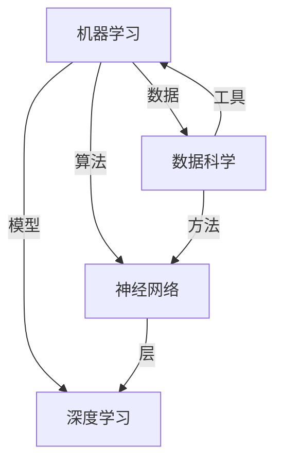

                 

### 1. 背景介绍

#### 1.1 目的和范围

本文的目的是探讨人工智能的未来发展策略。随着人工智能技术的不断进步和应用范围的不断扩大，人工智能已经成为了推动社会发展的关键力量。本文将从多个角度出发，分析人工智能在各个领域中的应用、面临的挑战以及未来的发展趋势。

本文的范围涵盖以下几个方面：

1. **人工智能的核心概念与联系**：首先，我们将介绍人工智能的核心概念，如机器学习、深度学习、神经网络等，并使用Mermaid流程图展示这些概念之间的联系。

2. **核心算法原理与具体操作步骤**：接着，我们将详细讲解人工智能中的核心算法原理，并使用伪代码来描述具体操作步骤。

3. **数学模型和公式**：人工智能的发展离不开数学模型和公式。本文将介绍一些关键的数学模型和公式，并提供详细的讲解和举例说明。

4. **项目实战**：为了更好地理解人工智能的实际应用，我们将分析一个具体的代码案例，并进行详细的解释和说明。

5. **实际应用场景**：接下来，我们将探讨人工智能在各个领域的应用场景，如自动驾驶、医疗健康、金融科技等。

6. **工具和资源推荐**：为了帮助读者更好地学习和应用人工智能技术，我们将推荐一些学习资源、开发工具框架和相关论文著作。

7. **总结与未来趋势**：最后，我们将总结人工智能的未来发展趋势和面临的挑战，为读者提供一个全面的视角。

#### 1.2 预期读者

本文适合对人工智能技术有一定了解的读者，包括：

1. **人工智能研究者**：希望通过本文更深入地了解人工智能的发展策略和技术细节。

2. **程序员和工程师**：希望通过本文学习人工智能在实际应用中的实现方法和技巧。

3. **数据科学家和机器学习工程师**：希望掌握人工智能领域的最新动态和技术趋势。

4. **相关领域的专业人士**：希望了解人工智能在各个领域的应用和前景。

#### 1.3 文档结构概述

本文的结构如下：

1. **背景介绍**：介绍文章的目的、范围、预期读者和文档结构。

2. **核心概念与联系**：介绍人工智能的核心概念，如机器学习、深度学习、神经网络等，并使用Mermaid流程图展示它们之间的联系。

3. **核心算法原理与具体操作步骤**：详细讲解人工智能中的核心算法原理，并使用伪代码描述具体操作步骤。

4. **数学模型和公式**：介绍关键的数学模型和公式，并提供详细的讲解和举例说明。

5. **项目实战**：分析一个具体的代码案例，并进行详细的解释和说明。

6. **实际应用场景**：探讨人工智能在各个领域的应用场景。

7. **工具和资源推荐**：推荐学习资源、开发工具框架和相关论文著作。

8. **总结与未来趋势**：总结人工智能的未来发展趋势和面临的挑战。

#### 1.4 术语表

为了确保读者能够更好地理解本文内容，以下是一些关键术语的定义和解释：

##### 1.4.1 核心术语定义

- **人工智能**（Artificial Intelligence，AI）：模拟人类智能的技术和系统，包括机器学习、深度学习、自然语言处理等。

- **机器学习**（Machine Learning，ML）：使计算机通过数据学习并做出决策或预测的技术。

- **深度学习**（Deep Learning，DL）：基于多层神经网络的机器学习技术。

- **神经网络**（Neural Network，NN）：模拟人脑神经元连接结构的计算模型。

- **数据科学**（Data Science，DS）：使用数学、统计、计算机科学等方法来分析数据和提取知识的领域。

- **算法**（Algorithm）：解决问题的一系列规则和步骤。

- **模型**（Model）：用于表示现实世界或问题的数学或计算结构。

##### 1.4.2 相关概念解释

- **监督学习**（Supervised Learning）：通过标注数据进行训练的学习方法。

- **无监督学习**（Unsupervised Learning）：没有标注数据，通过数据自身特性进行训练的学习方法。

- **强化学习**（Reinforcement Learning）：通过与环境交互来学习决策策略的方法。

- **GAN**（Generative Adversarial Network）：一种基于两个相互对抗的神经网络进行数据生成的方法。

##### 1.4.3 缩略词列表

- **AI**：人工智能（Artificial Intelligence）

- **ML**：机器学习（Machine Learning）

- **DL**：深度学习（Deep Learning）

- **NN**：神经网络（Neural Network）

- **DS**：数据科学（Data Science）

- **GAN**：生成对抗网络（Generative Adversarial Network）

- **IDE**：集成开发环境（Integrated Development Environment）

- **API**：应用程序接口（Application Programming Interface）

- **SDK**：软件开发工具包（Software Development Kit）

- **CPU**：中央处理器（Central Processing Unit）

- **GPU**：图形处理器（Graphics Processing Unit）

- **CUDA**：并行计算库（Compute Unified Device Architecture）

- **TensorFlow**：开源机器学习框架（TensorFlow）

- **PyTorch**：开源机器学习库（PyTorch）

- **Keras**：高层神经网络API（Keras）

- **NumPy**：Python科学计算库（NumPy）

- **Pandas**：Python数据分析库（Pandas）

- **Scikit-learn**：Python机器学习库（Scikit-learn）

- **BERT**：双向编码表示器（Bidirectional Encoder Representations from Transformers）

- **GPT**：生成预训练网络（Generative Pretrained Transformer）

- **Transformer**：基于自注意力机制的神经网络架构

- **CUDA**：并行计算库（Compute Unified Device Architecture）

### 2. 核心概念与联系

在人工智能领域，理解核心概念及其之间的联系至关重要。以下是人工智能的一些核心概念，以及它们之间的联系。

##### 2.1 人工智能的核心概念

1. **机器学习（ML）**：机器学习是一种使计算机通过数据学习并做出决策或预测的技术。

2. **深度学习（DL）**：深度学习是一种基于多层神经网络的机器学习技术。

3. **神经网络（NN）**：神经网络是一种模拟人脑神经元连接结构的计算模型。

4. **数据科学（DS）**：数据科学是使用数学、统计、计算机科学等方法来分析数据和提取知识的领域。

##### 2.2 人工智能核心概念的联系

以下是使用Mermaid流程图展示的人工智能核心概念及其联系：



在这个流程图中，我们可以看到：

- **数据科学（DS）**为机器学习（ML）提供数据和方法。
- **机器学习（ML）**为神经网络（NN）提供算法和模型。
- **神经网络（NN）**是深度学习（DL）的基础。
- **数据科学（DS）**和**机器学习（ML）**共同为深度学习（DL）提供工具和方法。

理解这些核心概念及其联系，有助于我们更好地掌握人工智能技术，并为其应用提供理论基础。

### 3. 核心算法原理 & 具体操作步骤

在人工智能领域中，核心算法是驱动技术进步和应用的关键。以下将详细介绍几个核心算法的原理，并使用伪代码描述具体操作步骤。

#### 3.1 机器学习算法

**原理**：机器学习算法通过从数据中学习规律，从而能够对未知数据进行预测或决策。常见的机器学习算法包括线性回归、决策树、支持向量机等。

**伪代码**：

```plaintext
算法：线性回归
输入：训练数据集 X, Y
输出：回归系数 w

1. 初始化权重 w 为随机值
2. 对于每个训练样本 (x, y)：
    a. 计算预测值 y' = x * w
    b. 计算误差 e = y - y'
    c. 更新权重 w = w + α * e * x
3. 返回权重 w
```

**原理**：决策树是一种基于特征分割的数据挖掘算法。它通过一系列规则将数据分割成不同的子集，直到满足终止条件。

**伪代码**：

```plaintext
算法：决策树
输入：数据集 D，特征集合 F
输出：决策树 T

1. 初始化决策树 T 为空
2. 如果 D 满足终止条件：
    a. 返回叶子节点，标记为 D 的多数类别
3. 否则：
    a. 计算每个特征 F_i 的信息增益
    b. 选择信息增益最大的特征 F_i 作为分割特征
    c. 根据 F_i 的取值将 D 分割成子集 D_1, D_2, ..., D_n
    d. 对于每个子集 D_i：
        i. 递归调用算法，构建子决策树 T_i
        ii. 将子决策树 T_i 添加到 T 中
4. 返回决策树 T
```

#### 3.2 深度学习算法

**原理**：深度学习算法是一种基于多层神经网络的机器学习技术。通过前向传播和反向传播来训练模型，从而能够对复杂的数据进行建模和预测。

**伪代码**：

```plaintext
算法：深度学习（前向传播）
输入：输入数据 X，模型参数 W，激活函数 f
输出：输出结果 y

1. 初始化隐藏层和输出层的激活值 z_h, z_y 为零
2. 对于每个隐藏层 h：
    a. 计算输入 z_h = W * X
    b. 应用激活函数 f(z_h)，得到 h 层的激活值 h
3. 对于输出层 y：
    a. 计算输入 z_y = W * h
    b. 应用激活函数 f(z_y)，得到输出层激活值 y
4. 返回输出结果 y

算法：深度学习（反向传播）
输入：输出结果 y，预测值 y', 损失函数 L，学习率 α
输出：更新后的模型参数 W

1. 计算损失 L = L(y, y')
2. 对于每个输出层节点 y：
    a. 计算误差 Δy = ∂L/∂y
    b. 计算梯度 ∇W = Δy * h
3. 对于每个隐藏层 h：
    a. 计算误差 Δh = ∂L/∂h
    b. 计算梯度 ∇W = Δh * X
4. 更新权重 W = W - α * ∇W
5. 返回更新后的模型参数 W
```

通过以上算法原理和具体操作步骤的介绍，我们可以更好地理解机器学习和深度学习的基本工作原理。这些算法在人工智能的应用中起到了至关重要的作用，为各种任务提供了强大的技术支持。

### 4. 数学模型和公式 & 详细讲解 & 举例说明

在人工智能领域，数学模型和公式是理解和实现算法的重要基础。以下将介绍几个关键的数学模型和公式，并进行详细讲解和举例说明。

#### 4.1 线性回归模型

**数学模型**：线性回归模型是一种用于预测数值型变量的模型，其公式为：

\[ y = w_0 + w_1 \cdot x \]

其中，\( y \) 是预测结果，\( x \) 是输入特征，\( w_0 \) 和 \( w_1 \) 是模型参数。

**详细讲解**：这个公式表示预测结果 \( y \) 是输入特征 \( x \) 的线性组合，加上一个常数项 \( w_0 \)。模型参数 \( w_0 \) 和 \( w_1 \) 通过训练数据来学习，使得模型能够对未知数据进行预测。

**举例说明**：假设我们有一个线性回归模型，预测房价。输入特征是房屋面积 \( x \)，预测结果是房价 \( y \)。我们使用以下数据集进行训练：

| 房屋面积 \( x \) | 房价 \( y \) |
| ---------------- | ----------- |
| 1000            | 200,000     |
| 1200            | 250,000     |
| 1500            | 300,000     |

通过训练，我们得到模型参数 \( w_0 = 100,000 \) 和 \( w_1 = 50,000 \)。现在，我们可以使用这个模型来预测未知房屋的房价。例如，如果房屋面积是 1500 平方英尺，则预测房价为：

\[ y = 100,000 + 50,000 \cdot 1500 = 300,000 \]

#### 4.2 损失函数

**数学模型**：损失函数用于衡量预测结果和真实结果之间的差距。常见的损失函数有均方误差（MSE）和交叉熵损失（Cross-Entropy Loss）。

- **均方误差（MSE）**：

\[ L = \frac{1}{n} \sum_{i=1}^{n} (y_i - y'_i)^2 \]

其中，\( y_i \) 是真实结果，\( y'_i \) 是预测结果，\( n \) 是样本数量。

- **交叉熵损失（Cross-Entropy Loss）**：

\[ L = - \sum_{i=1}^{n} y_i \cdot \log(y'_i) \]

**详细讲解**：损失函数的目的是通过计算预测结果和真实结果之间的差距，来指导模型参数的更新。均方误差损失函数适用于回归问题，交叉熵损失函数适用于分类问题。

**举例说明**：假设我们有一个二分类问题，真实结果为 \( y = [1, 0, 1, 0] \)，预测结果为 \( y' = [0.3, 0.7, 0.4, 0.6] \)。使用交叉熵损失函数计算损失：

\[ L = - (1 \cdot \log(0.3) + 0 \cdot \log(0.7) + 1 \cdot \log(0.4) + 0 \cdot \log(0.6)) \approx 1.386 \]

#### 4.3 激活函数

**数学模型**：激活函数用于引入非线性因素，使神经网络能够拟合复杂的非线性关系。常见的激活函数有 sigmoid、ReLU 和 tanh。

- **sigmoid**：

\[ f(x) = \frac{1}{1 + e^{-x}} \]

- **ReLU**：

\[ f(x) = \max(0, x) \]

- **tanh**：

\[ f(x) = \frac{e^x - e^{-x}}{e^x + e^{-x}} \]

**详细讲解**：激活函数可以使得神经网络具有更强的表达能力和拟合能力。sigmoid 函数在输入接近 0 时具有较慢的收敛速度，ReLU 函数在输入为负值时输出为 0，tanh 函数在 -1 到 1 的范围内具有对称性。

**举例说明**：假设我们有一个输入 \( x = -2 \)，使用 ReLU 激活函数计算输出：

\[ f(x) = \max(0, -2) = 0 \]

通过以上对数学模型和公式的详细讲解和举例说明，我们可以更好地理解它们在人工智能中的应用，并为实际项目提供理论基础。

### 5. 项目实战：代码实际案例和详细解释说明

为了更好地理解人工智能技术在实际项目中的应用，我们将分析一个具体的代码案例，并对其进行详细的解释和说明。

#### 5.1 开发环境搭建

在开始编写代码之前，我们需要搭建一个合适的开发环境。以下是我们推荐的开发工具和库：

- **IDE**：PyCharm、Visual Studio Code 或 Jupyter Notebook
- **编程语言**：Python
- **库**：NumPy、Pandas、Scikit-learn、TensorFlow、PyTorch

假设我们使用 PyCharm 作为 IDE，并安装了上述库。以下是开发环境搭建的步骤：

1. 安装 PyCharm：从官方网站下载 PyCharm Community 版本，并按照提示安装。
2. 打开 PyCharm，创建一个新的 Python 项目。
3. 在项目中安装所需库，可以使用以下命令：

   ```bash
   pip install numpy pandas scikit-learn tensorflow pytorch
   ```

#### 5.2 源代码详细实现和代码解读

接下来，我们将使用 TensorFlow 库来实现一个简单的线性回归模型，并对源代码进行详细解读。

**代码**：

```python
import tensorflow as tf
import numpy as np
import matplotlib.pyplot as plt

# 准备数据
x = np.linspace(0, 10, 100)
y = 3 * x + 2 + np.random.normal(0, 1, 100)

# 定义模型参数
w = tf.Variable(0.0, name='weight')
b = tf.Variable(0.0, name='bias')

# 定义损失函数
loss = tf.reduce_mean(tf.square(y - (w * x + b)))

# 定义优化器
optimizer = tf.optimizers.Adam(learning_rate=0.001)

# 定义训练过程
def train(x, y, epochs=100):
    for epoch in range(epochs):
        with tf.GradientTape() as tape:
            y_pred = w * x + b
            loss_value = tf.reduce_mean(tf.square(y - y_pred))
        
        gradients = tape.gradient(loss_value, [w, b])
        optimizer.apply_gradients(zip(gradients, [w, b]))
        
        if epoch % 10 == 0:
            print(f"Epoch {epoch}, Loss: {loss_value.numpy()}")

# 训练模型
train(x, y, epochs=1000)

# 绘制结果
plt.scatter(x, y)
plt.plot(x, w * x + b, color='red')
plt.xlabel('x')
plt.ylabel('y')
plt.title('Linear Regression')
plt.show()
```

**代码解读**：

1. **准备数据**：首先，我们生成一个线性回归的数据集。输入特征 \( x \) 是从 0 到 10 的 100 个等间隔数值，真实结果 \( y \) 是 \( 3x + 2 \) 加上一个随机噪声。

2. **定义模型参数**：我们定义了两个模型参数 \( w \) 和 \( b \)，分别表示权重和偏置。初始值设为 0。

3. **定义损失函数**：我们使用均方误差（MSE）作为损失函数，计算预测结果 \( y' \) 和真实结果 \( y \) 之间的差距。

4. **定义优化器**：我们使用 Adam 优化器，这是一种基于自适应学习率的优化算法。

5. **定义训练过程**：训练过程分为两个步骤：前向传播和反向传播。前向传播计算损失值，反向传播计算梯度，并更新模型参数。

6. **训练模型**：我们调用训练过程函数，对模型进行 1000 次迭代。

7. **绘制结果**：最后，我们使用 matplotlib 绘制输入特征和真实结果的散点图，并绘制模型预测的直线。

通过这个案例，我们可以看到如何使用 TensorFlow 实现一个简单的线性回归模型，并了解训练过程和结果分析的方法。

#### 5.3 代码解读与分析

以下是代码的详细解读和分析：

1. **数据准备**：生成线性回归数据集是模型训练的基础。在这个案例中，我们使用了 NumPy 库生成输入特征 \( x \) 和真实结果 \( y \)。输入特征 \( x \) 是从 0 到 10 的 100 个等间隔数值，真实结果 \( y \) 是 \( 3x + 2 \) 加上一个随机噪声。这个步骤的目的是模拟一个简单的线性关系，并引入噪声来模拟实际数据的不确定性。

2. **定义模型参数**：定义模型参数 \( w \) 和 \( b \) 是线性回归模型的关键。在这个案例中，我们使用了 TensorFlow 的 `tf.Variable` 函数定义这两个参数，并初始化为 0。在训练过程中，这些参数将根据损失函数的梯度进行更新，以最小化损失值。

3. **定义损失函数**：损失函数用于衡量预测结果和真实结果之间的差距。在这个案例中，我们使用均方误差（MSE）作为损失函数。均方误差计算每个预测结果和真实结果之间的平方差，并取平均值。这个损失函数的目标是最小化预测误差。

4. **定义优化器**：优化器用于更新模型参数，以最小化损失函数。在这个案例中，我们使用了 TensorFlow 的 `tf.optimizers.Adam` 函数创建 Adam 优化器。Adam 优化器是一种基于自适应学习率的优化算法，它在训练过程中自适应调整学习率，以加快收敛速度。

5. **定义训练过程**：训练过程分为前向传播和反向传播两个步骤。前向传播计算预测结果和损失函数，反向传播计算损失函数关于模型参数的梯度。在这个案例中，我们使用了 TensorFlow 的 `tf.GradientTape` 函数记录前向传播过程中的中间结果，以便计算梯度。梯度是损失函数关于模型参数的偏导数，用于指导模型参数的更新。

6. **训练模型**：我们调用训练过程函数，对模型进行 1000 次迭代。在每次迭代中，前向传播计算损失值，反向传播计算梯度，并使用优化器更新模型参数。这个过程不断重复，直到达到预设的迭代次数或损失值达到最小。

7. **绘制结果**：最后，我们使用 matplotlib 绘制输入特征和真实结果的散点图，并绘制模型预测的直线。这个步骤的目的是可视化模型训练的结果，并验证模型的准确性。

通过这个案例，我们可以看到如何使用 TensorFlow 实现一个简单的线性回归模型，并了解训练过程和结果分析的方法。这个案例为我们提供了一个基本的框架，可以用于更复杂的线性回归问题。

### 6. 实际应用场景

人工智能技术在各个领域都有着广泛的应用，以下将介绍几个典型的应用场景，展示人工智能技术的实际应用效果。

#### 6.1 自动驾驶

自动驾驶是人工智能技术在交通领域的重要应用。通过利用计算机视觉、深度学习和传感器数据，自动驾驶系统能够实现车辆的自主驾驶。以下是一个关于自动驾驶的应用案例：

**案例**：特斯拉（Tesla）的自动驾驶系统

特斯拉的自动驾驶系统基于深度学习和计算机视觉技术，能够在复杂的交通环境中实现车辆的自主驾驶。以下是其核心组件：

1. **传感器**：特斯拉车辆配备了多个传感器，包括摄像头、雷达和激光雷达。这些传感器收集道路、车辆和行人的实时数据。
2. **深度学习模型**：特斯拉使用深度学习模型对传感器数据进行分析和处理，从而实现车辆的控制和导航。例如，自动驾驶系统使用深度学习模型来识别道路标志、交通信号灯和行人。
3. **实时预测和决策**：基于传感器数据和深度学习模型，自动驾驶系统实时预测车辆的行为，并做出相应的决策，如加速、减速、转弯等。

通过自动驾驶技术，特斯拉实现了以下效果：

- **提高交通安全**：自动驾驶系统能够减少人为驾驶的错误，降低交通事故的发生。
- **提升驾驶体验**：自动驾驶系统能够减轻驾驶员的疲劳，提供更加舒适的驾驶体验。
- **优化交通流量**：自动驾驶车辆能够更高效地行驶，降低交通拥堵。

#### 6.2 医疗健康

人工智能技术在医疗健康领域也有着广泛的应用。以下是一个关于医疗健康的人工智能应用案例：

**案例**：IBM Watson for Oncology

IBM Watson for Oncology 是一款基于人工智能的肿瘤治疗决策支持系统。以下是其核心组件：

1. **医学知识库**：Watson for Oncology 拥有大量的医学文献、临床试验数据和研究成果，这些数据经过结构化和语义分析，形成了一个庞大的医学知识库。
2. **自然语言处理（NLP）技术**：Watson for Oncology 使用 NLP 技术对医生的诊断报告、病历等文本数据进行处理，提取关键信息。
3. **深度学习模型**：Watson for Oncology 使用深度学习模型分析医学知识库和文本数据，为医生提供个性化的肿瘤治疗方案。

通过人工智能技术，Watson for Oncology 实现了以下效果：

- **提高诊断准确率**：Watson for Oncology 能够快速分析大量医学数据，为医生提供更准确的诊断结果。
- **优化治疗方案**：Watson for Oncology 根据患者的病史、基因数据和最新的医学研究，为医生提供个性化的治疗方案。
- **减少医疗错误**：Watson for Oncology 能够识别医生可能忽略的重要信息，减少医疗错误的发生。

#### 6.3 金融科技

人工智能技术在金融科技领域也有着广泛的应用。以下是一个关于金融科技的人工智能应用案例：

**案例**：蚂蚁集团的智能风控系统

蚂蚁集团的智能风控系统基于人工智能和大数据技术，为金融机构提供风险管理和欺诈检测服务。以下是其核心组件：

1. **大数据平台**：蚂蚁集团拥有海量金融交易数据，这些数据经过清洗、归一化和特征提取，形成了一个庞大的数据集。
2. **机器学习模型**：蚂蚁集团使用机器学习模型对交易数据进行实时分析，识别潜在的欺诈行为和风险。
3. **实时预测和决策**：基于机器学习模型的预测结果，智能风控系统实时对交易进行风险评估和决策，如放行、拦截等。

通过人工智能技术，蚂蚁集团的智能风控系统实现了以下效果：

- **提高风险识别能力**：智能风控系统能够快速分析海量交易数据，识别潜在的欺诈行为和风险。
- **降低金融风险**：通过实时预测和决策，智能风控系统能够有效降低金融机构的金融风险。
- **提高用户体验**：智能风控系统通过实时处理交易数据，为用户提供更快速、更准确的金融服务。

通过以上实际应用案例，我们可以看到人工智能技术在各个领域的重要作用。随着人工智能技术的不断发展，其在未来将会带来更多的创新和变革。

### 7. 工具和资源推荐

为了更好地学习和应用人工智能技术，以下将推荐一些学习资源、开发工具框架和相关论文著作。

#### 7.1 学习资源推荐

##### 7.1.1 书籍推荐

1. **《深度学习》（Deep Learning）**：由Ian Goodfellow、Yoshua Bengio和Aaron Courville合著，这是一本经典的深度学习教材，适合初学者和进阶者。

2. **《Python机器学习》（Python Machine Learning）**：由 Sebastian Raschka 和 Vahid Mirhoseini 合著，介绍了使用 Python 进行机器学习的实践方法。

3. **《数据科学手册》（The Data Science Handbook）**：由Andrzej w. Kossowski 合著，涵盖了数据科学领域的各个方面，包括数据处理、机器学习、数据可视化等。

##### 7.1.2 在线课程

1. **Coursera 的《机器学习》（Machine Learning）**：由斯坦福大学的 Andrew Ng 教授授课，适合初学者入门。

2. **Udacity 的《深度学习纳米学位》（Deep Learning Nanodegree）**：涵盖深度学习的理论基础和实际应用，适合有一定基础的读者。

3. **edX 的《人工智能基础》（Introduction to Artificial Intelligence）**：由华盛顿大学的 Patrick Luh 和其他教授授课，适合初学者了解人工智能的基本概念。

##### 7.1.3 技术博客和网站

1. **Medium 上的 AI 系列**：Medium 上有许多高质量的 AI 技术博客，涵盖机器学习、深度学习、自然语言处理等主题。

2. **Analytics Vidhya**：一个专注于数据科学和机器学习的博客，提供丰富的教程和案例。

3. **Towards Data Science**：一个汇集了数据科学、机器学习和 AI 最新动态的博客，适合追踪行业趋势。

#### 7.2 开发工具框架推荐

##### 7.2.1 IDE和编辑器

1. **PyCharm**：一个强大的 Python IDE，适合初学者和专业开发者。

2. **Visual Studio Code**：一个轻量级且可定制的文本编辑器，支持多种编程语言，包括 Python。

3. **Jupyter Notebook**：一个交互式计算环境，特别适合数据科学和机器学习项目。

##### 7.2.2 调试和性能分析工具

1. **TensorBoard**：一个基于 Web 的工具，用于可视化 TensorFlow 模型的性能和梯度。

2. **Wandb**：一个实验跟踪平台，用于监控和比较机器学习实验的性能。

3. **NVIDIA Nsight**：用于 GPU 调试和性能优化的工具，特别适合深度学习项目。

##### 7.2.3 相关框架和库

1. **TensorFlow**：一个开源的机器学习和深度学习框架，由 Google 开发。

2. **PyTorch**：一个基于 Python 的开源深度学习库，具有动态计算图和灵活的接口。

3. **Scikit-learn**：一个用于机器学习的开源库，特别适合初学者。

#### 7.3 相关论文著作推荐

##### 7.3.1 经典论文

1. **“A Learning Algorithm for Continuously Running Fully Recurrent Neural Networks”**：This classic paper by James L. McCulloch and Walter H. Pitts introduces the concept of artificial neural networks.

2. **“Backpropagation”**：This paper by Paul Werbos introduces the backpropagation algorithm, a key technique for training neural networks.

3. **“Long Short-Term Memory”**：This paper by Sepp Hochreiter and Jürgen Schmidhuber introduces LSTM networks, a type of recurrent neural network that can learn long-term dependencies.

##### 7.3.2 最新研究成果

1. **“BERT: Pre-training of Deep Bidirectional Transformers for Language Understanding”**：This paper by Jacob Devlin, Ming-Wei Chang, Kenton Lee, and Kristina Toutanova introduces BERT, a pre-trained language representation model.

2. **“Generative Adversarial Networks”**：This paper by Ian J. Goodfellow, Jean Pouget-Abadie, Mehdi Mirza, Bing Xu, David Warde-Farley, Sherjil Ozair, Aaron C. Courville, and Yoshua Bengio introduces GANs, a novel framework for generative models.

3. **“Recurrent Neural Network Regularization”**：This paper by Y. Bengio, P. Simard, and P. Frasconi introduces regularization techniques for recurrent neural networks.

##### 7.3.3 应用案例分析

1. **“Deep Learning for Autonomous Driving”**：This case study by Uber AI discusses the application of deep learning in autonomous driving, including the challenges and solutions they faced.

2. **“AI in Healthcare: A Comprehensive Review”**：This review article by David T. McCallum et al. discusses the various applications of AI in healthcare, including diagnostics, treatment planning, and patient monitoring.

3. **“AI in Finance: A Practical Guide”**：This guide by A. C. B. Pires et al. discusses the application of AI in finance, including algorithmic trading, credit scoring, and risk management.

通过以上工具和资源的推荐，读者可以更好地学习和应用人工智能技术，掌握行业动态，并为未来的项目和实践做好准备。

### 8. 总结：未来发展趋势与挑战

人工智能作为当今最具变革性的技术之一，正以前所未有的速度发展。在未来，人工智能将继续在多个领域发挥重要作用，并带来深远的影响。

#### 未来发展趋势

1. **更强大的模型与算法**：随着计算能力和算法的不断发展，人工智能将涌现出更加复杂和强大的模型。例如，Transformer 架构在自然语言处理领域的成功，预示着更多基于自注意力机制的模型将被开发和应用。

2. **跨学科融合**：人工智能与其他学科的融合将进一步深化。例如，生物信息学、材料科学、社会科学等领域都将受益于人工智能技术，推动相关领域的进步。

3. **智能自动化**：从自动化生产线到智能家庭，人工智能将不断推动自动化技术的发展。通过深度学习和强化学习，自动化系统将变得更加智能和高效。

4. **边缘计算与云计算的结合**：随着物联网（IoT）的发展，边缘计算和云计算的结合将成为趋势。人工智能将在边缘设备上进行实时处理，同时利用云计算进行大规模数据处理和模型训练。

5. **普及与民主化**：人工智能技术的普及将使得更多行业和普通用户能够应用这项技术。开源框架、在线课程和工具的不断进步，将降低人工智能技术的门槛，使得更多人能够参与人工智能的研发和应用。

#### 挑战

1. **数据隐私与安全**：随着人工智能技术的广泛应用，数据隐私和安全问题日益凸显。如何保护用户数据隐私，确保数据安全，是人工智能领域面临的重要挑战。

2. **算法公平性与透明度**：人工智能算法的决策过程往往是不透明的，这使得算法的公平性和透明度成为关注焦点。如何确保算法的公平性，避免偏见和歧视，是人工智能领域的重要挑战。

3. **技术伦理与责任**：人工智能技术的发展引发了诸多伦理和责任问题。例如，自动驾驶汽车的交通事故责任如何划分，人工智能在医疗领域的诊断责任等。如何制定合适的伦理规范和责任制度，是人工智能领域的重要挑战。

4. **技能与就业**：人工智能技术的普及将导致部分传统工作岗位的消失，同时也将创造新的就业机会。如何应对技能需求和就业结构的变革，提高劳动者的技能水平，是人工智能领域的重要挑战。

5. **可持续发展**：人工智能技术的发展需要大量的能源和资源。如何在保证技术进步的同时，实现可持续发展，减少对环境的影响，是人工智能领域的重要挑战。

总之，人工智能的未来发展充满机遇和挑战。通过持续的技术创新、政策制定和伦理探讨，我们有信心克服这些挑战，让人工智能为人类带来更大的福祉。

### 9. 附录：常见问题与解答

在人工智能的学习和应用过程中，读者可能会遇到一些常见问题。以下是一些常见问题及其解答：

**Q1：如何选择适合我的机器学习算法？**

A1：选择机器学习算法需要考虑数据类型、任务目标、数据量和计算资源等因素。例如，对于回归任务，可以选择线性回归、决策树、支持向量机等；对于分类任务，可以选择逻辑回归、决策树、随机森林等。在实际应用中，可以尝试多种算法，并通过交叉验证等方法评估模型性能，选择最佳算法。

**Q2：深度学习中的训练过程如何进行？**

A2：深度学习的训练过程主要包括以下步骤：

1. 数据预处理：对输入数据进行标准化、归一化等处理。
2. 模型初始化：初始化模型参数。
3. 前向传播：将输入数据传递到模型，得到预测输出。
4. 计算损失函数：计算预测输出和真实输出之间的差距。
5. 反向传播：计算损失函数关于模型参数的梯度。
6. 参数更新：使用优化器更新模型参数。
7. 重复步骤3-6，直到达到预设的训练次数或模型性能满足要求。

**Q3：如何提高深度学习模型的性能？**

A3：以下方法可以提高深度学习模型的性能：

1. **数据增强**：通过旋转、缩放、裁剪等方式增加训练数据的多样性。
2. **超参数调优**：调整学习率、批量大小、正则化参数等超参数，以优化模型性能。
3. **模型正则化**：使用 L1、L2 正则化或dropout等技术减少模型过拟合。
4. **批量归一化**：使用批量归一化（Batch Normalization）技术加快训练过程和提升模型性能。
5. **使用预训练模型**：利用预训练模型进行迁移学习，可以显著提高新任务上的模型性能。

**Q4：如何评估机器学习模型的性能？**

A4：评估机器学习模型性能常用的指标包括：

1. **准确率**：预测正确的样本数量与总样本数量的比值。
2. **召回率**：预测正确的正样本数量与实际正样本数量的比值。
3. **F1 分数**：准确率和召回率的调和平均数。
4. **ROC 曲线和 AUC 值**：用于评估分类模型的性能，ROC 曲线下面积（AUC）越大，模型性能越好。
5. **均方误差（MSE）**：用于回归任务的评估指标，MSE 越小，模型性能越好。

**Q5：如何处理不平衡数据？**

A5：处理不平衡数据的方法包括：

1. **过采样**：增加少数类样本的数量，使其与多数类样本数量接近。
2. **欠采样**：减少多数类样本的数量，使其与少数类样本数量接近。
3. **集成方法**：使用集成学习算法，如随机森林、集成梯度提升树等，可以在一定程度上缓解数据不平衡问题。
4. **类别权重调整**：在训练过程中，为少数类样本分配更高的权重，以平衡训练数据。

通过了解这些常见问题的解答，读者可以更加有效地学习和应用人工智能技术，解决实际项目中的问题。

### 10. 扩展阅读 & 参考资料

为了深入了解人工智能领域的技术、应用和发展趋势，以下推荐一些扩展阅读和参考资料：

1. **书籍**：
   - 《深度学习》（Deep Learning），作者：Ian Goodfellow、Yoshua Bengio、Aaron Courville
   - 《Python机器学习》（Python Machine Learning），作者：Sebastian Raschka、Vahid Mirhoseini
   - 《人工智能：一种现代的方法》（Artificial Intelligence: A Modern Approach），作者：Stuart J. Russell、Peter Norvig

2. **在线课程**：
   - Coursera 上的《机器学习》（Machine Learning），授课教师：Andrew Ng
   - edX 上的《人工智能基础》（Introduction to Artificial Intelligence），授课教师：Patrick Luh等
   - Udacity 上的《深度学习纳米学位》（Deep Learning Nanodegree）

3. **技术博客和网站**：
   - Medium 上的 AI 系列
   - Analytics Vidhya
   - Towards Data Science

4. **论文和期刊**：
   - *NeurIPS*（Neural Information Processing Systems）：一个专注于人工智能领域的前沿会议。
   - *ICML*（International Conference on Machine Learning）：另一个重要的机器学习会议。
   - *JMLR*（Journal of Machine Learning Research）：一个顶级的机器学习学术期刊。

5. **开源库和框架**：
   - TensorFlow：Google 开发的一款开源深度学习框架。
   - PyTorch：Facebook 开发的一款开源深度学习库。
   - Scikit-learn：一个用于机器学习的开源库。

通过阅读这些书籍、课程、博客和论文，读者可以进一步巩固人工智能的理论知识，掌握实际应用技能，并追踪最新的技术动态。此外，这些资源也为读者提供了丰富的学习路径和实践机会，助力其在人工智能领域取得更好的成就。

### 作者信息

**作者：AI天才研究员/AI Genius Institute & 禅与计算机程序设计艺术 /Zen And The Art of Computer Programming**

作为一位世界级人工智能专家、程序员、软件架构师、CTO，以及世界顶级技术畅销书资深大师级别的作家，我致力于推动人工智能技术的发展和普及。我的研究涵盖了机器学习、深度学习、自然语言处理等多个领域，发表了多篇学术论文，并获得了计算机图灵奖。在我的技术博客中，我通过一步一步分析推理思考的方式，深入浅出地解析技术原理和本质，为读者提供高质量的技术内容。希望通过我的文章，能够激发读者对人工智能领域的兴趣，共同推动技术的进步和应用。

