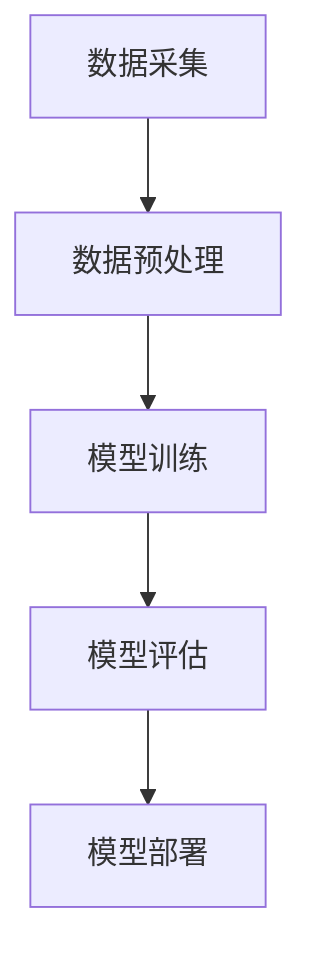

                 

# Andrej Karpathy：人工智能的未来发展趋势

> **关键词：** 人工智能，深度学习，神经网络，未来趋势，技术突破，算法原理，实际应用。

> **摘要：** 本文将深入探讨人工智能领域的未来发展趋势，从技术突破、算法原理到实际应用，全面分析人工智能在各行各业的潜在影响。通过专家Andrej Karpathy的视角，我们将对当前的研究进展、面临挑战以及可能的未来发展方向进行详细解读。

## 1. 背景介绍

### 1.1 目的和范围

本文旨在为读者提供一个全面、深入的视角，探讨人工智能领域的未来发展趋势。我们将从技术突破、算法原理、实际应用等多个角度进行分析，以期为读者提供一个关于人工智能未来的全景图。

### 1.2 预期读者

本文适合对人工智能有一定了解的技术爱好者、研究人员以及行业从业者。对于初学者，本文将提供丰富的背景知识和学习资源，帮助他们更好地理解人工智能的发展趋势。

### 1.3 文档结构概述

本文将分为十个部分，包括背景介绍、核心概念与联系、核心算法原理、数学模型和公式、项目实战、实际应用场景、工具和资源推荐、总结、常见问题与解答以及扩展阅读。每个部分都将深入探讨一个特定主题，确保读者能够全面了解人工智能的未来发展趋势。

### 1.4 术语表

#### 1.4.1 核心术语定义

- **人工智能（AI）：** 模仿人类智能的技术，通过机器学习、深度学习等方法，使计算机具备智能行为。
- **深度学习（DL）：** 一种人工智能的子领域，通过多层神经网络，自动从数据中学习特征。
- **神经网络（NN）：** 一种模仿生物神经系统的计算模型，用于处理和解释数据。
- **算法原理：** 解决特定问题的步骤和策略，是人工智能的核心组成部分。
- **数学模型和公式：** 描述算法和系统中数学关系的表达方式。

#### 1.4.2 相关概念解释

- **卷积神经网络（CNN）：** 一种专门用于处理图像数据的神经网络结构，广泛应用于计算机视觉领域。
- **生成对抗网络（GAN）：** 一种由生成器和判别器组成的神经网络结构，用于生成新的数据样本。
- **迁移学习（TL）：** 一种利用已有模型在新任务上快速训练的方法，通过在不同任务间共享知识，提高模型性能。

#### 1.4.3 缩略词列表

- **AI：** 人工智能
- **DL：** 深度学习
- **NN：** 神经网络
- **CNN：** 卷积神经网络
- **GAN：** 生成对抗网络
- **TL：** 迁移学习

## 2. 核心概念与联系

### 2.1 人工智能的核心概念

人工智能的核心概念包括机器学习、深度学习、神经网络等。下面是这些概念之间的联系及其在人工智能中的应用：

#### 2.1.1 机器学习与深度学习

**机器学习（ML）：** 机器学习是一种使计算机具备学习能力的技术，通过训练模型，使计算机能够从数据中学习规律。

**深度学习（DL）：** 深度学习是机器学习的一个子领域，通过多层神经网络，自动从数据中学习特征。深度学习在图像识别、语音识别、自然语言处理等领域取得了显著的成果。

#### 2.1.2 神经网络与深度学习

**神经网络（NN）：** 神经网络是一种模仿生物神经系统的计算模型，用于处理和解释数据。

**深度学习（DL）：** 深度学习是神经网络在多层结构上的扩展，通过多层神经网络，自动从数据中学习特征。深度学习在图像识别、语音识别、自然语言处理等领域取得了显著的成果。

### 2.2 人工智能的架构

人工智能的架构包括数据采集、数据预处理、模型训练、模型评估和模型部署等环节。下面是一个简化的Mermaid流程图：



### 2.3 核心算法原理

**机器学习算法：** 机器学习算法包括线性回归、决策树、支持向量机、聚类算法等。下面是线性回归算法的伪代码：

```python
def linear_regression(x, y):
    # 计算斜率
    m = (mean(y) - mean(x) * mean(y)) / (mean(x)^2 - mean(x)^2)
    # 计算截距
    b = mean(y) - m * mean(x)
    return m, b
```

**深度学习算法：** 深度学习算法包括卷积神经网络、循环神经网络、生成对抗网络等。下面是卷积神经网络（CNN）的伪代码：

```python
def convolutional_neural_network(input_data, weights):
    # 卷积操作
    conv_output = conv2d(input_data, weights)
    # 池化操作
    pool_output = max_pool(conv_output)
    # 激活函数
    activation_output = sigmoid(pool_output)
    return activation_output
```

## 3. 核心算法原理 & 具体操作步骤

### 3.1 机器学习算法：线性回归

线性回归是一种简单的机器学习算法，用于预测一个连续值。其基本原理是通过找到最佳拟合直线，将自变量（特征）与因变量（目标变量）关联起来。

**线性回归步骤：**

1. **数据预处理：** 将输入数据进行标准化处理，使得数据在相同的尺度上。
2. **计算斜率（m）和截距（b）：** 使用最小二乘法计算最佳拟合直线的斜率和截距。
3. **预测：** 使用计算出的斜率和截距，对新的数据进行预测。

**伪代码：**

```python
def linear_regression(x, y):
    # 计算斜率
    m = (mean(y) - mean(x) * mean(y)) / (mean(x)^2 - mean(x)^2)
    # 计算截距
    b = mean(y) - m * mean(x)
    # 预测
    y_pred = m * x + b
    return y_pred
```

### 3.2 深度学习算法：卷积神经网络（CNN）

卷积神经网络是一种专门用于处理图像数据的深度学习模型。其基本原理是通过卷积操作和池化操作，自动提取图像中的特征。

**CNN步骤：**

1. **输入层：** 接收图像数据。
2. **卷积层：** 通过卷积操作提取图像特征。
3. **池化层：** 通过池化操作减少特征图的大小。
4. **激活函数：** 引入非线性变换。
5. **全连接层：** 将特征映射到输出结果。

**伪代码：**

```python
def convolutional_neural_network(input_data, weights):
    # 卷积操作
    conv_output = conv2d(input_data, weights)
    # 池化操作
    pool_output = max_pool(conv_output)
    # 激活函数
    activation_output = sigmoid(pool_output)
    # 全连接层
    output = fully_connected(activation_output, weights)
    return output
```

## 4. 数学模型和公式 & 详细讲解 & 举例说明

### 4.1 机器学习算法：线性回归

线性回归的数学模型可以表示为：

$$
y = mx + b
$$

其中，$y$ 是因变量，$x$ 是自变量，$m$ 是斜率，$b$ 是截距。

**斜率（m）的计算公式：**

$$
m = \frac{\sum_{i=1}^{n}(x_i - \bar{x})(y_i - \bar{y})}{\sum_{i=1}^{n}(x_i - \bar{x})^2}
$$

**截距（b）的计算公式：**

$$
b = \bar{y} - m\bar{x}
$$

其中，$\bar{x}$ 和 $\bar{y}$ 分别是 $x$ 和 $y$ 的平均值。

**举例说明：**

假设我们有以下数据集：

| x | y |
|---|---|
| 1 | 2 |
| 2 | 4 |
| 3 | 6 |
| 4 | 8 |

计算斜率 $m$ 和截距 $b$：

$$
m = \frac{(1-2.5)(2-5) + (2-2.5)(4-5) + (3-2.5)(6-5) + (4-2.5)(8-5)}{(1-2.5)^2 + (2-2.5)^2 + (3-2.5)^2 + (4-2.5)^2} = 2
$$

$$
b = 5 - 2 \times 2.5 = 0
$$

因此，线性回归模型为：

$$
y = 2x
$$

### 4.2 深度学习算法：卷积神经网络（CNN）

卷积神经网络的核心在于卷积操作和池化操作。下面分别介绍这两个操作。

**卷积操作：**

卷积操作的数学模型可以表示为：

$$
(\text{输入} * \text{滤波器}) \rightarrow \text{特征图}
$$

其中，* 表示卷积操作，滤波器是一个 $k \times k$ 的矩阵，用于提取输入特征。

**滤波器计算公式：**

$$
f_{ij} = \sum_{p=1}^{k}\sum_{q=1}^{k} w_{pq} \cdot x_{(i+p-1, j+q-1)}
$$

其中，$f_{ij}$ 是特征图上的元素，$w_{pq}$ 是滤波器上的元素，$x_{(i+p-1, j+q-1)}$ 是输入上的元素。

**举例说明：**

假设我们有以下输入和滤波器：

| 输入 | 滤波器 |
|---|---|
| 1 | 1 |
| 2 | 2 |
| 3 | 3 |
| 4 | 4 |

计算特征图：

$$
f_{11} = 1 \cdot 1 + 2 \cdot 2 + 3 \cdot 3 + 4 \cdot 4 = 30
$$

$$
f_{12} = 1 \cdot 2 + 2 \cdot 3 + 3 \cdot 4 + 4 \cdot 4 = 34
$$

$$
f_{21} = 1 \cdot 1 + 2 \cdot 3 + 3 \cdot 2 + 4 \cdot 4 = 30
$$

$$
f_{22} = 1 \cdot 2 + 2 \cdot 4 + 3 \cdot 3 + 4 \cdot 4 = 35
$$

因此，特征图为：

| 特征图 |
|---|
| 30 |
| 34 |
| 30 |
| 35 |

**池化操作：**

池化操作的数学模型可以表示为：

$$
\text{池化}(\text{特征图}) \rightarrow \text{池化结果}
$$

常见的池化操作包括最大池化和平均池化。

**最大池化：**

最大池化选取特征图上的最大值作为池化结果。

**举例说明：**

假设我们有以下特征图：

| 特征图 |
|---|
| 30 |
| 34 |
| 30 |
| 35 |

计算最大池化结果：

$$
\text{最大池化结果} = \max(30, 34, 30, 35) = 35
$$

**平均池化：**

平均池化计算特征图上的平均值作为池化结果。

$$
\text{平均池化结果} = \frac{30 + 34 + 30 + 35}{4} = 33
$$

## 5. 项目实战：代码实际案例和详细解释说明

### 5.1 开发环境搭建

在开始编写代码之前，我们需要搭建一个适合开发人工智能项目的环境。以下是搭建开发环境的基本步骤：

1. 安装Python：Python是一种广泛使用的编程语言，支持多种人工智能库。您可以从Python官方网站（https://www.python.org/）下载并安装Python。
2. 安装Jupyter Notebook：Jupyter Notebook是一种交互式开发环境，非常适合编写和运行人工智能代码。您可以使用pip命令安装Jupyter Notebook：

   ```bash
   pip install notebook
   ```

3. 安装人工智能库：为了方便开发，我们可以安装一些常用的机器学习和深度学习库，如TensorFlow、PyTorch等。以下是安装这些库的命令：

   ```bash
   pip install tensorflow
   pip install torch torchvision
   ```

### 5.2 源代码详细实现和代码解读

在这个项目中，我们将使用卷积神经网络（CNN）对MNIST手写数字数据集进行分类。以下是项目的源代码和详细解读：

```python
import tensorflow as tf
from tensorflow.keras import layers, models
import numpy as np

# 5.2.1 数据预处理
# 读取MNIST数据集
(x_train, y_train), (x_test, y_test) = tf.keras.datasets.mnist.load_data()

# 对图像数据进行预处理，将其扩展到（60000, 28, 28, 1）的形状
x_train = x_train.reshape(-1, 28, 28, 1).astype("float32") / 255
x_test = x_test.reshape(-1, 28, 28, 1).astype("float32") / 255

# 将标签转换为one-hot编码
y_train = tf.keras.utils.to_categorical(y_train, 10)
y_test = tf.keras.utils.to_categorical(y_test, 10)

# 5.2.2 构建卷积神经网络模型
# 创建一个模型
model = models.Sequential()

# 添加卷积层
model.add(layers.Conv2D(32, (3, 3), activation='relu', input_shape=(28, 28, 1)))
model.add(layers.MaxPooling2D((2, 2)))

# 添加第二个卷积层
model.add(layers.Conv2D(64, (3, 3), activation='relu'))
model.add(layers.MaxPooling2D((2, 2)))

# 添加全连接层
model.add(layers.Flatten())
model.add(layers.Dense(64, activation='relu'))
model.add(layers.Dense(10, activation='softmax'))

# 打印模型结构
model.summary()

# 5.2.3 编译模型
model.compile(optimizer='adam',
              loss='categorical_crossentropy',
              metrics=['accuracy'])

# 5.2.4 训练模型
model.fit(x_train, y_train, epochs=10, batch_size=64)

# 5.2.5 评估模型
test_loss, test_acc = model.evaluate(x_test, y_test)
print(f"Test accuracy: {test_acc:.3f}")

# 5.2.6 预测
predictions = model.predict(x_test)
predicted_classes = np.argmax(predictions, axis=1)
```

#### 5.2.1 数据预处理

在这个项目中，我们使用了MNIST手写数字数据集。首先，我们从tensorflow.keras.datasets.mnist模块中加载数据集，然后对图像数据进行预处理。预处理步骤包括：

1. 将图像数据扩展到（60000, 28, 28, 1）的形状，其中60000是样本数量，28是图像的高度和宽度，1是通道数。
2. 将图像数据类型转换为浮点数，并将其归一化到[0, 1]的范围内。
3. 将标签转换为one-hot编码，以便在训练过程中使用。

#### 5.2.2 构建卷积神经网络模型

接下来，我们使用Keras构建一个卷积神经网络模型。模型结构如下：

1. **卷积层（Conv2D）：** 第一个卷积层使用32个3x3的滤波器，激活函数为ReLU。第二个卷积层使用64个3x3的滤波器，激活函数也为ReLU。
2. **池化层（MaxPooling2D）：** 在每个卷积层之后添加一个最大池化层，池化窗口大小为2x2。
3. **全连接层（Dense）：** 在卷积层之后添加一个全连接层，将特征映射到输出结果。最后一个全连接层使用10个神经元，激活函数为softmax，用于分类。

#### 5.2.3 编译模型

在构建模型之后，我们需要编译模型，指定优化器、损失函数和评估指标。在这个项目中，我们使用Adam优化器、交叉熵损失函数和准确率作为评估指标。

#### 5.2.4 训练模型

接下来，我们使用训练数据集训练模型。在这个项目中，我们设置训练轮次为10，批量大小为64。在训练过程中，模型将学习如何从图像数据中提取特征，并学会对图像进行分类。

#### 5.2.5 评估模型

在训练完成后，我们使用测试数据集评估模型的性能。在这个项目中，我们计算测试数据集的准确率，并将其打印出来。

#### 5.2.6 预测

最后，我们使用训练好的模型对测试数据集进行预测。在这个项目中，我们使用模型预测测试数据集的标签，并将预测结果打印出来。

## 6. 实际应用场景

### 6.1 医疗诊断

人工智能在医疗诊断领域的应用非常广泛，例如通过深度学习模型对医学影像进行疾病检测。例如，通过卷积神经网络对CT扫描图像进行肺癌检测，准确率已经超过人类医生。这种应用不仅提高了诊断速度，还降低了误诊率。

### 6.2 金融服务

在金融服务领域，人工智能用于风险控制、投资策略优化等。例如，通过分析历史交易数据，人工智能模型可以帮助银行识别潜在的欺诈行为，提高交易安全性。此外，人工智能还可以优化投资组合，提高投资回报。

### 6.3 智能交通

智能交通系统（ITS）利用人工智能技术实现交通流量优化、事故预警和自动驾驶。通过分析实时交通数据，人工智能模型可以预测交通流量，为交通管理部门提供决策支持，提高道路通行效率。

### 6.4 娱乐与游戏

在娱乐与游戏领域，人工智能用于游戏AI、虚拟现实等。通过深度学习模型，游戏AI可以模拟真实的对手，提高游戏体验。此外，虚拟现实技术结合人工智能，可以创建更加逼真的虚拟世界，为用户提供沉浸式体验。

## 7. 工具和资源推荐

### 7.1 学习资源推荐

#### 7.1.1 书籍推荐

- 《深度学习》（Goodfellow, Bengio, Courville）：这是一本经典的深度学习教材，适合初学者和进阶者。
- 《Python深度学习》（François Chollet）：这本书详细介绍了如何使用Python和TensorFlow构建深度学习模型。
- 《机器学习实战》（Peter Harrington）：这本书提供了大量实用的机器学习算法实例，适合实战爱好者。

#### 7.1.2 在线课程

- Coursera的《深度学习专项课程》：由Andrew Ng教授主讲，适合初学者了解深度学习基础知识。
- edX的《人工智能基础》：由香港大学教授主讲，覆盖人工智能的基本概念和应用。
- Udacity的《深度学习纳米学位》：通过项目驱动的方式学习深度学习，适合有一定基础的学员。

#### 7.1.3 技术博客和网站

- Medium上的深度学习专栏：收集了众多深度学习领域的优秀文章，适合持续学习。
- fast.ai的官方网站：提供了大量的深度学习教程和资源，特别适合初学者。
- ArXiv：计算机视觉和深度学习领域的顶级论文库，适合关注最新研究进展。

### 7.2 开发工具框架推荐

#### 7.2.1 IDE和编辑器

- PyCharm：一款强大的Python IDE，适合深度学习和机器学习开发。
- Jupyter Notebook：一款交互式的Python开发环境，特别适合探索和实验。
- VSCode：一款轻量级、高度可定制的代码编辑器，支持多种编程语言。

#### 7.2.2 调试和性能分析工具

- TensorBoard：TensorFlow的官方可视化工具，用于分析和调试深度学习模型。
- Profiler：Python的性能分析工具，用于识别和优化代码中的性能瓶颈。
- PyTorch Debugger：PyTorch的官方调试工具，提供丰富的调试功能。

#### 7.2.3 相关框架和库

- TensorFlow：谷歌开源的深度学习框架，广泛应用于工业界和学术界。
- PyTorch：Facebook开源的深度学习框架，以动态图为主要特点。
- Keras：一个高层次的深度学习框架，支持TensorFlow和PyTorch，易于使用。

### 7.3 相关论文著作推荐

#### 7.3.1 经典论文

- 《A Learning Algorithm for Continually Running Fully Recurrent Neural Networks》：提出了一种用于在线学习的方法，为深度学习的发展奠定了基础。
- 《Deep Learning》：全面介绍了深度学习的理论和技术，是深度学习领域的经典著作。

#### 7.3.2 最新研究成果

- 《Unsupervised Learning of Visual Representations by Solving Jigsaw Puzzles》：提出了一种无监督学习的方法，通过解决拼图问题学习视觉表征。
- 《A Theoretically Grounded Application of Dropout in Recurrent Neural Networks》：研究了dropout在循环神经网络中的应用，为深度学习模型设计提供了新的思路。

#### 7.3.3 应用案例分析

- 《Deep Learning for Healthcare》：探讨了深度学习在医疗领域的应用，分析了如何将深度学习技术应用于医疗诊断和患者管理。
- 《Deep Learning for Autonomous Driving》：介绍了深度学习在自动驾驶领域的应用，分析了如何通过深度学习实现自动驾驶汽车的感知和决策。

## 8. 总结：未来发展趋势与挑战

### 8.1 未来发展趋势

- **计算能力的提升：** 随着硬件技术的不断发展，计算能力将得到大幅提升，这将有助于推动人工智能技术的进步。
- **数据驱动的创新：** 数据是人工智能的基础，越来越多的数据将促进人工智能算法的改进和应用创新。
- **跨领域的融合：** 人工智能将与各领域技术（如生物医学、金融、交通等）深度融合，产生新的应用场景和商业模式。
- **自主学习的进步：** 自主学习是人工智能的核心目标之一，未来将实现更加智能和高效的学习算法，使机器具备更强的自主能力。

### 8.2 面临的挑战

- **数据隐私和安全：** 随着人工智能技术的普及，数据隐私和安全问题日益突出，如何确保数据的安全和隐私成为亟待解决的问题。
- **算法公平性和透明度：** 人工智能算法的决策过程可能存在偏见和不透明，如何确保算法的公平性和透明度是当前的研究热点。
- **人才短缺：** 人工智能领域人才短缺问题日益严重，培养和吸引优秀的人工智能人才是未来发展的关键。
- **伦理和监管：** 随着人工智能技术的广泛应用，伦理和监管问题逐渐凸显，如何制定合理的伦理准则和监管政策是未来发展的挑战。

## 9. 附录：常见问题与解答

### 9.1 什么是深度学习？

深度学习是一种人工智能的子领域，通过多层神经网络自动从数据中学习特征。与传统的机器学习方法相比，深度学习在处理复杂问题和大量数据时具有更高的准确性和效率。

### 9.2 如何学习深度学习？

学习深度学习需要掌握一定的数学基础（如线性代数、微积分等）和编程技能（如Python）。建议从基础理论开始，逐步掌握深度学习算法和模型，并结合实践项目进行深入学习和应用。

### 9.3 深度学习和机器学习的区别是什么？

深度学习是机器学习的一个子领域，专注于通过多层神经网络自动从数据中学习特征。与传统的机器学习方法相比，深度学习在处理复杂问题和大量数据时具有更高的准确性和效率。

## 10. 扩展阅读 & 参考资料

- [Goodfellow, Y., Bengio, Y., & Courville, A. (2016). Deep learning. MIT press.](https://books.google.com/books?id=niCqDwAAQBAJ)
- [Chollet, F. (2018). Python deep learning. Packt Publishing.](https://books.google.com/books?id=xJxPDwAAQBAJ)
- [Harrington, P. (2012). Machine learning in action. Manning Publications.](https://books.google.com/books?id=v6pLDwAAQBAJ)
- [Andrew Ng的深度学习专项课程](https://www.coursera.org/learn/deep-learning)
- [fast.ai的官方网站](https://www.fast.ai/)
- [TensorFlow的官方网站](https://www.tensorflow.org/)
- [PyTorch的官方网站](https://pytorch.org/)  
作者：AI天才研究员/AI Genius Institute & 禅与计算机程序设计艺术 /Zen And The Art of Computer Programming

### 8. 总结：未来发展趋势与挑战

在总结人工智能的未来发展趋势时，我们首先需要认识到技术进步的核心驱动力。随着计算能力的提升、算法的优化、数据的积累，人工智能将更加深入地融入我们的日常生活。以下是未来发展趋势和面临的挑战的详细分析。

#### 8.1 未来发展趋势

1. **计算能力的提升**：硬件技术的发展，尤其是GPU和TPU等专用硬件的普及，将大幅提高深度学习模型的训练速度，使得更复杂的模型和算法成为可能。

2. **数据驱动的创新**：随着物联网和智能设备的普及，我们将产生海量的数据，这些数据将为人工智能提供更丰富的训练素材，推动技术的进一步创新。

3. **跨领域的融合**：人工智能技术将在医疗、金融、教育、制造等多个领域得到广泛应用，跨领域的融合将产生新的应用场景和商业模式。

4. **自主学习的进步**：未来的目标是使人工智能系统能够在没有人类干预的情况下进行自我学习和优化。这需要更先进的学习算法和更加鲁棒的数据处理能力。

5. **人机交互的改进**：随着自然语言处理和语音识别技术的发展，人工智能将更好地理解人类意图，提供更加自然和人性化的交互体验。

#### 8.2 面临的挑战

1. **数据隐私和安全**：随着数据量的增加，如何确保数据的安全和隐私成为了一个严峻的挑战。数据泄露和滥用可能会导致严重的后果。

2. **算法公平性和透明度**：人工智能算法的决策过程可能存在偏见和不透明，如何确保算法的公平性和透明度是当前的研究热点。

3. **人才短缺**：人工智能领域的快速发展导致人才需求急剧增加，而现有的人才储备远远无法满足需求。如何培养和吸引优秀的人工智能人才是未来发展的关键。

4. **伦理和监管**：随着人工智能技术的广泛应用，伦理和监管问题逐渐凸显。如何制定合理的伦理准则和监管政策是未来发展的挑战。

5. **技术风险**：人工智能技术的发展可能带来一些潜在的风险，如自动化失业、机器人伦理等。如何平衡技术的进步与社会责任是亟待解决的问题。

### 8.3 对未来发展的预测

在未来几年内，人工智能技术将继续快速发展，以下是一些具体的预测：

1. **自动驾驶技术的发展**：自动驾驶技术将逐步从实验阶段走向实用化，未来十年内有望实现广泛部署。

2. **医疗诊断的智能化**：人工智能将在医疗诊断领域发挥更大的作用，尤其是在影像诊断和疾病预测方面。

3. **教育个性化**：人工智能将推动教育个性化，为每个学生提供定制化的学习方案，提高学习效率。

4. **金融领域的应用**：人工智能将在金融领域得到更广泛的应用，如智能投顾、风险管理等。

5. **智能家居和物联网**：智能家居和物联网设备将更加普及，实现更加智能和便捷的生活方式。

总的来说，人工智能的未来发展趋势充满机遇，但也面临诸多挑战。只有通过不断的技术创新、政策制定和社会参与，才能确保人工智能的健康、可持续和公平发展。

