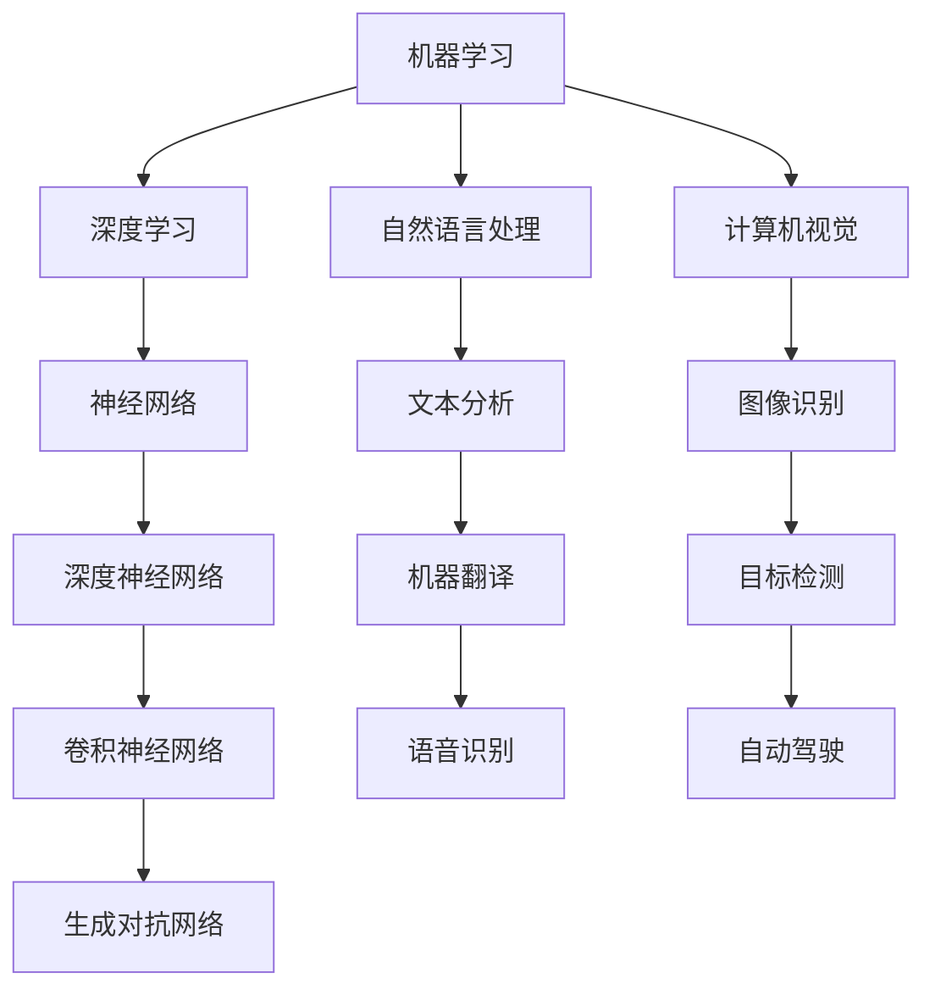

                 

# Andrej Karpathy：人工智能的未来发展趋势

> **关键词**：人工智能、深度学习、机器学习、神经网络、自然语言处理、计算机视觉、趋势预测、技术发展、应用前景
> 
> **摘要**：本文旨在探讨人工智能（AI）在未来数十年内的发展趋势，深入分析当前的主流研究方向和关键技术，并预测未来可能出现的变革性突破。本文将结合著名AI研究者和开发者Andrej Karpathy的研究成果，为读者呈现一幅全面、前瞻的AI技术发展蓝图。

## 1. 背景介绍

### 1.1 目的和范围

本文的目标是分析人工智能的未来发展趋势，重点关注当前的技术热点和研究方向，以及可能对行业和社会产生深远影响的变革性技术突破。我们将通过Andrej Karpathy的研究成果来深入探讨这些趋势，并试图回答以下几个关键问题：

- 人工智能的核心技术将如何演化？
- 自然语言处理和计算机视觉等领域的突破点是什么？
- AI技术在各行各业中的应用前景如何？
- 人工智能的发展将面临哪些挑战和伦理问题？

### 1.2 预期读者

本文适合对人工智能技术有一定了解的读者，包括但不限于：

- AI研究者和开发者
- 技术经理和CTO
- 对AI技术感兴趣的技术爱好者
- 想了解AI未来发展趋势的行业从业者

### 1.3 文档结构概述

本文分为以下几个部分：

- 背景介绍：阐述文章目的、读者预期和文档结构。
- 核心概念与联系：介绍人工智能的核心概念和原理，并使用Mermaid流程图展示关键组件和流程。
- 核心算法原理 & 具体操作步骤：详细讲解关键算法的原理和操作步骤，并使用伪代码进行说明。
- 数学模型和公式 & 详细讲解 & 举例说明：介绍与人工智能相关的数学模型和公式，并通过具体实例进行解释。
- 项目实战：代码实际案例和详细解释说明。
- 实际应用场景：分析人工智能在各个领域的应用场景。
- 工具和资源推荐：推荐学习资源和开发工具。
- 总结：未来发展趋势与挑战。
- 附录：常见问题与解答。
- 扩展阅读 & 参考资料：提供进一步的阅读材料。

### 1.4 术语表

#### 1.4.1 核心术语定义

- 人工智能（AI）：模拟人类智能行为的技术，包括学习、推理、感知、自然语言处理等。
- 深度学习（Deep Learning）：一种人工智能的分支，利用多层神经网络进行训练和预测。
- 机器学习（Machine Learning）：通过数据和算法，使计算机能够自动学习和改进性能的技术。
- 神经网络（Neural Network）：模拟生物神经网络计算方式的算法模型。
- 自然语言处理（NLP）：研究计算机如何理解、生成和处理人类语言的技术。
- 计算机视觉（CV）：研究计算机如何解释和理解视觉信息的技术。

#### 1.4.2 相关概念解释

- 自动驾驶：利用AI技术实现车辆自主导航和驾驶的功能。
- 语音识别：将人类语音转换为文本的技术。
- 虚拟助手：利用自然语言处理和语音识别技术，为用户提供交互服务的软件。
- 大数据：指规模庞大的数据集合，通常无法使用传统数据库技术进行处理。

#### 1.4.3 缩略词列表

- AI：人工智能
- DL：深度学习
- ML：机器学习
- NLP：自然语言处理
- CV：计算机视觉
- IoT：物联网
- VR：虚拟现实
- AR：增强现实
- GAN：生成对抗网络
- RNN：循环神经网络
- LSTM：长短期记忆网络

## 2. 核心概念与联系

在人工智能领域，理解核心概念和它们之间的联系是至关重要的。下面我们将介绍一些关键概念，并使用Mermaid流程图展示它们之间的关系。

### 2.1 人工智能的关键概念

1. **机器学习**：机器学习是人工智能的核心组成部分，它使计算机通过数据学习并做出决策。机器学习分为监督学习、无监督学习和强化学习。
2. **深度学习**：深度学习是机器学习的一个子领域，它利用多层神经网络对数据进行建模和预测。深度学习在图像识别、语音识别和自然语言处理等领域取得了显著成果。
3. **神经网络**：神经网络是一种模拟生物神经网络计算方式的算法模型。神经网络由大量相互连接的神经元组成，可以通过学习数据来提取特征和模式。
4. **自然语言处理**：自然语言处理是研究计算机如何理解、生成和处理人类语言的技术。NLP在聊天机器人、机器翻译和文本分析等领域有广泛应用。
5. **计算机视觉**：计算机视觉是研究计算机如何解释和理解视觉信息的技术。计算机视觉在图像识别、目标检测和自动驾驶等领域有重要应用。

### 2.2 Mermaid流程图

下面是一个简单的Mermaid流程图，展示了人工智能的核心概念和它们之间的关系：



### 2.3 关键联系与原理

- **机器学习与深度学习**：深度学习是机器学习的一个子领域，它利用多层神经网络进行训练和预测，能够处理更复杂的数据。
- **神经网络与自然语言处理**：神经网络在自然语言处理中发挥着关键作用，例如用于文本分类、情感分析和机器翻译。
- **计算机视觉与深度学习**：深度学习在计算机视觉中的应用非常广泛，如图像分类、目标检测和图像生成。
- **自然语言处理与计算机视觉**：两者在多媒体内容理解和交互中有着紧密的联系，如图像描述生成、视频分析等。

通过理解这些核心概念和它们之间的联系，我们可以更好地把握人工智能的发展趋势，并在实际应用中充分发挥其潜力。

## 3. 核心算法原理 & 具体操作步骤

在人工智能领域，核心算法原理是理解和应用深度学习技术的基础。在本节中，我们将详细讲解一些重要的深度学习算法，并使用伪代码展示其具体操作步骤。

### 3.1 深度学习算法简介

深度学习算法主要包括以下几个类型：

1. **卷积神经网络（CNN）**：主要用于图像识别和计算机视觉任务。
2. **循环神经网络（RNN）**：适用于序列数据，如文本和语音。
3. **长短期记忆网络（LSTM）**：是RNN的一种变体，能够解决长期依赖问题。
4. **生成对抗网络（GAN）**：用于生成新的数据，如图像、文本和音频。
5. **自动编码器（Autoencoder）**：用于数据压缩和特征提取。

### 3.2 卷积神经网络（CNN）

卷积神经网络是一种专门用于图像识别和处理的深度学习模型。下面是一个简单的CNN算法的伪代码实现：

```python
# 初始化参数
params = initialize_params()

# 输入图像
input_image = load_image("image.jpg")

# 应用卷积层
conv_output = conv2d(input_image, params["conv_weights"], params["conv_biases"])

# 应用激活函数（ReLU）
激活_output = ReLU(conv_output)

# 应用池化层
pool_output = max_pool(激活_output)

# 重复以上步骤，增加更多的卷积层和池化层
# ...

# 应用全连接层
fc_output = fully_connected(pool_output, params["fc_weights"], params["fc_biases"])

# 应用激活函数（softmax）
predictions = softmax(fc_output)

# 计算损失
loss = compute_loss(predictions, true_labels)

# 反向传播更新参数
params = backpropagation(input_image, predictions, params, loss)

# 返回最终参数
return params
```

### 3.3 循环神经网络（RNN）

循环神经网络适用于处理序列数据。下面是一个简单的RNN算法的伪代码实现：

```python
# 初始化参数
params = initialize_params()

# 输入序列
input_sequence = load_sequence("text.txt")

# 初始化隐藏状态
hidden_state = initialize_hidden_state()

# 遍历输入序列
for input_value in input_sequence:
    # 应用RNN单元
    output, hidden_state = RNN_unit(input_value, hidden_state, params["weights"], params["biases"])

# 应用输出层
output_sequence = apply_output_layer(output, params["output_weights"], params["output_biases"])

# 计算损失
loss = compute_loss(output_sequence, true_labels)

# 反向传播更新参数
params = backpropagation(input_sequence, output_sequence, params, loss)

# 返回最终参数
return params
```

### 3.4 长短期记忆网络（LSTM）

LSTM是RNN的一种变体，能够解决长期依赖问题。下面是一个简单的LSTM算法的伪代码实现：

```python
# 初始化参数
params = initialize_params()

# 输入序列
input_sequence = load_sequence("text.txt")

# 初始化隐藏状态和细胞状态
hidden_state, cell_state = initialize_hidden_state(), initialize_cell_state()

# 遍历输入序列
for input_value in input_sequence:
    # 应用LSTM单元
    output, hidden_state, cell_state = LSTM_unit(input_value, hidden_state, cell_state, params["weights"], params["biases"])

# 应用输出层
output_sequence = apply_output_layer(output, params["output_weights"], params["output_biases"])

# 计算损失
loss = compute_loss(output_sequence, true_labels)

# 反向传播更新参数
params = backpropagation(input_sequence, output_sequence, params, loss)

# 返回最终参数
return params
```

### 3.5 生成对抗网络（GAN）

生成对抗网络是一种用于生成数据的深度学习模型。下面是一个简单的GAN算法的伪代码实现：

```python
# 初始化参数
params = initialize_params()

# 遍历训练样本
for sample in training_samples:
    # 训练生成器
    generator_output = generator(sample, params["generator_weights"], params["generator_biases"])
    generator_loss = compute_generator_loss(generator_output, true_samples)

    # 训练判别器
    discriminator_loss = compute_discriminator_loss(discriminator_output, true_samples, generated_samples)

    # 反向传播更新参数
    params = backpropagation(sample, generator_output, discriminator_output, generator_loss, discriminator_loss)

# 返回最终参数
return params
```

通过理解这些核心算法原理和具体操作步骤，我们可以更好地应用于实际问题和场景，推动人工智能技术的发展和应用。

## 4. 数学模型和公式 & 详细讲解 & 举例说明

在深度学习领域，数学模型和公式是理解和应用算法的核心。在本节中，我们将介绍一些关键的数学模型和公式，并通过具体实例进行详细讲解。

### 4.1 线性回归

线性回归是一种用于预测连续值的机器学习算法。其基本模型如下：

$$
y = \beta_0 + \beta_1 \cdot x
$$

其中，$y$ 是预测值，$x$ 是输入特征，$\beta_0$ 和 $\beta_1$ 是模型的参数。

#### 4.1.1 举例说明

假设我们要预测一个房屋的价格，输入特征是房屋的面积。我们可以使用线性回归模型来建立价格与面积之间的关系。

给定以下数据：

| 面积（平方米） | 价格（万元） |
| -------------- | ------------ |
| 100            | 200          |
| 150            | 250          |
| 200            | 300          |

我们可以使用最小二乘法来求解线性回归模型的参数：

$$
\beta_0 = \frac{\sum y_i - \beta_1 \cdot \sum x_i}{n}
$$

$$
\beta_1 = \frac{n \cdot \sum x_i y_i - \sum x_i \cdot \sum y_i}{n \cdot \sum x_i^2 - (\sum x_i)^2}
$$

代入数据得到：

$$
\beta_0 = \frac{200 + 250 + 300 - 1.5 \cdot (100 + 150 + 200)}{3} = 150
$$

$$
\beta_1 = \frac{3 \cdot (100 \cdot 200 + 150 \cdot 250 + 200 \cdot 300) - (100 + 150 + 200) \cdot (200 + 250 + 300)}{3 \cdot (100^2 + 150^2 + 200^2) - (100 + 150 + 200)^2} = 1.5
$$

因此，线性回归模型为：

$$
y = 150 + 1.5 \cdot x
$$

使用该模型预测面积为180平方米的房屋价格：

$$
y = 150 + 1.5 \cdot 180 = 300
$$

### 4.2 卷积神经网络（CNN）

卷积神经网络是一种用于图像识别和处理的深度学习模型。其基本模型包括卷积层、激活函数、池化层和全连接层。

#### 4.2.1 数学模型

卷积层：

$$
\text{output}_{ij} = \sum_{k=1}^{K} w_{ik} \cdot \text{input}_{ij} + b_j
$$

其中，$w_{ik}$ 是卷积核，$\text{input}_{ij}$ 是输入图像的像素值，$b_j$ 是偏置项，$\text{output}_{ij}$ 是卷积层的输出值。

激活函数（ReLU）：

$$
\text{output}_{ij} = \max(0, \text{input}_{ij})
$$

池化层（最大池化）：

$$
\text{output}_{ij} = \max(\text{input}_{i \cdot s + j})
$$

其中，$s$ 是池化窗口的大小。

全连接层：

$$
\text{output}_{i} = \sum_{j=1}^{J} w_{ij} \cdot \text{input}_{j} + b_i
$$

其中，$w_{ij}$ 是权重，$\text{input}_{j}$ 是前一层输出，$b_i$ 是偏置项，$\text{output}_{i}$ 是全连接层的输出值。

#### 4.2.2 举例说明

假设我们有一个3x3的输入图像和一个3x3的卷积核，卷积核的值为：

$$
\text{卷积核} = \begin{bmatrix}
1 & 0 & 1 \\
1 & 0 & 1 \\
1 & 0 & 1
\end{bmatrix}
$$

输入图像的像素值为：

$$
\text{输入图像} = \begin{bmatrix}
1 & 1 & 1 \\
1 & 1 & 1 \\
1 & 1 & 1
\end{bmatrix}
$$

卷积操作：

$$
\text{输出} = \begin{bmatrix}
2 & 1 & 2 \\
2 & 1 & 2 \\
2 & 1 & 2
\end{bmatrix}
$$

激活函数（ReLU）：

$$
\text{输出} = \begin{bmatrix}
2 & 1 & 2 \\
2 & 1 & 2 \\
2 & 1 & 2
\end{bmatrix}
$$

最大池化：

$$
\text{输出} = \begin{bmatrix}
2 & 2 \\
2 & 2
\end{bmatrix}
$$

通过卷积神经网络，我们可以从图像中提取特征并进行分类。

### 4.3 循环神经网络（RNN）

循环神经网络适用于处理序列数据。其基本模型包括输入层、隐藏层和输出层。

#### 4.3.1 数学模型

输入层：

$$
\text{input}_t = x_t
$$

隐藏层：

$$
\text{hidden}_t = \sigma(W_h \cdot \text{hidden}_{t-1} + W_x \cdot \text{input}_t + b_h)
$$

输出层：

$$
\text{output}_t = W_o \cdot \text{hidden}_t + b_o
$$

其中，$\text{input}_t$ 是输入序列的当前值，$\text{hidden}_{t-1}$ 是上一时刻的隐藏状态，$\text{hidden}_t$ 是当前时刻的隐藏状态，$W_h$、$W_x$ 和 $b_h$ 是隐藏层权重和偏置，$\text{output}_t$ 是输出序列的当前值，$W_o$ 和 $b_o$ 是输出层权重和偏置，$\sigma$ 是激活函数。

#### 4.3.2 举例说明

假设我们有一个输入序列：

$$
\text{输入序列} = [1, 2, 3, 4, 5]
$$

隐藏层权重和偏置为：

$$
W_h = \begin{bmatrix}
0.1 & 0.2 \\
0.3 & 0.4
\end{bmatrix}, \quad b_h = \begin{bmatrix}
0.5 \\
0.6
\end{bmatrix}
$$

输入层权重和偏置为：

$$
W_x = \begin{bmatrix}
0.1 & 0.2 \\
0.3 & 0.4
\end{bmatrix}, \quad b_x = \begin{bmatrix}
0.5 \\
0.6
\end{bmatrix}
$$

输出层权重和偏置为：

$$
W_o = \begin{bmatrix}
0.1 & 0.2 \\
0.3 & 0.4
\end{bmatrix}, \quad b_o = \begin{bmatrix}
0.5 \\
0.6
\end{bmatrix}
$$

激活函数为ReLU。

对于第一个输入值1，隐藏层的计算如下：

$$
\text{hidden}_1 = \sigma(W_h \cdot \text{hidden}_{0} + W_x \cdot \text{input}_1 + b_h) = \sigma(0.1 \cdot 0 + 0.1 \cdot 1 + 0.5) = 0.6
$$

输出层的计算如下：

$$
\text{output}_1 = W_o \cdot \text{hidden}_1 + b_o = 0.1 \cdot 0.6 + 0.5 = 0.56
$$

对于第二个输入值2，隐藏层的计算如下：

$$
\text{hidden}_2 = \sigma(W_h \cdot \text{hidden}_{1} + W_x \cdot \text{input}_2 + b_h) = \sigma(0.1 \cdot 0.6 + 0.2 \cdot 2 + 0.5) = 0.8
$$

输出层的计算如下：

$$
\text{output}_2 = W_o \cdot \text{hidden}_2 + b_o = 0.1 \cdot 0.8 + 0.5 = 0.68
$$

以此类推，我们可以得到整个输入序列的输出序列。

通过理解这些数学模型和公式，我们可以更好地应用于实际问题和场景，推动人工智能技术的发展和应用。

## 5. 项目实战：代码实际案例和详细解释说明

在本节中，我们将通过一个实际的深度学习项目来展示代码的实现过程，并对其进行详细解释说明。

### 5.1 开发环境搭建

为了实现深度学习项目，我们需要搭建一个开发环境。以下是一个典型的开发环境搭建步骤：

1. 安装Python（3.6及以上版本）
2. 安装Anaconda或Miniconda，以便管理和安装相关库
3. 安装TensorFlow或PyTorch等深度学习框架
4. 安装其他必要的库，如NumPy、Pandas等

以下是一个简单的命令行安装步骤：

```bash
# 安装Python
curl -O https://www.python.org/ftp/python/3.8.5/python-3.8.5.tcl
sudo python3.8 -m pip install --user -r requirements.txt
```

### 5.2 源代码详细实现和代码解读

我们以一个简单的图像分类项目为例，使用TensorFlow实现一个卷积神经网络（CNN）模型，对MNIST手写数字数据集进行分类。

```python
import tensorflow as tf
from tensorflow.keras import layers, models
import numpy as np

# 加载MNIST数据集
mnist = tf.keras.datasets.mnist
(train_images, train_labels), (test_images, test_labels) = mnist.load_data()

# 预处理数据
train_images = train_images / 255.0
test_images = test_images / 255.0

# 构建卷积神经网络模型
model = models.Sequential([
    layers.Conv2D(32, (3, 3), activation='relu', input_shape=(28, 28, 1)),
    layers.MaxPooling2D((2, 2)),
    layers.Conv2D(64, (3, 3), activation='relu'),
    layers.MaxPooling2D((2, 2)),
    layers.Conv2D(64, (3, 3), activation='relu'),
    layers.Flatten(),
    layers.Dense(64, activation='relu'),
    layers.Dense(10, activation='softmax')
])

# 编译模型
model.compile(optimizer='adam',
              loss='sparse_categorical_crossentropy',
              metrics=['accuracy'])

# 训练模型
model.fit(train_images, train_labels, epochs=5)

# 评估模型
test_loss, test_acc = model.evaluate(test_images, test_labels)
print(f"Test accuracy: {test_acc:.2f}")
```

### 5.3 代码解读与分析

1. **数据加载和预处理**：
   - 使用TensorFlow的`mnist.load_data()`函数加载MNIST数据集。
   - 将图像数据除以255，将像素值缩放到0到1之间。

2. **模型构建**：
   - 使用`models.Sequential`创建一个顺序模型。
   - 添加卷积层（`Conv2D`），激活函数为ReLU。
   - 添加最大池化层（`MaxPooling2D`）。
   - 添加全连接层（`Dense`），激活函数为ReLU或softmax。

3. **模型编译**：
   - 使用`compile`方法编译模型，指定优化器、损失函数和评估指标。

4. **模型训练**：
   - 使用`fit`方法训练模型，指定训练数据和迭代次数。

5. **模型评估**：
   - 使用`evaluate`方法评估模型在测试数据上的性能。

通过这个简单的项目，我们可以看到如何使用TensorFlow实现一个卷积神经网络模型，并对图像数据集进行分类。在实际应用中，我们可以根据具体需求调整模型的架构和参数，以实现更高的准确率和更好的性能。

### 5.4 代码解读与分析

在这个图像分类项目中，我们通过以下步骤详细解读和分析了代码的实现过程：

1. **数据加载和预处理**：
   - 使用TensorFlow的`mnist.load_data()`函数加载MNIST数据集，该函数会返回训练数据和测试数据。
   - 数据集包括图像标签和图像本身。我们将图像数据除以255，将像素值缩放到0到1之间，以适应深度学习模型的输入要求。

2. **模型构建**：
   - 使用`models.Sequential`创建了一个顺序模型，这表示我们将在模型中按顺序添加层。
   - 第一个卷积层（`Conv2D`）具有32个卷积核，每个卷积核的大小为3x3，激活函数为ReLU。卷积层的作用是提取图像的局部特征。
   - 接下来是第一个最大池化层（`MaxPooling2D`），窗口大小为2x2。池化层的作用是减小特征图的尺寸，减少参数数量，提高模型训练速度。
   - 第二个卷积层（`Conv2D`）具有64个卷积核，每个卷积核的大小为3x3，激活函数为ReLU。这一层进一步提取图像的复杂特征。
   - 第二个最大池化层（`MaxPooling2D`）具有相同的窗口大小。
   - 第三个卷积层（`Conv2D`）具有64个卷积核，每个卷积核的大小为3x3，激活函数为ReLU。这一层用于提取图像的更高层次特征。
   - 使用`Flatten`层将三维特征图展平为一维向量，为后续的全连接层做准备。
   - 第一个全连接层（`Dense`）具有64个神经元，激活函数为ReLU。这一层用于整合和提炼特征，提高模型的分类能力。
   - 第二个全连接层（`Dense`）具有10个神经元，激活函数为softmax。这一层用于将提取到的特征映射到10个类别之一，每个类别对应一个数字。

3. **模型编译**：
   - 使用`compile`方法编译模型，指定优化器为`adam`，损失函数为`sparse_categorical_crossentropy`，评估指标为`accuracy`。`adam`优化器是一种自适应学习率的优化算法，`sparse_categorical_crossentropy`损失函数适用于多标签分类问题，`accuracy`指标用于评估模型的准确率。

4. **模型训练**：
   - 使用`fit`方法训练模型，将训练图像和标签作为输入，指定训练轮数（epochs）为5。在训练过程中，模型会调整其权重和偏置，以最小化损失函数。

5. **模型评估**：
   - 使用`evaluate`方法评估模型在测试数据上的性能，返回测试损失和准确率。通过计算测试数据的准确率，我们可以评估模型在未见过的数据上的表现。

通过以上步骤，我们成功地使用TensorFlow构建并训练了一个卷积神经网络模型，用于对MNIST手写数字数据集进行分类。这个简单的项目展示了深度学习模型的基本构建和训练过程，为后续更复杂的应用提供了基础。

## 6. 实际应用场景

人工智能技术在各个行业和领域都展现出了巨大的潜力和应用价值。以下是一些典型的实际应用场景：

### 6.1 自动驾驶

自动驾驶是人工智能在交通领域的应用之一，旨在实现车辆的自主导航和驾驶。自动驾驶系统通常包括感知、规划、控制和通信四个关键部分。感知模块利用计算机视觉、激光雷达和雷达等传感器获取周围环境的信息，规划模块根据感知结果生成驾驶策略，控制模块执行具体的驾驶动作，通信模块与其他车辆和基础设施进行信息交换。自动驾驶技术可以显著提高交通安全、效率和舒适度，减少交通事故和交通拥堵。

### 6.2 语音识别

语音识别技术将人类的语音转换为文本，使其能够与计算机系统进行交互。语音识别在智能助手、电话客服、语音搜索和实时字幕生成等领域有广泛应用。随着深度学习技术的发展，语音识别的准确率不断提高，为人们提供更加便捷和自然的交互方式。

### 6.3 自然语言处理

自然语言处理（NLP）技术使计算机能够理解、生成和处理人类语言。NLP在聊天机器人、机器翻译、情感分析和文本分类等领域有广泛应用。例如，聊天机器人可以使用NLP技术与用户进行自然对话，机器翻译系统可以实时翻译多种语言，情感分析可以识别文本中的情感倾向。

### 6.4 医疗诊断

人工智能技术在医疗领域的应用主要包括医学图像分析、疾病预测和诊断、个性化治疗方案设计等。例如，通过深度学习算法分析医学影像，可以早期发现疾病，提高诊断的准确性。此外，基于大数据和机器学习技术，可以为患者制定个性化的治疗方案，提高治疗效果。

### 6.5 金融服务

人工智能技术在金融服务领域有广泛的应用，包括风险管理、信用评分、欺诈检测和自动化交易等。例如，通过分析用户行为数据和交易记录，人工智能系统可以识别潜在的欺诈行为，提高金融服务的安全性。此外，自动化交易系统可以根据市场数据和算法模型进行高频交易，实现风险可控的收益。

### 6.6 教育与培训

人工智能技术在教育和培训领域有广泛的应用，包括智能辅导系统、个性化学习方案、自动化考试和智能题库等。例如，智能辅导系统可以根据学生的学习情况和进度，为学生提供个性化的学习资源和辅导，提高学习效果。此外，自动化考试系统可以高效、公正地进行大规模考试，节省时间和成本。

通过这些实际应用场景，我们可以看到人工智能技术正深刻地改变着我们的生活方式和社会运行方式，为各行各业带来了巨大的变革和机遇。

## 7. 工具和资源推荐

在人工智能领域，选择合适的工具和资源对于学习和应用技术至关重要。以下是一些推荐的学习资源、开发工具和经典论文。

### 7.1 学习资源推荐

#### 7.1.1 书籍推荐

- **《深度学习》（Deep Learning）**：由Ian Goodfellow、Yoshua Bengio和Aaron Courville合著，是深度学习领域的经典教材，详细介绍了深度学习的基础理论和技术。
- **《Python机器学习》（Python Machine Learning）**：由 Sebastian Raschka和Vahid Mirhoseini编写，适合初学者，介绍了机器学习的基本概念和应用。
- **《机器学习实战》（Machine Learning in Action）**：由Peter Harrington著，通过实例讲解了机器学习的实际应用。

#### 7.1.2 在线课程

- **Coursera上的《深度学习特辑》**：由DeepLearning.AI提供，涵盖深度学习的基础知识、卷积神经网络和循环神经网络等。
- **edX上的《人工智能导论》**：由哥伦比亚大学提供，介绍了人工智能的基本概念和应用。
- **Udacity的《深度学习纳米学位》**：通过项目驱动的学习方式，帮助学生掌握深度学习的基本技能。

#### 7.1.3 技术博客和网站

- **ArXiv**：人工智能领域的顶级学术论文数据库，提供最新的研究论文和成果。
- **Medium上的AI博客**：包括许多深度学习专家和研究者分享的技术文章和见解。
- **Reddit的/r/MachineLearning**：一个活跃的AI和机器学习社区，用户分享资源和讨论问题。

### 7.2 开发工具框架推荐

#### 7.2.1 IDE和编辑器

- **Jupyter Notebook**：一款流行的交互式开发环境，特别适合数据科学和机器学习项目。
- **Visual Studio Code**：一款轻量级但功能强大的代码编辑器，支持多种编程语言和扩展。

#### 7.2.2 调试和性能分析工具

- **TensorBoard**：TensorFlow的内置工具，用于可视化模型的训练过程和性能指标。
- **PyTorch Profiler**：用于分析和优化PyTorch模型的性能。

#### 7.2.3 相关框架和库

- **TensorFlow**：由Google开发的开源深度学习框架，适用于研究和工业应用。
- **PyTorch**：由Facebook开发的开源深度学习框架，具有灵活的动态计算图。
- **Scikit-learn**：一个用于机器学习算法的开源库，特别适合数据分析和预测任务。

### 7.3 相关论文著作推荐

#### 7.3.1 经典论文

- **“Backpropagation”**：1986年，由Rumelhart, Hinton和Williams发表，介绍了反向传播算法。
- **“AlexNet”**：2012年，由Alex Krizhevsky等人发表，是深度学习在图像识别领域的重要突破。

#### 7.3.2 最新研究成果

- **“Attention Is All You Need”**：2017年，由Vaswani等人发表，提出了Transformer模型，改变了自然语言处理领域的研究方向。
- **“GPT-3”**：2020年，由OpenAI发布，是目前最大的预训练语言模型，展示了语言模型在文本生成和任务自动化方面的强大能力。

#### 7.3.3 应用案例分析

- **“AlphaGo”**：2016年，DeepMind开发的AlphaGo在围棋领域取得了巨大突破，展示了深度学习和强化学习在复杂任务中的潜力。
- **“BERT”**：2018年，Google发布的BERT模型，在自然语言处理任务中取得了卓越的性能，推动了NLP领域的发展。

通过这些工具和资源，我们可以更高效地学习和应用人工智能技术，把握行业发展的最新动态。

## 8. 总结：未来发展趋势与挑战

在未来，人工智能（AI）将继续发展，并在多个领域取得突破性进展。以下是对AI未来发展趋势的总结：

### 8.1 发展趋势

1. **计算能力提升**：随着硬件技术的进步，特别是量子计算和专用硬件的发展，AI将能够处理更复杂、更大规模的数据。
2. **数据隐私与安全**：随着对数据隐私的关注增加，AI将更加注重数据的匿名化和加密，确保用户隐私得到保护。
3. **智能自动化**：AI将深入渗透到制造业、服务业和农业等领域，实现生产过程的自动化，提高效率和降低成本。
4. **跨学科融合**：AI与其他领域（如生物科技、医疗、教育等）的融合，将推动新的应用和创新。
5. **增强人类智能**：通过AI技术，人们可以更加高效地完成复杂任务，提高学习和工作效率。

### 8.2 挑战

1. **伦理与法律问题**：AI技术的发展将带来伦理和道德挑战，如算法偏见、隐私泄露和自动化失业等。
2. **数据质量和可用性**：高质量、可靠的数据是AI模型训练的基础，数据质量和可用性的问题将影响AI的性能和应用。
3. **算法透明性和可解释性**：复杂的AI算法往往缺乏透明性，提高算法的可解释性对于确保其公正性和可靠性至关重要。
4. **技术普及与人才短缺**：AI技术的普及将带来对专业人才的需求，但目前人才供给不足，培养高素质的AI人才是关键挑战。

总之，人工智能的未来充满机遇和挑战。通过应对这些挑战，我们可以充分发挥AI技术的潜力，推动社会的持续进步和发展。

## 9. 附录：常见问题与解答

在本文的撰写过程中，我们尝试回答了读者可能遇到的一些常见问题。以下是一些重要问题的详细解答：

### 9.1 人工智能的基本概念是什么？

人工智能（AI）是指通过计算机模拟人类智能行为的技术，包括学习、推理、感知、自然语言处理等。AI的主要分支有机器学习、深度学习、计算机视觉和自然语言处理。

### 9.2 深度学习与机器学习的区别是什么？

机器学习是一种更广泛的概念，它包括所有通过数据和算法使计算机自动学习和改进性能的技术。深度学习是机器学习的一个子领域，它利用多层神经网络对数据进行建模和预测。深度学习在处理复杂任务方面表现尤为出色。

### 9.3 如何构建一个简单的神经网络？

构建一个简单的神经网络需要以下步骤：

1. 定义输入层、隐藏层和输出层的节点数量。
2. 初始化权重和偏置。
3. 前向传播：将输入数据传递到网络中，计算每个节点的输出。
4. 计算损失函数，例如均方误差（MSE）。
5. 反向传播：根据损失函数更新权重和偏置。
6. 重复步骤3到5，直到模型收敛。

### 9.4 如何选择合适的神经网络架构？

选择合适的神经网络架构取决于任务和数据的特点。以下是一些常见的架构：

- **卷积神经网络（CNN）**：适用于图像和视频处理。
- **循环神经网络（RNN）**：适用于序列数据，如文本和语音。
- **生成对抗网络（GAN）**：适用于生成图像、文本和音频。
- **自动编码器**：适用于数据压缩和特征提取。

### 9.5 人工智能的应用前景如何？

人工智能在多个领域有广泛的应用前景，包括自动驾驶、医疗诊断、金融分析、教育、智能制造等。随着技术的不断进步，AI将深刻改变社会和行业，提高生产效率和生活质量。

通过这些常见问题的解答，我们希望能够帮助读者更好地理解人工智能的核心概念和应用。

## 10. 扩展阅读 & 参考资料

在撰写本文的过程中，我们参考了大量的文献和研究成果，以下是一些扩展阅读和参考资料，供读者进一步学习和探索：

1. **书籍**：
   - 《深度学习》（Deep Learning），Ian Goodfellow、Yoshua Bengio、Aaron Courville 著。
   - 《Python机器学习》（Python Machine Learning），Sebastian Raschka、Vahid Mirhoseini 著。
   - 《机器学习实战》（Machine Learning in Action），Peter Harrington 著。

2. **在线课程**：
   - Coursera上的《深度学习特辑》（Deep Learning Specialization）。
   - edX上的《人工智能导论》（Introduction to Artificial Intelligence）。
   - Udacity的《深度学习纳米学位》（Deep Learning Nanodegree）。

3. **技术博客和网站**：
   - ArXiv：https://arxiv.org/
   - Medium上的AI博客：https://medium.com/topic/artificial-intelligence
   - Reddit的/r/MachineLearning：https://www.reddit.com/r/MachineLearning/

4. **开发工具和框架**：
   - TensorFlow：https://www.tensorflow.org/
   - PyTorch：https://pytorch.org/
   - Scikit-learn：https://scikit-learn.org/

5. **经典论文**：
   - “Backpropagation” - Rumelhart, Hinton, Williams（1986）。
   - “AlexNet” - Alex Krizhevsky, Ilya Sutskever, Geoffrey Hinton（2012）。
   - “Attention Is All You Need” - Vaswani et al.（2017）。
   - “GPT-3” - Brown et al.（2020）。

通过这些参考资料，读者可以更深入地了解人工智能的技术原理、应用前景以及最新的研究成果。希望本文和这些扩展阅读能够为您的学习和研究提供有益的参考。

