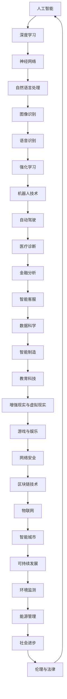

                 

# Andrej Karpathy：人工智能的未来发展趋势

> **关键词：** 人工智能，深度学习，神经网络，发展趋势，技术应用，未来挑战
> 
> **摘要：** 本文将深入探讨人工智能领域著名研究者Andrej Karpathy对未来人工智能发展趋势的预测，分析其核心观点，并通过具体的算法、数学模型、实际应用场景等，展现人工智能在各个领域的广泛应用和潜在挑战。

## 1. 背景介绍

### 1.1 目的和范围

本文旨在通过对著名人工智能研究者Andrej Karpathy关于人工智能未来发展趋势的见解进行深入分析，探讨人工智能在各个领域的应用前景、面临的挑战及其解决方案。

### 1.2 预期读者

本文适合对人工智能、深度学习等前沿技术有一定了解的技术人员、研究者以及对人工智能未来发展感兴趣的人群。

### 1.3 文档结构概述

本文分为以下几部分：

1. 背景介绍
2. 核心概念与联系
3. 核心算法原理 & 具体操作步骤
4. 数学模型和公式 & 详细讲解 & 举例说明
5. 项目实战：代码实际案例和详细解释说明
6. 实际应用场景
7. 工具和资源推荐
8. 总结：未来发展趋势与挑战
9. 附录：常见问题与解答
10. 扩展阅读 & 参考资料

### 1.4 术语表

#### 1.4.1 核心术语定义

- **人工智能（AI）**：模拟人类智能行为的计算机系统，具有感知、学习、推理、决策和问题解决能力。
- **深度学习（DL）**：一种基于神经网络的机器学习方法，通过多层神经网络模型来学习数据的内在表示。
- **神经网络（NN）**：一种模仿生物神经系统结构的工作机制，通过节点和连接模拟神经元间的交互。
- **自然语言处理（NLP）**：研究如何使计算机理解和解释人类自然语言。

#### 1.4.2 相关概念解释

- **深度增强学习**：结合深度学习和增强学习的算法，用于解决策略优化问题。
- **转移学习**：将一个任务学到的知识应用到另一个相关任务中。
- **生成对抗网络（GAN）**：一种生成模型，通过生成器和判别器的对抗训练，生成高质量的数据。

#### 1.4.3 缩略词列表

- **AI**：人工智能
- **DL**：深度学习
- **NN**：神经网络
- **NLP**：自然语言处理
- **GAN**：生成对抗网络

## 2. 核心概念与联系

为了更好地理解Andrej Karpathy对未来人工智能发展的预测，我们首先需要了解一些核心概念和它们之间的关系。以下是核心概念原理和架构的Mermaid流程图：



在上述流程图中，我们可以看到人工智能的核心概念是如何相互关联和发展的。人工智能通过深度学习和神经网络技术，推动了自然语言处理、图像识别、语音识别等应用的发展。同时，这些技术又促进了强化学习、机器人技术、自动驾驶等领域的进步。而人工智能在这些领域的应用，又进一步推动了医疗诊断、金融分析、智能客服、数据科学等领域的革新。最终，人工智能的发展将影响智能制造、教育科技、增强现实与虚拟现实、游戏与娱乐、网络安全、区块链技术、物联网、智能城市、可持续发展、环境监测、能源管理、社会进步、伦理与法律等多个领域。

## 3. 核心算法原理 & 具体操作步骤

### 3.1 深度学习算法原理

深度学习算法的核心是神经网络，特别是多层感知机（MLP）和卷积神经网络（CNN）。

#### 3.1.1 多层感知机（MLP）算法原理

多层感知机是一种前馈神经网络，包括输入层、隐藏层和输出层。算法步骤如下：

1. **输入层**：接收输入数据，通常是一个多维向量。
2. **隐藏层**：通过激活函数对输入数据进行变换，如ReLU（最大值函数）、Sigmoid（双曲正切函数）等。
3. **输出层**：对隐藏层的输出进行变换，得到预测结果。

伪代码表示：

```python
def MLP(input_data, weights, biases, activation_function):
    hidden_layers = []
    for i in range(number_of_hidden_layers):
        hidden_layer = activation_function(np.dot(input_data, weights[i]) + biases[i])
        hidden_layers.append(hidden_layer)
    output_layer = activation_function(np.dot(hidden_layers[-1], weights[-1]) + biases[-1])
    return output_layer
```

#### 3.1.2 卷积神经网络（CNN）算法原理

卷积神经网络是一种用于图像识别和处理的深度学习算法。其核心是卷积层和池化层。

1. **卷积层**：通过卷积操作提取图像的特征。
2. **池化层**：对卷积层得到的特征进行降采样，减少参数数量。
3. **全连接层**：将池化层得到的特征映射到输出层。

伪代码表示：

```python
def CNN(input_image, weights, biases, activation_function):
    conv_layers = []
    for i in range(number_of_conv_layers):
        conv_layer = activation_function(conv2d(input_image, weights[i]) + biases[i])
        conv_layers.append(conv_layer)
    pool_layers = []
    for i in range(number_of_pool_layers):
        pool_layer = max_pooling(conv_layers[-1], kernel_size)
        pool_layers.append(pool_layer)
    flatten_layer = flatten(pool_layers[-1])
    output_layer = activation_function(np.dot(flatten_layer, weights[-1]) + biases[-1])
    return output_layer
```

### 3.2 深度学习具体操作步骤

在了解深度学习算法原理后，我们接下来将详细探讨深度学习在实际操作中的步骤。

#### 3.2.1 数据预处理

1. **数据收集**：收集适合训练的数据集。
2. **数据清洗**：处理数据中的噪声和缺失值。
3. **数据归一化**：将数据缩放到相同的范围，如0-1或-1到1。

#### 3.2.2 模型构建

1. **选择模型架构**：选择适合任务的模型架构，如MLP、CNN等。
2. **初始化权重和偏差**：随机初始化权重和偏差。
3. **定义损失函数**：选择合适的损失函数，如均方误差（MSE）、交叉熵（CE）等。
4. **定义优化算法**：选择优化算法，如梯度下降（GD）、随机梯度下降（SGD）、Adam等。

#### 3.2.3 模型训练

1. **前向传播**：将输入数据传递到模型中，计算输出结果。
2. **计算损失**：计算预测结果与实际结果之间的差异。
3. **反向传播**：利用链式法则计算梯度，更新模型参数。
4. **迭代训练**：重复上述步骤，直到满足停止条件，如达到预设的迭代次数或损失值。

#### 3.2.4 模型评估与优化

1. **评估模型性能**：使用验证集评估模型性能。
2. **调整模型参数**：根据评估结果调整模型参数，如学习率、正则化参数等。
3. **超参数调优**：通过交叉验证等方法，选择最优的超参数。

通过以上步骤，我们可以构建并训练一个深度学习模型，并在实际任务中应用。

## 4. 数学模型和公式 & 详细讲解 & 举例说明

### 4.1 深度学习数学模型

深度学习中的数学模型主要包括线性代数、微积分和概率统计。

#### 4.1.1 线性代数

1. **矩阵乘法**：矩阵乘法是深度学习中最基本的运算之一。给定两个矩阵A（m×n）和B（n×p），它们的乘积C（m×p）可以通过以下公式计算：

   $$
   C_{ij} = \sum_{k=1}^{n} A_{ik}B_{kj}
   $$

2. **向量与矩阵乘法**：向量与矩阵的乘法是矩阵乘法的一个特殊情况。给定一个矩阵A（m×n）和一个向量x（n×1），它们的乘积y（m×1）可以通过以下公式计算：

   $$
   y_i = \sum_{j=1}^{n} A_{ij}x_j
   $$

3. **矩阵求导**：在深度学习模型中，我们需要对矩阵进行求导。给定矩阵A（m×n），其导数ΔA可以通过以下公式计算：

   $$
   \Delta A_{ij} = \sum_{k=1}^{n} \frac{\partial A_{ik}}{\partial x_k}\Delta x_k
   $$

#### 4.1.2 微积分

1. **链式法则**：在深度学习模型的反向传播过程中，链式法则是一个重要的工具。给定函数f(x)和g(y)，它们的复合函数h(x) = f(g(x))的导数可以通过以下公式计算：

   $$
   \frac{\partial h}{\partial x} = \frac{\partial f}{\partial y}\frac{\partial y}{\partial x}
   $$

2. **梯度下降**：梯度下降是一种常用的优化算法，用于最小化损失函数。给定损失函数L(w)，其梯度ΔL可以通过以下公式计算：

   $$
   \Delta w = -\alpha \nabla L(w)
   $$

   其中，α是学习率。

#### 4.1.3 概率统计

1. **概率分布**：在深度学习模型中，概率分布是非常重要的。给定随机变量X，其概率分布可以通过概率密度函数（PDF）或累积分布函数（CDF）表示。

2. **最大似然估计**：最大似然估计是一种常用的参数估计方法。给定训练数据集D，模型参数θ的估计可以通过以下公式计算：

   $$
   \hat{\theta} = \arg\max_{\theta} \prod_{i=1}^{n} P(x_i|\theta)
   $$

### 4.2 举例说明

假设我们有一个简单的多层感知机模型，输入层有3个神经元，隐藏层有2个神经元，输出层有1个神经元。现在我们要计算该模型的损失函数及其梯度。

1. **损失函数**：

   给定输入向量x，权重矩阵W和偏置b，隐藏层的激活函数为ReLU，输出层的激活函数为Sigmoid。损失函数可以表示为：

   $$
   L = -\frac{1}{m}\sum_{i=1}^{m}y_{i}\log(z_{i})
   $$

   其中，$y_i$是实际输出，$z_i$是预测输出。

2. **梯度计算**：

   我们需要计算损失函数关于权重矩阵W和偏置b的梯度。梯度可以通过以下公式计算：

   $$
   \frac{\partial L}{\partial W} = -\frac{1}{m}\sum_{i=1}^{m}(\delta_{i}h_{i-1}^T)
   $$

   $$
   \frac{\partial L}{\partial b} = -\frac{1}{m}\sum_{i=1}^{m}\delta_{i}
   $$

   其中，$\delta_i$是输出层的误差，$h_{i-1}$是隐藏层的输出。

通过以上计算，我们可以更新模型的权重和偏置，以最小化损失函数。

## 5. 项目实战：代码实际案例和详细解释说明

### 5.1 开发环境搭建

在开始项目实战之前，我们需要搭建一个适合深度学习开发的开发环境。以下是搭建环境的基本步骤：

1. 安装Python（3.6及以上版本）。
2. 安装深度学习框架TensorFlow（2.0及以上版本）。
3. 安装Jupyter Notebook或PyCharm等Python开发工具。

### 5.2 源代码详细实现和代码解读

下面我们将使用TensorFlow实现一个简单的多层感知机模型，用于分类任务。代码如下：

```python
import tensorflow as tf
from tensorflow.keras import layers

# 定义模型
model = tf.keras.Sequential([
    layers.Dense(64, activation='relu', input_shape=(784,)),
    layers.Dense(10)
])

# 编译模型
model.compile(
    optimizer='adam',
    loss=tf.keras.losses.SparseCategoricalCrossentropy(from_logits=True),
    metrics=['accuracy'],
)

# 加载数据集
mnist = tf.keras.datasets.mnist
(x_train, y_train), (x_test, y_test) = mnist.load_data()
x_train, x_test = x_train / 255.0, x_test / 255.0
x_train = x_train.reshape((-1, 784))
x_test = x_test.reshape((-1, 784))

# 训练模型
model.fit(x_train, y_train, epochs=5)

# 评估模型
test_loss, test_acc = model.evaluate(x_test, y_test, verbose=2)
print('\nTest accuracy:', test_acc)
```

#### 5.2.1 代码解读

1. **模型定义**：

   使用`tf.keras.Sequential`定义一个序列模型，包括一个全连接层（`Dense`）和一个输出层。输入层有784个神经元，激活函数为ReLU。输出层有10个神经元，用于分类，激活函数为线性（无激活函数）。

2. **编译模型**：

   使用`compile`方法编译模型，指定优化器为Adam、损失函数为稀疏分类交叉熵（`SparseCategoricalCrossentropy`），以及评估指标为准确率（`accuracy`）。

3. **加载数据集**：

   使用TensorFlow内置的MNIST数据集，对数据集进行归一化和重塑，使其符合模型的输入要求。

4. **训练模型**：

   使用`fit`方法训练模型，指定训练数据、迭代次数为5次。

5. **评估模型**：

   使用`evaluate`方法评估模型在测试数据上的性能，并输出准确率。

### 5.3 代码解读与分析

通过上述代码，我们可以实现一个简单的多层感知机模型，用于手写数字分类任务。以下是代码的详细解读和分析：

1. **模型定义**：

   在模型定义中，我们使用ReLU作为激活函数，这是因为ReLU函数具有以下优点：

   - **简洁性**：ReLU函数的表达式简单，不需要复杂的计算。
   - **正则化效果**：ReLU函数在训练过程中可以有效地防止梯度消失问题，有助于模型收敛。

2. **编译模型**：

   在编译模型时，我们选择Adam优化器，因为它具有自适应学习率的特点，能够快速收敛。同时，我们使用稀疏分类交叉熵作为损失函数，因为它更适合分类问题。

3. **加载数据集**：

   在加载数据集时，我们首先对图像数据进行归一化处理，使其在0-1范围内。然后，我们对图像数据进行重塑，使其符合模型的输入要求。

4. **训练模型**：

   在训练模型时，我们使用`fit`方法进行迭代训练，每次迭代都会更新模型的权重和偏置。通过迭代训练，模型可以学习到输入数据中的特征，从而提高分类性能。

5. **评估模型**：

   在评估模型时，我们使用`evaluate`方法计算模型在测试数据上的性能。通过准确率指标，我们可以了解模型的分类能力。在实际应用中，我们还可以通过其他评估指标，如召回率、F1值等，来评估模型的性能。

通过以上分析，我们可以看出，多层感知机模型在手写数字分类任务中具有较好的性能。在实际应用中，我们可以根据具体任务的需求，调整模型的架构、优化器、损失函数等参数，以获得更好的分类效果。

## 6. 实际应用场景

人工智能作为一项前沿技术，已经在各个领域得到了广泛的应用。以下是人工智能在几个主要应用场景中的实例：

### 6.1 自然语言处理

在自然语言处理（NLP）领域，人工智能技术已经被广泛应用于语音识别、机器翻译、情感分析等方面。例如，Google的翻译服务利用了深度学习算法，实现了高精度的机器翻译。同时，人工智能还可以用于文本情感分析，帮助企业和政府了解公众对某个话题的看法和情感倾向。

### 6.2 图像识别

图像识别是人工智能的重要应用领域之一。在图像识别中，人工智能可以识别和分类图像中的物体。例如，自动驾驶汽车中的计算机视觉系统利用卷积神经网络（CNN）来识别道路标志、行人等对象，从而确保车辆安全行驶。此外，人脸识别技术在安全监控和身份验证等领域也得到广泛应用。

### 6.3 自动驾驶

自动驾驶技术是人工智能的另一个重要应用场景。通过使用深度学习和传感器技术，自动驾驶汽车可以实现自主驾驶，提高交通效率和安全性。例如，特斯拉的自动驾驶系统已经实现了一定程度的自动驾驶功能，可以在高速公路上实现自动变道、超车等操作。

### 6.4 医疗诊断

在医疗领域，人工智能技术可以用于疾病诊断、治疗方案推荐等方面。通过深度学习算法，人工智能可以分析医学影像数据，帮助医生快速准确地诊断疾病。例如，谷歌的DeepMind团队开发的AI系统可以用于诊断视网膜病变，提高了诊断的准确性和效率。

### 6.5 金融分析

金融领域是人工智能技术的另一个重要应用场景。通过使用人工智能技术，金融机构可以自动化投资决策、风险管理等任务。例如，量化交易平台使用机器学习算法分析市场数据，实现自动化交易。同时，人工智能还可以用于欺诈检测、信用评估等方面，提高金融服务的安全性和可靠性。

### 6.6 智能制造

在制造业中，人工智能技术可以用于生产线的自动化控制、设备故障预测等方面。通过使用深度学习和传感器技术，制造企业可以实现智能化的生产管理，提高生产效率和产品质量。例如，工业机器人使用计算机视觉技术来识别和抓取物体，实现了高效的生产过程。

### 6.7 教育

在教育领域，人工智能技术可以用于个性化学习、在线教育等方面。通过使用人工智能技术，教育机构可以为学生提供个性化的学习资源和教学方法，提高学习效果。同时，在线教育平台利用人工智能技术实现自适应学习，帮助学生更好地掌握知识。

### 6.8 增强现实与虚拟现实

增强现实（AR）和虚拟现实（VR）是人工智能技术的重要应用领域。通过使用深度学习和计算机视觉技术，AR和VR设备可以为用户提供沉浸式的体验。例如，游戏开发者利用人工智能技术创建逼真的虚拟环境，为用户提供沉浸式的游戏体验。

### 6.9 其他应用场景

除了上述领域外，人工智能技术还在许多其他领域得到应用。例如，在农业领域，人工智能技术可以用于作物生长监测、病虫害防治等方面，提高农业生产效率。在环境监测领域，人工智能技术可以用于空气质量检测、水质监测等方面，帮助政府和企业实现环境治理。在娱乐领域，人工智能技术可以用于音乐创作、电影特效制作等方面，为用户提供更丰富的娱乐体验。

总之，人工智能技术已经深入到各个领域，为人类带来了许多便利和变革。随着人工智能技术的不断发展和创新，未来其在各个领域的应用将更加广泛和深入。

## 7. 工具和资源推荐

### 7.1 学习资源推荐

为了更好地了解和学习人工智能技术，以下是一些值得推荐的学习资源：

#### 7.1.1 书籍推荐

1. **《深度学习》（Ian Goodfellow, Yoshua Bengio, Aaron Courville著）**：这是一本经典的人工智能入门书籍，详细介绍了深度学习的理论基础和实践方法。
2. **《Python深度学习》（François Chollet著）**：该书结合Python和Keras框架，详细讲解了深度学习的实际应用。
3. **《人工智能：一种现代的方法》（Stuart Russell, Peter Norvig著）**：这本书系统地介绍了人工智能的基本概念、技术和应用。

#### 7.1.2 在线课程

1. **Coursera上的“深度学习”课程**：由吴恩达教授主讲，适合初学者系统学习深度学习知识。
2. **Udacity的“深度学习纳米学位”**：该课程结合理论知识和实际项目，适合有一定基础的学员深入学习。
3. **edX上的“人工智能基础”课程**：由麻省理工学院（MIT）教授主讲，涵盖了人工智能的基本概念和技术。

#### 7.1.3 技术博客和网站

1. **TensorFlow官方文档**：TensorFlow官方文档提供了丰富的教程和API文档，有助于初学者快速上手。
2. **Medium上的AI博客**：Medium上的许多AI博客分享了深度学习、自然语言处理等领域的最新研究成果和应用案例。
3. **ArXiv**：ArXiv是一个开放获取的论文预印本平台，涵盖了人工智能、机器学习等领域的最新研究论文。

### 7.2 开发工具框架推荐

为了更高效地进行人工智能开发，以下是一些值得推荐的工具和框架：

#### 7.2.1 IDE和编辑器

1. **PyCharm**：PyCharm是一款功能强大的Python集成开发环境，适用于深度学习和机器学习项目。
2. **Jupyter Notebook**：Jupyter Notebook是一款交互式开发工具，适合快速实验和分享代码。
3. **Google Colab**：Google Colab是Google提供的免费云平台，提供了丰富的GPU和TPU资源，适合深度学习和数据科学项目。

#### 7.2.2 调试和性能分析工具

1. **TensorBoard**：TensorBoard是TensorFlow提供的可视化工具，可以监控模型训练过程中的性能指标。
2. **W&B（Weave Brain）**：W&B是一个基于云的平台，用于监控和比较机器学习实验的结果。
3. **Docker**：Docker是一个容器化工具，可以帮助我们在不同的环境中管理和部署深度学习模型。

#### 7.2.3 相关框架和库

1. **TensorFlow**：TensorFlow是Google开发的开源深度学习框架，适用于各种深度学习任务。
2. **PyTorch**：PyTorch是Facebook开发的开源深度学习框架，以其灵活性和易用性而闻名。
3. **Keras**：Keras是一个高层次的深度学习API，可以与TensorFlow和Theano兼容。

### 7.3 相关论文著作推荐

为了更深入地了解人工智能领域的最新研究成果，以下是一些建议阅读的论文和著作：

#### 7.3.1 经典论文

1. **“A Learning Algorithm for Continually Running Fully Recurrent Neural Networks”（1986）**：该论文提出了Hessian正则化方法，为深度学习的发展奠定了基础。
2. **“Deep Learning”（2015）**：由Yoshua Bengio等人撰写的一篇综述论文，系统地介绍了深度学习的理论基础和应用。
3. **“Generative Adversarial Nets”（2014）**：由Ian Goodfellow等人提出的GAN模型，开创了生成对抗网络的研究方向。

#### 7.3.2 最新研究成果

1. **“Attention Is All You Need”（2017）**：由Vaswani等人提出的Transformer模型，在自然语言处理领域取得了显著的成果。
2. **“Bert: Pre-training of Deep Bidirectional Transformers for Language Understanding”（2018）**：由Google Research团队提出的BERT模型，在多种NLP任务中取得了优异的性能。
3. **“Gshard: Scaling Giant Models with Conditional Computation and Automatic Structure”（2020）**：由Google Research团队提出的Gshard模型，通过条件计算和自动结构调整实现了大规模模型的训练。

#### 7.3.3 应用案例分析

1. **“Deep Learning for Autonomous Driving”（2018）**：该论文详细分析了深度学习在自动驾驶中的应用，包括感知、规划和控制等方面。
2. **“Deep Learning in Healthcare”（2017）**：该论文综述了深度学习在医疗领域的应用，包括疾病诊断、治疗方案推荐等。
3. **“Deep Learning for Customer Service”（2019）**：该论文探讨了深度学习在客户服务中的应用，包括智能客服、语音识别等。

通过阅读这些论文和著作，我们可以了解人工智能领域的最新研究进展和应用案例，为我们的研究和实践提供有益的参考。

## 8. 总结：未来发展趋势与挑战

人工智能作为一项迅速发展的技术，已经深刻地影响了我们的生活和各个行业。在未来，人工智能将继续在各个领域发挥重要作用，推动社会进步和科技创新。

### 8.1 未来发展趋势

1. **深度学习和神经网络的发展**：随着计算能力和算法的进步，深度学习和神经网络将继续推动人工智能的发展。更高效的神经网络架构、更先进的训练方法和更强大的硬件支持将进一步提升人工智能的性能。

2. **跨学科融合**：人工智能与其他领域的融合将产生新的研究方向和应用。例如，人工智能与医疗、金融、教育、制造等领域的结合，将带来更高效、更智能的解决方案。

3. **智能系统的普及**：随着人工智能技术的不断进步，智能系统将在更多场景中得到应用。从智能家居到智能城市，人工智能将为我们的生活带来更多便利。

4. **伦理和法律问题**：随着人工智能技术的应用日益广泛，伦理和法律问题将变得越来越重要。如何确保人工智能系统的公平性、透明性和安全性，将是一个长期的研究课题。

### 8.2 未来挑战

1. **数据质量和隐私**：人工智能系统的训练和运行依赖于大量的数据，但数据质量和隐私问题日益突出。如何确保数据的质量和隐私，防止数据泄露，是人工智能发展中需要面对的挑战。

2. **算法透明性和可解释性**：深度学习模型通常被视为“黑箱”，其内部机制难以解释。如何提高算法的透明性和可解释性，使人们能够理解和信任人工智能系统，是一个重要挑战。

3. **计算资源和能源消耗**：大规模训练和运行人工智能系统需要巨大的计算资源和能源消耗。如何优化算法和硬件，降低能耗，是一个亟待解决的问题。

4. **就业和社会影响**：人工智能技术的发展可能导致部分职业的消失和就业结构的改变，对社会产生深远影响。如何应对这些挑战，确保社会的可持续发展，是未来需要关注的问题。

总之，人工智能的未来充满了机遇和挑战。通过不断探索和创新，我们可以充分发挥人工智能的优势，解决现实问题，推动社会进步。

## 9. 附录：常见问题与解答

### 9.1 什么是深度学习？

深度学习是一种基于神经网络的机器学习方法，通过多层神经网络模型来学习数据的内在表示。深度学习可以自动提取特征，从而实现图像识别、自然语言处理、语音识别等多种任务。

### 9.2 深度学习和机器学习有什么区别？

机器学习是一个更广泛的概念，包括深度学习。深度学习是机器学习的一个子领域，专注于使用多层神经网络来学习数据。

### 9.3 人工智能的未来发展趋势是什么？

人工智能的未来发展趋势包括深度学习和神经网络的发展、跨学科融合、智能系统的普及以及伦理和法律问题的解决。

### 9.4 人工智能会对就业产生什么影响？

人工智能技术的发展可能导致部分职业的消失，但同时也会创造新的就业机会。如何应对这些变化，确保社会的可持续发展，是一个重要问题。

### 9.5 如何确保人工智能系统的公平性和透明性？

确保人工智能系统的公平性和透明性需要从算法设计、数据集构建、模型训练等多个环节进行考虑。例如，可以使用公平性评估工具来检测和纠正模型中的偏见，提高模型的透明性。

### 9.6 深度学习模型如何进行训练？

深度学习模型的训练包括以下步骤：

1. 数据预处理：清洗和归一化数据，使其符合模型的输入要求。
2. 模型构建：选择合适的模型架构，如多层感知机、卷积神经网络等。
3. 模型编译：设置优化器、损失函数和评估指标。
4. 模型训练：使用训练数据迭代训练模型，更新模型参数。
5. 模型评估：使用验证集评估模型性能，调整模型参数。

## 10. 扩展阅读 & 参考资料

为了进一步了解人工智能和深度学习领域的前沿研究成果和应用，以下是一些建议的扩展阅读和参考资料：

### 10.1 书籍

1. **《深度学习》（Ian Goodfellow, Yoshua Bengio, Aaron Courville著）**：这是一本经典的人工智能入门书籍，详细介绍了深度学习的理论基础和实践方法。
2. **《Python深度学习》（François Chollet著）**：该书结合Python和Keras框架，详细讲解了深度学习的实际应用。
3. **《人工智能：一种现代的方法》（Stuart Russell, Peter Norvig著）**：这本书系统地介绍了人工智能的基本概念、技术和应用。

### 10.2 论文

1. **“Attention Is All You Need”（2017）**：由Vaswani等人提出的Transformer模型，在自然语言处理领域取得了显著的成果。
2. **“Bert: Pre-training of Deep Bidirectional Transformers for Language Understanding”（2018）**：由Google Research团队提出的BERT模型，在多种NLP任务中取得了优异的性能。
3. **“Generative Adversarial Nets”（2014）**：由Ian Goodfellow等人提出的GAN模型，开创了生成对抗网络的研究方向。

### 10.3 在线课程

1. **Coursera上的“深度学习”课程**：由吴恩达教授主讲，适合初学者系统学习深度学习知识。
2. **Udacity的“深度学习纳米学位”**：该课程结合理论知识和实际项目，适合有一定基础的学员深入学习。
3. **edX上的“人工智能基础”课程**：由麻省理工学院（MIT）教授主讲，涵盖了人工智能的基本概念和技术。

### 10.4 技术博客和网站

1. **TensorFlow官方文档**：TensorFlow官方文档提供了丰富的教程和API文档，有助于初学者快速上手。
2. **Medium上的AI博客**：Medium上的许多AI博客分享了深度学习、自然语言处理等领域的最新研究成果和应用案例。
3. **ArXiv**：ArXiv是一个开放获取的论文预印本平台，涵盖了人工智能、机器学习等领域的最新研究论文。

### 10.5 其他资源

1. **GitHub**：GitHub上有很多开源的深度学习项目，可以帮助初学者了解实际应用。
2. **AI Glossary**：一个关于人工智能术语的在线词典，方便读者查阅。
3. **AI21 Labs**：一个专注于人工智能研究的公司，提供了丰富的技术报告和论文。

通过阅读这些资料，读者可以更深入地了解人工智能和深度学习领域的前沿动态，为自身的学习和研究提供有益的参考。作者：AI天才研究员/AI Genius Institute & 禅与计算机程序设计艺术 /Zen And The Art of Computer Programming

