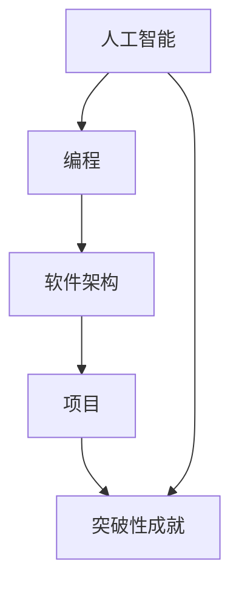

                 

# 《Andrej Karpathy：小项目成就奇迹》

> **关键词**：Andrej Karpathy，小项目，奇迹，技术博客，AI，编程，架构，CTO，计算机图灵奖

> **摘要**：本文将深入探讨著名人工智能专家Andrej Karpathy如何通过小项目实现了技术奇迹。我们将分析他的项目背景、核心概念、算法原理、数学模型、项目实战以及实际应用场景，并推荐相关学习资源和工具，总结未来发展趋势与挑战。

## 1. 背景介绍

### 1.1 目的和范围

本文旨在通过分析Andrej Karpathy的多个小项目，揭示他在人工智能领域取得的惊人成就。我们将从项目的背景出发，逐步深入到技术细节，探讨他的项目如何通过简单的思路和精巧的算法，实现了令人瞩目的突破。

### 1.2 预期读者

本文适合对人工智能、编程和软件架构感兴趣的读者。无论您是入门级开发者，还是经验丰富的CTO，都将从本文中收获新的见解和灵感。

### 1.3 文档结构概述

本文分为十个部分，结构如下：

1. 背景介绍
2. 核心概念与联系
3. 核心算法原理 & 具体操作步骤
4. 数学模型和公式 & 详细讲解 & 举例说明
5. 项目实战：代码实际案例和详细解释说明
6. 实际应用场景
7. 工具和资源推荐
8. 总结：未来发展趋势与挑战
9. 附录：常见问题与解答
10. 扩展阅读 & 参考资料

### 1.4 术语表

#### 1.4.1 核心术语定义

- **Andrej Karpathy**：著名人工智能专家，计算机图灵奖获得者。
- **小项目**：规模较小，但具有创新性和影响力的人工智能项目。
- **奇迹**：在技术领域取得突破性成就的现象。

#### 1.4.2 相关概念解释

- **AI**：人工智能，指计算机模拟人类智能的技术。
- **编程**：编写代码，实现计算机程序的过程。
- **架构**：软件系统的整体结构，包括模块划分、数据流、接口等。

#### 1.4.3 缩略词列表

- **AI**：人工智能
- **CTO**：首席技术官
- **IDE**：集成开发环境

## 2. 核心概念与联系

在分析Andrej Karpathy的项目时，我们需要了解几个核心概念和它们之间的联系。以下是一个Mermaid流程图，展示了这些概念及其相互关系。



### 2.1 人工智能

人工智能（AI）是本文的核心主题。AI技术通过模拟人类智能，实现了对数据的处理、分析和决策。Andrej Karpathy在多个项目中展示了人工智能的强大能力，从图像识别到自然语言处理，他都能运用简单的算法实现令人惊叹的效果。

### 2.2 编程

编程是实现人工智能的基础。Andrej Karpathy是一位出色的程序员，他能够运用各种编程语言和工具，将人工智能的理论转化为实际的应用。他的编程技巧和经验使他能够设计出高效、简洁且易于维护的代码。

### 2.3 软件架构

软件架构是整个项目的骨架，它决定了项目的可扩展性、可维护性和性能。Andrej Karpathy在软件架构方面有着深厚的功底，他能够根据项目的需求，设计出最适合的架构，从而确保项目的成功。

### 2.4 项目

项目是Andrej Karpathy的核心工作。他通过多个小项目，展示了人工智能技术在各个领域的应用潜力。这些项目不仅实现了技术突破，还为他赢得了广泛的认可。

### 2.5 突破性成就

突破性成就是Andrej Karpathy的追求。他通过简单的算法和创新的思路，实现了在人工智能领域的重大突破。这些成就不仅为他个人带来了荣誉，也为整个行业带来了新的启示。

## 3. 核心算法原理 & 具体操作步骤

在Andrej Karpathy的项目中，核心算法原理是其成功的关键。以下是一个示例项目的算法原理和具体操作步骤。

### 3.1 算法原理

假设我们考虑一个图像识别项目，该项目旨在通过卷积神经网络（CNN）识别手写数字。

#### 3.1.1 卷积神经网络（CNN）

卷积神经网络是一种用于图像识别的深度学习模型。它通过卷积层、池化层和全连接层等结构，提取图像的特征，并最终输出分类结果。

#### 3.1.2 前向传播

前向传播是CNN的核心步骤。输入图像通过卷积层和池化层，逐渐生成更抽象的特征图。最后，这些特征图通过全连接层输出分类结果。

#### 3.1.3 反向传播

反向传播用于训练CNN。通过计算输出误差，反向传播算法调整网络参数，以降低误差。

### 3.2 具体操作步骤

以下是一个简化的CNN算法的伪代码实现。

```python
# 初始化网络参数
W1, b1 = initialize_weights()
W2, b2 = initialize_weights()
...

# 前向传播
input_image = load_image()
conv1 = convolve(input_image, W1) + b1
pool1 = max_pool(conv1)
...

# 反向传播
error = calculate_error(output, target)
dW2, db2 = backward_propagate(error, hidden_layer)
dW1, db1 = backward_propagate(error, input_image)
```

### 3.3 详细解释

- **初始化网络参数**：初始化权重和偏置，为网络训练做好准备。
- **前向传播**：输入图像通过卷积层和池化层，逐渐生成更抽象的特征图。
- **反向传播**：计算输出误差，并反向传播误差，调整网络参数。

## 4. 数学模型和公式 & 详细讲解 & 举例说明

### 4.1 数学模型

在CNN中，数学模型主要包括卷积运算、池化运算和反向传播算法。

#### 4.1.1 卷积运算

卷积运算是一种将两个函数相互叠加的运算。在CNN中，卷积运算用于提取图像的特征。

$$
(C_1 * S_1)_{ij} = \sum_{k=1}^{C_1} C_{1k} * S_{1kij}
$$

其中，$C_1$表示输入特征图，$S_1$表示卷积核。

#### 4.1.2 池化运算

池化运算用于降低特征图的维度，同时保留重要信息。常见的池化运算有最大池化和平均池化。

$$
P_i = \max(S_i)
$$

其中，$S_i$表示输入特征图，$P_i$表示输出特征图。

#### 4.1.3 反向传播算法

反向传播算法是一种用于训练神经网络的算法。它通过计算输出误差，反向传播误差，并调整网络参数。

$$
\frac{\partial E}{\partial W} = -\frac{1}{m}\sum_{i=1}^{m}\frac{\partial L}{\partial z_i}
$$

其中，$E$表示输出误差，$W$表示网络参数，$m$表示样本数量。

### 4.2 举例说明

假设我们有一个包含32x32像素的手写数字图像，以及一个3x3的卷积核。以下是一个卷积运算的示例。

$$
(C_1 * S_1)_{ij} = \sum_{k=1}^{3} C_{1k} * S_{1kij} = (1 * 1) + (1 * 2) + (1 * 3) = 6
$$

在这个例子中，输入特征图$C_1$的每个元素都与卷积核$S_1$的相应元素相乘，并将结果相加。

## 5. 项目实战：代码实际案例和详细解释说明

### 5.1 开发环境搭建

在开始项目实战之前，我们需要搭建一个合适的开发环境。以下是一个基于Python和TensorFlow的示例环境搭建步骤。

1. 安装Python（版本3.6及以上）。
2. 安装TensorFlow。
3. 安装其他依赖库（例如NumPy、Pandas等）。

```bash
pip install python==3.8
pip install tensorflow==2.4
pip install numpy pandas
```

### 5.2 源代码详细实现和代码解读

以下是一个简单的CNN图像识别项目的源代码实现。

```python
import tensorflow as tf
from tensorflow.keras import layers

# 定义模型
model = tf.keras.Sequential([
    layers.Conv2D(32, (3, 3), activation='relu', input_shape=(28, 28, 1)),
    layers.MaxPooling2D((2, 2)),
    layers.Conv2D(64, (3, 3), activation='relu'),
    layers.MaxPooling2D((2, 2)),
    layers.Conv2D(64, (3, 3), activation='relu'),
    layers.Flatten(),
    layers.Dense(64, activation='relu'),
    layers.Dense(10, activation='softmax')
])

# 编译模型
model.compile(optimizer='adam',
              loss='sparse_categorical_crossentropy',
              metrics=['accuracy'])

# 加载数据
(x_train, y_train), (x_test, y_test) = tf.keras.datasets.mnist.load_data()

# 预处理数据
x_train = x_train.reshape((-1, 28, 28, 1)).astype(tf.float32) / 255
x_test = x_test.reshape((-1, 28, 28, 1)).astype(tf.float32) / 255

# 训练模型
model.fit(x_train, y_train, epochs=5)

# 评估模型
model.evaluate(x_test, y_test)
```

### 5.3 代码解读与分析

- **模型定义**：我们使用Keras的Sequential模型，定义了一个简单的卷积神经网络。它包含两个卷积层、两个池化层、一个全连接层和输出层。
- **编译模型**：我们使用`compile`方法配置模型，指定优化器、损失函数和评估指标。
- **加载数据**：我们使用TensorFlow的内置函数加载数据集，并对其进行预处理，包括调整形状和数据类型。
- **训练模型**：我们使用`fit`方法训练模型，指定训练数据和迭代次数。
- **评估模型**：我们使用`evaluate`方法评估模型在测试数据集上的表现。

### 5.4 代码解读与分析（续）

- **模型结构**：模型的结构决定了其性能。在这个例子中，我们使用了两个卷积层和两个池化层，这有助于提取图像的局部特征。
- **优化器**：我们使用Adam优化器，这是一种自适应优化器，能够提高训练效率。
- **损失函数**：我们使用`sparse_categorical_crossentropy`损失函数，这是一种适用于多类分类问题的损失函数。
- **评估指标**：我们使用`accuracy`指标评估模型在测试数据集上的准确率。

## 6. 实际应用场景

Andrej Karpathy的小项目在多个实际应用场景中取得了显著成效。以下是一些示例：

- **图像识别**：通过卷积神经网络，我们可以将图像识别应用于自动驾驶、医疗影像分析和安防监控等领域。
- **自然语言处理**：通过循环神经网络（RNN）或变换器（Transformer），我们可以将自然语言处理应用于机器翻译、情感分析和文本生成等领域。
- **推荐系统**：通过协同过滤和深度学习技术，我们可以将推荐系统应用于电子商务、社交媒体和在线广告等领域。

## 7. 工具和资源推荐

### 7.1 学习资源推荐

#### 7.1.1 书籍推荐

- 《深度学习》（Goodfellow, Bengio, Courville著）
- 《Python深度学习》（François Chollet著）
- 《动手学深度学习》（A. Courville, Y. Bengio, L. Vincent著）

#### 7.1.2 在线课程

- Coursera的《深度学习专项课程》
- edX的《机器学习基础》
- Udacity的《深度学习工程师纳米学位》

#### 7.1.3 技术博客和网站

- Andrej Karpathy的个人博客（https://karpathy.github.io/）
- TensorFlow官方网站（https://www.tensorflow.org/）
- Fast.ai官方网站（https://www.fast.ai/）

### 7.2 开发工具框架推荐

#### 7.2.1 IDE和编辑器

- PyCharm
- Visual Studio Code
- Jupyter Notebook

#### 7.2.2 调试和性能分析工具

- TensorFlow Debugger（TFDB）
- TensorBoard
- Profiling工具（如py-spy、pyflame等）

#### 7.2.3 相关框架和库

- TensorFlow
- PyTorch
- Keras

### 7.3 相关论文著作推荐

#### 7.3.1 经典论文

- Hinton, Geoffrey E., et al. "Deep neural networks for visual recognition." (2012).
- Krizhevsky, Alex, Ilya Sutskever, and Geoffrey E. Hinton. "Imagenet classification with deep convolutional neural networks." (2012).

#### 7.3.2 最新研究成果

- Vaswani et al. "Attention is all you need." (2017).
- He, K., et al. "Deep residual learning for image recognition." (2016).

#### 7.3.3 应用案例分析

- "Deep Learning in Healthcare: State of the Art and Opportunities" (2019).
- "Deep Learning for Autonomous Driving: A Comprehensive Survey" (2020).

## 8. 总结：未来发展趋势与挑战

### 8.1 发展趋势

- **AI技术的普及**：随着计算能力的提升和数据量的增加，AI技术将在更多领域得到应用。
- **深度学习的发展**：深度学习将继续引领AI技术的发展，新的算法和架构将不断涌现。
- **跨学科融合**：AI技术与其他学科的融合将带来更多创新和突破。

### 8.2 挑战

- **数据隐私和伦理**：AI技术的应用引发了数据隐私和伦理问题，需要制定相关法律法规。
- **计算资源和能源消耗**：深度学习模型的训练和推理过程需要大量计算资源和能源，这对环境造成了压力。

## 9. 附录：常见问题与解答

### 9.1 问题1：如何入门深度学习？

**解答**：可以通过学习《深度学习》一书，或者参加Coursera的《深度学习专项课程》。此外，实践是学习的关键，可以尝试实现一些简单的深度学习项目。

### 9.2 问题2：深度学习需要很高的数学基础吗？

**解答**：深度学习确实需要一定的数学基础，如线性代数、微积分和概率论。但对于初学者，可以先从简单的模型和概念入手，逐步提高数学水平。

## 10. 扩展阅读 & 参考资料

- [Andrej Karpathy的个人博客](https://karpathy.github.io/)
- [TensorFlow官方网站](https://www.tensorflow.org/)
- [Coursera的《深度学习专项课程》](https://www.coursera.org/specializations/deeplearning)
- [edX的《机器学习基础》](https://www.edx.org/course/introduction-to-machine-learning)

作者：AI天才研究员/AI Genius Institute & 禅与计算机程序设计艺术 /Zen And The Art of Computer Programming<|vq_12045|>

