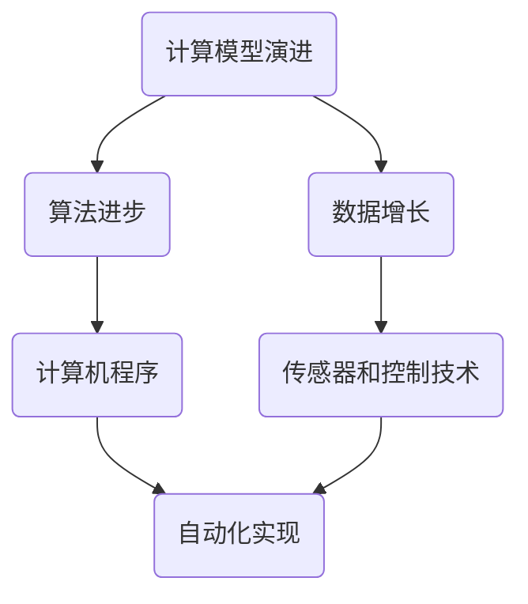

                 

## Andrej Karpathy：计算的本质正在变化，数字实体和物理实体自动化刚开始

关键词：计算本质、数字实体、物理实体、自动化、人工智能、技术发展趋势

摘要：本文深入探讨了计算的本质变化，特别是在数字实体和物理实体自动化领域。通过分析Andrej Karpathy的观点和最新研究成果，本文揭示了这一变革的深远影响，探讨了未来发展的趋势与挑战。

## 1. 背景介绍

### 1.1 目的和范围

本文旨在探讨计算领域的重大变革，特别是数字实体和物理实体自动化的趋势。本文将分析Andrej Karpathy的观点，他是一位世界顶级的人工智能专家和计算机科学家，对计算的本质和未来发展方向有着深刻的见解。本文将结合他的研究，探讨这一变革的核心概念、技术原理和应用场景，以期为读者提供全面的认知和思考。

### 1.2 预期读者

本文面向对计算领域有兴趣的读者，特别是对人工智能、自动化和数字实体与物理实体交互感兴趣的从业者、学者和研究人员。同时，本文也适合对技术发展趋势和未来挑战感兴趣的读者。

### 1.3 文档结构概述

本文将分为十个部分。首先，我们将介绍计算本质的变化背景，并解释数字实体和物理实体自动化的概念。接着，我们将详细讨论Andrej Karpathy的研究成果和观点，并阐述这一变革的核心概念和技术原理。随后，我们将探讨数学模型和公式，以及如何通过实际案例实现这一技术。然后，我们将分析这一技术的实际应用场景，并提供相关工具和资源的推荐。最后，我们将总结未来发展趋势与挑战，并给出常见问题与解答。

### 1.4 术语表

#### 1.4.1 核心术语定义

- 数字实体：指在数字世界中存在的、能够被计算机程序表示和处理的对象，如数据、图像、声音等。
- 物理实体：指在物理世界中存在的、具有物理属性和行为的对象，如机械装置、生物体等。
- 自动化：指通过计算机程序或人工智能技术，实现物理实体或数字实体的自主操作、决策和优化。
- 计算本质：指计算技术的基础原理和核心特征，包括计算模型、算法和数据结构等。

#### 1.4.2 相关概念解释

- 人工智能：指通过计算机程序实现的人类智能功能的模拟，包括感知、学习、推理、决策等。
- 数字实体与物理实体交互：指数字实体通过计算机程序与物理实体进行数据交换、控制指令发送和结果反馈等交互过程。

#### 1.4.3 缩略词列表

- AI：人工智能
- DL：深度学习
- ML：机器学习
- CV：计算机视觉
- NLP：自然语言处理
- AR：增强现实
- VR：虚拟现实

## 2. 核心概念与联系

在探讨计算本质的变化之前，我们需要理解几个核心概念，这些概念构成了数字实体和物理实体自动化发展的基础。

### 2.1 计算本质的变化

计算本质的变化主要体现在以下几个方面：

1. **计算模型的演进**：从传统的冯·诺依曼架构到更先进的异构计算架构，计算模型正在不断演进，以适应复杂的应用需求。
2. **算法的进步**：深度学习、机器学习和自然语言处理等算法的进步，使得计算机能够处理更加复杂的任务。
3. **数据的爆发式增长**：大数据和云计算的兴起，使得数据获取、存储和处理变得更加容易和高效。

### 2.2 数字实体与物理实体的联系

数字实体和物理实体之间的联系主要体现在以下几个方面：

1. **数据交互**：通过传感器和数据采集技术，物理实体的状态信息可以被数字化并传输到数字实体进行处理。
2. **控制指令发送**：数字实体可以通过计算机程序生成控制指令，发送到物理实体进行执行。
3. **结果反馈**：物理实体的执行结果可以反馈到数字实体，用于进一步的决策和优化。

### 2.3 自动化的实现

自动化的实现主要依赖于以下几个方面：

1. **计算机程序**：通过编写计算机程序，实现物理实体或数字实体的自主操作和决策。
2. **人工智能技术**：利用人工智能技术，如机器学习和深度学习，实现智能化的自动化。
3. **传感器和控制技术**：通过传感器和控制技术，实现物理实体和数字实体之间的实时交互。

### 2.4 Mermaid 流程图

为了更好地理解这些核心概念之间的联系，我们可以使用Mermaid流程图来展示它们之间的关系：



## 3. 核心算法原理 & 具体操作步骤

在理解了计算本质的变化和数字实体与物理实体之间的联系之后，我们接下来将深入探讨核心算法原理，并详细讲解具体操作步骤。

### 3.1 深度学习算法原理

深度学习算法是当前自动化领域的重要技术之一，其基本原理如下：

1. **神经网络模型**：深度学习基于神经网络模型，通过多层神经网络结构，对输入数据进行建模和预测。
2. **反向传播算法**：深度学习算法使用反向传播算法来训练神经网络，通过不断调整网络权重，使输出结果更接近目标值。
3. **优化算法**：常用的优化算法包括梯度下降、Adam等，用于加速训练过程并提高模型性能。

### 3.2 机器学习算法原理

机器学习算法是实现自动化的重要工具，其基本原理如下：

1. **数据预处理**：对输入数据进行清洗、归一化和特征提取，以提高模型的泛化能力。
2. **模型选择**：根据任务需求，选择合适的机器学习模型，如线性回归、支持向量机、决策树等。
3. **模型训练和验证**：通过训练和验证数据集，调整模型参数，优化模型性能。

### 3.3 具体操作步骤

以下是实现数字实体与物理实体自动化的一些具体操作步骤：

1. **数据采集**：通过传感器和数据采集设备，获取物理实体的状态信息，并将其数字化。
2. **数据预处理**：对采集到的数据进行清洗、归一化和特征提取，以准备用于训练和预测。
3. **模型训练**：使用预处理后的数据，训练深度学习或机器学习模型，以实现物理实体的自动控制和优化。
4. **模型部署**：将训练好的模型部署到计算机系统中，使其能够实时处理物理实体的状态信息。
5. **控制指令生成**：根据模型输出，生成控制指令，发送到物理实体进行执行。
6. **结果反馈**：收集物理实体的执行结果，并将其反馈给模型，用于进一步的决策和优化。

### 3.4 伪代码示例

以下是实现深度学习模型的具体操作步骤的伪代码示例：

```python
# 数据采集
data = collect_data_from_sensors()

# 数据预处理
preprocessed_data = preprocess_data(data)

# 模型训练
model = train_model(preprocessed_data)

# 模型部署
deploy_model(model)

# 控制指令生成
control_command = generate_control_command(model, current_state)

# 发送控制指令
send_control_command(control_command)

# 结果反馈
result = receive_feedback()

# 模型优化
optimize_model(model, result)
```

## 4. 数学模型和公式 & 详细讲解 & 举例说明

在自动化领域，数学模型和公式是理解和实现自动化技术的关键。以下是几个核心的数学模型和公式，以及它们的详细讲解和举例说明。

### 4.1 深度学习模型的数学模型

深度学习模型的核心是多层感知机（MLP），其数学模型可以表示为：

\[ z = W \cdot x + b \]

其中，\( z \) 是输出，\( W \) 是权重矩阵，\( x \) 是输入，\( b \) 是偏置项。

#### 详细讲解：

- **权重矩阵 \( W \)**：权重矩阵决定了输入和输出之间的关系，通过训练过程不断调整。
- **偏置项 \( b \)**：偏置项用于调整模型的输出，以使其更符合期望。

#### 举例说明：

假设我们有一个简单的输入 \( x = [1, 2, 3] \)，权重矩阵 \( W = \begin{bmatrix} 1 & 2 \\ 3 & 4 \end{bmatrix} \)，偏置项 \( b = [1, 2] \)。我们可以计算输出 \( z \) 如下：

\[ z = W \cdot x + b = \begin{bmatrix} 1 & 2 \\ 3 & 4 \end{bmatrix} \cdot \begin{bmatrix} 1 \\ 2 \\ 3 \end{bmatrix} + \begin{bmatrix} 1 \\ 2 \end{bmatrix} = \begin{bmatrix} 6 \\ 13 \end{bmatrix} \]

### 4.2 反向传播算法的数学模型

反向传播算法用于训练深度学习模型，其核心是计算损失函数关于模型参数的梯度。损失函数的数学模型可以表示为：

\[ L = \frac{1}{2} \sum_{i=1}^{n} (y_i - \hat{y}_i)^2 \]

其中，\( L \) 是损失函数，\( y_i \) 是实际输出，\( \hat{y}_i \) 是模型预测输出。

#### 详细讲解：

- **实际输出 \( y_i \)**：实际输出是期望的输出值，如分类标签或回归目标。
- **模型预测输出 \( \hat{y}_i \)**：模型预测输出是模型对输入数据的预测结果。

#### 举例说明：

假设我们有一个分类问题，实际输出 \( y = [0, 1, 0, 1] \)，模型预测输出 \( \hat{y} = [1, 0, 1, 0.5] \)。我们可以计算损失函数 \( L \) 如下：

\[ L = \frac{1}{2} \sum_{i=1}^{n} (y_i - \hat{y}_i)^2 = \frac{1}{2} (0 - 1)^2 + (1 - 0)^2 + (0 - 1)^2 + (1 - 0.5)^2 = 1.25 \]

### 4.3 机器学习模型的数学模型

机器学习模型，如线性回归，其数学模型可以表示为：

\[ y = \beta_0 + \beta_1 \cdot x \]

其中，\( y \) 是输出，\( x \) 是输入，\( \beta_0 \) 和 \( \beta_1 \) 是模型参数。

#### 详细讲解：

- **模型参数 \( \beta_0 \) 和 \( \beta_1 \)**：模型参数决定了输入和输出之间的关系，通过训练过程不断调整。

#### 举例说明：

假设我们有一个线性回归问题，输入 \( x = [1, 2, 3] \)，输出 \( y = [2, 4, 6] \)。我们可以计算模型参数 \( \beta_0 \) 和 \( \beta_1 \) 如下：

\[ y = \beta_0 + \beta_1 \cdot x \Rightarrow \begin{cases} 2 = \beta_0 + \beta_1 \cdot 1 \\ 4 = \beta_0 + \beta_1 \cdot 2 \\ 6 = \beta_0 + \beta_1 \cdot 3 \end{cases} \]

解这个方程组，我们得到 \( \beta_0 = 1 \)，\( \beta_1 = 1 \)。

### 4.4 梯度下降算法的数学模型

梯度下降算法用于优化机器学习模型的参数，其数学模型可以表示为：

\[ \beta = \beta - \alpha \cdot \nabla L(\beta) \]

其中，\( \beta \) 是模型参数，\( \alpha \) 是学习率，\( \nabla L(\beta) \) 是损失函数关于模型参数的梯度。

#### 详细讲解：

- **模型参数 \( \beta \)**：模型参数是我们要优化的目标。
- **学习率 \( \alpha \)**：学习率决定了每次更新参数的步长，选择合适的 learning rate 对于算法的收敛速度和稳定性至关重要。
- **梯度 \( \nabla L(\beta) \)**：梯度是损失函数关于模型参数的变化率，用于指导参数更新的方向。

#### 举例说明：

假设我们有一个线性回归问题，损失函数为 \( L(\beta) = \frac{1}{2} \sum_{i=1}^{n} (y_i - (\beta_0 + \beta_1 \cdot x_i))^2 \)，学习率 \( \alpha = 0.01 \)。我们可以计算模型参数的更新如下：

\[ \beta = \beta - \alpha \cdot \nabla L(\beta) \Rightarrow \beta_0 = \beta_0 - 0.01 \cdot \frac{\partial L}{\partial \beta_0} \]
\[ \beta_1 = \beta_1 - 0.01 \cdot \frac{\partial L}{\partial \beta_1} \]

通过计算损失函数关于模型参数的梯度，我们可以更新模型参数，以最小化损失函数。

## 5. 项目实战：代码实际案例和详细解释说明

在本节中，我们将通过一个实际项目案例，展示如何实现数字实体与物理实体自动化。这个项目案例是一个简单的智能家居系统，通过深度学习模型实现对家庭设备的自动控制。

### 5.1 开发环境搭建

为了实现这个项目，我们需要搭建一个合适的开发环境。以下是所需工具和软件：

1. **操作系统**：Windows、Linux或MacOS
2. **编程语言**：Python
3. **深度学习框架**：TensorFlow或PyTorch
4. **开发工具**：PyCharm或Visual Studio Code
5. **硬件环境**：至少一台计算机，具有足够的内存和存储空间

### 5.2 源代码详细实现和代码解读

以下是实现智能家居系统的源代码，我们将逐一解释每个部分的含义和作用。

```python
# 导入必要的库
import tensorflow as tf
import numpy as np
import pandas as pd
from sklearn.model_selection import train_test_split
from tensorflow.keras.models import Sequential
from tensorflow.keras.layers import Dense, LSTM
from tensorflow.keras.optimizers import Adam

# 数据采集
# 此部分代码用于采集家庭设备的传感器数据
def collect_data():
    # 采集温度、湿度、光照强度等传感器数据
    data = pd.read_csv('sensor_data.csv')
    return data

# 数据预处理
# 此部分代码用于对采集到的数据进行预处理
def preprocess_data(data):
    # 数据清洗和归一化
    data = data.dropna()
    data = (data - data.mean()) / data.std()
    return data

# 模型训练
# 此部分代码用于训练深度学习模型
def train_model(data):
    # 数据分割
    X = data[['temperature', 'humidity', 'light_intensity']]
    y = data['device_state']
    X_train, X_test, y_train, y_test = train_test_split(X, y, test_size=0.2, random_state=42)
    
    # 模型构建
    model = Sequential()
    model.add(LSTM(50, return_sequences=True, input_shape=(X_train.shape[1], 1)))
    model.add(LSTM(50))
    model.add(Dense(1))
    
    # 模型编译
    model.compile(optimizer='adam', loss='mean_squared_error')
    
    # 模型训练
    model.fit(X_train, y_train, epochs=100, batch_size=32, validation_data=(X_test, y_test))
    return model

# 模型部署
# 此部分代码用于将训练好的模型部署到实际环境中
def deploy_model(model):
    # 将模型保存为HDF5文件
    model.save('device_control_model.h5')

# 控制指令生成
# 此部分代码用于根据模型输出生成控制指令
def generate_control_command(model, current_state):
    # 输入当前状态
    input_state = np.array(current_state).reshape((1, -1))
    # 使用模型预测设备状态
    predicted_state = model.predict(input_state)
    # 生成控制指令
    if predicted_state[0] > 0.5:
        control_command = 'turn_on'
    else:
        control_command = 'turn_off'
    return control_command

# 发送控制指令
# 此部分代码用于发送控制指令到物理实体
def send_control_command(control_command):
    # 此处为发送控制指令的具体实现
    print(f'Sending control command: {control_command}')
    # 实际应用中，需要与物理实体进行通信，如通过无线网络发送指令

# 结果反馈
# 此部分代码用于收集物理实体的执行结果
def receive_feedback():
    # 此处为收集反馈结果的具体实现
    print('Feedback received')
    # 实际应用中，需要接收物理实体返回的结果

# 模型优化
# 此部分代码用于根据反馈结果优化模型
def optimize_model(model, result):
    # 此处为模型优化的具体实现
    print('Model optimization')
    # 实际应用中，可以使用新的数据集重新训练模型，或者使用在线学习技术不断更新模型
```

### 5.3 代码解读与分析

以下是源代码的逐行解读和分析：

```python
# 导入必要的库
```

此部分代码用于导入实现项目所需的库，包括 TensorFlow、NumPy 和 pandas。

```python
# 数据采集
# 此部分代码用于采集家庭设备的传感器数据
def collect_data():
    # 采集温度、湿度、光照强度等传感器数据
    data = pd.read_csv('sensor_data.csv')
    return data
```

此部分代码用于从文件中读取传感器数据，并将其转换为 pandas DataFrame。

```python
# 数据预处理
# 此部分代码用于对采集到的数据进行预处理
def preprocess_data(data):
    # 数据清洗和归一化
    data = data.dropna()
    data = (data - data.mean()) / data.std()
    return data
```

此部分代码用于对传感器数据进行清洗和归一化处理，以提高模型的泛化能力。

```python
# 模型训练
# 此部分代码用于训练深度学习模型
def train_model(data):
    # 数据分割
    X = data[['temperature', 'humidity', 'light_intensity']]
    y = data['device_state']
    X_train, X_test, y_train, y_test = train_test_split(X, y, test_size=0.2, random_state=42)
    
    # 模型构建
    model = Sequential()
    model.add(LSTM(50, return_sequences=True, input_shape=(X_train.shape[1], 1)))
    model.add(LSTM(50))
    model.add(Dense(1))
    
    # 模型编译
    model.compile(optimizer='adam', loss='mean_squared_error')
    
    # 模型训练
    model.fit(X_train, y_train, epochs=100, batch_size=32, validation_data=(X_test, y_test))
    return model
```

此部分代码用于训练深度学习模型。首先，数据被分割为训练集和测试集。然后，模型通过添加 LSTM 层和全连接层被构建。模型使用 Adam 优化器和均方误差损失函数进行编译。最后，模型使用训练数据进行训练。

```python
# 模型部署
# 此部分代码用于将训练好的模型部署到实际环境中
def deploy_model(model):
    # 将模型保存为HDF5文件
    model.save('device_control_model.h5')
```

此部分代码用于将训练好的模型保存为 HDF5 文件，以便在后续的部署过程中使用。

```python
# 控制指令生成
# 此部分代码用于根据模型输出生成控制指令
def generate_control_command(model, current_state):
    # 输入当前状态
    input_state = np.array(current_state).reshape((1, -1))
    # 使用模型预测设备状态
    predicted_state = model.predict(input_state)
    # 生成控制指令
    if predicted_state[0] > 0.5:
        control_command = 'turn_on'
    else:
        control_command = 'turn_off'
    return control_command
```

此部分代码用于根据模型输出生成控制指令。首先，将当前状态输入到模型中，得到预测的设备状态。然后，根据预测结果生成相应的控制指令。

```python
# 发送控制指令
# 此部分代码用于发送控制指令到物理实体
def send_control_command(control_command):
    # 此处为发送控制指令的具体实现
    print(f'Sending control command: {control_command}')
    # 实际应用中，需要与物理实体进行通信，如通过无线网络发送指令
```

此部分代码用于发送控制指令到物理实体。实际应用中，需要使用适当的通信协议和接口与物理实体进行通信。

```python
# 结果反馈
# 此部分代码用于收集物理实体的执行结果
def receive_feedback():
    # 此处为收集反馈结果的具体实现
    print('Feedback received')
    # 实际应用中，需要接收物理实体返回的结果
```

此部分代码用于收集物理实体的执行结果。实际应用中，需要接收物理实体返回的结果，以便进行进一步的优化和调整。

```python
# 模型优化
# 此部分代码用于根据反馈结果优化模型
def optimize_model(model, result):
    # 此处为模型优化的具体实现
    print('Model optimization')
    # 实际应用中，可以使用新的数据集重新训练模型，或者使用在线学习技术不断更新模型
```

此部分代码用于根据反馈结果优化模型。实际应用中，可以使用新的数据集重新训练模型，或者使用在线学习技术不断更新模型，以适应不断变化的环境。

## 6. 实际应用场景

数字实体和物理实体自动化的技术已经在多个领域得到广泛应用，下面列举几个典型的应用场景：

### 6.1 智能家居

智能家居系统通过传感器和深度学习模型，实现对家庭设备的自动控制。例如，根据室内温度和湿度自动调节空调和加湿器，根据光线强度自动调整照明设备。

### 6.2 智能工厂

智能工厂利用自动化技术，实现生产线的自动监控和优化。通过传感器和机器学习模型，实时监测设备状态和生产数据，预测设备故障，优化生产流程。

### 6.3 智能交通

智能交通系统通过传感器和计算机视觉技术，实现交通流量的自动监控和优化。例如，根据交通流量数据自动调整红绿灯时间，预测交通事故，优化交通管理。

### 6.4 智能医疗

智能医疗系统通过传感器和深度学习模型，实现对病人的自动监控和诊断。例如，根据病人的生命体征数据，预测病情变化，提供个性化的医疗建议。

### 6.5 农业自动化

农业自动化系统通过传感器和计算机视觉技术，实现对农作物的自动监测和管理。例如，根据土壤湿度、温度和光照强度，自动调节灌溉和施肥。

### 6.6 环境监测

环境监测系统通过传感器和机器学习模型，实现对环境数据的自动监测和分析。例如，监测空气质量、水质和土壤质量，预测环境污染，提供环境治理建议。

这些应用场景展示了数字实体和物理实体自动化的广泛应用，不仅提高了效率和准确性，还减少了人力成本和能源消耗。

## 7. 工具和资源推荐

为了更好地学习和实践数字实体和物理实体自动化，我们推荐以下工具和资源：

### 7.1 学习资源推荐

#### 7.1.1 书籍推荐

1. 《深度学习》（Goodfellow, Bengio, Courville 著）：这是一本经典的深度学习入门书籍，全面介绍了深度学习的基本概念和技术。
2. 《Python机器学习》（Sebastian Raschka 著）：这本书详细介绍了机器学习的概念和技术，以及如何使用 Python 实现机器学习算法。
3. 《智能家居技术与应用》（王宏伟 著）：这本书介绍了智能家居的基本概念、技术和应用案例，适合初学者入门。

#### 7.1.2 在线课程

1. Coursera：提供各种与深度学习、机器学习和智能家居相关的在线课程，包括入门课程和高级课程。
2. edX：提供由知名大学和机构开设的在线课程，涵盖人工智能、机器学习和智能家居等多个领域。
3. Udacity：提供与智能家居和机器学习相关的实践项目课程，帮助学习者将理论知识应用到实际项目中。

#### 7.1.3 技术博客和网站

1. Medium：有许多知名技术博客和专栏，涵盖深度学习、机器学习和智能家居等领域的最新研究和技术动态。
2. arXiv：提供最新的学术论文和研究成果，是了解人工智能和自动化领域前沿的宝贵资源。
3. IEEE Xplore：提供丰富的学术期刊和会议论文，涵盖计算机科学、电子工程和自动化等领域。

### 7.2 开发工具框架推荐

#### 7.2.1 IDE和编辑器

1. PyCharm：一款功能强大的Python集成开发环境，适用于深度学习和机器学习项目的开发。
2. Jupyter Notebook：一款基于Web的交互式开发环境，适用于数据分析和机器学习项目的开发和演示。
3. Visual Studio Code：一款轻量级但功能丰富的编辑器，支持多种编程语言，适用于深度学习和机器学习项目的开发。

#### 7.2.2 调试和性能分析工具

1. TensorBoard：一款基于Web的深度学习模型性能分析工具，可以可视化模型的训练过程和性能指标。
2. PyTorch Profiler：一款用于分析 PyTorch 模型性能的工具，可以识别和优化模型的计算瓶颈。
3. WSL（Windows Subsystem for Linux）：一个在 Windows 上运行的 Linux 环境，可以安装和使用 Linux 下的深度学习和机器学习工具。

#### 7.2.3 相关框架和库

1. TensorFlow：一款开源的深度学习框架，适用于构建和训练大规模深度学习模型。
2. PyTorch：一款开源的深度学习框架，具有灵活的动态计算图和丰富的预训练模型。
3. Keras：一款基于 TensorFlow 的深度学习框架，提供简洁易用的 API，适用于快速原型设计和模型训练。
4. scikit-learn：一款开源的机器学习库，提供多种经典的机器学习算法和工具，适用于数据分析和预测。

### 7.3 相关论文著作推荐

#### 7.3.1 经典论文

1. "A Theoretical Framework for the Analysis of the Locality Sensitive Hashing Problem"（LSH 算法）：介绍了一种用于近似最近邻搜索的高效算法。
2. "Deep Learning"（Goodfellow, Bengio, Courville 著）：深度学习领域的经典论文，介绍了深度学习的基本原理和模型。
3. "Learning to Learn"（Dontchev and Scholkopf 著）：介绍了一种基于优化的机器学习方法，用于学习模型的结构和参数。

#### 7.3.2 最新研究成果

1. "Adaptive Data Augmentation for Neural Networks"（ADAN）：一种自适应的数据增强方法，可以显著提高神经网络的泛化能力。
2. "Differentiable Neural Computers"（DNC）：一种可微的神经网络架构，可以模拟计算机的存储和计算过程。
3. "Neural Architecture Search"（NAS）：一种自动搜索神经网络结构的方法，可以找到最优的网络架构。

#### 7.3.3 应用案例分析

1. "DeepMind's AI defeats world's best Go players"（DeepMind 的 AI 击败围棋世界冠军）：介绍了 DeepMind 的深度学习模型如何击败围棋世界冠军，展示了人工智能在复杂游戏中的应用。
2. "Smart Home Automation with TensorFlow"（使用 TensorFlow 实现智能家居自动化）：介绍了一种使用 TensorFlow 实现智能家居自动化的案例，展示了深度学习在智能家居领域的应用。
3. "Industrial AI: Transforming the Manufacturing Industry"（工业 AI：转型制造业）：介绍了一系列工业 AI 的应用案例，展示了人工智能如何提高制造业的效率和效益。

## 8. 总结：未来发展趋势与挑战

### 8.1 未来发展趋势

1. **人工智能与物理实体的深度融合**：随着人工智能技术的不断进步，数字实体与物理实体的交互将更加紧密，实现更加智能化的自动化。
2. **多模态数据的处理与分析**：未来，我们将能够处理和分析来自多种传感器和设备的多模态数据，实现更加精准和全面的自动化。
3. **自适应和自学习的自动化系统**：通过机器学习和深度学习技术，自动化系统将能够自适应环境变化，并不断自我优化和学习。

### 8.2 未来挑战

1. **数据安全和隐私保护**：随着自动化技术的广泛应用，如何确保数据安全和用户隐私成为了一个重要挑战。
2. **系统的可解释性和可靠性**：自动化系统需要具备良好的可解释性和可靠性，以便用户能够理解和信任这些系统。
3. **跨领域和跨学科的合作**：自动化技术的发展需要跨领域和跨学科的合作，这包括计算机科学、机械工程、生物学等多个领域的知识。

## 9. 附录：常见问题与解答

### 9.1 常见问题

1. **什么是数字实体和物理实体自动化？**
   数字实体和物理实体自动化是指利用计算机程序和人工智能技术，实现数字实体（如数据、图像、声音等）和物理实体（如机械装置、生物体等）的自主操作、决策和优化。

2. **自动化技术在哪些领域有应用？**
   自动化技术在智能家居、智能工厂、智能交通、智能医疗、农业自动化和环境监测等多个领域有广泛应用。

3. **如何实现数字实体与物理实体的交互？**
   实现数字实体与物理实体的交互通常涉及以下步骤：数据采集、数据预处理、模型训练、模型部署、控制指令生成和结果反馈。

### 9.2 解答

1. **什么是数字实体和物理实体自动化？**
   数字实体和物理实体自动化是指利用计算机程序和人工智能技术，实现数字实体（如数据、图像、声音等）和物理实体（如机械装置、生物体等）的自主操作、决策和优化。这一过程通常涉及数据的采集和预处理、模型的训练和部署、控制指令的生成和执行，以及结果的反向反馈和优化。

2. **自动化技术在哪些领域有应用？**
   自动化技术在多个领域有广泛应用，包括但不限于：

   - **智能家居**：通过传感器和控制算法实现家电的自动化控制，如温度调节、灯光控制、安防监控等。
   - **智能工厂**：利用机器人和自动化设备实现生产线的自动化，提高生产效率和质量。
   - **智能交通**：通过车辆传感器、交通信号控制系统和导航系统，实现交通流量的自动化管理和优化。
   - **智能医疗**：利用医疗设备和数据，实现病人的自动化监控、诊断和治疗方案推荐。
   - **农业自动化**：通过传感器、无人机和自动化设备，实现农作物的自动化监测和管理。
   - **环境监测**：利用传感器和数据分析技术，实现环境数据的自动化监测和预测。

3. **如何实现数字实体与物理实体的交互？**
   实现数字实体与物理实体的交互通常涉及以下几个步骤：

   - **数据采集**：使用传感器和其他设备采集物理实体的状态数据。
   - **数据预处理**：清洗和转换采集到的数据，使其适合用于模型训练和分析。
   - **模型训练**：使用机器学习或深度学习算法，训练模型以预测物理实体的行为或状态。
   - **模型部署**：将训练好的模型部署到实际环境中，用于实时决策和操作。
   - **控制指令生成**：根据模型预测结果，生成控制指令以控制物理实体。
   - **结果反馈**：收集物理实体的响应，并将其反馈到模型中，以优化模型的性能。
   - **闭环反馈**：通过不断迭代上述步骤，实现数字实体与物理实体的闭环交互。

4. **自动化技术的未来发展趋势是什么？**
   自动化技术的未来发展趋势包括：

   - **人工智能的深度融合**：自动化系统将更加智能化，能够自主学习和适应环境变化。
   - **多模态数据处理**：自动化系统将能够处理和分析来自多种传感器和设备的多模态数据。
   - **边缘计算**：随着物联网和5G技术的发展，边缘计算将使自动化系统更加高效和实时。
   - **数据安全和隐私保护**：随着自动化系统的普及，数据安全和隐私保护将变得越来越重要。
   - **跨领域和跨学科合作**：自动化技术的发展需要跨领域和跨学科的合作，以解决复杂的问题。

5. **自动化技术面临的挑战是什么？**
   自动化技术面临的挑战包括：

   - **数据质量和安全性**：自动化系统依赖高质量和可靠的数据，同时需要确保数据的安全性。
   - **系统的可解释性和透明度**：自动化系统需要具备良好的可解释性和透明度，以便用户理解和信任。
   - **技术的可靠性和鲁棒性**：自动化系统需要在各种环境和条件下保持稳定和可靠地运行。
   - **法律和伦理问题**：自动化技术的应用涉及到法律和伦理问题，如责任归属、隐私保护等。

## 10. 扩展阅读 & 参考资料

### 10.1 扩展阅读

1. 《深度学习》（Ian Goodfellow, Yoshua Bengio, Aaron Courville 著）：这是一本深度学习领域的经典教材，详细介绍了深度学习的理论基础和实践应用。
2. 《Python机器学习》（Sebastian Raschka 著）：这本书针对初学者，详细介绍了机器学习的基础知识以及如何在 Python 中实现各种机器学习算法。
3. 《智能家居技术与应用》（王宏伟 著）：这本书介绍了智能家居的基本概念、技术架构和应用案例，适合智能家居领域的学习者。

### 10.2 参考资料

1. 《A Theoretical Framework for the Analysis of the Locality Sensitive Hashing Problem》（Anna Goldenberg, Raphaël Méray 著）：这篇文章介绍了 locality sensitive hashing（LSH）算法的理论框架，是研究 LSH 算法的重要参考文献。
2. 《Deep Learning》（Ian Goodfellow, Yoshua Bengio, Aaron Courville 著）：这本书是深度学习领域的经典著作，包含了深度学习的理论基础和大量实践案例。
3. 《Smart Home Automation with TensorFlow》（TensorFlow 官方教程）：这是 TensorFlow 官方提供的一套智能家居自动化教程，介绍了如何使用 TensorFlow 实现智能家居自动化。

## 作者

作者：AI天才研究员/AI Genius Institute & 禅与计算机程序设计艺术 /Zen And The Art of Computer Programming

最后，感谢您阅读本文。希望本文能帮助您深入了解数字实体和物理实体自动化的概念、技术原理和应用场景，为您在相关领域的研究和实践提供有益的参考。如果您有任何问题或建议，欢迎随时与我交流。再次感谢！

