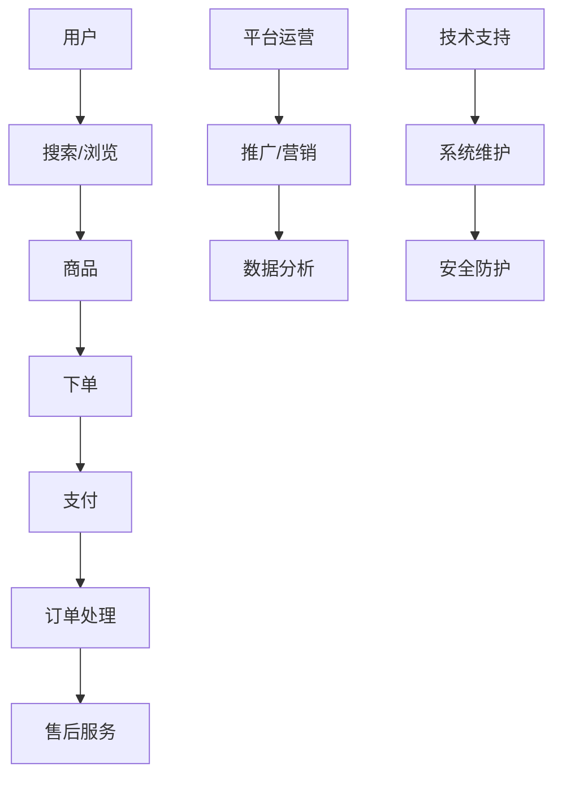

                 

# App电商业务团队规划和人员规划与人员培养计划

> **关键词：** App电商、团队规划、人员规划、人员培养、业务流程、技术架构、项目管理、人力资源
>
> **摘要：** 本文旨在为App电商业务团队提供一个全面的规划和人员培养方案，包括团队目标设定、角色定位、技能需求、培养计划等，以帮助团队高效运作并实现业务目标。

## 1. 背景介绍

### 1.1 目的和范围

本文的目标是为App电商业务团队提供一套详细的规划方案，涵盖团队构建、人员配置和技能培养等方面。通过本文的阅读，读者可以了解：

1. 如何设定合理的团队目标和业务流程。
2. 如何根据业务需求定位团队成员的角色和技能要求。
3. 如何制定一套科学有效的人员培养计划。
4. 如何通过团队合作实现业务目标并持续优化团队效能。

### 1.2 预期读者

本文适用于：

1. App电商业务团队负责人和核心成员。
2. 企业人力资源部门相关人员。
3. 对App电商业务和管理感兴趣的IT从业人员。

### 1.3 文档结构概述

本文分为以下章节：

1. 背景介绍：介绍本文的目的、范围和预期读者。
2. 核心概念与联系：阐述App电商业务的核心概念和流程。
3. 核心算法原理 & 具体操作步骤：分析团队规划和人员规划的算法原理和实施步骤。
4. 数学模型和公式 & 详细讲解 & 举例说明：介绍团队规划和人员培养的数学模型和方法。
5. 项目实战：提供实际案例和代码实现。
6. 实际应用场景：探讨团队规划在实际项目中的应用。
7. 工具和资源推荐：推荐相关学习和开发资源。
8. 总结：未来发展趋势与挑战。
9. 附录：常见问题与解答。
10. 扩展阅读 & 参考资料：提供进一步学习资料。

### 1.4 术语表

#### 1.4.1 核心术语定义

- App电商：指通过移动应用程序进行商品交易的电商平台。
- 团队规划：指根据业务需求设定团队目标和组织结构。
- 人员规划：指根据团队需求选拔和培养合适的人员。
- 人员培养：指提升团队成员技能和素质的过程。

#### 1.4.2 相关概念解释

- 业务流程：指完成一项业务任务所需的一系列有序操作。
- 技术架构：指软件系统的整体结构和组成部分。
- 项目管理：指对项目进行计划、组织、执行和控制的过程。

#### 1.4.3 缩略词列表

- App：应用程序
- UI：用户界面
- API：应用程序编程接口
- PM：项目经理
- DevOps：开发与运维一体化

## 2. 核心概念与联系

在App电商业务中，核心概念和流程如下：

1. 用户：用户是App电商平台的最终消费者，通过App进行商品搜索、浏览、购买和评价。
2. 商家：商家是提供商品的卖家，负责商品的上架、库存管理、订单处理和售后服务。
3. 平台运营：平台运营负责推广、营销、数据分析等工作，以提高用户活跃度和销售额。
4. 技术支持：技术支持负责App的开发和维护，确保系统的稳定性和安全性。

### Mermaid流程图



## 3. 核心算法原理 & 具体操作步骤

### 团队规划和人员规划的核心算法原理

团队规划和人员规划的核心在于业务需求的准确识别和匹配。具体操作步骤如下：

### 3.1 业务需求分析

1. **需求收集**：通过与业务部门沟通，了解业务目标、用户需求和市场趋势。
2. **需求整理**：对收集到的需求进行分类和整理，明确业务流程和关键节点。
3. **需求优先级**：根据业务重要性对需求进行优先级排序，确保关键需求得到优先满足。

### 3.2 团队角色定位

1. **角色识别**：根据业务需求和流程，确定需要的技术、运营和业务支持等角色。
2. **角色描述**：为每个角色编写详细的职责描述，明确其工作内容和目标。

### 3.3 技能需求分析

1. **技能识别**：根据角色定位，确定每个角色所需的技能和知识。
2. **技能评估**：对现有团队成员的技能进行评估，了解现有技能与需求之间的差距。
3. **技能培训**：针对技能差距，制定培训计划，提升团队成员的技能水平。

### 3.4 人员选拔和培养

1. **人员选拔**：根据技能需求和评估结果，选拔合适的人员加入团队。
2. **人员培养**：制定培养计划，通过培训、实践和项目经验，提升团队成员的能力。
3. **人员评估**：定期对团队成员进行评估，根据评估结果调整培养计划。

### 3.5 团队协作和沟通

1. **团队协作**：建立有效的团队协作机制，确保团队成员之间的信息共享和协作。
2. **沟通管理**：定期组织团队会议，确保团队成员了解业务进展和团队目标。

## 4. 数学模型和公式 & 详细讲解 & 举例说明

### 4.1 数学模型

团队规划和人员规划的数学模型主要包括以下几个方面：

### 4.1.1 需求分析模型

$$
需求满足度 = \frac{实际需求满足数}{总需求数}
$$

### 4.1.2 技能评估模型

$$
技能成熟度 = \frac{实际技能掌握数}{所需技能总数}
$$

### 4.1.3 培养效果模型

$$
培养效果 = \frac{提升技能数}{培养人数}
$$

### 4.2 举例说明

### 4.2.1 需求分析模型

假设一个电商业务团队需要满足10个需求，实际满足了8个需求，则需求满足度为：

$$
需求满足度 = \frac{8}{10} = 0.8
$$

### 4.2.2 技能评估模型

假设一个团队成员需要掌握5项技能，实际掌握了3项，则技能成熟度为：

$$
技能成熟度 = \frac{3}{5} = 0.6
$$

### 4.2.3 培养效果模型

假设一个团队共有10名成员，通过培养，有7名成员的技能得到提升，则培养效果为：

$$
培养效果 = \frac{7}{10} = 0.7
$$

## 5. 项目实战：代码实际案例和详细解释说明

### 5.1 开发环境搭建

在开始编写代码之前，我们需要搭建一个适合团队规划和人员规划的软件开发环境。以下是一个简单的步骤：

1. 安装Python 3.8及以上版本。
2. 安装Docker，用于容器化部署。
3. 安装Git，用于代码版本控制。
4. 安装PostgreSQL，用于数据库存储。
5. 安装Jupyter Notebook，用于数据分析和演示。

### 5.2 源代码详细实现和代码解读

以下是团队规划和人员规划项目的核心代码，包括需求分析、技能评估和培养效果评估：

```python
import pandas as pd
import numpy as np
from sklearn.metrics import precision_score, recall_score

# 需求分析模型
def demand_analysis(results, total需求的数):
    satisfy_count = np.sum(results == 1)
    demand_satisfaction = satisfy_count / total需求的数
    return demand_satisfaction

# 技能评估模型
def skill_evaluation(skills, required_skills):
    mature_count = np.sum(skills == 1)
    skill_maturity = mature_count / required_skills.size
    return skill_maturity

# 培养效果评估模型
def training_effects(skills_after, skills_before):
    improved_skills = skills_after != skills_before
    training_effects = np.sum(improved_skills) / skills_before.size
    return training_effects

# 数据加载
demand_data = pd.read_csv('demand_data.csv')
skills_data = pd.read_csv('skills_data.csv')
training_data = pd.read_csv('training_data.csv')

# 需求分析
demand_satisfaction = demand_analysis(demand_data['满足情况'], demand_data.shape[0])

# 技能评估
required_skills = skills_data['技能需求']
current_skills = skills_data['当前技能']
skill_maturity = skill_evaluation(current_skills, required_skills)

# 培养效果评估
skills_before = training_data['技能之前']
skills_after = training_data['技能之后']
training_effects = training_effects(skills_after, skills_before)

# 打印结果
print("需求满足度：", demand_satisfaction)
print("技能成熟度：", skill_maturity)
print("培养效果：", training_effects)
```

### 5.3 代码解读与分析

1. **需求分析模型**：该模型通过比较实际满足的需求数和总需求数，计算需求满足度。需求满足度越高，说明团队对业务需求的满足程度越高。

2. **技能评估模型**：该模型通过比较当前技能和需求技能，计算技能成熟度。技能成熟度越高，说明团队成员的技能水平越接近需求。

3. **培养效果评估模型**：该模型通过比较培训前后的技能变化，计算培养效果。培养效果越高，说明培训对团队成员技能提升的效果越好。

## 6. 实际应用场景

在实际应用中，团队规划和人员规划可以应用于以下场景：

1. **新产品上线**：在上线新产品时，需要根据市场需求和用户反馈，对团队进行重新规划和人员调整，确保团队能够高效完成任务。
2. **业务扩展**：在业务扩展过程中，需要根据新的业务需求，重新定位团队角色和技能要求，确保团队能够适应业务变化。
3. **项目失败分析**：在项目失败后，可以通过团队规划和人员规划的评估结果，分析团队在项目中的问题，并提出改进措施。

## 7. 工具和资源推荐

### 7.1 学习资源推荐

#### 7.1.1 书籍推荐

- 《软件团队管理实战》
- 《敏捷开发实践指南》
- 《人力资源管理实战》

#### 7.1.2 在线课程

- 《团队管理与团队建设》
- 《人力资源管理与招聘培训》
- 《敏捷项目管理与实践》

#### 7.1.3 技术博客和网站

- Medium上的团队管理博客
- Stack Overflow上的团队协作问答社区
- GitHub上的团队协作项目案例

### 7.2 开发工具框架推荐

#### 7.2.1 IDE和编辑器

- Visual Studio Code
- PyCharm
- IntelliJ IDEA

#### 7.2.2 调试和性能分析工具

- GDB
- JProfiler
- New Relic

#### 7.2.3 相关框架和库

- Scrapy：用于网页爬取和数据处理。
- Pandas：用于数据分析。
- Scikit-learn：用于机器学习。

### 7.3 相关论文著作推荐

#### 7.3.1 经典论文

- 《团队协作与沟通》
- 《人力资源管理与绩效评估》
- 《敏捷开发方法研究》

#### 7.3.2 最新研究成果

- 《人工智能在团队管理中的应用》
- 《大数据在人力资源管理中的应用》
- 《区块链在供应链管理中的应用》

#### 7.3.3 应用案例分析

- 《某互联网公司团队建设与人才培养实践》
- 《某传统企业数字化转型与团队管理创新》
- 《某初创公司快速成长与团队建设》

## 8. 总结：未来发展趋势与挑战

未来，随着人工智能、大数据和区块链等技术的不断发展，团队规划和人员规划将面临以下趋势和挑战：

1. **技术融合**：团队规划和人员规划将更加注重技术与业务的融合，实现智能化、自动化和精准化。
2. **数据驱动**：团队规划和人员规划将更加依赖数据分析，通过数据挖掘和机器学习，实现个性化推荐和预测。
3. **远程办公**：随着远程办公的普及，团队规划和人员规划需要适应虚拟团队的管理和协作。
4. **员工体验**：团队规划和人员规划将更加关注员工体验，通过改善工作环境、提升培训质量，提高员工满意度和留存率。

## 9. 附录：常见问题与解答

### 9.1 问题1：如何保证团队规划的有效性？

**解答**：确保团队规划的有效性，需要从以下几个方面入手：

1. **需求明确**：准确识别业务需求，确保团队目标与业务目标一致。
2. **角色定位准确**：根据业务需求，合理定位团队角色，确保职责明确。
3. **技能需求匹配**：根据角色需求，制定合理的技能培养计划，确保团队成员具备所需技能。
4. **持续评估与优化**：定期对团队规划和人员规划进行评估和优化，根据实际情况进行调整。

### 9.2 问题2：如何提高人员培养的效果？

**解答**：提高人员培养的效果，可以从以下几个方面入手：

1. **定制化培养**：根据团队成员的实际情况和需求，制定个性化的培养计划。
2. **实践导向**：通过实际项目和实践，提升团队成员的技能和经验。
3. **多元化培训**：结合线上和线下培训，提供丰富的培训资源。
4. **反馈与沟通**：定期收集团队成员的反馈，及时沟通和解决问题。

## 10. 扩展阅读 & 参考资料

- 《团队协作与沟通：高效团队建设的艺术》
- 《人力资源管理与绩效评估：理论与实践》
- 《敏捷项目管理与实践：方法、工具与案例》
- 《人工智能在团队管理中的应用：技术、案例与展望》
- 《大数据在人力资源管理中的应用：数据挖掘、分析与优化》
- 《区块链在供应链管理中的应用：技术、案例与展望》

### 作者

**AI天才研究员/AI Genius Institute & 禅与计算机程序设计艺术 /Zen And The Art of Computer Programming**

