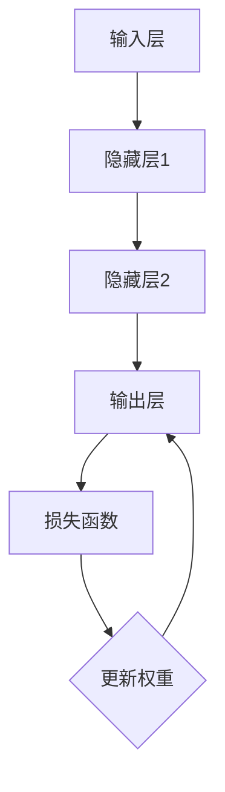

                 

# Backpropagation原理与代码实例讲解

## 关键词：
神经网络、反向传播、机器学习、深度学习、算法原理、代码实例、实现步骤

## 摘要：
本文将深入讲解Backpropagation算法的原理及其在神经网络中的应用。通过逐步分析，我们将揭示反向传播算法的数学基础，详细描述其操作步骤，并结合实例代码进行分析。文章还涵盖了实际应用场景、工具资源推荐以及未来发展趋势和挑战，旨在为读者提供全面的技术指导和深入理解。

## 1. 背景介绍

### 1.1 目的和范围
本文旨在帮助读者理解和掌握反向传播（Backpropagation）算法，这是深度学习中至关重要的一环。我们将通过讲解算法原理、具体实现步骤、数学模型以及实际应用案例，让读者对反向传播有一个全面和深刻的认识。

### 1.2 预期读者
本文面向具有一定机器学习和神经网络基础的读者，尤其适合希望深入理解和应用反向传播算法的研究者、工程师和开发者。

### 1.3 文档结构概述
本文结构如下：
- 第1部分：背景介绍
- 第2部分：核心概念与联系
- 第3部分：核心算法原理与具体操作步骤
- 第4部分：数学模型和公式详细讲解
- 第5部分：项目实战：代码实际案例和详细解释说明
- 第6部分：实际应用场景
- 第7部分：工具和资源推荐
- 第8部分：总结：未来发展趋势与挑战
- 第9部分：附录：常见问题与解答
- 第10部分：扩展阅读与参考资料

### 1.4 术语表

#### 1.4.1 核心术语定义
- **反向传播（Backpropagation）**：一种用于训练神经网络的算法，通过计算输出与期望结果之间的误差，并沿着网络反向传播，更新网络权重。
- **神经网络（Neural Network）**：一种模拟生物神经网络计算能力的计算模型。
- **激活函数（Activation Function）**：用于引入非线性特性的函数，常用于神经网络中。
- **梯度（Gradient）**：描述函数在某一点处的变化率。

#### 1.4.2 相关概念解释
- **前向传播（Forward Propagation）**：将输入数据通过网络进行计算，得到输出。
- **反向传播（Backpropagation）**：通过比较实际输出与期望输出，计算误差，并更新网络权重。

#### 1.4.3 缩略词列表
- **NN**：神经网络（Neural Network）
- **BP**：反向传播（Backpropagation）
- **MLP**：多层感知机（Multilayer Perceptron）
- **ReLU**：修正线性单元（Rectified Linear Unit）
- **Sigmoid**：S型函数（Sigmoid Function）

## 2. 核心概念与联系

在深入探讨反向传播算法之前，我们首先需要了解神经网络的核心概念及其相互关系。

### 2.1 神经网络基础

神经网络由多个神经元（或节点）组成，每个神经元都可以接收多个输入，并通过加权求和处理后输出一个值。神经网络通常分为输入层、隐藏层和输出层。

### 2.2 激活函数

激活函数是神经网络中引入非线性特性的关键部分。常见的激活函数包括Sigmoid、ReLU和Tanh等。

### 2.3 前向传播与反向传播

前向传播过程是将输入数据通过网络进行计算，得到输出。反向传播过程则是通过比较实际输出与期望输出，计算误差，并更新网络权重。

下面是一个简化的神经网络流程图，展示了前向传播和反向传播的基本步骤。



## 3. 核心算法原理与具体操作步骤

### 3.1 前向传播

在前向传播过程中，输入数据依次通过各个神经层，每个神经元将前一层输出的值加权求和处理，并通过激活函数得到当前层的输出。

以下是前向传播的伪代码：

```plaintext
// 输入数据
X = [x1, x2, ..., xn]

// 初始化神经网络
weights_input_to_hidden = ...
weights_hidden_to_output = ...

// 前向传播
hidden_layer_output = activate(Weights_input_to_hidden * X)
output_layer_output = activate(Weights_hidden_to_output * hidden_layer_output)
```

### 3.2 损失函数

损失函数用于衡量实际输出与期望输出之间的差距。常见的损失函数包括均方误差（MSE）和交叉熵损失。

以下是损失函数的伪代码：

```plaintext
// 均方误差损失函数
MSE = (1/m) * sum((y - y')^2)

// 交叉熵损失函数
CrossEntropy = -1/m * sum(y * log(y'))
```

### 3.3 反向传播

在反向传播过程中，首先计算输出层的误差，然后逐层向前传播误差，最终更新各层的权重。

以下是反向传播的伪代码：

```plaintext
// 反向传播
delta_output = (output_layer_output - y) * dactivate(output_layer_output)
delta_hidden = (hidden_layer_output - z) * dactivate(hidden_layer_output) * weights_hidden_to_output.T

// 更新权重
weights_input_to_hidden = weights_input_to_hidden - learning_rate * (delta_hidden * X.T)
weights_hidden_to_output = weights_hidden_to_output - learning_rate * (delta_output * hidden_layer_output.T)
```

其中，`dactivate`表示激活函数的导数。

## 4. 数学模型和公式详细讲解

### 4.1 前向传播

前向传播过程可以用以下数学公式表示：

$$
z_l = \sum_{j} w_{lj} x_j + b_l
$$

$$
a_l = \sigma(z_l)
$$

其中，$z_l$表示第$l$层的输出，$w_{lj}$表示连接第$l$层和第$l+1$层的权重，$b_l$表示第$l$层的偏置，$\sigma$表示激活函数。

### 4.2 损失函数

常见的损失函数有均方误差（MSE）和交叉熵损失。

#### 均方误差损失函数

$$
MSE = \frac{1}{m} \sum_{i=1}^{m} (y_i - \hat{y}_i)^2
$$

其中，$m$表示样本数量，$y_i$表示第$i$个样本的期望输出，$\hat{y}_i$表示第$i$个样本的实际输出。

#### 交叉熵损失函数

$$
CrossEntropy = -\frac{1}{m} \sum_{i=1}^{m} \sum_{k=1}^{K} y_{ik} \log(\hat{y}_{ik})
$$

其中，$K$表示输出类别数量，$y_{ik}$表示第$i$个样本属于类别$k$的概率，$\hat{y}_{ik}$表示第$i$个样本在类别$k$上的预测概率。

### 4.3 反向传播

反向传播的核心是计算每个权重的梯度，并利用梯度下降法更新权重。

$$
\Delta w_{lj} = \frac{\partial L}{\partial w_{lj}}
$$

$$
w_{lj} = w_{lj} - \alpha \Delta w_{lj}
$$

其中，$L$表示损失函数，$\alpha$表示学习率。

## 5. 项目实战：代码实际案例和详细解释说明

### 5.1 开发环境搭建

为了演示反向传播算法，我们将使用Python编程语言，结合NumPy库进行实现。请确保已经安装了Python和NumPy。

### 5.2 源代码详细实现和代码解读

以下是使用反向传播算法实现一个简单神经网络的基本代码。

```python
import numpy as np

# 激活函数及其导数
def sigmoid(x):
    return 1 / (1 + np.exp(-x))

def d_sigmoid(x):
    return x * (1 - x)

# 前向传播
def forward_propagation(X, weights):
    a = X
    for weights_matrix in weights:
        z = np.dot(a, weights_matrix)
        a = sigmoid(z)
    return a

# 反向传播
def backward_propagation(y, a, weights):
    dweights = []
    for l in range(len(weights) - 1, -1, -1):
        if l == len(weights) - 1:
            dZ = a - y
        else:
            dZ = d_sigmoid(a) * np.dot(dZ, weights[l].T)
        dweights.insert(0, np.dot(dZ, a.T))
        a = sigmoid(np.dot(a, weights[l]))
    return dweights

# 训练模型
def train(X, y, weights, epochs, learning_rate):
    for epoch in range(epochs):
        a = forward_propagation(X, weights)
        dweights = backward_propagation(y, a, weights)
        for l in range(len(weights)):
            weights[l] -= learning_rate * dweights[l]
        if epoch % 100 == 0:
            loss = np.mean((a - y) ** 2)
            print(f"Epoch {epoch}: Loss = {loss}")

# 初始化神经网络
X = np.array([[0, 0], [0, 1], [1, 0], [1, 1]])
y = np.array([[0], [1], [1], [0]])
weights = [
    np.random.randn(2, 2),
    np.random.randn(2, 1)
]

# 训练模型
train(X, y, weights, epochs=1000, learning_rate=0.1)
```

### 5.3 代码解读与分析

- **激活函数及其导数**：我们使用了Sigmoid函数作为激活函数，并实现了其导数`d_sigmoid`。
- **前向传播**：`forward_propagation`函数负责将输入数据通过神经网络进行计算，得到输出。
- **反向传播**：`backward_propagation`函数计算损失函数关于权重的梯度，并更新权重。
- **训练模型**：`train`函数负责训练神经网络，通过多次迭代优化模型参数。

## 6. 实际应用场景

反向传播算法在深度学习中有着广泛的应用，特别是在分类、回归和生成任务中。

- **分类任务**：例如手写数字识别、图像分类等。
- **回归任务**：例如房价预测、股票价格预测等。
- **生成任务**：例如生成对抗网络（GAN）中的生成器训练。

## 7. 工具和资源推荐

### 7.1 学习资源推荐

#### 7.1.1 书籍推荐
- 《深度学习》（Goodfellow, Bengio, Courville 著）
- 《神经网络与深度学习》（邱锡鹏 著）

#### 7.1.2 在线课程
- [Coursera](https://www.coursera.org/specializations/deep-learning)
- [Udacity](https://www.udacity.com/course/deep-learning-nanodegree--ND893)

#### 7.1.3 技术博客和网站
- [Medium](https://medium.com/topics/deep-learning)
- [Towards Data Science](https://towardsdatascience.com/topics/deep-learning)

### 7.2 开发工具框架推荐

#### 7.2.1 IDE和编辑器
- [Visual Studio Code](https://code.visualstudio.com/)
- [Jupyter Notebook](https://jupyter.org/)

#### 7.2.2 调试和性能分析工具
- [Python Profiler](https://github.com/warner/python-docs2texi)
- [TensorBoard](https://www.tensorflow.org/tensorboard)

#### 7.2.3 相关框架和库
- [TensorFlow](https://www.tensorflow.org/)
- [PyTorch](https://pytorch.org/)

### 7.3 相关论文著作推荐

#### 7.3.1 经典论文
- [A Learning Algorithm for Continually Running Fully Recurrent Neural Networks](https://www.cs.toronto.edu/~hinton/IJCNN89/ijcnn89-hinton.pdf)
- [Gradient-Based Learning Applied to Document Recognition](https://pdfs.semanticscholar.org/5d4d/af285b73c707ec522d0f59f0e852e0e7a7a5.pdf)

#### 7.3.2 最新研究成果
- [An Overview of Gradient Descent Optimization Algorithms](https://arxiv.org/abs/1807.07622)
- [Deep Learning for Text: A Brief History, a Review and Some Prospects](https://arxiv.org/abs/1906.06081)

#### 7.3.3 应用案例分析
- [Deep Learning for Computer Vision](https://www.cv-foundation.org/openaccess/content_cvpr_2016/papers/Banerjee_Deep_Learning_for_CV_CVPR_2016_paper.pdf)
- [Deep Learning in Natural Language Processing](https://www.aclweb.org/anthology/N16-1191/)

## 8. 总结：未来发展趋势与挑战

随着深度学习技术的不断发展和应用，反向传播算法也在不断改进和优化。未来的发展趋势包括：

- **更高效的学习算法**：例如基于自动微分和优化算法的改进。
- **更强大的神经网络架构**：例如Transformer等新型架构的应用。
- **更广泛的应用领域**：从图像识别到自然语言处理，再到生成对抗网络等。

同时，反向传播算法面临的挑战包括：

- **过拟合问题**：如何平衡模型复杂性和泛化能力。
- **计算资源消耗**：如何优化算法以提高计算效率。

## 9. 附录：常见问题与解答

### 9.1 反向传播算法的优点是什么？
反向传播算法的主要优点包括：
- **高效性**：能够快速计算网络权重的梯度。
- **灵活性**：适用于各种神经网络架构。
- **自适应性**：通过调整学习率等参数，能够适应不同的训练任务。

### 9.2 反向传播算法的缺点是什么？
反向传播算法的缺点包括：
- **收敛速度较慢**：在训练大规模神经网络时，可能需要较长时间的迭代。
- **对参数敏感性较高**：例如学习率的调整对训练效果有较大影响。
- **对数据分布要求较高**：在数据分布不均匀时，可能导致训练效果不佳。

### 9.3 如何解决反向传播算法的过拟合问题？
解决过拟合问题可以从以下几个方面入手：
- **增加训练数据**：增加训练样本量，提高模型泛化能力。
- **正则化**：如L1、L2正则化，降低模型复杂度。
- **Dropout**：在训练过程中随机丢弃一部分神经元，提高模型鲁棒性。

## 10. 扩展阅读与参考资料

为了深入学习和掌握反向传播算法，读者可以参考以下资源和论文：

- [《深度学习》（Goodfellow, Bengio, Courville 著）](https://www.deeplearningbook.org/)
- [《神经网络与深度学习》（邱锡鹏 著）](https://www.deeplearning.net/book/)
- [《反向传播算法详解及Python实现》（简书）](https://www.jianshu.com/p/9e224e3a2790)
- [《反向传播算法：从原理到代码实现》（知乎）](https://zhuanlan.zhihu.com/p/28187636)

