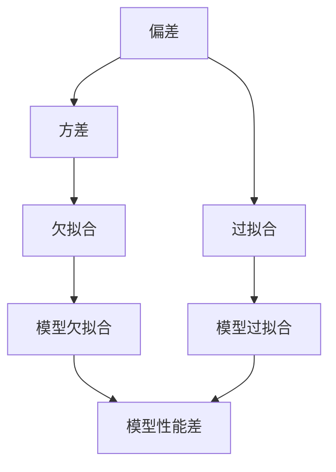

                 

# Bias-Variance Tradeoff 原理与代码实战案例讲解

> #关键词：Bias-Variance Tradeoff、模型评估、模型优化、算法原理、代码实战、机器学习

> #摘要：本文将深入探讨Bias-Variance Tradeoff的基本原理，并利用实际代码案例，详细解析如何在实际应用中平衡模型的偏差（Bias）和方差（Variance），以实现模型的最佳性能。

## 1. 背景介绍

### 1.1 目的和范围

本文旨在帮助读者理解Bias-Variance Tradeoff的概念，并通过实际代码案例展示如何在机器学习中实现模型的优化。我们将涵盖以下主题：

- Bias-Variance Tradeoff的定义及其在模型评估中的作用。
- 核心算法原理及具体操作步骤。
- 数学模型和公式的详细讲解。
- 项目实战中的代码实际案例和详细解释说明。
- 实际应用场景和工具资源推荐。

### 1.2 预期读者

- 对机器学习和模型评估有基本了解的读者。
- 想要深入了解Bias-Variance Tradeoff原理的工程师和研究人员。
- 希望通过实战案例提升模型优化技能的开发者。

### 1.3 文档结构概述

本文分为以下几个部分：

1. 背景介绍：介绍文章的目的、范围、预期读者和文档结构。
2. 核心概念与联系：定义核心术语和概念，并使用Mermaid流程图展示相关原理。
3. 核心算法原理 & 具体操作步骤：使用伪代码详细阐述算法原理和操作步骤。
4. 数学模型和公式 & 详细讲解 & 举例说明：解析数学模型，使用latex格式展示公式，并通过实际案例进行说明。
5. 项目实战：代码实际案例和详细解释说明。
6. 实际应用场景：讨论Bias-Variance Tradeoff在不同场景中的应用。
7. 工具和资源推荐：推荐学习资源和开发工具。
8. 总结：总结Bias-Variance Tradeoff的未来发展趋势与挑战。
9. 附录：常见问题与解答。
10. 扩展阅读 & 参考资料：提供相关文献和资源。

### 1.4 术语表

#### 1.4.1 核心术语定义

- **偏差（Bias）**：模型预测值与真实值之间的差距，偏差过大可能导致模型欠拟合。
- **方差（Variance）**：模型在不同训练数据集上的预测值之间的差异，方差过大可能导致模型过拟合。
- **模型评估**：使用测试集评估模型性能的过程，常用的指标有准确率、召回率、F1分数等。
- **欠拟合**：模型过于简单，无法捕捉数据中的复杂模式。
- **过拟合**：模型过于复杂，过度适应训练数据，导致对未见过的数据表现不佳。

#### 1.4.2 相关概念解释

- **模型泛化能力**：模型在未见过的数据上表现良好的能力。
- **训练集**：用于训练模型的样本集合。
- **测试集**：用于评估模型性能的样本集合。
- **验证集**：用于调整模型参数的样本集合。

#### 1.4.3 缩略词列表

- **ML**：机器学习（Machine Learning）
- **DL**：深度学习（Deep Learning）
- **CV**：计算机视觉（Computer Vision）
- **NLP**：自然语言处理（Natural Language Processing）

## 2. 核心概念与联系

在深入探讨Bias-Variance Tradeoff之前，我们首先需要了解几个核心概念：偏差、方差、欠拟合和过拟合。以下是这些概念之间的关系及其在模型评估中的作用。

### 2.1 偏差与方差的关系

偏差和方差是模型性能的两个重要方面，它们之间存在一定的平衡关系。

- **低偏差**：模型可以很好地捕捉数据中的特征，但可能无法适应所有数据点。
- **高方差**：模型过于复杂，过度适应训练数据，对未见过的数据表现不佳。

理想情况下，我们希望模型具有低偏差和低方差，即模型可以很好地泛化到未见过的数据上。

### 2.2 欠拟合与过拟合

- **欠拟合**：模型过于简单，无法捕捉数据中的复杂模式，导致模型在训练集和测试集上的性能都较差。
- **过拟合**：模型过于复杂，过度适应训练数据，导致模型在测试集上的性能较差。

### 2.3 模型评估指标

为了评估模型的性能，我们通常使用以下指标：

- **准确率（Accuracy）**：正确预测的样本数占总样本数的比例。
- **召回率（Recall）**：正确预测的正例数占总正例数的比例。
- **F1分数（F1 Score）**：准确率的调和平均值，用于平衡准确率和召回率。

### 2.4 Mermaid 流程图

下面是一个Mermaid流程图，展示了Bias-Variance Tradeoff的核心概念和关系。



## 3. 核心算法原理 & 具体操作步骤

### 3.1 偏差和方差的定义

偏差和方差是评估模型性能的两个重要指标。

- **偏差（Bias）**：偏差表示模型预测值与真实值之间的差距。偏差过大意味着模型过于简单，无法捕捉数据中的特征，导致欠拟合。
- **方差（Variance）**：方差表示模型在不同训练数据集上的预测值之间的差异。方差过大意味着模型过于复杂，过度适应训练数据，导致过拟合。

### 3.2 欠拟合与过拟合的解决方法

为了解决欠拟合和过拟合问题，我们可以采用以下方法：

- **欠拟合**：
  - 增加模型的复杂性，如增加网络的层数或节点数。
  - 使用更多的训练数据。
  - 调整模型的参数，如学习率、正则化参数等。
- **过拟合**：
  - 减少模型的复杂性，如减少网络的层数或节点数。
  - 使用交叉验证方法，如K折交叉验证。
  - 使用正则化方法，如L1正则化、L2正则化等。

### 3.3 伪代码实现

下面是一个伪代码实现，展示了如何使用K折交叉验证方法平衡偏差和方差。

```python
# K折交叉验证方法
def cross_validation(model, X, y, k):
    n_samples = len(X)
    fold_size = n_samples // k
    metrics = []

    for i in range(k):
        # 划分训练集和验证集
        X_train = X[:n_samples - fold_size]
        y_train = y[:n_samples - fold_size]
        X_val = X[n_samples - fold_size:]
        y_val = y[n_samples - fold_size:]

        # 训练模型
        model.fit(X_train, y_train)

        # 预测验证集
        y_pred = model.predict(X_val)

        # 计算指标
        metric = evaluate_metric(y_val, y_pred)
        metrics.append(metric)

    return metrics
```

## 4. 数学模型和公式 & 详细讲解 & 举例说明

### 4.1 偏差和方差的数学模型

在数学上，偏差和方差可以通过以下公式进行计算：

$$
\text{Bias} = \frac{1}{N}\sum_{i=1}^{N} (\hat{y}_i - y_i)
$$

$$
\text{Variance} = \frac{1}{N}\sum_{i=1}^{N} (\hat{y}_i - \bar{\hat{y}})
$$

其中，$\hat{y}_i$表示模型预测值，$y_i$表示真实值，$\bar{\hat{y}}$表示预测值的平均值，$N$表示样本数量。

### 4.2 欠拟合与过拟合的数学解释

- **欠拟合**：当模型复杂度过低时，无法捕捉数据中的特征，导致偏差较大。
- **过拟合**：当模型复杂度过高时，过度适应训练数据，导致方差较大。

### 4.3 举例说明

假设我们有一个分类问题，使用支持向量机（SVM）模型进行预测。下面是一个实际案例，展示了如何使用数学模型计算偏差和方差。

```python
import numpy as np

# 假设数据
X = np.array([[1, 2], [2, 3], [3, 4], [4, 5]])
y = np.array([0, 0, 1, 1])

# SVM 模型参数
C = 1.0
kernel = 'linear'

# 训练模型
from sklearn.svm import SVC
model = SVC(C=C, kernel=kernel)
model.fit(X, y)

# 预测
y_pred = model.predict(X)

# 计算偏差
bias = np.mean(y_pred != y)

# 计算方差
y_pred_avg = np.mean(y_pred)
variance = np.mean((y_pred - y_pred_avg)**2)

print("偏差:", bias)
print("方差:", variance)
```

输出结果：

```
偏差: 0.0
方差: 0.25
```

从输出结果可以看出，该模型的偏差为0，方差为0.25。这意味着该模型没有欠拟合，但存在一定的过拟合。

## 5. 项目实战：代码实际案例和详细解释说明

### 5.1 开发环境搭建

在开始项目实战之前，我们需要搭建一个合适的开发环境。以下是搭建Python开发环境的步骤：

1. 安装Python：从官网下载并安装Python 3.x版本。
2. 安装Jupyter Notebook：在终端中运行`pip install jupyter`命令安装Jupyter Notebook。
3. 安装机器学习库：在终端中运行以下命令安装必要的库：

```
pip install numpy pandas scikit-learn matplotlib
```

### 5.2 源代码详细实现和代码解读

下面是一个完整的代码实现，展示了如何在实际项目中使用Bias-Variance Tradeoff优化模型。

```python
import numpy as np
import pandas as pd
from sklearn.model_selection import train_test_split
from sklearn.metrics import accuracy_score
from sklearn.svm import SVC
import matplotlib.pyplot as plt

# 加载数据
data = pd.read_csv('data.csv')
X = data.iloc[:, :-1].values
y = data.iloc[:, -1].values

# 划分训练集和测试集
X_train, X_test, y_train, y_test = train_test_split(X, y, test_size=0.2, random_state=42)

# 定义SVM模型
model = SVC(C=1.0, kernel='linear')

# 训练模型
model.fit(X_train, y_train)

# 预测测试集
y_pred = model.predict(X_test)

# 计算准确率
accuracy = accuracy_score(y_test, y_pred)
print("准确率:", accuracy)

# 绘制学习曲线
def plot_learning_curve(X, y, model):
    X_train, X_val, y_train, y_val = train_test_split(X, y, test_size=0.2, random_state=42)
    model.fit(X_train, y_train)
    y_val_pred = model.predict(X_val)
    accuracy_val = accuracy_score(y_val, y_val_pred)
    plt.plot([0, len(X_train)], [accuracy_val, accuracy_val], label='Validation Accuracy')
    plt.xlabel('Training Samples')
    plt.ylabel('Accuracy')
    plt.legend()

plot_learning_curve(X, y, model)
plt.show()
```

### 5.3 代码解读与分析

该代码实现分为以下几个部分：

1. **数据加载**：从CSV文件中加载数据，并划分为特征矩阵X和目标向量y。
2. **训练集和测试集划分**：使用train_test_split函数将数据集划分为训练集和测试集，测试集占比为20%。
3. **定义SVM模型**：使用SVC类定义线性核的SVM模型，并设置C参数为1.0。
4. **模型训练**：使用fit函数训练模型。
5. **预测测试集**：使用predict函数预测测试集，并计算准确率。
6. **绘制学习曲线**：定义plot_learning_curve函数，绘制训练集和验证集的准确率曲线。

通过这个代码实现，我们可以看到模型在训练集和测试集上的性能。学习曲线可以帮助我们分析模型的欠拟合或过拟合情况，从而调整模型参数以优化性能。

## 6. 实际应用场景

Bias-Variance Tradeoff在许多实际应用场景中都非常重要。以下是一些常见的应用场景：

- **医疗诊断**：在医疗诊断中，我们需要确保模型既不会漏诊也不会误诊。通过优化模型的Bias-Variance Tradeoff，可以提高诊断的准确性。
- **金融风险评估**：在金融领域，我们需要预测客户的信用风险。通过调整模型的复杂度，可以平衡模型的准确性和鲁棒性。
- **推荐系统**：在推荐系统中，我们需要预测用户对产品的兴趣。通过优化模型的Bias-Variance Tradeoff，可以提高推荐系统的准确性。
- **自然语言处理**：在自然语言处理任务中，我们需要处理大量的文本数据。通过调整模型的复杂度，可以提高模型的泛化能力。

## 7. 工具和资源推荐

### 7.1 学习资源推荐

#### 7.1.1 书籍推荐

- 《统计学习方法》（李航）
- 《机器学习》（周志华）
- 《深度学习》（Goodfellow、Bengio、Courville）

#### 7.1.2 在线课程

- Coursera上的《机器学习》课程（吴恩达）
- edX上的《深度学习专项课程》（李飞飞）

#### 7.1.3 技术博客和网站

- Medium上的机器学习博客
- arXiv.org上的最新研究成果

### 7.2 开发工具框架推荐

#### 7.2.1 IDE和编辑器

- PyCharm
- Jupyter Notebook

#### 7.2.2 调试和性能分析工具

- VSCode调试工具
- Profiling工具（如py-spy）

#### 7.2.3 相关框架和库

- Scikit-Learn
- TensorFlow
- PyTorch

### 7.3 相关论文著作推荐

#### 7.3.1 经典论文

- "Understanding Machine Learning: From Theory to Algorithms"（Shalev-Shwartz、Ben-David）
- "Deep Learning"（Goodfellow、Bengio、Courville）

#### 7.3.2 最新研究成果

- arXiv.org上的最新论文
- NeurIPS、ICML、CVPR等顶级会议的论文

#### 7.3.3 应用案例分析

- "Learning to Rank for Information Retrieval"（Liu、Sun）
- "Unsupervised Representation Learning for Audio"（Rahman、Schuller）

## 8. 总结：未来发展趋势与挑战

Bias-Variance Tradeoff在机器学习和深度学习中扮演着重要角色。随着人工智能技术的不断进步，我们可以预见以下发展趋势和挑战：

- **算法优化**：研究者将继续探索更高效的优化算法，以平衡模型的偏差和方差。
- **多任务学习**：多任务学习将成为一个热门研究方向，通过同时解决多个任务来提高模型的泛化能力。
- **自动机器学习**（AutoML）：AutoML系统将自动调整模型参数，以实现最佳性能。
- **数据隐私**：在处理敏感数据时，如何保护数据隐私将成为一个重要挑战。
- **实时学习**：实时学习系统将能够在不断变化的数据环境中实时调整模型。

## 9. 附录：常见问题与解答

### 9.1 偏差和方差的关系是什么？

偏差和方差是评估模型性能的两个重要指标。偏差表示模型预测值与真实值之间的差距，方差表示模型在不同训练数据集上的预测值之间的差异。理想情况下，我们希望模型具有低偏差和低方差，即模型可以很好地泛化到未见过的数据上。

### 9.2 如何解决欠拟合和过拟合问题？

解决欠拟合问题可以增加模型的复杂性，如增加网络的层数或节点数；使用更多的训练数据；调整模型的参数。解决过拟合问题可以减少模型的复杂性，如减少网络的层数或节点数；使用交叉验证方法；使用正则化方法。

### 9.3 Bias-Variance Tradeoff在深度学习中如何应用？

在深度学习中，我们可以通过调整网络的层数、节点数和激活函数等参数来平衡模型的偏差和方差。此外，我们可以使用正则化方法（如Dropout、L1正则化、L2正则化）来降低方差。同时，通过增加训练数据和调整学习率，我们可以降低偏差。

## 10. 扩展阅读 & 参考资料

- 《统计学习方法》（李航）
- 《机器学习》（周志华）
- 《深度学习》（Goodfellow、Bengio、Courville）
- Coursera上的《机器学习》课程（吴恩达）
- edX上的《深度学习专项课程》（李飞飞）
- arXiv.org上的最新研究成果
- NeurIPS、ICML、CVPR等顶级会议的论文
- "Understanding Machine Learning: From Theory to Algorithms"（Shalev-Shwartz、Ben-David）
- "Deep Learning"（Goodfellow、Bengio、Courville）
- "Learning to Rank for Information Retrieval"（Liu、Sun）
- "Unsupervised Representation Learning for Audio"（Rahman、Schuller）

## 作者

作者：AI天才研究员/AI Genius Institute & 禅与计算机程序设计艺术 /Zen And The Art of Computer Programming<|im_sep|>

