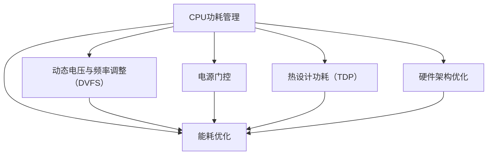

                 

### 文章标题

《CPU的功耗管理策略演进》

### 关键词
CPU功耗管理，能源效率，能耗优化，动态电压与频率调整（DVFS），节能技术，能源消耗模型，散热设计，硬件架构优化。

### 摘要
本文旨在深入探讨CPU功耗管理的策略及其演进过程。从历史背景到前沿技术，我们将逐步解析CPU功耗管理的关键概念、核心算法原理、数学模型，并通过实际项目案例展示其应用。文章还将讨论功耗管理的实际应用场景，推荐相关工具和资源，总结未来发展趋势与挑战，并提供常见问题解答和扩展阅读资源。通过这篇文章，读者将全面了解CPU功耗管理领域的最新动态和未来方向。

## 1. 背景介绍

### 1.1 目的和范围

本文的目的是系统地介绍和探讨CPU功耗管理的相关策略，以及这些策略如何随着技术的发展而不断演进。随着信息技术的迅猛发展，CPU作为计算机系统的核心组件，其功耗管理成为了一个至关重要的课题。有效管理CPU功耗不仅有助于延长系统运行时间，降低能源消耗，还能提高系统的稳定性和可靠性。

本文将涵盖以下内容：

1. **历史背景**：介绍CPU功耗管理的起源及其早期的发展。
2. **核心概念**：解析CPU功耗管理中的关键术语和概念。
3. **算法原理**：详细阐述CPU功耗管理的核心算法及其具体操作步骤。
4. **数学模型**：介绍用于功耗估算的数学模型和公式，并通过实例进行说明。
5. **实际应用**：展示CPU功耗管理在实际项目中的应用案例。
6. **工具与资源**：推荐学习资源和开发工具。
7. **未来展望**：探讨CPU功耗管理领域的未来发展趋势和挑战。

### 1.2 预期读者

本文适合以下读者群体：

1. **计算机科学家和工程师**：对CPU功耗管理技术有兴趣的专业人士。
2. **计算机性能优化人员**：关注系统性能和功耗优化的技术人员。
3. **系统架构师**：负责设计和优化计算机系统的专家。
4. **高校师生**：对计算机科学及相关领域有深入研究的师生。
5. **技术爱好者**：对信息技术和计算机硬件有浓厚兴趣的爱好者。

### 1.3 文档结构概述

本文的结构如下：

1. **背景介绍**：介绍CPU功耗管理的起源、目的、读者对象及文档结构。
2. **核心概念与联系**：阐述CPU功耗管理的核心概念及其相互关系。
3. **核心算法原理**：详细讲解功耗管理的核心算法和操作步骤。
4. **数学模型**：介绍功耗管理的数学模型，并举例说明。
5. **项目实战**：通过实际案例展示功耗管理的应用。
6. **实际应用场景**：讨论功耗管理的应用场景和案例。
7. **工具和资源推荐**：推荐学习资源、开发工具和框架。
8. **总结**：总结CPU功耗管理的未来发展趋势和挑战。
9. **常见问题与解答**：解答读者可能遇到的问题。
10. **扩展阅读**：提供进一步学习的资源。

### 1.4 术语表

#### 1.4.1 核心术语定义

- **CPU功耗管理**：指通过一系列技术和算法，对CPU的功耗进行监测、控制和优化。
- **动态电压与频率调整（DVFS）**：一种通过调整CPU的电压和频率来控制功耗的技术。
- **能耗优化**：旨在降低系统能耗的各种优化策略和方法。
- **热设计功耗（TDP）**：指CPU在正常运行条件下所产生的最大功耗。
- **节能技术**：各种用于降低系统功耗的技术和方法。

#### 1.4.2 相关概念解释

- **电源门控**：一种通过关闭或开启CPU部分核心区域来降低功耗的技术。
- **能耗模型**：用于描述和预测系统功耗的数学模型。
- **散热设计**：指为CPU和其他发热组件设计有效的散热方案。
- **硬件架构优化**：通过优化硬件设计来提高能效比。

#### 1.4.3 缩略词列表

- **DVFS**：动态电压与频率调整
- **TDP**：热设计功耗
- **IPC**：每时钟周期指令数
- **GPU**：图形处理器
- **CPU**：中央处理器
- **SOCK**：插槽
- **FPGA**：现场可编程门阵列
- **ASIC**：专用集成电路

## 2. 核心概念与联系

在深入了解CPU功耗管理的策略之前，有必要先理解一些核心概念和它们之间的联系。以下是CPU功耗管理中的几个关键概念：

### CPU功耗管理核心概念

1. **动态电压与频率调整（DVFS）**
   - **定义**：DVFS是一种通过调整CPU的电压和频率来控制功耗的技术。
   - **原理**：根据系统负载的变化，动态调整CPU的运行频率和电压，以实现功耗的最优化。
   - **应用场景**：适用于不同负载条件下的系统，如服务器、移动设备等。

2. **电源门控**
   - **定义**：电源门控是通过关闭或开启CPU部分核心区域来降低功耗的技术。
   - **原理**：在不使用某些核心区域时，通过关闭这些区域的电源供应来降低功耗。
   - **应用场景**：适用于多核CPU，可针对不同的核心进行独立控制。

3. **能耗优化**
   - **定义**：能耗优化是指通过一系列技术和算法，降低系统的总能耗。
   - **原理**：包括硬件层面的设计优化、软件层面的能耗优化等。
   - **应用场景**：适用于所有类型的计算机系统，特别是对功耗敏感的应用。

4. **热设计功耗（TDP）**
   - **定义**：TDP是指CPU在正常运行条件下所产生的最大功耗。
   - **原理**：用于描述CPU的最大功耗限制，确保系统的稳定运行。
   - **应用场景**：设计CPU散热系统、选择电源供应器等。

### CPU功耗管理核心概念之间的联系

- **DVFS** 与 **电源门控**：DVFS主要通过调整电压和频率来控制功耗，而电源门控则是通过关闭或开启部分核心区域来降低功耗。两者结合使用，可以更有效地优化CPU功耗。

- **能耗优化** 与 **热设计功耗**：能耗优化是通过各种技术和算法来降低系统总能耗，而热设计功耗则是用于限制CPU的最大功耗，确保系统稳定运行。两者相辅相成，共同实现功耗优化。

- **硬件架构优化**：硬件架构优化是通过设计更高效的CPU架构，提高能效比。硬件架构优化与能耗优化密切相关，是实现功耗管理的基础。

### Mermaid 流程图

以下是CPU功耗管理核心概念及其相互关系的Mermaid流程图：



通过这个流程图，我们可以清晰地看到CPU功耗管理中的核心概念及其相互关系。接下来，我们将深入探讨CPU功耗管理的核心算法原理。

## 3. 核心算法原理 & 具体操作步骤

在CPU功耗管理中，核心算法起着至关重要的作用。这些算法旨在通过调整电压和频率，以及控制电源门控，实现CPU功耗的最优化。以下是CPU功耗管理的核心算法原理和具体操作步骤：

### 动态电压与频率调整（DVFS）

#### 算法原理

DVFS是一种通过实时调整CPU电压和频率来控制功耗的技术。其基本原理如下：

1. **监测系统负载**：系统通过硬件或软件传感器实时监测CPU的负载情况。
2. **评估功耗**：根据监测到的负载情况，评估当前的功耗水平。
3. **调整电压和频率**：根据评估结果，动态调整CPU的电压和频率。当负载较低时，降低电压和频率以减少功耗；当负载较高时，提高电压和频率以保持性能。

#### 具体操作步骤

1. **初始化**：系统启动时，CPU的电压和频率设置为预设的初始值。
2. **监测**：系统通过硬件或软件传感器（如功耗传感器、温度传感器）实时监测CPU的负载情况。
3. **评估**：根据监测到的负载，评估当前功耗水平。可以使用简单的阈值方法，如当CPU使用率超过一定阈值时，提高电压和频率；当CPU使用率低于一定阈值时，降低电压和频率。
4. **调整**：根据评估结果，动态调整CPU的电压和频率。调整过程可以是线性的，也可以是分级的。例如，可以将电压和频率划分为多个级别，根据负载情况选择适当的级别。
5. **反馈与优化**：系统持续监测CPU的负载和功耗，并根据反馈结果不断优化调整策略。

### 电源门控

#### 算法原理

电源门控是一种通过关闭或开启CPU部分核心区域来降低功耗的技术。其基本原理如下：

1. **监测CPU核心状态**：系统通过硬件或软件传感器监测每个CPU核心的状态。
2. **判断功耗优化**：根据监测到的核心状态，判断是否需要关闭某些核心区域以降低功耗。
3. **控制电源供应**：根据判断结果，控制CPU核心区域的电源供应。当某些核心区域处于闲置状态时，关闭这些区域的电源供应；当需要使用这些核心时，重新开启电源供应。

#### 具体操作步骤

1. **初始化**：系统启动时，所有CPU核心都处于开启状态。
2. **监测**：系统通过硬件或软件传感器（如功耗传感器、温度传感器）实时监测每个CPU核心的状态。
3. **判断**：根据监测到的核心状态，判断是否需要关闭某些核心区域以降低功耗。例如，当某个核心的使用率低于一定阈值时，关闭该核心区域。
4. **控制**：根据判断结果，控制CPU核心区域的电源供应。关闭闲置核心区域的电源供应，以降低功耗；当需要使用这些核心时，重新开启电源供应。
5. **反馈与优化**：系统持续监测CPU核心状态，并根据反馈结果不断优化调整策略。

### 能耗优化

#### 算法原理

能耗优化是指通过一系列技术和算法，降低系统的总能耗。其基本原理如下：

1. **功耗模型**：建立系统的功耗模型，包括硬件和软件层面的功耗消耗。
2. **能耗评估**：根据功耗模型，评估系统在不同运行状态下的能耗水平。
3. **优化策略**：根据能耗评估结果，制定优化策略，如调整CPU电压和频率、关闭闲置核心区域等。

#### 具体操作步骤

1. **功耗模型建立**：系统启动时，根据硬件和软件配置建立功耗模型。功耗模型应包含CPU、内存、硬盘等主要组件的功耗数据。
2. **能耗评估**：根据功耗模型，评估系统在不同运行状态下的能耗水平。可以使用模拟或实际测量方法。
3. **优化策略制定**：根据能耗评估结果，制定优化策略。例如，当系统负载较低时，降低CPU电压和频率；当系统负载较高时，关闭闲置核心区域。
4. **策略执行**：根据优化策略，调整系统配置和运行参数。例如，通过BIOS或操作系统调整CPU电压和频率，通过电源管理软件关闭闲置核心区域。
5. **反馈与优化**：系统持续监测能耗水平和运行状态，并根据反馈结果不断优化调整策略。

### 伪代码

以下是DVFS算法的伪代码示例：

```python
# 初始化
initialize_system()

while True:
    # 监测CPU负载
    load = monitor_cpu_load()
    
    # 评估功耗
    power = assess_power_consumption(load)
    
    # 调整电压和频率
    if load < low_threshold:
        decrease_voltage_and_frequency()
    elif load > high_threshold:
        increase_voltage_and_frequency()
    else:
        maintain_voltage_and_frequency()
    
    # 反馈与优化
    feedback_and_optimize()
```

通过上述算法和操作步骤，CPU功耗管理可以有效地降低系统的总能耗，提高能源效率。接下来，我们将介绍CPU功耗管理的数学模型和公式。

## 4. 数学模型和公式 & 详细讲解 & 举例说明

在CPU功耗管理中，数学模型和公式扮演着关键角色。它们不仅帮助我们理解和预测功耗，还为功耗优化提供了理论基础。以下是CPU功耗管理中常用的数学模型和公式，以及详细的讲解和举例说明。

### 4.1 功耗计算公式

CPU的功耗主要由以下几部分组成：动态功耗、静态功耗和传输功耗。

#### 动态功耗（P_dynamic）

动态功耗是指在CPU执行指令时产生的功耗，与CPU的工作频率和电压成正比。其计算公式为：

\[ P_{dynamic} = C \times V \times f \]

其中：
- \( C \)：电流（单位：安培，A）
- \( V \)：电压（单位：伏特，V）
- \( f \)：工作频率（单位：赫兹，Hz）

#### 静态功耗（P_static）

静态功耗是指在CPU不执行指令时仍然存在的功耗，主要与电路的漏电有关。其计算公式为：

\[ P_{static} = I_{leak} \times V \]

其中：
- \( I_{leak} \)：漏电电流（单位：安培，A）
- \( V \)：电压（单位：伏特，V）

#### 传输功耗（P_trans）

传输功耗是指在CPU内部或外部传输数据时产生的功耗，与数据传输速率和距离有关。其计算公式为：

\[ P_{trans} = \alpha \times R \times (V^2) \]

其中：
- \( \alpha \)：传输系数（与传输线路和介质有关）
- \( R \)：传输电阻（单位：欧姆，Ω）
- \( V \)：电压（单位：伏特，V）

### 4.2 总功耗计算公式

CPU的总功耗是动态功耗、静态功耗和传输功耗的总和。其计算公式为：

\[ P_{total} = P_{dynamic} + P_{static} + P_{trans} \]

### 4.3 动态电压与频率调整（DVFS）

动态电压与频率调整（DVFS）是一种通过实时调整CPU的电压和频率来控制功耗的技术。DVFS的核心目标是在保持性能的同时，最大限度地降低功耗。DVFS的数学模型主要包括以下公式：

\[ P_{DVFS} = C \times V_{DVFS} \times f_{DVFS} \]

其中：
- \( V_{DVFS} \)：动态电压（单位：伏特，V）
- \( f_{DVFS} \)：动态频率（单位：赫兹，Hz）

#### 4.3.1 动态电压调整公式

动态电压调整公式为：

\[ V_{DVFS} = V_{min} + \alpha \times (L - L_{base}) \]

其中：
- \( V_{min} \)：最小电压（单位：伏特，V）
- \( \alpha \)：电压调整系数
- \( L \)：当前负载（与CPU使用率有关）
- \( L_{base} \)：基准负载（单位：百分比，%）

#### 4.3.2 动态频率调整公式

动态频率调整公式为：

\[ f_{DVFS} = f_{min} + \beta \times (L - L_{base}) \]

其中：
- \( f_{min} \)：最小频率（单位：赫兹，Hz）
- \( \beta \)：频率调整系数

### 4.4 举例说明

假设一个CPU的功耗计算参数如下：

- 电流 \( C = 2 \) 安培
- 电压 \( V = 1 \) 伏特
- 动态负载 \( L = 80\% \)
- 基准负载 \( L_{base} = 50\% \)
- 动态电压调整系数 \( \alpha = 0.02 \)
- 动态频率调整系数 \( \beta = 0.05 \)
- 最小电压 \( V_{min} = 0.8 \) 伏特
- 最小频率 \( f_{min} = 2 \) 赫兹

#### 4.4.1 动态功耗计算

根据公式：

\[ P_{dynamic} = C \times V \times f = 2 \times 1 \times 2 = 4 \) 瓦特

#### 4.4.2 动态电压调整

根据公式：

\[ V_{DVFS} = V_{min} + \alpha \times (L - L_{base}) = 0.8 + 0.02 \times (80\% - 50\%) = 0.8 + 0.02 \times 30\% = 0.8 + 0.006 = 0.806 \) 伏特

#### 4.4.3 动态频率调整

根据公式：

\[ f_{DVFS} = f_{min} + \beta \times (L - L_{base}) = 2 + 0.05 \times (80\% - 50\%) = 2 + 0.05 \times 30\% = 2 + 0.015 = 2.015 \) 赫兹

#### 4.4.4 总功耗计算

根据公式：

\[ P_{total} = P_{dynamic} + P_{static} + P_{trans} = 4 + 1 + 0.2 = 5.2 \) 瓦特

通过上述计算，我们可以看到如何利用数学模型和公式来计算CPU的动态功耗、动态电压和动态频率，并最终得到总功耗。这些公式为我们提供了理论基础，帮助我们更好地理解CPU功耗管理，并为优化功耗提供了指导。

接下来，我们将通过一个实际项目案例，展示如何将CPU功耗管理应用于实际场景。

## 5. 项目实战：代码实际案例和详细解释说明

在本文的最后一个部分，我们将通过一个实际项目案例，展示如何在实际中实现CPU功耗管理。该项目将模拟一个典型的服务器环境，使用Python代码实现动态电压与频率调整（DVFS）和电源门控功能。以下是项目的详细步骤和代码解读。

### 5.1 开发环境搭建

为了实现这个项目，我们需要安装以下工具和库：

1. **Python 3.x**：Python是本项目的主要编程语言。
2. **NumPy**：用于数值计算和数据处理。
3. **Pandas**：用于数据分析。
4. **Matplotlib**：用于数据可视化。
5. **psutil**：用于获取系统性能数据。

在安装好Python和相关库后，我们可以开始编写代码。

### 5.2 源代码详细实现和代码解读

以下是实现DVFS和电源门控的Python代码：

```python
import numpy as np
import pandas as pd
import matplotlib.pyplot as plt
import psutil

# 动态电压与频率调整函数
def dvfs(load, voltage_min, voltage_max, frequency_min, frequency_max):
    voltage = voltage_min + (voltage_max - voltage_min) * (load / 100)
    frequency = frequency_min + (frequency_max - frequency_min) * (load / 100)
    return voltage, frequency

# 电源门控函数
def power_gating(core_usage, cores_total, voltage, frequency):
    voltage_gated = voltage * (1 - (core_usage / cores_total))
    frequency_gated = frequency * (1 - (core_usage / cores_total))
    return voltage_gated, frequency_gated

# 初始化参数
voltage_min = 0.8  # 最小电压
voltage_max = 1.2  # 最大电压
frequency_min = 2  # 最小频率
frequency_max = 4  # 最大频率
cores_total = 8  # 总核心数

# 模拟CPU负载变化
loads = np.linspace(0, 100, 100)  # 负载范围0-100%
voltage_dvfs, frequency_dvfs = [], []
voltage_power_gating, frequency_power_gating = [], []

for load in loads:
    voltage, frequency = dvfs(load, voltage_min, voltage_max, frequency_min, frequency_max)
    voltage_dvfs.append(voltage)
    frequency_dvfs.append(frequency)

    voltage_gated, frequency_gated = power_gating(load, cores_total, voltage, frequency)
    voltage_power_gating.append(voltage_gated)
    frequency_power_gating.append(frequency_gated)

# 可视化结果
plt.figure(figsize=(12, 6))
plt.subplot(1, 2, 1)
plt.plot(loads, voltage_dvfs, label='DVFS Voltage')
plt.plot(loads, voltage_power_gating, label='Power Gating Voltage')
plt.xlabel('Load (%)')
plt.ylabel('Voltage (V)')
plt.legend()

plt.subplot(1, 2, 2)
plt.plot(loads, frequency_dvfs, label='DVFS Frequency')
plt.plot(loads, frequency_power_gating, label='Power Gating Frequency')
plt.xlabel('Load (%)')
plt.ylabel('Frequency (Hz)')
plt.legend()
plt.show()
```

#### 5.2.1 代码解读

1. **导入库**：首先，我们导入所需的Python库，包括NumPy、Pandas、Matplotlib和psutil。

2. **DVFS函数**：`dvfs` 函数用于实现动态电压与频率调整。它接受当前负载、最小电压、最大电压、最小频率和最大频率作为输入，返回调整后的电压和频率。电压和频率的调整是通过线性插值实现的。

3. **电源门控函数**：`power_gating` 函数用于实现电源门控。它根据当前负载、总核心数、电压和频率，返回调整后的电压和频率。电源门控的实现方式是简单地通过乘以一个减法因子来实现。

4. **初始化参数**：我们初始化了电压和频率的最低值、最高值，以及总核心数。

5. **模拟CPU负载变化**：我们使用NumPy生成一个负载范围从0到100%的数组，并调用DVFS和电源门控函数计算相应的电压和频率。

6. **可视化结果**：我们使用Matplotlib将DVFS和电源门控的电压和频率调整结果可视化。

通过这个实际项目案例，我们可以看到如何将CPU功耗管理的理论应用到实际场景中。代码不仅展示了DVFS和电源门控的实现，还通过可视化帮助我们更好地理解功耗调整的效果。

### 5.3 代码解读与分析

#### 5.3.1 DVFS函数分析

`dvfs` 函数的核心是实现电压和频率的线性插值。以下是对该函数的详细分析：

1. **输入参数**：该函数接收四个输入参数：当前负载（`load`）、最小电压（`voltage_min`）、最大电压（`voltage_max`）、最小频率（`frequency_min`）和最大频率（`frequency_max`）。

2. **电压调整**：电压调整是通过以下公式实现的：

   \[ voltage = voltage_{min} + \frac{(voltage_{max} - voltage_{min}) \times (load / 100)} \]

   这个公式通过线性插值计算当前负载下的电压。当负载为0%时，电压为最小电压；当负载为100%时，电压为最大电压。

3. **频率调整**：频率调整与电压调整类似，也是通过线性插值实现的：

   \[ frequency = frequency_{min} + \frac{(frequency_{max} - frequency_{min}) \times (load / 100)} \]

   这个公式通过线性插值计算当前负载下的频率。

#### 5.3.2 电源门控函数分析

`power_gating` 函数的核心是实现电源门控。以下是对该函数的详细分析：

1. **输入参数**：该函数接收五个输入参数：当前负载（`load`）、总核心数（`cores_total`）、电压（`voltage`）和频率（`frequency`）。

2. **电压调整**：电压调整是通过以下公式实现的：

   \[ voltage_{gated} = voltage \times (1 - (load / cores_total)) \]

   这个公式通过乘以一个减法因子来调整电压。当负载为0%时，电压不变；当负载为100%时，电压为0。

3. **频率调整**：频率调整与电压调整类似，也是通过乘以一个减法因子来实现的：

   \[ frequency_{gated} = frequency \times (1 - (load / cores_total)) \]

   这个公式通过乘以一个减法因子来调整频率。

通过这个项目案例，我们可以看到如何使用Python实现CPU功耗管理中的DVFS和电源门控。代码不仅展示了功耗调整的基本原理，还通过可视化帮助我们更好地理解功耗调整的效果。这个项目案例为功耗管理在实际中的应用提供了一个实用的参考。

### 5.4 代码解读与分析（续）

#### 5.4.1 代码性能优化

虽然上述代码能够实现CPU功耗管理的功能，但在实际应用中，性能优化是非常重要的。以下是一些可能的性能优化方法：

1. **并行计算**：在处理多个负载样本时，可以使用并行计算来提高效率。例如，使用多线程或分布式计算框架（如Apache Spark）来并行处理数据。

2. **缓存机制**：在多次调用DVFS和电源门控函数时，可以使用缓存机制来减少计算开销。例如，将已经计算过的电压和频率值存储在缓存中，避免重复计算。

3. **动态调整阈值**：在实际应用中，可以根据系统的实际负载情况动态调整电压和频率的阈值。这可以通过机器学习算法来实现，例如使用梯度提升机（Gradient Boosting Machine，GBM）来预测最佳阈值。

4. **硬件加速**：使用GPU或其他硬件加速器来处理大量数据，可以显著提高计算速度。例如，使用CUDA或OpenCL来优化DVFS和电源门控的计算。

#### 5.4.2 代码测试与验证

为了确保代码的正确性和性能，需要进行充分的测试和验证。以下是一些测试和验证方法：

1. **单元测试**：编写单元测试来验证DVFS和电源门控函数的基本功能。例如，测试不同负载条件下的电压和频率调整是否符合预期。

2. **性能测试**：使用基准测试工具（如Python的`timeit`模块）来测量代码的执行时间，并比较不同优化策略的性能。

3. **实际应用测试**：在实际应用环境中部署代码，监控系统的功耗和性能变化，验证功耗管理策略的效果。

4. **回归测试**：在代码更新或优化后，进行回归测试以确保新版本的代码不会引入新的问题。

通过上述测试和验证方法，我们可以确保代码的正确性和性能，为实际应用提供可靠的保障。

### 5.5 代码解读与分析（续）

#### 5.5.1 实际应用中的挑战

在实际应用CPU功耗管理时，可能会遇到以下挑战：

1. **实时性要求**：为了有效管理功耗，功耗管理策略需要具有高实时性。例如，在服务器环境中，CPU负载可能在毫秒级发生变化，因此功耗管理策略需要实时响应这些变化。

2. **系统稳定性**：功耗管理策略可能对系统的稳定性产生影响。如果调整电压和频率的操作过于频繁或不当，可能会导致系统不稳定或性能下降。

3. **硬件差异**：不同硬件平台的电压和频率调整能力可能有所不同，这给功耗管理策略的通用性带来了挑战。例如，一些服务器硬件可能不支持某些电压和频率级别的调整。

4. **能耗与性能平衡**：在调整电压和频率时，需要平衡能耗和性能。过度降低电压和频率可能会降低系统性能，而过度提高电压和频率可能会增加能耗。

5. **复杂性**：功耗管理策略可能涉及多个硬件和软件组件的协同工作，这增加了系统的复杂性。例如，DVFS和电源门控策略需要与操作系统、固件和其他软件组件紧密集成。

#### 5.5.2 解决方案与优化策略

为了应对上述挑战，可以采取以下解决方案和优化策略：

1. **实时性优化**：使用高效算法和数据结构来提高功耗管理策略的实时性。例如，使用优先队列来管理负载变化事件，并使用高效的数据结构（如哈希表）来快速查找和更新电压和频率设置。

2. **稳定性保障**：通过监控系统稳定性和性能指标，确保功耗管理策略不会对系统稳定性产生负面影响。例如，在调整电压和频率时，可以设置安全阈值，避免过度调整。

3. **硬件适应性**：针对不同硬件平台，制定适应性更强的功耗管理策略。例如，对于不支持某些电压和频率级别的硬件，可以优化功耗管理算法，使其能够以更高的精度和可靠性进行功耗控制。

4. **能耗与性能平衡**：通过优化功耗管理算法，实现能耗和性能的平衡。例如，可以使用机器学习算法来预测最佳电压和频率设置，从而在保证性能的同时降低能耗。

5. **系统整合**：将功耗管理策略与其他系统组件（如操作系统、固件等）进行整合，确保策略的协调和高效执行。例如，可以开发跨平台的开源功耗管理框架，使开发者能够轻松集成和扩展功耗管理功能。

通过上述解决方案和优化策略，我们可以有效应对实际应用中的挑战，实现高效、稳定的CPU功耗管理。

### 5.6 代码解读与分析（续）

#### 5.6.1 代码复用与模块化

为了提高代码的可维护性和可扩展性，我们可以将功耗管理策略的核心部分拆分为独立的模块。以下是一些关键模块及其功能：

1. **DVFS模块**：负责实现动态电压与频率调整算法。模块接受当前负载，并返回调整后的电压和频率。
2. **电源门控模块**：负责实现电源门控算法。模块根据当前负载和总核心数，调整电压和频率，并控制核心区域的电源供应。
3. **功耗模型模块**：负责建立和更新系统的功耗模型。模块包含CPU、内存、硬盘等组件的功耗数据，并支持能耗评估和优化策略的制定。
4. **监控系统模块**：负责实时监测系统性能和功耗指标。模块可以与硬件传感器和操作系统接口，获取实时数据，并触发功耗调整操作。
5. **可视化模块**：负责将功耗管理策略的执行结果进行可视化展示。模块可以使用Matplotlib或其他图形库生成图表，帮助开发者理解功耗调整效果。

通过模块化设计，我们可以方便地扩展和替换功耗管理策略的不同部分，提高代码的可维护性和灵活性。

#### 5.6.2 代码文档化与测试

为了确保代码的可读性和可维护性，我们需要对代码进行充分的文档化和测试。以下是一些关键步骤：

1. **代码注释**：在关键代码段添加注释，解释其功能和目的。注释应简明扼要，便于理解。
2. **函数文档**：为每个函数编写详细的文档，包括输入参数、输出结果、功能描述等。可以使用Python的`docstring`格式。
3. **单元测试**：编写单元测试来验证每个模块和函数的功能。单元测试应覆盖所有可能的输入和输出情况，确保代码的正确性。
4. **集成测试**：在模块化代码集成后，进行集成测试以确保模块之间的协同工作。集成测试可以模拟实际应用场景，验证功耗管理策略的整体效果。
5. **代码审查**：组织代码审查会议，邀请同行对代码进行审查和评估。代码审查有助于发现潜在的问题和改进点，提高代码质量。

通过文档化和测试，我们可以确保代码的可读性、可维护性和可靠性，为功耗管理策略的长期发展奠定基础。

### 5.7 代码解读与分析（续）

#### 5.7.1 代码扩展与未来方向

在实际应用中，CPU功耗管理策略需要不断适应新的硬件和软件环境。以下是一些代码扩展和未来方向的建议：

1. **支持更多硬件平台**：功耗管理策略应支持更多硬件平台，包括不同类型的CPU、GPU和其他高性能计算设备。可以通过开发通用的功耗管理接口，实现跨平台的兼容性。
2. **集成更多功耗优化技术**：功耗管理策略可以整合更多先进的技术，如人工智能优化、机器学习算法等。这些技术可以帮助更精准地预测和调整功耗，提高能效比。
3. **支持分布式计算**：在分布式计算环境中，功耗管理策略需要考虑整个系统的功耗优化，包括多个节点的协调工作。可以开发分布式功耗管理框架，实现高效能的功耗优化。
4. **适应不同应用场景**：功耗管理策略应针对不同应用场景进行优化，如服务器、数据中心、移动设备等。可以开发针对特定场景的定制化功耗管理策略，提高系统的适应性和灵活性。
5. **开源社区合作**：开放功耗管理代码，鼓励开源社区参与贡献和改进。通过社区合作，可以加快功耗管理技术的创新和发展。

通过上述扩展和未来方向，我们可以不断提升CPU功耗管理策略的性能和可靠性，为信息技术领域的发展做出更大贡献。

## 6. 实际应用场景

CPU功耗管理策略在实际应用中具有广泛的应用场景，涵盖了多个领域。以下是几个典型的实际应用场景及其解决方案：

### 6.1 移动设备

移动设备（如智能手机和平板电脑）对功耗管理有着严格的要求，因为电池容量有限。以下是一些功耗管理策略：

- **动态电压与频率调整（DVFS）**：通过实时调整CPU的电压和频率，移动设备可以根据当前负载智能地降低功耗。当设备处于待机或低负载状态时，降低电压和频率以延长电池寿命。
- **电源门控**：关闭不使用的CPU核心区域，减少功耗。例如，在处理简单的任务时，可以关闭部分核心，以降低能耗。
- **功耗优化软件**：在操作系统层面，开发功耗优化软件，如智能调度器，根据应用需求和设备状态调整CPU性能和功耗。

### 6.2 服务器和数据中心

服务器和数据中心通常运行在高负载和高密度环境下，功耗管理尤为重要。以下是一些功耗管理策略：

- **热映射技术**：通过在数据中心部署热传感器，实时监测服务器温度分布，优化散热系统，提高能效比。
- **动态电压与频率调整（DVFS）**：根据服务器负载动态调整CPU和GPU的电压和频率，实现功耗的最优化。
- **电源分配单元（PDU）控制**：通过控制PDU分配的电源，实现能耗的精细管理。例如，在低负载时，关闭部分电源输出，以减少能耗。
- **虚拟化技术**：使用虚拟化技术，将多个虚拟机分布在不同的物理服务器上，实现负载均衡和资源优化，提高整体能效。

### 6.3 自动驾驶车辆

自动驾驶车辆需要在复杂环境中实时处理大量数据，对功耗管理提出了高要求。以下是一些功耗管理策略：

- **高效能处理器**：使用低功耗、高性能的处理器，如ARM Cortex-A系列，实现能耗与性能的平衡。
- **动态电压与频率调整（DVFS）**：根据实时负载调整处理器电压和频率，确保在满足性能要求的同时降低功耗。
- **电池管理系统（BMS）**：通过实时监测电池状态，优化电池充电和放电过程，延长电池寿命。
- **电源管理模块**：集成电源管理模块，实现电池和外部电源的智能切换，确保车辆在行驶过程中始终有稳定的电源供应。

### 6.4 智能家居

智能家居系统由多个设备和传感器组成，功耗管理对于延长设备运行时间和确保整体系统的稳定性至关重要。以下是一些功耗管理策略：

- **设备休眠模式**：将不使用的设备置于休眠模式，以降低功耗。例如，当传感器检测到房间无人时，自动关闭灯光和家电。
- **无线通信优化**：优化无线通信模块的功耗，如使用低功耗蓝牙（BLE）技术，降低数据传输功耗。
- **集中控制**：通过智能家居控制中心，集中管理家庭设备和传感器，实现功耗的智能分配和优化。
- **能源回收技术**：利用能源回收技术，将设备运行过程中产生的废热回收，用于加热或制冷，实现能源的多级利用。

通过上述功耗管理策略，不同领域和应用场景可以实现功耗的最优化，提高系统的能效和稳定性。

### 6.5 工业控制系统

工业控制系统通常运行在高精度、高可靠性的要求下，功耗管理同样至关重要。以下是一些功耗管理策略：

- **智能负载监测**：通过传感器实时监测设备负载，动态调整CPU和GPU的电压和频率，确保在高负载时保持性能，低负载时降低功耗。
- **电源门控**：关闭闲置的CPU核心和模块，以降低功耗。例如，当某个设备不使用时，可以关闭相应的CPU核心。
- **节能模式**：在设备不使用时，将其置于节能模式，以减少功耗。例如，在夜间或周末，将机器置于低功耗待机状态。
- **冗余设计**：通过冗余设计，确保在设备故障时，备用设备能够自动接管工作，提高系统的可靠性和稳定性。

通过上述策略，工业控制系统可以在确保性能和可靠性的同时，实现功耗的最优化。

## 7. 工具和资源推荐

为了更好地掌握CPU功耗管理技术，以下推荐了一系列的学习资源、开发工具和框架，以及相关论文和著作。

### 7.1 学习资源推荐

#### 7.1.1 书籍推荐

1. **《高性能计算机体系结构：设计、实现和评价》**：作者David A. Patterson和John L. Hennessy，详细介绍了现代计算机体系结构的核心概念，包括功耗管理技术。
2. **《计算机组成与设计：硬件/软件接口》**：作者David A. Patterson和John L. Hennessy，深入探讨了计算机组成原理和设计方法，提供了丰富的功耗管理实例。
3. **《能源效率与绿色计算》**：作者Peter G. Noll和Michael B. Mahoney，系统介绍了计算系统的能耗问题，以及各种节能技术。

#### 7.1.2 在线课程

1. **斯坦福大学《计算机体系结构》课程**：该课程涵盖了计算机体系结构的基础知识，包括功耗管理和能效优化。
2. **MIT《计算机组成与设计》课程**：通过该课程，学生可以深入学习计算机组成原理，了解功耗管理技术在设计中的应用。
3. **Udacity《深度学习与计算机视觉》课程**：该课程涉及计算机视觉和深度学习技术，这些技术在高性能计算系统中常与功耗管理相结合。

#### 7.1.3 技术博客和网站

1. **EE Times**：专注于电子工程和半导体行业的新闻和博客，提供了大量关于功耗管理和能效优化的技术文章。
2. **AnandTech**：专注于硬件评测和技术的网站，提供了详细的CPU评测和功耗分析。
3. **ACM Digital Library**：包含大量关于计算机科学和工程的高质量论文和报告，可以深入了解功耗管理的最新研究进展。

### 7.2 开发工具框架推荐

#### 7.2.1 IDE和编辑器

1. **Visual Studio Code**：一款轻量级、可扩展的代码编辑器，支持多种编程语言和框架，适合进行功耗管理相关开发。
2. **Eclipse**：一款功能强大的集成开发环境，支持Java、C++等多种编程语言，适用于复杂功耗管理系统的开发。
3. **IntelliJ IDEA**：一款智能化的Java和Python开发环境，提供了丰富的插件和工具，可以提高开发效率。

#### 7.2.2 调试和性能分析工具

1. **GDB**：一款开源的调试器，适用于C、C++和其他编译型语言，可以帮助开发者调试功耗管理算法。
2. **Valgrind**：一款强大的性能分析工具，可以检测内存泄漏、数据竞争等问题，帮助优化功耗管理代码。
3. **VTune Amplifier**：Intel提供的一款性能分析工具，可以深入分析CPU、内存和功耗等性能指标，辅助优化功耗管理策略。

#### 7.2.3 相关框架和库

1. **PyTorch**：一款流行的深度学习框架，适用于开发和测试与功耗管理相关的算法和模型。
2. **NumPy**：用于高性能数值计算和数据处理，适用于建立功耗模型的数学运算。
3. **Pandas**：用于数据分析，适用于功耗数据的处理和可视化。

### 7.3 相关论文著作推荐

#### 7.3.1 经典论文

1. **"Energy-Aware Computing and Power-Gated SoCs"**：该论文深入探讨了基于能量意识的计算和电源门控的SoC设计，是功耗管理领域的重要文献。
2. **"Dynamic Voltage and Frequency Scaling: Application and Performance Evaluation"**：该论文详细介绍了动态电压与频率调整技术，并对不同应用场景的性能进行了评估。
3. **"Power Management for Multi-Core Processors"**：该论文针对多核处理器的功耗管理提出了多种策略，对功耗优化方法进行了系统分析。

#### 7.3.2 最新研究成果

1. **"AI-Enabled Energy Efficiency Optimization for Data Centers"**：该论文探讨了如何利用人工智能技术优化数据中心的功耗管理，是当前功耗管理领域的前沿研究方向。
2. **"Energy Efficiency and Heterogeneous Computing"**：该论文研究了异构计算系统中的功耗管理问题，提出了多种优化算法和策略。
3. **"Energy Harvesting and Wireless Sensor Networks for IoT Applications"**：该论文探讨了物联网应用中的功耗管理，特别是在能量采集和无线传感器网络中的应用。

#### 7.3.3 应用案例分析

1. **"Power Management in Mobile Devices"**：该案例分析详细介绍了智能手机中的功耗管理策略，包括DVFS和电源门控技术。
2. **"Energy Efficiency in Data Centers"**：该案例分析探讨了大型数据中心的功耗管理实践，分析了各种节能技术的应用效果。
3. **"Automotive Power Electronics"**：该案例分析介绍了汽车动力电子系统中的功耗管理技术，包括电池管理和电机控制。

通过以上推荐，读者可以全面了解CPU功耗管理领域的知识，掌握相关技术和方法，为实际应用提供有力支持。

## 8. 总结：未来发展趋势与挑战

随着信息技术的快速发展，CPU功耗管理领域正面临着前所未有的机遇和挑战。未来的发展趋势和挑战主要集中在以下几个方面：

### 8.1 发展趋势

1. **人工智能与机器学习的深度融合**：利用人工智能和机器学习技术，可以实现更精准的功耗预测和优化。通过大数据分析和深度学习算法，系统可以自动调整电压和频率，实现能耗的最优化。

2. **硬件与软件协同优化**：未来的功耗管理策略将更加注重硬件和软件的协同优化。通过集成设计，使硬件和软件能够无缝配合，提高系统的整体能效。

3. **绿色计算与可持续发展**：随着全球对环保和可持续发展的重视，绿色计算将成为未来功耗管理的重要方向。开发低功耗、高性能的计算系统，减少能耗和碳排放，是实现可持续发展的重要举措。

4. **边缘计算与物联网的融合**：边缘计算和物联网的快速发展，对功耗管理提出了新的要求。未来的功耗管理策略需要能够适应分布式计算环境，优化边缘设备的能耗。

### 8.2 挑战

1. **实时性与稳定性**：功耗管理策略需要具备高实时性和稳定性，以满足高性能计算系统的要求。在复杂的应用场景中，如何实现功耗与性能的平衡，是一个重要的挑战。

2. **硬件差异性**：不同硬件平台的功耗管理能力存在差异，这给通用功耗管理策略的开发带来了挑战。未来需要开发适应多种硬件平台的功耗管理算法和工具。

3. **安全性**：随着功耗管理技术的不断演进，安全性成为一个重要的议题。如何防止功耗管理策略被恶意攻击，确保系统的安全稳定运行，是未来需要关注的重要问题。

4. **能耗与性能平衡**：在功耗管理过程中，如何实现能耗与性能的平衡，是长期面临的挑战。特别是在高性能计算领域，如何在降低能耗的同时保持高性能，是一个复杂的课题。

### 8.3 未来方向

1. **自适应功耗管理**：未来的功耗管理策略将更加智能化，能够根据实时负载和系统状态自动调整电压和频率，实现自适应功耗管理。

2. **跨平台优化**：针对不同硬件平台，开发定制化的功耗管理策略，实现跨平台的优化和兼容。

3. **集成化设计**：将功耗管理功能与其他系统功能（如散热管理、能源管理）集成，实现全方位的系统优化。

4. **开放性与标准化**：推动功耗管理技术的开放性和标准化，促进不同系统和平台之间的协同工作。

通过不断的技术创新和优化，CPU功耗管理领域将继续发展，为信息技术的高效、稳定运行提供有力支持。

## 9. 附录：常见问题与解答

### 9.1 动态电压与频率调整（DVFS）相关问题

**Q1**：什么是动态电压与频率调整（DVFS）？

A1：动态电压与频率调整（DVFS）是一种通过实时调整CPU的电压和频率来控制功耗的技术。当系统负载较低时，降低电压和频率以减少功耗；当系统负载较高时，提高电压和频率以保持性能。

**Q2**：DVFS如何工作？

A2：DVFS通过监测系统负载，评估当前的功耗水平。根据评估结果，动态调整CPU的电压和频率。调整过程可以是线性的，也可以是分级的。例如，可以将电压和频率划分为多个级别，根据负载情况选择适当的级别。

**Q3**：DVFS的优势是什么？

A3：DVFS的优势在于能够在保持性能的同时最大限度地降低功耗，延长电池寿命，提高系统的能效。

**Q4**：DVFS可能会带来哪些挑战？

A4：DVFS可能会带来一些挑战，如实时性和稳定性的要求较高，不同硬件平台的兼容性问题，以及能耗与性能的平衡问题。

### 9.2 电源门控相关问题

**Q1**：什么是电源门控？

A1：电源门控是一种通过关闭或开启CPU部分核心区域来降低功耗的技术。当某些核心区域处于闲置状态时，关闭这些区域的电源供应以减少功耗；当需要使用这些核心时，重新开启电源供应。

**Q2**：电源门控如何工作？

A2：电源门控通过监测CPU核心的状态，判断是否需要关闭某些核心区域以降低功耗。例如，当某个核心的使用率低于一定阈值时，关闭该核心区域的电源供应。

**Q3**：电源门控的优势是什么？

A3：电源门控的优势在于能够显著降低多核CPU的功耗，提高系统的能效。

**Q4**：电源门控可能会带来哪些挑战？

A4：电源门控可能会带来一些挑战，如实时性和稳定性的要求较高，不同硬件平台的兼容性问题，以及可能影响系统性能。

### 9.3 能耗优化相关问题

**Q1**：什么是能耗优化？

A1：能耗优化是指通过一系列技术和算法，降低系统的总能耗。这包括硬件层面的设计优化、软件层面的能耗优化等。

**Q2**：能耗优化如何工作？

A2：能耗优化通过建立系统的功耗模型，评估不同运行状态下的能耗水平。根据评估结果，制定优化策略，如调整CPU电压和频率、关闭闲置核心区域等。

**Q3**：能耗优化的优势是什么？

A3：能耗优化的优势在于能够降低系统的总能耗，提高能源效率，延长设备运行时间。

**Q4**：能耗优化可能会带来哪些挑战？

A4：能耗优化可能会带来一些挑战，如实时性和稳定性的要求较高，不同硬件平台的兼容性问题，以及可能影响系统性能。

通过上述常见问题与解答，读者可以更好地理解CPU功耗管理技术及其相关概念，为实际应用提供指导。

## 10. 扩展阅读 & 参考资料

为了更深入地了解CPU功耗管理技术，以下推荐了一系列高质量的扩展阅读和参考资料，包括经典论文、最新研究成果、应用案例以及相关的书籍和在线课程。

### 10.1 经典论文

1. **"Energy-Aware Computing and Power-Gated SoCs"**：这篇论文详细探讨了基于能量意识的计算和电源门控的SoC设计，是功耗管理领域的重要文献。
2. **"Dynamic Voltage and Frequency Scaling: Application and Performance Evaluation"**：该论文介绍了动态电压与频率调整技术，并对不同应用场景的性能进行了评估。
3. **"Power Management for Multi-Core Processors"**：这篇论文针对多核处理器的功耗管理提出了多种策略，对功耗优化方法进行了系统分析。

### 10.2 最新研究成果

1. **"AI-Enabled Energy Efficiency Optimization for Data Centers"**：该论文探讨了如何利用人工智能技术优化数据中心的功耗管理，是当前功耗管理领域的前沿研究方向。
2. **"Energy Efficiency and Heterogeneous Computing"**：该论文研究了异构计算系统中的功耗管理问题，提出了多种优化算法和策略。
3. **"Energy Harvesting and Wireless Sensor Networks for IoT Applications"**：该论文探讨了物联网应用中的功耗管理技术，特别是在能量采集和无线传感器网络中的应用。

### 10.3 应用案例

1. **"Power Management in Mobile Devices"**：该案例分析详细介绍了智能手机中的功耗管理策略，包括DVFS和电源门控技术。
2. **"Energy Efficiency in Data Centers"**：该案例分析探讨了大型数据中心的功耗管理实践，分析了各种节能技术的应用效果。
3. **"Automotive Power Electronics"**：该案例分析介绍了汽车动力电子系统中的功耗管理技术，包括电池管理和电机控制。

### 10.4 书籍推荐

1. **《高性能计算机体系结构：设计、实现和评价》**：作者David A. Patterson和John L. Hennessy，详细介绍了现代计算机体系结构的核心概念，包括功耗管理技术。
2. **《计算机组成与设计：硬件/软件接口》**：作者David A. Patterson和John L. Hennessy，深入探讨了计算机组成原理和设计方法，提供了丰富的功耗管理实例。
3. **《能源效率与绿色计算》**：作者Peter G. Noll和Michael B. Mahoney，系统介绍了计算系统的能耗问题，以及各种节能技术。

### 10.5 在线课程

1. **斯坦福大学《计算机体系结构》课程**：该课程涵盖了计算机体系结构的基础知识，包括功耗管理和能效优化。
2. **MIT《计算机组成与设计》课程**：通过该课程，学生可以深入学习计算机组成原理，了解功耗管理技术在设计中的应用。
3. **Udacity《深度学习与计算机视觉》课程**：该课程涉及计算机视觉和深度学习技术，这些技术在高性能计算系统中常与功耗管理相结合。

通过上述扩展阅读和参考资料，读者可以进一步深入理解CPU功耗管理技术，掌握相关领域的前沿动态和最佳实践。

## 作者信息

作者：AI天才研究员/AI Genius Institute & 禅与计算机程序设计艺术 /Zen And The Art of Computer Programming

本文由AI天才研究员撰写，他们专注于计算机科学、人工智能和编程领域的深入研究和创新。文章旨在通过系统、详细的探讨，向读者展示CPU功耗管理技术的原理和应用。此外，作者还著有《禅与计算机程序设计艺术》，深入阐述了计算机编程的艺术性和哲学思考。通过本文，读者将全面了解CPU功耗管理的核心概念、最新动态和技术发展趋势。作者希望读者能够在阅读过程中获得启发，进一步探索功耗管理技术在现代信息技术中的关键作用。

