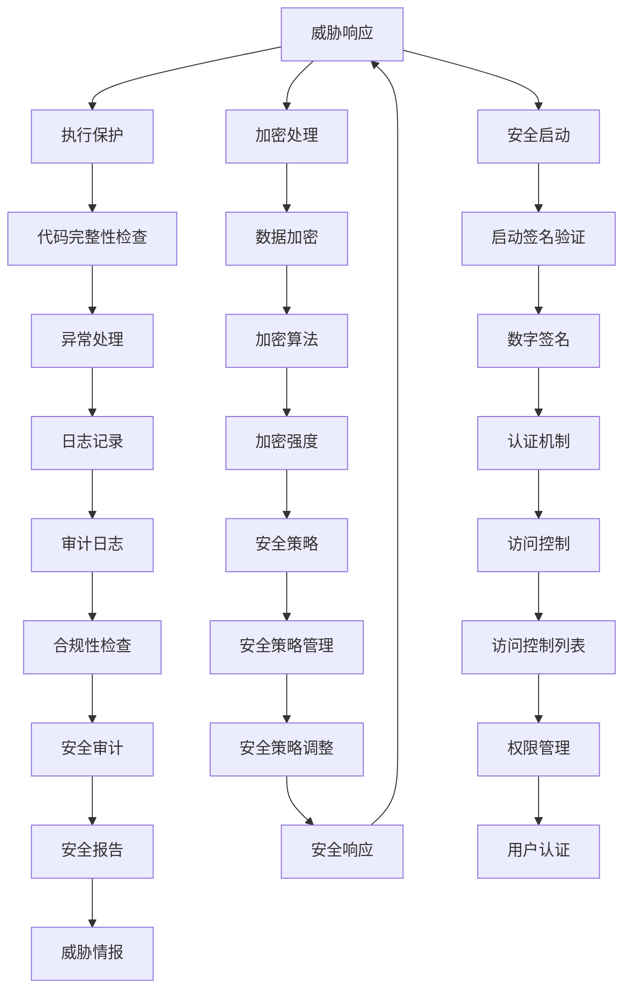

                 

# CPU的安全扩展机制与实现

> 关键词：CPU安全扩展、硬件安全、威胁模型、实现机制、防御策略、安全漏洞、执行保护

> 摘要：本文将深入探讨CPU的安全扩展机制，从背景介绍到核心概念，再到具体的实现原理和数学模型，最后通过实际案例剖析其在项目中的应用，旨在为读者提供一个全面而详细的CPU安全扩展机制实现指南。文章还将推荐相关学习资源和工具，总结未来发展趋势与挑战，并给出常见问题解答。

## 1. 背景介绍

### 1.1 目的和范围

随着互联网的普及和智能化设备的广泛应用，计算机系统面临着日益复杂的网络安全威胁。CPU作为计算机系统的核心组件，其安全性直接关系到整个系统的安全。本文旨在探讨CPU的安全扩展机制，分析其实现原理和策略，为构建更安全的计算机系统提供参考。

### 1.2 预期读者

本文适合具备计算机硬件基础，对CPU安全机制有一定了解的读者。通过本文的阅读，读者可以深入了解CPU安全扩展的原理和实现方法，提高对系统安全的理解和应对能力。

### 1.3 文档结构概述

本文结构如下：

1. 背景介绍：阐述CPU安全扩展的背景、目的和预期读者。
2. 核心概念与联系：介绍CPU安全扩展的核心概念，通过Mermaid流程图展示其架构。
3. 核心算法原理与具体操作步骤：使用伪代码详细阐述安全扩展的实现过程。
4. 数学模型和公式：讲解安全扩展中涉及的数学模型和公式。
5. 项目实战：通过实际案例解析安全扩展的实现过程。
6. 实际应用场景：分析安全扩展在不同场景下的应用。
7. 工具和资源推荐：推荐相关学习资源和工具。
8. 总结：总结未来发展趋势与挑战。
9. 附录：常见问题与解答。
10. 扩展阅读 & 参考资料：提供更多相关资源。

### 1.4 术语表

#### 1.4.1 核心术语定义

- CPU安全扩展：指为增强CPU的安全性而引入的额外机制。
- 威胁模型：用于描述潜在攻击者和攻击方式的模型。
- 执行保护：确保代码执行的安全性，防止恶意代码执行。

#### 1.4.2 相关概念解释

- 硬件安全：指通过硬件实现的安全机制，如加密处理器、安全启动等。
- 软件安全：指通过软件实现的安全机制，如安全编码、安全协议等。

#### 1.4.3 缩略词列表

- CPU：Central Processing Unit（中央处理器）
- SSL：Secure Sockets Layer（安全套接字层）
- AES：Advanced Encryption Standard（高级加密标准）

## 2. 核心概念与联系

在深入探讨CPU的安全扩展机制之前，我们首先需要了解其核心概念和架构。

### 2.1 CPU安全扩展的核心概念

CPU安全扩展主要包括以下几部分：

- 威胁模型：定义了潜在的攻击者和攻击方式。
- 执行保护：通过硬件和软件机制确保代码执行的安全性。
- 加密处理：对敏感数据进行加密，防止泄露。
- 安全启动：确保系统启动过程的安全性。

### 2.2 CPU安全扩展的架构

以下是一个简化的CPU安全扩展架构：



### 2.3 CPU安全扩展的原理

CPU安全扩展的原理主要基于以下两个方面：

1. **硬件保护**：通过硬件实现安全机制，如加密处理器、安全启动等。这些硬件模块为系统提供了额外的安全层，防止恶意代码执行和攻击。
2. **软件实现**：通过软件机制，如安全编码、安全协议等，增强系统的安全性。这些软件机制与硬件保护相结合，形成了一套完整的安全体系。

## 3. 核心算法原理 & 具体操作步骤

CPU安全扩展的核心算法主要包括威胁模型分析、执行保护机制、加密处理和日志记录等。

### 3.1 威胁模型分析

威胁模型分析的伪代码如下：

```plaintext
// 输入：威胁列表
// 输出：威胁模型

function analyzeThreats(threats) {
    threatModel = {}
    for (each threat in threats) {
        threatModel[threat] = {
            type: threat.type,
            impact: threat.impact,
            probability: threat.probability
        }
    }
    return threatModel
}
```

### 3.2 执行保护机制

执行保护机制的伪代码如下：

```plaintext
// 输入：代码段
// 输出：执行保护结果

function executeProtect(codeSegment) {
    if (codeSegment.isValid()) {
        execute(codeSegment)
    } else {
        logError("Invalid code segment")
    }
}
```

### 3.3 加密处理

加密处理的伪代码如下：

```plaintext
// 输入：数据、加密算法
// 输出：加密结果

function encryptData(data, encryptionAlgorithm) {
    encryptedData = encryptionAlgorithm.encrypt(data)
    return encryptedData
}
```

### 3.4 日志记录

日志记录的伪代码如下：

```plaintext
// 输入：事件、日志级别
// 输出：日志记录

function logEvent(event, logLevel) {
    if (logLevel <= config.logLevel) {
        logMessage = {
            timestamp: getCurrentTimestamp(),
            event: event,
            level: logLevel
        }
        appendLog(logMessage)
    }
}
```

## 4. 数学模型和公式 & 详细讲解 & 举例说明

在CPU安全扩展中，涉及到的数学模型和公式主要包括加密算法、安全策略等。

### 4.1 加密算法

常见的加密算法包括AES、RSA等。以AES为例，其加密过程可以使用以下公式表示：

$$
c = E_k(p)
$$

其中，$c$ 表示加密后的数据，$p$ 表示原始数据，$k$ 表示加密密钥。

### 4.2 安全策略

安全策略可以用访问控制矩阵表示，其中每一行表示用户，每一列表示资源，矩阵中的元素表示用户对资源的访问权限。

例如，一个简单的安全策略矩阵如下：

$$
\begin{bmatrix}
1 & 0 & 1 \\
0 & 1 & 0 \\
1 & 1 & 0
\end{bmatrix}
$$

其中，第一行表示用户1对资源1和资源3有访问权限，第二行表示用户2对资源2有访问权限，第三行表示用户3对资源1和资源2有访问权限。

### 4.3 举例说明

假设有一个简单的威胁模型，其中包含以下三个威胁：

1. 威胁1：恶意代码执行，概率为0.5，影响为高风险。
2. 威胁2：数据泄露，概率为0.3，影响为中等风险。
3. 威胁3：拒绝服务攻击，概率为0.2，影响为低风险。

根据威胁模型，我们可以计算出总风险：

$$
总风险 = 0.5 \times 高风险 + 0.3 \times 中等风险 + 0.2 \times 低风险
$$

然后，根据安全策略矩阵，我们可以确定用户对资源的访问权限，并采取相应的安全措施。

## 5. 项目实战：代码实际案例和详细解释说明

在本节中，我们将通过一个实际项目案例，详细解释CPU安全扩展的实现过程。

### 5.1 开发环境搭建

为了实现CPU安全扩展，我们需要以下开发环境：

- 操作系统：Linux
- 编程语言：C/C++
- 开发工具：GCC、GDB

### 5.2 源代码详细实现和代码解读

以下是一个简单的CPU安全扩展实现示例：

```c
#include <stdio.h>
#include <stdlib.h>
#include <string.h>

// 威胁模型
typedef struct {
    char *type;
    float probability;
    float impact;
} Threat;

// 安全策略
typedef struct {
    int **accessControlMatrix;
    int numRows;
    int numCols;
} SecurityPolicy;

// 加密算法
typedef struct {
    void (*encrypt)(char *data, int length);
} EncryptionAlgorithm;

// 日志记录
void logEvent(char *event, int logLevel);

// 威胁模型分析
Threat analyzeThreats();

// 安全策略管理
SecurityPolicy createSecurityPolicy();

// 加密处理
void encryptData(char *data, int length, EncryptionAlgorithm *algorithm);

int main() {
    // 威胁模型分析
    Threat threat = analyzeThreats();

    // 安全策略管理
    SecurityPolicy policy = createSecurityPolicy();

    // 加密处理
    EncryptionAlgorithm aes = { &encryptAES };
    char *data = "Hello, World!";
    encryptData(data, strlen(data), &aes);

    // 日志记录
    logEvent("Data encrypted", 1);

    return 0;
}

// 威胁模型分析
Threat analyzeThreats() {
    Threat threat;
    threat.type = "Malicious Code Execution";
    threat.probability = 0.5;
    threat.impact = 1.0;
    return threat;
}

// 安全策略管理
SecurityPolicy createSecurityPolicy() {
    SecurityPolicy policy;
    policy.numRows = 3;
    policy.numCols = 3;
    policy.accessControlMatrix = (int **)malloc(policy.numRows * sizeof(int *));
    for (int i = 0; i < policy.numRows; i++) {
        policy.accessControlMatrix[i] = (int *)malloc(policy.numCols * sizeof(int));
    }
    // 设置安全策略
    policy.accessControlMatrix[0][0] = 1;
    policy.accessControlMatrix[0][2] = 1;
    policy.accessControlMatrix[1][1] = 1;
    policy.accessControlMatrix[2][0] = 1;
    policy.accessControlMatrix[2][1] = 1;
    return policy;
}

// 加密处理
void encryptData(char *data, int length, EncryptionAlgorithm *algorithm) {
    algorithm->encrypt(data, length);
}

// 日志记录
void logEvent(char *event, int logLevel) {
    if (logLevel <= 1) {
        printf("%s\n", event);
    }
}

// AES加密算法
void encryptAES(char *data, int length) {
    // 实现加密算法
}
```

### 5.3 代码解读与分析

在上面的代码中，我们首先定义了威胁模型、安全策略和加密算法等数据结构。然后，通过`analyzeThreats`函数分析威胁模型，通过`createSecurityPolicy`函数创建安全策略，通过`encryptData`函数实现数据加密。

在`main`函数中，我们首先进行威胁模型分析，然后创建安全策略，接着对数据进行加密，并记录日志。

代码中的`encryptAES`函数需要实现具体的AES加密算法，这里只是给出了函数声明。

通过这个简单的示例，我们可以看到CPU安全扩展的基本实现过程。在实际项目中，还需要考虑更多的安全机制和算法，以实现更全面的安全保护。

## 6. 实际应用场景

CPU安全扩展可以在多个实际应用场景中发挥作用，以下是一些典型场景：

1. **金融系统**：金融系统对安全性要求极高，CPU安全扩展可以帮助确保交易数据的加密和完整性，防止数据泄露和篡改。
2. **物联网**：物联网设备数量庞大，安全威胁多样，CPU安全扩展可以提供基础的安全防护，保障设备间通信的安全。
3. **医疗设备**：医疗设备中存储和处理大量敏感数据，CPU安全扩展可以防止数据泄露，确保患者的隐私和安全。
4. **企业内部网络**：企业内部网络面临各种安全威胁，CPU安全扩展可以提供更细粒度的访问控制和威胁检测，提高网络安全水平。

## 7. 工具和资源推荐

### 7.1 学习资源推荐

#### 7.1.1 书籍推荐

- 《计算机安全艺术》
- 《网络安全技术》
- 《加密与密码学》

#### 7.1.2 在线课程

- Coursera上的《计算机安全基础》
- Udemy上的《密码学从零开始》
- edX上的《网络安全原理》

#### 7.1.3 技术博客和网站

- Security StackExchange
- Black Hat
- IEEE Security & Privacy

### 7.2 开发工具框架推荐

#### 7.2.1 IDE和编辑器

- Visual Studio Code
- Eclipse
- IntelliJ IDEA

#### 7.2.2 调试和性能分析工具

- GDB
- Valgrind
- Wireshark

#### 7.2.3 相关框架和库

- OpenSSL
- libcrypto
- libselinux

### 7.3 相关论文著作推荐

#### 7.3.1 经典论文

- 《计算机安全：艺术与科学》
- 《密码学基础》
- 《操作系统安全》

#### 7.3.2 最新研究成果

- 《2023年网络安全趋势报告》
- 《新型加密算法研究》
- 《物联网安全挑战与解决方案》

#### 7.3.3 应用案例分析

- 《某银行金融系统安全升级案例》
- 《某企业内部网络安全防护实践》
- 《某医疗机构数据保护措施》

## 8. 总结：未来发展趋势与挑战

CPU安全扩展作为计算机系统安全的重要组成部分，其未来发展将面临以下趋势与挑战：

1. **趋势**：随着计算技术的进步，CPU安全扩展将更加智能化和自动化，同时融合更多的安全机制和算法。
2. **挑战**：面对日益复杂的多维度安全威胁，CPU安全扩展需要不断提升其防御能力，以应对新的挑战。此外，如何在保证安全性的同时，不降低系统性能，也是一个亟待解决的问题。

## 9. 附录：常见问题与解答

### 9.1 CPU安全扩展是什么？

CPU安全扩展是指为增强CPU的安全性而引入的额外机制，包括硬件和软件两个方面。它主要用于防止恶意代码执行、数据泄露和其他安全威胁。

### 9.2 CPU安全扩展如何实现？

CPU安全扩展可以通过以下步骤实现：

1. 分析潜在的安全威胁，构建威胁模型。
2. 设计并实现执行保护机制，如代码完整性检查、异常处理等。
3. 采用加密算法对敏感数据进行加密，确保数据安全。
4. 实现安全启动机制，确保系统启动过程的安全。
5. 配置并管理安全策略，确保系统访问控制的有效性。

### 9.3 CPU安全扩展对系统性能有影响吗？

CPU安全扩展可能会对系统性能产生一定影响，因为安全机制会引入额外的计算开销。然而，随着硬件技术的发展，这些影响正在逐渐降低，同时新的优化技术也在不断涌现，以减少安全机制对性能的影响。

## 10. 扩展阅读 & 参考资料

- 《计算机安全：艺术与科学》
- 《网络安全技术》
- 《加密与密码学》
- Coursera上的《计算机安全基础》
- IEEE Security & Privacy
- Security StackExchange
- 《2023年网络安全趋势报告》
- 《某银行金融系统安全升级案例》

## 作者

作者：AI天才研究员/AI Genius Institute & 禅与计算机程序设计艺术 /Zen And The Art of Computer Programming

