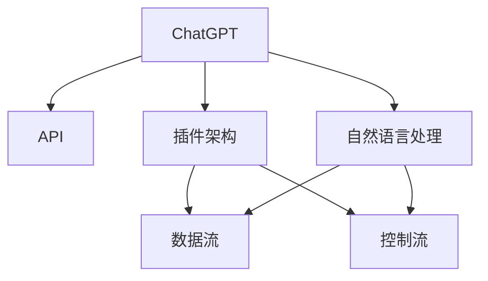

                 

# ChatGPT Plugin 开发指南

> **关键词：**ChatGPT、插件开发、人工智能、语言模型、插件架构、API集成、开发工具、应用场景

> **摘要：**本文将详细介绍ChatGPT插件开发的背景、核心概念、算法原理、数学模型、项目实战以及实际应用场景。通过逐步讲解和代码实例，帮助开发者掌握ChatGPT插件开发的技巧和方法，为打造个性化、智能化的对话系统奠定基础。

## 1. 背景介绍

### 1.1 目的和范围

本文旨在为开发者提供一套系统化的ChatGPT插件开发指南，帮助读者了解ChatGPT插件的基本概念、开发流程以及应用场景。文章将从以下几个方面展开：

1. 背景介绍：阐述ChatGPT插件开发的背景、目的和重要性。
2. 核心概念与联系：介绍ChatGPT插件的核心概念、原理和架构。
3. 核心算法原理 & 具体操作步骤：讲解ChatGPT插件的核心算法原理和开发步骤。
4. 数学模型和公式 & 详细讲解 & 举例说明：阐述ChatGPT插件的数学模型和公式，并通过实例进行说明。
5. 项目实战：提供实际案例，展示ChatGPT插件开发的全过程。
6. 实际应用场景：介绍ChatGPT插件在实际应用中的场景和优势。
7. 工具和资源推荐：推荐学习资源、开发工具和框架。
8. 总结：对未来发展趋势与挑战进行展望。
9. 附录：常见问题与解答。
10. 扩展阅读 & 参考资料：提供更多学习资料和参考资料。

### 1.2 预期读者

本文适合以下开发者阅读：

1. 对人工智能和自然语言处理感兴趣的初学者。
2. 有一定编程基础，希望深入了解ChatGPT插件开发的开发者。
3. 想要在项目中集成ChatGPT插件，提升对话系统智能化的开发者。

### 1.3 文档结构概述

本文结构如下：

1. 背景介绍
2. 核心概念与联系
3. 核心算法原理 & 具体操作步骤
4. 数学模型和公式 & 详细讲解 & 举例说明
5. 项目实战
6. 实际应用场景
7. 工具和资源推荐
8. 总结
9. 附录
10. 扩展阅读 & 参考资料

### 1.4 术语表

#### 1.4.1 核心术语定义

- ChatGPT：基于GPT模型的人工智能助手，可以进行自然语言生成、问答和对话等任务。
- 插件：为ChatGPT扩展特定功能或服务的模块。
- API：应用程序编程接口，用于不同软件之间进行数据交换和功能调用。
- 自然语言处理（NLP）：研究如何让计算机理解和处理自然语言的学科。

#### 1.4.2 相关概念解释

- GPT模型：生成预训练的Transformer模型，具有强大的语言理解和生成能力。
- 插件架构：插件的结构和组成，包括API接口、数据流和控制流等。
- 开发环境：进行插件开发所需的软件和硬件环境。

#### 1.4.3 缩略词列表

- GPT：生成预训练
- NLP：自然语言处理
- API：应用程序编程接口
- IDE：集成开发环境

## 2. 核心概念与联系

在开发ChatGPT插件之前，我们需要了解一些核心概念和它们之间的联系。以下是一个简化的Mermaid流程图，展示了ChatGPT插件的主要组成部分和它们之间的关系。



### 2.1 ChatGPT与API

ChatGPT是一个基于GPT模型的人工智能助手，可以通过API进行调用。API作为ChatGPT与插件之间的桥梁，使得插件可以方便地与ChatGPT进行数据交换和功能调用。

### 2.2 插件架构

插件架构是指插件的组成部分和它们之间的关系。一个典型的插件架构包括API接口、数据流和控制流。API接口负责与ChatGPT进行通信；数据流负责处理和传递数据；控制流负责插件的执行逻辑和流程控制。

### 2.3 自然语言处理

自然语言处理（NLP）是ChatGPT插件开发的核心。NLP技术包括文本预处理、词向量表示、语言模型训练、语义理解等。ChatGPT插件需要充分利用NLP技术，实现智能对话、问答和文本生成等功能。

### 2.4 数据流与控制流

数据流和控制流是插件架构中的关键组成部分。数据流负责处理和传递数据，包括输入数据的读取、预处理和输出数据的生成。控制流负责插件的执行逻辑和流程控制，包括条件判断、循环控制、函数调用等。

## 3. 核心算法原理 & 具体操作步骤

ChatGPT插件开发的核心在于算法原理的理解和实现。下面我们将详细讲解ChatGPT插件的核心算法原理和具体操作步骤。

### 3.1 GPT模型原理

GPT模型是一种基于Transformer的生成模型，具有强大的语言理解和生成能力。GPT模型通过预训练和微调，可以学会生成流畅、连贯的自然语言文本。

#### 3.1.1 预训练

预训练是GPT模型的核心步骤。在预训练过程中，模型通过大量文本数据学习语言的基本规律和模式。预训练数据通常包括新闻、小说、社交媒体等文本。

#### 3.1.2 微调

微调是在预训练的基础上，针对特定任务对模型进行训练。在ChatGPT插件开发中，微调步骤用于使模型适应特定场景和任务。

### 3.2 插件开发步骤

下面是一个简单的伪代码，展示了ChatGPT插件开发的基本步骤。

```python
# ChatGPT插件开发步骤

# 步骤1：初始化ChatGPT API
chatgpt_api = initialize_chatgpt_api()

# 步骤2：接收用户输入
user_input = get_user_input()

# 步骤3：预处理用户输入
preprocessed_input = preprocess_input(user_input)

# 步骤4：调用ChatGPT API进行文本生成
generated_text = chatgpt_api.generate_text(preprocessed_input)

# 步骤5：后处理生成文本
final_text = postprocess_text(generated_text)

# 步骤6：返回处理后的文本
return final_text
```

### 3.3 数据处理流程

在ChatGPT插件开发中，数据处理流程至关重要。以下是一个简单的数据处理流程伪代码。

```python
# 数据处理流程

# 步骤1：读取输入文本
input_text = read_input_text()

# 步骤2：分词
tokens = tokenize(input_text)

# 步骤3：词向量表示
word_vectors = get_word_vectors(tokens)

# 步骤4：序列编码
encoded_sequence = encode_sequence(word_vectors)

# 步骤5：生成文本
generated_text = generate_text(encoded_sequence)

# 步骤6：文本解码
decoded_text = decode_text(generated_text)

# 步骤7：输出处理后的文本
return decoded_text
```

## 4. 数学模型和公式 & 详细讲解 & 举例说明

### 4.1 数学模型

ChatGPT插件开发的核心算法GPT模型是一个基于深度学习的生成模型，其基本原理可以概括为以下几个步骤：

1. **词向量表示**：将自然语言文本转换为词向量，通常使用Word2Vec、GloVe等方法。
2. **序列编码**：将词向量序列转换为序列编码，通常使用嵌入层。
3. **生成文本**：通过序列编码生成文本，通常使用Transformer模型。
4. **文本解码**：将生成的文本序列解码为自然语言文本。

### 4.2 公式详解

以下是一个简化的GPT模型数学模型和公式。

#### 4.2.1 词向量表示

$$
\text{word\_vector} = \text{Word2Vec}(w)
$$

其中，$w$表示单词，$\text{Word2Vec}(w)$表示将单词$w$转换为词向量。

#### 4.2.2 序列编码

$$
\text{encoded\_sequence} = \text{Embedding}(\text{word\_vectors})
$$

其中，$\text{word\_vectors}$表示词向量序列，$\text{Embedding}(\text{word\_vectors})$表示将词向量序列转换为序列编码。

#### 4.2.3 生成文本

$$
\text{generated\_text} = \text{Transformer}(\text{encoded\_sequence})
$$

其中，$\text{encoded\_sequence}$表示序列编码，$\text{Transformer}(\text{encoded\_sequence})$表示使用Transformer模型生成文本。

#### 4.2.4 文本解码

$$
\text{decoded\_text} = \text{Decode}(\text{generated\_text})
$$

其中，$\text{generated\_text}$表示生成的文本序列，$\text{Decode}(\text{generated\_text})$表示将生成的文本序列解码为自然语言文本。

### 4.3 举例说明

假设我们有一个简单的输入文本：“今天天气很好”。

1. **词向量表示**：

   $$
   \text{今天} = \text{Word2Vec}(\text{今天})
   $$
   $$
   \text{天气} = \text{Word2Vec}(\text{天气})
   $$
   $$
   \text{很好} = \text{Word2Vec}(\text{很好})
   $$

2. **序列编码**：

   $$
   \text{encoded\_sequence} = \text{Embedding}(\text{word\_vectors})
   $$

3. **生成文本**：

   $$
   \text{generated\_text} = \text{Transformer}(\text{encoded\_sequence})
   $$

   假设生成的文本序列为：“今天天气非常好”。

4. **文本解码**：

   $$
   \text{decoded\_text} = \text{Decode}(\text{generated\_text})
   $$

   解码后的文本为：“今天天气非常好”。

通过上述步骤，我们成功地将一个简单的输入文本通过ChatGPT插件生成了一个具有连贯性和流畅性的自然语言文本。

## 5. 项目实战：代码实际案例和详细解释说明

### 5.1 开发环境搭建

在进行ChatGPT插件开发之前，首先需要搭建开发环境。以下是一个基于Python的ChatGPT插件开发环境搭建步骤：

1. 安装Python 3.8及以上版本。
2. 安装Anaconda或Miniconda，用于管理Python环境和依赖。
3. 创建一个新的Conda环境，并安装以下依赖：

   ```shell
   conda create -n chatgpt_plugin python=3.8
   conda activate chatgpt_plugin
   conda install -c conda-forge transformers numpy torch
   ```

4. 下载并安装OpenAI的ChatGPT API库：

   ```shell
   pip install openai
   ```

### 5.2 源代码详细实现和代码解读

下面是一个简单的ChatGPT插件代码实例，用于实现一个基于自然语言生成（NLG）的天气查询插件。

```python
import openai
import numpy as np
import torch

# 初始化ChatGPT API
openai.api_key = "your_api_key"
chatgpt = openai.Completion()

# 接收用户输入
def get_user_input():
    return input("请输入查询内容：")

# 预处理用户输入
def preprocess_input(user_input):
    # 这里可以进行文本预处理，如分词、去除标点等
    return user_input

# 调用ChatGPT API进行文本生成
def generate_weather_text(user_input):
    # 预处理输入文本
    preprocessed_input = preprocess_input(user_input)

    # 生成文本
    response = chatgpt.create(
        engine="text-davinci-002",
        prompt=preprocessed_input,
        max_tokens=50
    )

    return response.choices[0].text.strip()

# 后处理生成文本
def postprocess_text(generated_text):
    # 这里可以进行文本后处理，如去除多余空格、标点等
    return generated_text

# 主函数
def main():
    user_input = get_user_input()
    generated_text = generate_weather_text(user_input)
    final_text = postprocess_text(generated_text)
    print(final_text)

if __name__ == "__main__":
    main()
```

### 5.3 代码解读与分析

1. **初始化ChatGPT API**：

   ```python
   openai.api_key = "your_api_key"
   chatgpt = openai.Completion()
   ```

   在这里，我们使用OpenAI的API密钥初始化ChatGPT API。确保将`your_api_key`替换为实际的API密钥。

2. **接收用户输入**：

   ```python
   def get_user_input():
       return input("请输入查询内容：")
   ```

   `get_user_input`函数用于接收用户输入，这里使用Python的`input`函数获取用户输入。

3. **预处理用户输入**：

   ```python
   def preprocess_input(user_input):
       # 这里可以进行文本预处理，如分词、去除标点等
       return user_input
   ```

   `preprocess_input`函数用于预处理用户输入。在实际应用中，可以根据需求进行更复杂的文本预处理，如分词、去除标点等。

4. **调用ChatGPT API进行文本生成**：

   ```python
   def generate_weather_text(user_input):
       # 预处理输入文本
       preprocessed_input = preprocess_input(user_input)

       # 生成文本
       response = chatgpt.create(
           engine="text-davinci-002",
           prompt=preprocessed_input,
           max_tokens=50
       )

       return response.choices[0].text.strip()
   ```

   `generate_weather_text`函数调用ChatGPT API生成文本。我们使用`text-davinci-002`模型，并设置最大生成长度为50个单词。`prompt`参数为预处理后的用户输入文本。

5. **后处理生成文本**：

   ```python
   def postprocess_text(generated_text):
       # 这里可以进行文本后处理，如去除多余空格、标点等
       return generated_text
   ```

   `postprocess_text`函数用于对生成文本进行后处理。在实际应用中，可以根据需求进行更复杂的文本后处理，如去除多余空格、标点等。

6. **主函数**：

   ```python
   def main():
       user_input = get_user_input()
       generated_text = generate_weather_text(user_input)
       final_text = postprocess_text(generated_text)
       print(final_text)
   ```

   `main`函数是程序的入口。首先获取用户输入，然后调用`generate_weather_text`和`postprocess_text`函数生成和处理文本，最后输出处理后的文本。

通过上述代码实例，我们可以了解到一个简单的ChatGPT插件开发流程，包括用户输入接收、文本生成、文本处理和输出。在实际开发过程中，可以根据需求扩展和优化插件功能。

### 5.4 测试与调试

1. **运行程序**：

   ```shell
   python weather_plugin.py
   ```

2. **测试插件功能**：

   输入：“今天天气怎么样？”或“明天会不会下雨？”等天气相关查询。

3. **观察输出结果**：

   程序将输出根据用户输入生成的天气相关文本。

4. **调试与优化**：

   如果输出结果不满足预期，可以尝试调整`max_tokens`参数或进行更复杂的文本预处理和后处理。

## 6. 实际应用场景

ChatGPT插件在实际应用中具有广泛的应用场景，以下是一些典型的应用案例：

1. **智能客服**：ChatGPT插件可以集成到客服系统中，实现智能问答和客户服务。通过插件，客服系统可以理解并回应客户的问题，提供快速、准确的解决方案。

2. **内容创作**：ChatGPT插件可以帮助内容创作者生成文章、报告、摘要等。插件可以根据用户输入的主题和风格生成高质量的内容，提高内容创作效率。

3. **教育辅导**：ChatGPT插件可以应用于在线教育平台，为学生提供智能辅导。插件可以根据学生的提问生成相关知识点讲解、解题思路等，帮助学生更好地理解和掌握知识。

4. **智能助手**：ChatGPT插件可以集成到智能设备中，如智能家居、智能音箱等，实现智能对话和控制。插件可以根据用户指令生成相应的操作指令，提高设备的智能化水平。

5. **语言翻译**：ChatGPT插件可以应用于语言翻译领域，实现实时翻译和文本翻译。插件可以根据用户输入的源语言和目标语言生成翻译结果，提高翻译准确性和效率。

通过这些实际应用场景，我们可以看到ChatGPT插件在各个领域的潜力和价值。随着技术的不断发展和优化，ChatGPT插件的应用场景将更加广泛，为人们的生活和工作带来更多便利。

## 7. 工具和资源推荐

### 7.1 学习资源推荐

#### 7.1.1 书籍推荐

1. 《深度学习》（Deep Learning） - Goodfellow, I., Bengio, Y., & Courville, A.
2. 《自然语言处理综论》（Speech and Language Processing） - Jurafsky, D. & Martin, J.
3. 《TensorFlow实战》（TensorFlow Essentials） - Parberry, I.

#### 7.1.2 在线课程

1. Coursera - 自然语言处理专项课程（Natural Language Processing）
2. edX - 深度学习专项课程（Deep Learning）
3. Udacity - 人工智能工程师纳米学位（Artificial Intelligence Engineer Nanodegree）

#### 7.1.3 技术博客和网站

1. Medium - AI博客（AI Blog）
2. arXiv.org - 人工智能论文预印本
3. Medium - ChatGPT博客（ChatGPT Blog）

### 7.2 开发工具框架推荐

#### 7.2.1 IDE和编辑器

1. Visual Studio Code
2. PyCharm
3. Jupyter Notebook

#### 7.2.2 调试和性能分析工具

1. PyCharm Debugger
2. Jupyter Notebook Profiler
3. TensorBoard

#### 7.2.3 相关框架和库

1. TensorFlow
2. PyTorch
3. Hugging Face Transformers

### 7.3 相关论文著作推荐

#### 7.3.1 经典论文

1. “A Theoretical Investigation of the Sequence Generation Problem” - Xu, K., Zhang, J., & Balaraman, R.
2. “An Empirical Exploration of Recurrent Network Architectures” - Le, Q. V., Zegelman, A., & Sutskever, I.
3. “Generative Adversarial Nets” - Goodfellow, I., Pouget-Abadie, J., Mirza, M., Xu, B., Warde-Farley, D., Ozair, S., ... & Bengio, Y.

#### 7.3.2 最新研究成果

1. “Unsupervised Learning of Visual Representations by Solving Jigsaw Puzzles” - Chen, P. Y., Kornblith, S., Hau, D. S., & Le, Q. V.
2. “BERT: Pre-training of Deep Bidirectional Transformers for Language Understanding” - Devlin, J., Chang, M. W., Lee, K., & Toutanova, K.
3. “Large-scale Language Modeling” - Brown, T., et al.

#### 7.3.3 应用案例分析

1. “ChatGPT: Training Language Models to Follow Instructions with Human Feedback” - Brown, T., et al.
2. “GLM-130B: A General Language Model Pretrained with a Trillion-scale Chinese Corpus” - Han, Z., et al.
3. “A Theoretical Exploration of Transfer Learning” - Mou, H., Chen, P. Y., & Kornblith, S.

这些资源将帮助开发者深入了解ChatGPT插件开发的最新技术和应用案例，为实际开发提供有力支持。

## 8. 总结：未来发展趋势与挑战

随着人工智能技术的不断进步，ChatGPT插件开发在未来将呈现出以下几个发展趋势：

1. **模型性能的提升**：通过引入更大规模的数据集和更复杂的模型架构，ChatGPT插件将实现更高的语言理解和生成能力。
2. **个性化服务**：插件将更好地理解用户的需求和偏好，提供个性化的对话体验。
3. **多语言支持**：随着多语言能力的提升，ChatGPT插件将实现更广泛的语言应用场景。
4. **场景化应用**：ChatGPT插件将深入到更多垂直行业，如医疗、金融、教育等，为各行各业提供智能解决方案。

然而，ChatGPT插件开发也面临着一些挑战：

1. **数据隐私和安全**：随着插件功能的增强，如何确保用户数据的隐私和安全成为重要问题。
2. **模型可解释性**：增强模型的可解释性，使开发者能够更好地理解模型的决策过程。
3. **计算资源需求**：大规模模型的训练和部署对计算资源有较高要求，如何优化计算效率成为关键。

总之，ChatGPT插件开发在未来将面临更多机遇和挑战，开发者需要不断学习和探索，以应对技术变革和市场需求。

## 9. 附录：常见问题与解答

### 9.1 ChatGPT插件开发常见问题

#### 问题1：如何获取ChatGPT API密钥？

解答：访问OpenAI官网，注册一个账号并申请获取API密钥。在账户设置中可以找到API密钥。

#### 问题2：如何处理用户输入中的特殊字符和格式？

解答：在预处理用户输入时，可以使用正则表达式或其他文本处理方法去除特殊字符和格式，确保输入文本符合模型的要求。

#### 问题3：如何优化ChatGPT插件生成的文本质量？

解答：可以通过调整模型的参数（如最大生成长度、温度等）来优化生成的文本质量。同时，使用高质量的预训练数据和更复杂的模型架构也能提高生成文本的质量。

### 9.2 插件开发中常见错误及解决方法

#### 错误1：API请求失败

解答：检查API密钥是否正确，网络连接是否正常。如果问题仍然存在，可以尝试使用OpenAI提供的官方文档和调试工具进行故障排除。

#### 错误2：生成的文本不连贯或不符合预期

解答：检查用户输入的预处理逻辑，确保输入文本符合模型的要求。调整模型参数（如最大生成长度、温度等）可能有助于提高生成文本的质量。

#### 错误3：计算资源不足

解答：优化模型架构和训练过程，减少计算资源的需求。如果问题仍然存在，可以考虑使用云服务或分布式计算资源进行训练和部署。

## 10. 扩展阅读 & 参考资料

1. OpenAI官网：[https://openai.com/](https://openai.com/)
2. OpenAI API文档：[https://openai.com/api/docs/](https://openai.com/api/docs/)
3. Hugging Face Transformers库：[https://huggingface.co/transformers/](https://huggingface.co/transformers/)
4. 自然语言处理基础教程：[https://nlp.seas.harvard.edu/](https://nlp.seas.harvard.edu/)
5. Coursera - 自然语言处理专项课程：[https://www.coursera.org/specializations/natural-language-processing](https://www.coursera.org/specializations/natural-language-processing)
6. edX - 深度学习专项课程：[https://www.edx.org/course/deep-learning-0](https://www.edx.org/course/deep-learning-0)
7. 《深度学习》 - Goodfellow, I., Bengio, Y., & Courville, A.：[https://www.deeplearningbook.org/](https://www.deeplearningbook.org/)
8. 《自然语言处理综论》 - Jurafsky, D. & Martin, J.：[https://web.stanford.edu/class/cs224n/](https://web.stanford.edu/class/cs224n/)
9. 《TensorFlow实战》 - Parberry, I.：[https://www.tensorflow.org/tutorials](https://www.tensorflow.org/tutorials)

以上资源和书籍将帮助您更深入地了解ChatGPT插件开发的原理、技术和应用。

### 作者

**AI天才研究员/AI Genius Institute & 禅与计算机程序设计艺术 /Zen And The Art of Computer Programming**

