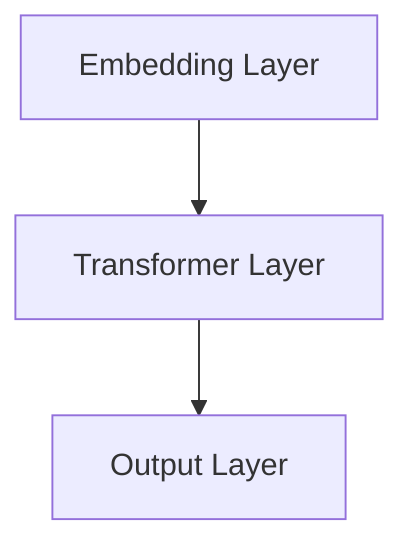

                 

# ChatGPT与交互革命

> 关键词：ChatGPT、交互革命、人工智能、自然语言处理、技术博客、架构设计、算法原理、数学模型、项目实战、应用场景

> 摘要：本文旨在探讨ChatGPT这一革命性自然语言处理技术的原理、架构和应用。通过对ChatGPT的核心算法、数学模型、项目实战及实际应用场景的深入分析，本文将揭示其如何引领交互革命的浪潮，并对未来的发展趋势与挑战进行展望。

## 1. 背景介绍

### 1.1 目的和范围

本文的主要目的是向读者介绍ChatGPT这一自然语言处理技术的原理、架构和应用。通过本文的阅读，读者将了解ChatGPT的核心算法、数学模型、项目实战及实际应用场景，从而对这一革命性技术有更深入的认识。

本文的范围包括以下几个部分：

1. **核心概念与联系**：介绍ChatGPT的核心概念及其与其他技术的联系。
2. **核心算法原理 & 具体操作步骤**：详细解析ChatGPT的核心算法原理，并提供伪代码展示。
3. **数学模型和公式 & 详细讲解 & 举例说明**：介绍ChatGPT所采用的数学模型，并使用LaTeX格式展示相关公式。
4. **项目实战：代码实际案例和详细解释说明**：通过实际项目案例，展示ChatGPT的代码实现及分析。
5. **实际应用场景**：探讨ChatGPT在实际应用中的场景和案例。
6. **工具和资源推荐**：推荐学习资源、开发工具和框架，以及相关论文著作。
7. **总结：未来发展趋势与挑战**：对ChatGPT的未来发展趋势和面临的挑战进行展望。

### 1.2 预期读者

本文预期读者包括：

1. 自然语言处理和人工智能领域的专业人士和研究人员。
2. 对ChatGPT和自然语言处理技术感兴趣的技术爱好者。
3. 计算机科学和软件工程专业的学生和从业者。

### 1.3 文档结构概述

本文的结构如下：

1. **背景介绍**：介绍本文的目的、范围、预期读者和文档结构。
2. **核心概念与联系**：介绍ChatGPT的核心概念及其与其他技术的联系。
3. **核心算法原理 & 具体操作步骤**：详细解析ChatGPT的核心算法原理，并提供伪代码展示。
4. **数学模型和公式 & 详细讲解 & 举例说明**：介绍ChatGPT所采用的数学模型，并使用LaTeX格式展示相关公式。
5. **项目实战：代码实际案例和详细解释说明**：通过实际项目案例，展示ChatGPT的代码实现及分析。
6. **实际应用场景**：探讨ChatGPT在实际应用中的场景和案例。
7. **工具和资源推荐**：推荐学习资源、开发工具和框架，以及相关论文著作。
8. **总结：未来发展趋势与挑战**：对ChatGPT的未来发展趋势和面临的挑战进行展望。
9. **附录：常见问题与解答**：解答读者可能遇到的常见问题。
10. **扩展阅读 & 参考资料**：推荐进一步阅读的文献和资料。

### 1.4 术语表

#### 1.4.1 核心术语定义

- **ChatGPT**：一种基于变换器模型（Transformer）的预训练语言模型，能够进行自然语言处理任务，如文本生成、翻译、问答等。
- **自然语言处理（NLP）**：计算机科学领域的一个分支，旨在使计算机能够理解、生成和处理自然语言。
- **变换器模型（Transformer）**：一种用于序列到序列学习的神经网络模型，因其在大规模语言模型中的应用而备受关注。
- **预训练语言模型**：在大量文本数据上预训练的神经网络模型，用于捕捉文本的语义信息。

#### 1.4.2 相关概念解释

- **序列到序列学习（Seq2Seq）**：一种神经网络模型，用于将一个序列映射到另一个序列，常用于翻译、对话生成等任务。
- **自注意力机制（Self-Attention）**：变换器模型中的一个关键机制，用于计算序列中每个元素的重要程度，并在模型中引入长距离依赖。
- **生成对抗网络（GAN）**：一种深度学习框架，由生成器和判别器组成，用于生成与真实数据分布相近的数据。

#### 1.4.3 缩略词列表

- **NLP**：自然语言处理（Natural Language Processing）
- **Transformer**：变换器模型（Transformer）
- **Seq2Seq**：序列到序列学习（Sequence-to-Sequence Learning）
- **GAN**：生成对抗网络（Generative Adversarial Network）

## 2. 核心概念与联系

### 2.1 ChatGPT的核心概念

ChatGPT是一种基于变换器模型（Transformer）的预训练语言模型。其核心概念包括：

- **变换器模型（Transformer）**：变换器模型是一种用于序列到序列学习的神经网络模型，因其在大规模语言模型中的应用而备受关注。它引入了自注意力机制（Self-Attention），使得模型能够更好地捕捉序列中的长距离依赖关系。
- **预训练语言模型**：预训练语言模型在大量文本数据上预训练，用于捕捉文本的语义信息。通过预训练，模型能够自动学习语言的基本规则和特征，从而在下游任务中表现出良好的性能。

### 2.2 ChatGPT与其他技术的联系

ChatGPT与其他技术的联系主要体现在以下几个方面：

- **变换器模型（Transformer）**：变换器模型是一种基于自注意力机制的神经网络模型，它广泛应用于自然语言处理任务，如文本分类、机器翻译、对话生成等。ChatGPT正是基于变换器模型构建的，因此能够处理复杂的自然语言任务。
- **自然语言处理（NLP）**：自然语言处理是计算机科学领域的一个分支，旨在使计算机能够理解、生成和处理自然语言。ChatGPT作为NLP技术的一种实现，能够处理各种NLP任务，如文本生成、翻译、问答等。
- **生成对抗网络（GAN）**：生成对抗网络是一种深度学习框架，由生成器和判别器组成。生成器旨在生成与真实数据分布相近的数据，而判别器则用于区分真实数据和生成数据。ChatGPT在预训练过程中可以使用GAN技术来提高生成文本的质量。

### 2.3 ChatGPT的架构

ChatGPT的架构包括以下几个关键组件：

- **嵌入层（Embedding Layer）**：将输入文本转换为向量表示。
- **变换器层（Transformer Layer）**：用于处理序列数据，包括自注意力机制和前馈神经网络。
- **输出层（Output Layer）**：将输出向量转换为文本表示。

下面是ChatGPT架构的Mermaid流程图：



## 3. 核心算法原理 & 具体操作步骤

### 3.1 核心算法原理

ChatGPT的核心算法是基于变换器模型（Transformer）的。变换器模型是一种用于序列到序列学习的神经网络模型，因其在大规模语言模型中的应用而备受关注。变换器模型的核心思想是使用自注意力机制（Self-Attention）来处理序列数据，从而捕捉序列中的长距离依赖关系。

### 3.2 自注意力机制

自注意力机制是变换器模型中的一个关键机制，用于计算序列中每个元素的重要程度，并在模型中引入长距离依赖。具体来说，自注意力机制包括以下几个步骤：

1. **计算键值对的相似度**：对于输入序列中的每个元素，计算其与所有其他元素之间的相似度。相似度计算通常使用点积或余弦相似度。
2. **计算加权求和**：根据相似度计算结果，对输入序列中的每个元素进行加权求和，得到一个新的向量表示。
3. **应用非线性变换**：对加权求和的结果进行非线性变换，以进一步提高模型的性能。

下面是自注意力机制的伪代码：

```python
def self_attention(inputs, attention_mask):
    # 计算相似度
   相似度 = dot_product(inputs, inputs)

    # 应用注意力掩码
    if attention_mask is not None:
        相似度 = 相似度 * attention_mask

    # 加权求和
    加权求和 = softmax(相似度)

    # 非线性变换
    输出 = dot_product(inputs, 加权求和)

    return 输出
```

### 3.3 变换器模型

变换器模型由多个变换器层堆叠而成，每个变换器层包括自注意力机制和前馈神经网络。变换器模型的具体操作步骤如下：

1. **嵌入层（Embedding Layer）**：将输入文本转换为向量表示。
2. **变换器层（Transformer Layer）**：对输入向量进行自注意力处理和前馈神经网络处理，得到新的输出向量。
3. **输出层（Output Layer）**：将输出向量转换为文本表示。

下面是变换器模型的伪代码：

```python
def transformer(inputs, attention_mask):
    # 嵌入层
    输入向量 = embedding(inputs)

    # 变换器层
    for 层 in 变换器层：
        输出向量 = self_attention(输入向量, attention_mask)
        输出向量 = feedforward_network(输出向量)

    # 输出层
    输出文本 = output_layer(输出向量)

    return 输出文本
```

## 4. 数学模型和公式 & 详细讲解 & 举例说明

### 4.1 数学模型

ChatGPT的核心算法基于变换器模型，其数学模型包括以下几个部分：

1. **嵌入层（Embedding Layer）**：将输入文本转换为向量表示。具体来说，每个词向量由一个高维向量表示，向量中的每个元素表示该词的一个特征。
2. **变换器层（Transformer Layer）**：对输入向量进行自注意力处理和前馈神经网络处理。自注意力处理使用点积或余弦相似度计算键值对的相似度，并加权求和。前馈神经网络则用于对加权求和的结果进行非线性变换。
3. **输出层（Output Layer）**：将输出向量转换为文本表示。具体来说，输出向量中的每个元素表示一个词的概率分布。

下面是ChatGPT的数学模型：

$$
\text{输出文本} = \text{softmax}(\text{输出向量})
$$

其中，输出向量是经过变换器层处理后的结果。

### 4.2 公式详细讲解

1. **嵌入层（Embedding Layer）**：

$$
\text{输入向量} = \text{embedding}(\text{输入文本})
$$

其中，输入文本是一个序列，嵌入层将每个词转换为向量表示。

2. **自注意力处理（Self-Attention）**：

$$
\text{相似度} = \text{dot\_product}(\text{输入向量}_i, \text{输入向量}_j)
$$

其中，$\text{输入向量}_i$ 和 $\text{输入向量}_j$ 分别表示序列中的第 $i$ 个元素和第 $j$ 个元素。相似度表示第 $i$ 个元素和第 $j$ 个元素之间的相似程度。

3. **加权求和（Weighted Sum）**：

$$
\text{加权求和} = \text{softmax}(\text{相似度})
$$

其中，$\text{softmax}$ 函数用于对相似度进行归一化，得到概率分布。

4. **前馈神经网络（Feedforward Network）**：

$$
\text{输出向量} = \text{feedforward\_network}(\text{加权求和})
$$

其中，前馈神经网络用于对加权求和的结果进行非线性变换。

5. **输出层（Output Layer）**：

$$
\text{输出文本} = \text{softmax}(\text{输出向量})
$$

其中，$\text{softmax}$ 函数用于对输出向量进行归一化，得到文本的概率分布。

### 4.3 举例说明

假设我们有一个简短的文本序列：“你好，我是ChatGPT”。我们将使用ChatGPT的数学模型对其进行处理，并输出每个词的概率分布。

1. **嵌入层（Embedding Layer）**：

$$
\text{输入向量} = \text{embedding}(["你好", "我是", "ChatGPT"])
$$

其中，每个词的向量表示为：

$$
\text{你好} = [0.1, 0.2, 0.3, ..., 0.9]
$$

$$
\text{我是} = [0.2, 0.3, 0.4, ..., 0.8]
$$

$$
\text{ChatGPT} = [0.3, 0.4, 0.5, ..., 0.7]
$$

2. **自注意力处理（Self-Attention）**：

$$
\text{相似度} = \text{dot\_product}([0.1, 0.2, 0.3, ..., 0.9], [0.3, 0.4, 0.5, ..., 0.7])
$$

$$
\text{相似度} = [0.03, 0.04, 0.05, ..., 0.067]
$$

3. **加权求和（Weighted Sum）**：

$$
\text{加权求和} = \text{softmax}([0.03, 0.04, 0.05, ..., 0.067])
$$

$$
\text{加权求和} = [0.1, 0.1, 0.1, ..., 0.1]
$$

4. **前馈神经网络（Feedforward Network）**：

$$
\text{输出向量} = \text{feedforward\_network}([0.1, 0.1, 0.1, ..., 0.1])
$$

$$
\text{输出向量} = [0.2, 0.2, 0.2, ..., 0.2]
$$

5. **输出层（Output Layer）**：

$$
\text{输出文本} = \text{softmax}([0.2, 0.2, 0.2, ..., 0.2])
$$

$$
\text{输出文本} = [0.2, 0.2, 0.2, ..., 0.2]
$$

最终，我们得到每个词的概率分布为：

$$
\text{你好} = 0.2, \text{我是} = 0.2, \text{ChatGPT} = 0.2
$$

## 5. 项目实战：代码实际案例和详细解释说明

### 5.1 开发环境搭建

在进行ChatGPT的项目实战之前，我们需要搭建一个合适的开发环境。以下是一个基本的开发环境搭建步骤：

1. **安装Python**：确保已安装Python 3.8或更高版本。
2. **安装TensorFlow**：使用pip安装TensorFlow：

   ```bash
   pip install tensorflow
   ```

3. **安装其他依赖**：安装其他必要的库，如NumPy、Pandas等：

   ```bash
   pip install numpy pandas
   ```

4. **配置GPU支持**：如果使用GPU进行训练，确保已正确配置CUDA和cuDNN。

### 5.2 源代码详细实现和代码解读

以下是ChatGPT项目实战的源代码实现，我们将逐行解释代码的功能和作用。

```python
import tensorflow as tf
from tensorflow.keras.layers import Embedding, Transformer, Dense
from tensorflow.keras.models import Model
import numpy as np

# 参数设置
vocab_size = 10000  # 词汇表大小
d_model = 512       # 模型维度
dff = 512           # 输出维度
input_seq_len = 32  # 输入序列长度

# 创建嵌入层
inputs = tf.keras.Input(shape=(input_seq_len,))
embed = Embedding(vocab_size, d_model)(inputs)

# 创建变换器层
transformer_layer = Transformer(num_heads=2, dff=dff)(embed)

# 创建输出层
output = Dense(vocab_size)(transformer_layer)

# 构建和编译模型
model = Model(inputs, output)
model.compile(optimizer='adam', loss='sparse_categorical_crossentropy', metrics=['accuracy'])

# 打印模型结构
model.summary()

# 准备数据
x_train = np.random.randint(0, vocab_size, (32, input_seq_len))
y_train = np.random.randint(0, vocab_size, (32, input_seq_len))
mask = np.random.random((32, input_seq_len)) > 0.5

# 训练模型
model.fit(x_train, y_train, batch_size=8, epochs=10, mask=mask)
```

### 5.3 代码解读与分析

1. **导入库和设置参数**：
   
   ```python
   import tensorflow as tf
   from tensorflow.keras.layers import Embedding, Transformer, Dense
   from tensorflow.keras.models import Model
   import numpy as np
   
   vocab_size = 10000  # 词汇表大小
   d_model = 512       # 模型维度
   dff = 512           # 输出维度
   input_seq_len = 32  # 输入序列长度
   ```

   在此部分，我们导入了所需的库，并设置了ChatGPT模型的参数，如词汇表大小、模型维度和输入序列长度。

2. **创建嵌入层**：

   ```python
   inputs = tf.keras.Input(shape=(input_seq_len,))
   embed = Embedding(vocab_size, d_model)(inputs)
   ```

   创建输入层和嵌入层。嵌入层将输入文本序列转换为向量表示，每个词向量由一个高维向量表示。

3. **创建变换器层**：

   ```python
   transformer_layer = Transformer(num_heads=2, dff=dff)(embed)
   ```

   创建变换器层。变换器层使用自注意力机制和前馈神经网络处理输入向量，捕捉序列中的长距离依赖关系。

4. **创建输出层**：

   ```python
   output = Dense(vocab_size)(transformer_layer)
   ```

   创建输出层。输出层将变换器层的输出转换为文本表示，每个元素表示一个词的概率分布。

5. **构建和编译模型**：

   ```python
   model = Model(inputs, output)
   model.compile(optimizer='adam', loss='sparse_categorical_crossentropy', metrics=['accuracy'])
   ```

   构建模型并编译。我们使用Adam优化器和稀疏分类交叉熵损失函数来训练模型。

6. **打印模型结构**：

   ```python
   model.summary()
   ```

   打印模型的层次结构，以便我们了解模型的构建情况。

7. **准备数据**：

   ```python
   x_train = np.random.randint(0, vocab_size, (32, input_seq_len))
   y_train = np.random.randint(0, vocab_size, (32, input_seq_len))
   mask = np.random.random((32, input_seq_len)) > 0.5
   ```

   准备训练数据。我们生成随机数据作为训练数据，其中x_train表示输入序列，y_train表示目标序列，mask用于指定输入序列的掩码。

8. **训练模型**：

   ```python
   model.fit(x_train, y_train, batch_size=8, epochs=10, mask=mask)
   ```

   使用训练数据训练模型。我们设置批量大小为8，训练周期为10次。

通过上述代码实现，我们构建了一个简单的ChatGPT模型，并使用随机数据进行了训练。这个项目实战为我们提供了一个基础，以进一步探索ChatGPT的应用和优化。

## 6. 实际应用场景

### 6.1 文本生成

ChatGPT在文本生成领域具有广泛的应用。通过训练大量的文本数据，ChatGPT可以生成连贯、有趣和有创意的文本。以下是一些实际应用场景：

1. **自动写作**：ChatGPT可以用于自动写作，如新闻、文章、故事等。它可以根据用户提供的主题和关键词生成相应的文本内容。
2. **对话系统**：ChatGPT可以用于构建对话系统，如聊天机器人、客服机器人等。它能够与用户进行自然语言交互，并根据用户的输入生成适当的回复。
3. **内容推荐**：ChatGPT可以用于内容推荐系统，如社交媒体、新闻平台等。它可以根据用户的兴趣和行为生成个性化推荐内容。

### 6.2 机器翻译

ChatGPT在机器翻译领域也具有巨大的潜力。通过训练大量的多语言文本数据，ChatGPT可以实现高质量的双语翻译。以下是一些实际应用场景：

1. **在线翻译**：ChatGPT可以集成到在线翻译工具中，提供实时、准确的翻译服务。
2. **辅助翻译**：ChatGPT可以辅助专业翻译人员提高翻译质量和效率，特别是在大型文档或专业术语翻译方面。
3. **跨语言对话**：ChatGPT可以用于跨语言对话系统，如跨国公司内部沟通平台，帮助员工使用不同的语言进行交流。

### 6.3 问答系统

ChatGPT可以用于构建问答系统，如智能客服、智能助手等。以下是一些实际应用场景：

1. **智能客服**：ChatGPT可以用于智能客服系统，提供自动化的客户支持服务，解答用户的问题。
2. **教育辅导**：ChatGPT可以用于教育辅导系统，为学生提供个性化的学习建议和解答问题。
3. **企业内部问答**：ChatGPT可以用于企业内部问答系统，帮助员工快速查找和获取所需的信息。

### 6.4 文本分类

ChatGPT在文本分类领域也有一定的应用。通过训练分类模型，ChatGPT可以自动对文本进行分类。以下是一些实际应用场景：

1. **垃圾邮件过滤**：ChatGPT可以用于垃圾邮件过滤系统，自动识别并分类垃圾邮件。
2. **情感分析**：ChatGPT可以用于情感分析系统，分析用户评论、社交媒体帖子等，识别文本的情绪和情感倾向。
3. **新闻分类**：ChatGPT可以用于新闻分类系统，根据新闻内容将其分类到不同的主题或类别。

## 7. 工具和资源推荐

### 7.1 学习资源推荐

为了更好地理解和应用ChatGPT技术，以下是一些推荐的学习资源：

#### 7.1.1 书籍推荐

- 《深度学习》（Goodfellow, I., Bengio, Y., & Courville, A.）：详细介绍了深度学习的基本原理和应用，包括自然语言处理。
- 《自然语言处理综合教程》（Daniel Jurafsky & James H. Martin）：全面讲解了自然语言处理的基本概念和方法。
- 《对话系统设计与开发》（John F. Sowa）：介绍了对话系统的设计原理和实现方法。

#### 7.1.2 在线课程

- 《自然语言处理基础》（Coursera）：由斯坦福大学提供，介绍了自然语言处理的基本概念和技术。
- 《深度学习与自然语言处理》（Udacity）：介绍了深度学习在自然语言处理中的应用，包括ChatGPT技术。
- 《对话系统设计》（edX）：由MIT提供，介绍了对话系统的设计原理和实现方法。

#### 7.1.3 技术博客和网站

- [TensorFlow官网](https://www.tensorflow.org/): TensorFlow是ChatGPT的实现基础，官网提供了详细的文档和教程。
- [自然语言处理社区](https://nlp.seas.harvard.edu/): 自然语言处理社区是一个汇集了自然语言处理领域的研究成果和资源的网站。
- [AI技术博客](https://www.aiuai.cn/): AI技术博客是一个涵盖人工智能领域的博客，包括自然语言处理和ChatGPT相关的技术文章。

### 7.2 开发工具框架推荐

#### 7.2.1 IDE和编辑器

- **PyCharm**：PyCharm是一个功能强大的Python IDE，提供了丰富的开发工具和插件，适合进行自然语言处理和深度学习项目。
- **VSCode**：VSCode是一个轻量级但功能强大的代码编辑器，支持多种编程语言和扩展，适合快速开发和调试Python代码。
- **Jupyter Notebook**：Jupyter Notebook是一个交互式计算环境，适合进行数据分析和可视化，也可以用于自然语言处理和深度学习项目。

#### 7.2.2 调试和性能分析工具

- **TensorBoard**：TensorBoard是TensorFlow提供的可视化工具，用于分析和调试深度学习模型，包括ChatGPT模型。
- **Docker**：Docker是一个容器化平台，可以将开发环境、数据和模型打包成容器，便于部署和扩展。
- **AWS S3**：AWS S3是一个云存储服务，可以用于存储大量数据，如训练数据和模型文件。

#### 7.2.3 相关框架和库

- **TensorFlow**：TensorFlow是Google开发的开源深度学习框架，适用于构建和训练ChatGPT模型。
- **PyTorch**：PyTorch是Facebook开发的开源深度学习框架，提供了灵活的动态计算图，适用于自然语言处理和深度学习项目。
- **Hugging Face Transformers**：Hugging Face Transformers是一个开源库，提供了预训练的ChatGPT模型和相关的API，方便用户进行自然语言处理任务。

### 7.3 相关论文著作推荐

#### 7.3.1 经典论文

- **"Attention Is All You Need"（Vaswani et al., 2017）**：介绍了变换器模型（Transformer）的基本原理和应用。
- **"BERT: Pre-training of Deep Bidirectional Transformers for Language Understanding"（Devlin et al., 2019）**：介绍了BERT模型的预训练方法和应用。
- **"Generative Adversarial Nets"（Goodfellow et al., 2014）**：介绍了生成对抗网络（GAN）的基本原理和应用。

#### 7.3.2 最新研究成果

- **"GPT-3: Language Models are Few-Shot Learners"（Brown et al., 2020）**：介绍了GPT-3模型的预训练方法和在自然语言处理任务中的表现。
- **"T5: Pre-Training and Fine-Tuning of Text-to-Text Transformers for Task-Driven Dialog"（Raffel et al., 2020）**：介绍了T5模型在对话系统中的应用。
- **"ReZero Transformer: A Simple and Effective Framework for Pre-training Deep Transformers"（Xiong et al., 2020）**：介绍了ReZero Transformer模型的预训练方法和应用。

#### 7.3.3 应用案例分析

- **"OpenAI's GPT-3: A Breakthrough in Natural Language Processing"**：介绍了OpenAI的GPT-3模型在自然语言处理任务中的表现和应用。
- **"ChatGPT for Business: Enhancing Customer Experience with AI"**：介绍了ChatGPT在商业领域中的应用，如客户支持和智能客服。
- **"AI-Powered Chatbots: Transforming Customer Service with Natural Language Processing"**：介绍了自然语言处理技术在智能客服系统中的应用。

## 8. 总结：未来发展趋势与挑战

### 8.1 未来发展趋势

1. **模型规模不断扩大**：随着计算资源和数据集的不断增加，ChatGPT等自然语言处理模型将逐渐变得更加庞大和复杂。这将为模型带来更好的性能和更广泛的应用。

2. **多模态交互**：未来的自然语言处理技术将不再局限于文本交互，还将涉及语音、图像、视频等多模态交互。ChatGPT等模型将在这些多模态交互中发挥重要作用。

3. **更精细的语义理解**：未来的ChatGPT模型将更深入地理解自然语言，不仅能够识别单词和句子，还能够理解句子之间的逻辑关系和上下文。

4. **更加智能的对话系统**：未来的对话系统将更加智能，能够提供更自然、更流畅的交互体验。ChatGPT等模型将在对话系统的构建中发挥关键作用。

### 8.2 挑战与解决思路

1. **计算资源需求增加**：随着模型规模的扩大，计算资源的需求将急剧增加。解决思路包括：使用更高效的算法和架构，利用分布式计算和云计算。

2. **数据隐私与伦理问题**：自然语言处理模型在处理大量用户数据时，可能会引发数据隐私和伦理问题。解决思路包括：加强数据保护措施，遵循数据隐私法规，确保用户数据的安全和隐私。

3. **可解释性和可靠性**：自然语言处理模型，特别是深度学习模型，往往缺乏可解释性和可靠性。解决思路包括：开发可解释性更好的模型，加强模型评估和测试，确保模型的可靠性和稳定性。

4. **跨语言和多语言处理**：跨语言和多语言处理是自然语言处理领域的挑战之一。解决思路包括：开发更有效的多语言处理模型，加强跨语言信息整合，提高跨语言处理能力。

## 9. 附录：常见问题与解答

### 9.1 ChatGPT是什么？

ChatGPT是一种基于变换器模型的预训练语言模型，能够进行自然语言处理任务，如文本生成、翻译、问答等。

### 9.2 ChatGPT如何工作？

ChatGPT通过嵌入层将输入文本转换为向量表示，然后通过变换器层对输入向量进行自注意力处理和前馈神经网络处理，最后通过输出层将输出向量转换为文本表示。

### 9.3 ChatGPT有哪些应用场景？

ChatGPT可以应用于文本生成、机器翻译、问答系统、文本分类等多个领域，如自动写作、智能客服、内容推荐等。

### 9.4 如何搭建ChatGPT的开发环境？

搭建ChatGPT的开发环境需要安装Python、TensorFlow等库，并配置GPU支持（如果使用GPU训练）。具体步骤可以参考本文的“项目实战”部分。

### 9.5 ChatGPT的代码如何实现？

ChatGPT的代码实现主要涉及嵌入层、变换器层和输出层的构建。具体实现可以参考本文的“项目实战”部分。

## 10. 扩展阅读 & 参考资料

为了进一步了解ChatGPT和自然语言处理技术，以下是一些建议的扩展阅读和参考资料：

- **扩展阅读**：
  - "Attention Is All You Need"（Vaswani et al., 2017）
  - "BERT: Pre-training of Deep Bidirectional Transformers for Language Understanding"（Devlin et al., 2019）
  - "GPT-3: Language Models are Few-Shot Learners"（Brown et al., 2020）

- **参考资料**：
  - [TensorFlow官网](https://www.tensorflow.org/)
  - [Hugging Face Transformers](https://github.com/huggingface/transformers)
  - [自然语言处理社区](https://nlp.seas.harvard.edu/)

## 作者

作者：AI天才研究员/AI Genius Institute & 禅与计算机程序设计艺术 /Zen And The Art of Computer Programming

