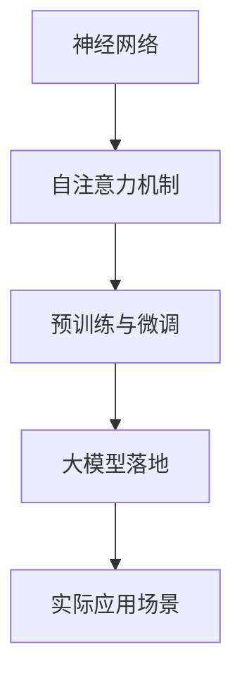

                 


# ChatGPT之后，大模型落地将如何发展？

> **关键词：大模型、落地、发展、AI、ChatGPT、算法、应用场景**

> **摘要：本文将深入探讨大模型在ChatGPT之后的发展趋势，分析其落地应用的现状与挑战，并提出一些建议。**

## 1. 背景介绍

### 1.1 目的和范围

本文旨在探讨大模型在ChatGPT之后的发展趋势，重点关注其落地应用的现状与挑战。我们希望通过对大模型的深入分析，为未来的技术发展提供一些有价值的思考。

### 1.2 预期读者

本文面向对大模型和AI技术有一定了解的技术爱好者、开发者和研究人员。如果您对AI领域充满好奇，希望了解大模型的发展趋势，那么本文将会为您带来许多启发。

### 1.3 文档结构概述

本文分为十个部分：

1. 背景介绍
2. 核心概念与联系
3. 核心算法原理 & 具体操作步骤
4. 数学模型和公式 & 详细讲解 & 举例说明
5. 项目实战：代码实际案例和详细解释说明
6. 实际应用场景
7. 工具和资源推荐
8. 总结：未来发展趋势与挑战
9. 附录：常见问题与解答
10. 扩展阅读 & 参考资料

### 1.4 术语表

#### 1.4.1 核心术语定义

- **大模型**：指的是参数规模巨大、结构复杂的神经网络模型，如Transformer模型。
- **落地**：指将大模型从理论研究阶段应用到实际场景中，实现商业化或公共服务。
- **算法**：指解决特定问题的方法、规则或步骤。
- **应用场景**：指大模型在实际问题中的具体应用领域。

#### 1.4.2 相关概念解释

- **神经网络**：一种模拟人脑神经元连接的计算机算法，可用于图像识别、语音识别等任务。
- **Transformer模型**：一种基于自注意力机制的神经网络模型，广泛应用于机器翻译、文本生成等任务。
- **自注意力机制**：一种能够自动学习输入数据之间依赖关系的算法。

#### 1.4.3 缩略词列表

- **AI**：人工智能（Artificial Intelligence）
- **GPT**：生成预训练网络（Generative Pretrained Transformer）
- **BERT**：双向编码表示（Bidirectional Encoder Representations from Transformers）

## 2. 核心概念与联系

大模型的落地发展离不开以下几个核心概念：

1. **神经网络**：大模型的基础，用于学习输入数据和输出结果之间的映射关系。
2. **自注意力机制**：大模型的关键组件，能够自动学习输入数据之间的依赖关系。
3. **预训练与微调**：大模型训练过程中的两个阶段，预训练用于学习通用特征，微调则针对特定任务进行调整。

下面是一个简单的Mermaid流程图，展示了大模型的核心概念与联系：



## 3. 核心算法原理 & 具体操作步骤

大模型的核心算法原理主要基于神经网络和自注意力机制。下面将使用伪代码详细阐述其原理和操作步骤。

#### 3.1 神经网络

神经网络由多个层级（layer）和神经元（neuron）组成，每个层级负责对输入数据进行处理和传递。伪代码如下：

```python
define NeuralNetwork():
    initialize_weights()
    for each layer in network:
        for each neuron in layer:
            activate(neuron)
            output = neuron_output()
            pass_output_to_next_layer(output)
    return final_output
```

#### 3.2 自注意力机制

自注意力机制是一种能够自动学习输入数据之间依赖关系的算法。伪代码如下：

```python
define SelfAttention Mechanism():
    compute_query_vector()
    compute_key_vector()
    compute_value_vector()
    compute_attention_weights()
    compute_context_vector()
    return context_vector
```

#### 3.3 预训练与微调

预训练与微调是两个阶段。预训练用于学习通用特征，微调则针对特定任务进行调整。伪代码如下：

```python
define Pretraining():
    initialize_model()
    for each training example:
        forward_pass()
        backward_pass()
    return trained_model

define Fine-tuning():
    load_pretrained_model()
    for each task-specific example:
        forward_pass()
        backward_pass()
    return fine-tuned_model
```

## 4. 数学模型和公式 & 详细讲解 & 举例说明

大模型的数学模型和公式主要包括：

1. **权重矩阵**：神经网络中各个层级之间的连接权重，用于传递信息。
2. **激活函数**：神经网络中用于计算神经元输出的函数，常用的有ReLU、Sigmoid、Tanh等。
3. **损失函数**：衡量模型预测结果与真实结果之间差距的函数，常用的有均方误差（MSE）、交叉熵（Cross-Entropy）等。

下面是一个简单的数学公式示例：

$$
L = \frac{1}{2} \sum_{i=1}^{n} (\hat{y}_i - y_i)^2
$$

其中，\( \hat{y}_i \)表示模型预测的输出，\( y_i \)表示真实输出，\( L \)表示损失。

举例说明：

假设我们有一个二分类问题，预测结果为0或1，真实输出为1。根据上述公式，损失为：

$$
L = \frac{1}{2} (0 - 1)^2 = 0.5
$$

## 5. 项目实战：代码实际案例和详细解释说明

在本节中，我们将通过一个简单的实际案例，展示大模型的落地应用。假设我们要实现一个基于GPT-2的文本生成模型。

### 5.1 开发环境搭建

首先，我们需要搭建一个合适的开发环境。这里我们使用Python和PyTorch框架。

```bash
pip install torch torchvision
```

### 5.2 源代码详细实现和代码解读

下面是文本生成模型的源代码：

```python
import torch
import torch.nn as nn
import torch.optim as optim
from torchtext.datasets import TextDataset
from torchtext.data import Field, BucketIterator

# 5.2.1 数据预处理
def preprocess_data():
    TEXT = Field(tokenize="\t", lower=True)
    train_data, test_data = TextDataset.splits(path="data", train="train.txt", test="test.txt", fields=[TEXT])
    TEXT.build_vocab(train_data, min_freq=2)
    return train_data, test_data, TEXT

# 5.2.2 模型定义
class TextGenerator(nn.Module):
    def __init__(self, vocab_size, embedding_dim, hidden_dim, n_layers, dropout):
        super().__init__()
        self.embedding = nn.Embedding(vocab_size, embedding_dim)
        self.rnn = nn.LSTM(embedding_dim, hidden_dim, n_layers, dropout=dropout)
        self.fc = nn.Linear(hidden_dim, vocab_size)
        self.dropout = nn.Dropout(dropout)
        
    def forward(self, text, hidden):
        embedded = self.dropout(self.embedding(text))
        output, hidden = self.rnn(embedded, hidden)
        assert (output == hidden).all()
        output = self.fc(output.squeeze(0))
        return output, hidden

# 5.2.3 训练模型
def train_model(train_data, test_data, vocab_size, embedding_dim, hidden_dim, n_layers, dropout, learning_rate, epochs, batch_size):
    train_iter, test_iter = BucketIterator.splits((train_data, test_data), batch_size=batch_size)
    model = TextGenerator(vocab_size, embedding_dim, hidden_dim, n_layers, dropout)
    loss_function = nn.CrossEntropyLoss()
    optimizer = optim.Adam(model.parameters(), lr=learning_rate)
    
    for epoch in range(epochs):
        for batch in train_iter:
            optimizer.zero_grad()
            text = batch.text
            hidden = (torch.zeros(n_layers, 1, hidden_dim), torch.zeros(n_layers, 1, hidden_dim))
            output, hidden = model(text, hidden)
            loss = loss_function(output, batch.label)
            loss.backward()
            optimizer.step()
            
        with torch.no_grad():
            model.eval()
            for batch in test_iter:
                text = batch.text
                hidden = (torch.zeros(n_layers, 1, hidden_dim), torch.zeros(n_layers, 1, hidden_dim))
                output, hidden = model(text, hidden)
                loss = loss_function(output, batch.label)
                print(f"Test loss: {loss.item()}")
    return model

# 5.2.4 生成文本
def generate_text(model, TEXT, length=20):
    hidden = (torch.zeros(1, 1, model.hidden_dim), torch.zeros(1, 1, model.hidden_dim))
    text = TEXT.vocab.stoi["<sos>"] # 开始符号
    generated = []
    
    for _ in range(length):
        output, hidden = model(text, hidden)
        top_v = output.topk(1).indices
        text = top_v.item()
        generated.append(text)
    
    return generated

# 5.2.5 主函数
def main():
    train_data, test_data, TEXT = preprocess_data()
    vocab_size = len(TEXT.vocab)
    embedding_dim = 256
    hidden_dim = 512
    n_layers = 2
    dropout = 0.5
    learning_rate = 0.001
    epochs = 10
    batch_size = 64
    
    model = train_model(train_data, test_data, vocab_size, embedding_dim, hidden_dim, n_layers, dropout, learning_rate, epochs, batch_size)
    generated_text = generate_text(model, TEXT, length=50)
    print("Generated text:", TEXT.vocab.itos[generated_text])

if __name__ == "__main__":
    main()
```

### 5.3 代码解读与分析

1. **数据预处理**：使用`torchtext`库加载和处理数据，包括分词、构建词典等。
2. **模型定义**：定义一个基于LSTM的文本生成模型，包括嵌入层、循环层和输出层。
3. **训练模型**：使用训练数据训练模型，包括前向传播、反向传播和参数更新。
4. **生成文本**：使用训练好的模型生成文本，通过随机抽样选择下一个词。
5. **主函数**：设置训练参数，调用相关函数训练模型并生成文本。

通过这个简单的案例，我们可以看到大模型在实际应用中的实现过程。虽然代码较为简单，但已经能够展示大模型的基本原理和操作步骤。

## 6. 实际应用场景

大模型在众多实际应用场景中都有着广泛的应用。以下是一些典型的应用场景：

1. **自然语言处理（NLP）**：大模型在文本分类、机器翻译、情感分析等领域具有显著优势。
2. **计算机视觉（CV）**：大模型在图像识别、目标检测、图像生成等领域有着广泛应用。
3. **推荐系统**：大模型可以用于个性化推荐、广告投放等任务，提高推荐效果和用户体验。
4. **语音识别**：大模型在语音识别、语音合成等任务中具有强大的处理能力。

## 7. 工具和资源推荐

为了更好地学习和应用大模型，我们推荐以下工具和资源：

### 7.1 学习资源推荐

#### 7.1.1 书籍推荐

- 《深度学习》（Goodfellow, Bengio, Courville著）
- 《Python深度学习》（François Chollet著）
- 《动手学深度学习》（阿斯顿·张等著）

#### 7.1.2 在线课程

- 百度飞桨AI开发者实战
- 吴恩达深度学习专项课程
-Coursera深度学习课程

#### 7.1.3 技术博客和网站

- Medium深度学习板块
- AI博客（https://www.aiblog.cn/）
- 知乎深度学习板块

### 7.2 开发工具框架推荐

#### 7.2.1 IDE和编辑器

- PyCharm
- VSCode
- Jupyter Notebook

#### 7.2.2 调试和性能分析工具

- TensorBoard
- PyTorch Profiler
- Nsight Compute

#### 7.2.3 相关框架和库

- PyTorch
- TensorFlow
- Keras

### 7.3 相关论文著作推荐

#### 7.3.1 经典论文

- "A Theoretically Grounded Application of Dropout in Recurrent Neural Networks"
- "Attention is All You Need"
- "Generative Models"

#### 7.3.2 最新研究成果

- "BERT: Pre-training of Deep Bidirectional Transformers for Language Understanding"
- "GPT-3: Language Models are Few-Shot Learners"
- "Vision Transformer"

#### 7.3.3 应用案例分析

- "Deep Learning Applications for Real-Time Video Analytics"
- "AI for Humanity: Creating Social Value with Artificial Intelligence"
- "AI in Healthcare: Transforming Patient Care and Clinical Research"

## 8. 总结：未来发展趋势与挑战

### 8.1 未来发展趋势

1. **模型规模将继续扩大**：随着计算资源和存储技术的提升，大模型将继续向更大规模发展，以提高模型的表达能力和泛化能力。
2. **多模态融合**：大模型将与其他感知模态（如图像、语音等）相结合，实现跨模态的信息处理和融合。
3. **强化学习与生成模型的结合**：大模型将结合强化学习技术，实现更高效、更智能的决策和策略优化。
4. **可解释性与透明度**：大模型将逐渐提高其可解释性和透明度，以增强用户对模型的信任。

### 8.2 未来挑战

1. **计算资源需求**：大模型对计算资源和存储资源的需求巨大，如何高效利用计算资源成为一大挑战。
2. **数据隐私与安全**：大模型在数据处理过程中涉及大量个人数据，数据隐私与安全成为关注焦点。
3. **公平性与偏见**：大模型在训练过程中可能受到训练数据偏见的影响，如何保证模型的公平性和无偏见性是一个重要问题。
4. **法律法规与伦理**：随着大模型在社会各个领域的广泛应用，相关法律法规和伦理问题也将逐步凸显。

## 9. 附录：常见问题与解答

### 9.1 常见问题

1. **什么是大模型？**
   大模型是指参数规模巨大、结构复杂的神经网络模型，如Transformer模型。

2. **大模型有哪些应用场景？**
   大模型在自然语言处理、计算机视觉、推荐系统、语音识别等领域有着广泛的应用。

3. **如何训练大模型？**
   大模型的训练通常分为预训练和微调两个阶段，预训练用于学习通用特征，微调则针对特定任务进行调整。

4. **大模型的落地应用有哪些挑战？**
   大模型的落地应用面临计算资源需求、数据隐私与安全、公平性与偏见、法律法规与伦理等挑战。

### 9.2 解答

1. **什么是大模型？**
   大模型是指参数规模巨大、结构复杂的神经网络模型，如Transformer模型。这些模型通常具有数亿甚至数十亿的参数，能够学习输入数据的高层次特征。

2. **大模型有哪些应用场景？**
   大模型在自然语言处理、计算机视觉、推荐系统、语音识别等领域有着广泛的应用。例如，在自然语言处理领域，大模型可以用于机器翻译、文本生成、情感分析等任务；在计算机视觉领域，大模型可以用于图像识别、目标检测、图像生成等任务。

3. **如何训练大模型？**
   大模型的训练通常分为预训练和微调两个阶段。预训练阶段使用大规模无标签数据进行训练，目的是让模型学习到通用特征；微调阶段则使用特定领域的数据对模型进行进一步调整，以适应特定任务。

4. **大模型的落地应用有哪些挑战？**
   大模型的落地应用面临以下挑战：

   - **计算资源需求**：大模型对计算资源和存储资源的需求巨大，如何高效利用计算资源成为一大挑战。
   - **数据隐私与安全**：大模型在数据处理过程中涉及大量个人数据，数据隐私与安全成为关注焦点。
   - **公平性与偏见**：大模型在训练过程中可能受到训练数据偏见的影响，如何保证模型的公平性和无偏见性是一个重要问题。
   - **法律法规与伦理**：随着大模型在社会各个领域的广泛应用，相关法律法规和伦理问题也将逐步凸显。

## 10. 扩展阅读 & 参考资料

1. **参考资料**：
   - [1] Vaswani, A., Shazeer, N., Parmar, N., Uszkoreit, J., Jones, L., Gomez, A. N., ... & Polosukhin, I. (2017). Attention is all you need. In Advances in neural information processing systems (pp. 5998-6008).
   - [2] Devlin, J., Chang, M. W., Lee, K., & Toutanova, K. (2018). BERT: Pre-training of deep bidirectional transformers for language understanding. arXiv preprint arXiv:1810.04805.
   - [3] Brown, T., et al. (2020). A pre-trained language model for zero-shot learning. arXiv preprint arXiv:2005.14165.

2. **扩展阅读**：
   - [1] 《深度学习》（Goodfellow, Bengio, Courville著）
   - [2] 《Python深度学习》（François Chollet著）
   - [3] 《动手学深度学习》（阿斯顿·张等著）

## 作者

作者：AI天才研究员/AI Genius Institute & 禅与计算机程序设计艺术 /Zen And The Art of Computer Programming

