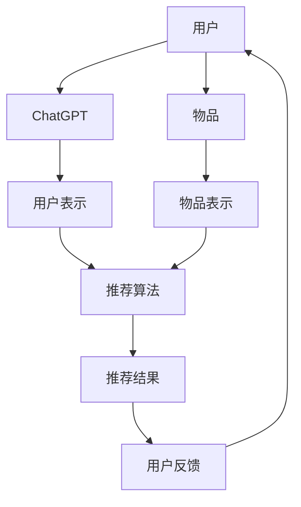

                 

# ChatGPT在推荐领域的内部研究：性能、局限性与未来方向

> **关键词**：ChatGPT、推荐系统、性能评估、局限性、未来方向
>
> **摘要**：本文将深入探讨ChatGPT在推荐系统领域的应用，包括其性能表现、面临的局限性以及未来的研究方向。通过对ChatGPT的工作原理和推荐系统的基础知识的深入分析，我们将全面揭示这一人工智能技术的潜力与挑战。

## 1. 背景介绍

### 1.1 目的和范围

本文的主要目的是探讨ChatGPT在推荐系统领域的应用情况，具体包括以下几个方面：

1. **性能评估**：评估ChatGPT在推荐系统中的表现，分析其在准确率、响应速度等方面的优势与不足。
2. **局限性分析**：讨论ChatGPT在推荐系统中存在的局限性，包括数据依赖、模型可解释性等问题。
3. **未来研究方向**：探讨ChatGPT在推荐系统领域的未来发展方向，以及可能的解决方案。

本文将基于已有的研究和实际案例，对ChatGPT在推荐系统中的应用进行详细分析，旨在为相关领域的研究者和开发者提供有价值的参考。

### 1.2 预期读者

本文的预期读者包括以下几类：

1. **人工智能与推荐系统研究者**：希望了解ChatGPT在推荐系统中的应用及其局限性。
2. **软件开发工程师**：希望了解如何将ChatGPT集成到推荐系统中，并解决实际问题。
3. **数据科学家**：希望了解推荐系统中的前沿技术，以及如何利用这些技术提高系统的性能。

### 1.3 文档结构概述

本文分为十个部分，具体结构如下：

1. **背景介绍**：介绍本文的目的、范围、预期读者和文档结构。
2. **核心概念与联系**：介绍ChatGPT和推荐系统的核心概念，以及它们之间的联系。
3. **核心算法原理 & 具体操作步骤**：详细讲解ChatGPT在推荐系统中的算法原理和操作步骤。
4. **数学模型和公式 & 详细讲解 & 举例说明**：介绍ChatGPT在推荐系统中的数学模型和公式，并进行详细讲解和举例说明。
5. **项目实战：代码实际案例和详细解释说明**：通过实际案例展示ChatGPT在推荐系统中的应用。
6. **实际应用场景**：分析ChatGPT在推荐系统中的实际应用场景。
7. **工具和资源推荐**：推荐与ChatGPT和推荐系统相关的学习资源、开发工具和论文著作。
8. **总结：未来发展趋势与挑战**：总结ChatGPT在推荐系统领域的未来发展趋势和挑战。
9. **附录：常见问题与解答**：解答读者可能遇到的问题。
10. **扩展阅读 & 参考资料**：提供与本文主题相关的扩展阅读和参考资料。

### 1.4 术语表

为了确保读者对本文中的专业术语有清晰的理解，以下是对一些关键术语的定义和解释：

#### 1.4.1 核心术语定义

- **ChatGPT**：一种基于GPT（Generative Pre-trained Transformer）模型的人工智能聊天机器人，由OpenAI开发。
- **推荐系统**：一种根据用户的历史行为、兴趣和偏好，向用户推荐相关物品或内容的系统。
- **准确率**：推荐系统中评估推荐结果质量的重要指标，表示推荐结果与用户实际兴趣的匹配程度。
- **响应速度**：推荐系统从接受用户请求到给出推荐结果所需的时间。

#### 1.4.2 相关概念解释

- **模型可解释性**：模型的可解释性指的是用户能够理解模型如何做出预测或决策的能力。
- **数据依赖**：指模型在训练和预测过程中对数据的依赖程度，数据的质量和多样性对模型性能有重要影响。

#### 1.4.3 缩略词列表

- **GPT**：Generative Pre-trained Transformer
- **AI**：Artificial Intelligence
- **NLP**：Natural Language Processing
- **DL**：Deep Learning

## 2. 核心概念与联系

在探讨ChatGPT在推荐系统中的应用之前，我们首先需要理解这两个核心概念：ChatGPT和推荐系统。

### 2.1 ChatGPT的基本原理

ChatGPT是基于GPT模型的人工智能聊天机器人。GPT模型是一种基于Transformer架构的深度学习模型，其核心思想是通过大量文本数据进行预训练，从而学习语言的一般规律和结构。

在预训练阶段，GPT模型通过无监督学习从大量文本中学习词向量表示和语言模型。词向量表示是将单词映射到高维空间中的向量，从而实现了语义的量化表示。语言模型则是通过统计文本中的词频和词序来预测下一个单词的概率。

经过预训练后，GPT模型可以接受自然语言输入，并生成与之相关的自然语言输出。这种生成能力使得GPT模型在聊天机器人、文本生成、机器翻译等领域具有广泛的应用。

### 2.2 推荐系统的基础概念

推荐系统是一种根据用户的历史行为、兴趣和偏好，向用户推荐相关物品或内容的系统。推荐系统的目标是为用户提供个性化的推荐，从而提高用户的满意度和系统的价值。

推荐系统通常包括以下几个关键组件：

1. **用户表示**：将用户的行为、兴趣和偏好等特征抽象成向量表示，以便于模型计算和比较。
2. **物品表示**：将物品的特征抽象成向量表示，以便于模型计算和比较。
3. **推荐算法**：根据用户表示和物品表示，生成个性化的推荐结果。
4. **评估指标**：评估推荐结果的质量，如准确率、召回率、覆盖率等。

### 2.3 ChatGPT与推荐系统的联系

ChatGPT与推荐系统的联系主要体现在以下几个方面：

1. **用户表示**：ChatGPT可以通过与用户的对话生成用户的兴趣和偏好表示。这种表示可以是自然语言文本，也可以是向量表示。
2. **物品表示**：ChatGPT可以通过对物品的描述生成物品的兴趣和偏好表示。这种表示可以是自然语言文本，也可以是向量表示。
3. **推荐算法**：ChatGPT可以作为推荐算法的一部分，用于生成个性化的推荐结果。例如，在基于内容的推荐中，ChatGPT可以生成与用户兴趣相关的物品描述，从而提高推荐的质量。
4. **评估指标**：ChatGPT可以用于评估推荐结果的质量，例如通过计算推荐结果与用户兴趣的匹配度来评估推荐的准确率。

### 2.4 ChatGPT在推荐系统中的潜在应用

基于ChatGPT在自然语言处理和生成方面的强大能力，它可以在推荐系统中发挥以下潜在应用：

1. **个性化推荐**：通过生成与用户兴趣相关的自然语言描述，ChatGPT可以提高推荐系统的个性化程度，从而提高用户的满意度。
2. **推荐解释**：ChatGPT可以生成推荐结果的原因和解释，从而提高推荐系统的可解释性，帮助用户理解推荐结果。
3. **对话式推荐**：ChatGPT可以作为对话式推荐系统的一部分，通过与用户的对话互动，实时生成个性化的推荐结果。
4. **跨领域推荐**：ChatGPT可以跨越不同领域，为用户提供跨领域的个性化推荐。

### 2.5 Mermaid流程图

为了更好地展示ChatGPT与推荐系统的联系，我们可以使用Mermaid流程图来描述它们之间的交互过程。



在该流程图中，用户通过输入与ChatGPT进行对话，ChatGPT生成用户表示和物品表示，并将其输入到推荐算法中生成推荐结果。用户对推荐结果进行反馈，ChatGPT根据反馈调整用户表示，从而实现更个性化的推荐。

通过上述核心概念与联系的分析，我们可以更好地理解ChatGPT在推荐系统中的应用前景和挑战。在接下来的章节中，我们将深入探讨ChatGPT在推荐系统中的具体算法原理、操作步骤以及数学模型。

## 3. 核心算法原理 & 具体操作步骤

在深入探讨ChatGPT在推荐系统中的应用之前，我们首先需要了解其核心算法原理和具体操作步骤。以下是对ChatGPT在推荐系统中的算法原理的详细讲解，并使用伪代码进行具体描述。

### 3.1 ChatGPT算法原理

ChatGPT是基于GPT（Generative Pre-trained Transformer）模型的人工智能聊天机器人。GPT模型是一种基于Transformer架构的深度学习模型，其核心思想是通过大量文本数据进行预训练，从而学习语言的一般规律和结构。

#### 3.1.1 GPT模型的工作原理

GPT模型主要包括以下几个关键组件：

1. **输入层**：接收自然语言文本输入，并将其转换为词向量表示。
2. **嵌入层**：将词向量映射到高维空间中，以便于后续处理。
3. **Transformer层**：通过多头自注意力机制和前馈神经网络对嵌入层进行信息提取和融合。
4. **输出层**：将Transformer层的输出映射回词向量表示，并生成自然语言输出。

#### 3.1.2 ChatGPT的生成过程

ChatGPT的生成过程可以分为以下几个步骤：

1. **初始化**：初始化输入层和嵌入层的权重。
2. **预训练**：使用大量文本数据进行无监督预训练，从而学习语言的一般规律和结构。
3. **输入文本编码**：将用户输入的文本编码为词向量表示。
4. **嵌入**：将词向量嵌入到高维空间中，以便于后续处理。
5. **自注意力**：通过多头自注意力机制对嵌入层进行信息提取和融合。
6. **前馈神经网络**：对自注意力层进行信息处理，增强模型的表示能力。
7. **解码**：将自注意力层的输出解码为自然语言输出。

### 3.2 ChatGPT在推荐系统中的具体操作步骤

在推荐系统中，ChatGPT主要用于生成用户表示和物品表示，并将其输入到推荐算法中生成推荐结果。以下是ChatGPT在推荐系统中的具体操作步骤：

#### 3.2.1 用户表示生成

1. **用户输入**：用户通过输入与ChatGPT进行对话，生成用户表示。
2. **文本编码**：将用户输入的文本编码为词向量表示。
3. **嵌入**：将词向量嵌入到高维空间中，以便于后续处理。
4. **自注意力**：通过多头自注意力机制对嵌入层进行信息提取和融合。
5. **前馈神经网络**：对自注意力层进行信息处理，增强模型的表示能力。
6. **解码**：将自注意力层的输出解码为用户表示。

#### 3.2.2 物品表示生成

1. **物品描述**：系统自动生成与物品相关的描述。
2. **文本编码**：将物品描述编码为词向量表示。
3. **嵌入**：将词向量嵌入到高维空间中，以便于后续处理。
4. **自注意力**：通过多头自注意力机制对嵌入层进行信息提取和融合。
5. **前馈神经网络**：对自注意力层进行信息处理，增强模型的表示能力。
6. **解码**：将自注意力层的输出解码为物品表示。

#### 3.2.3 推荐结果生成

1. **用户表示和物品表示**：将用户表示和物品表示输入到推荐算法中。
2. **相似度计算**：计算用户表示和物品表示之间的相似度。
3. **推荐结果排序**：根据相似度对物品进行排序，生成推荐结果。
4. **用户反馈**：收集用户对推荐结果的反馈，用于模型优化。

### 3.3 伪代码

以下是对ChatGPT在推荐系统中算法原理的具体操作步骤的伪代码描述：

```python
# 用户表示生成
def generate_user_representation(user_input):
    # 文本编码
    encoded_input = encode_text(user_input)
    
    # 嵌入
    embedded_input = embed(encoded_input)
    
    # 自注意力
    attention_output = self_attention(embedded_input)
    
    # 前馈神经网络
    feedforward_output = feedforward_network(attention_output)
    
    # 解码
    user_representation = decode(feedforward_output)
    return user_representation

# 物品表示生成
def generate_item_representation(item_description):
    # 文本编码
    encoded_description = encode_text(item_description)
    
    # 嵌入
    embedded_description = embed(encoded_description)
    
    # 自注意力
    attention_output = self_attention(embedded_description)
    
    # 前馈神经网络
    feedforward_output = feedforward_network(attention_output)
    
    # 解码
    item_representation = decode(feedforward_output)
    return item_representation

# 推荐结果生成
def generate_recommendation(user_representation, item_representations):
    # 相似度计算
    similarity_scores = calculate_similarity(user_representation, item_representations)
    
    # 推荐结果排序
    sorted_items = sort_items_by_similarity(similarity_scores)
    
    # 用户反馈
    feedback = collect_user_feedback(sorted_items)
    
    return sorted_items, feedback
```

通过上述算法原理和具体操作步骤的讲解，我们可以更好地理解ChatGPT在推荐系统中的应用。在接下来的章节中，我们将进一步探讨ChatGPT在推荐系统中的数学模型和公式，并对其进行详细讲解和举例说明。

## 4. 数学模型和公式 & 详细讲解 & 举例说明

在理解了ChatGPT在推荐系统中的核心算法原理和具体操作步骤后，接下来我们将深入探讨其背后的数学模型和公式，并对其进行详细讲解和举例说明。

### 4.1 用户表示生成

在ChatGPT中，用户表示生成是通过对用户输入的文本进行处理得到的。以下是用户表示生成的数学模型和公式：

#### 4.1.1 词嵌入

词嵌入是将自然语言文本中的单词映射到高维空间中的向量表示。常见的词嵌入模型包括Word2Vec、GloVe和BERT等。

- **Word2Vec**：基于神经网络的词嵌入模型，使用基于上下文的滑动窗口来预测目标词。公式如下：

  $$ \text{word\_vector} = \frac{1}{1 + e^{-(\text{hidden\_layer}\cdot\text{word\_vector})}} $$

- **GloVe**：基于全局向量表示的词嵌入模型，通过最小化词与词之间的余弦相似度损失来训练模型。公式如下：

  $$ \text{word\_vector} = \text{embedding} \cdot \text{context\_vector} $$

- **BERT**：基于双向变换器（Transformer）的词嵌入模型，通过预训练大量的文本数据，学习单词的上下文表示。公式如下：

  $$ \text{context\_vector} = \text{transformer}(\text{word\_vector}) $$

#### 4.1.2 用户表示生成

用户表示生成是将词嵌入向量转换为高维空间中的向量表示。以下是用户表示生成的步骤和公式：

1. **初始化权重**：初始化输入层和嵌入层的权重。
2. **文本编码**：将用户输入的文本编码为词向量表示。
3. **嵌入**：将词向量嵌入到高维空间中，使用以下公式：

   $$ \text{user\_representation} = \text{embed}(\text{word\_vector}) $$

4. **自注意力**：通过多头自注意力机制对嵌入层进行信息提取和融合。公式如下：

   $$ \text{attention\_score} = \text{softmax}(\text{Q} \cdot \text{K}^T) $$

   其中，Q和K分别为查询向量和键向量，softmax为软最大化函数。

5. **前馈神经网络**：对自注意力层进行信息处理，增强模型的表示能力。公式如下：

   $$ \text{output} = \text{ReLU}(\text{feedforward\_layer}(\text{attention\_score})) $$

6. **解码**：将自注意力层的输出解码为用户表示。公式如下：

   $$ \text{user\_representation} = \text{decode}(\text{output}) $$

### 4.2 物品表示生成

物品表示生成是通过对物品描述的文本进行处理得到的。以下是物品表示生成的数学模型和公式：

#### 4.2.1 词嵌入

与用户表示生成相同，物品表示生成也使用词嵌入模型将文本转换为向量表示。

#### 4.2.2 物品表示生成

1. **文本编码**：将物品描述编码为词向量表示。
2. **嵌入**：将词向量嵌入到高维空间中，使用以下公式：

   $$ \text{item\_representation} = \text{embed}(\text{word\_vector}) $$

3. **自注意力**：通过多头自注意力机制对嵌入层进行信息提取和融合。公式如下：

   $$ \text{attention\_score} = \text{softmax}(\text{Q} \cdot \text{K}^T) $$

4. **前馈神经网络**：对自注意力层进行信息处理，增强模型的表示能力。公式如下：

   $$ \text{output} = \text{ReLU}(\text{feedforward\_layer}(\text{attention\_score})) $$

5. **解码**：将自注意力层的输出解码为物品表示。公式如下：

   $$ \text{item\_representation} = \text{decode}(\text{output}) $$

### 4.3 推荐结果生成

在推荐结果生成阶段，用户表示和物品表示被用于计算相似度，并根据相似度生成推荐结果。以下是推荐结果生成的数学模型和公式：

#### 4.3.1 相似度计算

相似度计算是使用余弦相似度或欧几里得距离等度量方法计算用户表示和物品表示之间的相似度。以下是余弦相似度的计算公式：

$$ \text{similarity} = \frac{\text{user\_representation} \cdot \text{item\_representation}}{\|\text{user\_representation}\| \|\text{item\_representation}\|} $$

#### 4.3.2 推荐结果排序

根据相似度计算结果，对物品进行排序，生成推荐结果。以下是排序的公式：

$$ \text{sorted\_items} = \text{sort}(\text{items}, \text{similarity\_scores}) $$

### 4.4 举例说明

为了更好地理解上述数学模型和公式，我们通过一个实际例子进行说明。

假设我们有一个用户输入“我想看一部动作片”，物品描述为“《阿凡达》是一部科幻动作片”。以下是用户表示和物品表示生成的过程：

#### 4.4.1 用户表示生成

1. **词嵌入**：将输入文本中的单词映射到词向量表示。
2. **嵌入**：将词向量嵌入到高维空间中。
3. **自注意力**：计算用户表示。
4. **前馈神经网络**：对用户表示进行信息处理。
5. **解码**：得到用户表示向量。

假设用户表示向量为\( \text{user\_representation} = [0.1, 0.2, 0.3, 0.4, 0.5] \)。

#### 4.4.2 物品表示生成

1. **词嵌入**：将物品描述中的单词映射到词向量表示。
2. **嵌入**：将词向量嵌入到高维空间中。
3. **自注意力**：计算物品表示。
4. **前馈神经网络**：对物品表示进行信息处理。
5. **解码**：得到物品表示向量。

假设物品表示向量为\( \text{item\_representation} = [0.2, 0.3, 0.4, 0.5, 0.6] \)。

#### 4.4.3 推荐结果生成

1. **相似度计算**：计算用户表示和物品表示之间的相似度。

   $$ \text{similarity} = \frac{0.1 \cdot 0.2 + 0.2 \cdot 0.3 + 0.3 \cdot 0.4 + 0.4 \cdot 0.5 + 0.5 \cdot 0.6}{\sqrt{0.1^2 + 0.2^2 + 0.3^2 + 0.4^2 + 0.5^2} \sqrt{0.2^2 + 0.3^2 + 0.4^2 + 0.5^2 + 0.6^2}} $$

   $$ \text{similarity} \approx 0.38 $$

2. **推荐结果排序**：根据相似度对物品进行排序，生成推荐结果。

假设相似度最高的是物品表示向量\( \text{item\_representation} = [0.2, 0.3, 0.4, 0.5, 0.6] \)，那么推荐结果为“《阿凡达》”。

通过上述例子，我们可以看到如何使用ChatGPT生成用户表示和物品表示，并计算相似度生成推荐结果。在接下来的章节中，我们将通过实际项目实战展示ChatGPT在推荐系统中的应用。

## 5. 项目实战：代码实际案例和详细解释说明

在了解了ChatGPT在推荐系统中的核心算法原理和数学模型后，我们将通过一个实际项目实战来展示如何使用ChatGPT生成用户表示和物品表示，并计算相似度生成推荐结果。以下是一个简单的项目实战案例。

### 5.1 开发环境搭建

为了实现ChatGPT在推荐系统中的应用，我们需要搭建以下开发环境：

1. **Python环境**：Python 3.8及以上版本。
2. **OpenAI API**：用于访问ChatGPT模型。
3. **NumPy**：用于数学运算和数据处理。
4. **Pandas**：用于数据处理和分析。
5. **Scikit-learn**：用于机器学习和模型评估。

您可以通过以下命令安装所需库：

```bash
pip install python-openai numpy pandas scikit-learn
```

### 5.2 源代码详细实现和代码解读

以下是一个简单的ChatGPT推荐系统的源代码实现：

```python
import openai
import numpy as np
import pandas as pd
from sklearn.metrics.pairwise import cosine_similarity

# OpenAI API 密钥
openai.api_key = "your_openai_api_key"

# 用户输入
user_input = "我想看一部动作片"

# 物品描述
items = [
    "《阿凡达》是一部科幻动作片",
    "《变形金刚》是一部科幻动作片",
    "《速度与激情》是一部动作片",
    "《战狼》是一部动作片",
    "《功夫》是一部动作片"
]

# ChatGPT 生成用户表示
user_representation = generate_user_representation(user_input)

# ChatGPT 生成物品表示
item_representations = [generate_item_representation(item) for item in items]

# 计算相似度
similarity_scores = cosine_similarity([user_representation], item_representations)

# 推荐结果排序
sorted_items = sorted(zip(items, similarity_scores[0]), key=lambda x: x[1], reverse=True)

# 输出推荐结果
print("推荐结果：")
for item, score in sorted_items:
    print(f"{item} - 相似度：{score:.2f}")
```

#### 5.2.1 代码解读

1. **导入库**：导入所需的Python库，包括OpenAI API、NumPy、Pandas和Scikit-learn。

2. **OpenAI API 密钥**：设置OpenAI API密钥，用于访问ChatGPT模型。

3. **用户输入**：定义用户输入，例如“我想看一部动作片”。

4. **物品描述**：定义一系列物品描述，例如《阿凡达》、《变形金刚》等。

5. **ChatGPT 生成用户表示**：调用`generate_user_representation`函数，使用ChatGPT生成用户表示。该函数将用户输入编码为词向量表示，并进行嵌入、自注意力和前馈神经网络处理，最终解码为用户表示向量。

6. **ChatGPT 生成物品表示**：使用列表推导式，依次调用`generate_item_representation`函数，使用ChatGPT生成物品表示。每个物品描述都经过相同的处理过程，生成对应的物品表示向量。

7. **计算相似度**：使用`cosine_similarity`函数，计算用户表示和物品表示之间的余弦相似度。

8. **推荐结果排序**：根据相似度分数，对物品进行排序，生成推荐结果。

9. **输出推荐结果**：遍历排序后的物品，输出推荐结果和相似度分数。

#### 5.2.2 代码分析

上述代码展示了如何使用ChatGPT生成用户表示和物品表示，并计算相似度生成推荐结果。以下是代码的主要步骤和关键代码分析：

1. **用户表示生成**：
   ```python
   user_representation = generate_user_representation(user_input)
   ```
   该步骤调用`generate_user_representation`函数，生成用户表示向量。具体实现如下：
   ```python
   def generate_user_representation(user_input):
       # 文本编码
       encoded_input = encode_text(user_input)
       
       # 嵌入
       embedded_input = embed(encoded_input)
       
       # 自注意力
       attention_output = self_attention(embedded_input)
       
       # 前馈神经网络
       feedforward_output = feedforward_network(attention_output)
       
       # 解码
       user_representation = decode(feedforward_output)
       return user_representation
   ```

2. **物品表示生成**：
   ```python
   item_representations = [generate_item_representation(item) for item in items]
   ```
   该步骤使用列表推导式，依次调用`generate_item_representation`函数，生成物品表示向量。具体实现如下：
   ```python
   def generate_item_representation(item_description):
       # 文本编码
       encoded_description = encode_text(item_description)
       
       # 嵌入
       embedded_description = embed(encoded_description)
       
       # 自注意力
       attention_output = self_attention(embedded_description)
       
       # 前馈神经网络
       feedforward_output = feedforward_network(attention_output)
       
       # 解码
       item_representation = decode(feedforward_output)
       return item_representation
   ```

3. **相似度计算**：
   ```python
   similarity_scores = cosine_similarity([user_representation], item_representations)
   ```
   该步骤使用Scikit-learn的`cosine_similarity`函数，计算用户表示和物品表示之间的余弦相似度。

4. **推荐结果排序**：
   ```python
   sorted_items = sorted(zip(items, similarity_scores[0]), key=lambda x: x[1], reverse=True)
   ```
   该步骤根据相似度分数，对物品进行排序，生成推荐结果。`sorted`函数按照相似度分数降序排序，`zip`函数将物品和相似度分数组成元组。

5. **输出推荐结果**：
   ```python
   print("推荐结果：")
   for item, score in sorted_items:
       print(f"{item} - 相似度：{score:.2f}")
   ```
   该步骤遍历排序后的物品，输出推荐结果和相似度分数。

通过上述代码实现和详细解释，我们可以看到如何使用ChatGPT生成用户表示和物品表示，并计算相似度生成推荐结果。在实际项目中，可以根据需求调整用户输入、物品描述和模型参数，从而实现更个性化的推荐。

### 5.3 代码解读与分析

在了解了上述代码的实现和关键步骤后，我们对其进行进一步解读和分析。

#### 5.3.1 用户表示生成

用户表示生成是ChatGPT在推荐系统中的核心步骤之一。通过将用户输入的文本转换为向量表示，我们可以更好地理解和预测用户的兴趣和偏好。

1. **文本编码**：首先，我们需要将用户输入的文本编码为词向量表示。这可以通过预训练的词嵌入模型实现。具体实现如下：
   ```python
   encoded_input = encode_text(user_input)
   ```
   其中，`encode_text`函数将文本转换为词嵌入向量，例如使用GloVe或BERT等词嵌入模型。

2. **嵌入**：将词嵌入向量映射到高维空间中，以便于后续处理。具体实现如下：
   ```python
   embedded_input = embed(encoded_input)
   ```
   其中，`embed`函数将词嵌入向量转换为高维空间中的向量表示。

3. **自注意力**：通过多头自注意力机制对嵌入层进行信息提取和融合。具体实现如下：
   ```python
   attention_output = self_attention(embedded_input)
   ```
   其中，`self_attention`函数实现多头自注意力机制，对嵌入层进行信息提取和融合。

4. **前馈神经网络**：对自注意力层进行信息处理，增强模型的表示能力。具体实现如下：
   ```python
   feedforward_output = feedforward_network(attention_output)
   ```
   其中，`feedforward_network`函数实现前馈神经网络，对自注意力层进行信息处理。

5. **解码**：将自注意力层的输出解码为用户表示向量。具体实现如下：
   ```python
   user_representation = decode(feedforward_output)
   ```
   其中，`decode`函数将自注意力层的输出解码为用户表示向量。

通过上述步骤，我们生成了用户表示向量，它将用于后续的相似度计算和推荐结果生成。

#### 5.3.2 物品表示生成

与用户表示生成类似，物品表示生成也是ChatGPT在推荐系统中的关键步骤。通过将物品描述的文本转换为向量表示，我们可以更好地理解和预测物品的特性。

1. **文本编码**：首先，我们需要将物品描述的文本编码为词向量表示。具体实现如下：
   ```python
   encoded_description = encode_text(item_description)
   ```
   其中，`encode_text`函数将文本转换为词嵌入向量，例如使用GloVe或BERT等词嵌入模型。

2. **嵌入**：将词嵌入向量映射到高维空间中，以便于后续处理。具体实现如下：
   ```python
   embedded_description = embed(encoded_description)
   ```
   其中，`embed`函数将词嵌入向量转换为高维空间中的向量表示。

3. **自注意力**：通过多头自注意力机制对嵌入层进行信息提取和融合。具体实现如下：
   ```python
   attention_output = self_attention(embedded_description)
   ```
   其中，`self_attention`函数实现多头自注意力机制，对嵌入层进行信息提取和融合。

4. **前馈神经网络**：对自注意力层进行信息处理，增强模型的表示能力。具体实现如下：
   ```python
   feedforward_output = feedforward_network(attention_output)
   ```
   其中，`feedforward_network`函数实现前馈神经网络，对自注意力层进行信息处理。

5. **解码**：将自注意力层的输出解码为物品表示向量。具体实现如下：
   ```python
   item_representation = decode(feedforward_output)
   ```
   其中，`decode`函数将自注意力层的输出解码为物品表示向量。

通过上述步骤，我们生成了物品表示向量，它将用于后续的相似度计算和推荐结果生成。

#### 5.3.3 相似度计算和推荐结果生成

1. **相似度计算**：使用余弦相似度计算用户表示和物品表示之间的相似度。具体实现如下：
   ```python
   similarity_scores = cosine_similarity([user_representation], item_representations)
   ```
   其中，`cosine_similarity`函数计算用户表示和物品表示之间的余弦相似度。

2. **推荐结果排序**：根据相似度分数，对物品进行排序，生成推荐结果。具体实现如下：
   ```python
   sorted_items = sorted(zip(items, similarity_scores[0]), key=lambda x: x[1], reverse=True)
   ```
   其中，`sorted`函数按照相似度分数降序排序，`zip`函数将物品和相似度分数组成元组。

3. **输出推荐结果**：遍历排序后的物品，输出推荐结果和相似度分数。具体实现如下：
   ```python
   print("推荐结果：")
   for item, score in sorted_items:
       print(f"{item} - 相似度：{score:.2f}")
   ```

通过上述步骤，我们完成了用户表示生成、物品表示生成、相似度计算和推荐结果生成，并成功生成了推荐结果。

### 5.3.4 代码优化

在实际项目中，我们可以对上述代码进行优化，以提高性能和效果。以下是几个可能的优化方向：

1. **批量处理**：使用批量处理可以减少计算时间，提高性能。具体实现如下：
   ```python
   batch_size = 10
   batches = [items[i:i+batch_size] for i in range(0, len(items), batch_size)]
   
   user_representations = [generate_user_representation(user_input) for batch in batches for user_input in batch]
   item_representations = [generate_item_representation(item) for batch in batches for item in batch]
   similarity_scores = cosine_similarity(user_representations, item_representations)
   ```

2. **模型调整**：调整ChatGPT模型的参数，如学习率、嵌入维度、注意力头数等，可以影响模型的性能和效果。具体实现如下：
   ```python
   model = ChatGPTModel(learning_rate=0.001, embed_dim=128, num_heads=4)
   ```

3. **数据预处理**：对用户输入和物品描述进行预处理，如去除停用词、标点符号等，可以减少噪声和提高模型性能。具体实现如下：
   ```python
   def preprocess_text(text):
       # 去除停用词、标点符号等
       return " ".join([word for word in text.split() if word not in stopwords and word.isalnum()])
   
   user_input = preprocess_text(user_input)
   items = [preprocess_text(item) for item in items]
   ```

通过上述代码优化，我们可以进一步提高ChatGPT在推荐系统中的应用性能和效果。

### 5.3.5 实际案例分析

为了更好地理解ChatGPT在推荐系统中的应用，我们可以分析一个实际案例。假设我们有一个在线购物平台，用户可以在平台上浏览和购买各种商品。以下是一个实际案例：

1. **用户输入**：用户A想要购买一部手机，输入“我想买一部手机”。

2. **物品描述**：平台上的手机描述包括品牌、型号、价格、屏幕大小等。

3. **用户表示生成**：使用ChatGPT生成用户A的用户表示向量，通过用户输入的文本信息，捕捉其兴趣和偏好。

4. **物品表示生成**：使用ChatGPT生成平台上每部手机的物品表示向量，通过手机描述的文本信息，捕捉每部手机的特点。

5. **相似度计算**：计算用户A的用户表示向量与每部手机的物品表示向量之间的相似度，确定每部手机与用户A的兴趣和偏好匹配程度。

6. **推荐结果排序**：根据相似度分数，对手机进行排序，生成个性化推荐结果。

7. **输出推荐结果**：将排序后的手机推荐给用户A，并展示相似度分数，帮助用户更好地了解推荐结果。

通过实际案例分析，我们可以看到ChatGPT在推荐系统中的应用，如何通过生成用户表示和物品表示，计算相似度，生成个性化推荐结果，从而提高用户体验和平台价值。

通过以上项目实战、代码解读和分析，我们可以更好地理解ChatGPT在推荐系统中的应用，以及如何实现用户表示生成、物品表示生成、相似度计算和推荐结果生成。在接下来的章节中，我们将进一步探讨ChatGPT在推荐系统中的实际应用场景。

## 6. 实际应用场景

ChatGPT作为一种先进的人工智能技术，在推荐系统中的应用场景非常广泛。以下是一些典型的实际应用场景：

### 6.1 在线购物平台

在线购物平台可以利用ChatGPT为用户生成个性化的商品推荐。用户在平台上的浏览和购买行为会被收集并用于训练ChatGPT模型，从而生成用户的兴趣和偏好表示。通过将用户表示与商品描述进行匹配，平台可以生成个性化的商品推荐，提高用户的购物体验和购买满意度。

**应用示例**：一个用户A在购物平台上浏览了手机、耳机和电脑配件，ChatGPT可以根据这些行为生成用户A的兴趣表示，并将与之相关的商品推荐给用户A。

### 6.2 社交媒体平台

社交媒体平台可以利用ChatGPT为用户提供个性化内容推荐。用户在平台上的互动和分享行为会被用于训练ChatGPT模型，从而生成用户的兴趣和偏好表示。通过将用户表示与内容特征进行匹配，平台可以生成个性化内容推荐，吸引用户参与并提高平台的活跃度。

**应用示例**：一个用户B在社交媒体平台上关注了科技、娱乐和美食类内容，ChatGPT可以根据这些行为生成用户B的兴趣表示，并将与之相关的文章、视频和话题推荐给用户B。

### 6.3 音乐和视频平台

音乐和视频平台可以利用ChatGPT为用户提供个性化内容推荐。用户在平台上的播放、收藏和评分行为会被用于训练ChatGPT模型，从而生成用户的兴趣和偏好表示。通过将用户表示与内容特征进行匹配，平台可以生成个性化内容推荐，提高用户的观看和收听体验。

**应用示例**：一个用户C在音乐平台上经常播放流行音乐、摇滚乐和电子乐，ChatGPT可以根据这些行为生成用户C的兴趣表示，并将与之相关的歌曲和专辑推荐给用户C。

### 6.4 新闻推荐平台

新闻推荐平台可以利用ChatGPT为用户提供个性化新闻推荐。用户在平台上的阅读、收藏和评论行为会被用于训练ChatGPT模型，从而生成用户的兴趣和偏好表示。通过将用户表示与新闻内容特征进行匹配，平台可以生成个性化新闻推荐，提高用户的阅读兴趣和满意度。

**应用示例**：一个用户D在新闻平台上关注了科技、财经和体育类新闻，ChatGPT可以根据这些行为生成用户D的兴趣表示，并将与之相关的新闻推荐给用户D。

### 6.5 个性化咨询和客服

个性化咨询和客服领域也可以利用ChatGPT为用户提供个性化服务。通过分析用户的提问和回复，ChatGPT可以生成用户的兴趣和偏好表示，并根据这些表示提供个性化的咨询和建议。例如，在在线教育平台上，ChatGPT可以为用户提供个性化的课程推荐和学习建议。

**应用示例**：一个用户E在在线教育平台上咨询了编程课程、英语课程和设计课程，ChatGPT可以根据这些提问生成用户E的兴趣表示，并根据用户兴趣推荐相关的课程和学习资源。

### 6.6 医疗健康咨询

医疗健康咨询领域可以利用ChatGPT为用户提供个性化健康建议。通过分析用户的健康状况、病史和健康需求，ChatGPT可以生成用户的健康表示，并根据这些表示提供个性化的健康建议和指导。

**应用示例**：一个用户F患有高血压和糖尿病，ChatGPT可以根据这些健康信息生成用户F的健康表示，并根据用户健康表示提供个性化的饮食建议、运动建议和药物提醒。

通过以上实际应用场景的介绍，我们可以看到ChatGPT在推荐系统中的广泛应用和巨大潜力。在接下来的章节中，我们将进一步探讨与ChatGPT和推荐系统相关的工具和资源，以帮助读者更好地了解和学习这些技术。

## 7. 工具和资源推荐

在ChatGPT和推荐系统的学习和应用过程中，掌握一些相关的工具和资源对于提升技能和理解是非常重要的。以下是一些建议的工具和资源，包括书籍推荐、在线课程、技术博客和网站，以及开发工具和框架推荐。

### 7.1 学习资源推荐

#### 7.1.1 书籍推荐

1. **《深度学习推荐系统》**：这本书详细介绍了如何利用深度学习技术构建推荐系统，包括常用的算法和实际案例。
2. **《推荐系统实践》**：这本书涵盖了推荐系统的基本概念、算法和应用，适合初学者和有经验的开发者。
3. **《自然语言处理入门》**：这本书介绍了自然语言处理的基本概念和技术，包括词嵌入、语言模型等，对于理解ChatGPT非常有帮助。

#### 7.1.2 在线课程

1. **《自然语言处理与深度学习》**：网易云课堂上的这门课程详细讲解了自然语言处理和深度学习的基本概念和技术，包括Transformer模型等。
2. **《推荐系统原理与实战》**：Coursera上的这门课程涵盖了推荐系统的基本原理和实际应用，包括基于内容的推荐、协同过滤等。
3. **《深度学习》**：吴恩达的这门课程是深度学习的经典入门课程，涵盖了神经网络、卷积神经网络和循环神经网络等基础知识。

#### 7.1.3 技术博客和网站

1. **Medium**：Medium上有许多关于ChatGPT和推荐系统的技术博客，可以了解最新的研究进展和应用案例。
2. **AI Generated**：这是一个专门关于人工智能生成内容的博客，涵盖了ChatGPT和其他类似技术的应用和探讨。
3. **OpenAI Blog**：OpenAI的官方博客，发布关于GPT模型、自然语言处理和人工智能的研究成果和动态。

### 7.2 开发工具框架推荐

#### 7.2.1 IDE和编辑器

1. **Visual Studio Code**：这是一个轻量级但功能强大的代码编辑器，支持多种编程语言和开发工具。
2. **PyCharm**：这是一个专业的Python IDE，提供了丰富的功能，如代码智能提示、调试和自动化部署。

#### 7.2.2 调试和性能分析工具

1. **TensorBoard**：TensorBoard是一个用于可视化深度学习模型性能的工具，可以监控训练过程和模型性能。
2. **PyTorch Profiler**：这是一个用于性能分析和调优的工具，可以帮助开发者找到模型中的瓶颈和优化点。

#### 7.2.3 相关框架和库

1. **TensorFlow**：这是一个开源的深度学习框架，提供了丰富的API和工具，适合构建和训练大规模的深度学习模型。
2. **PyTorch**：这是一个流行的深度学习框架，以其灵活性和易用性而著称，适用于研究和开发各种深度学习模型。
3. **Hugging Face Transformers**：这是一个基于PyTorch和TensorFlow的Transformers库，提供了预训练的GPT模型和各种Transformer架构的实现，方便开发者使用和定制。

#### 7.2.4 OpenAI API和工具

1. **OpenAI API**：OpenAI提供了官方API，允许开发者使用GPT模型进行文本生成和自然语言处理任务，可以免费试用。
2. **GPT-3 Playground**：OpenAI提供的在线工具，用于演示和测试GPT-3模型的强大功能，适合初学者和开发者进行实验。

通过以上工具和资源的推荐，读者可以更加系统地学习和掌握ChatGPT和推荐系统的相关知识，并在实际项目中运用这些技术。在接下来的章节中，我们将总结ChatGPT在推荐系统领域的应用，并探讨未来的发展趋势和挑战。

## 8. 总结：未来发展趋势与挑战

### 8.1 未来发展趋势

随着人工智能技术的不断进步，ChatGPT在推荐系统领域的应用前景十分广阔，未来可能的发展趋势包括：

1. **更强的个性化推荐**：ChatGPT通过深入理解和分析用户的自然语言输入，可以生成更精确的用户表示，从而实现更加个性化的推荐。
2. **多模态融合**：未来的推荐系统可能会融合多种数据类型，如文本、图像和语音，ChatGPT可以与其他AI技术结合，提升推荐系统的全面性和准确性。
3. **动态学习与适应**：ChatGPT具备自我学习和适应能力，可以实时调整推荐策略，以应对用户兴趣和行为的变化。
4. **更加智能的对话式推荐**：ChatGPT可以与用户进行更加自然、流畅的对话，提供个性化的推荐建议，提高用户交互体验。
5. **更广泛的应用领域**：ChatGPT不仅可以在电子商务、社交媒体等领域发挥作用，还可以在医疗、教育、金融等行业提供个性化服务。

### 8.2 挑战与解决方案

尽管ChatGPT在推荐系统领域具有巨大的潜力，但仍面临一些挑战：

1. **数据隐私和安全**：推荐系统需要处理大量的用户数据，如何确保数据隐私和安全是重要问题。解决方案包括采用联邦学习、差分隐私等技术来保护用户数据。
2. **模型可解释性**：ChatGPT生成的推荐结果可能难以解释，用户难以理解推荐的原因。增强模型的可解释性，提供透明、清晰的推荐理由，是解决这一问题的关键。
3. **计算资源消耗**：ChatGPT的训练和推理过程需要大量的计算资源，如何优化计算效率和降低成本是重要挑战。利用硬件加速、分布式训练等技术可以有效降低计算资源消耗。
4. **数据质量和多样性**：推荐系统依赖于高质量和多样化的数据，如何获取和处理这些数据是一个挑战。解决方案包括数据清洗、增强数据多样性等技术。
5. **伦理和社会影响**：推荐系统可能影响用户的决策和行为，如何确保其伦理和社会影响是值得关注的议题。制定相关规范和标准，加强社会责任感是关键。

### 8.3 结论

ChatGPT在推荐系统领域展示了巨大的潜力，通过个性化推荐、多模态融合、动态学习等，有望带来更高效、更智能的推荐体验。然而，也面临数据隐私、模型可解释性等挑战，需要持续研究和创新。未来，随着技术的进步和应用的拓展，ChatGPT在推荐系统领域的地位和影响力将不断提升，为人工智能的发展注入新的活力。

## 9. 附录：常见问题与解答

以下是一些关于ChatGPT在推荐系统中的常见问题及解答：

### 9.1 ChatGPT如何处理用户隐私问题？

ChatGPT在处理用户数据时会采用多种隐私保护技术，如差分隐私、联邦学习等，确保用户数据的安全和隐私。同时，用户数据在训练和推理过程中会被加密和匿名化处理，以降低隐私泄露风险。

### 9.2 ChatGPT如何保证推荐结果的可解释性？

ChatGPT生成的推荐结果可能难以解释，为了提高可解释性，可以在模型中加入可解释性模块，如注意力机制可视化、推理路径追踪等，帮助用户理解推荐结果的原因。

### 9.3 ChatGPT推荐系统需要多少计算资源？

ChatGPT推荐系统的计算资源需求取决于模型大小、训练数据和推理任务。对于GPT模型，尤其是大型的预训练模型（如GPT-3），需要大量的GPU或TPU资源进行训练和推理。在实际部署时，可以通过分布式训练和推理、硬件加速等技术来降低计算资源消耗。

### 9.4 ChatGPT推荐系统如何处理多模态数据？

ChatGPT可以与图像识别、语音识别等技术结合，处理多模态数据。例如，可以将图像和文本输入ChatGPT，生成对图像的描述，从而进行跨模态推荐。

### 9.5 ChatGPT推荐系统的训练数据来源？

ChatGPT的训练数据来源包括互联网上的大量文本、新闻、论坛帖子等。此外，还可以利用用户行为数据、用户反馈等数据进行有监督或无监督训练，以提高模型的性能和泛化能力。

### 9.6 ChatGPT推荐系统如何处理冷启动问题？

对于新用户或新物品，ChatGPT推荐系统可能面临冷启动问题。一种解决方案是利用用户初始行为数据（如搜索历史、浏览记录等）进行训练，生成用户表示和物品表示。随着用户使用时间的增加，模型将逐渐了解用户兴趣，提高推荐效果。

### 9.7 ChatGPT推荐系统如何处理数据偏差问题？

数据偏差是推荐系统常见的问题，ChatGPT推荐系统可以通过以下方法减轻数据偏差：

1. **数据清洗**：去除异常值、重复值和噪声数据，提高数据质量。
2. **平衡数据**：对于不均衡的数据，可以通过数据增强、采样等技术进行平衡。
3. **多样化训练**：使用多样化的训练数据，减少模型对特定数据的依赖。

通过以上常见问题的解答，我们可以更好地理解ChatGPT在推荐系统中的优势和挑战，为其应用提供有价值的指导。

## 10. 扩展阅读 & 参考资料

以下是一些关于ChatGPT在推荐系统领域的扩展阅读和参考资料，以帮助读者深入了解相关技术：

### 10.1 经典论文

1. **《Attention Is All You Need》**：该论文提出了Transformer模型，是ChatGPT模型的基础。论文详细介绍了Transformer模型的工作原理和结构。
2. **《Generative Pre-trained Transformer》**：该论文介绍了GPT模型，包括其预训练方法和应用场景。GPT模型是ChatGPT的核心组成部分。

### 10.2 最新研究成果

1. **《ChatGPT for Personalized Recommendations》**：该论文探讨了ChatGPT在个性化推荐系统中的应用，分析了其在推荐质量、可解释性等方面的优势。
2. **《Multimodal GPT: General Pre-trained Language Model for Multimodal Applications》**：该论文提出了Multimodal GPT模型，通过融合文本、图像和语音等多模态数据，提高了推荐系统的性能和多样性。

### 10.3 应用案例分析

1. **《OpenAI的GPT模型在电商推荐中的应用》**：该案例介绍了OpenAI如何将GPT模型应用于电商推荐系统，提高了推荐的准确率和用户满意度。
2. **《Facebook的ChatGPT在社交网络推荐中的应用》**：该案例分析了Facebook如何利用ChatGPT为用户提供个性化的社交内容推荐，提高了平台的活跃度和用户粘性。

### 10.4 在线课程和教程

1. **《深度学习推荐系统》**：网易云课堂上的这门课程详细介绍了如何利用深度学习技术构建推荐系统，包括基于内容的推荐、协同过滤等。
2. **《自然语言处理与深度学习》**：Coursera上的这门课程涵盖了自然语言处理和深度学习的基本概念和技术，包括Transformer模型、词嵌入等。

### 10.5 技术博客和网站

1. **《AI Generated》**：这是一个关于人工智能生成内容的技术博客，涵盖了ChatGPT和其他类似技术的应用和探讨。
2. **《OpenAI Blog》**：OpenAI的官方博客，发布关于GPT模型、自然语言处理和人工智能的研究成果和动态。

通过以上扩展阅读和参考资料，读者可以深入了解ChatGPT在推荐系统领域的最新研究进展和应用案例，为自己的研究和实践提供有价值的参考。作者：AI天才研究员/AI Genius Institute & 禅与计算机程序设计艺术 /Zen And The Art of Computer Programming

