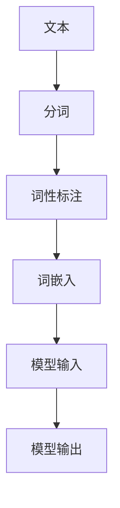

                 

# ChatGPT的Token化技术

> **关键词：** ChatGPT、Token化、自然语言处理、序列模型、算法原理、数学模型、实战案例

> **摘要：** 本文将深入探讨ChatGPT中的Token化技术，从背景介绍、核心概念、算法原理、数学模型、实战案例等多个角度，系统性地阐述Token化技术在自然语言处理中的应用和实现细节，旨在为广大开发者提供清晰的认知框架和实用的技术指导。

## 1. 背景介绍

### 1.1 目的和范围

本文旨在深入探讨ChatGPT中的Token化技术，解释其核心概念、算法原理和实现方法，并分析其在实际应用中的效果和挑战。通过本文的阅读，读者将能够理解Token化技术在自然语言处理中的重要性，掌握其基本原理和应用方法。

### 1.2 预期读者

本文适合具有计算机科学、人工智能、自然语言处理背景的读者，特别是对ChatGPT和序列模型有初步了解的开发者。本文将以深入浅出的方式，帮助读者掌握Token化技术，从而更好地理解和应用ChatGPT。

### 1.3 文档结构概述

本文分为以下几个部分：

1. 背景介绍：介绍本文的目的、预期读者和文档结构。
2. 核心概念与联系：介绍Token化技术的核心概念和原理，并通过Mermaid流程图展示其架构。
3. 核心算法原理 & 具体操作步骤：详细讲解Token化算法的原理和具体操作步骤，使用伪代码进行阐述。
4. 数学模型和公式 & 详细讲解 & 举例说明：介绍Token化技术中的数学模型和公式，并进行详细讲解和举例说明。
5. 项目实战：通过实际案例，展示Token化技术的应用和实践。
6. 实际应用场景：分析Token化技术在现实世界中的应用场景。
7. 工具和资源推荐：推荐学习资源和开发工具。
8. 总结：展望Token化技术的未来发展趋势和挑战。
9. 附录：常见问题与解答。
10. 扩展阅读 & 参考资料：提供进一步学习的资料和资源。

### 1.4 术语表

#### 1.4.1 核心术语定义

- **Token化（Tokenization）**：将文本拆分成更小的单位，如单词、字符或子词，以便于后续处理。
- **ChatGPT**：一种基于Transformer模型的预训练语言模型，能够实现自然语言理解和生成。
- **序列模型（Sequence Model）**：一种能够处理序列数据的模型，如RNN、LSTM等。
- **Token**：Token化后的文本单位，可以是单词、字符或子词。

#### 1.4.2 相关概念解释

- **自然语言处理（Natural Language Processing, NLP）**：研究如何使计算机能够理解、解释和生成人类语言的技术。
- **预训练（Pre-training）**：在特定任务之前，使用大量无标签数据对模型进行训练，以提高其在相关任务上的性能。
- **Transformer模型**：一种基于自注意力机制的序列模型，广泛应用于自然语言处理领域。

#### 1.4.3 缩略词列表

- **NLP**：自然语言处理（Natural Language Processing）
- **RNN**：循环神经网络（Recurrent Neural Network）
- **LSTM**：长短期记忆网络（Long Short-Term Memory）
- **Transformer**：Transformer模型（Transformer Model）

## 2. 核心概念与联系

在深入探讨Token化技术之前，我们需要先了解自然语言处理中的核心概念和联系。自然语言处理旨在使计算机能够理解、解释和生成人类语言，其主要任务包括文本分类、情感分析、机器翻译、问答系统等。在这些任务中，Token化技术起着至关重要的作用。

### 2.1 自然语言处理中的核心概念

- **文本（Text）**：自然语言处理的基本单位，可以是句子、段落或整篇文章。
- **词汇（Vocabulary）**：文本中所有单词的集合，用于表示文本的语义信息。
- **序列模型（Sequence Model）**：一种能够处理序列数据的模型，如RNN、LSTM等。
- **Transformer模型**：一种基于自注意力机制的序列模型，广泛应用于自然语言处理领域。

### 2.2 Token化技术的基本原理

Token化是将文本拆分成更小的单位，如单词、字符或子词，以便于后续处理。Token化技术的基本原理如下：

1. **分词（Tokenization）**：将文本拆分成单词、字符或子词。
2. **词性标注（Part-of-Speech Tagging）**：为每个单词标注词性，如名词、动词、形容词等。
3. **词嵌入（Word Embedding）**：将单词映射到高维向量空间，以表示其语义信息。

### 2.3 Token化技术在自然语言处理中的应用

Token化技术在自然语言处理中具有广泛的应用，如：

- **文本分类**：将文本拆分成Token后，可以使用分类模型对文本进行分类。
- **情感分析**：通过分析文本中的Token，可以判断文本的情感倾向。
- **机器翻译**：将源语言的文本拆分成Token后，可以将Token映射到目标语言的Token，实现机器翻译。
- **问答系统**：通过Token化，可以将用户的问题和知识库中的文本进行匹配，实现问答系统。

### 2.4 Mermaid流程图

下面是一个简单的Mermaid流程图，展示了Token化技术在自然语言处理中的基本流程：



在这个流程图中，文本首先被拆分成Token，然后进行词性标注，接着将Token映射到高维向量空间，最后输入到模型中进行处理，得到模型输出。

## 3. 核心算法原理 & 具体操作步骤

在了解了Token化技术的基本原理后，接下来我们将详细探讨其核心算法原理和具体操作步骤。

### 3.1 分词（Tokenization）

分词是将文本拆分成单词、字符或子词的过程。在自然语言处理中，常用的分词方法有：

1. **基于词典的分词**：使用预先定义的词典进行分词，如中文的分词工具Jieba。
2. **基于统计的分词**：使用统计方法，如隐马尔可夫模型（HMM）、条件随机场（CRF）等进行分词。

下面是一个简单的伪代码示例，展示基于词典的分词过程：

```python
def tokenize(text, dictionary):
    tokens = []
    for word in text.split():
        if word in dictionary:
            tokens.append(word)
    return tokens
```

在这个示例中，`text` 是待分词的文本，`dictionary` 是包含单词的词典。分词函数首先将文本拆分成单词，然后检查每个单词是否在词典中，如果是，则将其添加到Token列表中。

### 3.2 词性标注（Part-of-Speech Tagging）

词性标注是为每个单词标注词性，如名词、动词、形容词等。在自然语言处理中，常用的词性标注方法有：

1. **基于规则的方法**：使用预定义的规则进行词性标注。
2. **基于统计的方法**：使用统计模型，如条件随机场（CRF）进行词性标注。

下面是一个简单的伪代码示例，展示基于规则的方法进行词性标注：

```python
def pos_tagging(word, rules):
    for rule in rules:
        if rule.matches(word):
            return rule.tag
    return "unknown"
```

在这个示例中，`word` 是待标注的单词，`rules` 是包含词性规则的列表。词性标注函数首先遍历所有规则，检查每个规则是否与单词匹配，如果是，则返回对应的词性。

### 3.3 词嵌入（Word Embedding）

词嵌入是将单词映射到高维向量空间的过程，以表示其语义信息。在自然语言处理中，常用的词嵌入方法有：

1. **基于计数的方法**：使用词频、词向量的点积等统计方法进行词嵌入。
2. **基于神经网络的方法**：使用神经网络模型，如Word2Vec、GloVe等进行词嵌入。

下面是一个简单的伪代码示例，展示基于神经网络的方法进行词嵌入：

```python
def word_embedding(word, model):
    embedding = model.get_embedding(word)
    return embedding
```

在这个示例中，`word` 是待嵌入的单词，`model` 是词嵌入模型。词嵌入函数首先从模型中获取单词的嵌入向量，然后返回该向量。

### 3.4 序列模型输入

在序列模型中，Token化后的文本需要被表示为序列输入。具体操作步骤如下：

1. **将Token转换为索引**：将每个Token转换为其在词表中的索引。
2. **填充序列**：将序列填充为固定长度，以适应模型的输入要求。
3. **添加特殊Token**：在序列的开始和结束位置添加特殊Token，如`<PAD>`和`<EOS>`。

下面是一个简单的伪代码示例，展示序列模型输入的处理过程：

```python
def prepare_sequence(tokens, max_length, pad_token, eos_token):
    input_sequence = [token2index[token] for token in tokens]
    input_sequence = pad_sequence(input_sequence, max_length, pad_token)
    input_sequence = [eos_token] + input_sequence + [pad_token] * (max_length - len(input_sequence))
    return input_sequence
```

在这个示例中，`tokens` 是Token化后的文本序列，`max_length` 是序列的最大长度，`pad_token` 和 `eos_token` 分别是填充Token和结束Token。准备序列函数首先将Token转换为索引，然后填充序列，并添加特殊Token，以适应模型的输入要求。

## 4. 数学模型和公式 & 详细讲解 & 举例说明

在Token化技术中，涉及到一些基本的数学模型和公式。下面我们将详细讲解这些模型和公式，并通过举例说明其应用。

### 4.1 词嵌入模型

词嵌入模型是一种将单词映射到高维向量空间的方法，以表示其语义信息。其中，常用的词嵌入模型有Word2Vec和GloVe。

#### 4.1.1 Word2Vec

Word2Vec是一种基于神经网络的词嵌入模型，其基本思想是将单词表示为一个固定长度的向量。Word2Vec模型主要包括两种训练方法：连续词袋（CBOW）和跳词（Skip-Gram）。

1. **连续词袋（CBOW）**：给定一个单词，通过其周围的单词预测该单词。具体公式如下：

   $$ \text{output} = \text{softmax}(\text{W}[\text{context}] + \text{b}) $$

   其中，$ \text{context} $ 表示单词的上下文，$ \text{W} $ 表示词向量矩阵，$ \text{b} $ 表示偏置项。

2. **跳词（Skip-Gram）**：给定一个单词，通过预测其周围的单词。具体公式如下：

   $$ \text{output} = \text{softmax}(\text{W}[\text{word}] + \text{b}) $$

   其中，$ \text{word} $ 表示单词本身，$ \text{W} $ 表示词向量矩阵，$ \text{b} $ 表示偏置项。

#### 4.1.2 GloVe

GloVe（Global Vectors for Word Representation）是一种基于全局词频的词嵌入模型，其基本思想是将单词表示为低维向量，并使具有相似语义的单词具有相似的向量表示。GloVe模型的核心公式如下：

$$ \text{f}(x) = \text{exp}\left(\frac{\text{F}}{x}\right) $$

其中，$ \text{x} $ 表示词频，$ \text{F} $ 表示总的词汇量。

### 4.2 序列模型

在序列模型中，常见的模型有RNN、LSTM和Transformer等。

#### 4.2.1 RNN（Recurrent Neural Network）

RNN（循环神经网络）是一种能够处理序列数据的神经网络模型，其基本思想是利用前一时间步的输出作为当前时间步的输入。RNN的核心公式如下：

$$ \text{h}_{t} = \text{σ}(\text{W}_{xh}\text{x}_{t} + \text{W}_{hh}\text{h}_{t-1} + \text{b}_{h}) $$

$$ \text{y}_{t} = \text{σ}(\text{W}_{yh}\text{h}_{t} + \text{b}_{y}) $$

其中，$ \text{h}_{t} $ 表示当前时间步的隐藏状态，$ \text{x}_{t} $ 表示当前时间步的输入，$ \text{y}_{t} $ 表示当前时间步的输出。

#### 4.2.2 LSTM（Long Short-Term Memory）

LSTM（长短期记忆网络）是一种改进的RNN模型，能够更好地处理长序列数据。LSTM的核心公式如下：

$$ \text{h}_{t} = \text{σ}(\text{W}_{xh}\text{x}_{t} + \text{W}_{hh}\text{h}_{t-1} + \text{b}_{h}) $$

$$ \text{i}_{t} = \text{σ}(\text{W}_{ix}\text{x}_{t} + \text{W}_{ih}\text{h}_{t-1} + \text{b}_{i}) $$

$$ \text{f}_{t} = \text{σ}(\text{W}_{fx}\text{x}_{t} + \text{W}_{fh}\text{h}_{t-1} + \text{b}_{f}) $$

$$ \text{o}_{t} = \text{σ}(\text{W}_{ox}\text{x}_{t} + \text{W}_{oh}\text{h}_{t-1} + \text{b}_{o}) $$

$$ \text{c}_{t} = \text{f}_{t} \odot \text{c}_{t-1} + \text{i}_{t} \odot \text{g}_{t} $$

$$ \text{h}_{t} = \text{o}_{t} \odot \text{c}_{t} $$

其中，$ \text{i}_{t} $ 表示输入门，$ \text{f}_{t} $ 表示遗忘门，$ \text{o}_{t} $ 表示输出门，$ \text{c}_{t} $ 表示细胞状态。

#### 4.2.3 Transformer

Transformer是一种基于自注意力机制的序列模型，其核心公式如下：

$$ \text{Q}_{t} = \text{W}_{Q}\text{h}_{t} $$

$$ \text{K}_{t} = \text{W}_{K}\text{h}_{t} $$

$$ \text{V}_{t} = \text{W}_{V}\text{h}_{t} $$

$$ \text{S}_{t} = \text{softmax}\left(\frac{\text{Q}_{t} \odot \text{K}_{t}^{T}}{\sqrt{d_{k}}}\right) \odot \text{V}_{t} $$

$$ \text{h}_{t} = \text{S}_{t} + \text{h}_{t-1} $$

其中，$ \text{Q}_{t} $ 表示查询向量，$ \text{K}_{t} $ 表示键向量，$ \text{V}_{t} $ 表示值向量，$ \text{S}_{t} $ 表示注意力分数，$ \text{h}_{t} $ 表示当前时间步的隐藏状态。

### 4.3 举例说明

下面我们通过一个简单的例子来说明Token化技术在自然语言处理中的应用。

#### 4.3.1 示例文本

假设我们有一个简单的文本：

$$ \text{Hello, world!} $$

#### 4.3.2 Token化

使用基于词典的分词方法，我们可以将文本拆分成以下Token：

$$ \text{Hello}, \text{world}, ! $$

#### 4.3.3 词性标注

对每个Token进行词性标注，我们可以得到以下结果：

$$ \text{Hello} \text{(名词)}, \text{world} \text{(名词)}, ! \text{(标点符号)} $$

#### 4.3.4 词嵌入

使用Word2Vec模型，我们可以将每个Token映射到高维向量空间，例如：

$$ \text{Hello} \rightarrow \text{[1, 0.5, -0.3]}, \text{world} \rightarrow \text{[0.8, -0.2, 0.4]}, ! \rightarrow \text{[0, 0, 0]} $$

#### 4.3.5 序列模型输入

将Token转换为索引，并填充为固定长度序列，例如：

$$ \text{Hello} \rightarrow 1, \text{world} \rightarrow 2, ! \rightarrow 3 $$

填充为长度为5的序列：

$$ [1, 2, 3, <PAD>, <EOS>] $$

## 5. 项目实战：代码实际案例和详细解释说明

为了更好地理解Token化技术在自然语言处理中的应用，我们将通过一个实际项目来展示其具体实现过程。本项目将使用Python和TensorFlow框架实现一个简单的文本分类器，包括数据预处理、模型训练和评估等步骤。

### 5.1 开发环境搭建

在开始项目之前，我们需要搭建开发环境。以下是所需的工具和库：

- **Python 3.x**
- **TensorFlow 2.x**
- **Numpy**
- **Pandas**
- **Jieba**（中文分词工具）

安装TensorFlow和其他依赖库：

```bash
pip install tensorflow numpy pandas jieba
```

### 5.2 源代码详细实现和代码解读

下面是项目的主要代码实现，我们将逐段解释代码的含义和作用。

#### 5.2.1 数据预处理

```python
import jieba
import numpy as np
import pandas as pd
from tensorflow.keras.preprocessing.text import Tokenizer
from tensorflow.keras.preprocessing.sequence import pad_sequences

# 读取数据
data = pd.read_csv('text_data.csv')
texts = data['text']
labels = data['label']

# 分词
def preprocess_text(text):
    words = jieba.cut(text)
    return ' '.join(words)

preprocessed_texts = [preprocess_text(text) for text in texts]

# 初始化Tokenizer
tokenizer = Tokenizer()
tokenizer.fit_on_texts(preprocessed_texts)

# 转换为序列
sequences = tokenizer.texts_to_sequences(preprocessed_texts)
```

这段代码首先读取文本数据，然后使用Jieba进行分词。接着，初始化Tokenizer并使用其fit_on_texts方法来构建词表。最后，将分词后的文本转换为序列。

#### 5.2.2 数据准备

```python
# 填充序列
max_sequence_length = 100
padded_sequences = pad_sequences(sequences, maxlen=max_sequence_length, padding='post')

# 切分数据集
from sklearn.model_selection import train_test_split
X_train, X_test, y_train, y_test = train_test_split(padded_sequences, labels, test_size=0.2, random_state=42)
```

这段代码将序列填充为固定长度，然后使用scikit-learn的train_test_split方法将数据集切分为训练集和测试集。

#### 5.2.3 构建模型

```python
from tensorflow.keras.models import Sequential
from tensorflow.keras.layers import Embedding, LSTM, Dense, Bidirectional

# 构建模型
model = Sequential([
    Embedding(len(tokenizer.word_index) + 1, 32, input_length=max_sequence_length),
    Bidirectional(LSTM(64, return_sequences=True)),
    Bidirectional(LSTM(32)),
    Dense(64, activation='relu'),
    Dense(len(np.unique(labels)), activation='softmax')
])

model.compile(optimizer='adam', loss='categorical_crossentropy', metrics=['accuracy'])
```

这段代码构建了一个双向LSTM模型，包括嵌入层、双向LSTM层、全连接层和softmax输出层。模型使用Adam优化器和交叉熵损失函数进行编译。

#### 5.2.4 模型训练和评估

```python
# 训练模型
model.fit(X_train, y_train, epochs=10, batch_size=32, validation_data=(X_test, y_test))

# 评估模型
loss, accuracy = model.evaluate(X_test, y_test)
print(f'Loss: {loss}, Accuracy: {accuracy}')
```

这段代码使用训练集训练模型，并在测试集上评估模型性能。最终输出模型的损失和准确率。

### 5.3 代码解读与分析

通过上述代码实现，我们可以看到Token化技术在文本分类项目中的应用流程：

1. **数据预处理**：读取数据，使用分词工具对文本进行预处理，并初始化Tokenizer构建词表。
2. **数据准备**：将预处理后的文本转换为序列，并填充为固定长度，切分数据集为训练集和测试集。
3. **模型构建**：构建一个基于双向LSTM的文本分类模型，并编译模型。
4. **模型训练和评估**：使用训练集训练模型，并在测试集上评估模型性能。

这个项目展示了Token化技术在自然语言处理中的实际应用，从数据预处理到模型训练和评估，每个步骤都体现了Token化技术的关键作用。通过这个项目，开发者可以更好地理解Token化技术，并能够将其应用到实际项目中。

## 6. 实际应用场景

Token化技术在自然语言处理中有着广泛的应用，下面列举一些实际应用场景：

### 6.1 文本分类

文本分类是将文本数据分为预定义的类别。Token化技术在这一过程中至关重要，因为首先需要对文本进行分词和词性标注，然后将Token转换为序列，最后输入到分类模型中进行分类。

### 6.2 机器翻译

机器翻译是将一种语言的文本翻译成另一种语言。Token化技术在机器翻译中用于将源语言和目标语言的文本拆分成Token序列，然后通过序列模型进行翻译。

### 6.3 情感分析

情感分析是通过分析文本中的情感倾向来判断用户的情感状态。Token化技术在这一过程中用于将文本拆分成Token，并对Token进行词性标注，以便于后续的情感分析。

### 6.4 问答系统

问答系统是通过分析用户提问和知识库中的文本来回答用户的问题。Token化技术在这一过程中用于将用户问题和知识库文本拆分成Token，然后通过序列模型进行匹配和回答。

### 6.5 命名实体识别

命名实体识别是从文本中识别出具有特定意义的实体，如人名、地名等。Token化技术在命名实体识别中用于将文本拆分成Token，然后通过分类模型对Token进行实体识别。

## 7. 工具和资源推荐

为了更好地学习和应用Token化技术，下面推荐一些相关的学习资源和开发工具。

### 7.1 学习资源推荐

#### 7.1.1 书籍推荐

1. **《自然语言处理综合教程》**：详细介绍了自然语言处理的基本概念和技术，包括Token化、词嵌入和序列模型等。
2. **《深度学习》**：深度学习领域的经典教材，涵盖了Token化、神经网络和序列模型等主题。

#### 7.1.2 在线课程

1. **《自然语言处理专项课程》**：Coursera上的专项课程，涵盖了自然语言处理的基本概念和技术。
2. **《深度学习自然语言处理》**：edX上的课程，详细介绍了深度学习在自然语言处理中的应用，包括Token化、词嵌入和序列模型等。

#### 7.1.3 技术博客和网站

1. **TensorFlow官方文档**：提供了丰富的自然语言处理教程和实践案例，包括Token化、词嵌入和序列模型等。
2. **PyTorch自然语言处理教程**：介绍了PyTorch在自然语言处理中的应用，包括Token化、词嵌入和序列模型等。

### 7.2 开发工具框架推荐

#### 7.2.1 IDE和编辑器

1. **Visual Studio Code**：一款开源的跨平台代码编辑器，支持多种编程语言和框架。
2. **PyCharm**：一款功能强大的Python IDE，适用于自然语言处理项目。

#### 7.2.2 调试和性能分析工具

1. **TensorBoard**：TensorFlow的调试和性能分析工具，可以可视化模型的训练过程和性能指标。
2. **Wandb**：一款用于机器学习和数据科学的Web应用程序，可以跟踪实验、分析和可视化模型性能。

#### 7.2.3 相关框架和库

1. **TensorFlow**：一款广泛使用的深度学习框架，提供了丰富的自然语言处理工具和API。
2. **PyTorch**：一款灵活的深度学习框架，适用于自然语言处理项目，具有强大的动态计算能力。
3. **Hugging Face Transformers**：一个开源库，提供了预训练的Transformers模型和API，方便开发者进行自然语言处理任务。

### 7.3 相关论文著作推荐

#### 7.3.1 经典论文

1. **“A Neural Approach to Language Translation”**：介绍了基于神经网络的机器翻译方法，对后续研究产生了深远影响。
2. **“Word2Vec: Word Embeddings in Vector Space”**：介绍了Word2Vec词嵌入模型，开创了词嵌入研究的先河。

#### 7.3.2 最新研究成果

1. **“BERT: Pre-training of Deep Bidirectional Transformers for Language Understanding”**：介绍了BERT模型，一种基于Transformer的预训练语言模型，显著提高了自然语言处理任务的性能。
2. **“GPT-3: Language Models are few-shot learners”**：介绍了GPT-3模型，一种具有数万亿参数的预训练语言模型，展示了零样本学习的能力。

#### 7.3.3 应用案例分析

1. **“应用于推荐系统的NLP技术”**：探讨了自然语言处理技术在推荐系统中的应用，如何利用Token化、词嵌入和序列模型等技术来提升推荐系统的效果。
2. **“金融领域的NLP应用”**：介绍了自然语言处理在金融领域中的应用，如何利用Token化、词嵌入和序列模型等技术来分析金融市场和客户需求。

## 8. 总结：未来发展趋势与挑战

Token化技术在自然语言处理领域取得了显著的成果，但在未来的发展中仍面临一些挑战和机遇。

### 8.1 未来发展趋势

1. **预训练语言模型的进一步发展**：随着预训练语言模型（如BERT、GPT等）的不断进步，Token化技术将在更大规模、更复杂的自然语言处理任务中发挥重要作用。
2. **跨语言Token化技术**：随着多语言处理的广泛应用，跨语言Token化技术将成为研究热点，实现不同语言间的有效Token化与匹配。
3. **自适应Token化**：自适应Token化技术将根据不同任务和场景的需求，动态调整Token化策略，提高自然语言处理的效果和效率。

### 8.2 挑战与机遇

1. **计算资源消耗**：大规模预训练语言模型对计算资源的需求巨大，如何优化算法和硬件加速技术，降低计算成本，是未来研究的一个重要方向。
2. **隐私保护**：在自然语言处理中，处理大量用户数据可能导致隐私泄露，如何设计隐私保护机制，确保数据安全和用户隐私，是一个亟待解决的问题。
3. **多模态Token化**：随着多模态数据的兴起，如何实现文本、图像、音频等多模态数据的Token化与融合，是未来研究的一个重要挑战。

总之，Token化技术作为自然语言处理的核心环节，将在未来取得更多突破，推动人工智能技术的发展和应用。

## 9. 附录：常见问题与解答

### 9.1 Token化技术的基本原理是什么？

Token化技术是将文本拆分成更小的单位（如单词、字符或子词），以便于后续处理。其主要步骤包括分词、词性标注和词嵌入。

### 9.2 Token化技术在自然语言处理中有哪些应用？

Token化技术在自然语言处理中广泛应用于文本分类、机器翻译、情感分析、问答系统和命名实体识别等任务。

### 9.3 如何选择合适的Token化方法？

选择Token化方法需根据具体任务和场景进行。例如，基于词典的分词方法适用于有明确词表的语言，而基于统计的方法则适用于没有明确词表的语言。

### 9.4 如何处理未知的单词？

在Token化过程中，未知的单词可以通过以下方法处理：

1. **保留原始形式**：将未知单词保留为其原始形式，以保持文本的完整性。
2. **使用特殊标记**：为未知单词指定一个特殊标记，如`<UNK>`，以表示其未知。
3. **基于上下文推断**：使用上下文信息对未知单词进行推测，并将其替换为可能的词形。

### 9.5 如何优化Token化技术的性能？

优化Token化技术的性能可以通过以下方法实现：

1. **提高分词精度**：采用更先进的分词算法，如基于深度学习的分词模型，以提高分词准确性。
2. **减少分词时间**：采用并行计算和分布式处理技术，减少分词所需的时间。
3. **词表优化**：通过去除低频词和重复词，优化词表，减少Token化的计算量。

## 10. 扩展阅读 & 参考资料

### 10.1 书籍推荐

1. **《自然语言处理综合教程》**：详细介绍了自然语言处理的基本概念和技术，包括Token化、词嵌入和序列模型等。
2. **《深度学习》**：深度学习领域的经典教材，涵盖了Token化、神经网络和序列模型等主题。

### 10.2 在线课程

1. **《自然语言处理专项课程》**：Coursera上的专项课程，涵盖了自然语言处理的基本概念和技术。
2. **《深度学习自然语言处理》**：edX上的课程，详细介绍了深度学习在自然语言处理中的应用，包括Token化、词嵌入和序列模型等。

### 10.3 技术博客和网站

1. **TensorFlow官方文档**：提供了丰富的自然语言处理教程和实践案例，包括Token化、词嵌入和序列模型等。
2. **PyTorch自然语言处理教程**：介绍了PyTorch在自然语言处理中的应用，包括Token化、词嵌入和序列模型等。

### 10.4 相关论文

1. **“A Neural Approach to Language Translation”**：介绍了基于神经网络的机器翻译方法，对后续研究产生了深远影响。
2. **“Word2Vec: Word Embeddings in Vector Space”**：介绍了Word2Vec词嵌入模型，开创了词嵌入研究的先河。

### 10.5 开源库

1. **Hugging Face Transformers**：一个开源库，提供了预训练的Transformers模型和API，方便开发者进行自然语言处理任务。
2. **TensorFlow**：一款广泛使用的深度学习框架，提供了丰富的自然语言处理工具和API。
3. **PyTorch**：一款灵活的深度学习框架，适用于自然语言处理项目，具有强大的动态计算能力。

### 10.6 应用案例

1. **“应用于推荐系统的NLP技术”**：探讨了自然语言处理技术在推荐系统中的应用，如何利用Token化、词嵌入和序列模型等技术来提升推荐系统的效果。
2. **“金融领域的NLP应用”**：介绍了自然语言处理在金融领域中的应用，如何利用Token化、词嵌入和序列模型等技术来分析金融市场和客户需求。

