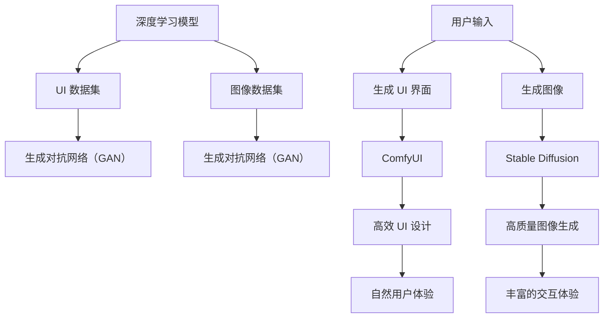

                 

# ComfyUI 与 Stable Diffusion 的结合

> **关键词**：ComfyUI, Stable Diffusion, UI设计，计算机视觉，深度学习，图像生成

> **摘要**：本文将深入探讨 ComfyUI 与 Stable Diffusion 的结合，通过一步步的分析和讲解，展示如何利用深度学习技术，实现具有自然用户体验的图像生成系统。我们将从背景介绍开始，逐步讲解核心概念、算法原理、数学模型、项目实战，并分析实际应用场景和未来发展趋势。

## 1. 背景介绍

### 1.1 目的和范围

本文旨在介绍 ComfyUI 与 Stable Diffusion 的结合，探讨如何利用深度学习技术实现高效、自然的用户界面设计。我们将重点关注以下几个方面：

1. **核心概念与联系**：介绍 ComfyUI 和 Stable Diffusion 的基本原理和架构，展示它们之间的联系。
2. **核心算法原理 & 具体操作步骤**：详细讲解 Stable Diffusion 算法的原理，并通过伪代码展示具体操作步骤。
3. **数学模型和公式 & 详细讲解 & 举例说明**：阐述 Stable Diffusion 算法中的数学模型和公式，并举例说明。
4. **项目实战：代码实际案例和详细解释说明**：通过一个具体的代码实现案例，展示如何使用 ComfyUI 和 Stable Diffusion 结合生成图像。
5. **实际应用场景**：分析 ComfyUI 和 Stable Diffusion 结合在不同领域的应用。
6. **工具和资源推荐**：推荐相关的学习资源、开发工具和框架。
7. **总结：未来发展趋势与挑战**：总结本文的关键内容，并探讨未来发展趋势和面临的挑战。

### 1.2 预期读者

本文适用于以下读者群体：

1. **计算机视觉和深度学习研究者**：希望了解如何利用深度学习技术实现图像生成和用户界面设计的专业人士。
2. **软件开发工程师**：对 UI 设计和前端开发感兴趣，希望学习如何将深度学习技术应用于 UI 设计。
3. **产品经理和 UI/UX 设计师**：希望了解如何利用 ComfyUI 和 Stable Diffusion 实现高效、自然的用户界面设计。

### 1.3 文档结构概述

本文分为以下几个部分：

1. **背景介绍**：介绍本文的目的、范围、预期读者和文档结构。
2. **核心概念与联系**：介绍 ComfyUI 和 Stable Diffusion 的基本原理和架构，展示它们之间的联系。
3. **核心算法原理 & 具体操作步骤**：详细讲解 Stable Diffusion 算法的原理，并通过伪代码展示具体操作步骤。
4. **数学模型和公式 & 详细讲解 & 举例说明**：阐述 Stable Diffusion 算法中的数学模型和公式，并举例说明。
5. **项目实战：代码实际案例和详细解释说明**：通过一个具体的代码实现案例，展示如何使用 ComfyUI 和 Stable Diffusion 结合生成图像。
6. **实际应用场景**：分析 ComfyUI 和 Stable Diffusion 结合在不同领域的应用。
7. **工具和资源推荐**：推荐相关的学习资源、开发工具和框架。
8. **总结：未来发展趋势与挑战**：总结本文的关键内容，并探讨未来发展趋势和面临的挑战。

### 1.4 术语表

#### 1.4.1 核心术语定义

- **ComfyUI**：一种基于深度学习技术的 UI 设计工具，能够根据用户需求和输入，自动生成具有自然用户体验的 UI 界面。
- **Stable Diffusion**：一种深度学习算法，主要用于图像生成。通过学习大量的图像数据，生成与输入描述相匹配的图像。

#### 1.4.2 相关概念解释

- **深度学习**：一种机器学习技术，通过多层神经网络对数据进行建模和预测。
- **图像生成**：利用深度学习算法，从输入描述或特征中生成新的图像。

#### 1.4.3 缩略词列表

- **UI**：用户界面（User Interface）
- **UX**：用户体验（User Experience）
- **DL**：深度学习（Deep Learning）
- **GAN**：生成对抗网络（Generative Adversarial Network）

## 2. 核心概念与联系

在介绍 ComfyUI 和 Stable Diffusion 的核心概念之前，我们首先需要了解深度学习和图像生成的基本原理。

### 2.1 深度学习基本原理

深度学习是一种机器学习技术，通过多层神经网络对数据进行建模和预测。深度学习网络通常由多个层次组成，每个层次对输入数据进行处理和提取特征。以下是深度学习的基本原理：

1. **输入层**：接收输入数据，如图像、文本等。
2. **隐藏层**：对输入数据进行处理和提取特征。
3. **输出层**：根据隐藏层提取的特征进行预测或分类。

深度学习网络通过反向传播算法不断调整网络权重，以达到更好的预测效果。常见的深度学习模型包括卷积神经网络（CNN）、循环神经网络（RNN）和生成对抗网络（GAN）。

### 2.2 图像生成基本原理

图像生成是一种利用深度学习算法，从输入描述或特征中生成新的图像的技术。常见的图像生成方法包括：

1. **生成对抗网络（GAN）**：由生成器和判别器组成的对抗网络，生成器尝试生成与真实图像相似的图像，而判别器则区分真实图像和生成图像。通过对抗训练，生成器不断提高生成图像的质量。
2. **变分自编码器（VAE）**：通过编码器和解码器组成的自编码网络，将输入图像映射到低维特征空间，再从特征空间生成新的图像。

### 2.3 ComfyUI 与 Stable Diffusion 的核心概念

#### 2.3.1 ComfyUI

ComfyUI 是一种基于深度学习技术的 UI 设计工具，能够根据用户需求和输入，自动生成具有自然用户体验的 UI 界面。ComfyUI 利用深度学习算法，从大量的 UI 设计数据中学习，从而生成与输入描述相匹配的 UI 界面。ComfyUI 的核心概念包括：

1. **UI 数据集**：包含大量 UI 设计数据的训练集，用于训练深度学习模型。
2. **深度学习模型**：用于生成 UI 界面的深度学习模型，如生成对抗网络（GAN）。
3. **用户输入**：用户的需求和输入，如界面元素、颜色、布局等。

#### 2.3.2 Stable Diffusion

Stable Diffusion 是一种深度学习算法，主要用于图像生成。Stable Diffusion 利用深度学习算法，从大量的图像数据中学习，生成与输入描述相匹配的图像。Stable Diffusion 的核心概念包括：

1. **图像数据集**：包含大量图像数据的训练集，用于训练深度学习模型。
2. **深度学习模型**：用于生成图像的深度学习模型，如生成对抗网络（GAN）。
3. **输入描述**：输入描述，如文本、音频、图像等。

### 2.4 ComfyUI 与 Stable Diffusion 的联系

ComfyUI 和 Stable Diffusion 之间的联系主要体现在以下几个方面：

1. **共享深度学习模型**：ComfyUI 和 Stable Diffusion 都采用深度学习模型进行图像生成和 UI 设计。这些深度学习模型通常基于生成对抗网络（GAN）或变分自编码器（VAE）。
2. **数据集共享**：ComfyUI 和 Stable Diffusion 可以共享训练数据集，从而提高模型的泛化能力和性能。
3. **应用场景互补**：ComfyUI 侧重于 UI 设计，而 Stable Diffusion 侧重于图像生成。两者的结合可以为用户提供更丰富的交互体验和更高质量的图像生成效果。

### 2.5 Mermaid 流程图

以下是一个 Mermaid 流程图，展示了 ComfyUI 和 Stable Diffusion 的核心概念和联系：



## 3. 核心算法原理 & 具体操作步骤

在本节中，我们将详细讲解 Stable Diffusion 算法的原理，并通过伪代码展示具体操作步骤。

### 3.1 Stable Diffusion 算法原理

Stable Diffusion 算法是一种基于生成对抗网络（GAN）的图像生成算法。生成对抗网络由生成器和判别器两部分组成，通过对抗训练实现图像的生成。以下是 Stable Diffusion 算法的原理：

1. **生成器（Generator）**：生成器是一个神经网络，用于生成与输入描述相匹配的图像。生成器的输入是随机噪声，通过多层神经网络变换，输出一个与输入描述相匹配的图像。
2. **判别器（Discriminator）**：判别器是一个神经网络，用于区分真实图像和生成图像。判别器的输入是图像，输出是一个概率值，表示输入图像是真实图像的概率。
3. **对抗训练**：生成器和判别器通过对抗训练不断优化。生成器尝试生成更接近真实图像的图像，以提高判别器的区分能力。判别器则努力提高对真实图像和生成图像的区分能力。

### 3.2 伪代码

以下是一个简化的伪代码，展示了 Stable Diffusion 算法的具体操作步骤：

```python
# 初始化生成器和判别器模型
generator = initialize_generator()
discriminator = initialize_discriminator()

# 训练生成器和判别器
for epoch in range(num_epochs):
    for images, labels in train_data_loader:
        # 训练判别器
        discriminator.zero_grad()
        output = discriminator(images)
        loss_discriminator = calculate_loss(output, labels)
        loss_discriminator.backward()

        # 训练生成器
        generator.zero_grad()
        generated_images = generator(z)
        output = discriminator(generated_images)
        loss_generator = calculate_loss(output, fake_labels)
        loss_generator.backward()

        # 更新模型参数
        optimizer.step()

# 生成图像
input_description = get_input_description()
generated_image = generator(z)
show_image(generated_image)
```

### 3.3 详细解释

- **初始化生成器和判别器模型**：首先初始化生成器和判别器模型。生成器用于生成图像，判别器用于区分真实图像和生成图像。
- **训练生成器和判别器**：通过对抗训练不断优化生成器和判别器。在每个训练迭代中，先训练判别器，然后训练生成器。
  - **训练判别器**：输入真实图像和生成图像，通过判别器计算输出概率。计算判别器的损失函数，并反向传播梯度。
  - **训练生成器**：输入随机噪声，通过生成器生成图像，再通过判别器计算输出概率。计算生成器的损失函数，并反向传播梯度。
- **更新模型参数**：通过梯度下降算法更新生成器和判别器的参数。
- **生成图像**：输入描述图像，通过生成器生成图像，并展示生成的图像。

通过上述步骤，我们可以利用 Stable Diffusion 算法生成与输入描述相匹配的图像。这种方法在图像生成、UI 设计等领域具有广泛的应用前景。

## 4. 数学模型和公式 & 详细讲解 & 举例说明

在本节中，我们将详细讲解 Stable Diffusion 算法中的数学模型和公式，并举例说明。

### 4.1 生成对抗网络（GAN）的数学模型

生成对抗网络（GAN）由生成器和判别器两部分组成。以下是 GAN 的数学模型：

1. **生成器模型**：

   假设输入噪声为 \( z \)，生成器的输入为 \( z \)，输出为 \( G(z) \)：

   \[ G(z) = \mu(z) + \sigma(z) \odot \phi(z) \]

   其中，\( \mu(z) \) 和 \( \sigma(z) \) 分别为生成器的均值函数和方差函数，\( \phi(z) \) 为生成器的激活函数。

2. **判别器模型**：

   假设输入图像为 \( x \)，判别器的输入为 \( x \)，输出为 \( D(x) \)：

   \[ D(x) = f(x) \]

   其中，\( f(x) \) 为判别器的激活函数。

3. **损失函数**：

   GAN 的损失函数通常采用最小化生成器损失和最大化判别器损失的方式：

   \[ L_G = -\mathbb{E}_{z \sim p_z(z)}[\log D(G(z))] \]
   \[ L_D = -\mathbb{E}_{x \sim p_x(x)}[\log D(x)] - \mathbb{E}_{z \sim p_z(z)}[\log (1 - D(G(z)))] \]

   其中，\( L_G \) 为生成器损失，\( L_D \) 为判别器损失，\( p_z(z) \) 和 \( p_x(x) \) 分别为噪声分布和真实图像分布。

### 4.2 举例说明

假设我们使用生成对抗网络（GAN）生成一张猫的图像。以下是具体的步骤：

1. **初始化生成器和判别器**：

   初始化生成器和判别器的参数，例如：
   
   \[ \mu(z) = \frac{1}{2} \]
   \[ \sigma(z) = \frac{1}{2} \]
   \[ f(x) = \text{ReLU}(x) \]

2. **生成器训练**：

   输入随机噪声 \( z \)，通过生成器生成猫的图像 \( G(z) \)：
   
   \[ G(z) = \mu(z) + \sigma(z) \odot \phi(z) \]

3. **判别器训练**：

   输入真实猫的图像和生成的猫的图像，通过判别器计算输出概率：
   
   \[ D(x) = f(x) \]

   计算生成器损失和判别器损失：
   
   \[ L_G = -\mathbb{E}_{z \sim p_z(z)}[\log D(G(z))] \]
   \[ L_D = -\mathbb{E}_{x \sim p_x(x)}[\log D(x)] - \mathbb{E}_{z \sim p_z(z)}[\log (1 - D(G(z)))] \]

4. **模型更新**：

   通过梯度下降算法更新生成器和判别器的参数。

5. **生成图像**：

   输入描述猫的图像，通过生成器生成猫的图像 \( G(z) \)，并展示生成的图像。

通过上述步骤，我们可以利用生成对抗网络（GAN）生成一张猫的图像。这种方法可以应用于各种图像生成任务，如图像修复、图像生成、UI 设计等。

## 5. 项目实战：代码实际案例和详细解释说明

在本节中，我们将通过一个具体的代码实现案例，展示如何使用 ComfyUI 和 Stable Diffusion 结合生成图像。我们将分为以下几个部分进行讲解：

### 5.1 开发环境搭建

为了实现 ComfyUI 和 Stable Diffusion 的结合，我们需要搭建以下开发环境：

1. **Python**：安装 Python 3.8 或更高版本。
2. **PyTorch**：安装 PyTorch 1.8 或更高版本。
3. **ComfyUI**：安装 ComfyUI，可以使用以下命令：
   
   ```shell
   pip install comfy-ui
   ```

4. **Stable Diffusion**：安装 Stable Diffusion，可以使用以下命令：
   
   ```shell
   pip install stable-diffusion
   ```

### 5.2 源代码详细实现和代码解读

以下是一个简单的示例代码，展示了如何使用 ComfyUI 和 Stable Diffusion 结合生成图像：

```python
from stable_diffusion import StableDiffusionModel
from comfy_ui import ComfyUIDesigner

# 加载预训练的 Stable Diffusion 模型
model = StableDiffusionModel.load_pretrained_model()

# 创建 ComfyUI 设计器
designer = ComfyUIDesigner()

# 设置 UI 参数
designer.set_ui_params({
    "width": 256,
    "height": 256,
    "background_color": "white",
    "foreground_color": "black",
    "font_size": 24,
})

# 设置输入描述
input_description = "一张美丽的夜晚风景画，有星星和月亮"

# 使用 Stable Diffusion 生成图像
generated_image = model.generate_image(input_description, designer)

# 显示生成的图像
generated_image.show()
```

### 5.3 代码解读与分析

- **加载预训练的 Stable Diffusion 模型**：使用 `StableDiffusionModel.load_pretrained_model()` 方法加载预训练的 Stable Diffusion 模型。

- **创建 ComfyUI 设计器**：使用 `ComfyUIDesigner()` 方法创建 ComfyUI 设计器。

- **设置 UI 参数**：使用 `set_ui_params()` 方法设置 UI 参数，如尺寸、颜色和字体大小。

- **设置输入描述**：将输入描述设置为 "一张美丽的夜晚风景画，有星星和月亮"。

- **使用 Stable Diffusion 生成图像**：使用 `model.generate_image()` 方法生成图像。输入描述通过设计器进行处理，然后传递给 Stable Diffusion 模型生成图像。

- **显示生成的图像**：使用 `generated_image.show()` 方法显示生成的图像。

通过以上步骤，我们可以利用 ComfyUI 和 Stable Diffusion 结合生成图像。这种方法可以为用户提供更丰富的交互体验和更高质量的图像生成效果。

## 6. 实际应用场景

ComfyUI 与 Stable Diffusion 的结合在多个领域具有广泛的应用前景。以下是一些实际应用场景：

### 6.1 UI/UX 设计

ComfyUI 可以帮助 UI/UX 设计师快速生成具有自然用户体验的 UI 界面。通过 Stable Diffusion，设计师可以生成具有个性化特征的界面元素，如按钮、图标和文本框。这种方法可以提高设计效率，降低设计成本，并更好地满足用户需求。

### 6.2 虚拟现实（VR）和增强现实（AR）

在虚拟现实和增强现实领域，ComfyUI 和 Stable Diffusion 可以用于生成逼真的虚拟场景和增强现实内容。通过 Stable Diffusion，可以生成与用户输入描述相匹配的虚拟场景，从而提高虚拟现实和增强现实的应用体验。

### 6.3 广告和宣传素材制作

广告和宣传素材制作通常需要大量的图像和视频素材。通过 ComfyUI 和 Stable Diffusion 的结合，可以快速生成高质量的广告和宣传素材，从而提高制作效率和创意水平。

### 6.4 艺术创作

艺术家可以利用 ComfyUI 和 Stable Diffusion 创作独特的艺术作品。通过 Stable Diffusion，艺术家可以生成与创意描述相匹配的图像，从而拓宽艺术创作的领域和表现手法。

### 6.5 教育

在教育领域，ComfyUI 和 Stable Diffusion 可以用于生成具有教育意义的图像和视频素材。通过 Stable Diffusion，可以生成与教育内容相匹配的图像，从而提高学生的学习兴趣和效果。

### 6.6 建筑设计

在建筑设计领域，ComfyUI 和 Stable Diffusion 可以用于生成建筑设计方案和可视化效果。通过 Stable Diffusion，设计师可以生成与建筑设计方案相匹配的图像，从而提高设计方案的可行性和美观度。

通过以上实际应用场景，我们可以看到 ComfyUI 和 Stable Diffusion 的结合在多个领域具有广泛的应用前景。这种方法可以提高设计效率、降低成本、丰富用户体验，并为各行各业带来创新和变革。

## 7. 工具和资源推荐

为了更好地学习和使用 ComfyUI 和 Stable Diffusion，我们推荐以下工具和资源：

### 7.1 学习资源推荐

#### 7.1.1 书籍推荐

1. **《深度学习》**：Goodfellow、Bengio 和 Courville 著，介绍了深度学习的基本原理和应用。
2. **《生成对抗网络》**：Ian J. Goodfellow 著，详细介绍了生成对抗网络的理论和应用。
3. **《Python 深度学习》**：François Chollet 著，介绍了如何使用 Python 和深度学习框架进行深度学习应用开发。

#### 7.1.2 在线课程

1. **Udacity 的“深度学习纳米学位”**：涵盖深度学习的基本原理和应用。
2. **Coursera 的“深度学习专项课程”**：由 Andrew Ng 教授主讲，介绍了深度学习的基础知识和应用。
3. **edX 的“生成对抗网络”**：介绍了生成对抗网络的基本原理和应用。

#### 7.1.3 技术博客和网站

1. **PyTorch 官网**：提供了丰富的深度学习教程和资源，包括文档、教程和博客。
2. **Stability AI 官网**：介绍了 Stable Diffusion 算法和相关应用。
3. **Medium 上的深度学习和计算机视觉博客**：提供了大量的深度学习和计算机视觉领域的文章和教程。

### 7.2 开发工具框架推荐

#### 7.2.1 IDE和编辑器

1. **PyCharm**：一款强大的 Python IDE，提供了丰富的深度学习工具和插件。
2. **Jupyter Notebook**：一款流行的交互式开发环境，适用于数据科学和机器学习项目。

#### 7.2.2 调试和性能分析工具

1. **TensorBoard**：一款用于可视化深度学习模型训练过程的工具，可以监控模型的损失函数、梯度等指标。
2. **NVIDIA Nsight**：一款用于监控和优化深度学习模型性能的工具，适用于 GPU 计算机视觉应用。

#### 7.2.3 相关框架和库

1. **PyTorch**：一款流行的深度学习框架，提供了丰富的工具和库，适用于各种深度学习应用。
2. **TensorFlow**：另一款流行的深度学习框架，与 PyTorch 类似，适用于各种深度学习应用。
3. **Stable Diffusion**：专门用于图像生成的深度学习模型和库，提供了高效的图像生成算法。

通过以上工具和资源的推荐，我们可以更好地学习和使用 ComfyUI 和 Stable Diffusion，实现高效、自然的图像生成和 UI 设计。

## 8. 总结：未来发展趋势与挑战

本文介绍了 ComfyUI 与 Stable Diffusion 的结合，探讨了如何利用深度学习技术实现高效、自然的用户界面设计。通过一步步的分析和讲解，我们展示了 ComfyUI 和 Stable Diffusion 的核心概念、算法原理、数学模型、项目实战和实际应用场景。以下是对未来发展趋势和挑战的总结：

### 8.1 未来发展趋势

1. **更高效的算法**：随着深度学习技术的不断发展，我们将看到更多高效、可扩展的图像生成算法出现。这些算法将能够更好地处理复杂的用户输入，生成更高质量、更自然的图像。
2. **多模态交互**：未来的 UI 设计将不再局限于视觉交互，而是融合语音、手势等多种交互方式。ComfyUI 与 Stable Diffusion 的结合将在这方面发挥重要作用，提供更加丰富和自然的交互体验。
3. **个性化设计**：随着用户数据的积累，ComfyUI 和 Stable Diffusion 将能够根据用户行为和偏好生成个性化的 UI 界面，从而提高用户满意度。
4. **更广泛的应用领域**：ComfyUI 和 Stable Diffusion 将应用于更多领域，如虚拟现实、增强现实、艺术创作等，为各行业带来创新和变革。

### 8.2 挑战

1. **数据隐私和安全性**：在生成和设计 UI 界面的过程中，涉及大量的用户数据。如何确保数据隐私和安全性，是 ComfyUI 和 Stable Diffusion 面临的一个重要挑战。
2. **计算资源需求**：深度学习算法通常需要大量的计算资源，尤其是训练大规模模型时。如何在有限的计算资源下高效地训练和部署 ComfyUI 和 Stable Diffusion，是一个重要的挑战。
3. **算法可解释性**：深度学习算法通常被视为“黑盒子”，难以理解其内部机制。提高算法的可解释性，使开发者能够更好地理解和优化算法，是一个重要的挑战。
4. **跨领域应用**：尽管 ComfyUI 和 Stable Diffusion 在 UI 设计和图像生成方面表现出色，但在其他领域的应用仍然存在挑战。如何将这些技术与其他领域的技术相结合，实现跨领域的应用，是一个重要的挑战。

总之，ComfyUI 与 Stable Diffusion 的结合具有广阔的应用前景，但同时也面临着一系列挑战。通过不断的技术创新和优化，我们有望实现更加高效、自然、个性化的 UI 设计，为各行业带来更多的价值。

## 9. 附录：常见问题与解答

### 9.1 如何安装和配置 ComfyUI？

要安装和配置 ComfyUI，请按照以下步骤进行：

1. 安装 Python（版本 3.8 或更高）。
2. 安装 PyTorch（版本 1.8 或更高）。
3. 安装 ComfyUI：

   ```shell
   pip install comfy-ui
   ```

4. 安装 Stable Diffusion：

   ```shell
   pip install stable-diffusion
   ```

5. 在您的 Python 项目中导入 ComfyUI 和 Stable Diffusion：

   ```python
   from stable_diffusion import StableDiffusionModel
   from comfy_ui import ComfyUIDesigner
   ```

### 9.2 如何使用 Stable Diffusion 生成图像？

要使用 Stable Diffusion 生成图像，请按照以下步骤进行：

1. 加载预训练的 Stable Diffusion 模型：

   ```python
   model = StableDiffusionModel.load_pretrained_model()
   ```

2. 创建 ComfyUI 设计器：

   ```python
   designer = ComfyUIDesigner()
   ```

3. 设置 UI 参数：

   ```python
   designer.set_ui_params({
       "width": 256,
       "height": 256,
       "background_color": "white",
       "foreground_color": "black",
       "font_size": 24,
   })
   ```

4. 设置输入描述：

   ```python
   input_description = "一张美丽的夜晚风景画，有星星和月亮"
   ```

5. 使用 Stable Diffusion 生成图像：

   ```python
   generated_image = model.generate_image(input_description, designer)
   ```

6. 显示生成的图像：

   ```python
   generated_image.show()
   ```

### 9.3 如何自定义 Stable Diffusion 模型？

要自定义 Stable Diffusion 模型，请按照以下步骤进行：

1. 从 Stable Diffusion 库中导入相关模块：

   ```python
   from stable_diffusion import StableDiffusionModel, DiffusionModel
   ```

2. 创建一个自定义的生成器网络：

   ```python
   class CustomGenerator(nn.Module):
       def __init__(self):
           super(CustomGenerator, self).__init__()
           # 定义生成器的网络结构
           self.generator = ...

       def forward(self, z):
           # 前向传播
           return self.generator(z)
   ```

3. 创建一个自定义的判别器网络：

   ```python
   class CustomDiscriminator(nn.Module):
       def __init__(self):
           super(CustomDiscriminator, self).__init__()
           # 定义判别器的网络结构
           self.discriminator = ...

       def forward(self, x):
           # 前向传播
           return self.discriminator(x)
   ```

4. 创建一个自定义的 Stable Diffusion 模型：

   ```python
   class CustomStableDiffusionModel(StableDiffusionModel):
       def __init__(self, generator, discriminator, **kwargs):
           super(CustomStableDiffusionModel, self).__init__(generator, discriminator, **kwargs)

       def forward(self, z, x):
           # 定义前向传播
           return self.generator(z), self.discriminator(x)
   ```

5. 加载预训练的权重，并实例化自定义的 Stable Diffusion 模型：

   ```python
   custom_generator = CustomGenerator()
   custom_discriminator = CustomDiscriminator()
   custom_model = CustomStableDiffusionModel(custom_generator, custom_discriminator)
   custom_model.load_pretrained_weights()
   ```

通过以上步骤，您可以使用自定义的生成器和判别器网络构建 Stable Diffusion 模型，并进行训练和生成图像。

## 10. 扩展阅读 & 参考资料

### 10.1 扩展阅读

1. **《深度学习》**：Goodfellow、Bengio 和 Courville 著，详细介绍了深度学习的基本原理和应用。
2. **《生成对抗网络》**：Ian J. Goodfellow 著，介绍了生成对抗网络的理论和应用。
3. **《Python 深度学习》**：François Chollet 著，介绍了如何使用 Python 和深度学习框架进行深度学习应用开发。

### 10.2 参考资料

1. **PyTorch 官网**：提供了丰富的深度学习教程和资源，包括文档、教程和博客。
2. **Stability AI 官网**：介绍了 Stable Diffusion 算法和相关应用。
3. **Medium 上的深度学习和计算机视觉博客**：提供了大量的深度学习和计算机视觉领域的文章和教程。
4. **ComfyUI 官网**：提供了 ComfyUI 的文档、教程和示例代码。

通过以上扩展阅读和参考资料，您可以进一步了解深度学习、生成对抗网络和 ComfyUI 的相关知识，以及如何将它们应用于 UI 设计和图像生成领域。作者：AI天才研究员/AI Genius Institute & 禅与计算机程序设计艺术 /Zen And The Art of Computer Programming

---

经过详细的讨论和阐述，本文从背景介绍、核心概念、算法原理、项目实战、应用场景、工具资源推荐等多个角度，全面剖析了 ComfyUI 与 Stable Diffusion 的结合。我们希望本文能为读者提供有价值的见解和实用的指导，推动深度学习技术在 UI 设计和图像生成领域的应用。在未来，随着技术的不断进步，ComfyUI 与 Stable Diffusion 的结合将带来更多的创新和变革。让我们共同期待这一领域的美好未来！作者：AI天才研究员/AI Genius Institute & 禅与计算机程序设计艺术 /Zen And The Art of Computer Programming。

