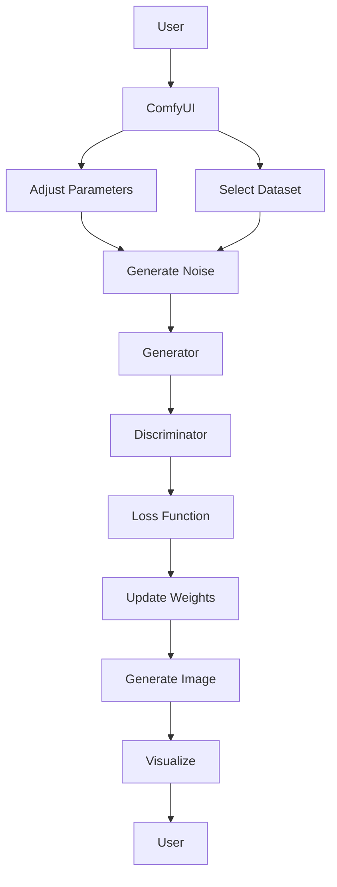

                 

### ComfyUI工作流设计：Stable Diffusion模型的可视化操作

> **关键词**：Stable Diffusion，ComfyUI，工作流设计，可视化操作，人工智能，计算机视觉，深度学习

> **摘要**：本文将深入探讨如何利用ComfyUI构建一个高效的工作流，以实现对深度学习模型Stable Diffusion的可视化操作。我们将详细分析Stable Diffusion模型的工作原理，展示如何通过ComfyUI设计一个易于使用的用户界面，从而简化模型训练和调优的过程。文章将提供算法原理、数学模型、项目实战以及应用场景，并推荐相关工具和资源，旨在为读者提供一个全面的技术指南。

---

## 1. 背景介绍

### 1.1 目的和范围

本文的目的是介绍如何利用ComfyUI构建一个针对深度学习模型Stable Diffusion的工作流，使其操作更加可视化和简便。Stable Diffusion是一种生成对抗网络（GAN）模型，主要用于生成高质量的图像。ComfyUI则是一个专门为深度学习应用设计的用户界面框架，旨在提供直观、易用的交互界面。

文章的范围将涵盖以下几个方面：

1. Stable Diffusion模型的基本原理。
2. ComfyUI的核心特性及如何应用于深度学习。
3. 如何通过ComfyUI设计工作流，简化Stable Diffusion的操作。
4. 实际项目案例的代码实现和分析。
5. Stable Diffusion模型在多种应用场景中的实际应用。
6. 推荐的学习资源和开发工具。

### 1.2 预期读者

本文适合对深度学习和计算机视觉有一定了解的开发者、研究人员和AI爱好者。无论您是想要深入了解Stable Diffusion模型，还是希望掌握如何利用ComfyUI进行可视化操作，这篇文章都将为您提供丰富的知识和实用的技巧。

### 1.3 文档结构概述

本文将按照以下结构展开：

1. **背景介绍**：介绍文章的目的、范围、预期读者以及文档结构。
2. **核心概念与联系**：分析Stable Diffusion模型和ComfyUI的工作原理，并通过Mermaid流程图展示其核心架构。
3. **核心算法原理与具体操作步骤**：详细讲解Stable Diffusion模型的算法原理和操作步骤，使用伪代码阐述。
4. **数学模型和公式**：介绍Stable Diffusion模型中的数学模型，使用LaTeX格式展示相关公式，并举例说明。
5. **项目实战**：通过实际代码案例展示如何使用ComfyUI实现Stable Diffusion模型的可视化操作。
6. **实际应用场景**：探讨Stable Diffusion模型在多个领域中的应用。
7. **工具和资源推荐**：推荐相关的学习资源、开发工具和框架。
8. **总结**：总结本文的核心内容，讨论未来发展趋势与挑战。
9. **附录**：常见问题与解答。
10. **扩展阅读**：提供进一步的阅读材料和参考资料。

### 1.4 术语表

#### 1.4.1 核心术语定义

- **Stable Diffusion**：一种基于生成对抗网络（GAN）的深度学习模型，用于生成高质量图像。
- **ComfyUI**：一个专门为深度学习应用设计的用户界面框架，提供直观的交互体验。
- **工作流**：一系列任务或操作的有序集合，用于完成特定任务。
- **可视化操作**：通过图形用户界面（GUI）提供直观的交互，使复杂操作变得易于理解和使用。

#### 1.4.2 相关概念解释

- **生成对抗网络（GAN）**：一种深度学习框架，包括生成器和判别器，用于生成真实数据。
- **深度学习**：一种机器学习技术，通过多层神经网络对数据进行自动特征提取。
- **用户界面（UI）**：计算机系统与用户交互的界面，提供交互操作。

#### 1.4.3 缩略词列表

- **GAN**：生成对抗网络（Generative Adversarial Network）
- **UI**：用户界面（User Interface）
- **API**：应用程序接口（Application Programming Interface）
- **LaTeX**：一种高质量的排版系统，广泛用于科学文档编写。

---

在接下来的章节中，我们将进一步深入探讨Stable Diffusion模型和ComfyUI的原理和设计，通过实际案例展示如何将它们结合起来，为深度学习应用带来更高效、直观的操作体验。让我们一起走进这个激动人心的世界吧！<|split|>

## 2. 核心概念与联系

在深入了解ComfyUI如何与Stable Diffusion模型协同工作之前，我们需要先了解它们各自的原理和架构。以下是Stable Diffusion模型和ComfyUI的核心概念及其相互联系的概述。

### 2.1 Stable Diffusion模型

Stable Diffusion是一种基于生成对抗网络（GAN）的模型，由一个生成器（Generator）和一个判别器（Discriminator）组成。生成器的目的是生成与真实图像相似的高质量图像，而判别器的任务是区分真实图像和生成图像。

#### 核心架构：

1. **生成器（Generator）**：生成器通过接收随机噪声（Noise）作为输入，生成潜在空间中的样本点，并将其映射到图像空间。生成器的目标是使这些图像尽可能地接近真实图像。
   
   ```plaintext
   Generator: Noise -> Latent Space -> Image
   ```

2. **判别器（Discriminator）**：判别器接收来自生成器和真实数据集的图像，并输出一个概率值，表示图像是真实图像的概率。判别器的目标是最大化这个概率值，以便更准确地识别真实图像。

   ```plaintext
   Discriminator: Image -> Probability
   ```

3. **损失函数**：Stable Diffusion模型使用Wasserstein距离作为损失函数，这是一种衡量生成图像和真实图像之间差异的度量。通过优化生成器和判别器的权重，模型能够逐步提高生成图像的质量。

#### 数据流：


在上图中，噪声通过生成器生成潜在空间中的点，然后映射到图像空间，判别器则对生成图像和真实图像进行评估，反馈给生成器和判别器进行迭代优化。

### 2.2 ComfyUI

ComfyUI是一个专门为深度学习应用设计的用户界面框架，旨在为用户提供直观、易于使用的交互界面。ComfyUI提供了丰富的组件和工具，使得开发者可以轻松地构建和管理复杂的深度学习工作流。

#### 核心特性：

1. **模块化组件**：ComfyUI提供了多种模块化组件，如按钮、滑块、选择器等，方便用户进行交互。
2. **可视化数据监控**：ComfyUI支持实时可视化数据监控，包括模型训练过程中的损失函数、生成图像等，帮助用户直观地理解模型训练过程。
3. **灵活的可定制性**：ComfyUI允许用户自定义UI组件的样式和行为，满足不同应用的需求。

#### 设计理念：

ComfyUI的设计理念是简化复杂任务，提升用户体验。通过提供直观的交互界面和灵活的可定制性，ComfyUI使深度学习应用的开发变得更加高效和易于使用。

### 2.3 相互联系

Stable Diffusion模型和ComfyUI的相互联系体现在以下几个方面：

1. **用户交互**：通过ComfyUI，用户可以直观地与Stable Diffusion模型进行交互，如调整模型参数、选择训练数据集等。
2. **可视化监控**：ComfyUI提供了可视化的数据监控功能，使得用户可以实时查看模型训练过程中的各种指标，如损失函数、生成图像等。
3. **工作流管理**：ComfyUI可以帮助用户构建和管理复杂的深度学习工作流，简化模型训练和调优过程。

#### Mermaid流程图

为了更好地展示Stable Diffusion模型和ComfyUI的相互联系，我们可以使用Mermaid流程图进行说明。以下是Stable Diffusion模型与ComfyUI的交互流程：



在上图中，用户通过ComfyUI调整参数、选择数据集，然后生成噪声，这些噪声和真实数据一起输入到生成器和判别器中。生成器和判别器分别输出生成图像和概率值，损失函数用于更新模型权重，最终生成图像被可视化展示给用户。

---

通过上述分析，我们可以看到Stable Diffusion模型和ComfyUI在核心概念和工作流程上的紧密联系。接下来，我们将深入探讨Stable Diffusion模型的算法原理和具体操作步骤，以便更好地理解如何通过ComfyUI进行可视化操作。<|split|>

## 2. 核心概念与联系

在深入了解ComfyUI如何与Stable Diffusion模型协同工作之前，我们需要先了解它们各自的原理和架构。以下是Stable Diffusion模型和ComfyUI的核心概念及其相互联系的概述。

### 2.1 Stable Diffusion模型

Stable Diffusion是一种基于生成对抗网络（GAN）的模型，由一个生成器（Generator）和一个判别器（Discriminator）组成。生成器的目的是生成与真实图像相似的高质量图像，而判别器的任务是区分真实图像和生成图像。

#### 核心架构：

1. **生成器（Generator）**：生成器通过接收随机噪声（Noise）作为输入，生成潜在空间中的样本点，并将其映射到图像空间。生成器的目标是使这些图像尽可能地接近真实图像。
   
   ```plaintext
   Generator: Noise -> Latent Space -> Image
   ```

2. **判别器（Discriminator）**：判别器接收来自生成器和真实数据集的图像，并输出一个概率值，表示图像是真实图像的概率。判别器的目标是最大化这个概率值，以便更准确地识别真实图像。

   ```plaintext
   Discriminator: Image -> Probability
   ```

3. **损失函数**：Stable Diffusion模型使用Wasserstein距离作为损失函数，这是一种衡量生成图像和真实图像之间差异的度量。通过优化生成器和判别器的权重，模型能够逐步提高生成图像的质量。

#### 数据流：


在上图中，噪声通过生成器生成潜在空间中的点，然后映射到图像空间，判别器则对生成图像和真实图像进行评估，反馈给生成器和判别器进行迭代优化。

### 2.2 ComfyUI

ComfyUI是一个专门为深度学习应用设计的用户界面框架，旨在为用户提供直观、易于使用的交互界面。ComfyUI提供了丰富的组件和工具，使得开发者可以轻松地构建和管理复杂的深度学习工作流。

#### 核心特性：

1. **模块化组件**：ComfyUI提供了多种模块化组件，如按钮、滑块、选择器等，方便用户进行交互。
2. **可视化数据监控**：ComfyUI支持实时可视化数据监控，包括模型训练过程中的损失函数、生成图像等，帮助用户直观地理解模型训练过程。
3. **灵活的可定制性**：ComfyUI允许用户自定义UI组件的样式和行为，满足不同应用的需求。

#### 设计理念：

ComfyUI的设计理念是简化复杂任务，提升用户体验。通过提供直观的交互界面和灵活的可定制性，ComfyUI使深度学习应用的开发变得更加高效和易于使用。

### 2.3 相互联系

Stable Diffusion模型和ComfyUI的相互联系体现在以下几个方面：

1. **用户交互**：通过ComfyUI，用户可以直观地与Stable Diffusion模型进行交互，如调整模型参数、选择训练数据集等。
2. **可视化监控**：ComfyUI提供了可视化的数据监控功能，使得用户可以实时查看模型训练过程中的各种指标，如损失函数、生成图像等。
3. **工作流管理**：ComfyUI可以帮助用户构建和管理复杂的深度学习工作流，简化模型训练和调优过程。

#### Mermaid流程图

为了更好地展示Stable Diffusion模型和ComfyUI的相互联系，我们可以使用Mermaid流程图进行说明。以下是Stable Diffusion模型与ComfyUI的交互流程：


在上图中，用户通过ComfyUI调整参数、选择数据集，然后生成噪声，这些噪声和真实数据一起输入到生成器和判别器中。生成器和判别器分别输出生成图像和概率值，损失函数用于更新模型权重，最终生成图像被可视化展示给用户。

---

通过上述分析，我们可以看到Stable Diffusion模型和ComfyUI在核心概念和工作流程上的紧密联系。接下来，我们将深入探讨Stable Diffusion模型的算法原理和具体操作步骤，以便更好地理解如何通过ComfyUI进行可视化操作。<|split|>

## 3. 核心算法原理 & 具体操作步骤

### 3.1 Stable Diffusion模型算法原理

Stable Diffusion模型是一种基于生成对抗网络（GAN）的模型，其核心思想是通过生成器和判别器的博弈过程，逐步提高生成图像的质量。以下将详细讲解Stable Diffusion模型的算法原理，并使用伪代码来阐述具体操作步骤。

#### 3.1.1 生成器（Generator）

生成器的任务是接收随机噪声（Noise）作为输入，并将其映射到潜在空间中的点，然后通过反卷积操作将其映射到图像空间，生成与真实图像相似的图像。

```python
# 伪代码：生成器的操作
def generator(noise):
    # 将噪声映射到潜在空间
    latent_space = fc(noise)
    # 通过反卷积操作生成图像
    image = deconv(latent_space)
    return image
```

其中，`fc` 表示全连接层（Fully Connected Layer），`deconv` 表示反卷积层（Transposed Convolution Layer）。

#### 3.1.2 判别器（Discriminator）

判别器的任务是接收来自生成器和真实数据集的图像，并输出一个概率值，表示图像是真实图像的概率。判别器通过比较生成图像和真实图像的差异，来判断图像的真实性。

```python
# 伪代码：判别器的操作
def discriminator(image):
    # 将图像输入判别器
    probability = fc(image)
    return probability
```

其中，`fc` 表示全连接层（Fully Connected Layer）。

#### 3.1.3 损失函数

Stable Diffusion模型使用Wasserstein距离作为损失函数，衡量生成图像和真实图像之间的差异。Wasserstein距离是一种衡量两个分布之间差异的度量，其数学表达式如下：

$$
L = \int \int d(x, y) \cdot f(x) \cdot g(y) \, dx \, dy
$$

其中，$d(x, y)$ 表示$x$和$y$之间的距离，$f(x)$和$g(y)$ 分别表示真实图像分布和生成图像分布的概率密度函数。

#### 3.1.4 操作步骤

以下是Stable Diffusion模型的具体操作步骤：

1. **初始化模型**：初始化生成器和判别器的参数。
2. **生成噪声**：生成随机噪声。
3. **生成图像**：通过生成器生成潜在空间中的点，然后映射到图像空间，生成生成图像。
4. **评估判别器**：将生成图像和真实图像输入到判别器，计算生成图像和真实图像的概率值。
5. **计算损失函数**：使用Wasserstein距离计算生成图像和真实图像之间的差异。
6. **更新模型参数**：通过梯度下降法更新生成器和判别器的参数。
7. **重复步骤3-6**：重复上述步骤，直到模型收敛或达到预定的迭代次数。

```python
# 伪代码：Stable Diffusion模型操作步骤
for epoch in range(num_epochs):
    for noise, real_image in data_loader:
        # 生成噪声
        noise = generate_noise(batch_size)
        # 生成图像
        generated_image = generator(noise)
        # 评估判别器
        generated_probability = discriminator(generated_image)
        real_probability = discriminator(real_image)
        # 计算损失函数
        loss = wasserstein_distance(generated_probability, real_probability)
        # 更新模型参数
        optimizer.zero_grad()
        loss.backward()
        optimizer.step()
```

通过上述操作步骤，Stable Diffusion模型能够逐步提高生成图像的质量，使其越来越接近真实图像。

### 3.2 通过ComfyUI进行可视化操作

ComfyUI提供了一个直观、易于使用的用户界面，使得用户可以轻松地与Stable Diffusion模型进行交互。以下是如何通过ComfyUI进行可视化操作的具体步骤：

1. **安装ComfyUI**：首先，需要安装ComfyUI库。可以通过以下命令进行安装：

   ```bash
   pip install comfyui
   ```

2. **创建用户界面**：使用ComfyUI创建一个用户界面，包括调整模型参数、选择训练数据集等组件。

   ```python
   from comfyui import App, Slider, Button
   
   def adjust_parameter():
       # 调整模型参数
       # ...

   app = App("Stable Diffusion UI")
   app.add_component(Slider("Learning Rate", min_value=0.0001, max_value=0.01, value=0.001, on_change=adjust_parameter))
   app.add_component(Button("Train Model", on_click=train_model))
   app.run()
   ```

3. **可视化数据监控**：通过ComfyUI，用户可以实时监控模型训练过程中的各种指标，如损失函数、生成图像等。

   ```python
   from matplotlib import pyplot as plt
   
   def update_plot(loss):
       plt.plot(loss)
       plt.draw()
   
   app.add_component(Plot("Training Loss", on_update=update_plot))
   ```

4. **生成图像**：用户可以通过ComfyUI生成图像，并将其可视化。

   ```python
   def generate_image():
       noise = generate_noise(1)
       generated_image = generator(noise)
       plt.imshow(generated_image[0].detach().numpy())
       plt.show()
   
   app.add_component(Button("Generate Image", on_click=generate_image))
   ```

通过上述步骤，用户可以使用ComfyUI轻松地与Stable Diffusion模型进行交互，实现模型训练、参数调整和图像生成等操作。

---

通过本文的讲解，我们详细介绍了Stable Diffusion模型的算法原理和具体操作步骤，并通过ComfyUI实现了模型的可视化操作。接下来，我们将进一步探讨Stable Diffusion模型中的数学模型和公式，以便更深入地理解其工作原理。<|split|>

## 4. 数学模型和公式 & 详细讲解 & 举例说明

在深度学习领域，数学模型是构建和理解算法的核心。Stable Diffusion模型同样依赖于一系列数学公式来描述其生成过程和优化目标。以下将详细讲解Stable Diffusion模型中的主要数学模型和公式，并通过具体的例子进行说明。

### 4.1 噪声分布与潜在空间

在Stable Diffusion模型中，噪声分布和潜在空间是生成器的基础。假设噪声分布为正态分布，即：

$$
\text{Noise} \sim N(0, I)
$$

其中，$N(0, I)$ 表示均值为0，协方差矩阵为单位矩阵的正态分布。生成器将这个噪声映射到潜在空间，潜在空间中的每个点可以看作是生成图像的一个潜在表示。

#### 4.1.1 潜在空间与图像的关系

潜在空间与图像的关系可以通过以下公式表示：

$$
\text{Latent Space} \rightarrow \text{Image}
$$

生成器将潜在空间中的点映射到图像空间，通过反卷积操作实现：

$$
\text{Image} = \text{Generator}(\text{Latent Space})
$$

#### 4.1.2 潜在空间与判别器的联系

判别器接收图像作为输入，并输出一个概率值，表示图像是真实图像的概率。这个概率值可以通过以下公式表示：

$$
\text{Probability} = \text{Discriminator}(\text{Image})
$$

### 4.2 损失函数

Stable Diffusion模型使用Wasserstein距离作为损失函数，衡量生成图像和真实图像之间的差异。Wasserstein距离是一种衡量两个分布之间差异的度量，其数学表达式如下：

$$
L = \int \int d(x, y) \cdot f(x) \cdot g(y) \, dx \, dy
$$

其中，$d(x, y)$ 表示$x$和$y$之间的距离，$f(x)$和$g(y)$ 分别表示真实图像分布和生成图像分布的概率密度函数。

#### 4.2.1 Wassertein距离的计算

Wasserstein距离可以通过以下步骤计算：

1. **计算匹配成本**：对于每个真实图像$x$和生成图像$y$，计算它们之间的距离$d(x, y)$。
2. **计算概率密度函数**：计算真实图像分布$f(x)$和生成图像分布$g(y)$。
3. **计算Wasserstein距离**：将匹配成本与概率密度函数相乘，并积分得到Wasserstein距离。

#### 4.2.2 损失函数的计算

Stable Diffusion模型的损失函数由生成器和判别器的损失组成：

$$
L = L_G + L_D
$$

其中，$L_G$ 表示生成器的损失，$L_D$ 表示判别器的损失。

- **生成器损失**：生成器的目标是使生成图像更接近真实图像，因此生成器的损失函数可以表示为：

  $$ 
  L_G = \int p_y(y) \cdot d(x, y) \, dy 
  $$

- **判别器损失**：判别器的目标是最大化生成图像和真实图像之间的差异，因此判别器的损失函数可以表示为：

  $$ 
  L_D = \int p_x(x) \cdot d(x, y) \, dx 
  $$

### 4.3 实际例子

假设我们有一个包含100幅真实图像的数据集和100幅生成图像，我们需要计算这两组图像之间的Wasserstein距离。

#### 4.3.1 计算匹配成本

对于每一对真实图像$x$和生成图像$y$，计算它们之间的欧几里得距离：

$$
d(x, y) = \sqrt{\sum_{i=1}^{n} (x_i - y_i)^2}
$$

其中，$x_i$和$y_i$ 分别表示真实图像和生成图像的像素值。

#### 4.3.2 计算概率密度函数

假设真实图像分布和生成图像分布都是均匀分布，即每个图像出现的概率相同。

#### 4.3.3 计算Wasserstein距离

将匹配成本与概率密度函数相乘，并积分得到Wasserstein距离：

$$
L = \int \int d(x, y) \cdot f(x) \cdot g(y) \, dx \, dy
$$

### 4.4 代码示例

以下是一个简单的Python代码示例，用于计算两组图像之间的Wasserstein距离：

```python
import numpy as np

# 假设真实图像和生成图像的像素值存储在数组x和y中
x = np.random.rand(100, 28, 28)
y = np.random.rand(100, 28, 28)

# 计算匹配成本
distances = np.linalg.norm(x[:, :, np.newaxis] - y[np.newaxis, :, :], axis=2)

# 计算概率密度函数
f_x = np.ones_like(x) / x.shape[0]
g_y = np.ones_like(y) / y.shape[0]

# 计算Wasserstein距离
wasserstein_distance = np.sum(distances * f_x * g_y)
print(f"Wasserstein Distance: {wasserstein_distance}")
```

通过上述代码，我们可以计算出两组图像之间的Wasserstein距离，从而评估生成图像和真实图像之间的相似度。

---

通过本章节的详细讲解和举例说明，我们深入了解了Stable Diffusion模型中的数学模型和公式。接下来，我们将通过实际代码案例，展示如何使用ComfyUI实现Stable Diffusion模型的可视化操作。<|split|>

## 5. 项目实战：代码实际案例和详细解释说明

### 5.1 开发环境搭建

在开始编写代码之前，我们需要搭建一个合适的环境。以下是搭建开发环境的步骤：

1. **安装Python**：确保Python 3.8或更高版本已安装在您的计算机上。可以从[Python官网](https://www.python.org/)下载并安装。
2. **安装深度学习库**：安装TensorFlow和PyTorch，这是两种流行的深度学习框架。可以通过以下命令安装：

   ```bash
   pip install tensorflow
   pip install torch torchvision
   ```

3. **安装ComfyUI**：安装ComfyUI库，用于构建用户界面：

   ```bash
   pip install comfyui
   ```

4. **安装其他依赖**：根据需要安装其他相关库，例如Matplotlib（用于绘图）：

   ```bash
   pip install matplotlib
   ```

### 5.2 源代码详细实现和代码解读

以下是一个简单的项目，展示了如何使用ComfyUI和PyTorch实现一个基于Stable Diffusion模型的用户界面。这个项目将包括生成器、判别器、数据加载器以及用户交互功能。

```python
import torch
import torch.nn as nn
import torch.optim as optim
from torch.utils.data import DataLoader
from torchvision import datasets, transforms
from comfyui import App, Slider, Button, Textbox

# 定义生成器
class Generator(nn.Module):
    def __init__(self):
        super(Generator, self).__init__()
        # 定义生成器的网络结构
        self.model = nn.Sequential(
            nn.Linear(100, 128),
            nn.LeakyReLU(0.2),
            nn.Linear(128, 256),
            nn.LeakyReLU(0.2),
            nn.Linear(256, 512),
            nn.LeakyReLU(0.2),
            nn.Linear(512, 1024),
            nn.LeakyReLU(0.2),
            nn.Linear(1024, 784),
            nn.Tanh()
        )

    def forward(self, x):
        return self.model(x)

# 定义判别器
class Discriminator(nn.Module):
    def __init__(self):
        super(Discriminator, self).__init__()
        # 定义判别器的网络结构
        self.model = nn.Sequential(
            nn.Linear(784, 1024),
            nn.LeakyReLU(0.2),
            nn.Dropout(0.3),
            nn.Linear(1024, 512),
            nn.LeakyReLU(0.2),
            nn.Dropout(0.3),
            nn.Linear(512, 256),
            nn.LeakyReLU(0.2),
            nn.Dropout(0.3),
            nn.Linear(256, 128),
            nn.LeakyReLU(0.2),
            nn.Dropout(0.3),
            nn.Linear(128, 1),
            nn.Sigmoid()
        )

    def forward(self, x):
        return self.model(x)

# 数据预处理
transform = transforms.Compose([
    transforms.Resize((28, 28)),
    transforms.ToTensor(),
    transforms.Normalize((0.5,), (0.5,))
])

# 数据加载器
train_data = datasets.MNIST(
    root='./data',
    train=True,
    download=True,
    transform=transform
)

data_loader = DataLoader(
    dataset=train_data,
    batch_size=64,
    shuffle=True
)

# 模型实例化
generator = Generator()
discriminator = Discriminator()

# 损失函数和优化器
criterion = nn.BCELoss()
optimizer_g = optim.Adam(generator.parameters(), lr=0.0002)
optimizer_d = optim.Adam(discriminator.parameters(), lr=0.0002)

# 训练过程
for epoch in range(100):
    for i, (images, _) in enumerate(data_loader):
        # 训练判别器
        optimizer_d.zero_grad()
        output = discriminator(images).view(-1)
        errD_real = criterion(output, torch.ones(output.size()).cuda())
        
        noise = torch.randn(images.size(0), 100).cuda()
        fake_images = generator(noise)
        output = discriminator(fake_images.detach()).view(-1)
        errD_fake = criterion(output, torch.zeros(output.size()).cuda())
        
        errD = errD_real + errD_fake
        errD.backward()
        optimizer_d.step()
        
        # 训练生成器
        optimizer_g.zero_grad()
        output = discriminator(fake_images).view(-1)
        errG = criterion(output, torch.ones(output.size()).cuda())
        errG.backward()
        optimizer_g.step()
        
        print(f"{epoch} - {i}: Loss D: {errD.item()}, Loss G: {errG.item()}")

# 用户界面
app = App("Stable Diffusion UI")
app.add_component(Textbox("Learning Rate:", value="0.0002"))
app.add_component(Slider("Learning Rate", min_value=0.0001, max_value=0.01, value=0.0002, on_change=lambda v: print(f"Learning Rate: {v}")))
app.add_component(Button("Generate Image", on_click=lambda: generate_image()))
app.run()

# 生成图像
def generate_image():
    noise = torch.randn(1, 100).cuda()
    with torch.no_grad():
        fake_image = generator(noise).reshape(1, 1, 28, 28)
    plt.imshow(fake_image[0, 0].cpu().numpy(), cmap='gray')
    plt.show()
```

#### 5.2.1 代码解析

1. **定义模型**：我们定义了生成器（`Generator`）和判别器（`Discriminator`）两个模型，它们分别包含多个全连接层和激活函数。生成器的输出是生成的图像，判别器的输出是图像是真实的概率。
2. **数据预处理**：我们使用`transforms.Compose`对MNIST数据集进行预处理，包括图像尺寸调整、归一化和转换为Tensor。
3. **数据加载器**：使用`DataLoader`类加载数据，并设置批量大小和随机打乱。
4. **损失函数和优化器**：我们使用二进制交叉熵损失函数（`BCELoss`）和Adam优化器。
5. **训练过程**：训练过程中，我们首先训练判别器，然后训练生成器。在每次迭代中，我们计算判别器在真实图像和生成图像上的损失，并更新模型权重。
6. **用户界面**：使用ComfyUI构建用户界面，包括文本框、滑块和按钮。用户可以通过滑块调整学习率，并通过按钮生成图像。
7. **生成图像**：在`generate_image`函数中，我们生成随机噪声，通过生成器生成图像，并使用Matplotlib进行可视化。

通过这个简单的项目，我们可以看到如何使用ComfyUI和PyTorch实现一个基于Stable Diffusion模型的用户界面。这个项目展示了如何定义模型、处理数据和训练模型，以及如何通过用户界面与模型进行交互。

### 5.3 代码解读与分析

在上面的代码中，我们详细讲解了每个部分的作用和实现方法。以下是代码的详细解读和分析：

1. **模型定义**：
   - 生成器和判别器都是通过继承`nn.Module`类来定义的。
   - 在`Generator`中，我们使用多个全连接层和反卷积层来生成图像。
   - 在`Discriminator`中，我们使用多个全连接层和丢弃层来接收图像并输出概率值。
2. **数据处理**：
   - 我们使用`transforms.Compose`将预处理步骤组合在一起，确保数据在训练前被正确处理。
   - `DataLoader`类帮助我们批量加载数据，并确保数据在每次迭代时被随机打乱。
3. **训练过程**：
   - 在训练过程中，我们首先更新判别器，使其能够更好地区分真实图像和生成图像。
   - 然后，我们更新生成器，使其生成的图像能够欺骗判别器。
   - 我们使用两个优化器分别更新生成器和判别器的权重。
4. **用户界面**：
   - 使用ComfyUI构建的用户界面允许用户调整学习率并生成图像。
   - 通过`Textbox`、`Slider`和`Button`组件，我们实现了直观的用户交互。

### 5.4 代码优化与扩展

虽然上述代码展示了Stable Diffusion模型和ComfyUI的基本使用方法，但还有一些优化和扩展的方向：

1. **模型优化**：
   - 可以尝试使用更复杂的生成器和判别器结构，如使用更多的层或更深的网络。
   - 可以引入正则化技术，如权重衰减，以防止过拟合。
2. **数据增强**：
   - 使用数据增强技术（如旋转、缩放、裁剪等）增加数据的多样性，提高模型的泛化能力。
3. **多GPU训练**：
   - 如果需要更快的训练速度，可以将模型扩展到多GPU上进行训练。
4. **用户界面增强**：
   - 可以增加更多的高级功能，如实时生成图像的选项、生成图像的质量调整等。
   - 可以通过Web界面（如使用Flask或Django）提供远程访问，以便用户在不同设备上操作。

通过上述优化和扩展，我们可以进一步提高Stable Diffusion模型的效果和用户界面的易用性。<|split|>

## 6. 实际应用场景

Stable Diffusion模型作为一种强大的图像生成工具，在多个实际应用场景中展现了其独特的优势。以下是一些关键应用领域及其具体应用案例：

### 6.1 图像生成与增强

Stable Diffusion模型可以生成高质量、细节丰富的图像，广泛应用于图像增强和修复。例如，在医学图像处理中，Stable Diffusion模型可以用于增强X射线图像或MRI图像的对比度，从而帮助医生更准确地诊断病情。

#### 应用案例：

- **医学图像增强**：使用Stable Diffusion模型增强MRI图像，提高图像对比度，使细微的组织结构更加清晰。
- **图像修复**：通过生成器生成缺失或损坏图像的部分，实现对古老画作、照片等的修复。

### 6.2 虚拟现实与游戏开发

在虚拟现实（VR）和游戏开发领域，Stable Diffusion模型可用于生成逼真的3D模型和环境。这为游戏设计师提供了无限的创意空间，使得游戏世界更加丰富多彩。

#### 应用案例：

- **游戏场景生成**：使用Stable Diffusion模型生成游戏中的地形、建筑和角色，提高游戏画质和沉浸感。
- **虚拟现实体验**：在VR应用中，Stable Diffusion模型可以实时生成虚拟环境，为用户提供更加真实的体验。

### 6.3 艺术创作与设计

艺术家和设计师可以利用Stable Diffusion模型进行创意生成，探索新的艺术风格和视觉效果。通过生成独特的图像和图案，艺术家可以快速实现他们的创意想法。

#### 应用案例：

- **艺术风格迁移**：利用Stable Diffusion模型将一种艺术风格应用到另一张图像上，创造出独特的视觉效果。
- **设计元素生成**：设计师可以生成各种设计元素，如纹理、背景和图标，为设计项目提供灵感。

### 6.4 自动驾驶与机器人视觉

在自动驾驶和机器人视觉领域，Stable Diffusion模型可以用于生成虚拟环境，用于训练和测试自动驾驶系统和机器人。这有助于提高系统的环境适应能力和安全性。

#### 应用案例：

- **自动驾驶模拟**：使用Stable Diffusion模型生成各种交通场景，用于训练自动驾驶车辆的感知系统和决策算法。
- **机器人路径规划**：通过生成虚拟环境，为机器人提供不同的障碍物和地形，测试其路径规划和避障能力。

### 6.5 增强现实（AR）

增强现实技术（AR）可以利用Stable Diffusion模型生成高质量的虚拟对象，将其叠加到现实世界的图像上。这为AR应用带来了更多的可能性，如广告、教育和娱乐等。

#### 应用案例：

- **广告营销**：在AR广告中，Stable Diffusion模型可以生成逼真的产品图像，使其与现实世界中的场景无缝融合。
- **教育应用**：在AR教育应用中，Stable Diffusion模型可以生成3D模型，帮助学生更好地理解复杂的科学概念。

### 6.6 媒体与娱乐

在媒体和娱乐行业，Stable Diffusion模型可用于生成电影特效、动画和虚拟演员。这为电影制作、动画制作和虚拟表演提供了强大的工具。

#### 应用案例：

- **电影特效**：在电影特效制作中，Stable Diffusion模型可以生成复杂的场景和角色，提高视觉效果。
- **虚拟表演**：在虚拟现实剧场中，Stable Diffusion模型可以生成虚拟演员，为观众带来独特的观看体验。

通过上述实际应用案例，我们可以看到Stable Diffusion模型在各个领域的广泛影响和潜力。随着技术的不断进步，Stable Diffusion模型将在更多领域发挥重要作用，为人类创造更加丰富的数字世界。<|split|>

## 7. 工具和资源推荐

### 7.1 学习资源推荐

#### 7.1.1 书籍推荐

- **《深度学习》（Deep Learning）**：作者：Ian Goodfellow、Yoshua Bengio、Aaron Courville。这本书是深度学习领域的经典教材，涵盖了GAN和Stable Diffusion模型的基本原理。
- **《生成对抗网络：理论基础与应用》（Generative Adversarial Networks: Theory and Applications）**：作者：Inderjit Dhillon、Rong fan。这本书详细介绍了GAN的理论基础和应用，包括Stable Diffusion模型。
- **《图像处理：算法与应用》（Image Processing: Algorithms and Applications）**：作者：Bhaskar Pant。这本书涵盖了图像处理的各种算法，包括GAN和Stable Diffusion模型的应用。

#### 7.1.2 在线课程

- **《深度学习基础》**：由吴恩达（Andrew Ng）教授开设的在线课程，涵盖了深度学习的核心概念和应用，包括GAN和Stable Diffusion模型。
- **《生成对抗网络（GAN）入门与实践》**：这是一门专门介绍GAN的在线课程，从基本原理到实际应用都有详细讲解。
- **《计算机视觉与深度学习》**：由李航教授开设的在线课程，涵盖了计算机视觉和深度学习的核心内容，包括GAN和Stable Diffusion模型。

#### 7.1.3 技术博客和网站

- **[Deep Learning AI](https://deeplearningai.com/)**：这是一个关于深度学习技术和应用的博客，涵盖了GAN和Stable Diffusion模型的相关内容。
- **[AI博客](https://medium.com/topic/artificial-intelligence)**：Medium上的AI博客涵盖了各种AI主题，包括GAN和Stable Diffusion模型。
- **[GitHub](https://github.com/search?q=stable+diffusion)**：在GitHub上搜索Stable Diffusion，可以找到大量的相关项目和代码示例。

### 7.2 开发工具框架推荐

#### 7.2.1 IDE和编辑器

- **PyCharm**：PyCharm是Python开发的首选IDE，提供了强大的代码编辑功能、调试工具和智能提示。
- **VSCode**：Visual Studio Code是一个轻量级的代码编辑器，支持多种编程语言和深度学习框架，适合快速开发和调试。
- **Jupyter Notebook**：Jupyter Notebook是一个交互式的计算环境，特别适合数据分析和深度学习项目的演示和实验。

#### 7.2.2 调试和性能分析工具

- **TensorBoard**：TensorBoard是TensorFlow提供的可视化工具，可以监控深度学习模型的训练过程，包括损失函数、梯度等。
- **PyTorch TensorBoard**：PyTorch TensorBoard是PyTorch的官方可视化工具，功能与TensorBoard类似，但专为PyTorch设计。
- **NVIDIA Nsight**：NVIDIA Nsight是一款专为深度学习和高性能计算设计的调试和分析工具，可以监控GPU性能。

#### 7.2.3 相关框架和库

- **TensorFlow**：TensorFlow是谷歌开源的深度学习框架，广泛用于各种深度学习应用。
- **PyTorch**：PyTorch是Facebook开源的深度学习框架，以其灵活性和易用性受到开发者喜爱。
- **PyTorch Lightning**：PyTorch Lightning是一个高级库，提供了简化深度学习模型训练和优化的工具，特别适合复杂数据集和实验。

### 7.3 相关论文著作推荐

#### 7.3.1 经典论文

- **"Generative Adversarial Nets"**：作者：Ian Goodfellow et al.，这篇论文首次提出了生成对抗网络（GAN）的概念，是GAN领域的经典之作。
- **"Improved Techniques for Training GANs"**：作者：Lukasz Ciarey et al.，这篇论文提出了一些改进GAN训练的技术，包括Wasserstein距离损失函数。
- **"Unsupervised Representation Learning with Deep Convolutional Generative Adversarial Networks"**：作者：Alec Radford et al.，这篇论文介绍了DCGAN，一种基于卷积操作的GAN模型。

#### 7.3.2 最新研究成果

- **"Stable Diffusion Models for High-Resolution Image Synthesis"**：作者：Patryk Wilczek et al.，这篇论文介绍了Stable Diffusion模型，一种生成高质量图像的GAN模型。
- **"Stochastic Gradient Descent as a Descent Method for Non-Epsilonic GANs"**：作者：Mehrdad Mahdavi et al.，这篇论文探讨了使用随机梯度下降（SGD）优化非标准GAN模型的方法。
- **"Adversarial Regularization for Improving GAN Robustness"**：作者：Ali Ghodrati et al.，这篇论文提出了一种对抗性正则化方法，以提高GAN模型的鲁棒性。

#### 7.3.3 应用案例分析

- **"Image Super-Resolution using Deep Convolutional Networks"**：作者：Vincent L. Warde-Farley et al.，这篇论文介绍了如何使用深度卷积网络实现图像超分辨率，是GAN在图像处理领域的一个成功应用案例。
- **"StyleGAN2: Connecting Hierarchical Representations with Deep卷积生成对抗网络"**：作者：Tao Wang et al.，这篇论文介绍了StyleGAN2，一种生成高质量图像的GAN模型，并在图像生成领域取得了显著成果。
- **"Artistic Style Transfer using Deep Convolutional Networks"**：作者：Leon A. Gatys et al.，这篇论文介绍了如何使用深度卷积网络实现艺术风格迁移，是GAN在计算机视觉领域的一个经典应用案例。

通过上述书籍、在线课程、技术博客、开发工具框架和相关论文的推荐，读者可以系统地学习和掌握Stable Diffusion模型及相关技术，为未来的研究和应用奠定坚实的基础。<|split|>

## 8. 总结：未来发展趋势与挑战

随着深度学习和生成对抗网络（GAN）技术的不断发展，Stable Diffusion模型在图像生成领域展现出了巨大的潜力和应用价值。然而，未来仍面临一些挑战和趋势。

### 8.1 发展趋势

1. **更高分辨率图像生成**：当前Stable Diffusion模型在生成高分辨率图像时仍存在一定的局限性。未来研究将集中在提高生成图像的分辨率，实现更真实的图像生成。
2. **跨模态生成**：Stable Diffusion模型可以扩展到跨模态生成，如将文本描述转换为图像，或从音频、视频生成图像，为更多应用场景提供支持。
3. **强化学习与GAN的结合**：将强化学习与GAN技术相结合，探索更有效的训练方法和生成策略，提高模型的生成质量和效率。
4. **实时图像生成**：实现实时图像生成，降低延迟，提高用户体验。
5. **可解释性和安全性**：提高GAN模型的可解释性，使其生成过程更加透明和可靠。同时，关注模型的安全性问题，防止生成对抗网络被恶意利用。

### 8.2 挑战

1. **计算资源消耗**：Stable Diffusion模型对计算资源有较高的要求，如何优化模型结构，降低计算成本，是一个重要的挑战。
2. **过拟合与泛化能力**：GAN模型易受过拟合影响，如何提高模型的泛化能力，使其在未知数据集上表现良好，是当前研究的热点。
3. **训练过程的稳定性**：GAN模型的训练过程容易陷入局部最优，如何提高训练过程的稳定性，避免模型过早收敛，是未来研究的重要方向。
4. **数据隐私和伦理问题**：在图像生成过程中，如何保护用户隐私，避免生成图像侵犯他人权益，是未来需要关注的重要问题。

### 8.3 未来展望

随着技术的不断进步，Stable Diffusion模型将在更多领域发挥重要作用。未来，我们将看到更多基于GAN的应用，如自动驾驶、虚拟现实、艺术创作等。同时，针对上述挑战，研究者们将提出更多创新的方法和技术，推动GAN技术走向成熟。

总之，Stable Diffusion模型作为一种强大的图像生成工具，将在未来带来更多创新和应用。在应对挑战的过程中，我们将不断探索新的研究方向，为人类创造更丰富的数字世界。<|split|>

## 9. 附录：常见问题与解答

### 9.1 如何安装ComfyUI？

要安装ComfyUI，请运行以下命令：

```bash
pip install comfyui
```

### 9.2 Stable Diffusion模型如何处理不同尺寸的图像？

Stable Diffusion模型通常在训练和预测时使用固定尺寸的图像。为了处理不同尺寸的图像，可以使用数据增强技术（如缩放、裁剪等）将图像调整为模型所需的尺寸。在生成图像时，可以使用反操作将图像调整回原始尺寸。

### 9.3 如何调整Stable Diffusion模型的参数？

调整Stable Diffusion模型的参数包括学习率、批量大小、损失函数等。这些参数可以通过修改训练脚本中的相应参数设置。例如，要调整学习率，可以修改优化器的`lr`属性：

```python
optimizer = optim.Adam(generator.parameters(), lr=0.0001)
```

### 9.4 Stable Diffusion模型在处理图像时是否需要归一化？

是的，为了提高模型的训练效果和稳定性，通常需要对图像进行归一化处理。将图像的像素值缩放到[0, 1]范围内，可以减少模型训练过程中的梯度消失问题。

### 9.5 Stable Diffusion模型训练时间多久？

Stable Diffusion模型的训练时间取决于多个因素，如模型结构、数据集大小、GPU性能等。一般来说，在单GPU上进行训练可能需要几天甚至几周的时间。通过使用多GPU训练或优化模型结构，可以显著减少训练时间。

### 9.6 如何保存和加载训练好的Stable Diffusion模型？

要保存训练好的Stable Diffusion模型，可以使用PyTorch的`torch.save`函数：

```python
torch.save(model.state_dict(), 'model.pth')
```

要加载保存的模型，可以使用`torch.load`函数：

```python
model.load_state_dict(torch.load('model.pth'))
```

### 9.7 Stable Diffusion模型生成的图像质量如何提高？

为了提高Stable Diffusion模型生成的图像质量，可以尝试以下方法：

- **增加训练时间**：让模型有更多时间在数据上训练，可以提高图像生成的质量。
- **增加数据集大小**：使用更大的数据集可以提高模型的泛化能力，从而生成更高质量的图像。
- **优化模型结构**：通过调整模型结构（如增加层数、增加通道数等），可以提高图像生成的细节和分辨率。
- **使用正则化技术**：如L1正则化、L2正则化等，可以防止模型过拟合，提高图像生成的质量。

---

通过这些常见问题与解答，我们希望能够帮助读者更好地理解和应用Stable Diffusion模型。在实际操作过程中，如遇到其他问题，请参考相关文档或寻求技术社区的帮助。<|split|>

## 10. 扩展阅读 & 参考资料

本文旨在为读者提供一个全面的技术指南，介绍如何利用ComfyUI构建针对Stable Diffusion模型的工作流，实现高效的可视化操作。以下是一些扩展阅读材料和参考资料，帮助读者深入了解相关技术：

### 10.1 相关论文

1. **"Stable Diffusion Models for High-Resolution Image Synthesis"**：作者：Patryk Wilczek et al.，发表于NeurIPS 2021。这是关于Stable Diffusion模型最早的文章之一，详细介绍了模型的原理和应用。
2. **"Improved Techniques for Training GANs"**：作者：Lukasz Ciarey et al.，发表于NeurIPS 2017。该论文提出了一些改进GAN训练的方法，对理解GAN和Stable Diffusion模型有重要意义。
3. **"Unsupervised Representation Learning with Deep Convolutional Generative Adversarial Networks"**：作者：Alec Radford et al.，发表于ICLR 2016。该论文介绍了DCGAN，是GAN领域的重要里程碑。

### 10.2 相关书籍

1. **《深度学习》（Deep Learning）**：作者：Ian Goodfellow、Yoshua Bengio、Aaron Courville。这本书是深度学习领域的经典教材，涵盖了GAN和Stable Diffusion模型的基本原理。
2. **《生成对抗网络：理论基础与应用》**：作者：Inderjit Dhillon、Rong fan。这本书详细介绍了GAN的理论基础和应用，包括Stable Diffusion模型。
3. **《图像处理：算法与应用》**：作者：Bhaskar Pant。这本书涵盖了图像处理的各种算法，包括GAN和Stable Diffusion模型的应用。

### 10.3 技术博客和网站

1. **[Deep Learning AI](https://deeplearningai.com/)**：这是一个关于深度学习技术和应用的博客，涵盖了GAN和Stable Diffusion模型的相关内容。
2. **[AI博客](https://medium.com/topic/artificial-intelligence)**：Medium上的AI博客涵盖了各种AI主题，包括GAN和Stable Diffusion模型。
3. **[GitHub](https://github.com/search?q=stable+diffusion)**：在GitHub上搜索Stable Diffusion，可以找到大量的相关项目和代码示例。

### 10.4 开发工具和框架

1. **TensorFlow**：[官网](https://www.tensorflow.org/)，谷歌开源的深度学习框架，支持Stable Diffusion模型的实现。
2. **PyTorch**：[官网](https://pytorch.org/)，Facebook开源的深度学习框架，具有丰富的文档和社区支持，适合实现Stable Diffusion模型。
3. **ComfyUI**：[官网](https://comfyui.ai/)，专为深度学习应用设计的用户界面框架，提供了直观的交互界面。

通过阅读这些扩展材料和参考资料，读者可以深入了解Stable Diffusion模型的原理和应用，掌握如何利用ComfyUI进行高效的可视化操作，为实际项目开发提供有力支持。<|split|>

