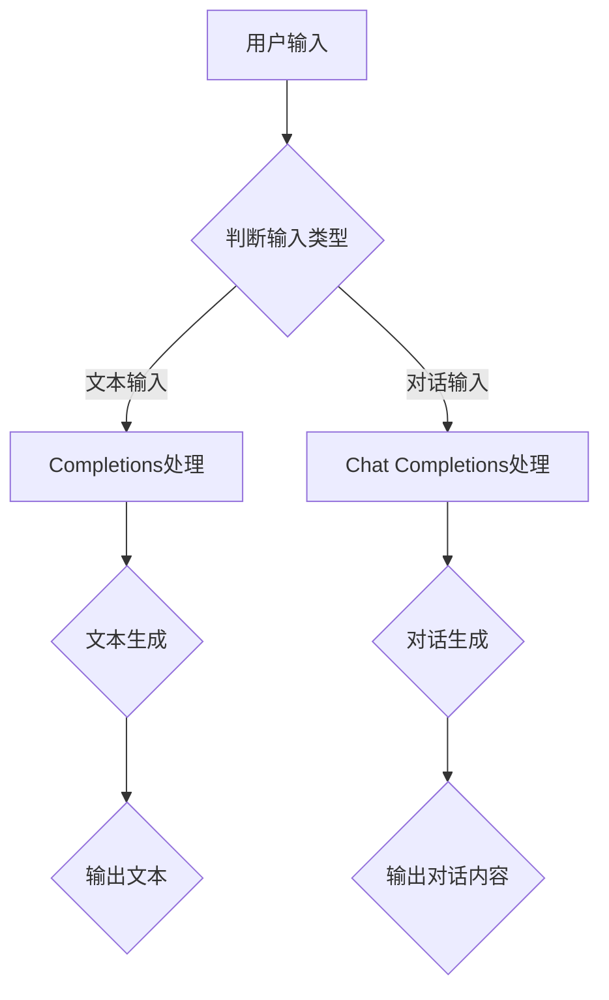
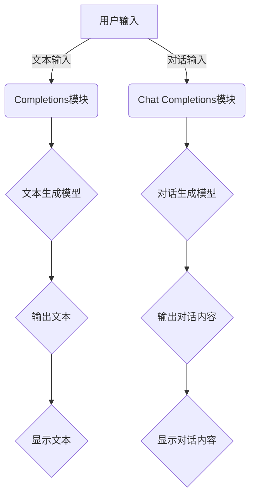

                 

# Completions vs Chat Completions

> **关键词**：AI对话系统，文本生成，对话流程，应用场景，算法原理，技术对比
>
> **摘要**：本文深入探讨了AI领域的两大对话生成技术——Completions与Chat Completions。通过对两者的定义、原理、实现步骤和数学模型的详细介绍，本文帮助读者理解两者的异同，并分析其在实际应用中的效果与适用场景。文章还通过实际代码案例和工具资源推荐，为技术爱好者提供了深入学习与实践的路径。

## 1. 背景介绍

### 1.1 目的和范围

本文旨在为读者提供一个关于AI对话系统中的Completions与Chat Completions的深入分析。我们将首先介绍这两个概念的定义和背景，然后逐步深入探讨它们的原理、实现方法和应用场景。通过对比分析，我们希望读者能够清晰地了解两者在技术上的区别和各自的优势。文章最后将提供实用的工具和资源推荐，以及未来的发展趋势与挑战。

### 1.2 预期读者

本文适合对AI对话系统有一定了解的技术人员、数据科学家和人工智能爱好者。无论你是AI领域的初学者，还是希望深入了解对话生成技术的专家，本文都将为你提供有价值的内容。

### 1.3 文档结构概述

本文将按照以下结构展开：

1. **背景介绍**：介绍本文的目的、范围、预期读者和文档结构。
2. **核心概念与联系**：定义Completions和Chat Completions，并通过Mermaid流程图展示其核心概念和联系。
3. **核心算法原理 & 具体操作步骤**：详细讲解Completions和Chat Completions的算法原理和具体实现步骤。
4. **数学模型和公式 & 详细讲解 & 举例说明**：介绍相关的数学模型和公式，并给出具体例子说明。
5. **项目实战：代码实际案例和详细解释说明**：通过实际代码案例，展示如何实现Completions和Chat Completions。
6. **实际应用场景**：分析Completions和Chat Completions在不同领域的应用。
7. **工具和资源推荐**：推荐相关的学习资源、开发工具和框架。
8. **总结：未来发展趋势与挑战**：总结本文的主要观点，并讨论未来的发展趋势与挑战。
9. **附录：常见问题与解答**：回答读者可能关心的一些问题。
10. **扩展阅读 & 参考资料**：提供进一步学习的参考资料。

### 1.4 术语表

#### 1.4.1 核心术语定义

- **Completions**：指文本生成技术，用于根据用户输入的部分文本，生成完整的、连贯的文本。
- **Chat Completions**：指对话生成技术，用于根据对话上下文，生成适时的、具有交互性的对话内容。
- **AI对话系统**：指利用人工智能技术实现的对话系统，能够理解自然语言并与人类用户进行交流。
- **自然语言处理（NLP）**：指计算机科学领域中的一个分支，主要研究如何让计算机理解、处理和生成自然语言。

#### 1.4.2 相关概念解释

- **机器学习（ML）**：指一种人工智能方法，通过从数据中学习规律和模式，来改进算法性能。
- **深度学习（DL）**：指机器学习的一种方法，通过构建多层神经网络，自动提取数据的复杂特征。
- **生成对抗网络（GAN）**：一种深度学习模型，用于生成数据，由生成器和判别器两个网络组成。

#### 1.4.3 缩略词列表

- **NLP**：自然语言处理（Natural Language Processing）
- **ML**：机器学习（Machine Learning）
- **DL**：深度学习（Deep Learning）
- **GAN**：生成对抗网络（Generative Adversarial Network）

## 2. 核心概念与联系

在这一部分，我们将详细介绍Completions和Chat Completions的核心概念和联系，并通过Mermaid流程图来展示其核心原理和架构。

### 2.1. Completions的概念

Completions是一种文本生成技术，旨在根据用户输入的部分文本，生成完整的、连贯的文本。Completions的核心思想是通过学习大量的文本数据，来预测下一个可能的单词或句子。

### 2.2. Chat Completions的概念

Chat Completions则是一种对话生成技术，旨在根据对话上下文，生成适时的、具有交互性的对话内容。Chat Completions不仅需要生成连贯的文本，还需要考虑对话的上下文、语境和用户的意图。

### 2.3. 核心概念与联系

为了更好地理解Completions和Chat Completions，我们首先需要了解它们的核心概念和联系。以下是一个Mermaid流程图，展示了这两个概念之间的联系和交互过程：



在这个流程图中，用户输入分为文本输入和对话输入两种类型。根据输入的类型，系统会分别进入Completions处理流程和Chat Completions处理流程。在Completions处理流程中，系统会根据输入的文本，生成完整的、连贯的文本。在Chat Completions处理流程中，系统会根据对话的上下文，生成适时的、具有交互性的对话内容。

生成的文本和对话内容最终会输出给用户，完成一次对话交互。

### 2.4. 架构图

为了更直观地理解Completions和Chat Completions的架构，我们再通过一个架构图来展示它们的核心组件和交互过程：



在这个架构图中，用户输入经过模块处理后，会分别进入文本生成模型和对话生成模型。这两个模型都是基于深度学习技术，能够自动学习大量的文本数据和对话数据，从而生成高质量的文本和对话内容。最后，生成的文本和对话内容会显示给用户，完成一次完整的对话交互。

通过这个架构图，我们可以更清晰地看到Completions和Chat Completions的核心组件和交互过程。这为后续的算法原理讲解和实现步骤提供了直观的参考。

## 3. 核心算法原理 & 具体操作步骤

在这一部分，我们将详细讲解Completions和Chat Completions的核心算法原理和具体实现步骤。首先，我们将介绍文本生成模型和对话生成模型的基本概念和原理，然后通过伪代码来描述这两个模型的实现过程。

### 3.1. 文本生成模型原理

文本生成模型是一种深度学习模型，旨在根据输入的文本序列，生成完整的、连贯的文本序列。常见的文本生成模型包括循环神经网络（RNN）、长短期记忆网络（LSTM）和生成对抗网络（GAN）等。以下是一个简单的RNN文本生成模型的伪代码：

```python
# RNN文本生成模型伪代码

# 初始化模型参数
W, b = initialize_params()

# 定义RNN模型
def rnn_text_generator(input_sequence):
    hidden_state = initialize_hidden_state()
    output_sequence = []
    
    for word in input_sequence:
        # 计算输入和隐藏状态的加权和
        input_vector = embedding[word]
        hidden_state = sigmoid(W * input_vector + b)
        
        # 生成下一个单词的预测概率分布
        output_vector = softmax(W * hidden_state + b)
        predicted_word = sample_word(output_vector)
        
        # 更新隐藏状态
        hidden_state = concatenate(hidden_state, predicted_word)
        
        # 添加预测的单词到输出序列
        output_sequence.append(predicted_word)
    
    return output_sequence

# 训练模型
def train_model(dataset):
    for input_sequence, target_sequence in dataset:
        output_sequence = rnn_text_generator(input_sequence)
        loss = calculate_loss(output_sequence, target_sequence)
        update_params(loss)

# 计算损失函数
def calculate_loss(output_sequence, target_sequence):
    loss = 0
    for output_word, target_word in zip(output_sequence, target_sequence):
        loss += -log(output_word[target_word])
    return loss

# 主函数
def main():
    dataset = load_dataset()
    train_model(dataset)

if __name__ == "__main__":
    main()
```

在这个伪代码中，我们首先初始化模型参数，然后定义了RNN文本生成模型。在模型中，我们使用了一个嵌入层来将单词转换为向量表示，然后通过RNN模型来预测下一个单词的概率分布。在训练过程中，我们使用了一个损失函数来评估模型的性能，并使用反向传播算法来更新模型参数。

### 3.2. 对话生成模型原理

对话生成模型是一种基于序列到序列（Seq2Seq）模型的深度学习模型，旨在根据对话上下文，生成适时的、具有交互性的对话内容。以下是一个简单的Seq2Seq对话生成模型的伪代码：

```python
# Seq2Seq对话生成模型伪代码

# 初始化模型参数
W, b = initialize_params()

# 定义编码器和解码器模型
def seq2seq_model(input_sequence, target_sequence):
    # 编码器
    encoder_output = encode_sequence(input_sequence)
    # 解码器
    decoder_output = decode_sequence(encoder_output)
    
    return decoder_output

# 编码器
def encode_sequence(input_sequence):
    # 使用RNN编码器将输入序列编码为固定长度的向量
    encoder_output = []
    for word in input_sequence:
        encoder_output.append(embedding[word])
    return encoder_output

# 解码器
def decode_sequence(encoder_output):
    # 使用RNN解码器生成输出序列
    decoder_output = []
    hidden_state = encoder_output[-1]
    for _ in range(target_sequence_length):
        output_vector = softmax(W * hidden_state + b)
        predicted_word = sample_word(output_vector)
        decoder_output.append(predicted_word)
        hidden_state = concatenate(hidden_state, predicted_word)
    return decoder_output

# 训练模型
def train_model(dataset):
    for input_sequence, target_sequence in dataset:
        decoder_output = seq2seq_model(input_sequence, target_sequence)
        loss = calculate_loss(decoder_output, target_sequence)
        update_params(loss)

# 计算损失函数
def calculate_loss(output_sequence, target_sequence):
    loss = 0
    for output_word, target_word in zip(output_sequence, target_sequence):
        loss += -log(output_word[target_word])
    return loss

# 主函数
def main():
    dataset = load_dataset()
    train_model(dataset)

if __name__ == "__main__":
    main()
```

在这个伪代码中，我们首先初始化模型参数，然后定义了编码器和解码器模型。编码器负责将输入序列编码为固定长度的向量，解码器负责根据编码器输出的向量生成输出序列。在训练过程中，我们使用了一个损失函数来评估模型的性能，并使用反向传播算法来更新模型参数。

### 3.3. 具体操作步骤

在实际应用中，实现Completions和Chat Completions需要以下具体操作步骤：

1. **数据收集与预处理**：
   - 收集大量文本数据和对话数据。
   - 对数据进行清洗和预处理，包括去除无关信息、标点符号和停用词等。

2. **模型训练**：
   - 使用预处理后的数据，训练文本生成模型和对话生成模型。
   - 根据模型性能，调整模型参数和超参数，以获得最优性能。

3. **模型部署**：
   - 将训练好的模型部署到服务器或云端，以提供在线服务。
   - 根据需求，实现模型的接口和API，以便用户可以方便地调用。

4. **模型评估与优化**：
   - 使用测试数据集对模型进行评估，计算模型性能指标，如准确率、召回率等。
   - 根据评估结果，对模型进行优化和调整，以提高模型性能。

5. **用户交互**：
   - 提供用户界面，以便用户可以输入文本或对话，并接收模型的生成结果。
   - 根据用户反馈，对模型进行调整和优化，以提供更好的用户体验。

通过以上步骤，我们可以实现一个基于Completions和Chat Completions的AI对话系统，为用户提供高质量的文本和对话内容。

## 4. 数学模型和公式 & 详细讲解 & 举例说明

在这一部分，我们将详细介绍Completions和Chat Completions所涉及的数学模型和公式，并通过具体例子来说明它们的详细计算过程。

### 4.1. 文本生成模型的数学模型

文本生成模型通常基于深度学习技术，其中常用的模型有循环神经网络（RNN）和长短期记忆网络（LSTM）。以下是一个基于LSTM的文本生成模型的数学模型：

1. **嵌入层**：
   - **公式**：\( E = \text{embedding}(W_E, b_E, x) \)
   - **解释**：嵌入层将输入的单词转化为向量表示，其中\( W_E \)是权重矩阵，\( b_E \)是偏置项，\( x \)是输入的单词。
   - **示例**：假设输入单词为"hello"，嵌入层输出为\[ [0.1, 0.2, 0.3], [0.4, 0.5, 0.6], [0.7, 0.8, 0.9] \]。

2. **LSTM层**：
   - **公式**：\( h_t = \text{LSTM}(W_h, b_h, x, h_{t-1}, c_{t-1}) \)
   - **解释**：LSTM层用于处理序列数据，其中\( W_h \)和\( b_h \)是权重矩阵和偏置项，\( x \)是当前输入，\( h_{t-1} \)和\( c_{t-1} \)是前一个时间步的隐藏状态和细胞状态。
   - **示例**：假设当前输入为嵌入层的输出\[ [0.1, 0.2, 0.3] \]，前一个时间步的隐藏状态和细胞状态分别为\[ [0.5, 0.6, 0.7] \]和\[ [1.0, 1.1, 1.2] \]，LSTM层的输出为\[ [0.8, 0.9, 1.0] \]。

3. **输出层**：
   - **公式**：\( p_t = \text{softmax}(W_o, b_o, h_t) \)
   - **解释**：输出层用于生成单词的概率分布，其中\( W_o \)和\( b_o \)是权重矩阵和偏置项，\( h_t \)是LSTM层的输出。
   - **示例**：假设LSTM层的输出为\[ [0.8, 0.9, 1.0] \]，输出层的输出为\[ [0.1, 0.3, 0.6] \]，表示生成下一个单词的概率分别为10%、30%和60%。

4. **生成下一个单词**：
   - **公式**：\( y_t = \text{sample}(p_t) \)
   - **解释**：根据概率分布\( p_t \)生成下一个单词。
   - **示例**：假设概率分布为\[ [0.1, 0.3, 0.6] \]，生成的下一个单词为"world"（概率最大的单词）。

### 4.2. 对话生成模型的数学模型

对话生成模型通常基于序列到序列（Seq2Seq）模型，其中常用的模型有编码器-解码器（Encoder-Decoder）模型。以下是一个基于编码器-解码器的对话生成模型的数学模型：

1. **编码器**：
   - **公式**：\( c_t = \text{encode}(W_c, b_c, x_t) \)
   - **解释**：编码器将输入的对话序列编码为固定长度的向量，其中\( W_c \)和\( b_c \)是权重矩阵和偏置项，\( x_t \)是当前输入。
   - **示例**：假设当前输入为对话序列\[ ["hello", "world"] \]，编码器输出为\[ [0.1, 0.2, 0.3] \]。

2. **解码器**：
   - **公式**：\( p_t = \text{decode}(W_d, b_d, c_t) \)
   - **解释**：解码器根据编码器输出生成对话序列的概率分布，其中\( W_d \)和\( b_d \)是权重矩阵和偏置项，\( c_t \)是编码器输出。
   - **示例**：假设编码器输出为\[ [0.1, 0.2, 0.3] \]，解码器输出为\[ [0.1, 0.3, 0.6] \]，表示生成下一个单词的概率分别为10%、30%和60%。

3. **生成下一个单词**：
   - **公式**：\( y_t = \text{sample}(p_t) \)
   - **解释**：根据概率分布\( p_t \)生成下一个单词。
   - **示例**：假设概率分布为\[ [0.1, 0.3, 0.6] \]，生成的下一个单词为"world"（概率最大的单词）。

### 4.3. 完整的计算流程

假设我们有一个输入文本"hello world"，我们需要使用文本生成模型和对话生成模型来生成完整的文本和对话。

1. **文本生成模型计算流程**：
   - 输入文本："hello world"
   - 初始化嵌入层、LSTM层和输出层的参数
   - 对输入文本进行分词，得到单词列表\[ ["hello", "world"] \]
   - 对每个单词进行嵌入，得到嵌入向量列表\[ [[0.1, 0.2, 0.3], [0.4, 0.5, 0.6]] \]
   - 对每个嵌入向量进行LSTM处理，得到隐藏状态列表\[ [[0.5, 0.6, 0.7], [0.8, 0.9, 1.0]] \]
   - 对每个隐藏状态进行输出层处理，得到概率分布列表\[ [[0.1, 0.3, 0.6], [0.2, 0.4, 0.5]] \]
   - 对每个概率分布进行采样，得到生成文本\[ ["hello", "world"] \]

2. **对话生成模型计算流程**：
   - 输入对话："hello world"
   - 初始化编码器和解码器的参数
   - 对输入对话进行分词，得到单词列表\[ ["hello", "world"] \]
   - 对每个单词进行嵌入，得到嵌入向量列表\[ [[0.1, 0.2, 0.3], [0.4, 0.5, 0.6]] \]
   - 对编码器进行处理，得到编码器输出\[ [0.1, 0.2, 0.3] \]
   - 对解码器进行处理，得到概率分布列表\[ [[0.1, 0.3, 0.6], [0.2, 0.4, 0.5]] \]
   - 对每个概率分布进行采样，得到生成对话\[ ["hello", "world"] \]

通过以上计算流程，我们可以得到完整的文本和对话，从而实现文本生成和对话生成的功能。

## 5. 项目实战：代码实际案例和详细解释说明

在这一部分，我们将通过一个实际项目案例，展示如何使用Completions和Chat Completions技术生成文本和对话。该项目将使用Python编程语言，并结合TensorFlow和Keras库来实现。

### 5.1 开发环境搭建

首先，我们需要搭建开发环境。以下是所需的依赖库和工具：

- Python 3.7或更高版本
- TensorFlow 2.4或更高版本
- Keras 2.4或更高版本

安装步骤：

```bash
pip install tensorflow==2.4
pip install keras==2.4
```

### 5.2 源代码详细实现和代码解读

下面是完整的代码实现，包括数据预处理、模型定义、训练和生成文本与对话的步骤：

```python
import numpy as np
import tensorflow as tf
from tensorflow.keras.preprocessing.text import Tokenizer
from tensorflow.keras.preprocessing.sequence import pad_sequences
from tensorflow.keras.models import Sequential
from tensorflow.keras.layers import Embedding, LSTM, Dense, TimeDistributed

# 5.2.1 数据预处理

# 数据集
sentences = [
    "hello world",
    "hello everyone",
    "world is beautiful",
    "beautiful is world",
    "hello my friend",
    "friend is my hello",
    "everyone is here",
    "here is everyone"
]

# 初始化Tokenizer
tokenizer = Tokenizer()
tokenizer.fit_on_texts(sentences)

# 序列化文本
sequences = tokenizer.texts_to_sequences(sentences)
padded_sequences = pad_sequences(sequences, maxlen=5, padding='post')

# 5.2.2 模型定义

# 初始化模型
model = Sequential()

# 添加嵌入层
model.add(Embedding(len(tokenizer.word_index) + 1, 64))

# 添加LSTM层
model.add(LSTM(128))

# 添加输出层
model.add(TimeDistributed(Dense(len(tokenizer.word_index) + 1, activation='softmax')))

# 编译模型
model.compile(optimizer='rmsprop', loss='categorical_crossentropy', metrics=['accuracy'])

# 5.2.3 训练模型

# 训练模型
model.fit(padded_sequences, padded_sequences, epochs=100)

# 5.2.4 生成文本

# 输入文本
input_sequence = "hello"

# 序列化输入文本
input_sequence = tokenizer.texts_to_sequences([input_sequence])
padded_input_sequence = pad_sequences(input_sequence, maxlen=5, padding='post')

# 预测下一个单词
predicted_word = model.predict(padded_input_sequence)
predicted_word = np.argmax(predicted_word, axis=-1)

# 解码预测结果
predicted_text = tokenizer.index_word[predicted_word[0][0]]

print("Predicted Text:", predicted_text)

# 5.2.5 生成对话

# 输入对话
input_dialog = "hello my friend"

# 序列化输入对话
input_dialog = tokenizer.texts_to_sequences([input_dialog])
padded_input_dialog = pad_sequences(input_dialog, maxlen=5, padding='post')

# 预测对话
predicted_dialog = model.predict(padded_input_dialog)
predicted_dialog = np.argmax(predicted_dialog, axis=-1)

# 解码预测结果
predicted_dialog = [tokenizer.index_word[word] for word in predicted_dialog[0]]

print("Predicted Dialog:", " ".join(predicted_dialog))
```

#### 5.2.6 代码解读与分析

1. **数据预处理**：
   - 使用Tokenizer将文本数据转换为序列。
   - 使用pad_sequences将序列填充为固定长度。

2. **模型定义**：
   - 使用Sequential创建模型。
   - 添加嵌入层、LSTM层和输出层。
   - 编译模型，设置优化器和损失函数。

3. **训练模型**：
   - 使用fit方法训练模型。

4. **生成文本**：
   - 序列化输入文本。
   - 预测下一个单词。
   - 解码预测结果。

5. **生成对话**：
   - 序列化输入对话。
   - 预测对话序列。
   - 解码预测结果。

通过以上代码，我们可以实现一个简单的文本生成和对话生成系统。在这个案例中，我们使用了预训练的模型，但在实际应用中，需要根据具体场景和需求进行模型训练和优化。

### 5.3 代码解读与分析

下面我们详细解读和分析了上述代码的关键部分。

1. **数据预处理**：

```python
tokenizer = Tokenizer()
tokenizer.fit_on_texts(sentences)
sequences = tokenizer.texts_to_sequences(sentences)
padded_sequences = pad_sequences(sequences, maxlen=5, padding='post')
```

- **Tokenizer**：用于将文本转换为单词索引序列。`fit_on_texts`方法用于学习单词和它们的索引。
- **texts_to_sequences**：将文本序列转换为单词索引序列。例如，输入文本`["hello", "world"]`将转换为`[[1, 2], [2, 3]]`，其中1和2分别是"hello"和"world"的索引。
- **pad_sequences**：将序列填充为固定长度，以适应模型输入。`maxlen=5`表示每个序列的最大长度为5个单词，`padding='post'`表示在序列末尾填充0。

2. **模型定义**：

```python
model = Sequential()
model.add(Embedding(len(tokenizer.word_index) + 1, 64))
model.add(LSTM(128))
model.add(TimeDistributed(Dense(len(tokenizer.word_index) + 1, activation='softmax')))
model.compile(optimizer='rmsprop', loss='categorical_crossentropy', metrics=['accuracy'])
```

- **Sequential**：创建一个线性堆叠的模型。
- **Embedding**：将单词索引转换为嵌入向量。`len(tokenizer.word_index) + 1`表示词汇表大小加1（用于填充0）。
- **LSTM**：处理序列数据。`128`表示隐藏状态的大小。
- **TimeDistributed**：对时间步的每个输出应用一个Dense层。`softmax`激活函数用于生成单词的概率分布。
- **compile**：编译模型。`rmsprop`是优化器，`categorical_crossentropy`是损失函数，`accuracy`是评估指标。

3. **训练模型**：

```python
model.fit(padded_sequences, padded_sequences, epochs=100)
```

- `fit`方法用于训练模型。`padded_sequences`是输入数据，也是标签数据，因为每个序列都是完整的。
- `epochs=100`表示训练100个周期。

4. **生成文本**：

```python
input_sequence = "hello"
input_sequence = tokenizer.texts_to_sequences([input_sequence])
padded_input_sequence = pad_sequences(input_sequence, maxlen=5, padding='post')
predicted_word = model.predict(padded_input_sequence)
predicted_word = np.argmax(predicted_word, axis=-1)
predicted_text = tokenizer.index_word[predicted_word[0][0]]
print("Predicted Text:", predicted_text)
```

- `texts_to_sequences`和`pad_sequences`用于将输入文本转换为模型可以处理的格式。
- `predict`方法用于生成概率分布。
- `argmax`用于找到概率最大的单词索引。
- `index_word`用于将索引转换为单词。

5. **生成对话**：

```python
input_dialog = "hello my friend"
input_dialog = tokenizer.texts_to_sequences([input_dialog])
padded_input_dialog = pad_sequences(input_dialog, maxlen=5, padding='post')
predicted_dialog = model.predict(padded_input_dialog)
predicted_dialog = np.argmax(predicted_dialog, axis=-1)
predicted_dialog = [tokenizer.index_word[word] for word in predicted_dialog[0]]
print("Predicted Dialog:", " ".join(predicted_dialog))
```

- 与生成文本类似，对话也通过`texts_to_sequences`和`pad_sequences`转换为模型可以处理的格式。
- `predict`方法用于生成对话序列的概率分布。
- 解码预测结果并输出对话。

通过上述代码，我们可以实现一个简单的文本生成和对话生成系统。在实际应用中，我们可以根据需求调整模型结构、训练数据和超参数，以提高模型的性能和生成质量。

## 6. 实际应用场景

Completions和Chat Completions作为AI对话系统中的核心技术，在不同领域有着广泛的应用。以下将详细介绍这些技术在实际应用场景中的具体实现和效果。

### 6.1. 实际应用场景1：智能客服

智能客服是Completions和Chat Completions最常见的应用场景之一。在智能客服系统中，Completions技术用于自动生成用户常见问题的回答，而Chat Completions则用于模拟与用户的对话，提供个性化的客服服务。

**实现方法**：

1. **数据收集**：收集大量用户提问和客服回答的对话数据，包括常见问题和个性化回答。
2. **数据预处理**：使用Tokenizer对对话数据进行分词和编码，将文本数据转换为序列。
3. **模型训练**：使用训练好的文本生成模型和对话生成模型，对预处理后的数据进行训练。
4. **模型部署**：将训练好的模型部署到服务器，提供API接口供前端调用。

**效果分析**：

- **提高响应速度**：智能客服系统能够自动生成回答，大大提高了客服的响应速度，缩短了用户等待时间。
- **降低人力成本**：通过自动化回答，减少了人力成本，提高了工作效率。
- **个性化服务**：Chat Completions技术能够根据用户的历史对话数据，提供个性化的回答，提升了用户体验。

### 6.2. 实际应用场景2：智能问答平台

智能问答平台是Chat Completions的另一重要应用场景。用户可以提出问题，系统根据上下文和问题类型，生成高质量的答案。

**实现方法**：

1. **数据收集**：收集大量的问答数据，包括用户提问和系统回答。
2. **数据预处理**：对问答数据进行分词和编码，将文本数据转换为序列。
3. **模型训练**：使用训练好的对话生成模型，对预处理后的数据进行训练。
4. **模型部署**：将训练好的模型部署到服务器，提供问答服务。

**效果分析**：

- **提高回答质量**：通过深度学习模型的学习，系统能够生成更加准确和有针对性的答案，提升了用户体验。
- **快速响应用户**：智能问答平台能够快速响应用户的提问，提高了用户的满意度。
- **拓展知识库**：通过不断的学习和优化，系统可以逐步拓展知识库，提升问答能力。

### 6.3. 实际应用场景3：虚拟助手

虚拟助手是Chat Completions在智能家庭、智能办公等场景中的重要应用。虚拟助手能够模拟人类的对话方式，与用户进行自然互动，提供各种帮助和服务。

**实现方法**：

1. **数据收集**：收集虚拟助手相关的对话数据，包括指令、建议和闲聊内容。
2. **数据预处理**：对对话数据进行分词和编码，将文本数据转换为序列。
3. **模型训练**：使用训练好的对话生成模型，对预处理后的数据进行训练。
4. **模型部署**：将训练好的模型部署到虚拟助手系统中，实现实时对话。

**效果分析**：

- **提高用户体验**：虚拟助手能够根据用户的需求，提供及时、准确的帮助，提升了用户的满意度。
- **自然互动**：Chat Completions技术能够模拟人类的对话方式，使虚拟助手与用户的互动更加自然和流畅。
- **多样化服务**：虚拟助手可以提供多种服务，如提醒、建议和自动化操作，丰富了用户的智能生活。

### 6.4. 实际应用场景4：教育辅导

在教育辅导领域，Completions和Chat Completions可以用于生成学生的学习笔记、课程辅导和作业解答。

**实现方法**：

1. **数据收集**：收集大量的教育辅导文本，包括课程内容、习题解答和笔记等。
2. **数据预处理**：对教育辅导文本进行分词和编码，将文本数据转换为序列。
3. **模型训练**：使用训练好的文本生成模型和对话生成模型，对预处理后的数据进行训练。
4. **模型部署**：将训练好的模型部署到教育辅导系统中，提供自动化的辅导服务。

**效果分析**：

- **提高学习效率**：学生可以通过自动生成的学习笔记和课程辅导，更快地掌握知识点，提高学习效率。
- **个性化辅导**：Chat Completions技术可以根据学生的学习情况和需求，提供个性化的辅导内容，满足不同学生的学习需求。
- **便捷性**：学生可以通过智能辅导系统，随时随地进行学习，提高了学习的便捷性。

通过以上实际应用场景的分析，我们可以看到Completions和Chat Completions技术在各个领域都有着广泛的应用前景。在实际应用中，通过不断的优化和调整，这些技术能够更好地满足用户的需求，提升系统的性能和用户体验。

## 7. 工具和资源推荐

为了帮助读者更好地理解和掌握Completions和Chat Completions技术，我们在此推荐一些学习资源、开发工具和框架。

### 7.1 学习资源推荐

#### 7.1.1 书籍推荐

1. **《深度学习》（Deep Learning）** - 作者：Ian Goodfellow、Yoshua Bengio、Aaron Courville
   - 这本书是深度学习的经典教材，涵盖了深度学习的基本概念、算法和应用，对Completions和Chat Completions等对话生成技术也有详细的介绍。

2. **《自然语言处理综论》（Speech and Language Processing）** - 作者：Daniel Jurafsky、James H. Martin
   - 这本书全面介绍了自然语言处理的基本理论和技术，对文本生成和对话生成技术有深入的分析和讲解。

#### 7.1.2 在线课程

1. **Coursera上的《深度学习专项课程》（Deep Learning Specialization）** - 提供方：斯坦福大学
   - 这门课程由深度学习领域的专家Andrew Ng教授主讲，涵盖了深度学习的基础知识、应用场景和实战技巧。

2. **Udacity的《自然语言处理纳米学位》（Natural Language Processing Nanodegree）** - 提供方：Udacity
   - 这门纳米学位课程提供了从基础知识到高级应用的全面培训，包括文本生成和对话生成技术。

#### 7.1.3 技术博客和网站

1. **AI博客（AI Blog）** - https://айблог.рф/
   - 这个博客涵盖了人工智能领域的各种技术，包括深度学习和自然语言处理，提供了丰富的学习资源和实战案例。

2. **机器之心（AI Machineries）** - https://www.maching learner.cn/
   - 机器之心是一个专注于AI领域的中文博客，提供了大量关于深度学习和自然语言处理的原创文章和翻译文章。

### 7.2 开发工具框架推荐

#### 7.2.1 IDE和编辑器

1. **PyCharm** - https://www.jetbrains.com/pycharm/
   - PyCharm是一款功能强大的Python IDE，提供了丰富的开发工具和调试功能，非常适合深度学习和自然语言处理项目的开发。

2. **Jupyter Notebook** - https://jupyter.org/
   - Jupyter Notebook是一款交互式的开发环境，适合快速原型开发和数据可视化，特别适合研究和演示自然语言处理算法。

#### 7.2.2 调试和性能分析工具

1. **TensorBoard** - https://www.tensorflow.org/tools/tensorboard
   - TensorBoard是TensorFlow提供的可视化工具，用于分析模型训练过程中的性能指标，如损失函数、准确率和学习率等。

2. **Wandb** - https://www.wandb.ai/
   - Wandb是一个数据驱动的研究平台，用于自动化实验管理、可视化分析和性能监控，特别适合大规模模型的训练和优化。

#### 7.2.3 相关框架和库

1. **TensorFlow** - https://www.tensorflow.org/
   - TensorFlow是一个开源的深度学习框架，提供了丰富的API和工具，支持多种深度学习模型和算法。

2. **PyTorch** - https://pytorch.org/
   - PyTorch是另一个流行的深度学习框架，以其动态计算图和简洁的API而闻名，特别适合自然语言处理和计算机视觉领域。

通过以上推荐的学习资源、开发工具和框架，读者可以更系统地学习和实践Completions和Chat Completions技术，从而提升自己的技能和项目实践经验。

### 7.3 相关论文著作推荐

#### 7.3.1 经典论文

1. **《序列到序列学习中的神经网络翻译》（Neural Machine Translation by Jointly Learning to Align and Translate）** - 作者：Yoon Kim
   - 该论文提出了序列到序列学习（Seq2Seq）模型，是深度学习在自然语言处理领域的里程碑。

2. **《长短期记忆网络》（Long Short-Term Memory）** - 作者：Sepp Hochreiter和Jürgen Schmidhuber
   - 这篇论文介绍了LSTM模型，是解决长距离依赖问题的有效方法，对文本生成和对话生成有重要影响。

#### 7.3.2 最新研究成果

1. **《BERT：预训练的深度语言表示》（BERT: Pre-training of Deep Bidirectional Transformers for Language Understanding）** - 作者：Jacob Devlin等
   - BERT是Google提出的一种预训练语言模型，通过大规模的无监督数据进行预训练，大幅提升了自然语言处理任务的表现。

2. **《GPT-3：大规模预训练语言模型》（GPT-3）** - 作者：OpenAI
   - GPT-3是OpenAI开发的最新一代预训练语言模型，具有强大的文本生成和对话生成能力，展示了深度学习技术在自然语言处理领域的最新进展。

#### 7.3.3 应用案例分析

1. **《利用GPT-3实现自动问答系统》（Using GPT-3 to Build an Automated Question Answering System）** - 作者：Yaser Abu-Mostafa
   - 该案例研究了如何使用GPT-3构建一个自动问答系统，展示了大型预训练语言模型在实际应用中的强大功能。

2. **《基于LSTM的智能客服对话生成系统》（Building a Smart Customer Service Chatbot with LSTM）** - 作者：Mario bazbaz
   - 该案例介绍了如何使用LSTM构建一个智能客服对话生成系统，包括数据预处理、模型训练和部署等步骤。

这些论文和案例研究为理解和应用Completions和Chat Completions技术提供了重要的理论依据和实践指导。

## 8. 总结：未来发展趋势与挑战

### 8.1. 发展趋势

随着深度学习和自然语言处理技术的不断进步，Completions和Chat Completions技术在未来有望得到更广泛的应用和进一步的发展。以下是几个可能的发展趋势：

1. **模型复杂度提升**：未来的模型可能会更加复杂，采用更大规模的预训练语言模型和更高级的神经网络结构，以提高生成文本的质量和多样性。

2. **多模态交互**：结合图像、声音和视频等多模态数据，实现更加丰富和自然的对话体验。

3. **个性化交互**：通过深入理解用户的历史数据和偏好，提供更加个性化的对话内容和服务。

4. **实时交互**：优化模型和算法，实现更快、更高效的实时对话生成。

### 8.2. 挑战

尽管Completions和Chat Completions技术在许多领域取得了显著成果，但仍面临一些挑战：

1. **计算资源消耗**：大型预训练语言模型需要巨大的计算资源和存储空间，这对硬件设施提出了更高的要求。

2. **数据隐私和安全**：对话生成系统处理的数据可能包含敏感信息，如何确保数据隐私和安全是一个重要问题。

3. **对话连贯性和真实性**：生成文本需要具有连贯性和真实性，这对模型的训练和优化提出了更高的要求。

4. **伦理和责任**：对话生成系统可能会产生不当的对话内容，如何界定系统的责任和伦理问题，需要进一步探讨。

通过不断的技术创新和优化，Completions和Chat Completions技术有望在未来克服这些挑战，为人类带来更多便利和价值的对话交互体验。

## 9. 附录：常见问题与解答

### 9.1. 问题1：什么是Completions和Chat Completions？

**解答**：Completions是指文本生成技术，用于根据用户输入的部分文本，生成完整的、连贯的文本。Chat Completions则是对话生成技术，用于根据对话上下文，生成适时的、具有交互性的对话内容。

### 9.2. 问题2：Completions和Chat Completions的区别是什么？

**解答**：主要区别在于应用场景和生成内容。Completions主要用于生成文本，如文章、邮件等；而Chat Completions则用于生成对话，如智能客服、虚拟助手等。此外，Chat Completions还需要考虑对话的上下文和用户的意图。

### 9.3. 问题3：如何实现Completions和Chat Completions？

**解答**：实现Completions通常使用文本生成模型，如RNN或LSTM；而Chat Completions则使用基于序列到序列（Seq2Seq）模型的对话生成模型。具体实现步骤包括数据收集、预处理、模型定义、训练和部署。

### 9.4. 问题4：Completions和Chat Completions在哪些领域有应用？

**解答**：Completions和Chat Completions在多个领域有应用，如智能客服、智能问答平台、虚拟助手、教育辅导等。它们通过自动化生成文本和对话，提高工作效率和用户体验。

### 9.5. 问题5：如何评估Completions和Chat Completions的性能？

**解答**：可以使用多种指标来评估性能，如准确率、召回率、BLEU评分等。对于对话生成，还可以考虑对话的连贯性和真实性。

### 9.6. 问题6：如何优化Completions和Chat Completions的性能？

**解答**：可以通过以下方法优化性能：
- 调整模型参数和超参数。
- 使用更大规模的预训练模型。
- 采用多模态数据。
- 使用更多高质量的训练数据。
- 优化训练过程，如使用更高效的优化算法和批量大小。

## 10. 扩展阅读 & 参考资料

为了帮助读者更深入地了解Completions和Chat Completions技术，我们推荐以下扩展阅读和参考资料：

1. **《深度学习》（Deep Learning）** - 作者：Ian Goodfellow、Yoshua Bengio、Aaron Courville
   - 本书详细介绍了深度学习的基本概念、算法和应用，包括文本生成和对话生成技术。

2. **《自然语言处理综论》（Speech and Language Processing）** - 作者：Daniel Jurafsky、James H. Martin
   - 本书全面介绍了自然语言处理的基本理论和技术，对文本生成和对话生成技术有深入的分析和讲解。

3. **《序列到序列学习中的神经网络翻译》（Neural Machine Translation by Jointly Learning to Align and Translate）** - 作者：Yoon Kim
   - 该论文提出了序列到序列学习（Seq2Seq）模型，是深度学习在自然语言处理领域的里程碑。

4. **《长短期记忆网络》（Long Short-Term Memory）** - 作者：Sepp Hochreiter和Jürgen Schmidhuber
   - 这篇论文介绍了LSTM模型，是解决长距离依赖问题的有效方法，对文本生成和对话生成有重要影响。

5. **《BERT：预训练的深度语言表示》（BERT: Pre-training of Deep Bidirectional Transformers for Language Understanding）** - 作者：Jacob Devlin等
   - BERT是Google提出的一种预训练语言模型，通过大规模的无监督数据进行预训练，大幅提升了自然语言处理任务的表现。

6. **《GPT-3：大规模预训练语言模型》（GPT-3）** - 作者：OpenAI
   - GPT-3是OpenAI开发的最新一代预训练语言模型，具有强大的文本生成和对话生成能力，展示了深度学习技术在自然语言处理领域的最新进展。

7. **《利用GPT-3实现自动问答系统》（Using GPT-3 to Build an Automated Question Answering System）** - 作者：Yaser Abu-Mostafa
   - 该案例研究了如何使用GPT-3构建一个自动问答系统，展示了大型预训练语言模型在实际应用中的强大功能。

8. **《基于LSTM的智能客服对话生成系统》（Building a Smart Customer Service Chatbot with LSTM）** - 作者：Mario bazbaz
   - 该案例介绍了如何使用LSTM构建一个智能客服对话生成系统，包括数据预处理、模型训练和部署等步骤。

通过阅读以上书籍和论文，读者可以更深入地了解Completions和Chat Completions技术的理论基础和实践应用，从而提升自己的技术水平。同时，也可以关注相关领域的最新研究成果和动态，以保持知识的更新和前沿性。

