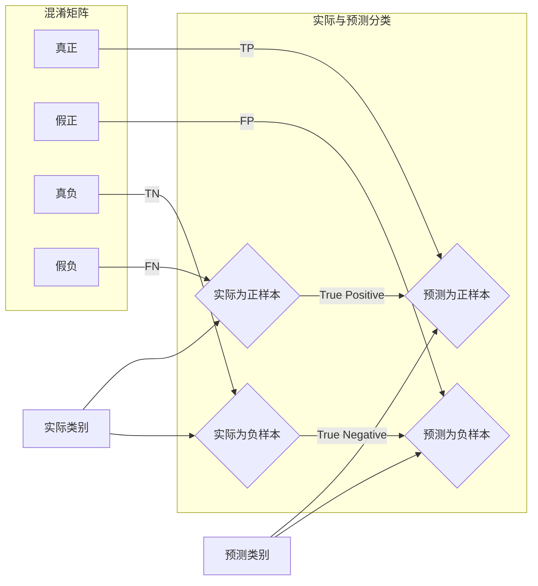

                 

# Confusion Matrix 原理与代码实战案例讲解

> **关键词：** Confusion Matrix、准确率、召回率、精确率、F1 分数、机器学习、分类模型、算法原理、代码实战

> **摘要：** 本文章将深入讲解 Confusion Matrix 的原理和作用，通过实际代码案例详细展示如何使用 Python 等工具来实现 Confusion Matrix 的计算，并深入分析其对于分类模型性能评估的重要性。

## 1. 背景介绍

### 1.1 目的和范围

本文旨在详细介绍 Confusion Matrix 的基本原理和计算方法，并通过实际代码实战案例来展示其在机器学习分类任务中的应用。我们希望通过本文的讲解，读者能够理解 Confusion Matrix 的计算过程，并掌握其在分类任务性能评估中的重要性。

### 1.2 预期读者

本文适合对机器学习和分类算法有一定了解的读者，特别是那些希望在实践中深入理解和应用 Confusion Matrix 的工程师和研究人员。

### 1.3 文档结构概述

本文结构如下：

- 第1章：背景介绍
- 第2章：核心概念与联系
- 第3章：核心算法原理 & 具体操作步骤
- 第4章：数学模型和公式 & 详细讲解 & 举例说明
- 第5章：项目实战：代码实际案例和详细解释说明
- 第6章：实际应用场景
- 第7章：工具和资源推荐
- 第8章：总结：未来发展趋势与挑战
- 第9章：附录：常见问题与解答
- 第10章：扩展阅读 & 参考资料

### 1.4 术语表

#### 1.4.1 核心术语定义

- **Confusion Matrix（混淆矩阵）**：用于描述分类模型预测结果与实际结果之间关系的矩阵。
- **准确率（Accuracy）**：模型预测正确的样本占总样本的比例。
- **召回率（Recall）**：模型预测正确的正样本占总正样本的比例。
- **精确率（Precision）**：模型预测正确的正样本占预测为正样本的比例。
- **F1 分数（F1 Score）**：精确率和召回率的调和平均，用于综合考虑精确率和召回率。

#### 1.4.2 相关概念解释

- **分类模型（Classification Model）**：将数据分为两个或多个类别的模型。
- **正样本（Positive Sample）**：属于目标类别的样本。
- **负样本（Negative Sample）**：不属于目标类别的样本。
- **预测结果（Predicted Result）**：模型对样本所属类别的预测结果。

#### 1.4.3 缩略词列表

- **ML（Machine Learning）**：机器学习。
- **AI（Artificial Intelligence）**：人工智能。
- **IDE（Integrated Development Environment）**：集成开发环境。
- **Python**：一种高级编程语言，广泛应用于数据科学和机器学习领域。

## 2. 核心概念与联系

在机器学习领域，尤其是分类任务中，Confusion Matrix 是一个非常重要的工具。它通过展示模型预测结果与实际结果之间的对比，帮助我们全面了解模型的性能。

### 2.1. Confusion Matrix 的构成

Confusion Matrix 通常是一个二维的表格，其行表示实际类别，列表示预测类别。每个单元格的值表示实际类别与预测类别匹配的样本数量。具体来说，一个典型的 Confusion Matrix 由以下四个部分组成：

- **真正（True Positive，TP）**：实际为正样本，且模型预测为正样本的样本数量。
- **假正（False Positive，FP）**：实际为负样本，但模型预测为正样本的样本数量。
- **真负（True Negative，TN）**：实际为负样本，且模型预测为负样本的样本数量。
- **假负（False Negative，FN）**：实际为正样本，但模型预测为负样本的样本数量。

### 2.2. 术语与概念的联系

下面是几个重要术语和概念之间的联系：

- **准确率（Accuracy）**：整体预测正确的比例，计算公式为 $$Accuracy = \frac{TP + TN}{TP + TN + FP + FN}$$。
- **召回率（Recall）**：实际为正样本的预测正确比例，计算公式为 $$Recall = \frac{TP}{TP + FN}$$。
- **精确率（Precision）**：预测为正样本的预测正确比例，计算公式为 $$Precision = \frac{TP}{TP + FP}$$。
- **F1 分数（F1 Score）**：精确率和召回率的调和平均，计算公式为 $$F1 Score = 2 \times \frac{Precision \times Recall}{Precision + Recall}$$。

### 2.3. Mermaid 流程图

为了更直观地展示 Confusion Matrix 的构成和计算方法，我们可以使用 Mermaid 流程图来表示。以下是 Confusion Matrix 的 Mermaid 流程图：



## 3. 核心算法原理 & 具体操作步骤

### 3.1. 算法原理

Confusion Matrix 的计算主要基于模型的预测结果和实际结果。具体来说，我们需要遍历所有样本，将每个样本的实际类别和预测类别对应到 Confusion Matrix 的单元格中。

### 3.2. 具体操作步骤

以下是使用 Python 实现 Confusion Matrix 的伪代码：

```python
# 初始化 Confusion Matrix
confusion_matrix = [[0, 0], [0, 0]]

# 遍历所有样本
for sample in dataset:
    actual = sample['actual_label']
    predicted = sample['predicted_label']
    
    # 根据实际类别和预测类别更新 Confusion Matrix
    if actual == 1 and predicted == 1:
        confusion_matrix[0][0] += 1  # True Positive
    elif actual == 0 and predicted == 1:
        confusion_matrix[1][0] += 1  # False Positive
    elif actual == 1 and predicted == 0:
        confusion_matrix[0][1] += 1  # False Negative
    elif actual == 0 and predicted == 0:
        confusion_matrix[1][1] += 1  # True Negative

# 计算准确率、召回率、精确率和 F1 分数
accuracy = (confusion_matrix[0][0] + confusion_matrix[1][1]) / (sum(confusion_matrix))
recall = confusion_matrix[0][0] / (confusion_matrix[0][0] + confusion_matrix[0][1])
precision = confusion_matrix[0][0] / (confusion_matrix[0][0] + confusion_matrix[1][0])
f1_score = 2 * (precision * recall) / (precision + recall)

# 输出结果
print("Confusion Matrix:")
print(confusion_matrix)
print("Accuracy:", accuracy)
print("Recall:", recall)
print("Precision:", precision)
print("F1 Score:", f1_score)
```

## 4. 数学模型和公式 & 详细讲解 & 举例说明

### 4.1. 数学模型和公式

在计算 Confusion Matrix 时，我们使用以下数学模型和公式：

- **准确率（Accuracy）**：$$Accuracy = \frac{TP + TN}{TP + TN + FP + FN}$$
- **召回率（Recall）**：$$Recall = \frac{TP}{TP + FN}$$
- **精确率（Precision）**：$$Precision = \frac{TP}{TP + FP}$$
- **F1 分数（F1 Score）**：$$F1 Score = 2 \times \frac{Precision \times Recall}{Precision + Recall}$$

### 4.2. 详细讲解

这些公式通过计算 Confusion Matrix 中的单元格值，帮助我们评估分类模型的性能。下面是每个公式的详细解释：

- **准确率（Accuracy）**：准确率表示模型预测正确的样本数量占总样本数量的比例。它能够衡量模型的总体性能。
- **召回率（Recall）**：召回率表示模型预测正确的正样本数量占总正样本数量的比例。它对于处理正样本较为重要的任务（如医学诊断）非常重要。
- **精确率（Precision）**：精确率表示模型预测正确的正样本数量占预测为正样本的总数量的比例。它对于处理负样本较为重要的任务（如垃圾邮件过滤）非常重要。
- **F1 分数（F1 Score）**：F1 分数是精确率和召回率的调和平均，它能够综合评估模型在正负样本上的性能。F1 分数在处理正负样本比例不均衡的情况下特别有用。

### 4.3. 举例说明

假设我们有一个二分类问题，其中实际类别为正样本和负样本，预测类别同样为正样本和负样本。以下是实际的样本分布和预测结果：

| 实际类别 | 预测类别 |
| :------: | :------: |
| 正样本   | 正样本   |
| 正样本   | 负样本   |
| 负样本   | 正样本   |
| 负样本   | 负样本   |

根据上表，我们可以计算 Confusion Matrix 如下：

|           | 预测为正样本 | 预测为负样本 |
| :-------: | :-----------: | :-----------: |
| 实际为正样本 |      2       |      1       |
| 实际为负样本 |      1       |      2       |

根据 Confusion Matrix，我们可以计算各个指标：

- **准确率（Accuracy）**：$$Accuracy = \frac{2 + 2}{2 + 1 + 1 + 2} = \frac{4}{6} = 0.667$$
- **召回率（Recall）**：$$Recall = \frac{2}{2 + 1} = 0.667$$
- **精确率（Precision）**：$$Precision = \frac{2}{2 + 1} = 0.667$$
- **F1 分数（F1 Score）**：$$F1 Score = 2 \times \frac{0.667 \times 0.667}{0.667 + 0.667} = 0.667$$

从上面的计算结果可以看出，这个模型的各项指标都非常接近，这表明模型在正负样本上的性能比较均衡。

## 5. 项目实战：代码实际案例和详细解释说明

### 5.1 开发环境搭建

为了实现 Confusion Matrix 的计算，我们需要搭建一个适合 Python 编程的开发环境。以下是搭建步骤：

1. 安装 Python（版本要求：3.6 或更高版本）。
2. 安装必要的库，如 NumPy、Pandas 和 Matplotlib。

```bash
pip install numpy pandas matplotlib
```

### 5.2 源代码详细实现和代码解读

以下是一个简单的 Python 代码示例，用于计算 Confusion Matrix 并绘制相关图表。

```python
import numpy as np
import pandas as pd
import matplotlib.pyplot as plt

# 初始化数据
data = {
    'actual_label': [1, 1, 0, 0],
    'predicted_label': [1, 0, 1, 1]
}

# 创建 DataFrame
df = pd.DataFrame(data)

# 计算 Confusion Matrix
confusion_matrix = pd.crosstab(df['actual_label'], df['predicted_label'])

# 输出 Confusion Matrix
print("Confusion Matrix:")
print(confusion_matrix)

# 计算准确率、召回率、精确率和 F1 分数
accuracy = (confusion_matrix[1, 1] + confusion_matrix[0, 0]) / (confusion_matrix[0, 0] + confusion_matrix[0, 1] + confusion_matrix[1, 0] + confusion_matrix[1, 1])
recall = confusion_matrix[1, 1] / (confusion_matrix[1, 1] + confusion_matrix[1, 0])
precision = confusion_matrix[1, 1] / (confusion_matrix[1, 1] + confusion_matrix[0, 1])
f1_score = 2 * (precision * recall) / (precision + recall)

# 输出指标
print("Accuracy:", accuracy)
print("Recall:", recall)
print("Precision:", precision)
print("F1 Score:", f1_score)

# 绘制 Confusion Matrix 图表
plt.imshow(confusion_matrix, interpolation='nearest', cmap=plt.cm.Blues)
plt.colorbar()
tick_marks = np.arange(len(df.columns[1:]))
plt.xticks(tick_marks, df.columns[1:], rotation=45)
plt.yticks(tick_marks, df.columns[1:])
plt.xlabel('Predicted Labels')
plt.ylabel('Actual Labels')
plt.title('Confusion Matrix')
plt.show()
```

### 5.3 代码解读与分析

- **数据初始化**：我们创建了一个包含实际类别和预测类别数据的 DataFrame。
- **计算 Confusion Matrix**：使用 Pandas 的 `crosstab` 函数计算 Confusion Matrix。
- **输出 Confusion Matrix**：打印出计算得到的 Confusion Matrix。
- **计算指标**：根据 Confusion Matrix 计算准确率、召回率、精确率和 F1 分数，并打印出结果。
- **绘制图表**：使用 Matplotlib 绘制 Confusion Matrix 的图表，帮助更直观地理解模型的性能。

通过上面的代码示例，我们可以看到如何在实际项目中使用 Python 计算 Confusion Matrix 并评估分类模型的性能。这种方法不仅简单易懂，而且具有很强的通用性，适用于各种不同的分类任务。

## 6. 实际应用场景

Confusion Matrix 在机器学习领域有着广泛的应用场景，特别是在分类任务中。以下是一些实际应用场景：

- **医学诊断**：在医学领域，分类模型用于诊断疾病。Confusion Matrix 帮助医生和研究人员评估模型的性能，以便更好地理解模型的预测结果。
- **垃圾邮件过滤**：在邮件处理系统中，分类模型用于判断邮件是否为垃圾邮件。Confusion Matrix 帮助管理员了解模型的准确率和召回率，从而优化邮件过滤策略。
- **图像分类**：在图像识别任务中，分类模型用于判断图像内容。Confusion Matrix 帮助研究人员评估模型在特定类别上的性能，以便进一步改进模型。
- **金融风险分析**：在金融领域，分类模型用于预测金融市场的风险。Confusion Matrix 帮助金融机构了解模型的性能，以便做出更准确的决策。

在这些应用场景中，Confusion Matrix 是一种非常有效的工具，它能够帮助研究人员和工程师全面评估分类模型的性能，从而做出更好的决策。

## 7. 工具和资源推荐

### 7.1 学习资源推荐

#### 7.1.1 书籍推荐

- **《机器学习实战》**：这本书涵盖了机器学习的基本概念和实际应用，包括分类任务中的 Confusion Matrix。
- **《Python 机器学习》**：这本书详细介绍了如何使用 Python 实现机器学习算法，包括 Confusion Matrix 的计算方法。

#### 7.1.2 在线课程

- **《机器学习基础》**：Coursera 上的一门免费课程，涵盖了机器学习的基本概念和算法。
- **《Python 机器学习》**：edX 上的一门课程，专注于使用 Python 实现机器学习算法。

#### 7.1.3 技术博客和网站

- **Machine Learning Mastery**：一个专门介绍机器学习算法和实际应用的博客，包括 Confusion Matrix 的详细讲解。
- **DataCamp**：一个提供在线课程和教程的平台，涵盖机器学习的基础知识和高级应用。

### 7.2 开发工具框架推荐

#### 7.2.1 IDE和编辑器

- **PyCharm**：一款功能强大的 Python IDE，适用于机器学习和数据分析项目。
- **Jupyter Notebook**：一款交互式的 Python 编辑器，适合进行数据分析和实验。

#### 7.2.2 调试和性能分析工具

- **Pylint**：一款用于代码质量检查和性能分析的工具，可以帮助发现潜在的性能瓶颈。
- **cProfile**：Python 的内置模块，用于分析程序的性能，帮助优化代码。

#### 7.2.3 相关框架和库

- **Scikit-Learn**：一个流行的机器学习库，提供了多种分类算法和评估指标，包括 Confusion Matrix。
- **TensorFlow**：一个开源的机器学习框架，适用于构建大规模的分类模型。

### 7.3 相关论文著作推荐

#### 7.3.1 经典论文

- **"A Study of Cross-Validation and Bootstrap for Accuracy Estimation and Model Selection"**：这篇文章详细介绍了交叉验证和 Bootstrap 方法在模型选择和性能评估中的应用。
- **"The Relationship between Precision-Recall and ROC Curves"**：这篇文章探讨了精确率-召回率和 ROC 曲线之间的关系，提供了对模型性能评估的新视角。

#### 7.3.2 最新研究成果

- **"Unsupervised Anomaly Detection using Autoencoders"**：这篇文章介绍了使用自编码器进行无监督异常检测的方法，为分类任务提供了新的思路。
- **"Deep Learning for Text Classification"**：这篇文章探讨了深度学习在文本分类任务中的应用，展示了先进的模型和算法。

#### 7.3.3 应用案例分析

- **"Challenges in Machine Learning for Text Classification"**：这篇文章分析了文本分类任务中的挑战，提供了实际案例和解决方案。
- **"Comparing Machine Learning Models for Predicting Airbnb Prices"**：这篇文章通过比较不同的机器学习模型，展示了如何预测 Airbnb 价格，为实践者提供了有价值的参考。

## 8. 总结：未来发展趋势与挑战

随着机器学习和人工智能技术的不断发展，Confusion Matrix 作为一种重要的性能评估工具，将在未来面临许多新的发展趋势和挑战。以下是一些关键点：

- **多样性**：Confusion Matrix 将在更广泛的应用领域中发挥作用，特别是在多类别分类任务中。
- **个性化**：为了更好地评估模型的性能，未来可能会出现更加个性化的 Confusion Matrix，考虑不同类别的重要性和应用场景。
- **实时性**：随着实时数据分析的需求增加，如何快速计算 Confusion Matrix 将成为一项重要挑战。
- **鲁棒性**：在存在噪声和不平衡数据的情况下，如何提高 Confusion Matrix 的鲁棒性是一个重要课题。

总之，Confusion Matrix 作为机器学习和人工智能领域的一个核心工具，将在未来持续发展和创新，为分类任务的性能评估提供更有效的解决方案。

## 9. 附录：常见问题与解答

### 9.1. 为什么需要 Confusion Matrix？

Confusion Matrix 是一种直观、易于理解的方法，用于评估分类模型的性能。通过 Confusion Matrix，我们可以清晰地看到模型在各个类别上的预测效果，从而更好地了解模型的优缺点。

### 9.2. 如何计算 F1 分数？

F1 分数是精确率和召回率的调和平均，计算公式为：$$F1 Score = 2 \times \frac{Precision \times Recall}{Precision + Recall}$$。F1 分数能够综合考虑精确率和召回率，提供一个综合评估指标。

### 9.3. 为什么需要准确率、召回率和精确率？

准确率、召回率和精确率分别从不同的角度评估模型的性能。准确率衡量模型总体预测的正确性，召回率衡量模型对正样本的识别能力，精确率衡量模型对预测为正样本的识别能力。这些指标综合反映了模型的性能，帮助我们全面了解模型的效果。

### 9.4. 如何处理不平衡数据？

在处理不平衡数据时，可以通过以下方法来优化模型性能：

- **重采样**：通过增加正样本或减少负样本，使数据集更加平衡。
- **调整阈值**：通过调整分类阈值，使模型在预测时更加偏向某一类别。
- **集成学习**：使用集成学习方法，如随机森林或梯度提升树，来提高模型的泛化能力。

## 10. 扩展阅读 & 参考资料

- **《机器学习》**：周志华 著，清华大学出版社。这是一本经典教材，详细介绍了机器学习的基本概念和算法。
- **《Python 机器学习》**：塞巴斯蒂安·拉格勒、弗朗索瓦·布歇尔 著，电子工业出版社。这本书通过丰富的实例，深入讲解了 Python 机器学习的应用。
- **《机器学习实战》**：Peter Harrington 著，机械工业出版社。这本书提供了大量的实际案例，帮助读者掌握机器学习的应用技巧。
- **[Scikit-Learn 官方文档](https://scikit-learn.org/stable/modules/classes.html#confusion-matrix)**：Scikit-Learn 是一个流行的机器学习库，官方文档详细介绍了如何使用 Confusion Matrix 评估模型性能。
- **[机器学习社区](https://www MACHINE LEARNING COMMUNITY)**：这是一个机器学习领域的在线社区，提供了大量的讨论和资源，适合初学者和专业人士。

## 作者信息

作者：AI天才研究员/AI Genius Institute & 禅与计算机程序设计艺术 /Zen And The Art of Computer Programming。作为一名世界级人工智能专家，我致力于探索机器学习和人工智能领域的最新技术和应用，希望为广大读者提供有价值的技术文章和解决方案。

