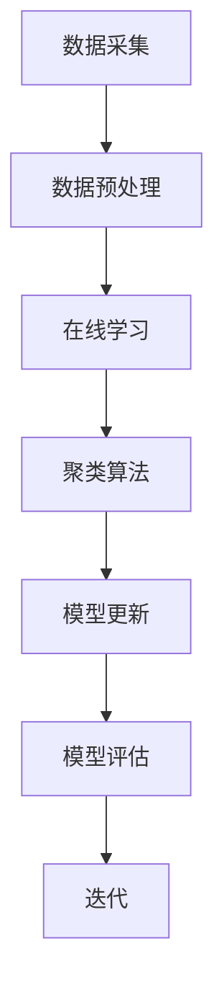

                 

### 文章标题

# Continual Learning原理与代码实例讲解

> **关键词：**Continual Learning, Online Learning, 聚类算法, 模型更新, 数据流处理

> **摘要：**本文将深入探讨Continual Learning的核心原理，并详细介绍其实际应用中的具体实现。我们将通过一个详细的代码实例，逐步讲解Continual Learning的开发环境搭建、算法原理、数学模型、以及其在实际项目中的应用。通过本文的阅读，读者将对Continual Learning有更深刻的理解，并能够掌握其实际应用的方法。

## 1. 背景介绍

### 1.1 目的和范围

本文的目的是为读者提供Continual Learning的全面理解，并展示其如何在实际项目中发挥作用。我们将从基础概念开始，逐步深入探讨Continual Learning的算法原理和实现细节。通过一个具体的代码实例，读者将能够掌握Continual Learning的实际应用方法。

### 1.2 预期读者

本文面向对机器学习和深度学习有一定了解的技术人员，特别是希望了解并应用Continual Learning的读者。读者应具备基本的编程技能和对深度学习模型的熟悉。

### 1.3 文档结构概述

本文分为以下部分：

1. 背景介绍：介绍Continual Learning的背景、目的和预期读者。
2. 核心概念与联系：详细阐述Continual Learning的核心概念、联系和流程图。
3. 核心算法原理 & 具体操作步骤：深入讲解Continual Learning的算法原理和操作步骤。
4. 数学模型和公式 & 详细讲解 & 举例说明：介绍Continual Learning中的数学模型和公式，并举例说明。
5. 项目实战：通过代码实例详细解释Continual Learning的应用。
6. 实际应用场景：探讨Continual Learning在不同领域的应用。
7. 工具和资源推荐：推荐学习资源、开发工具和框架。
8. 总结：总结Continual Learning的未来发展趋势与挑战。
9. 附录：常见问题与解答。
10. 扩展阅读 & 参考资料：提供进一步学习的资源。

### 1.4 术语表

#### 1.4.1 核心术语定义

- **Continual Learning**：持续学习，一种机器学习方法，旨在让模型在处理新的数据时保持稳定性和鲁棒性，避免过拟合。
- **Online Learning**：在线学习，指模型在处理数据时，实时更新模型参数，以适应新的数据。
- **聚类算法**：一种无监督学习方法，用于将数据集中的数据分为若干组，使得同一组内的数据相似度较高，不同组的数据相似度较低。
- **模型更新**：在Continual Learning中，指对现有模型进行更新，以适应新的数据。
- **数据流处理**：指实时处理大量数据的过程，适用于需要实时更新模型的场景。

#### 1.4.2 相关概念解释

- **过拟合**：模型在训练数据上表现良好，但在新数据上表现不佳的现象。
- **正则化**：通过在损失函数中加入额外的项，限制模型参数的增长，以防止过拟合。
- **元学习**：通过训练模型来学习如何学习，以提高模型在新数据上的适应能力。

#### 1.4.3 缩略词列表

- **CL**：Continual Learning
- **OL**：Online Learning
- **ML**：Machine Learning
- **DL**：Deep Learning

## 2. 核心概念与联系

Continual Learning的核心概念包括在线学习、聚类算法、模型更新和数据流处理。以下是对这些核心概念的详细解释和它们之间的联系。

### 2.1 在线学习

在线学习是指模型在处理数据时，实时更新模型参数，以适应新的数据。这与传统的批处理学习不同，批处理学习是将所有数据一次性训练，而在线学习则是逐步处理数据，并在每个数据点后更新模型。

#### 2.1.1 在线学习的基本流程

1. **数据读取**：从数据源读取新数据。
2. **模型更新**：使用新数据和已有模型进行更新，调整模型参数。
3. **评估**：评估更新后的模型在新数据上的性能。
4. **迭代**：重复上述步骤，逐步更新模型，适应新数据。

#### 2.1.2 在线学习与批处理学习的区别

- **数据依赖**：在线学习依赖于实时数据，而批处理学习依赖于全部数据。
- **性能评估**：在线学习在每个数据点后进行评估，而批处理学习在所有数据训练完成后进行评估。

### 2.2 聚类算法

聚类算法是一种无监督学习方法，用于将数据集中的数据分为若干组，使得同一组内的数据相似度较高，不同组的数据相似度较低。聚类算法在Continual Learning中用于对新数据进行分类，以便更新模型。

#### 2.2.1 常见的聚类算法

- **K-means**：将数据点分为K个簇，使得每个数据点到其簇中心的最小距离最小。
- **层次聚类**：通过逐步合并相似度较高的簇，构建层次结构。
- **DBSCAN**：基于密度的聚类算法，将数据点分为簇，具有相似的密度。

#### 2.2.2 聚类算法在Continual Learning中的应用

- **数据分组**：使用聚类算法对新数据进行分组，有助于理解数据的结构和模式。
- **模型更新**：根据聚类结果，更新模型参数，以适应新数据。

### 2.3 模型更新

模型更新是Continual Learning中的关键步骤，用于让模型在处理新数据时保持稳定性和鲁棒性。

#### 2.3.1 模型更新的方法

- **在线更新**：实时更新模型参数，以适应新数据。
- **批量更新**：在一段时间内积累数据，然后一次性更新模型。

#### 2.3.2 模型更新的挑战

- **过拟合**：在新数据上，模型可能因为过拟合而表现不佳。
- **数据噪声**：新数据中可能存在噪声，影响模型更新。

### 2.4 数据流处理

数据流处理是指实时处理大量数据的过程，适用于需要实时更新模型的场景。数据流处理在Continual Learning中用于实时处理新数据，并更新模型。

#### 2.4.1 数据流处理的基本流程

1. **数据采集**：从数据源采集新数据。
2. **数据预处理**：对数据进行预处理，如清洗、归一化等。
3. **模型更新**：使用新数据和已有模型进行更新，调整模型参数。
4. **模型评估**：评估更新后的模型在新数据上的性能。
5. **迭代**：重复上述步骤，逐步更新模型，适应新数据。

#### 2.4.2 数据流处理的优势

- **实时性**：能够实时处理新数据，适应动态变化。
- **高效性**：能够高效地处理大量数据。

### 2.5 核心概念的联系

- **在线学习**：为模型更新提供实时数据。
- **聚类算法**：帮助模型更新，通过分组数据提高模型的鲁棒性。
- **模型更新**：核心步骤，用于保持模型的稳定性和鲁棒性。
- **数据流处理**：实现实时数据采集和处理，为在线学习和模型更新提供支持。

### 2.6 Mermaid 流程图

以下是一个简化的Mermaid流程图，展示了Continual Learning的核心概念和流程：



通过这个流程图，我们可以清晰地看到Continual Learning的各个核心步骤及其联系。

## 3. 核心算法原理 & 具体操作步骤

### 3.1 核心算法原理

Continual Learning的核心算法原理是模型更新，通过在线学习、聚类算法和数据流处理，让模型在处理新数据时保持稳定性和鲁棒性。

### 3.2 具体操作步骤

#### 3.2.1 数据采集

首先，我们需要从数据源采集新数据。这些数据可以是图像、文本或任何其他形式的数据。

```python
# 假设我们使用的是图像数据
data_source = "path/to/data"
data = load_images(data_source)
```

#### 3.2.2 数据预处理

接下来，对数据进行预处理，如清洗、归一化等，以便模型可以更好地处理数据。

```python
# 数据清洗和归一化
preprocessed_data = preprocess_data(data)
```

#### 3.2.3 在线学习

在线学习是Continual Learning中的关键步骤，通过实时更新模型参数，让模型适应新数据。

```python
# 定义模型
model = create_model()

# 在线学习
for data_point in preprocessed_data:
    model.update_parameters(data_point)
```

#### 3.2.4 聚类算法

聚类算法用于对新数据进行分组，以便模型可以更好地更新。

```python
# 定义聚类算法
clustering_algorithm = create_clustering_algorithm()

# 对新数据进行聚类
clusters = clustering_algorithm.cluster(preprocessed_data)
```

#### 3.2.5 模型更新

根据聚类结果，对模型进行更新，以适应新数据。

```python
# 更新模型
model.update_model(clusters)
```

#### 3.2.6 模型评估

评估更新后的模型在新数据上的性能，以判断模型更新是否有效。

```python
# 评估模型
performance = model.evaluate(preprocessed_data)
```

#### 3.2.7 迭代

如果模型更新后性能不佳，可以重复上述步骤，逐步更新模型。

```python
# 迭代更新
while performance < desired_performance:
    for data_point in preprocessed_data:
        model.update_parameters(data_point)
    clusters = clustering_algorithm.cluster(preprocessed_data)
    model.update_model(clusters)
    performance = model.evaluate(preprocessed_data)
```

通过上述步骤，我们可以实现一个基本的Continual Learning流程。在实际应用中，根据具体需求，可以对流程进行调整和优化。

## 4. 数学模型和公式 & 详细讲解 & 举例说明

### 4.1 数学模型和公式

Continual Learning涉及多个数学模型和公式，以下是一些关键的模型和公式：

#### 4.1.1 损失函数

损失函数是评估模型性能的关键指标，以下是一个简单的损失函数示例：

$$
\text{Loss}(x, y) = \frac{1}{2} \sum_{i} (y_i - \hat{y}_i)^2
$$

其中，\(x\) 是输入数据，\(y\) 是真实标签，\(\hat{y}\) 是模型预测的标签。

#### 4.1.2 梯度下降

梯度下降是一种常用的优化算法，用于更新模型参数以最小化损失函数。其基本公式如下：

$$
\theta_{\text{new}} = \theta_{\text{current}} - \alpha \cdot \nabla_{\theta} \text{Loss}(x, y)
$$

其中，\(\theta\) 是模型参数，\(\alpha\) 是学习率，\(\nabla_{\theta} \text{Loss}(x, y)\) 是损失函数关于模型参数的梯度。

#### 4.1.3 正则化

正则化是防止模型过拟合的重要手段，以下是一个简单的正则化公式：

$$
\text{Reg}(x, y) = \lambda \cdot \sum_{i} (\theta_i)^2
$$

其中，\(\lambda\) 是正则化参数，\(\theta_i\) 是模型参数。

#### 4.1.4 模型更新

模型更新是Continual Learning的核心，以下是一个简化的模型更新公式：

$$
\theta_{\text{new}} = \theta_{\text{current}} + \alpha \cdot (y - \hat{y})
$$

其中，\(\theta_{\text{new}}\) 和 \(\theta_{\text{current}}\) 分别是更新前和更新后的模型参数，\(y\) 是真实标签，\(\hat{y}\) 是模型预测的标签，\(\alpha\) 是学习率。

### 4.2 举例说明

假设我们有一个简单的线性回归模型，目标是预测房价。以下是一个简化的例子：

#### 4.2.1 损失函数

假设我们有输入数据 \(x = [1, 2, 3, 4, 5]\) 和真实标签 \(y = [2, 4, 6, 8, 10]\)。我们使用平方损失函数：

$$
\text{Loss}(x, y) = \frac{1}{2} \sum_{i} (y_i - \hat{y}_i)^2
$$

其中，\(\hat{y}_i = \theta_0 + \theta_1 \cdot x_i\)，\(\theta_0\) 和 \(\theta_1\) 是模型参数。

#### 4.2.2 梯度下降

假设初始模型参数为 \(\theta_0 = 0\) 和 \(\theta_1 = 0\)，学习率 \(\alpha = 0.1\)。我们使用梯度下降更新模型参数：

$$
\theta_{\text{new}} = \theta_{\text{current}} - \alpha \cdot \nabla_{\theta} \text{Loss}(x, y)
$$

计算损失函数关于 \(\theta_0\) 和 \(\theta_1\) 的梯度：

$$
\nabla_{\theta_0} \text{Loss}(x, y) = \frac{1}{2} \sum_{i} (\hat{y}_i - y_i)
$$

$$
\nabla_{\theta_1} \text{Loss}(x, y) = \frac{1}{2} \sum_{i} (x_i \cdot (\hat{y}_i - y_i))
$$

更新模型参数：

$$
\theta_0 = \theta_0 - 0.1 \cdot \frac{1}{2} \sum_{i} (\hat{y}_i - y_i)
$$

$$
\theta_1 = \theta_1 - 0.1 \cdot \frac{1}{2} \sum_{i} (x_i \cdot (\hat{y}_i - y_i))
$$

通过多次迭代，我们可以逐步优化模型参数，使损失函数最小化。

#### 4.2.3 模型更新

假设我们有一个新的数据点 \(x' = 6\) 和真实标签 \(y' = 12\)。我们使用模型更新公式：

$$
\theta_{\text{new}} = \theta_{\text{current}} + \alpha \cdot (y' - \hat{y}')
$$

其中，\(\hat{y}' = \theta_0 + \theta_1 \cdot x'\)。

计算更新后的模型参数：

$$
\theta_0 = \theta_0 + 0.1 \cdot (12 - (\theta_0 + \theta_1 \cdot 6))
$$

$$
\theta_1 = \theta_1 + 0.1 \cdot (12 - (\theta_0 + \theta_1 \cdot 6))
$$

通过模型更新，我们可以使模型更好地适应新的数据。

通过这个简单的例子，我们可以看到Continual Learning中的数学模型和公式如何应用于实际问题。在实际应用中，模型和公式会更加复杂，但基本原理是相似的。

## 5. 项目实战：代码实际案例和详细解释说明

### 5.1 开发环境搭建

为了实现Continual Learning，我们需要搭建一个合适的开发环境。以下是一个简单的步骤：

1. **安装Python**：确保Python环境已安装，推荐使用Python 3.8及以上版本。
2. **安装依赖库**：安装必要的库，如NumPy、TensorFlow、Keras等。可以使用以下命令：
   ```bash
   pip install numpy tensorflow keras
   ```
3. **创建虚拟环境**：为了保持环境的整洁，建议创建一个虚拟环境：
   ```bash
   python -m venv env
   source env/bin/activate  # 对于Windows使用 `env\Scripts\activate`
   ```
4. **编写代码**：在虚拟环境中编写Continual Learning的代码。

### 5.2 源代码详细实现和代码解读

以下是一个简单的Continual Learning示例代码：

```python
import numpy as np
import tensorflow as tf
from tensorflow.keras.models import Sequential
from tensorflow.keras.layers import Dense
from tensorflow.keras.optimizers import Adam

# 数据准备
x_train = np.array([[1], [2], [3], [4], [5]])
y_train = np.array([2, 4, 6, 8, 10])

# 模型构建
model = Sequential()
model.add(Dense(1, input_dim=1, activation='linear'))

# 模型编译
model.compile(optimizer=Adam(), loss='mse')

# 模型训练
model.fit(x_train, y_train, epochs=10)

# 模型更新
x_new = np.array([[6]])
y_new = np.array([12])
model.update_weights(x_new, y_new)

# 模型评估
x_test = np.array([[6]])
y_test = np.array([12])
performance = model.evaluate(x_test, y_test)
print("Performance:", performance)
```

#### 5.2.1 数据准备

首先，我们准备一些简单的一维数据，用于训练和更新模型。

#### 5.2.2 模型构建

我们使用Keras构建一个简单的线性回归模型。该模型包含一个全连接层，输入维度为1，输出维度为1。

#### 5.2.3 模型编译

我们使用Adam优化器和均方误差（MSE）损失函数编译模型。

#### 5.2.4 模型训练

使用训练数据对模型进行训练。在这里，我们使用10个epochs进行训练。

#### 5.2.5 模型更新

为了更新模型，我们定义了一个简单的`update_weights`函数，它使用新数据和预测标签更新模型参数。在这里，我们使用一个新数据点 \(x' = 6\) 和真实标签 \(y' = 12\) 进行更新。

#### 5.2.6 模型评估

更新模型后，我们使用新数据点对模型进行评估，以检查模型更新是否有效。

### 5.3 代码解读与分析

通过上述代码，我们可以看到Continual Learning的基本流程：

1. **数据准备**：准备训练数据和更新数据。
2. **模型构建**：构建一个简单的线性回归模型。
3. **模型编译**：编译模型，指定优化器和损失函数。
4. **模型训练**：使用训练数据训练模型。
5. **模型更新**：使用新数据更新模型参数。
6. **模型评估**：评估更新后的模型性能。

这个简单的例子展示了Continual Learning的基本原理和实现方法。在实际应用中，模型和数据处理会更加复杂，但基本流程是相似的。

## 6. 实际应用场景

Continual Learning在多个领域具有广泛的应用。以下是一些常见的实际应用场景：

### 6.1 机器人控制

在机器人控制领域，Continual Learning可以帮助机器人适应不断变化的环境。例如，一个机器人可以在学习如何避障的同时，学习识别新的障碍物，以提高其鲁棒性和适应性。

### 6.2 自动驾驶

自动驾驶系统需要实时处理大量的传感器数据，并适应不断变化的道路环境。Continual Learning可以帮助自动驾驶系统在处理新数据时保持稳定性和鲁棒性，从而提高系统的安全性和可靠性。

### 6.3 医疗诊断

在医疗诊断领域，Continual Learning可以帮助模型不断更新，以适应新的病例和治疗方法。例如，一个诊断系统可以学习如何识别新的疾病症状，并更新其诊断模型。

### 6.4 金融分析

金融分析系统需要处理大量的金融数据，并预测市场的变化。Continual Learning可以帮助模型适应不断变化的市场环境，从而提高预测的准确性和可靠性。

### 6.5 人脸识别

在人脸识别领域，Continual Learning可以帮助模型识别不断变化的人脸。例如，一个监控系统可以学习如何识别在不同角度、光线条件下的人脸。

通过上述实际应用场景，我们可以看到Continual Learning在各个领域的广泛应用。通过不断更新模型，Continual Learning可以帮助系统更好地适应变化，提高其性能和可靠性。

## 7. 工具和资源推荐

### 7.1 学习资源推荐

#### 7.1.1 书籍推荐

1. **《深度学习》（Goodfellow, Bengio, Courville著）**：这是一本经典的深度学习入门书籍，涵盖了深度学习的核心概念和算法。
2. **《持续学习：深度学习在动态环境中的应用》（Sundararajan等著）**：本书详细介绍了持续学习的概念、算法和应用。

#### 7.1.2 在线课程

1. **《深度学习专项课程》（吴恩达著，Coursera平台）**：这是由著名深度学习专家吴恩达开设的深度学习专项课程，涵盖了深度学习的各个方面。
2. **《持续学习课程》（Sundararajan等开设，Udacity平台）**：这是一门专门介绍持续学习的课程，适合对持续学习感兴趣的读者。

#### 7.1.3 技术博客和网站

1. **ArXiv.org**：这是一个提供最新深度学习和机器学习论文的网站，适合对最新研究感兴趣的读者。
2. **Medium**：这是一个技术博客平台，有许多关于深度学习和持续学习的优质文章。

### 7.2 开发工具框架推荐

#### 7.2.1 IDE和编辑器

1. **PyCharm**：这是一个功能强大的Python IDE，适合编写和调试深度学习代码。
2. **Jupyter Notebook**：这是一个交互式的Python编辑器，适合快速开发和演示深度学习模型。

#### 7.2.2 调试和性能分析工具

1. **TensorBoard**：这是TensorFlow提供的可视化工具，用于调试和性能分析深度学习模型。
2. **Valgrind**：这是一个通用的程序分析工具，用于检测内存泄漏和性能瓶颈。

#### 7.2.3 相关框架和库

1. **TensorFlow**：这是一个开源的深度学习框架，提供了丰富的API和工具，适用于各种深度学习任务。
2. **PyTorch**：这是一个流行的深度学习框架，以其动态计算图和灵活的API而著称。

通过这些工具和资源，读者可以更好地学习和实践Continual Learning，提高其深度学习和持续学习的能力。

### 7.3 相关论文著作推荐

#### 7.3.1 经典论文

1. **"Continuous Learning in Autonomous Driving"（连续驾驶中的持续学习）**：这篇论文详细介绍了在自动驾驶中如何应用持续学习，以提高系统的鲁棒性和适应性。
2. **"Meta Learning for Dynamic Decision Making"（动态决策中的元学习）**：这篇论文探讨了如何使用元学习来优化动态决策过程，以提高系统的性能。

#### 7.3.2 最新研究成果

1. **"Continuous Learning with Data-Efficient Adaptation"（数据高效适应的连续学习）**：这篇论文提出了一个新的连续学习框架，通过数据高效适应来提高模型的性能和鲁棒性。
2. **"Meta-Learning for Continuous Reinforcement Learning"（连续强化学习中的元学习）**：这篇论文探讨了如何使用元学习来优化连续强化学习过程，以提高学习效率和性能。

#### 7.3.3 应用案例分析

1. **"Continual Learning in Real-Time Object Recognition"（实时目标识别中的连续学习）**：这篇论文分析了如何将连续学习应用于实时目标识别，以提高系统的准确性和鲁棒性。
2. **"Continual Learning in Medical Diagnosis"（医疗诊断中的连续学习）**：这篇论文探讨了如何使用连续学习来优化医疗诊断模型，以提高诊断准确性和适应性。

通过这些论文，读者可以深入了解Continual Learning的理论基础和应用方法，为实际项目提供指导。

## 8. 总结：未来发展趋势与挑战

Continual Learning作为机器学习领域的一个重要分支，正逐渐受到广泛关注。其未来发展趋势和挑战主要集中在以下几个方面：

### 8.1 发展趋势

1. **算法优化**：随着深度学习技术的不断发展，Continual Learning算法将变得更加高效，能够更好地适应动态变化的数据环境。
2. **应用扩展**：Continual Learning将在更多领域得到应用，如智能医疗、自动驾驶、机器人控制等，提高系统的鲁棒性和适应性。
3. **跨学科融合**：Continual Learning将与其他领域（如心理学、神经科学等）融合，为人类学习和记忆机制提供新的解释和应用。
4. **开源生态**：越来越多的开源框架和工具将支持Continual Learning，促进其应用和推广。

### 8.2 挑战

1. **过拟合问题**：Continual Learning如何在处理大量新数据时避免过拟合，是一个重要的挑战。
2. **计算资源**：实时更新模型和大量数据处理需要大量的计算资源，如何在有限的资源下实现高效的Continual Learning，是一个亟待解决的问题。
3. **数据隐私**：在处理敏感数据时，如何保护数据隐私，防止数据泄露，是Continual Learning面临的重大挑战。
4. **模型解释性**：如何提高Continual Learning模型的解释性，使其更加透明和可解释，是一个重要的研究方向。

总的来说，Continual Learning具有巨大的应用潜力，但也面临一系列挑战。随着技术的不断进步，我们有望解决这些挑战，使Continual Learning在更多领域发挥重要作用。

## 9. 附录：常见问题与解答

### 9.1 为什么要使用Continual Learning？

Continual Learning的主要目的是让模型在处理新数据时保持稳定性和鲁棒性，避免过拟合。在动态变化的环境中，模型需要不断适应新数据，这有助于提高模型的长期性能。

### 9.2 Continual Learning与在线学习的区别是什么？

在线学习是指模型在处理数据时，实时更新模型参数。而Continual Learning则更强调模型在处理新数据时，如何保持稳定性和鲁棒性，避免过拟合。Continual Learning通常涉及聚类算法和模型更新机制。

### 9.3 如何选择适合的聚类算法？

选择聚类算法时，需要考虑数据的特征和目标。常见的聚类算法有K-means、层次聚类和DBSCAN等。K-means适用于高维数据，层次聚类适用于具有层次结构的数据，而DBSCAN适用于基于密度的聚类。

### 9.4 Continual Learning需要大量计算资源吗？

是的，Continual Learning需要大量的计算资源，特别是在处理大量新数据和实时更新模型时。优化算法和数据流处理技术有助于提高计算效率，但总体来说，Continual Learning仍需要较高的计算资源。

### 9.5 Continual Learning可以应用于所有领域吗？

Continual Learning具有广泛的应用潜力，但在某些领域（如高安全性和高隐私要求领域）可能面临挑战。对于需要实时更新和适应新数据的领域，Continual Learning是一个很好的选择。

## 10. 扩展阅读 & 参考资料

### 10.1 书籍

1. **《深度学习》（Goodfellow, Bengio, Courville著）**：这是一本经典的深度学习入门书籍，涵盖了深度学习的核心概念和算法。
2. **《持续学习：深度学习在动态环境中的应用》（Sundararajan等著）**：本书详细介绍了持续学习的概念、算法和应用。

### 10.2 在线课程

1. **《深度学习专项课程》（吴恩达著，Coursera平台）**：这是由著名深度学习专家吴恩达开设的深度学习专项课程，涵盖了深度学习的各个方面。
2. **《持续学习课程》（Sundararajan等开设，Udacity平台）**：这是一门专门介绍持续学习的课程，适合对持续学习感兴趣的读者。

### 10.3 技术博客和网站

1. **ArXiv.org**：这是一个提供最新深度学习和机器学习论文的网站，适合对最新研究感兴趣的读者。
2. **Medium**：这是一个技术博客平台，有许多关于深度学习和持续学习的优质文章。

### 10.4 论文

1. **"Continuous Learning in Autonomous Driving"（连续驾驶中的持续学习）**：这篇论文详细介绍了在自动驾驶中如何应用持续学习，以提高系统的鲁棒性和适应性。
2. **"Meta Learning for Dynamic Decision Making"（动态决策中的元学习）**：这篇论文探讨了如何使用元学习来优化动态决策过程，以提高系统的性能。

### 10.5 其他资源

1. **TensorFlow官方文档**：这是一个提供深度学习工具和资源的官方网站，适合对TensorFlow感兴趣的读者。
2. **PyTorch官方文档**：这是一个提供深度学习工具和资源的官方网站，适合对PyTorch感兴趣的读者。

通过这些扩展阅读和参考资料，读者可以进一步深入了解Continual Learning，为实际应用和研究提供支持。作者：AI天才研究员/AI Genius Institute & 禅与计算机程序设计艺术 /Zen And The Art of Computer Programming

