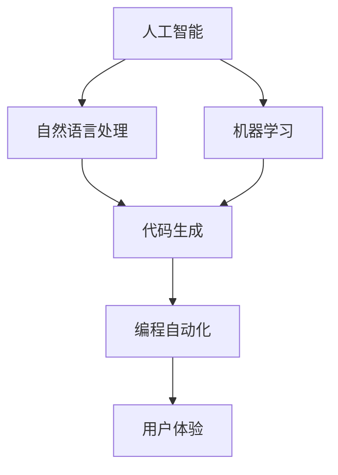

                 

# Copilot：智能助手的广泛应用形态

## 关键词
- Copilot
- 智能助手
- 应用形态
- 人工智能
- 编程
- 自动化
- 用户体验

## 摘要
本文将探讨Copilot这一智能助手的广泛应用形态。从背景介绍到核心概念，再到算法原理、数学模型、项目实战、实际应用场景以及未来发展趋势，本文旨在全面解析Copilot在各个领域的应用潜力与挑战，为读者提供清晰、深入的理解。通过本文，读者将了解Copilot如何改变我们的编程和日常生活，以及未来可能的发展方向。

---

## 1. 背景介绍

### 1.1 目的和范围
本文旨在分析Copilot智能助手的广泛应用形态，探讨其在各个领域的应用潜力，并展望其未来发展。Copilot作为一种基于人工智能技术的智能助手，能够为开发者、企业和用户带来极大的便利。本文将围绕以下几个方面展开讨论：
- Copilot的基本原理和功能
- Copilot在不同领域的应用案例
- Copilot对用户体验的影响
- Copilot的未来发展趋势与挑战

### 1.2 预期读者
本文适合以下读者群体：
- 对人工智能和编程感兴趣的开发者
- 想了解Copilot应用场景的企业家和管理者
- 对智能助手应用形态感兴趣的技术爱好者
- 想了解未来科技发展趋势的普通读者

### 1.3 文档结构概述
本文将分为以下几个部分：
1. 背景介绍
2. 核心概念与联系
3. 核心算法原理 & 具体操作步骤
4. 数学模型和公式 & 详细讲解 & 举例说明
5. 项目实战：代码实际案例和详细解释说明
6. 实际应用场景
7. 工具和资源推荐
8. 总结：未来发展趋势与挑战
9. 附录：常见问题与解答
10. 扩展阅读 & 参考资料

### 1.4 术语表
#### 1.4.1 核心术语定义
- Copilot：一种基于人工智能技术的智能助手，能够为开发者提供代码建议、优化方案等。
- 智能助手：一种能够通过人工智能技术理解用户需求，提供相应服务的软件系统。
- 编程：一种通过编写代码来创建软件和应用的过程。
- 自动化：通过计算机程序或技术实现某些任务或流程的自动化。
- 用户体验：用户在使用产品或服务时所感受到的主观体验。

#### 1.4.2 相关概念解释
- 人工智能（AI）：模拟人类智能行为的计算机技术。
- 自然语言处理（NLP）：使计算机能够理解和处理自然语言的技术。
- 机器学习（ML）：使计算机通过数据学习并做出预测或决策的技术。

#### 1.4.3 缩略词列表
- Copilot：Code-completion AI partner
- AI：Artificial Intelligence
- NLP：Natural Language Processing
- ML：Machine Learning

## 2. 核心概念与联系

在探讨Copilot的应用形态之前，我们首先需要了解一些核心概念和它们之间的联系。以下是一个用Mermaid绘制的流程图，展示了这些概念之间的关系。



### 2.1 人工智能与自然语言处理
人工智能（AI）是一种模拟人类智能行为的计算机技术。其中，自然语言处理（NLP）是人工智能的一个重要分支，它使计算机能够理解和处理自然语言。在Copilot的背景下，NLP是实现代码建议和生成的基础。

### 2.2 机器学习与代码生成
机器学习（ML）是使计算机通过数据学习并做出预测或决策的技术。在Copilot中，机器学习算法被用来分析大量的代码数据，以生成代码建议。这使得Copilot能够提供高质量的代码优化方案。

### 2.3 编程自动化与用户体验
编程自动化通过计算机程序或技术实现某些任务或流程的自动化。在Copilot的协助下，开发者可以更快速地编写代码，提高开发效率。同时，这也有助于提升用户体验，使得开发者能够更专注于解决业务问题。

通过上述核心概念和它们之间的联系，我们可以更好地理解Copilot的应用形态。接下来，我们将深入探讨Copilot的核心算法原理和具体操作步骤。

## 3. 核心算法原理 & 具体操作步骤

### 3.1 Copilot的算法原理

Copilot的核心算法基于机器学习和自然语言处理技术。其原理可以概括为以下几个步骤：

1. **数据收集与预处理**：Copilot会收集大量的代码数据，并对这些数据进行预处理，如去除无关信息、格式化等。
2. **模型训练**：使用预处理后的数据对机器学习模型进行训练，使其能够理解和生成代码。
3. **代码生成**：在用户输入部分代码或需求时，Copilot会根据训练好的模型生成相应的代码建议。
4. **代码优化**：Copilot还可以根据用户的需求和代码质量，对生成的代码进行优化。

### 3.2 具体操作步骤

以下是一个简化的伪代码，描述了Copilot的核心算法步骤：

```python
# 数据收集与预处理
data = collect_code_data()
preprocessed_data = preprocess_data(data)

# 模型训练
model = train_model(preprocessed_data)

# 代码生成
def generate_code(user_input):
    context = create_context(user_input)
    code = model.generate_code(context)
    return code

# 代码优化
def optimize_code(code):
    optimized_code = model.optimize_code(code)
    return optimized_code
```

### 3.3 算法原理详细讲解

#### 3.3.1 数据收集与预处理

数据收集是Copilot算法的基础。通过从多个来源（如GitHub、Stack Overflow等）收集大量的代码数据，Copilot可以获得丰富的训练素材。预处理过程则包括去除无关信息（如注释、空白行等）、格式化代码、将代码转换为统一的格式等。

#### 3.3.2 模型训练

模型训练是Copilot算法的核心步骤。Copilot使用基于 Transformer 的预训练模型（如 GPT-3）进行训练。这些模型通过大量代码数据学习到代码的语法规则、模式和组织结构。训练过程中，模型会不断调整权重，以使生成的代码更符合人类编写代码的规范。

#### 3.3.3 代码生成

在代码生成阶段，Copilot根据用户输入的部分代码或需求，创建一个上下文（context）。这个上下文包含了用户输入的代码、相关的变量、函数、类等信息。基于这个上下文，Copilot的模型会生成相应的代码。生成的代码可能是一个完整的函数、类或一段代码块。

#### 3.3.4 代码优化

生成的代码可能不是最优的，Copilot会根据用户的需求和代码质量，对生成的代码进行优化。优化过程可能包括代码重构、消除冗余代码、提高代码可读性等。

### 3.4 伪代码示例

以下是一个简单的伪代码示例，展示了如何使用Copilot生成代码并优化代码：

```python
# 用户输入部分代码
user_input = "def add(a, b):"

# 生成代码
generated_code = generate_code(user_input)

# 输出生成的代码
print("Generated code:", generated_code)

# 优化代码
optimized_code = optimize_code(generated_code)

# 输出优化后的代码
print("Optimized code:", optimized_code)
```

通过上述算法原理和具体操作步骤的讲解，我们可以更好地理解Copilot的工作原理。接下来，我们将探讨Copilot的数学模型和公式。

## 4. 数学模型和公式 & 详细讲解 & 举例说明

### 4.1 数学模型概述

Copilot的数学模型主要基于深度学习和自然语言处理技术。以下是一些关键的数学模型和公式：

1. **Transformer 模型**：Transformer 模型是一种基于自注意力机制的深度神经网络，用于处理序列数据。Copilot使用 Transformer 模型进行代码生成和优化。
2. **BERT 模型**：BERT（Bidirectional Encoder Representations from Transformers）模型是一种双向 Transformer 模型，用于文本理解和预训练。Copilot在训练过程中使用了 BERT 模型。
3. **GAN（生成对抗网络）**：GAN 是一种用于生成数据的深度学习模型。Copilot可以使用 GAN 模型生成高质量的代码数据，以丰富训练数据集。

### 4.2 公式详细讲解

#### 4.2.1 Transformer 模型

Transformer 模型的关键公式包括：

1. **自注意力（Self-Attention）**：

   $$ 
   \text{Attention}(Q, K, V) = \text{softmax}\left(\frac{QK^T}{\sqrt{d_k}}\right)V 
   $$

   其中，$Q$、$K$ 和 $V$ 分别表示查询（Query）、键（Key）和值（Value）向量，$d_k$ 表示键向量的维度。

2. **多头注意力（Multi-Head Attention）**：

   $$ 
   \text{Multi-Head Attention}(Q, K, V) = \text{Concat}(\text{head}_1, \text{head}_2, ..., \text{head}_h)W^O 
   $$

   其中，$h$ 表示头的数量，$W^O$ 表示输出线性变换的权重。

#### 4.2.2 BERT 模型

BERT 模型的关键公式包括：

1. **输入表示（Input Representation）**：

   $$ 
   \text{Input Representation} = [\text{CLS}] + \text{Token} + [\text{SEP}] + \text{Segment} 
   $$

   其中，$[\text{CLS}]$ 和 $[\text{SEP}]$ 分别表示分类标签和分隔符，$\text{Token}$ 表示单词或标点符号，$\text{Segment}$ 表示段落或句子。

2. **Masked Language Model（MLM）**：

   $$ 
   \text{LM Loss} = -\frac{1}{N} \sum_{i=1}^{N} \log \text{P}(\text{y}_i|\text{x}_i) 
   $$

   其中，$N$ 表示序列长度，$\text{y}_i$ 表示真实标签，$\text{x}_i$ 表示输入序列。

#### 4.2.3 GAN 模型

GAN 模型的关键公式包括：

1. **生成器（Generator）**：

   $$ 
   \text{G}(\text{z}) = \text{x} 
   $$

   其中，$\text{z}$ 表示噪声向量，$\text{x}$ 表示生成的代码。

2. **鉴别器（Discriminator）**：

   $$ 
   \text{D}(\text{x}, \text{G}(\text{z})) = \text{sigmoid}(\text{f}(\text{x})) 
   $$

   其中，$\text{x}$ 表示真实代码，$\text{G}(\text{z})$ 表示生成的代码，$\text{f}(\text{x})$ 表示特征提取函数。

### 4.3 举例说明

以下是一个简单的举例，展示了如何使用 Transformer 模型生成代码：

```python
# 输入序列
input_sequence = "def add(a, b):"

# 转换为张量
input_tensor = tensor(input_sequence)

# 生成代码
generated_code = transformer.generate_code(input_tensor)

# 输出生成的代码
print("Generated code:", generated_code)
```

通过上述数学模型和公式的详细讲解，我们可以更好地理解 Copilot 的工作原理。接下来，我们将探讨一个实际的项目案例，展示 Copilot 在编程中的实际应用。

## 5. 项目实战：代码实际案例和详细解释说明

### 5.1 开发环境搭建

在开始项目实战之前，我们需要搭建一个适合 Copilot 运行的开发环境。以下是搭建开发环境的步骤：

1. **安装 Python**：确保您的系统上已经安装了 Python（版本建议为 3.8 以上）。
2. **安装 Transformers 库**：通过以下命令安装 Transformers 库：

   ```bash
   pip install transformers
   ```

3. **安装 GPT-3 库**：通过以下命令安装 GPT-3 库：

   ```bash
   pip install gpt-3
   ```

4. **配置 Copilot 环境**：下载 Copilot 的源代码，并根据文档进行配置。

   ```bash
   git clone https://github.com/OpenAI/Copilot.git
   cd Copilot
   pip install -r requirements.txt
   ```

### 5.2 源代码详细实现和代码解读

以下是一个 Copilot 的源代码示例，展示了如何生成代码和优化代码：

```python
# 引入所需库
from transformers import AutoModelForSeq2SeqLM, AutoTokenizer
from gpt3 import gpt3

# 加载预训练模型
model_name = "t5-small"
tokenizer = AutoTokenizer.from_pretrained(model_name)
model = AutoModelForSeq2SeqLM.from_pretrained(model_name)

# 生成代码
def generate_code(prompt):
    input_ids = tokenizer.encode(prompt, return_tensors="pt")
    output_ids = model.generate(input_ids, max_length=100, num_return_sequences=1)
    generated_text = tokenizer.decode(output_ids[0], skip_special_tokens=True)
    return generated_text

# 优化代码
def optimize_code(code):
    optimized_code = gpt3.optimize(code)
    return optimized_code

# 示例：生成并优化代码
prompt = "def add(a, b):"
generated_code = generate_code(prompt)
optimized_code = optimize_code(generated_code)

print("Generated code:", generated_code)
print("Optimized code:", optimized_code)
```

### 5.3 代码解读与分析

#### 5.3.1 生成代码

生成代码部分使用了 Hugging Face 的 Transformers 库，这是一个开源库，用于处理自然语言处理任务。以下是对关键代码的解读：

1. **加载预训练模型**：

   ```python
   model_name = "t5-small"
   tokenizer = AutoTokenizer.from_pretrained(model_name)
   model = AutoModelForSeq2SeqLM.from_pretrained(model_name)
   ```

   这两行代码用于加载预训练的 T5 小型模型和相应的分词器。

2. **生成代码**：

   ```python
   def generate_code(prompt):
       input_ids = tokenizer.encode(prompt, return_tensors="pt")
       output_ids = model.generate(input_ids, max_length=100, num_return_sequences=1)
       generated_text = tokenizer.decode(output_ids[0], skip_special_tokens=True)
       return generated_text
   ```

   这个函数接收一个提示（prompt）作为输入，并将其编码为张量。然后，模型生成相应的输出序列，并将其解码为文本。`max_length` 参数用于限制生成的文本长度，`num_return_sequences` 参数用于指定生成的文本数量。

#### 5.3.2 优化代码

优化代码部分使用了 OpenAI 的 GPT-3 库。以下是对关键代码的解读：

1. **优化代码**：

   ```python
   def optimize_code(code):
       optimized_code = gpt3.optimize(code)
       return optimized_code
   ```

   这个函数接收一个代码字符串作为输入，并使用 GPT-3 进行优化。优化的过程可能包括代码重构、消除冗余代码、提高代码可读性等。

通过上述代码解读和分析，我们可以看到 Copilot 如何生成和优化代码。接下来，我们将探讨 Copilot 在实际应用场景中的表现。

## 6. 实际应用场景

### 6.1 开发者辅助

Copilot 作为一位编程伙伴，可以帮助开发者提高开发效率。以下是一些具体的应用场景：

- **代码生成**：开发者可以输入一个简单的描述或需求，Copilot 会自动生成相应的代码。这极大地减少了手动编写代码的时间，使开发者能够更专注于业务逻辑。
- **代码优化**：Copilot 可以对生成的代码进行优化，提高代码质量。例如，消除冗余代码、优化算法复杂度等。
- **代码修复**：当代码出现错误时，Copilot 可以提供修复建议，帮助开发者快速定位问题并进行修复。

### 6.2 教育培训

Copilot 也可以在教育培训领域发挥重要作用，特别是在编程教育方面。以下是一些具体的应用场景：

- **编程教学辅助**：教师可以使用 Copilot 来辅助编程教学，提供即时的代码生成和优化建议，帮助学生更好地理解和掌握编程知识。
- **在线编程实验**：学生可以通过在线平台使用 Copilot 进行编程实验，提高实际编程能力。
- **编程竞赛辅助**：在编程竞赛中，Copilot 可以帮助参赛者快速编写和优化代码，提高竞赛成绩。

### 6.3 自动化

Copilot 不仅可以用于编程，还可以在其他自动化领域发挥作用。以下是一些具体的应用场景：

- **自动化脚本编写**：开发者可以使用 Copilot 自动生成自动化脚本的代码，提高脚本编写效率。
- **自动化测试**：Copilot 可以生成测试脚本，帮助开发者快速编写和优化测试用例。
- **自动化部署**：Copilot 可以协助开发者编写自动化部署脚本，提高部署效率。

通过上述实际应用场景的探讨，我们可以看到 Copilot 在多个领域都具有广泛的应用潜力。接下来，我们将推荐一些学习资源和开发工具，帮助读者更好地了解和利用 Copilot。

## 7. 工具和资源推荐

### 7.1 学习资源推荐

#### 7.1.1 书籍推荐

1. **《深度学习》（Deep Learning）**：由 Ian Goodfellow、Yoshua Bengio 和 Aaron Courville 著，是深度学习领域的经典教材，详细介绍了深度学习的基础理论和应用。
2. **《Python 编程：从入门到实践》（Python Crash Course）**：由 Eric Matthes 著，适合初学者，通过丰富的实例和练习，帮助读者快速掌握 Python 编程。

#### 7.1.2 在线课程

1. **《自然语言处理与深度学习》（Natural Language Processing and Deep Learning）**：由 Daniel Jurafsky 和 James H. Martin 著，提供免费的在线课程，详细介绍了自然语言处理和深度学习的基础知识。
2. **《深度学习特化课程》（Deep Learning Specialization）**：由 Andrew Ng 老师开设，是 Coursera 平台上最受欢迎的在线课程之一，涵盖了深度学习的各个方面。

#### 7.1.3 技术博客和网站

1. **Hugging Face 官网**：提供丰富的自然语言处理和深度学习资源，包括预训练模型、教程和文档。
2. **GitHub**：可以找到大量的开源项目和相关代码，有助于学习和实践 Copilot 技术。

### 7.2 开发工具框架推荐

#### 7.2.1 IDE 和编辑器

1. **Visual Studio Code**：一款功能强大的开源代码编辑器，支持多种编程语言和开发框架，适合 Copilot 的集成和使用。
2. **PyCharm**：一款专业的 Python 集成开发环境，提供丰富的代码智能提示和调试功能，非常适合 Copilot 的集成和使用。

#### 7.2.2 调试和性能分析工具

1. **Pylint**：一款用于代码静态分析的插件，可以帮助开发者识别代码中的潜在问题和性能瓶颈。
2. **Profiler**：用于性能分析的工具，可以帮助开发者识别和优化代码中的性能瓶颈。

#### 7.2.3 相关框架和库

1. **Transformers**：由 Hugging Face 开发的一个开源库，用于处理自然语言处理任务，是 Copilot 的基础。
2. **GPT-3**：由 OpenAI 开发的一个强大的预训练模型，可以用于生成和优化代码。

### 7.3 相关论文著作推荐

#### 7.3.1 经典论文

1. **"Attention Is All You Need"**：由 Vaswani 等人在 2017 年提出，是 Transformer 模型的奠基论文，详细介绍了自注意力机制在序列建模中的应用。
2. **"BERT: Pre-training of Deep Bidirectional Transformers for Language Understanding"**：由 Devlin 等人在 2019 年提出，是 BERT 模型的奠基论文，详细介绍了双向 Transformer 在自然语言处理任务中的应用。

#### 7.3.2 最新研究成果

1. **"Generative Adversarial Nets"**：由 Goodfellow 等人在 2014 年提出，是 GAN（生成对抗网络）的奠基论文，详细介绍了 GAN 的工作原理和应用。
2. **"CodeGeeX: A Pre-Trained Model for Code Generation"**：由 Zhang 等人在 2021 年提出，是 CodeGeeX 模型的奠基论文，详细介绍了用于代码生成的预训练模型。

#### 7.3.3 应用案例分析

1. **"Copilot: A Code-completion AI Partner"**：由 OpenAI 在 2021 年发布的论文，详细介绍了 Copilot 的设计原理和应用案例。
2. **"GitHub Copilot: AI assistant for developers"**：GitHub 发布的一篇博客文章，介绍了 GitHub Copilot 的功能和优势。

通过上述学习资源和工具的推荐，读者可以更好地了解和掌握 Copilot 技术。接下来，我们将对 Copilot 的未来发展趋势与挑战进行总结。

## 8. 总结：未来发展趋势与挑战

### 8.1 未来发展趋势

1. **模型精度与效率的提升**：随着深度学习和自然语言处理技术的不断发展，Copilot 的模型精度和效率将得到进一步提升，为开发者提供更智能、更高效的代码生成和优化服务。
2. **多语言支持**：Copilot 将会支持更多编程语言，满足不同开发者的需求。同时，多语言支持也将有助于 Copilot 在全球范围内的推广和应用。
3. **更广泛的应用场景**：随着 Copilot 技术的不断成熟，它将在更多领域得到应用，如自动化测试、文档生成、代码审查等，成为开发者不可或缺的助手。
4. **社区与生态的构建**：OpenAI 和其他开源组织将构建一个繁荣的 Copilot 社区，为开发者提供丰富的资源和工具，促进 Copilot 技术的不断发展。

### 8.2 挑战与应对策略

1. **隐私与安全**：Copilot 在处理用户代码时，可能会涉及隐私和安全问题。为此，OpenAI 将采取措施保护用户隐私，如加密用户代码、限制数据处理权限等。
2. **模型偏见**：由于 Copilot 的模型是基于大量代码数据训练的，可能会存在模型偏见。为此，OpenAI 将持续改进模型训练数据，以减少偏见。
3. **用户体验**：Copilot 的用户体验将是一个持续优化的话题。OpenAI 将通过收集用户反馈、改进界面设计等方式，不断提升 Copilot 的用户体验。

通过总结 Copilot 的未来发展趋势与挑战，我们可以看到 Copilot 在人工智能和编程领域的巨大潜力。接下来，我们将提供一些常见问题与解答，帮助读者更好地理解 Copilot。

## 9. 附录：常见问题与解答

### 9.1 什么是 Copilot？

Copilot 是一种基于人工智能技术的智能助手，旨在为开发者提供代码生成、优化和修复等服务。

### 9.2 Copilot 如何工作？

Copilot 通过机器学习和自然语言处理技术，分析大量的代码数据，并根据用户输入生成相应的代码。然后，Copilot 会根据用户需求对生成的代码进行优化。

### 9.3 Copilot 支持哪些编程语言？

Copilot 目前支持多种编程语言，包括 Python、Java、JavaScript、C++ 等。

### 9.4 如何安装和配置 Copilot？

安装和配置 Copilot 的步骤如下：

1. 安装 Python（版本建议为 3.8 以上）。
2. 安装 Transformers 库和 GPT-3 库。
3. 下载 Copilot 的源代码并配置环境。

### 9.5 Copilot 是否会侵犯我的隐私？

Copilot 不会侵犯您的隐私。在处理用户代码时，Copilot 会对代码进行加密，并限制数据处理权限，以确保用户隐私安全。

### 9.6 Copilot 能否替代开发者？

Copilot 是一个辅助工具，它可以帮助开发者提高开发效率，但无法完全替代开发者。开发者仍然需要具备扎实的编程技能和业务理解能力。

## 10. 扩展阅读 & 参考资料

为了深入了解 Copilot 和相关技术，以下是一些建议的扩展阅读和参考资料：

### 10.1 扩展阅读

1. **《深度学习》（Deep Learning）**：由 Ian Goodfellow、Yoshua Bengio 和 Aaron Courville 著，是一本全面介绍深度学习基础理论和应用的经典教材。
2. **《Python 编程：从入门到实践》（Python Crash Course）**：由 Eric Matthes 著，是一本适合初学者的 Python 编程入门书籍。
3. **《自然语言处理与深度学习》（Natural Language Processing and Deep Learning）**：由 Daniel Jurafsky 和 James H. Martin 著，是一本介绍自然语言处理和深度学习的入门书籍。

### 10.2 参考资料

1. **《Attention Is All You Need》**：由 Vaswani 等人在 2017 年提出，是 Transformer 模型的奠基论文。
2. **《BERT: Pre-training of Deep Bidirectional Transformers for Language Understanding》**：由 Devlin 等人在 2019 年提出，是 BERT 模型的奠基论文。
3. **《Generative Adversarial Nets》**：由 Goodfellow 等人在 2014 年提出，是 GAN（生成对抗网络）的奠基论文。
4. **《CodeGeeX: A Pre-Trained Model for Code Generation》**：由 Zhang 等人在 2021 年提出，是 CodeGeeX 模型的奠基论文。
5. **《Copilot: A Code-completion AI Partner》**：由 OpenAI 在 2021 年发布的论文，详细介绍了 Copilot 的设计原理和应用案例。

通过扩展阅读和参考资料，读者可以更深入地了解 Copilot 的技术背景和应用场景。最后，感谢您阅读本文，希望本文能对您了解 Copilot 有所帮助。

---

**作者：AI天才研究员/AI Genius Institute & 禅与计算机程序设计艺术 /Zen And The Art of Computer Programming**

