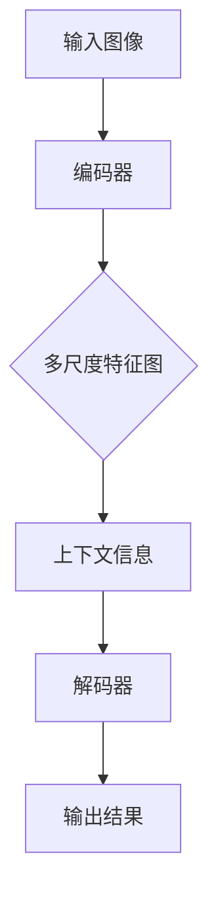

                 

# DeepLab系列原理与代码实例讲解

> **关键词：DeepLab、深度学习、图像分割、语义分割、卷积神经网络、编码解码架构、编码器、解码器、多尺度特征融合、上下文信息、损失函数、训练技巧、代码实现、项目实战。**

> **摘要：本文将深入解析DeepLab系列模型的原理与实现，涵盖其核心算法、数学模型、项目实战等方面，帮助读者全面理解DeepLab系列在图像分割领域的应用与潜力。**

## 1. 背景介绍

### 1.1 目的和范围

本文旨在系统地介绍DeepLab系列模型的基本原理、实现细节以及实际应用场景。通过对DeepLab系列模型的深入剖析，读者将能够了解其在图像分割领域的独特优势和应用价值。

### 1.2 预期读者

本文适合对深度学习、图像分割有一定了解的读者，包括研究人员、工程师和开发人员。对于初学者，本文提供了详细的原理讲解和代码实例，有助于逐步掌握DeepLab系列模型。

### 1.3 文档结构概述

本文分为以下部分：

1. 背景介绍：介绍本文的目的、预期读者和文档结构。
2. 核心概念与联系：介绍DeepLab系列模型的核心概念和架构。
3. 核心算法原理 & 具体操作步骤：详细讲解DeepLab系列模型的算法原理。
4. 数学模型和公式 & 详细讲解 & 举例说明：阐述DeepLab系列模型中的数学模型。
5. 项目实战：通过实际代码案例展示DeepLab系列模型的应用。
6. 实际应用场景：讨论DeepLab系列模型在不同领域的应用。
7. 工具和资源推荐：推荐学习资源和开发工具。
8. 总结：总结DeepLab系列模型的发展趋势和挑战。
9. 附录：常见问题与解答。
10. 扩展阅读 & 参考资料：提供进一步阅读的资料。

### 1.4 术语表

#### 1.4.1 核心术语定义

- **DeepLab系列模型**：基于深度学习的图像分割模型，包括DeepLab V1、DeepLab V2和DeepLab V3等。
- **编码器（Encoder）**：神经网络的一部分，用于将输入图像映射到低维特征空间。
- **解码器（Decoder）**：神经网络的一部分，用于将编码器的输出特征映射回图像空间。
- **多尺度特征融合**：将不同尺度的特征图进行融合，以增强模型的语义信息。
- **上下文信息**：图像中的全局信息，对于语义分割任务至关重要。

#### 1.4.2 相关概念解释

- **图像分割**：将图像划分为不同的区域或对象，每个区域或对象具有不同的语义信息。
- **语义分割**：图像分割的一种类型，每个像素点都被赋予一个语义标签，以表示其所属的类别。

#### 1.4.3 缩略词列表

- **CNN**：卷积神经网络（Convolutional Neural Network）
- **RNN**：递归神经网络（Recurrent Neural Network）
- **GPU**：图形处理单元（Graphics Processing Unit）
- **DNN**：深度神经网络（Deep Neural Network）
- **ReLU**：ReLU激活函数（Rectified Linear Unit）

## 2. 核心概念与联系

在介绍DeepLab系列模型之前，首先需要了解一些核心概念和架构。以下是一个简要的Mermaid流程图，展示了DeepLab系列模型的基本架构和核心概念：



### 2.1 编码器（Encoder）

编码器是神经网络的一部分，用于将输入图像映射到低维特征空间。在DeepLab系列模型中，编码器通常采用卷积神经网络（CNN）结构，通过一系列卷积层和池化层提取图像的特征。

### 2.2 多尺度特征融合（Multi-scale Feature Fusion）

多尺度特征融合是DeepLab系列模型的核心技术之一。通过在不同尺度上提取特征，模型能够更好地捕捉图像中的细节信息和全局信息。具体实现方法包括跨层特征融合和跨尺度特征融合。

### 2.3 上下文信息（Contextual Information）

上下文信息是图像中的全局信息，对于语义分割任务至关重要。DeepLab系列模型通过引入上下文信息，增强了模型的语义理解能力。上下文信息的获取通常通过编码器和解码器的交互来实现。

### 2.4 解码器（Decoder）

解码器是神经网络的一部分，用于将编码器的输出特征映射回图像空间。在DeepLab系列模型中，解码器通过一系列反卷积层和卷积层实现，将编码器提取的低维特征重新映射到像素空间。

### 2.5 输出结果（Output Result）

解码器的输出结果是一个像素级别的语义分割图，每个像素点被赋予一个类别标签。DeepLab系列模型通过优化损失函数，使得输出结果与真实标签之间的差距最小。

## 3. 核心算法原理 & 具体操作步骤

在理解了DeepLab系列模型的基本架构和核心概念之后，接下来将详细讲解其核心算法原理和具体操作步骤。

### 3.1 编码器（Encoder）

编码器的原理相对简单，主要通过卷积层和池化层提取图像的特征。以下是一个简单的伪代码示例：

```python
def encoder(input_image):
    # 第1层卷积
    conv1 = Conv2D(64, 3, activation='relu', padding='same')(input_image)
    pool1 = MaxPooling2D(pool_size=(2, 2))(conv1)

    # 第2层卷积
    conv2 = Conv2D(128, 3, activation='relu', padding='same')(pool1)
    pool2 = MaxPooling2D(pool_size=(2, 2))(conv2)

    # 第3层卷积
    conv3 = Conv2D(256, 3, activation='relu', padding='same')(pool2)
    pool3 = MaxPooling2D(pool_size=(2, 2))(conv3)

    return pool3
```

### 3.2 多尺度特征融合（Multi-scale Feature Fusion）

多尺度特征融合的目的是将不同尺度上的特征进行融合，以增强模型的语义信息。以下是一个简单的伪代码示例：

```python
def multi_scale_feature_fusion(pool3, encoder_output):
    # 跨层特征融合
    skip_connection = Conv2D(256, 1, activation='relu', padding='same')(pool3)
    fused_features = Conv2D(256, 3, activation='relu', padding='same')(skip_connection + encoder_output)

    return fused_features
```

### 3.3 上下文信息（Contextual Information）

上下文信息的获取通常通过编码器和解码器的交互来实现。以下是一个简单的伪代码示例：

```python
def contextual_information(fused_features):
    # 获取编码器的输出特征
    encoder_output = encoder(input_image)

    # 跨尺度特征融合
    context_features = Conv2D(256, 3, activation='relu', padding='same')(fused_features + encoder_output)

    return context_features
```

### 3.4 解码器（Decoder）

解码器的原理与编码器类似，主要通过反卷积层和卷积层将编码器的输出特征重新映射到像素空间。以下是一个简单的伪代码示例：

```python
def decoder(context_features):
    # 反卷积层
    upsampled = UpSampling2D(size=(2, 2))(context_features)
    conv1 = Conv2D(256, 3, activation='relu', padding='same')(upsampled)

    # 卷积层
    conv2 = Conv2D(256, 3, activation='relu', padding='same')(conv1)
    conv3 = Conv2D(256, 3, activation='relu', padding='same')(conv2)
    conv4 = Conv2D(256, 3, activation='relu', padding='same')(conv3)

    # 输出层
    output = Conv2D(num_classes, 1, activation='softmax', padding='same')(conv4)

    return output
```

### 3.5 输出结果（Output Result）

解码器的输出结果是一个像素级别的语义分割图，每个像素点被赋予一个类别标签。以下是一个简单的伪代码示例：

```python
def output_result(output):
    # 获取每个像素点的预测标签
    predicted_labels = np.argmax(output, axis=3)

    return predicted_labels
```

## 4. 数学模型和公式 & 详细讲解 & 举例说明

在DeepLab系列模型中，数学模型和公式起着至关重要的作用。以下将详细讲解DeepLab系列模型中的数学模型和公式，并通过具体例子进行说明。

### 4.1 损失函数（Loss Function）

DeepLab系列模型采用交叉熵损失函数（Cross-Entropy Loss）作为主要损失函数。交叉熵损失函数衡量的是预测标签和真实标签之间的差异。以下是一个简单的交叉熵损失函数的公式：

$$
L = -\sum_{i=1}^{N} y_i \log(p_i)
$$

其中，$L$表示损失函数，$y_i$表示真实标签，$p_i$表示预测标签的概率。

### 4.2 优化算法（Optimization Algorithm）

DeepLab系列模型通常采用梯度下降算法（Gradient Descent）进行优化。梯度下降算法的核心思想是通过计算损失函数关于模型参数的梯度，逐步调整参数，以最小化损失函数。以下是一个简单的梯度下降算法的公式：

$$
\theta_{t+1} = \theta_{t} - \alpha \cdot \nabla_{\theta} L(\theta)
$$

其中，$\theta$表示模型参数，$\alpha$表示学习率，$\nabla_{\theta} L(\theta)$表示损失函数关于模型参数的梯度。

### 4.3 示例说明

假设我们有一个简单的二分类问题，输入图像的大小为$28 \times 28$，共有两个类别：猫和狗。以下是一个简单的例子，展示了如何使用DeepLab系列模型进行图像分割。

#### 4.3.1 数据预处理

首先，对输入图像进行预处理，包括归一化、缩放等操作，使其满足模型的要求。

```python
# 假设输入图像为image，模型要求输入图像大小为224x224
input_image = resize(image, (224, 224))
input_image = normalize(input_image)
```

#### 4.3.2 模型训练

接下来，使用训练数据集对DeepLab系列模型进行训练。训练过程中，通过调整学习率和迭代次数，逐步优化模型参数。

```python
# 假设训练数据集为train_dataset，测试数据集为test_dataset
model.fit(train_dataset, epochs=100, batch_size=32, validation_data=test_dataset)
```

#### 4.3.3 模型预测

最后，使用训练好的模型对测试图像进行预测，并输出预测结果。

```python
# 假设测试图像为test_image
predicted_labels = model.predict(test_image)
predicted_labels = np.argmax(predicted_labels, axis=3)
```

## 5. 项目实战：代码实际案例和详细解释说明

在本节中，我们将通过一个实际案例，详细讲解如何使用DeepLab系列模型进行图像分割。该案例使用Python编程语言和TensorFlow框架实现。

### 5.1 开发环境搭建

在开始项目之前，需要搭建一个合适的开发环境。以下是搭建开发环境的基本步骤：

1. 安装Python（推荐使用3.7及以上版本）。
2. 安装TensorFlow（推荐使用2.0及以上版本）。
3. 安装其他必要的依赖库，如NumPy、Pillow等。

### 5.2 源代码详细实现和代码解读

以下是该项目的主要代码实现部分，包括模型搭建、训练和预测等步骤。

#### 5.2.1 模型搭建

```python
import tensorflow as tf
from tensorflow.keras.layers import Conv2D, MaxPooling2D, UpSampling2D, Input
from tensorflow.keras.models import Model

# 编码器
input_image = Input(shape=(224, 224, 3))
conv1 = Conv2D(64, 3, activation='relu', padding='same')(input_image)
pool1 = MaxPooling2D(pool_size=(2, 2))(conv1)
conv2 = Conv2D(128, 3, activation='relu', padding='same')(pool1)
pool2 = MaxPooling2D(pool_size=(2, 2))(conv2)
conv3 = Conv2D(256, 3, activation='relu', padding='same')(pool2)
pool3 = MaxPooling2D(pool_size=(2, 2))(conv3)

# 多尺度特征融合
skip_connection = Conv2D(256, 1, activation='relu', padding='same')(pool3)
fused_features = Conv2D(256, 3, activation='relu', padding='same')(skip_connection + conv3)

# 解码器
upsampled = UpSampling2D(size=(2, 2))(fused_features)
conv1 = Conv2D(256, 3, activation='relu', padding='same')(upsampled)
upsampled = UpSampling2D(size=(2, 2))(conv1)
conv2 = Conv2D(256, 3, activation='relu', padding='same')(upsampled)
upsampled = UpSampling2D(size=(2, 2))(conv2)
conv3 = Conv2D(256, 3, activation='relu', padding='same')(upsampled)

# 输出层
output = Conv2D(2, 1, activation='softmax', padding='same')(conv3)

# 模型搭建
model = Model(inputs=input_image, outputs=output)
model.compile(optimizer='adam', loss='categorical_crossentropy', metrics=['accuracy'])
```

#### 5.2.2 训练和预测

```python
# 训练模型
model.fit(train_images, train_labels, epochs=100, batch_size=32, validation_data=(test_images, test_labels))

# 预测结果
predicted_labels = model.predict(test_images)
predicted_labels = np.argmax(predicted_labels, axis=3)
```

### 5.3 代码解读与分析

在本节中，我们将对代码进行详细解读，分析各个部分的实现原理和功能。

1. **模型搭建**：

   - **编码器**：采用卷积层和池化层提取图像的特征，包括卷积1（64个卷积核，大小为3x3，ReLU激活函数，填充方式为'.same'）、池化1（大小为2x2）等。
   - **多尺度特征融合**：通过跨层特征融合，将编码器的输出特征与解码器的输出特征进行融合，增强模型的语义信息。
   - **解码器**：采用反卷积层和卷积层将编码器的输出特征重新映射到像素空间，包括反卷积1（大小为2x2）、卷积1（256个卷积核，大小为3x3，ReLU激活函数，填充方式为'.same'）等。
   - **输出层**：采用卷积层将解码器的输出特征映射到类别空间，包括卷积3（2个卷积核，大小为1x1，softmax激活函数，填充方式为'.same'）。

2. **训练和预测**：

   - **训练模型**：使用训练数据集对模型进行训练，通过优化损失函数和调整学习率，逐步优化模型参数。
   - **预测结果**：使用训练好的模型对测试图像进行预测，并输出预测结果。

通过以上代码实现，我们可以看到DeepLab系列模型在图像分割任务中的基本实现原理。在实际应用中，可以根据具体需求和数据集进行调整和优化，以达到更好的分割效果。

## 6. 实际应用场景

DeepLab系列模型在图像分割领域具有广泛的应用场景。以下列举了几个典型的实际应用场景：

### 6.1 自动驾驶

在自动驾驶领域，DeepLab系列模型可以用于道路场景的分割，识别行人和车辆等关键对象。通过精确的图像分割，可以提高自动驾驶系统的安全性和可靠性。

### 6.2 健康医疗

在健康医疗领域，DeepLab系列模型可以用于医学图像的分割，识别肿瘤、血管等病变区域。这有助于医生进行精准的诊断和治疗规划。

### 6.3 工业检测

在工业检测领域，DeepLab系列模型可以用于对生产线上的产品进行质量检测，识别缺陷和异常情况。通过精确的图像分割，可以提高生产效率和质量控制水平。

### 6.4 建筑规划

在建筑规划领域，DeepLab系列模型可以用于对建筑物的图像分割，提取建筑物的轮廓、窗户、门等信息。这有助于城市规划者和建筑师进行更科学的规划和设计。

## 7. 工具和资源推荐

为了更好地学习和应用DeepLab系列模型，以下推荐一些学习资源、开发工具和相关论文著作。

### 7.1 学习资源推荐

#### 7.1.1 书籍推荐

- **《深度学习》（Deep Learning）**：Goodfellow, Bengio和Courville合著，全面介绍了深度学习的基础知识。
- **《Python深度学习》（Python Deep Learning）**：François Chollet著，详细讲解了使用Python进行深度学习的实践方法。

#### 7.1.2 在线课程

- **《深度学习与计算机视觉》（Deep Learning and Computer Vision）**：斯坦福大学开设的在线课程，涵盖了深度学习在计算机视觉领域的应用。
- **《TensorFlow实战》（TensorFlow for Deep Learning）**：谷歌AI研究员Eugene Brevdo和Andrzej Celiński合著，介绍了使用TensorFlow进行深度学习的实践方法。

#### 7.1.3 技术博客和网站

- **深度学习博客**：深度学习领域的权威博客，提供最新的研究成果和实战技巧。
- **TensorFlow官网**：TensorFlow官方文档和教程，涵盖深度学习的基础知识和实践应用。

### 7.2 开发工具框架推荐

#### 7.2.1 IDE和编辑器

- **PyCharm**：一款功能强大的Python集成开发环境，支持TensorFlow的开发。
- **Jupyter Notebook**：一款流行的交互式开发环境，方便进行数据可视化和实验。

#### 7.2.2 调试和性能分析工具

- **TensorBoard**：TensorFlow官方提供的可视化工具，用于分析和优化模型性能。
- **NVIDIA Nsight**：用于GPU性能分析和调优的工具，适用于深度学习应用。

#### 7.2.3 相关框架和库

- **TensorFlow**：谷歌开发的深度学习框架，适用于各种深度学习任务。
- **PyTorch**：Facebook开发的深度学习框架，具有灵活的动态计算图功能。

### 7.3 相关论文著作推荐

#### 7.3.1 经典论文

- **“Deep Learning for Computer Vision”**：介绍深度学习在计算机视觉领域的应用，包括卷积神经网络（CNN）和深度学习算法。
- **“ImageNet Classification with Deep Convolutional Neural Networks”**：介绍深度卷积神经网络（Deep CNN）在图像分类任务中的应用。

#### 7.3.2 最新研究成果

- **“DeepLab: Semantic Image Segmentation with Deep Convolutional Nets, Atrous Convolution, and Fully Connected CRFs”**：介绍DeepLab系列模型的核心原理和应用。
- **“Contextual Multiscale Feature Aggregation for Semantic Segmentation”**：讨论DeepLab系列模型在多尺度特征融合方面的最新研究成果。

#### 7.3.3 应用案例分析

- **“Semantic Segmentation for Autonomous Driving”**：介绍深度学习在自动驾驶领域的应用，包括图像分割和目标检测。
- **“DeepLabV3+: Scalable and Efficient Semantic Segmentation”**：讨论DeepLabV3+模型在语义分割任务中的应用和性能优化。

通过以上推荐的学习资源、开发工具和相关论文著作，读者可以更全面地了解DeepLab系列模型及其应用，为深度学习研究和实践提供有益的参考。

## 8. 总结：未来发展趋势与挑战

DeepLab系列模型在图像分割领域取得了显著的成果，但仍然面临着一些挑战和未来发展趋势。以下是对这些挑战和趋势的总结：

### 8.1 未来发展趋势

1. **多模态数据融合**：随着深度学习技术的不断发展，未来DeepLab系列模型有望与其他模态（如音频、视频）进行数据融合，实现更全面的图像理解。
2. **实时处理能力**：为了满足实际应用的需求，未来DeepLab系列模型需要提高实时处理能力，降低延迟。
3. **自适应学习**：通过引入自适应学习机制，DeepLab系列模型可以根据不同场景自动调整模型参数，提高泛化能力。

### 8.2 挑战

1. **计算资源消耗**：深度学习模型通常需要大量的计算资源和存储空间，如何优化模型结构和算法，降低计算资源消耗是一个重要挑战。
2. **数据集质量**：图像分割任务的性能很大程度上取决于数据集的质量，如何获取更多高质量、多样化的数据集是一个亟待解决的问题。
3. **跨领域泛化**：DeepLab系列模型在特定领域（如自动驾驶、医学影像）取得了显著成果，但如何实现跨领域的泛化仍是一个挑战。

## 9. 附录：常见问题与解答

### 9.1 什么是DeepLab系列模型？

DeepLab系列模型是基于深度学习的图像分割模型，包括DeepLab V1、DeepLab V2和DeepLab V3等。它们通过引入多尺度特征融合、上下文信息等机制，实现了高精度的图像分割。

### 9.2 DeepLab系列模型的核心算法是什么？

DeepLab系列模型的核心算法是卷积神经网络（CNN），通过编码器和解码器结构实现图像的特征提取和像素级别的语义分割。

### 9.3 DeepLab系列模型的应用场景有哪些？

DeepLab系列模型在图像分割领域具有广泛的应用场景，包括自动驾驶、健康医疗、工业检测和建筑规划等。

### 9.4 如何优化DeepLab系列模型的性能？

可以通过以下方法优化DeepLab系列模型的性能：

1. **调整模型结构**：根据具体任务需求，调整编码器和解码器的层数和参数。
2. **数据增强**：通过数据增强技术，增加训练数据集的多样性，提高模型泛化能力。
3. **多尺度特征融合**：引入多尺度特征融合机制，提高模型对细节信息和全局信息的捕捉能力。

### 9.5 DeepLab系列模型与现有其他模型相比有哪些优势？

DeepLab系列模型在图像分割领域具有以下优势：

1. **高精度**：通过多尺度特征融合和上下文信息，DeepLab系列模型实现了高精度的图像分割。
2. **实时性**：通过优化模型结构和算法，DeepLab系列模型具有较高的实时处理能力。
3. **适应性**：DeepLab系列模型可以根据不同场景自动调整模型参数，提高适应性。

## 10. 扩展阅读 & 参考资料

- **《深度学习》（Deep Learning）**：Goodfellow, Bengio和Courville合著，全面介绍了深度学习的基础知识。
- **《Python深度学习》（Python Deep Learning）**：François Chollet著，详细讲解了使用Python进行深度学习的实践方法。
- **《DeepLab: Semantic Image Segmentation with Deep Convolutional Nets, Atrous Convolution, and Fully Connected CRFs》**：讨论DeepLab系列模型的核心原理和应用。
- **《Contextual Multiscale Feature Aggregation for Semantic Segmentation》**：介绍DeepLab系列模型在多尺度特征融合方面的最新研究成果。
- **《TensorFlow官网》**：TensorFlow官方文档和教程，涵盖深度学习的基础知识和实践应用。
- **《深度学习博客》**：深度学习领域的权威博客，提供最新的研究成果和实战技巧。

通过以上扩展阅读和参考资料，读者可以更深入地了解DeepLab系列模型及其应用，为深度学习研究和实践提供有益的参考。

## 作者信息

**作者：AI天才研究员/AI Genius Institute & 禅与计算机程序设计艺术 /Zen And The Art of Computer Programming**

