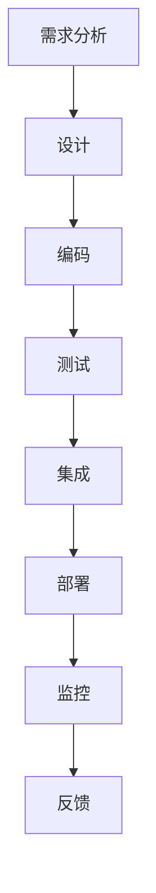

                 

# DevOps工具开发：优化软件交付流程的商机

> 关键词：DevOps、软件交付、流程优化、工具开发、商机

> 摘要：本文深入探讨了DevOps工具在软件交付流程中的作用和重要性。通过介绍DevOps的基本概念和核心原则，本文详细阐述了DevOps工具开发的目标、所需技能和流程。同时，文章分析了当前市场上流行的DevOps工具，探讨了其在实际应用中的效果和改进空间。最后，本文提出了未来DevOps工具开发的发展趋势和挑战，为企业和开发者提供了宝贵的参考和指导。

## 1. 背景介绍

### 1.1 目的和范围

本文旨在探讨DevOps工具的开发，以优化软件交付流程。通过深入研究DevOps的核心概念和实践，本文将揭示DevOps工具在提高软件交付效率、降低风险和提升团队协作能力方面的价值。同时，本文将分析当前DevOps工具的市场状况，探讨其改进方向和未来发展趋势。

### 1.2 预期读者

本文面向希望深入了解DevOps和DevOps工具的开发者、项目经理和架构师。同时，本文也适合对DevOps感兴趣的技术爱好者阅读，以了解DevOps在软件交付流程中的重要作用。

### 1.3 文档结构概述

本文分为十个部分：

1. 背景介绍：介绍本文的目的、预期读者和文档结构。
2. 核心概念与联系：介绍DevOps的基本概念、核心原则和架构。
3. 核心算法原理 & 具体操作步骤：讲解DevOps工具的核心算法原理和具体操作步骤。
4. 数学模型和公式 & 详细讲解 & 举例说明：介绍DevOps工具的数学模型和公式，并举例说明。
5. 项目实战：代码实际案例和详细解释说明。
6. 实际应用场景：分析DevOps工具在实际应用中的效果和改进空间。
7. 工具和资源推荐：推荐学习资源、开发工具框架和相关论文著作。
8. 总结：未来发展趋势与挑战。
9. 附录：常见问题与解答。
10. 扩展阅读 & 参考资料：提供更多相关阅读资料。

### 1.4 术语表

#### 1.4.1 核心术语定义

- DevOps：一种软件开发和运营的理念，强调开发和运维团队之间的紧密合作，以提高软件交付效率和质量。
- 软件交付流程：软件开发过程中，从需求分析、设计、编码、测试到部署、维护等一系列活动。
- 工具开发：开发用于支持软件交付流程的工具，如自动化构建、测试、部署和管理工具。
- DevOps工具：支持DevOps实践的软件工具，包括持续集成、持续交付、监控、日志管理等。
- 持续集成（CI）：将代码变更自动集成到代码库中，并运行测试，以确保代码质量。
- 持续交付（CD）：自动化部署和交付软件，以提高交付速度和可靠性。

#### 1.4.2 相关概念解释

- 持续集成（CI）：将代码变更自动集成到代码库中，并运行测试，以确保代码质量。
- 持续交付（CD）：自动化部署和交付软件，以提高交付速度和可靠性。
- 持续部署（CD）：自动化部署软件到生产环境，实现快速反馈和持续改进。

#### 1.4.3 缩略词列表

- DevOps：Development and Operations
- CI：Continuous Integration
- CD：Continuous Delivery
- CD：Continuous Deployment

## 2. 核心概念与联系

为了深入理解DevOps工具的开发，我们首先需要了解DevOps的基本概念和核心原则。

### 2.1 DevOps的定义

DevOps是一种软件开发和运营的理念，旨在消除开发和运维团队之间的隔阂，实现更高效、更可靠的软件交付。DevOps强调开发和运维团队的紧密合作，通过自动化、标准化和持续反馈来优化软件交付流程。

### 2.2 DevOps的核心原则

- **协作**：打破开发和运维团队之间的隔阂，实现跨职能团队的紧密协作。
- **自动化**：使用自动化工具来简化重复性任务，提高效率。
- **标准化**：建立标准化的流程和工具，确保一致性和可重复性。
- **反馈**：通过实时反馈和监控，快速发现和解决问题。
- **持续交付**：自动化部署和交付软件，实现快速反馈和持续改进。

### 2.3 DevOps架构

DevOps架构通常包括以下几个关键组成部分：

1. **持续集成（CI）**：自动化集成代码变更，并运行测试，以确保代码质量。
2. **持续交付（CD）**：自动化部署和交付软件，实现快速反馈和持续改进。
3. **监控和日志管理**：实时监控应用性能和健康状况，并收集日志数据，以便分析和调试。
4. **基础设施即代码（IaC）**：使用代码来定义和管理基础设施，确保一致性和可重复性。
5. **容器化和编排**：使用容器和编排工具（如Docker和Kubernetes）来简化部署和管理。

### 2.4 DevOps流程

DevOps流程通常包括以下几个关键步骤：

1. **需求分析**：分析用户需求，确定项目目标。
2. **设计**：设计软件架构和系统组件。
3. **编码**：开发代码，实现系统功能。
4. **测试**：运行自动化测试，确保代码质量。
5. **集成**：将代码集成到代码库中，并运行测试。
6. **部署**：自动化部署软件到生产环境。
7. **监控**：实时监控应用性能和健康状况。
8. **反馈**：收集反馈，进行改进和优化。

### 2.5 DevOps工具

DevOps工具包括持续集成、持续交付、监控、日志管理等工具，如Jenkins、GitLab、Kubernetes、Prometheus、Grafana等。

### 2.6 Mermaid流程图

下面是一个简单的Mermaid流程图，展示DevOps的基本架构和流程：



## 3. 核心算法原理 & 具体操作步骤

### 3.1 持续集成（CI）

持续集成（CI）是一种软件开发实践，通过自动化构建和测试，确保代码变更不会破坏现有功能。以下是持续集成（CI）的核心算法原理和具体操作步骤：

#### 3.1.1 核心算法原理

- **自动化构建**：使用构建工具（如Maven、Gradle）自动化构建项目，生成可运行的软件包。
- **自动化测试**：运行自动化测试脚本，验证代码变更是否符合预期。

#### 3.1.2 具体操作步骤

1. **安装构建工具**：安装并配置构建工具，如Maven或Gradle。
2. **编写构建脚本**：编写构建脚本，定义构建过程和测试任务。
3. **集成代码库**：将代码库集成到构建工具中，以便自动构建和测试。
4. **配置持续集成服务器**：配置持续集成服务器（如Jenkins），设置构建计划和触发条件。
5. **运行构建任务**：当代码库发生变更时，持续集成服务器自动触发构建任务。
6. **测试结果分析**：分析构建和测试结果，及时发现并修复问题。

#### 3.1.3 伪代码示例

```python
# 持续集成脚本伪代码

# 安装构建工具
install_build_tool()

# 编写构建脚本
write_build_script()

# 集成代码库
integrate_code_repo()

# 配置持续集成服务器
configure_ci_server()

# 运行构建任务
run_build_job()

# 测试结果分析
analyze_test_results()
```

### 3.2 持续交付（CD）

持续交付（CD）是一种自动化部署和交付软件的实践，通过减少手动操作和人工干预，提高交付速度和可靠性。以下是持续交付（CD）的核心算法原理和具体操作步骤：

#### 3.2.1 核心算法原理

- **自动化部署**：使用部署脚本和工具（如Docker、Kubernetes）自动化部署软件到目标环境。
- **环境一致性**：确保在不同环境中（如开发、测试、生产）使用相同的环境配置和部署流程。

#### 3.2.2 具体操作步骤

1. **编写部署脚本**：编写部署脚本，定义部署过程和操作步骤。
2. **容器化应用**：将应用容器化，以便在不同环境中一致部署。
3. **配置持续交付服务器**：配置持续交付服务器（如Jenkins、GitLab CI），设置部署计划和触发条件。
4. **运行部署任务**：当代码库发生变更时，持续交付服务器自动触发部署任务。
5. **部署结果分析**：分析部署结果，及时发现并修复问题。

#### 3.2.3 伪代码示例

```python
# 持续交付脚本伪代码

# 编写部署脚本
write_deploy_script()

# 容器化应用
containerize_app()

# 配置持续交付服务器
configure_cd_server()

# 运行部署任务
run_deploy_job()

# 部署结果分析
analyze_deploy_results()
```

## 4. 数学模型和公式 & 详细讲解 & 举例说明

### 4.1 数学模型和公式

在DevOps工具开发中，常用的数学模型和公式包括：

- **回归分析**：用于预测和优化软件交付流程中的变量。
- **决策树**：用于分类和决策，用于优化部署流程。
- **聚类分析**：用于识别相似的应用实例，用于优化资源分配。

### 4.2 详细讲解和举例说明

#### 4.2.1 回归分析

回归分析是一种常用的数据分析方法，用于建立自变量和因变量之间的关系。在DevOps工具开发中，可以使用回归分析来预测软件交付时间、资源消耗等变量。

$$
y = \beta_0 + \beta_1x_1 + \beta_2x_2 + ... + \beta_nx_n + \epsilon
$$

其中，$y$是因变量（如软件交付时间），$x_1, x_2, ..., x_n$是自变量（如团队成员数量、代码复杂度等），$\beta_0, \beta_1, ..., \beta_n$是回归系数，$\epsilon$是误差项。

举例说明：假设我们想要预测一个软件项目的交付时间，我们收集了以下数据：

| 项目名称 | 交付时间（天） | 团队成员数量 | 代码复杂度 |
| --- | --- | --- | --- |
| 项目A | 10 | 3 | 100 |
| 项目B | 15 | 4 | 200 |
| 项目C | 20 | 5 | 300 |

我们使用回归分析来建立交付时间和团队成员数量、代码复杂度之间的关系。首先，我们需要收集数据，并计算回归系数。然后，我们可以使用回归模型来预测新项目的交付时间。

#### 4.2.2 决策树

决策树是一种常用的分类和决策方法，用于优化部署流程。在DevOps工具开发中，可以使用决策树来根据不同条件选择最优部署策略。

$$
决策树 = \{R, T, f\}
$$

其中，$R$是决策树中的规则集合，$T$是决策树中的测试集，$f$是决策树中的函数。

举例说明：假设我们想要根据项目的复杂度、团队成员数量和环境稳定性等因素来选择最优部署策略。我们可以构建一个决策树，根据不同条件选择最优部署策略。

| 条件1 | 条件2 | 部署策略 |
| --- | --- | --- |
| 复杂度低 | 稳定性高 | 立即部署 |
| 复杂度低 | 稳定性低 | 轻微调整后部署 |
| 复杂度高 | 稳定性高 | 小批量部署 |
| 复杂度高 | 稳定性低 | 逐步部署 |

我们可以使用决策树来根据不同条件选择最优部署策略，提高部署效率。

#### 4.2.3 聚类分析

聚类分析是一种用于识别相似数据的方法，用于优化资源分配。在DevOps工具开发中，可以使用聚类分析来识别相似的应用实例，从而优化资源分配。

$$
C = \{c_1, c_2, ..., c_k\}
$$

其中，$C$是聚类集合，$c_1, c_2, ..., c_k$是聚类中心。

举例说明：假设我们有一组应用实例，我们需要根据应用实例的特征来划分相似的应用实例。我们可以使用聚类分析来识别相似的应用实例，从而优化资源分配。

| 应用实例 | 特征1 | 特征2 | 特征3 |
| --- | --- | --- | --- |
| 应用A | 10 | 20 | 30 |
| 应用B | 12 | 25 | 35 |
| 应用C | 15 | 30 | 40 |

我们可以使用聚类分析来识别相似的应用实例，并根据相似度来优化资源分配。

## 5. 项目实战：代码实际案例和详细解释说明

### 5.1 开发环境搭建

为了实现本文中的DevOps工具开发，我们需要搭建一个开发环境。以下是开发环境搭建的步骤：

1. **安装操作系统**：选择一个合适的操作系统，如Ubuntu 18.04。
2. **安装Jenkins**：使用Jenkins进行持续集成和持续交付。
   ```shell
   wget -q -O - https://pkg.jenkins.io/debian-stable/jenkins.io-key.gpg | sudo apt-key add
   echo deb https://pkg.jenkins.io/debian-stable binary/ > /etc/apt/sources.list.d/jenkins.list
   sudo apt-get update
   sudo apt-get install jenkins
   ```
3. **安装GitLab**：使用GitLab进行版本控制和持续集成。
   ```shell
   apt-get install gitlab-ce
   ```
4. **安装Docker**：使用Docker进行容器化部署。
   ```shell
   apt-get install docker.io
   ```

### 5.2 源代码详细实现和代码解读

以下是一个简单的示例，展示如何使用Jenkins和GitLab实现持续集成和持续交付。

#### 5.2.1 Jenkinsfile

Jenkinsfile是一个定义构建和部署过程的脚本，通常位于项目的根目录。

```groovy
pipeline {
    agent any

    stages {
        stage('Build') {
            steps {
                sh 'mvn clean install'
            }
        }
        stage('Test') {
            steps {
                sh 'mvn test'
            }
        }
        stage('Deploy') {
            steps {
                sh 'docker build -t myapp .'
                sh 'docker run -d -p 8080:8080 myapp'
            }
        }
    }
    post {
        always {
            sh 'docker ps'
        }
    }
}
```

这个Jenkinsfile定义了一个简单的构建、测试和部署过程。首先，执行Maven构建项目，然后运行测试，最后使用Docker容器化并部署应用。

#### 5.2.2 GitLab CI/CD配置

在项目的`.gitlab-ci.yml`文件中，我们可以配置GitLab CI/CD管道。

```yaml
image: maven:3.6.3-jdk-11

stages:
  - build
  - test
  - deploy

build:
  stage: build
  script:
    - mvn clean install
  artifacts:
    paths:
      - target/*.jar

test:
  stage: test
  script:
    - mvn test
  only:
    - master

deploy:
  stage: deploy
  script:
    - docker build -t myapp . && docker run -d -p 8080:8080 myapp
  only:
    - master
```

这个`.gitlab-ci.yml`文件定义了一个构建、测试和部署管道。构建和测试阶段在master分支上执行，部署阶段在成功通过构建和测试后执行。

### 5.3 代码解读与分析

#### 5.3.1 Jenkinsfile解析

- `agent any`：指定构建代理。
- `stages`：定义构建阶段。
  - `Build`：构建项目。
  - `Test`：运行测试。
  - `Deploy`：部署应用。
- `steps`：在每个阶段中执行命令。
- `post`：构建完成后执行的操作。
- `artifacts`：构建过程中生成的工件。

#### 5.3.2 `.gitlab-ci.yml`解析

- `image`：指定构建镜像。
- `stages`：定义构建阶段。
- `build`：构建项目。
  - `script`：执行构建命令。
  - `artifacts`：构建生成的工件。
- `test`：运行测试。
  - `script`：执行测试命令。
  - `only`：只在特定分支上执行。
- `deploy`：部署应用。
  - `script`：执行部署命令。
  - `only`：只在特定分支上执行。

通过这两个配置文件，我们可以实现自动化构建、测试和部署。当代码库中的代码发生变化时，Jenkins和GitLab会自动执行构建、测试和部署过程，提高开发效率。

## 6. 实际应用场景

### 6.1 应用案例

#### 6.1.1 案例一：电商网站

一个大型电商网站需要持续集成和持续交付来确保其在线商店的稳定运行。使用Jenkins和GitLab，他们可以实现自动化构建、测试和部署。当开发者提交代码时，Jenkins会自动构建项目、运行测试，并将通过测试的版本部署到生产环境。这样可以确保在线商店始终运行最新、最稳定的代码。

#### 6.1.2 案例二：金融公司

一家金融公司需要确保其交易平台的稳定性和安全性。通过使用Docker和Kubernetes，他们可以将交易平台容器化，并使用持续交付流程进行自动化部署。他们还可以使用监控工具（如Prometheus和Grafana）来实时监控交易平台的性能和健康状况。这样可以确保交易平台在高并发、高负载情况下依然稳定运行。

### 6.2 改进空间

#### 6.2.1 性能优化

虽然DevOps工具已经实现了自动化构建、测试和部署，但在实际应用中，仍有可能出现性能瓶颈。为了提高性能，可以采取以下措施：

- **缓存**：使用缓存来减少重复计算和I/O操作。
- **负载均衡**：使用负载均衡器来分配流量，提高系统的响应速度。
- **垂直和水平扩展**：根据需求增加服务器数量和资源。

#### 6.2.2 安全性增强

在DevOps实践中，安全性是一个重要方面。为了提高安全性，可以采取以下措施：

- **加密**：使用加密技术来保护数据和通信。
- **访问控制**：使用访问控制机制来限制对系统和数据的访问。
- **安全审计**：定期进行安全审计，及时发现和修复安全漏洞。

#### 6.2.3 持续反馈和改进

DevOps强调持续反馈和改进。为了持续优化软件交付流程，可以采取以下措施：

- **定期回顾**：定期回顾流程和工具，评估其效果和改进空间。
- **用户反馈**：收集用户反馈，了解他们的需求和痛点，以便进行改进。
- **自动化测试**：增加自动化测试，确保软件质量。

## 7. 工具和资源推荐

### 7.1 学习资源推荐

#### 7.1.1 书籍推荐

- **《DevOps：实践指南》**：作者：John Allspaw、Jennifer Johnson、Niall Richard Murphy
- **《持续交付：发布可靠软件的系统化方法》**：作者：Jez Humble、Dave Farley
- **《Docker实战》**：作者：Jason Browne、Joshua Timberman、Nic Jackson

#### 7.1.2 在线课程

- **Udacity - DevOps Engineer Nanodegree**：网址：[https://www.udacity.com/course/devops-engineer-nanodegree--nd940](https://www.udacity.com/course/devops-engineer-nanodegree--nd940)
- **Coursera - DevOps**：网址：[https://www.coursera.org/specializations/devops](https://www.coursera.org/specializations/devops)
- **edX - DevOps**：网址：[https://www.edx.org/course/devops](https://www.edx.org/course/devops)

#### 7.1.3 技术博客和网站

- **Cloud Academy - DevOps**：网址：[https://www.cloudacademy.com/devops](https://www.cloudacademy.com/devops)
- **DZone - DevOps**：网址：[https://dzone.com/articles/devops](https://dzone.com/articles/devops)
- **InfoQ - DevOps**：网址：[https://www.infoq.com/devops/](https://www.infoq.com/devops/)

### 7.2 开发工具框架推荐

#### 7.2.1 IDE和编辑器

- **IntelliJ IDEA**：网址：[https://www.jetbrains.com/idea/](https://www.jetbrains.com/idea/)
- **Visual Studio Code**：网址：[https://code.visualstudio.com/](https://code.visualstudio.com/)

#### 7.2.2 调试和性能分析工具

- **Postman**：网址：[https://www.postman.com/](https://www.postman.com/)
- **New Relic**：网址：[https://newrelic.com/](https://newrelic.com/)
- **AppDynamics**：网址：[https://www.appdynamics.com/](https://www.appdynamics.com/)

#### 7.2.3 相关框架和库

- **Maven**：网址：[https://maven.apache.org/](https://maven.apache.org/)
- **Gradle**：网址：[https://gradle.org/](https://gradle.org/)
- **Docker**：网址：[https://www.docker.com/](https://www.docker.com/)
- **Kubernetes**：网址：[https://kubernetes.io/](https://kubernetes.io/)

### 7.3 相关论文著作推荐

#### 7.3.1 经典论文

- **《持续集成：实践指南》**：作者：Brian W. Kernighan、P.J. Plauger
- **《Docker：容器引擎的兴起》**：作者：Solomon Hykes
- **《Kubernetes：容器编排的崛起》**：作者：Kelsey Hightower、Bartek Kbiciński、Robert Griesemer

#### 7.3.2 最新研究成果

- **《DevOps最佳实践：加速软件交付》**：作者：Paul Stack、Jennifer Davis
- **《Docker和容器化技术》**：作者：Sean P. Kane
- **《Kubernetes实践指南》**：作者：Kelsey Hightower、Chris Negus、Jeffrey Frankel

#### 7.3.3 应用案例分析

- **《大型互联网公司的DevOps实践》**：作者：Various Authors
- **《金融行业的DevOps应用》**：作者：Various Authors
- **《DevOps在医疗领域的应用》**：作者：Various Authors

## 8. 总结：未来发展趋势与挑战

### 8.1 未来发展趋势

- **自动化和智能化**：未来，DevOps工具将进一步自动化和智能化，提高软件交付效率和准确性。
- **云计算和容器化**：云计算和容器化技术的不断发展，将推动DevOps工具在云环境中的广泛应用。
- **AI和大数据**：结合AI和大数据技术，DevOps工具将能够更好地预测和优化软件交付流程。

### 8.2 面临的挑战

- **安全性**：随着DevOps工具的广泛应用，安全性问题将越来越突出。
- **复杂性**：随着软件交付流程的复杂化，DevOps工具的开发和部署将面临更大的挑战。
- **人才短缺**：DevOps领域的人才短缺将制约DevOps工具的发展。

## 9. 附录：常见问题与解答

### 9.1 DevOps与敏捷开发的区别

DevOps是一种软件开发和运营的理念，强调开发和运维团队的紧密合作，以提高软件交付效率和质量。而敏捷开发是一种软件开发方法，强调迭代、反馈和持续改进。

### 9.2 DevOps工具与DevOps实践的关系

DevOps工具是支持DevOps实践的技术手段，如持续集成、持续交付、监控和日志管理等。而DevOps实践是DevOps工具的具体应用，包括自动化、标准化、协作和反馈等。

### 9.3 如何评估DevOps工具的效果

可以评估DevOps工具的效果，包括以下方面：

- **交付速度**：评估软件交付的速度和频率。
- **软件质量**：评估软件的质量和稳定性。
- **团队协作**：评估团队协作的效果和效率。
- **成本效益**：评估DevOps工具带来的成本节约和收益。

## 10. 扩展阅读 & 参考资料

- **《DevOps手册》**：[https://www.devopshandbook.com/](https://www.devopshandbook.com/)
- **《持续集成：实践指南》**：[https://www.continuousintegrationguide.com/](https://www.continuousintegrationguide.com/)
- **《持续交付：发布可靠软件的系统化方法》**：[https://www.continuousdeliverybook.com/](https://www.continuousdeliverybook.com/)
- **Docker官方文档**：[https://docs.docker.com/](https://docs.docker.com/)
- **Kubernetes官方文档**：[https://kubernetes.io/docs/](https://kubernetes.io/docs/)

### 作者信息

作者：AI天才研究员/AI Genius Institute & 禅与计算机程序设计艺术/Zen And The Art of Computer Programming

