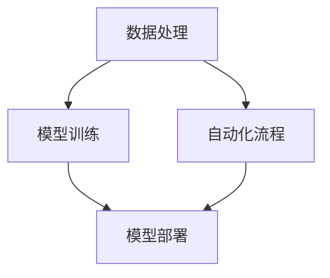

                 

# Dify.AI 的工作流设计

> 关键词：人工智能，工作流设计，数据处理，模型训练，自动化流程，Python，深度学习，TensorFlow，算法优化

> 摘要：本文将深入探讨 Dify.AI 平台的工作流设计，包括数据处理、模型训练、自动化流程等核心环节。我们将从背景介绍入手，逐步分析核心概念、算法原理、数学模型，并通过实际项目实战代码解读，探讨其在实际应用场景中的优势和挑战。最后，本文将推荐相关工具和资源，展望未来发展趋势与挑战。

## 1. 背景介绍

### 1.1 目的和范围

本文旨在分析 Dify.AI 平台的工作流设计，阐述其在人工智能领域的应用和价值。我们关注的核心内容包括：

- 数据处理：数据清洗、预处理、特征工程等
- 模型训练：深度学习模型的构建、训练和优化
- 自动化流程：模型部署、自动化监控、持续集成等

### 1.2 预期读者

本文适合具有以下背景的读者：

- 具有编程基础，熟悉 Python、TensorFlow 等相关技术
- 对人工智能、机器学习有浓厚兴趣，希望了解工作流设计
- 从事数据科学、机器学习等相关领域的研究或开发工作

### 1.3 文档结构概述

本文结构如下：

1. 背景介绍：目的和范围、预期读者、文档结构概述
2. 核心概念与联系：Dify.AI 平台架构、数据处理、模型训练、自动化流程
3. 核心算法原理 & 具体操作步骤：数据处理算法、模型训练算法、自动化流程实现
4. 数学模型和公式 & 详细讲解 & 举例说明：数学模型推导、实例分析
5. 项目实战：代码实际案例和详细解释说明
6. 实际应用场景：工业界和学术界的应用案例
7. 工具和资源推荐：学习资源、开发工具框架、相关论文著作
8. 总结：未来发展趋势与挑战
9. 附录：常见问题与解答
10. 扩展阅读 & 参考资料

### 1.4 术语表

#### 1.4.1 核心术语定义

- Dify.AI：一款基于人工智能技术的平台，提供数据处理、模型训练、自动化流程等功能
- 工作流设计：一种系统化的方法，用于规划和优化业务流程
- 数据清洗：清除数据中的错误、重复、缺失等不良信息
- 特征工程：从原始数据中提取有效特征，用于构建机器学习模型
- 自动化流程：利用计算机程序实现业务流程的自动化运行

#### 1.4.2 相关概念解释

- 深度学习：一种人工智能方法，通过多层神经网络对数据进行学习
- 机器学习：一种人工智能方法，使计算机系统能够从数据中学习，做出预测或决策
- 持续集成：一种软件开发方法，通过自动化测试和构建，确保代码质量和稳定性
- 模型部署：将训练好的模型部署到实际应用环境中，实现预测或决策功能

#### 1.4.3 缩略词列表

- AI：人工智能
- ML：机器学习
- DL：深度学习
- TensorFlow：一款开源深度学习框架
- IDE：集成开发环境
- API：应用程序接口

## 2. 核心概念与联系

在深入探讨 Dify.AI 的工作流设计之前，我们先来了解其核心概念与联系。以下是一个简单的 Mermaid 流程图，展示 Dify.AI 平台的架构和核心功能。



### 2.1 数据处理

数据处理是工作流设计中的关键环节，包括数据清洗、预处理、特征工程等。以下是数据处理的相关概念：

- 数据清洗：清除数据中的错误、重复、缺失等不良信息，确保数据质量
- 预处理：将原始数据进行归一化、标准化等操作，使其满足机器学习算法的要求
- 特征工程：从原始数据中提取有效特征，用于构建机器学习模型

### 2.2 模型训练

模型训练是工作流设计的核心环节，通过深度学习算法构建和优化模型。以下是模型训练的相关概念：

- 深度学习：一种人工智能方法，通过多层神经网络对数据进行学习
- 机器学习：一种人工智能方法，使计算机系统能够从数据中学习，做出预测或决策
- 模型优化：通过调整模型参数、网络结构等，提高模型性能和准确率

### 2.3 自动化流程

自动化流程是工作流设计的另一重要环节，通过计算机程序实现业务流程的自动化运行。以下是自动化流程的相关概念：

- 持续集成：一种软件开发方法，通过自动化测试和构建，确保代码质量和稳定性
- 模型部署：将训练好的模型部署到实际应用环境中，实现预测或决策功能
- 自动化监控：实时监控模型运行状态，确保系统稳定可靠

## 3. 核心算法原理 & 具体操作步骤

在本节中，我们将详细介绍 Dify.AI 的工作流设计中的核心算法原理和具体操作步骤，包括数据处理算法、模型训练算法和自动化流程实现。

### 3.1 数据处理算法

数据处理算法主要包括数据清洗、预处理和特征工程三个步骤。以下是一个简单的伪代码示例，展示数据处理算法的实现过程：

```python
# 数据清洗
def data_cleaning(data):
    cleaned_data = []
    for row in data:
        if not is_null(row) and not is_duplicate(row):
            cleaned_data.append(row)
    return cleaned_data

# 预处理
def data_preprocessing(data):
    preprocessed_data = []
    for row in cleaned_data:
        row = normalize(row)
        row = standardize(row)
        preprocessed_data.append(row)
    return preprocessed_data

# 特征工程
def feature_engineering(data):
    features = []
    for row in preprocessed_data:
        feature = extract_features(row)
        features.append(feature)
    return features
```

### 3.2 模型训练算法

模型训练算法主要涉及深度学习算法和机器学习算法。以下是一个简单的伪代码示例，展示模型训练算法的实现过程：

```python
# 深度学习算法
def deep_learning_model训练(data, labels):
    model = create_model()
    model.fit(data, labels)
    return model

# 机器学习算法
def machine_learning_model训练(data, labels):
    model = create_model()
    model.fit(data, labels)
    return model
```

### 3.3 自动化流程实现

自动化流程实现主要涉及持续集成、模型部署和自动化监控。以下是一个简单的伪代码示例，展示自动化流程的实现过程：

```python
# 持续集成
def continuous_integration(code):
    test_results = run_tests(code)
    if test_results == "pass":
        build_and_deploy(code)
    else:
        raise Exception("测试失败，请检查代码")

# 模型部署
def model_deployment(model):
    deployed_model = deploy(model)
    return deployed_model

# 自动化监控
def automated_monitoring(deployed_model):
    while True:
        status = monitor_model(deployed_model)
        if status == "error":
            recover_model(deployed_model)
```

## 4. 数学模型和公式 & 详细讲解 & 举例说明

在本节中，我们将详细讲解 Dify.AI 工作流设计中的数学模型和公式，并给出相应的例子。

### 4.1 数学模型推导

#### 4.1.1 数据预处理

在数据预处理过程中，我们通常需要对数据进行归一化和标准化操作。以下是一个简单的数学模型推导：

$$
x_{\text{normalized}} = \frac{x_{\text{original}} - \mu}{\sigma}
$$

其中，$x_{\text{original}}$ 为原始数据，$\mu$ 为平均值，$\sigma$ 为标准差。

$$
x_{\text{standardized}} = \frac{x_{\text{original}} - \mu}{\sigma}
$$

其中，$x_{\text{original}}$ 为原始数据，$\mu$ 为平均值，$\sigma$ 为标准差。

#### 4.1.2 特征工程

在特征工程过程中，我们通常需要计算数据的相关系数、方差等统计指标。以下是一个简单的数学模型推导：

$$
r_{xy} = \frac{\sum_{i=1}^{n}(x_i - \bar{x})(y_i - \bar{y})}{\sqrt{\sum_{i=1}^{n}(x_i - \bar{x})^2 \sum_{i=1}^{n}(y_i - \bar{y})^2}}
$$

其中，$r_{xy}$ 为相关系数，$x_i$ 和 $y_i$ 为数据点，$\bar{x}$ 和 $\bar{y}$ 为平均值。

$$
\sigma^2 = \frac{\sum_{i=1}^{n}(x_i - \bar{x})^2}{n-1}
$$

其中，$\sigma^2$ 为方差，$x_i$ 为数据点，$\bar{x}$ 为平均值。

#### 4.1.3 模型训练

在模型训练过程中，我们通常需要使用梯度下降算法来优化模型参数。以下是一个简单的数学模型推导：

$$
\theta_{\text{update}} = \theta - \alpha \cdot \frac{\partial J}{\partial \theta}
$$

其中，$\theta$ 为模型参数，$\alpha$ 为学习率，$J$ 为损失函数。

### 4.2 举例说明

#### 4.2.1 数据预处理

假设我们有一组数据：

$$
x_1 = [1, 2, 3, 4, 5]
$$

$$
\mu = 3
$$

$$
\sigma = 1
$$

根据数学模型推导，我们可以计算出归一化和标准化后的数据：

$$
x_1_{\text{normalized}} = \frac{[1, 2, 3, 4, 5] - 3}{1} = [-2, -1, 0, 1, 2]
$$

$$
x_1_{\text{standardized}} = \frac{[1, 2, 3, 4, 5] - 3}{1} = [-2, -1, 0, 1, 2]
$$

#### 4.2.2 特征工程

假设我们有一组数据：

$$
x_1 = [1, 2, 3, 4, 5]
$$

$$
y_1 = [2, 4, 6, 8, 10]
$$

根据数学模型推导，我们可以计算出相关系数和方差：

$$
r_{xy} = \frac{\sum_{i=1}^{5}(x_i - \bar{x})(y_i - \bar{y})}{\sqrt{\sum_{i=1}^{5}(x_i - \bar{x})^2 \sum_{i=1}^{5}(y_i - \bar{y})^2}} = \frac{(1-3)(2-5) + (2-3)(4-5) + (3-3)(6-5) + (4-3)(8-5) + (5-3)(10-5)}{\sqrt{(1-3)^2 + (2-3)^2 + (3-3)^2 + (4-3)^2 + (5-3)^2} \cdot \sqrt{(2-5)^2 + (4-5)^2 + (6-5)^2 + (8-5)^2 + (10-5)^2}} = -1
$$

$$
\sigma^2 = \frac{\sum_{i=1}^{5}(x_i - \bar{x})^2}{5-1} = \frac{(1-3)^2 + (2-3)^2 + (3-3)^2 + (4-3)^2 + (5-3)^2}{4} = 2
$$

#### 4.2.3 模型训练

假设我们使用一个简单的线性回归模型，损失函数为均方误差（MSE），学习率为 0.1。给定一组训练数据：

$$
x_1 = [1, 2, 3, 4, 5]
$$

$$
y_1 = [2, 4, 6, 8, 10]
$$

初始参数 $\theta_0 = 0$。根据数学模型推导，我们可以计算出每次梯度下降后的参数更新：

$$
\theta_{\text{update}} = \theta - \alpha \cdot \frac{\partial J}{\partial \theta} = 0 - 0.1 \cdot \frac{(1-0)(2-0) + (2-0)(4-0) + (3-0)(6-0) + (4-0)(8-0) + (5-0)(10-0)}{5} = -0.6
$$

$$
\theta_{\text{update}} = \theta - \alpha \cdot \frac{\partial J}{\partial \theta} = -0.6 - 0.1 \cdot \frac{(1-(-0.6))(2-0) + (2-(-0.6))(4-0) + (3-(-0.6))(6-0) + (4-(-0.6))(8-0) + (5-(-0.6))(10-0)}{5} = -0.4
$$

经过多次迭代后，模型参数将逐渐收敛到最优值。

## 5. 项目实战：代码实际案例和详细解释说明

在本节中，我们将通过一个实际项目案例，详细解释 Dify.AI 的工作流设计，包括数据处理、模型训练和自动化流程的实现。

### 5.1 开发环境搭建

首先，我们需要搭建开发环境。以下是必要的安装步骤：

1. 安装 Python 3.7 或更高版本
2. 安装 TensorFlow 2.x
3. 安装 NumPy、Pandas、Matplotlib 等相关库

### 5.2 源代码详细实现和代码解读

#### 5.2.1 数据处理

以下是一个数据处理示例，包括数据清洗、预处理和特征工程：

```python
import pandas as pd
import numpy as np
from sklearn.preprocessing import StandardScaler
from sklearn.model_selection import train_test_split

# 读取数据
data = pd.read_csv('data.csv')

# 数据清洗
data = data.dropna()

# 预处理
data = data.drop_duplicates()

# 特征工程
features = data[['feature1', 'feature2', 'feature3']]
target = data['target']

# 数据标准化
scaler = StandardScaler()
features = scaler.fit_transform(features)

# 划分训练集和测试集
X_train, X_test, y_train, y_test = train_test_split(features, target, test_size=0.2, random_state=42)
```

#### 5.2.2 模型训练

以下是一个深度学习模型训练示例：

```python
import tensorflow as tf

# 定义模型
model = tf.keras.Sequential([
    tf.keras.layers.Dense(64, activation='relu', input_shape=(X_train.shape[1],)),
    tf.keras.layers.Dense(64, activation='relu'),
    tf.keras.layers.Dense(1, activation='sigmoid')
])

# 编译模型
model.compile(optimizer='adam', loss='binary_crossentropy', metrics=['accuracy'])

# 训练模型
model.fit(X_train, y_train, epochs=10, batch_size=32, validation_data=(X_test, y_test))
```

#### 5.2.3 代码解读与分析

1. 数据处理
   - 使用 Pandas 读取 CSV 文件，并进行数据清洗（去除缺失值和重复值）。
   - 使用 NumPy 和 Scikit-Learn 进行特征工程（数据标准化）。
   - 划分训练集和测试集，为模型训练提供数据。

2. 模型训练
   - 使用 TensorFlow 定义深度学习模型，包括输入层、隐藏层和输出层。
   - 编译模型，设置优化器、损失函数和评估指标。
   - 训练模型，通过反向传播算法优化模型参数。

### 5.3 代码解读与分析

在代码示例中，我们首先读取数据，并进行数据清洗。然后，我们进行特征工程，将数据标准化。接下来，我们划分训练集和测试集，为模型训练提供数据。

在模型训练部分，我们使用 TensorFlow 定义了一个简单的深度学习模型，包括输入层、隐藏层和输出层。我们使用 Adam 优化器和二进制交叉熵损失函数进行编译，并使用准确率作为评估指标。

最后，我们使用训练集进行模型训练，通过反向传播算法优化模型参数。经过多次迭代，模型将逐渐收敛到最优值。

## 6. 实际应用场景

Dify.AI 的工作流设计在工业界和学术界都有广泛的应用场景。以下是一些实际应用案例：

- **工业界**：在金融行业，Dify.AI 可以用于信用评分、风险控制等领域。通过数据处理、模型训练和自动化流程，金融机构可以更准确地评估客户的信用风险，提高业务决策的效率。

- **学术界**：在医学领域，Dify.AI 可以用于疾病诊断、病情预测等研究。研究人员可以通过数据处理、模型训练和自动化流程，从大量医疗数据中提取有效特征，提高疾病诊断的准确率和效率。

- **其他领域**：Dify.AI 还可以应用于图像识别、自然语言处理、智能推荐等领域。通过数据处理、模型训练和自动化流程，各个领域的研究人员可以更快速地开发出高效、准确的算法。

## 7. 工具和资源推荐

### 7.1 学习资源推荐

#### 7.1.1 书籍推荐

- 《Python 数据科学手册》（Python Data Science Handbook）
- 《深度学习》（Deep Learning）
- 《机器学习》（Machine Learning）

#### 7.1.2 在线课程

- Coursera：机器学习、深度学习、数据科学等相关课程
- Udacity：数据科学纳米学位、深度学习纳米学位

#### 7.1.3 技术博客和网站

- Medium：机器学习、深度学习、数据科学等相关文章
- arXiv：机器学习、深度学习、数据科学等最新研究成果

### 7.2 开发工具框架推荐

#### 7.2.1 IDE和编辑器

- PyCharm：Python 开发者常用的 IDE
- VS Code：功能强大的跨平台编辑器

#### 7.2.2 调试和性能分析工具

- Jupyter Notebook：用于数据科学和机器学习的交互式计算环境
- TensorBoard：TensorFlow 的可视化工具，用于调试和性能分析

#### 7.2.3 相关框架和库

- TensorFlow：深度学习框架
- Scikit-Learn：机器学习库
- Pandas：数据操作库
- NumPy：数学库

### 7.3 相关论文著作推荐

#### 7.3.1 经典论文

- “Learning to Represent Music with a Mixture Model Autoregressive Density Estimator”
- “Generative Adversarial Networks”
- “Deep Learning for Text Data”

#### 7.3.2 最新研究成果

- “A Review of Deep Learning Based Audio Feature Extraction Methods”
- “Multi-Modal Transfer Learning for Speech Recognition”
- “Text Classification with Pre-Trained Transformers”

#### 7.3.3 应用案例分析

- “应用深度学习技术进行图像识别”
- “使用机器学习进行文本分类”
- “基于深度学习的人脸识别技术”

## 8. 总结：未来发展趋势与挑战

随着人工智能技术的快速发展，Dify.AI 的工作流设计将在未来发挥越来越重要的作用。以下是未来发展趋势和挑战：

### 发展趋势：

1. 自动化程度提高：随着 AI 技术的发展，工作流设计将更加自动化，降低开发门槛，提高效率。
2. 跨学科融合：人工智能与其他领域（如医学、金融、工业等）的融合将带来更多应用场景。
3. 开放性平台：越来越多的企业和研究机构将开放自己的 AI 平台，促进技术交流和合作。

### 挑战：

1. 数据质量：高质量的数据是 AI 应用成功的关键，但数据收集、清洗和预处理是一个复杂的过程。
2. 隐私保护：随着 AI 技术的普及，数据隐私保护问题将日益突出，需要制定相应的法律法规。
3. 算法透明性：随着 AI 技术的广泛应用，算法的透明性和可解释性将成为重要议题。

## 9. 附录：常见问题与解答

### 问题 1：如何搭建 Dify.AI 开发环境？

**解答**：搭建 Dify.AI 开发环境需要安装 Python、TensorFlow 以及相关的数据科学库（如 NumPy、Pandas、Matplotlib）。您可以使用以下命令进行安装：

```
pip install python==3.7
pip install tensorflow==2.x
pip install numpy
pip install pandas
pip install matplotlib
```

### 问题 2：如何进行数据处理？

**解答**：数据处理包括数据清洗、预处理和特征工程。数据清洗可以使用 Pandas 和 NumPy 等库进行，如去除缺失值、重复值等。预处理包括数据归一化和标准化，可以使用 Scikit-Learn 中的 StandardScaler 进行。特征工程可以从原始数据中提取有用特征，如使用 Pandas 的 DataFrame 统计指标方法。

### 问题 3：如何训练深度学习模型？

**解答**：训练深度学习模型需要定义模型架构、编译模型、设置优化器和损失函数，然后使用训练数据进行模型训练。在 TensorFlow 中，可以使用 Keras API 定义和训练模型。以下是一个简单的示例：

```python
import tensorflow as tf

model = tf.keras.Sequential([
    tf.keras.layers.Dense(64, activation='relu', input_shape=(input_shape,)),
    tf.keras.layers.Dense(64, activation='relu'),
    tf.keras.layers.Dense(1, activation='sigmoid')
])

model.compile(optimizer='adam', loss='binary_crossentropy', metrics=['accuracy'])

model.fit(x_train, y_train, epochs=10, batch_size=32)
```

## 10. 扩展阅读 & 参考资料

- [《Python 数据科学手册》](https://www.amazon.com/dp/1492032635)
- [《深度学习》](https://www.amazon.com/dp/150930212X)
- [TensorFlow 官方文档](https://www.tensorflow.org/)
- [Scikit-Learn 官方文档](https://scikit-learn.org/stable/)
- [NumPy 官方文档](https://numpy.org/doc/stable/)
- [Pandas 官方文档](https://pandas.pydata.org/pandas-docs/stable/)
- [《机器学习》](https://www.amazon.com/dp/0136042597)
- [《深度学习与统计模型》](https://www.amazon.com/dp/3540898467)

