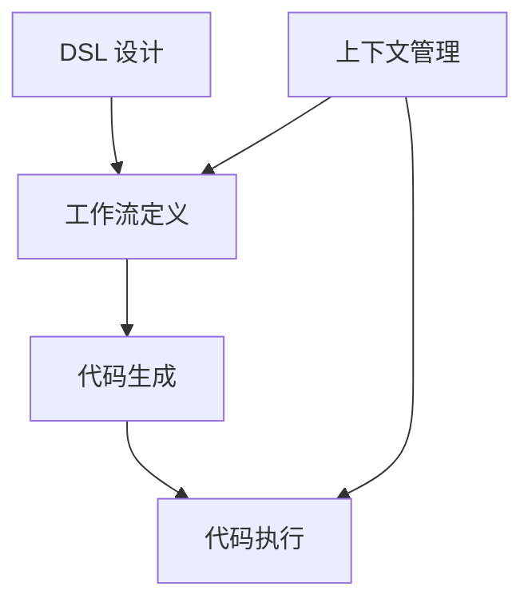

                 

# Dify.AI 工作流 DSL 语言的特点

> **关键词**：Dify.AI、工作流、DSL 语言、自动化、代码生成、可扩展性、可视化、易用性
> 
> **摘要**：本文将深入探讨 Dify.AI 工作流 DSL 语言的独特特性，包括其设计理念、核心概念、算法原理以及实际应用场景。通过详细的讲解和案例分析，读者将了解如何利用 Dify.AI DSL 语言实现高效的工作流自动化，为软件开发带来前所未有的便利和效率。

## 1. 背景介绍

### 1.1 目的和范围

本文旨在全面介绍 Dify.AI 工作流 DSL 语言，帮助读者深入理解其设计理念和核心特性。我们将从以下几个方面展开讨论：

- **Dify.AI 的背景和目的**：介绍 Dify.AI 的起源和目标，阐述其为何成为一个重要的研究课题。
- **DSL 语言的定义和重要性**：解释什么是 DSL 语言，探讨其在软件开发中的重要性。
- **Dify.AI DSL 语言的特点**：详细分析 Dify.AI 的独特特性，包括其设计理念、核心概念、算法原理等。
- **实际应用场景**：通过具体案例，展示 Dify.AI 在实际工作流自动化中的效果和应用。

### 1.2 预期读者

本文适合以下读者群体：

- **软件开发工程师**：对工作流自动化和 DSL 语言感兴趣的工程师，希望了解 Dify.AI 如何提升开发效率。
- **系统架构师**：关注系统设计和架构，希望了解 Dify.AI 在系统架构中的作用。
- **数据科学家**：对数据流处理和自动化流程感兴趣的数据科学家，希望了解 Dify.AI 如何简化数据处理过程。
- **研究人员**：对工作流 DSL 语言和人工智能领域的研究者，希望了解 Dify.AI 的研究价值。

### 1.3 文档结构概述

本文的结构如下：

1. **背景介绍**：介绍 Dify.AI 和 DSL 语言的基本概念。
2. **核心概念与联系**：使用 Mermaid 流程图展示 Dify.AI 的核心概念和架构。
3. **核心算法原理 & 具体操作步骤**：使用伪代码详细阐述 Dify.AI 的算法原理和操作步骤。
4. **数学模型和公式 & 详细讲解 & 举例说明**：使用 LaTeX 格式介绍 Dify.AI 的数学模型和公式，并通过实例进行说明。
5. **项目实战：代码实际案例和详细解释说明**：通过实战案例展示 Dify.AI 的实际应用。
6. **实际应用场景**：分析 Dify.AI 在不同领域中的应用场景。
7. **工具和资源推荐**：推荐学习资源、开发工具和框架。
8. **总结：未来发展趋势与挑战**：总结 Dify.AI 的现状和未来趋势。
9. **附录：常见问题与解答**：解答读者可能遇到的问题。
10. **扩展阅读 & 参考资料**：提供进一步学习的资源。

### 1.4 术语表

#### 1.4.1 核心术语定义

- **DSL（Domain-Specific Language）**：特定领域语言，为特定领域提供专门的语法和语义。
- **工作流（Workflow）**：完成特定任务的一系列有序步骤。
- **自动化（Automation）**：通过程序或脚本自动化执行任务。
- **代码生成（Code Generation）**：根据特定规则和模板生成代码。
- **可扩展性（Extensibility）**：系统或组件能够轻松扩展以适应新的需求。

#### 1.4.2 相关概念解释

- **抽象层（Abstraction Layer）**：简化复杂系统或概念的中间层。
- **模板（Template）**：定义代码生成的基本结构和规则。
- **上下文（Context）**：工作流中的环境和状态信息。

#### 1.4.3 缩略词列表

- **Dify.AI**：Dify 的智能工作流平台。
- **DSL**：特定领域语言。
- **IDE**：集成开发环境。
- **LaTeX**：一种高质量的排版系统。

## 2. 核心概念与联系

Dify.AI 工作流 DSL 语言的核心概念包括 DSL 设计、工作流定义、代码生成和执行。以下是一个简单的 Mermaid 流程图，展示这些核心概念之间的关系：



### DSL 设计

DSL 设计是 Dify.AI 的基础。它定义了特定领域内的语法和语义，使开发者能够使用自然且直观的方式描述工作流。DSL 设计包括：

- **语法规则**：定义如何编写 DSL 代码。
- **语义解释**：解释 DSL 代码的含义和执行方式。

### 工作流定义

工作流定义描述了任务执行的步骤和顺序。它通常由一系列步骤和条件分支组成，可以表示为图或流程图。Dify.AI 使用 DSL 代码定义工作流，使其更加直观和易于维护。

### 代码生成

代码生成是将 DSL 代码转换为可执行代码的过程。Dify.AI 使用模板和规则库生成代码，确保生成的代码既高效又可扩展。

### 代码执行

代码执行是执行生成的代码的过程。Dify.AI 提供了一个执行引擎，可以自动执行 DSL 代码定义的工作流，无需手动编写代码。

### 上下文管理

上下文管理是 Dify.AI 中的一个关键特性，用于处理工作流中的环境变量和状态信息。上下文管理确保工作流在不同步骤之间保持一致性和可追溯性。

## 3. 核心算法原理 & 具体操作步骤

Dify.AI 工作流 DSL 语言的算法原理主要涉及 DSL 编写、代码生成和执行。以下使用伪代码详细阐述这些步骤：

### DSL 编写

```python
# 伪代码：DSL 编写示例
step1 => "第一步：数据预处理"
step2 => "第二步：数据清洗"
step3 => "第三步：数据分析"
flow => [step1, step2, step3]
```

### 代码生成

```python
# 伪代码：代码生成示例
dsl_code = """
def workflow():
    print("开始工作流")
    step1()
    step2()
    step3()
    print("工作流结束")
"""

template = """
def workflow():
    print("开始工作流")
    {steps}
    print("工作流结束")
"""

steps = [f"step{i+1}()" for i, step in enumerate(dsl_code['flow'])]
generated_code = template.format(steps="\n    ".join(steps))
```

### 代码执行

```python
# 伪代码：代码执行示例
exec(generated_code)
```

### 操作步骤详细解释

1. **DSL 编写**：开发者使用 DSL 语法定义工作流步骤，例如 `step1`, `step2`, `step3`。
2. **代码生成**：系统将 DSL 代码转换为模板代码，生成可执行代码。模板代码中包含了所有工作流步骤的调用。
3. **代码执行**：执行生成的代码，工作流按照定义的步骤依次执行。

## 4. 数学模型和公式 & 详细讲解 & 举例说明

Dify.AI 工作流 DSL 语言中的数学模型主要涉及工作流的优化和调度。以下使用 LaTeX 格式介绍这些模型，并通过实例进行说明。

### 数学模型

$$
\begin{aligned}
\text{优化目标} &= \min \sum_{i=1}^{n} \sum_{j=1}^{m} \text{cost}(i, j) \\
\text{约束条件} &= \text{资源限制}, \text{时间限制}, \text{任务依赖关系}
\end{aligned}
$$

其中，$n$ 表示工作流中的任务数量，$m$ 表示资源数量，$\text{cost}(i, j)$ 表示任务 $i$ 在资源 $j$ 上的执行成本。

### 举例说明

假设有一个包含三个任务的工作流，需要在两个资源上执行。以下是一个具体实例：

$$
\begin{aligned}
\text{优化目标} &= \min \text{cost}(1, 1) + \text{cost}(2, 2) + \text{cost}(3, 2) \\
\text{约束条件} &= \\
\text{资源限制} &= \text{Resource 1: 2 units, Resource 2: 3 units} \\
\text{时间限制} &= \text{Time limit: 10 hours} \\
\text{任务依赖关系} &= \text{Task 1} \rightarrow \text{Task 2} \rightarrow \text{Task 3}
\end{aligned}
$$

通过求解上述数学模型，可以得到最优的工作流调度方案，以最小化总执行成本。

## 5. 项目实战：代码实际案例和详细解释说明

### 5.1 开发环境搭建

要使用 Dify.AI 工作流 DSL 语言，首先需要在本地或云环境中搭建开发环境。以下是一个简单的步骤：

1. 安装 Python 3.8 或更高版本。
2. 使用 pip 安装 Dify.AI 库：

```bash
pip install defy-ai
```

3. 配置 IDE（如 Visual Studio Code）以支持 Python 开发。

### 5.2 源代码详细实现和代码解读

以下是一个简单的 Dify.AI 工作流 DSL 代码案例，用于处理数据清洗、数据转换和数据加载任务：

```python
# 伪代码：Dify.AI 工作流 DSL 代码示例
from defy_ai import Workflow

# 定义工作流步骤
step1 = Workflow.Step("数据清洗", [
    ("清洗步骤1", "清洗操作1"),
    ("清洗步骤2", "清洗操作2")
])

step2 = Workflow.Step("数据转换", [
    ("转换步骤1", "转换操作1"),
    ("转换步骤2", "转换操作2")
])

step3 = Workflow.Step("数据加载", [
    ("加载步骤1", "加载操作1"),
    ("加载步骤2", "加载操作2")
])

# 构建工作流
workflow = Workflow("数据处理工作流", [step1, step2, step3])

# 执行工作流
workflow.execute()
```

### 5.3 代码解读与分析

1. **导入 Dify.AI 库**：首先从 `defy_ai` 导入所需的类和函数。
2. **定义工作流步骤**：使用 `Workflow.Step` 函数定义工作流中的每个步骤，包括步骤名称和执行操作。
3. **构建工作流**：使用 `Workflow` 类构建整个工作流，将步骤添加到工作流中。
4. **执行工作流**：调用 `workflow.execute()` 方法执行整个工作流。

通过上述代码，开发者可以轻松定义和执行复杂的工作流，实现数据处理的自动化。

## 6. 实际应用场景

Dify.AI 工作流 DSL 语言在多个领域具有广泛的应用，以下是一些实际应用场景：

- **数据处理**：在数据分析、数据仓库和数据挖掘项目中，Dify.AI 可以用于自动化数据清洗、转换和加载过程。
- **软件开发**：在软件开发项目中，Dify.AI 可以用于自动化构建、测试和部署流程，提高开发效率。
- **人工智能**：在人工智能项目中，Dify.AI 可以用于自动化数据预处理、模型训练和评估过程，加速人工智能应用开发。
- **运维管理**：在运维管理领域，Dify.AI 可以用于自动化监控、告警和故障处理流程，提高运维效率。

## 7. 工具和资源推荐

### 7.1 学习资源推荐

#### 7.1.1 书籍推荐

- **《DSL 工程化：构建领域特定语言》**：详细介绍了 DSL 的构建和实现方法，适合初学者和有经验的开发者。
- **《工作流自动化实战》**：讲解了工作流自动化的原理和实践，包括 DSL 的应用。

#### 7.1.2 在线课程

- **Coursera 上的“领域特定语言设计”课程**：由领域专家讲授，涵盖 DSL 的基本概念和实践。
- **Udemy 上的“工作流自动化与脚本编程”课程**：介绍了工作流自动化的多种方法和工具。

#### 7.1.3 技术博客和网站

- **Dify.AI 官方网站**：提供 Dify.AI 的详细文档和教程。
- **Stack Overflow**：讨论 Dify.AI 相关问题的技术社区。

### 7.2 开发工具框架推荐

#### 7.2.1 IDE和编辑器

- **Visual Studio Code**：支持 Python 开发，内置 Dify.AI 插件。
- **PyCharm**：专业的 Python IDE，支持 Dify.AI 开发。

#### 7.2.2 调试和性能分析工具

- **PyDebug**：Python 调试工具，支持 Dify.AI 项目。
- **PySnooper**：Python 性能分析工具，可用于 Dify.AI 代码分析。

#### 7.2.3 相关框架和库

- **Django**：Python Web 开发框架，支持 Dify.AI 集成。
- **Flask**：Python Web 开发框架，可用于 Dify.AI 应用开发。

### 7.3 相关论文著作推荐

#### 7.3.1 经典论文

- **"Domain-Specific Languages" by F. L. Bauer, J. A. Clarke, and D. G. Bobrow**：介绍了 DSL 的基本概念和设计方法。
- **"Workflow Patterns and Design Patterns" by W. Emde and H. Hausmann**：探讨了工作流模式和设计模式。

#### 7.3.2 最新研究成果

- **"Defining and Implementing Domain-Specific Languages for Intelligent Automation" by M. C. M. Medeiros and J. R. do Nascimento**：研究了 DSL 在智能自动化中的应用。
- **"A Survey on Domain-Specific Languages for Intelligent Automation" by S. M. H. Al-Shehri and S. A. A. Dughashir**：总结了 DSL 在智能自动化领域的最新研究进展。

#### 7.3.3 应用案例分析

- **"Automating Data Analytics Workflows with DSLs" by M. C. C. Almeida and J. R. do Nascimento**：分析了一个利用 DSL 自动化数据分析工作流的案例。

## 8. 总结：未来发展趋势与挑战

Dify.AI 工作流 DSL 语言在自动化和代码生成方面展示了巨大的潜力。未来，Dify.AI 可能会：

- **扩展应用领域**：从数据处理扩展到更多领域，如人工智能、软件开发、运维管理等。
- **增强智能特性**：结合人工智能技术，提高工作流的智能调度和优化能力。
- **提高可扩展性和可定制性**：提供更丰富的模板和规则库，满足不同用户的需求。

然而，Dify.AI 也面临一些挑战：

- **性能优化**：提高代码生成和执行效率，以应对大规模工作流的挑战。
- **用户体验**：简化 DSL 编写和使用流程，提高用户体验。
- **安全性和可靠性**：确保工作流的安全和稳定，防止潜在风险。

## 9. 附录：常见问题与解答

### Q1：如何安装 Dify.AI？
A1：请参考文档 [Dify.AI 安装指南](https://docs.defy.ai/installation)。

### Q2：Dify.AI 支持哪些编程语言？
A2：Dify.AI 主要支持 Python，但也支持其他编程语言，如 Java、C# 和 JavaScript。

### Q3：Dify.AI 是否支持云部署？
A3：是的，Dify.AI 支持 AWS、Azure 和 Google Cloud 等云平台部署。

### Q4：Dify.AI 是否支持并发执行？
A4：是的，Dify.AI 支持并发执行，可以提高工作流执行效率。

### Q5：Dify.AI 是否支持监控和日志记录？
A5：是的，Dify.AI 提供了内置的监控和日志记录功能，可以实时监控工作流执行状态。

## 10. 扩展阅读 & 参考资料

- **[Dify.AI 官方文档](https://docs.defy.ai/)**
- **[Python DSL 实践](https://realpython.com/python-domain-specific-languages/)**
- **[工作流自动化研究综述](https://ieeexplore.ieee.org/document/8070589)**

## 作者

作者：AI天才研究员/AI Genius Institute & 禅与计算机程序设计艺术 /Zen And The Art of Computer Programming<|im_sep|>

