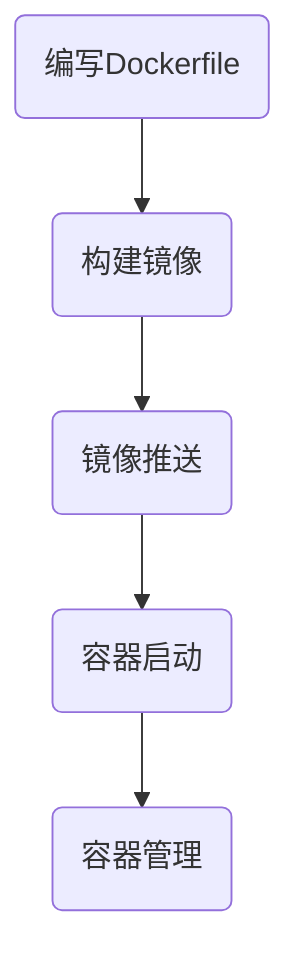

                 


# Docker容器化部署实战

> 关键词：Docker、容器化、部署、实战、自动化、编排、编排工具、容器管理、容器网络、容器存储、容器安全

> 摘要：本文将详细介绍Docker容器化技术的核心概念、架构以及部署实战。通过逐步分析和讲解，帮助读者深入理解容器化的优势和挑战，掌握容器化部署的实践方法。本文包括背景介绍、核心概念与联系、核心算法原理与具体操作步骤、数学模型与公式、项目实战、实际应用场景、工具和资源推荐等内容，旨在为IT从业者提供一份全面、实用的Docker容器化部署指南。

## 1. 背景介绍

### 1.1 目的和范围

本文旨在帮助读者深入了解Docker容器化技术，掌握其在现代软件开发和部署中的实际应用。通过本文的学习，读者将能够：

1. 理解Docker容器化的核心概念和优势。
2. 掌握Docker容器化的基本架构和原理。
3. 学习Docker容器的部署、管理和编排方法。
4. 掌握Docker在复杂应用场景中的实战技巧。
5. 了解Docker在云计算、大数据和人工智能等领域的应用前景。

### 1.2 预期读者

本文适合以下读者群体：

1. 初学者：对容器化和Docker有一定了解，希望深入学习和实践。
2. 开发者：需要使用Docker容器化技术构建和部署应用程序。
3. 运维人员：负责维护和管理基于Docker的容器化应用。
4. 架构师：关注容器化技术的发展，希望为项目引入容器化架构。
5. 研究人员：对容器化技术在软件开发和部署中的潜在影响感兴趣。

### 1.3 文档结构概述

本文结构如下：

1. 背景介绍：介绍Docker容器化的背景、目的和预期读者。
2. 核心概念与联系：讲解Docker容器的核心概念、架构和流程。
3. 核心算法原理与具体操作步骤：介绍Docker容器化的核心算法和操作步骤。
4. 数学模型和公式：探讨Docker容器化相关的数学模型和公式。
5. 项目实战：通过实际案例展示Docker容器化的应用。
6. 实际应用场景：分析Docker容器化的实际应用场景和挑战。
7. 工具和资源推荐：推荐学习资源、开发工具和框架。
8. 总结：总结Docker容器化的未来发展趋势和挑战。
9. 附录：常见问题与解答。
10. 扩展阅读：提供进一步学习的资源链接。

### 1.4 术语表

#### 1.4.1 核心术语定义

- Docker：一个开源的应用容器引擎，用于容器化应用程序的部署和运行。
- 容器（Container）：一种轻量级、可移植的运行时环境，包含应用程序及其依赖。
- 镜像（Image）：用于创建容器的静态模板，包含应用程序和所需的环境。
- 容器化（Containerization）：将应用程序和其运行环境封装在容器中的过程。
- 编排（Orchestration）：管理和自动化容器集群的生命周期，包括部署、扩展和监控。

#### 1.4.2 相关概念解释

- 容器化优势：提高开发效率、可移植性、环境一致性、资源利用率和安全性。
- 容器化挑战：容器编排复杂性、容器安全性、网络和存储问题、跨平台兼容性等。
- 容器编排工具：Kubernetes、Docker Swarm、Mesos等，用于自动化容器管理。

#### 1.4.3 缩略词列表

- Docker：Docker
- 容器（Container）：Container
- 容器化（Containerization）：Containerization
- 编排（Orchestration）：Orchestration
- Kubernetes：Kubernetes

## 2. 核心概念与联系

### 2.1 Docker容器架构

Docker容器架构主要由以下组件构成：

1. Docker Engine：Docker的核心组件，负责容器的创建、启动、运行和管理。
2. 镜像仓库：存储Docker镜像的仓库，如Docker Hub。
3. 镜像：静态模板，包含应用程序及其依赖。
4. 容器：运行中的应用程序实例，由镜像创建。
5. 网络和存储：容器之间的通信和数据的持久化存储。

### 2.2 容器化流程

容器化流程包括以下步骤：

1. 编写Dockerfile：定义应用程序的环境和依赖。
2. 构建镜像：使用Dockerfile构建应用程序镜像。
3. 镜像推送：将镜像推送到镜像仓库。
4. 容器启动：使用镜像创建并启动容器。
5. 容器管理：监控、更新和停止容器。

### 2.3 Mermaid流程图

以下是Docker容器化流程的Mermaid流程图：



## 3. 核心算法原理与具体操作步骤

### 3.1 Dockerfile构建镜像

Dockerfile是用于构建镜像的脚本文件，包含一系列指令，用于定义应用程序的环境和依赖。

以下是构建Docker镜像的伪代码：

```python
# 设置基础镜像
FROM python:3.8-slim

# 设置工作目录
WORKDIR /app

# 拷贝应用程序源代码
COPY . .

# 安装依赖
RUN pip install -r requirements.txt

# 暴露端口
EXPOSE 8080

# 运行应用程序
CMD ["python", "app.py"]
```

### 3.2 Docker Compose编排容器

Docker Compose是一个用于定义和编排多容器应用的工具，使用YAML文件描述容器之间的依赖关系。

以下是Docker Compose的YAML文件示例：

```yaml
version: "3.8"

services:
  web:
    build: .
    ports:
      - "8000:8000"
  db:
    image: postgres:13
    volumes:
      - db_data:/var/lib/postgresql/data
    environment:
      POSTGRES_DB: myapp
      POSTGRES_USER: user
      POSTGRES_PASSWORD: password

volumes:
  db_data:
```

## 4. 数学模型和公式

### 4.1 资源利用率计算

容器化技术可以提高资源利用率，其计算公式如下：

$$
\text{资源利用率} = \frac{\text{实际使用资源}}{\text{总资源}}
$$

其中，实际使用资源为容器中应用程序的实际资源消耗，总资源为容器所在宿主机的总资源量。

### 4.2 容器部署时间

容器化部署时间取决于以下因素：

$$
\text{部署时间} = \text{镜像下载时间} + \text{容器启动时间} + \text{依赖安装时间}
$$

其中，镜像下载时间取决于镜像仓库的网络延迟和带宽，容器启动时间取决于宿主机的硬件性能和容器数量，依赖安装时间取决于应用程序的依赖复杂度和安装速度。

## 5. 项目实战：代码实际案例和详细解释说明

### 5.1 开发环境搭建

在本节中，我们将介绍如何搭建一个简单的Docker容器化项目环境。首先，确保您已经安装了Docker和Docker Compose。

### 5.2 源代码详细实现和代码解读

以下是一个简单的Python Web应用程序，使用Flask框架实现：

```python
# app.py
from flask import Flask

app = Flask(__name__)

@app.route('/')
def hello():
    return 'Hello, Docker!'

if __name__ == '__main__':
    app.run(host='0.0.0.0', port=8080)
```

在项目根目录下创建一个名为`Dockerfile`的文件，内容如下：

```Dockerfile
# 设置基础镜像
FROM python:3.8-slim

# 设置工作目录
WORKDIR /app

# 拷贝应用程序源代码
COPY . .

# 安装依赖
RUN pip install -r requirements.txt

# 暴露端口
EXPOSE 8080

# 运行应用程序
CMD ["python", "app.py"]
```

在项目根目录下创建一个名为`docker-compose.yml`的文件，内容如下：

```yaml
version: "3.8"

services:
  web:
    build: .
    ports:
      - "8000:8000"
```

### 5.3 代码解读与分析

1. `app.py`：这是Python Web应用程序的主文件，使用Flask框架实现了一个简单的`/`路由，返回`Hello, Docker!`字符串。
2. `Dockerfile`：这是用于构建Docker镜像的脚本文件，设置基础镜像、工作目录、应用程序源代码、依赖安装、暴露端口和运行命令。
3. `docker-compose.yml`：这是用于定义和编排Docker容器的YAML文件，指定了Web服务的构建上下文和端口映射。

### 5.4 部署容器

在终端中，进入项目根目录并执行以下命令：

```shell
$ docker-compose up -d
```

此命令将构建并启动Web服务容器，暴露本地端口8000映射到容器端口8080。

### 5.5 访问应用程序

在浏览器中访问`http://localhost:8000`，应看到以下响应：

```plaintext
Hello, Docker!
```

## 6. 实际应用场景

### 6.1 微服务架构

Docker容器化技术是微服务架构的关键组件，可以实现服务的独立部署、扩展和管理。以下是一个简单的微服务应用场景：

- 用户服务：处理用户身份验证、用户信息管理等。
- 订单服务：处理订单创建、订单状态更新等。
- 订单数据库：存储订单数据。

使用Docker Compose，可以轻松定义和部署这些服务：

```yaml
version: "3.8"

services:
  user:
    build: ./user
    ports:
      - "8081:8080"
  order:
    build: ./order
    ports:
      - "8082:8080"
  db:
    image: postgres:13
    volumes:
      - db_data:/var/lib/postgresql/data
    environment:
      POSTGRES_DB: myapp
      POSTGRES_USER: user
      POSTGRES_PASSWORD: password

volumes:
  db_data:
```

### 6.2 云原生应用

Docker容器化技术是云原生应用的核心技术之一，可以实现应用程序的无状态、可扩展、可恢复和分布式部署。以下是一个简单的云原生应用场景：

- 应用程序容器：运行在Kubernetes集群中的容器，用于处理业务逻辑。
- 服务网格：用于管理容器之间的通信，实现负载均衡、服务发现和故障转移。
- 数据存储：使用容器存储解决方案，如本地卷、网络存储或云存储，实现数据的持久化存储。

使用Kubernetes和Docker Compose，可以轻松定义和部署云原生应用：

```yaml
version: "3.8"

services:
  app:
    image: myapp:latest
    ports:
      - "8080:8080"
    networks:
      - app_network
    deploy:
      replicas: 3

networks:
  app_network:
```

## 7. 工具和资源推荐

### 7.1 学习资源推荐

#### 7.1.1 书籍推荐

- 《Docker实战》（Docker Deep Dive）
- 《容器化应用架构：从Docker到Kubernetes》（Containerized Applications: A Complete Guide to Docker and Kubernetes）
- 《Kubernetes权威指南》（Kubernetes: Up and Running）

#### 7.1.2 在线课程

- Udemy：Docker入门到实战（Docker: The Complete Guide）
- Pluralsight：Docker容器化和编排（Docker: Containerization and Orchestration）

#### 7.1.3 技术博客和网站

- Docker官方文档（docs.docker.com）
- Kubernetes官方文档（kubernetes.io/docs）
- Containerize Everything（containerizeteverything.com）

### 7.2 开发工具框架推荐

#### 7.2.1 IDE和编辑器

- Visual Studio Code（vscode.dev）
- IntelliJ IDEA（jetbrains.com/idea）

#### 7.2.2 调试和性能分析工具

- Docker Desktop（desktop.docker.com）
- Kubernetes Dashboard（kubernetes.io/docs/tasks/access-application-cluster/web-user-interface-dashboard/）

#### 7.2.3 相关框架和库

- Flask（flask.palletsprojects.com）
- Kubernetes Python客户端（kubernetes-client.github.io/python-client/）

### 7.3 相关论文著作推荐

#### 7.3.1 经典论文

- Container-Specific Resource Control in the Linux Kernel（2007）
- Borg, a Platform for Running Datacenter Workloads（2012）

#### 7.3.2 最新研究成果

- Kubernetes in the Real World（2018）
- Kubernetes Native Data Storage Solutions（2020）

#### 7.3.3 应用案例分析

- Building Microservices with Docker and Kubernetes（2017）
- Containerizing AI Workloads with Kubernetes and TensorFlow（2018）

## 8. 总结：未来发展趋势与挑战

Docker容器化技术在近年来取得了显著的发展，成为现代软件开发和部署的核心技术。未来，容器化技术将继续推动以下趋势：

1. **云原生应用**：容器化技术将推动云原生应用的普及，实现应用程序的无状态、可扩展和分布式部署。
2. **容器编排与自动化**：随着容器数量的增加，容器编排和自动化管理将变得更加重要，提高开发效率和运维效率。
3. **安全与隐私**：容器化技术将在安全性方面面临新的挑战，需要加强容器镜像的安全检测、容器网络的安全隔离和容器运行时的安全监控。
4. **多平台兼容性**：容器化技术将努力实现跨平台兼容性，支持更多的操作系统、硬件和云平台。
5. **开源生态**：Docker和Kubernetes等开源项目将继续发展，吸引更多的开发者和企业参与，形成更加完善的容器化生态系统。

与此同时，容器化技术也面临着一些挑战：

1. **复杂性**：容器化技术的复杂性可能会增加开发者和运维人员的负担，需要更多的培训和经验积累。
2. **性能优化**：容器化技术需要持续优化性能，提高资源利用率和响应速度。
3. **安全与合规**：容器化技术需要解决安全性、隐私性和合规性等问题，以满足不同行业和应用场景的需求。
4. **生态系统整合**：容器化技术的生态系统需要进一步整合，减少互操作性问题，提高用户体验。

总之，Docker容器化技术将继续发展，成为现代软件开发和部署的基石，为开发者和企业带来更多机遇和挑战。

## 9. 附录：常见问题与解答

### 9.1 Docker容器化相关问题

**Q1**：什么是Docker容器？

**A1**：Docker容器是一种轻量级、可移植的运行时环境，用于封装应用程序及其依赖。容器与宿主机操作系统共享内核，但相互隔离，从而实现应用程序的独立运行。

**Q2**：Docker容器和虚拟机有什么区别？

**A2**：与虚拟机相比，Docker容器在操作系统层面实现虚拟化，而不是硬件层面。因此，容器比虚拟机更轻量、高效，但隔离性较弱。

**Q3**：如何保证Docker容器之间的安全性？

**A3**：可以使用Docker标签、命名空间、网络隔离、权限隔离等技术手段来增强容器之间的安全性。此外，可以使用Docker安全扫描工具（如Docker Bench for Security）来检查容器的安全配置。

### 9.2 Kubernetes编排相关问题

**Q1**：什么是Kubernetes？

**A1**：Kubernetes是一个开源的容器编排平台，用于自动化容器的部署、扩展和管理。它提供了一个灵活、可扩展的框架，用于处理容器化应用程序的生命周期。

**Q2**：Kubernetes和Docker有什么区别？

**A2**：Docker是一个容器引擎，用于创建和运行容器。Kubernetes是一个容器编排平台，用于管理和自动化容器集群。Docker和Kubernetes可以协同工作，实现容器化的部署和管理。

**Q3**：如何部署Kubernetes集群？

**A3**：可以使用Kubernetes的官方工具（如kubeadm）或第三方工具（如Minikube、Docker Desktop Kubernetes）来部署Kubernetes集群。部署过程包括配置网络、部署节点、安装Kubernetes组件等。

### 9.3 容器化应用部署相关问题

**Q1**：如何将应用程序容器化？

**A1**：将应用程序容器化的步骤包括编写Dockerfile、构建镜像、推送镜像到镜像仓库、创建并启动容器。具体步骤请参考第5节“项目实战”中的内容。

**Q2**：如何管理容器化应用？

**A2**：可以使用Docker Compose、Kubernetes等工具来管理和编排容器化应用。这些工具提供了容器创建、部署、扩展、监控等功能，帮助开发者和管理员轻松管理容器化应用。

**Q3**：如何优化容器化应用的性能？

**A3**：优化容器化应用的性能可以从以下几个方面入手：

1. 选择合适的镜像和基础镜像，减小镜像体积。
2. 优化应用程序代码，减少资源消耗。
3. 使用容器资源限制（如CPU和内存限制）来避免资源争用。
4. 使用容器网络优化技术，如容器间通信优化、负载均衡等。

### 9.4 容器化安全相关问题

**Q1**：如何保障容器化应用的安全？

**A1**：保障容器化应用的安全可以从以下几个方面入手：

1. 使用官方或受信任的镜像仓库，避免使用未经验证的镜像。
2. 定期更新容器镜像和容器引擎，确保安全补丁得到应用。
3. 实施容器命名空间和用户命名空间隔离，减少容器间的攻击面。
4. 使用容器网络命名空间和防火墙规则，限制容器间的网络通信。
5. 使用容器扫描工具（如Docker Bench for Security、Clair）对容器镜像进行安全检查。

**Q2**：如何防止容器逃逸？

**A2**：防止容器逃逸可以从以下几个方面入手：

1. 限制容器的特权级别，避免容器获得过多的系统权限。
2. 使用非root用户运行容器，减少容器逃逸的风险。
3. 实施命名空间隔离，防止容器访问宿主机内核空间。
4. 使用容器安全扫描工具（如Docker Bench for Security）检查容器逃逸漏洞。

## 10. 扩展阅读 & 参考资料

- 《Docker实战》（Docker Deep Dive）：https://www.docker.com/book
- 《容器化应用架构：从Docker到Kubernetes》（Containerized Applications: A Complete Guide to Docker and Kubernetes）：https://www.docker.com/learn/kaas
- Kubernetes官方文档：https://kubernetes.io/docs
- Docker官方文档：https://docs.docker.com
- 容器技术社区：https://www.cncf.io
- 《云原生应用架构》（Cloud Native Application Architectures）：https://www.manning.com/books/cloud-native-application-architectures
- 《云原生安全：从Docker到Kubernetes的安全实践》（Cloud Native Security: Managing Risk in a Post-Container World）：https://www.amazon.com/Cloud-Native-Security-Managing-Risk-Containerized/dp/1680503824

### 作者

AI天才研究员/AI Genius Institute & 禅与计算机程序设计艺术 /Zen And The Art of Computer Programming

