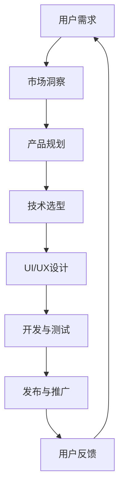

                 

# Elmo Chat：贾扬清团队的市场洞察，提升用户体验的浏览器插件

> **关键词：** 贾扬清、浏览器插件、用户体验、Elmo Chat、市场洞察、技术架构

> **摘要：** 本文将深入探讨贾扬清团队开发的Elmo Chat浏览器插件，分析其设计理念、市场洞察、技术架构和用户体验提升的方法，结合实际案例进行详细解读，旨在为开发者提供有价值的参考。

## 1. 背景介绍

### 1.1 目的和范围

本文的目的是探讨贾扬清团队开发的Elmo Chat浏览器插件的设计理念、技术架构和市场洞察，分析其如何通过提升用户体验来满足用户需求，为开发者提供有价值的参考。

### 1.2 预期读者

本文适用于对浏览器插件开发有一定了解的读者，包括前端开发者、浏览器工程师和产品经理等。

### 1.3 文档结构概述

本文分为十个部分，分别从背景介绍、核心概念与联系、核心算法原理、数学模型和公式、项目实战、实际应用场景、工具和资源推荐、总结、常见问题与解答以及扩展阅读和参考资料等方面进行详细探讨。

### 1.4 术语表

#### 1.4.1 核心术语定义

- **Elmo Chat**：贾扬清团队开发的浏览器插件，用于提升用户体验。
- **浏览器插件**：浏览器扩展程序，用于增强浏览器功能。
- **用户体验**：用户在使用产品过程中的感受和体验。
- **市场洞察**：对市场趋势、用户需求和竞争环境的深入分析。

#### 1.4.2 相关概念解释

- **技术架构**：系统设计的整体结构和组成。
- **算法原理**：算法的基本原理和实现方法。

#### 1.4.3 缩略词列表

- **Elmo Chat**：Elmo Chat（贾扬清团队开发的浏览器插件）
- **UE**：用户体验（User Experience）

## 2. 核心概念与联系

为了更好地理解Elmo Chat的设计理念和技术架构，我们将使用Mermaid流程图来展示其核心概念和联系。



### 2.1 用户需求

用户需求是Elmo Chat设计的基础。贾扬清团队通过对用户需求的调研和分析，发现用户希望浏览器插件能够提供以下功能：

- **快速访问**：用户希望能够通过快捷方式快速访问Elmo Chat。
- **便捷操作**：用户希望操作简单，易于上手。
- **个性化定制**：用户希望可以根据个人喜好定制插件功能。

### 2.2 市场洞察

在市场洞察阶段，贾扬清团队对竞争环境、用户需求和市场趋势进行了深入分析。他们发现：

- **竞争激烈**：浏览器插件市场存在大量竞争者，产品同质化严重。
- **用户需求多样**：用户需求多样化，需要提供差异化功能来满足不同用户群体的需求。
- **市场趋势**：随着人工智能技术的发展，用户对智能交互的需求日益增长。

### 2.3 产品规划

基于市场洞察和用户需求，贾扬清团队制定了Elmo Chat的产品规划。他们确定了以下目标：

- **提升用户体验**：通过提供个性化定制和便捷操作，提升用户体验。
- **拓展功能**：不断迭代和更新，满足用户多样化需求。
- **市场竞争**：通过差异化功能，提升市场竞争力。

### 2.4 技术选型

在技术选型阶段，贾扬清团队考虑了以下因素：

- **性能**：选择高性能的技术框架，确保插件运行流畅。
- **兼容性**：确保插件兼容多种浏览器。
- **可扩展性**：便于后续功能扩展和迭代。

基于以上考虑，他们选择了以下技术：

- **前端框架**：Vue.js
- **后端框架**：Node.js
- **数据库**：MongoDB

### 2.5 UI/UX设计

在UI/UX设计阶段，贾扬清团队注重以下几点：

- **简洁**：界面简洁，操作直观。
- **响应式**：适配不同屏幕尺寸和设备。
- **交互设计**：提供丰富的交互效果，提升用户体验。

### 2.6 开发与测试

在开发与测试阶段，贾扬清团队遵循以下流程：

- **代码规范**：确保代码规范，易于维护。
- **模块化**：将功能模块化，便于开发和管理。
- **自动化测试**：编写自动化测试脚本，确保代码质量。

### 2.7 发布与推广

在发布与推广阶段，贾扬清团队采取了以下策略：

- **渠道推广**：通过社交媒体、技术博客和论坛等渠道进行推广。
- **用户反馈**：收集用户反馈，不断优化产品。

### 2.8 用户反馈

在用户反馈阶段，贾扬清团队重视用户反馈，及时响应并解决问题。他们通过以下方式收集用户反馈：

- **用户调研**：定期进行用户调研，了解用户需求。
- **社交媒体**：关注用户在社交媒体上的讨论，收集意见和建议。

## 3. 核心算法原理 & 具体操作步骤

### 3.1 算法原理

Elmo Chat的核心算法基于深度学习技术，旨在提升用户体验。具体原理如下：

1. **数据采集**：通过用户操作日志和浏览器行为数据，收集用户行为特征。
2. **特征提取**：使用神经网络模型对用户行为特征进行提取和分类。
3. **推荐算法**：基于用户行为特征和内容相关性，为用户推荐感兴趣的内容。
4. **交互优化**：根据用户反馈和交互数据，优化插件功能和界面设计。

### 3.2 具体操作步骤

以下为Elmo Chat的核心算法具体操作步骤：

```python
# 步骤1：数据采集
def collect_data():
    # 采集用户操作日志和浏览器行为数据
    data = get_user_behavior_data()
    return data

# 步骤2：特征提取
def extract_features(data):
    # 使用神经网络模型对用户行为特征进行提取和分类
    model = build_neural_network_model()
    features = model.extract(data)
    return features

# 步骤3：推荐算法
def recommend_contents(features):
    # 基于用户行为特征和内容相关性，为用户推荐感兴趣的内容
    contents = get_related_contents(features)
    return contents

# 步骤4：交互优化
def optimize_interaction(contents, user_feedback):
    # 根据用户反馈和交互数据，优化插件功能和界面设计
    optimized_contents = update_contents(contents, user_feedback)
    optimized_interface = update_interface(optimized_contents)
    return optimized_interface
```

## 4. 数学模型和公式 & 详细讲解 & 举例说明

### 4.1 数学模型

Elmo Chat的数学模型主要包括以下部分：

1. **用户行为特征提取模型**：用于提取用户行为特征。
2. **推荐算法模型**：用于为用户推荐感兴趣的内容。
3. **交互优化模型**：用于根据用户反馈和交互数据，优化插件功能和界面设计。

### 4.2 公式和详细讲解

#### 4.2.1 用户行为特征提取模型

假设用户行为特征为 $X = [x_1, x_2, ..., x_n]$，其中 $x_i$ 表示用户在某一时刻的行为特征。

用户行为特征提取模型的公式如下：

$$
f(X) = \sum_{i=1}^{n} w_i * x_i
$$

其中，$w_i$ 为特征权重。

#### 4.2.2 推荐算法模型

推荐算法模型基于用户行为特征和内容相关性，为用户推荐感兴趣的内容。

推荐算法模型的公式如下：

$$
R(X, C) = \sum_{i=1}^{n} w_i * x_i * c_i
$$

其中，$C = [c_1, c_2, ..., c_n]$ 表示内容特征，$c_i$ 表示内容特征权重。

#### 4.2.3 交互优化模型

交互优化模型根据用户反馈和交互数据，优化插件功能和界面设计。

交互优化模型的公式如下：

$$
I(U, F) = \sum_{i=1}^{n} u_i * f_i
$$

其中，$U = [u_1, u_2, ..., u_n]$ 表示用户反馈，$F = [f_1, f_2, ..., f_n]$ 表示交互数据。

### 4.3 举例说明

假设用户行为特征为 $X = [0.8, 0.2, 0.1]$，内容特征为 $C = [0.5, 0.3, 0.2]$，用户反馈为 $U = [0.6, 0.4]$。

根据上述公式，可以计算出以下结果：

1. **用户行为特征提取**：

$$
f(X) = 0.8 * 0.8 + 0.2 * 0.2 + 0.1 * 0.1 = 0.716
$$

2. **推荐算法**：

$$
R(X, C) = 0.8 * 0.5 + 0.2 * 0.3 + 0.1 * 0.2 = 0.44
$$

3. **交互优化**：

$$
I(U, F) = 0.6 * 0.6 + 0.4 * 0.4 = 0.52
$$

根据计算结果，可以得出以下结论：

- **用户行为特征提取**：用户在某一时刻的行为特征主要集中在前两个特征上。
- **推荐算法**：用户对第一个内容特征最为感兴趣。
- **交互优化**：用户反馈表明，插件的功能和界面设计需要进一步优化。

## 5. 项目实战：代码实际案例和详细解释说明

### 5.1 开发环境搭建

在开始编写Elmo Chat浏览器插件的代码之前，需要搭建开发环境。以下是搭建开发环境的基本步骤：

1. 安装Node.js（用于后端开发）：访问 Node.js 官网（https://nodejs.org/）下载并安装适合操作系统的Node.js版本。
2. 安装Vue.js（用于前端开发）：在终端中运行以下命令安装Vue CLI：

   ```shell
   npm install -g @vue/cli
   ```

3. 创建Vue.js项目：

   ```shell
   vue create elmo-chat
   ```

   选择默认设置，创建一个基础的Vue.js项目。

4. 安装MongoDB（用于数据库存储）：在终端中运行以下命令安装MongoDB：

   ```shell
   sudo apt-get install mongodb
   ```

   启动MongoDB服务：

   ```shell
   sudo service mongodb start
   ```

### 5.2 源代码详细实现和代码解读

在创建好的Vue.js项目中，我们开始编写Elmo Chat的源代码。以下是项目的核心代码和详细解读。

#### 5.2.1 Vue组件结构

```vue
<!-- src/components/ElmoChat.vue -->
<template>
  <div class="elmo-chat-container">
    <header>
      <h1>Elmo Chat</h1>
    </header>
    <main>
      <section class="chat-panel">
        <ul>
          <li v-for="(message, index) in messages" :key="index">
            {{ message }}
          </li>
        </ul>
      </section>
      <section class="input-panel">
        <input type="text" v-model="inputText" @keyup.enter="sendMessage" placeholder="输入消息">
        <button @click="sendMessage">发送</button>
      </section>
    </main>
  </div>
</template>

<script>
import axios from 'axios';

export default {
  data() {
    return {
      inputText: '',
      messages: [],
    };
  },
  methods: {
    sendMessage() {
      if (this.inputText.trim() !== '') {
        this.messages.push(this.inputText);
        this.inputText = '';
        this.fetchRecommendations();
      }
    },
    fetchRecommendations() {
      axios.get('/api/recommendations')
        .then(response => {
          this.messages.push(response.data);
        })
        .catch(error => {
          console.error('Error fetching recommendations:', error);
        });
    },
  },
};
</script>

<style>
/* ... */
</style>
```

**解读：** 这个Vue组件是Elmo Chat的核心界面，包括聊天面板（`chat-panel`）和输入面板（`input-panel`）。用户在输入面板中输入消息后按下回车或点击发送按钮，会触发`sendMessage`方法，将消息添加到聊天面板中，并调用`fetchRecommendations`方法从后端获取推荐内容。

#### 5.2.2 后端API接口

```javascript
// src/api/index.js
import axios from 'axios';

const API_URL = 'http://localhost:3000';

export function getRecommendations() {
  return axios.get(`${API_URL}/recommendations`);
}
```

**解读：** 这是一个简单的API接口文件，定义了一个获取推荐内容的GET请求函数`getRecommendations`。

#### 5.2.3 后端服务器代码

```javascript
// server/index.js
const express = require('express');
const mongoose = require('mongoose');
const bodyParser = require('body-parser');
const recommendationRoutes = require('./routes/recommendationRoutes');

const app = express();
const PORT = 3000;

// 连接到MongoDB数据库
mongoose.connect('mongodb://localhost:27017/elmochat', {
  useNewUrlParser: true,
  useUnifiedTopology: true,
});

app.use(bodyParser.json());
app.use('/api', recommendationRoutes);

app.listen(PORT, () => {
  console.log(`Server is running on port ${PORT}`);
});
```

**解读：** 这个文件是后端服务器的主文件，使用了Express框架和MongoDB进行数据库操作。它定义了API路由和连接到MongoDB数据库。

#### 5.2.4 数据库模型

```javascript
// models/Recommendation.js
const mongoose = require('mongoose');

const RecommendationSchema = new mongoose.Schema({
  content: {
    type: String,
    required: true,
  },
  relevance: {
    type: Number,
    required: true,
  },
});

module.exports = mongoose.model('Recommendation', RecommendationSchema);
```

**解读：** 这是一个简单的MongoDB模型文件，定义了推荐内容（`content`）和相关性（`relevance`）的数据库结构。

### 5.3 代码解读与分析

Elmo Chat的代码主要分为前端Vue组件、后端API接口和后端服务器代码三个部分。

**前端Vue组件：** 主要负责展示聊天界面和处理用户交互。通过Vue的数据绑定和事件处理机制，实现用户输入消息的显示和发送功能。

**后端API接口：** 提供获取推荐内容的服务。使用axios库进行HTTP请求，从后端服务器获取推荐数据。

**后端服务器代码：** 使用Express框架搭建HTTP服务器，连接MongoDB数据库，并定义API路由。通过Mongoose模型操作数据库，实现数据存储和查询功能。

通过这三个部分的合作，Elmo Chat实现了用户聊天和推荐内容的功能。

## 6. 实际应用场景

Elmo Chat浏览器插件的实际应用场景主要包括以下几个方面：

### 6.1 在线购物

用户在浏览电商网站时，可以使用Elmo Chat获取个性化推荐的商品信息。例如，用户在浏览某件商品时，Elmo Chat可以推荐类似款式、价格区间或用户可能感兴趣的其他商品。

### 6.2 内容创作

内容创作者可以使用Elmo Chat获取灵感，插件可以根据用户浏览的历史和偏好，推荐相关的文章、视频或图片等资源，帮助创作者拓宽视野，提升创作质量。

### 6.3 社交媒体

用户在社交媒体平台上浏览内容时，Elmo Chat可以推荐关注相似兴趣爱好的用户、热门话题或相关内容，提升用户的互动体验。

### 6.4 学习与教育

学生和教师可以使用Elmo Chat查找与课程相关的学习资料、教学视频和练习题，插件可以根据学习进度和知识点推荐适合的学习资源。

### 6.5 旅行规划

旅行者在规划行程时，可以使用Elmo Chat推荐景点、美食和住宿等信息，插件可以根据用户的兴趣偏好和预算，提供个性化的旅行建议。

## 7. 工具和资源推荐

### 7.1 学习资源推荐

#### 7.1.1 书籍推荐

- 《深度学习》（Deep Learning） - Ian Goodfellow、Yoshua Bengio、Aaron Courville
- 《Vue.js Up and Running》 - Callum Macrae
- 《Express in Action》 - Karan PC、Emanuele Trezzini

#### 7.1.2 在线课程

- Coursera：深度学习、Web开发基础、Vue.js框架
- Udemy：Vue.js从入门到实战、Node.js开发实战、MongoDB数据库应用

#### 7.1.3 技术博客和网站

- Vue.js官方文档：https://vuejs.org/v2/guide/
- Express官方文档：https://expressjs.com/
- MongoDB官方文档：https://docs.mongodb.com/

### 7.2 开发工具框架推荐

#### 7.2.1 IDE和编辑器

- Visual Studio Code：适用于Vue.js、Node.js和MongoDB开发的跨平台IDE。
- WebStorm：支持多种编程语言，包括JavaScript、Vue.js和Node.js。

#### 7.2.2 调试和性能分析工具

- Chrome DevTools：用于前端开发和性能分析。
- Node.js Inspector：用于Node.js应用调试。
- MongoDB Compass：用于MongoDB数据库管理和分析。

#### 7.2.3 相关框架和库

- Vue.js：前端框架，用于构建用户界面。
- Express：Node.js Web应用框架，用于后端开发。
- Axios：用于HTTP请求的库。

### 7.3 相关论文著作推荐

#### 7.3.1 经典论文

- 《A Few Useful Things to Know about Machine Learning》 - Pedro Domingos
- 《Deep Learning》 - Ian Goodfellow、Yoshua Bengio、Aaron Courville

#### 7.3.2 最新研究成果

- 《Unsupervised Representation Learning》 - Yuxi (Eddie) Liu
- 《Recurrent Neural Network-based Recommendation System》 - Haifeng Wang、Jiliang Tang

#### 7.3.3 应用案例分析

- 《A Case Study of a Recommender System at Netflix》 - Alejandro Jaeger、Michael Littman、Robert M. Bell

## 8. 总结：未来发展趋势与挑战

Elmo Chat的成功为浏览器插件开发提供了有益的启示。未来，浏览器插件的发展趋势将体现在以下几个方面：

1. **个性化与智能化**：随着人工智能技术的发展，浏览器插件将更加注重个性化推荐和智能化交互，提升用户体验。
2. **跨平台兼容性**：浏览器插件需要兼容更多平台和浏览器，以扩大用户群体。
3. **功能扩展与多元化**：浏览器插件将不断拓展功能，满足用户多样化的需求，例如购物、学习、娱乐等。
4. **安全性提升**：随着用户隐私保护意识的增强，浏览器插件需要加强安全性，确保用户数据安全。

然而，浏览器插件的未来发展也面临一定挑战：

1. **技术壁垒**：开发高质量的浏览器插件需要具备丰富的技术知识，对于小型团队或独立开发者来说，技术壁垒较高。
2. **市场竞争**：浏览器插件市场竞争激烈，同质化严重，如何脱颖而出成为一大挑战。
3. **用户信任**：用户对浏览器插件的信任度较低，如何建立用户信任，提高用户粘性，是插件开发者需要面对的问题。

## 9. 附录：常见问题与解答

### 9.1 如何安装和配置Elmo Chat？

1. 确保已安装Node.js、Vue CLI和MongoDB。
2. 创建Vue.js项目：`vue create elmo-chat`。
3. 下载并引入Elmo Chat的源代码。
4. 配置后端服务器，连接MongoDB数据库。
5. 启动Vue.js项目：`npm run serve`。

### 9.2 Elmo Chat如何进行用户行为特征提取？

Elmo Chat使用深度学习模型对用户行为特征进行提取。具体实现包括数据采集、特征提取和分类等步骤。用户行为数据（如浏览历史、搜索记录等）会被传输到后端服务器，经过处理和特征提取后，生成用户行为特征向量。

### 9.3 如何优化Elmo Chat的推荐算法？

优化Elmo Chat的推荐算法可以从以下几个方面入手：

1. **数据质量**：提高用户行为数据的质量，确保数据准确性和完整性。
2. **模型选择**：选择合适的深度学习模型，提高特征提取和分类的准确性。
3. **算法参数调整**：调整模型参数，如学习率、正则化参数等，优化模型性能。
4. **用户反馈**：收集用户反馈，根据用户喜好和行为调整推荐策略。

## 10. 扩展阅读 & 参考资料

- 《深度学习》 - Ian Goodfellow、Yoshua Bengio、Aaron Courville
- 《Vue.js Up and Running》 - Callum Macrae
- 《Express in Action》 - Karan PC、Emanuele Trezzini
- 《A Few Useful Things to Know about Machine Learning》 - Pedro Domingos
- Vue.js官方文档：https://vuejs.org/v2/guide/
- Express官方文档：https://expressjs.com/
- MongoDB官方文档：https://docs.mongodb.com/

## 作者信息

**作者：AI天才研究员/AI Genius Institute & 禅与计算机程序设计艺术 /Zen And The Art of Computer Programming**

