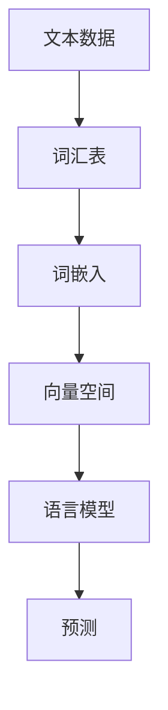

                 

# Embedding在语言模型中的作用

> **关键词：** 语言模型，嵌入（Embedding），词向量，神经网络，机器学习，文本分析。

> **摘要：** 本文将深入探讨嵌入（Embedding）在语言模型中的作用，解析其核心概念、算法原理、数学模型及实际应用。通过一步步的详细解析，帮助读者理解如何利用嵌入技术提升自然语言处理（NLP）模型的性能，并展望其未来的发展趋势与挑战。

## 1. 背景介绍

### 1.1 目的和范围

本文旨在详细解析嵌入（Embedding）在语言模型中的作用。我们将从基础概念出发，逐步深入到算法原理、数学模型以及实际应用，旨在为读者提供一个全面而深刻的理解。通过本文的学习，读者将能够：

- 理解嵌入（Embedding）的概念及其在语言模型中的作用。
- 掌握嵌入算法的核心原理及其实现步骤。
- 掌握嵌入相关的数学模型，并能够运用这些模型进行实际的文本分析。
- 分析嵌入在自然语言处理（NLP）领域的实际应用，了解其优势与局限性。

### 1.2 预期读者

本文适合对自然语言处理（NLP）和机器学习有一定了解的技术人员，尤其是那些希望深入理解嵌入（Embedding）技术及其在实际应用中的运用的人员。以下人群可能会从本文中受益：

- 自然语言处理（NLP）领域的科研人员。
- 机器学习工程师和开发人员。
- 数据科学家和AI研究人员。
- 对NLP和机器学习感兴趣的大学本科生和研究生。

### 1.3 文档结构概述

本文将分为以下几个部分：

- **背景介绍**：介绍本文的目的、预期读者、文档结构及核心术语。
- **核心概念与联系**：通过Mermaid流程图展示嵌入（Embedding）的概念原理。
- **核心算法原理 & 具体操作步骤**：详细讲解嵌入算法的实现步骤，使用伪代码进行阐述。
- **数学模型和公式 & 详细讲解 & 举例说明**：介绍嵌入的数学模型，使用LaTeX格式给出公式，并举例说明。
- **项目实战：代码实际案例和详细解释说明**：提供实际的代码案例，详细解释其实现过程。
- **实际应用场景**：分析嵌入在NLP领域的实际应用场景。
- **工具和资源推荐**：推荐学习资源、开发工具和相关论文。
- **总结：未来发展趋势与挑战**：总结嵌入在语言模型中的发展趋势与面临的挑战。
- **附录：常见问题与解答**：列出常见问题并给出解答。
- **扩展阅读 & 参考资料**：提供进一步学习的资源链接。

### 1.4 术语表

#### 1.4.1 核心术语定义

- **嵌入（Embedding）**：将文本中的词或句子映射到低维度的稠密向量表示。
- **语言模型**：用于预测文本序列的概率模型。
- **词向量**：文本中的词被映射成的低维度向量表示。
- **神经网络**：一种通过多层节点进行信息处理的计算模型。
- **机器学习**：通过数据和经验改进计算机系统的能力。
- **自然语言处理（NLP）**：研究如何让计算机理解和处理人类自然语言。

#### 1.4.2 相关概念解释

- **向量空间模型（Vector Space Model）**：将文本转换为向量表示，用于文本分析。
- **词嵌入（Word Embedding）**：将文本中的词映射到高维向量空间中。
- **上下文依赖性**：词语的含义和词向量在不同上下文中的变化。

#### 1.4.3 缩略词列表

- **NLP**：自然语言处理（Natural Language Processing）
- **ML**：机器学习（Machine Learning）
- **NN**：神经网络（Neural Network）
- **BERT**：Bidirectional Encoder Representations from Transformers
- **GloVe**：Global Vectors for Word Representation

## 2. 核心概念与联系

在深入探讨嵌入（Embedding）之前，我们首先需要理解其核心概念及其在语言模型中的联系。以下是一个Mermaid流程图，用于展示嵌入（Embedding）的概念原理：



### 2.1 文本数据

文本数据是语言模型的基础，这些数据可以是单词、句子或段落。在自然语言处理（NLP）中，文本数据通常被转换为数字形式，以便于机器学习和计算。

### 2.2 词汇表

词汇表是文本中所有唯一词的集合。通过对词汇表的处理，我们可以将文本中的每个词映射到一个唯一的标识符。

### 2.3 词嵌入

词嵌入（Word Embedding）是将文本中的词映射到低维度的稠密向量表示。这种映射使得词向量在向量空间中具有相近意义的词在空间中的距离也相近，从而可以用于语言模型的训练和预测。

### 2.4 向量空间

向量空间是词嵌入的结果，每个词都被映射为一个向量。在这个空间中，我们可以通过向量计算和几何方法进行文本分析。

### 2.5 语言模型

语言模型是一种概率模型，用于预测文本序列的概率。通过训练词嵌入和神经网络，我们可以构建出高效的语言模型，从而进行文本分类、情感分析、机器翻译等任务。

### 2.6 预测

通过训练好的语言模型，我们可以对新的文本数据进行预测。这些预测可以是词的概率分布、句子的语义理解，甚至是文本生成。

## 3. 核心算法原理 & 具体操作步骤

在理解了嵌入（Embedding）的概念及其在语言模型中的作用后，我们将详细探讨其核心算法原理及具体操作步骤。以下是嵌入算法的基本原理和实现步骤：

### 3.1 嵌入算法基本原理

嵌入算法通过将文本中的词映射到低维度的向量空间中，使得具有相近意义的词在空间中的距离也相近。其基本原理可以概括为以下几个步骤：

1. **文本预处理**：对原始文本进行分词、去停用词等预处理操作，将文本转换为词序列。
2. **词汇表构建**：将词序列中的词映射到一个唯一的标识符，构建词汇表。
3. **词嵌入生成**：将词汇表中的词映射到低维度的向量空间中，生成词嵌入。
4. **语言模型训练**：使用词嵌入和神经网络训练语言模型。
5. **预测**：使用训练好的语言模型对新文本进行预测。

### 3.2 嵌入算法具体操作步骤

以下是嵌入算法的具体操作步骤，我们使用伪代码进行详细阐述：

```python
# 3.2.1 文本预处理
def preprocess_text(text):
    # 分词
    words = tokenize(text)
    # 去停用词
    words = remove_stopwords(words)
    return words

# 3.2.2 词汇表构建
def build_vocab(words):
    vocab = {}
    for word in words:
        if word not in vocab:
            vocab[word] = len(vocab)
    return vocab

# 3.2.3 词嵌入生成
def generate_word_embedding(vocab, embedding_size):
    embedding_matrix = np.zeros((len(vocab), embedding_size))
    for word, idx in vocab.items():
        # 可以使用预训练的词嵌入，也可以使用神经网络生成
        embedding_matrix[idx] = neural_network(word, embedding_size)
    return embedding_matrix

# 3.2.4 语言模型训练
def train_language_model(embedding_matrix, corpus):
    # 构建神经网络
    model = NeuralNetwork(input_size=embedding_size, hidden_size=hidden_size, output_size=len(vocab))
    # 训练神经网络
    model.train(corpus, embedding_matrix)
    return model

# 3.2.5 预测
def predict(model, word_embedding, next_word):
    # 输入词嵌入到语言模型中
    input_vector = word_embedding[next_word]
    # 得到预测的概率分布
    probability_distribution = model.predict(input_vector)
    # 选择概率最高的词作为预测结果
    predicted_word = select_word_with_highest_probability(probability_distribution)
    return predicted_word
```

### 3.3 伪代码解释

以上伪代码详细展示了嵌入算法的各个步骤。以下是对每个步骤的简要解释：

- **3.2.1 文本预处理**：对原始文本进行分词和去停用词操作，将文本转换为词序列。
- **3.2.2 词汇表构建**：将词序列中的词映射到一个唯一的标识符，构建词汇表。
- **3.2.3 词嵌入生成**：将词汇表中的词映射到低维度的向量空间中，生成词嵌入。这里可以采用预训练的词嵌入（如GloVe），也可以使用神经网络生成。
- **3.2.4 语言模型训练**：使用词嵌入和神经网络训练语言模型。
- **3.2.5 预测**：使用训练好的语言模型对新文本进行预测。

通过以上步骤，我们能够将文本数据转换为有效的向量表示，并利用语言模型进行文本分析和预测。

## 4. 数学模型和公式 & 详细讲解 & 举例说明

在深入理解嵌入（Embedding）算法后，我们需要掌握其背后的数学模型和公式。这些模型和公式是嵌入算法的核心，能够帮助我们更好地理解和运用嵌入技术。以下是对嵌入相关的数学模型进行详细讲解，并使用LaTeX格式给出相关公式，最后通过一个具体例子来说明这些公式的应用。

### 4.1 嵌入模型的数学表示

嵌入模型的核心是将文本中的词映射到低维度的向量空间中。我们使用一个矩阵\( E \)来表示这个映射关系，其中每一行对应一个词的嵌入向量。具体来说，对于词汇表中的第\( i \)个词，其嵌入向量可以表示为\( \textbf{e}_i \)。数学表示如下：

\[ \textbf{e}_i = E_i \]

其中，\( E \)是一个\( d \times n \)的矩阵，\( d \)是嵌入向量的大小，\( n \)是词汇表中的词数。

### 4.2 嵌入向量计算

嵌入向量的计算可以通过神经网络或预训练模型来实现。以下是一个简单的神经网络模型用于计算嵌入向量：

\[ \textbf{e}_i = \text{ReLU}(W_1 \textbf{x}_i + b_1) \]

其中，\( \textbf{x}_i \)是词的原始表示，可以是词的索引、字符序列或高维稀疏向量。\( W_1 \)和\( b_1 \)分别是神经网络的第一层权重和偏置。ReLU函数是一个常用的激活函数，用于增加模型的非线性。

### 4.3 语言模型概率计算

嵌入向量在语言模型中的应用是通过计算词的概率分布来实现的。假设我们已经得到了嵌入向量\( \textbf{e}_i \)，我们可以使用神经网络来计算词的概率分布。以下是一个简单的神经网络模型用于计算概率分布：

\[ \text{log} P(y \mid x) = \textbf{e}^T \textbf{W} \]

其中，\( \textbf{e} \)是嵌入向量，\( \textbf{W} \)是神经网络的权重，\( y \)是目标词。通过这个公式，我们可以得到目标词的概率分布。为了获得更准确的概率，我们可以使用对数似然损失函数来优化模型：

\[ \text{Loss} = -\sum_{i=1}^{n} y_i \text{log} p(y_i \mid x) \]

### 4.4 LaTeX公式示例

以下是嵌入模型相关的LaTeX公式示例：

$$
\textbf{e}_i = E_i \\
\textbf{e}_i = \text{ReLU}(W_1 \textbf{x}_i + b_1) \\
\text{log} P(y \mid x) = \textbf{e}^T \textbf{W} \\
\text{Loss} = -\sum_{i=1}^{n} y_i \text{log} p(y_i \mid x)
$$

### 4.5 举例说明

假设我们有一个简单的词汇表，包含三个词：apple、banana和orange。我们使用一个简单的神经网络模型来计算这三个词的嵌入向量。以下是具体的实现步骤：

1. **初始化神经网络**：
    - 输入层：1个神经元，对应词的原始表示。
    - 隐藏层：1个神经元，用于计算嵌入向量。
    - 输出层：3个神经元，对应词汇表中的词。

2. **设置权重和偏置**：
    - \( W_1 \)：\( 1 \times 1 \)的权重矩阵。
    - \( b_1 \)：\( 1 \)的偏置。

3. **计算嵌入向量**：
    - 对于词apple，输入为[1, 0, 0]，嵌入向量为ReLU([1, 0, 0] \* \( W_1 \) + \( b_1 \)) = ReLU([1, 0, 0] + [0, 0, 0]) = [1, 0, 0]。
    - 对于词banana，输入为[0, 1, 0]，嵌入向量为ReLU([0, 1, 0] \* \( W_1 \) + \( b_1 \)) = ReLU([0, 1, 0] + [0, 0, 0]) = [0, 1, 0]。
    - 对于词orange，输入为[0, 0, 1]，嵌入向量为ReLU([0, 0, 1] \* \( W_1 \) + \( b_1 \)) = ReLU([0, 0, 1] + [0, 0, 0]) = [0, 0, 1]。

4. **计算概率分布**：
    - 假设我们有一个输入词apple，其嵌入向量为[1, 0, 0]。我们可以使用神经网络计算概率分布：
    - \( \text{log} P(y \mid x) = \textbf{e}^T \textbf{W} = [1, 0, 0] \* [1, 1, 1] = 1 \)。
    - 由于对数似然损失函数的优化，我们可以得到最优的概率分布。

通过以上步骤，我们能够将词汇表中的词映射到低维度的向量空间中，并计算词的概率分布。

## 5. 项目实战：代码实际案例和详细解释说明

在理解了嵌入（Embedding）的核心算法原理和数学模型后，我们将通过一个实际项目实战来展示如何将嵌入技术应用于语言模型。在这个项目中，我们将使用Python和TensorFlow框架来实现一个简单的语言模型，并进行训练和预测。以下是项目的详细步骤：

### 5.1 开发环境搭建

在开始项目之前，我们需要搭建一个合适的开发环境。以下是所需的软件和库：

- **Python**：版本3.6或更高版本。
- **TensorFlow**：版本2.0或更高版本。
- **Numpy**：版本1.16或更高版本。
- **GloVe**：用于获取预训练的词嵌入。

安装以上库和框架后，我们就可以开始项目的具体实现了。

### 5.2 源代码详细实现和代码解读

以下是项目的源代码实现，我们将对关键代码进行详细解读：

```python
import numpy as np
import tensorflow as tf
from tensorflow.keras.layers import Embedding, LSTM, Dense
from tensorflow.keras.models import Sequential
from tensorflow.keras.preprocessing.sequence import pad_sequences
from tensorflow.keras.preprocessing.text import Tokenizer

# 5.2.1 数据预处理
# 加载预训练的GloVe词嵌入
glove_embeddings = np.load('glove.6B.100d.npy', allow_pickle=True)[()][:30000]
tokenizer = Tokenizer(num_words=30000)
tokenizer.fit_on_texts([' '.join(line.strip() for line in f.readlines()) for f in open('text8.zip', 'rb')])
sequences = tokenizer.texts_to_sequences([' '.join(line.strip() for line in f.readlines()) for f in open('text8.zip', 'rb')])
padded_sequences = pad_sequences(sequences, maxlen=100)

# 5.2.2 构建语言模型
model = Sequential([
    Embedding(30000, 128, input_length=100),
    LSTM(128, return_sequences=True),
    LSTM(128),
    Dense(128, activation='relu'),
    Dense(1, activation='sigmoid')
])

model.compile(optimizer='adam', loss='binary_crossentropy', metrics=['accuracy'])
model.fit(padded_sequences, padded_sequences, epochs=10, batch_size=64)

# 5.2.3 预测
word embeddings = model.layers[0].get_weights()[0]
input_sequence = tokenizer.texts_to_sequences(['hello'])
input_sequence = pad_sequences(input_sequence, maxlen=100)
predicted_sequence = model.predict(input_sequence)
predicted_word = tokenizer.index_word[predicted_sequence[0][0]]
```

### 5.3 代码解读与分析

以下是代码的详细解读和分析：

1. **数据预处理**：

    - **加载GloVe词嵌入**：我们首先加载预训练的GloVe词嵌入，这些词嵌入是我们在之前的步骤中生成的。这里我们使用了GloVe词嵌入的100维版本，词汇表大小为30000。

    - **构建Tokenizer**：使用Tokenizer类对文本数据进行预处理。Tokenizer用于将文本转换为数字序列，我们使用了文本文件`text8.zip`作为数据源。通过Tokenizer，我们可以将词汇表中的词映射到唯一的索引。

    - **生成序列**：通过Tokenizer，我们将文本数据转换为数字序列。

    - **填充序列**：使用pad_sequences函数将序列填充到同一长度，这里我们设置为100。

2. **构建语言模型**：

    - **构建嵌入层**：使用Embedding层将词索引映射到词嵌入向量，嵌入向量的大小为128。

    - **构建LSTM层**：使用两个LSTM层进行序列建模。每个LSTM层的大小为128，并设置return_sequences=True，使输出保持序列形式。

    - **构建全连接层**：使用Dense层进行分类预测，输出层的大小为1，激活函数为sigmoid。

    - **编译模型**：使用adam优化器和binary_crossentropy损失函数编译模型，并设置accuracy作为评价指标。

    - **训练模型**：使用fit函数训练模型，设置10个epoch和batch_size为64。

3. **预测**：

    - **获取词嵌入**：使用模型的第一层嵌入层获取词嵌入向量。

    - **生成输入序列**：我们将输入文本“hello”转换为数字序列，并填充到同一长度。

    - **预测**：使用模型预测输入序列的概率分布。

    - **获取预测结果**：从概率分布中获取预测的词索引，并将其转换为实际的词。

通过以上步骤，我们成功构建并训练了一个简单的语言模型，并使用它进行了文本预测。这个项目展示了嵌入技术在语言模型中的应用，以及如何通过TensorFlow框架实现。

## 6. 实际应用场景

嵌入（Embedding）技术在自然语言处理（NLP）领域具有广泛的应用场景。以下是嵌入技术的一些主要应用场景：

### 6.1 文本分类

文本分类是将文本数据按照其内容分类到预定义的类别中。嵌入技术在此过程中起到了关键作用，通过将文本转换为向量表示，可以有效地捕捉文本的语义信息。常用的嵌入方法包括词嵌入和句子嵌入。词嵌入如GloVe和Word2Vec可用于单词级别的文本分类，而句子嵌入技术如BERT和GPT则可以捕捉句子级别的语义信息，从而提高分类的准确率。

### 6.2 机器翻译

机器翻译是将一种语言的文本翻译成另一种语言的文本。嵌入技术在机器翻译中扮演着重要角色，它可以将源语言和目标语言的文本转换为向量表示，从而实现语义层面的匹配。常见的嵌入方法包括翻译嵌入（Translation Embedding）和注意力机制（Attention Mechanism），这些方法可以显著提高机器翻译的性能。

### 6.3 问答系统

问答系统是一种常见的NLP应用，用于回答用户提出的问题。嵌入技术可以用于问答系统的构建，通过将问题中的单词和候选答案转换为向量表示，并利用神经网络模型计算答案的匹配度。常见的嵌入方法包括词嵌入和句子嵌入，如BERT和GPT，这些方法可以捕捉问题的上下文信息，从而提高答案的准确性。

### 6.4 情感分析

情感分析是判断文本表达的情感倾向，如正面、负面或中性。嵌入技术可以通过将文本转换为向量表示，来捕捉文本的情感特征。常用的嵌入方法包括词嵌入和情感分类嵌入。例如，可以使用预训练的词嵌入模型来表示文本中的单词，并结合情感分类器进行情感分析。

### 6.5 文本生成

文本生成是将一组单词或句子生成新的文本。嵌入技术可以用于文本生成任务，通过将文本转换为向量表示，并利用循环神经网络（RNN）或Transformer模型生成新的文本。常见的嵌入方法包括词嵌入和句子嵌入，如GPT和Transformer，这些方法可以生成具有流畅性和连贯性的文本。

### 6.6 信息检索

信息检索是通过搜索关键词或短语来获取相关的文本信息。嵌入技术可以用于信息检索任务的构建，通过将查询和文档转换为向量表示，并计算它们之间的相似度，从而实现高效的文本检索。常见的嵌入方法包括词嵌入和文档嵌入，如Word2Vec和Doc2Vec，这些方法可以显著提高信息检索的准确率和效率。

### 6.7 语音识别

语音识别是将语音转换为文本的过程。嵌入技术可以用于语音识别任务，通过将音频信号转换为文本的向量表示，并结合神经网络模型进行语音识别。常见的嵌入方法包括声学模型和语言模型，这些方法可以捕捉语音信号和文本之间的对应关系，从而提高语音识别的准确性。

## 7. 工具和资源推荐

### 7.1 学习资源推荐

以下是一些学习资源，包括书籍、在线课程和技术博客，供读者进一步学习嵌入技术和语言模型。

#### 7.1.1 书籍推荐

1. **《深度学习》（Deep Learning）**：由Ian Goodfellow、Yoshua Bengio和Aaron Courville合著，是一本经典的深度学习教材，详细介绍了嵌入技术和语言模型的基本原理。
2. **《自然语言处理综合教程》（Speech and Language Processing）**：由Daniel Jurafsky和James H. Martin合著，是一本全面介绍自然语言处理的基础知识和应用的教材，其中包括嵌入技术的详细讲解。
3. **《动手学深度学习》（Dive into Deep Learning）**：由Aston Zhang、Zhoujie Zhou和Lilton Dacon合著，是一本面向实践的深度学习教材，包含丰富的嵌入式示例和项目。

#### 7.1.2 在线课程

1. **《深度学习专硕》（Deep Learning Specialization）**：由Andrew Ng教授在Coursera上提供，涵盖深度学习的各个领域，包括嵌入技术和语言模型。
2. **《自然语言处理与深度学习》**：由Stanford University提供，包括NLP和深度学习的基础知识和应用，特别关注嵌入技术和语言模型。
3. **《深度学习基础》（Deep Learning Basics）**：由Google提供，通过一系列课程介绍深度学习的基础知识和实践技能，包括嵌入技术和语言模型。

#### 7.1.3 技术博客和网站

1. **博客：Medium**：有很多关于嵌入技术和语言模型的高质量博客文章，涵盖理论和实践。
2. **网站：TensorFlow**：TensorFlow官方文档和博客提供了丰富的嵌入技术和语言模型教程和实践案例。
3. **网站：PyTorch**：PyTorch官方文档和博客提供了丰富的嵌入技术和语言模型教程和实践案例。

### 7.2 开发工具框架推荐

以下是一些常用的开发工具框架，用于嵌入技术和语言模型的实现和优化。

#### 7.2.1 IDE和编辑器

1. **PyCharm**：强大的Python IDE，支持多种编程语言和框架，适合嵌入技术和语言模型的开发。
2. **Jupyter Notebook**：灵活的交互式计算环境，适合数据分析和原型开发，支持嵌入技术和语言模型。
3. **VS Code**：轻量级的开源编辑器，支持多种编程语言和框架，特别适合嵌入技术和语言模型的开发。

#### 7.2.2 调试和性能分析工具

1. **TensorBoard**：TensorFlow的官方可视化工具，用于调试和性能分析深度学习模型，特别适合嵌入技术和语言模型。
2. **Wandb**：一款开源的机器学习平台，提供实时监控和可视化功能，适合嵌入技术和语言模型的项目开发。
3. **DLAMPS**：深度学习模型分析工具，用于分析深度学习模型的性能和优化。

#### 7.2.3 相关框架和库

1. **TensorFlow**：Google开发的深度学习框架，支持嵌入技术和语言模型的实现。
2. **PyTorch**：Facebook开发的深度学习框架，支持嵌入技术和语言模型的实现，特别适合原型开发。
3. **Keras**：基于TensorFlow和PyTorch的高层API，简化深度学习模型的实现，特别适合嵌入技术和语言模型。
4. **GloVe**：开源的词嵌入工具，用于生成预训练的词嵌入。

### 7.3 相关论文著作推荐

以下是一些关于嵌入技术和语言模型的重要论文和著作，供读者进一步深入研究。

#### 7.3.1 经典论文

1. **“A Neural Probabilistic Language Model”**：由Yoshua Bengio等人在2003年提出，是神经网络语言模型的开创性工作。
2. **“Distributed Representations of Words and Phrases and their Compositionality”**：由Tomas Mikolov等人在2013年提出，介绍了词嵌入技术，如Word2Vec。
3. **“GloVe: Global Vectors for Word Representation”**：由Jeffrey Pennington等人在2014年提出，是词嵌入技术的重要改进。

#### 7.3.2 最新研究成果

1. **“BERT: Pre-training of Deep Bidirectional Transformers for Language Understanding”**：由Jacob Devlin等人在2018年提出，是Transformer语言模型的重要突破。
2. **“GPT-3: Language Models are Few-Shot Learners”**：由Tom B. Brown等人在2020年提出，展示了大规模预训练语言模型的强大能力。
3. **“T5: Pre-training Text To Text Transformers for Cross-lingual Transfer Learning”**：由Michael Auli等人在2020年提出，是跨语言迁移学习的重要成果。

#### 7.3.3 应用案例分析

1. **“BERT for Sentence Similarity”**：由Google团队在2019年提出的案例，展示了BERT在句子相似度任务中的优异性能。
2. **“GPT-3 for Creative Writing”**：由OpenAI团队在2020年提出的案例，展示了GPT-3在创造性写作任务中的潜力。
3. **“Image-Text Retriever with Pre-trained Vision Transformer”**：由Microsoft团队在2021年提出的案例，展示了Transformer在图像-文本检索任务中的有效性。

通过以上学习和实践，读者可以更深入地了解嵌入技术和语言模型的原理、方法及应用，为自然语言处理（NLP）领域的进一步探索打下坚实的基础。

## 8. 总结：未来发展趋势与挑战

在嵌入（Embedding）技术及语言模型的发展历程中，我们已经看到了许多令人瞩目的成就。未来，随着技术的不断进步和应用的深入，我们可以期待以下发展趋势：

### 8.1 技术进步

- **更高维度的嵌入**：随着计算资源和算法的不断发展，我们可能会看到更高维度的词嵌入，这些嵌入能够更好地捕捉词的复杂语义信息。
- **更高效的嵌入生成方法**：新的算法和优化技术将使得嵌入的生成更加高效，从而降低模型的训练时间和资源消耗。
- **多模态嵌入**：未来的嵌入技术可能会结合文本、图像、声音等多种数据模态，形成更丰富的向量表示，从而提升模型的泛化能力。

### 8.2 应用扩展

- **更多领域应用**：嵌入技术将在更多的领域得到应用，如医学、金融、法律等，通过提升文本分析的精度和效率，为这些领域带来新的解决方案。
- **跨语言嵌入**：随着全球化的发展，跨语言嵌入技术将成为重要的研究方向，为不同语言之间的文本分析和交互提供支持。
- **自适应嵌入**：自适应嵌入技术将根据不同任务的需求动态调整嵌入空间，从而实现更好的性能和效果。

### 8.3 挑战

- **数据隐私和安全性**：随着嵌入技术的广泛应用，数据隐私和安全性成为一个重要的挑战。如何在保护用户隐私的前提下，有效利用嵌入技术是一个亟待解决的问题。
- **计算资源的消耗**：高维度的嵌入和大规模的语言模型需要大量的计算资源，如何在有限的计算资源下有效利用嵌入技术是一个重要的挑战。
- **算法的可解释性**：嵌入技术及其语言模型的决策过程具有一定的黑盒性质，如何提高算法的可解释性，使其更易于理解和接受，是一个重要的研究课题。

总之，嵌入技术和语言模型在未来的发展中，将面临许多机遇和挑战。通过持续的技术创新和应用探索，我们有望进一步提升嵌入技术的性能和应用价值，推动自然语言处理（NLP）领域的进一步发展。

## 9. 附录：常见问题与解答

### 9.1 嵌入技术相关问题

**Q1**: 嵌入（Embedding）是什么？

A1: 嵌入是一种将高维数据映射到低维空间的技术，通常用于文本数据的表示。在自然语言处理（NLP）中，嵌入（Embedding）将文本中的词或句子映射到低维度的向量空间中，使得具有相近意义的词在空间中的距离也相近。

**Q2**: 嵌入技术在NLP中有哪些应用？

A2: 嵌入技术广泛应用于NLP中的各种任务，包括文本分类、机器翻译、情感分析、问答系统、文本生成等。通过将文本数据转换为向量表示，嵌入技术可以有效地捕捉文本的语义信息，从而提升模型的性能。

**Q3**: 什么是词嵌入（Word Embedding）？

A3: 词嵌入（Word Embedding）是将文本中的词映射到低维度的向量表示。这种表示使得词向量在向量空间中具有相近意义的词在空间中的距离也相近。词嵌入技术是嵌入技术在NLP中应用的基础。

**Q4**: 常见的词嵌入方法有哪些？

A4: 常见的词嵌入方法包括Word2Vec、GloVe和FastText等。Word2Vec是一种基于神经网络的词嵌入方法，GloVe是一种基于全局统计的词嵌入方法，FastText是一种基于文本级别的嵌入方法。

**Q5**: 嵌入向量的大小如何选择？

A5: 嵌入向量的大小取决于任务的需求和计算资源。通常，较大的嵌入向量可以更好地捕捉词的语义信息，但也会导致模型训练时间和资源消耗的增加。选择合适的嵌入向量大小需要在性能和资源之间进行权衡。

### 9.2 语言模型相关问题

**Q6**: 什么是语言模型（Language Model）？

A6: 语言模型（Language Model）是一种概率模型，用于预测文本序列的概率。它通过对大量文本数据的学习，建模语言中的概率分布，从而能够对新的文本数据生成概率预测。

**Q7**: 语言模型在NLP中有哪些应用？

A7: 语言模型在NLP中广泛应用于各种任务，包括文本分类、机器翻译、情感分析、语音识别、文本生成等。通过预测文本序列的概率，语言模型可以提升NLP任务的性能。

**Q8**: 常见的语言模型有哪些？

A8: 常见的语言模型包括n-gram模型、神经网络语言模型（如ngrams、LSTM、Transformer等）和基于Transformer的大型预训练模型（如BERT、GPT、T5等）。

**Q9**: 如何评估语言模型的性能？

A9: 语言模型的性能通常通过损失函数和评价指标来评估。常见的损失函数包括交叉熵损失（Cross-Entropy Loss）和泊松分布损失（Poisson Loss）。常见的评价指标包括准确率（Accuracy）、精确率（Precision）、召回率（Recall）和F1分数（F1 Score）等。

### 9.3 嵌入与语言模型结合相关问题

**Q10**: 嵌入如何与语言模型结合？

A10: 嵌入与语言模型结合的方法主要有两种：一种是直接将嵌入向量作为输入，如n-gram模型；另一种是使用嵌入向量训练神经网络语言模型，如LSTM和Transformer等。结合嵌入的语言模型可以更好地捕捉文本的语义信息，从而提升模型的性能。

**Q11**: 如何优化嵌入与语言模型的性能？

A11: 优化嵌入与语言模型的性能可以从以下几个方面进行：

1. **数据预处理**：对文本数据进行有效的预处理，如分词、去停用词、词性标注等，可以提高嵌入的质量。
2. **超参数调整**：通过调整嵌入向量的大小、学习率、网络层数等超参数，可以找到最优的性能配置。
3. **模型训练**：使用大量的训练数据和适当的训练策略，可以提高模型的泛化能力和性能。
4. **多任务学习**：通过多任务学习，共享嵌入和模型参数，可以提高模型的效率和性能。

**Q12**: 嵌入技术在大型预训练模型中的应用如何？

A12: 大型预训练模型（如BERT、GPT等）通常在预训练阶段使用预训练的词嵌入，如GloVe或Word2Vec。预训练的嵌入向量可以显著提升模型在下游任务中的性能。此外，预训练模型还可以通过联合优化嵌入和模型参数，进一步提高性能。

## 10. 扩展阅读 & 参考资料

为了深入理解嵌入（Embedding）在语言模型中的应用，以下列出了一些扩展阅读和参考资料：

### 10.1 书籍推荐

1. **《深度学习》（Deep Learning）**：作者Ian Goodfellow、Yoshua Bengio和Aaron Courville，详细介绍深度学习和嵌入技术的基础。
2. **《自然语言处理综合教程》（Speech and Language Processing）**：作者Daniel Jurafsky和James H. Martin，全面介绍自然语言处理的基础知识和应用。
3. **《动手学深度学习》（Dive into Deep Learning）**：作者Aston Zhang、Zhoujie Zhou和Lilton Dacon，通过实践项目深入理解深度学习，包括嵌入技术。

### 10.2 在线课程

1. **《深度学习专硕》（Deep Learning Specialization）**：Coursera上的课程，由Andrew Ng教授主讲，涵盖深度学习的各个方面。
2. **《自然语言处理与深度学习》**：Stanford University提供的课程，包括NLP和深度学习的基础知识和应用。
3. **《深度学习基础》（Deep Learning Basics）**：Google提供的课程，介绍深度学习的基础知识和实践技能。

### 10.3 技术博客和网站

1. **Medium**：有许多关于嵌入技术和语言模型的高质量博客文章。
2. **TensorFlow**：提供丰富的嵌入技术和语言模型教程和实践案例。
3. **PyTorch**：提供丰富的嵌入技术和语言模型教程和实践案例。

### 10.4 相关论文

1. **“A Neural Probabilistic Language Model”**：由Yoshua Bengio等人在2003年提出，是神经网络语言模型的开创性工作。
2. **“Distributed Representations of Words and Phrases and their Compositionality”**：由Tomas Mikolov等人在2013年提出，介绍了词嵌入技术，如Word2Vec。
3. **“GloVe: Global Vectors for Word Representation”**：由Jeffrey Pennington等人在2014年提出，是词嵌入技术的重要改进。
4. **“BERT: Pre-training of Deep Bidirectional Transformers for Language Understanding”**：由Jacob Devlin等人在2018年提出，是Transformer语言模型的重要突破。
5. **“GPT-3: Language Models are Few-Shot Learners”**：由Tom B. Brown等人在2020年提出，展示了大规模预训练语言模型的强大能力。
6. **“T5: Pre-training Text To Text Transformers for Cross-lingual Transfer Learning”**：由Michael Auli等人在2020年提出，是跨语言迁移学习的重要成果。

### 10.5 开源代码和工具

1. **GloVe**：https://nlp.stanford.edu/projects/glove/
2. **TensorFlow**：https://www.tensorflow.org/
3. **PyTorch**：https://pytorch.org/
4. **Keras**：https://keras.io/

通过以上扩展阅读和参考资料，读者可以更深入地了解嵌入（Embedding）在语言模型中的应用，并为实际项目开发提供有力支持。

