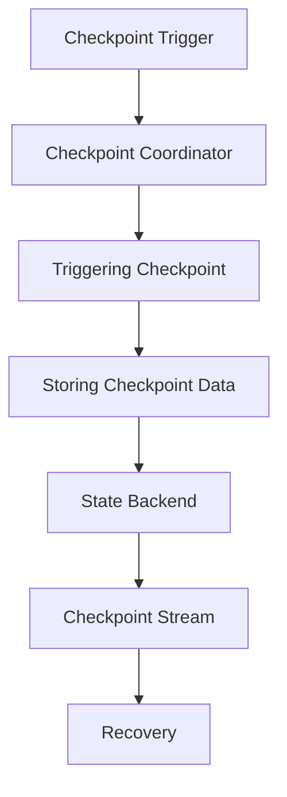

                 

# Flink Checkpoint容错机制原理与代码实例讲解

> 关键词：Apache Flink，Checkpoint，容错机制，状态管理，分布式系统，状态一致性，数据流处理，故障恢复，代码实例。

> 摘要：本文深入剖析了Apache Flink的Checkpoint容错机制，从原理、算法、数学模型到实际代码实例进行了全面讲解。通过本文，读者将能够掌握Flink的Checkpoint工作原理、关键实现步骤，并在实战项目中验证其正确性和可靠性。

## 1. 背景介绍

### 1.1 目的和范围

本文旨在帮助读者全面理解Apache Flink的Checkpoint容错机制。我们将首先介绍Checkpoint的概念和作用，然后逐步深入到Flink的Checkpoint实现原理，通过具体的代码实例来展示其工作流程和关键步骤。

### 1.2 预期读者

本文面向对分布式数据处理和Flink有一定了解的读者，包括开发者、架构师以及科研人员。对于没有Flink基础的同学，建议先了解Flink的基本概念和架构，再阅读本文。

### 1.3 文档结构概述

本文结构如下：

1. 背景介绍：介绍文章的目的、预期读者和文档结构。
2. 核心概念与联系：介绍Flink的Checkpoint相关核心概念和原理，并通过Mermaid流程图展示Flink的Checkpoint架构。
3. 核心算法原理 & 具体操作步骤：详细讲解Flink Checkpoint的算法原理，使用伪代码展示关键步骤。
4. 数学模型和公式 & 详细讲解 & 举例说明：介绍与Checkpoint相关的数学模型和公式，并通过实例进行说明。
5. 项目实战：代码实际案例和详细解释说明，展示Flink Checkpoint的具体实现和运行流程。
6. 实际应用场景：探讨Flink Checkpoint在不同场景下的应用和优化策略。
7. 工具和资源推荐：推荐相关学习资源、开发工具和框架，以及相关论文著作。
8. 总结：对未来发展趋势与挑战进行总结。
9. 附录：常见问题与解答。
10. 扩展阅读 & 参考资料：提供进一步学习的路径和资源。

### 1.4 术语表

#### 1.4.1 核心术语定义

- **Checkpoint**：分布式系统中的快照，用于保存系统在某一时刻的状态。
- **State**：系统在某一时刻的运行状态，包括内部变量、缓存数据等。
- **Fault Tolerance**：容错机制，确保系统在发生故障时能够自动恢复。
- **Stream Processing**：处理实时数据流的计算过程。

#### 1.4.2 相关概念解释

- **State Backend**：Flink用于存储状态的后端存储，可以是内存、磁盘或分布式文件系统。
- **Savepoint**：Flink提供的手动触发快照，用于系统状态的重置和迁移。

#### 1.4.3 缩略词列表

- **Apache Flink**：一个分布式流处理框架。
- **JVM**：Java虚拟机。
- **API**：应用程序编程接口。

## 2. 核心概念与联系

在深入讲解Flink的Checkpoint之前，我们需要了解一些核心概念和它们之间的关系。

### 2.1 Checkpoint的基本概念

Checkpoint是分布式系统中的一个重要机制，用于在系统运行过程中定期保存其状态。当系统发生故障时，可以通过恢复最新的Checkpoint来保证数据的一致性和系统的可用性。

### 2.2 Flink的Checkpoint架构

Flink的Checkpoint机制包括以下几个关键组件：

- **Checkpoint Coordinator**：协调多个Checkpoint操作，确保全局一致性。
- **Checkpoint Trigger**：触发Checkpoint操作，可以是定时触发或基于特定条件触发。
- **State Backend**：用于存储Checkpoint状态的后端存储。
- **Checkpoint Stream**：用于存储Checkpoint数据的数据流。

### 2.3 Mermaid流程图

以下是一个简化的Flink Checkpoint流程图：



### 2.4 Flink的状态管理

Flink的状态管理是Checkpoint容错机制的基础。Flink的状态分为两种类型：

- **Keyed State**：与特定键相关的状态。
- **Operator State**：与特定算子相关的状态。

### 2.5 Checkpoint与Fault Tolerance的关系

Checkpoint是实现Fault Tolerance的关键机制。通过定期保存状态，Flink能够在系统发生故障时快速恢复，从而保证数据的完整性和系统的稳定性。

## 3. 核心算法原理 & 具体操作步骤

### 3.1 Checkpoint的触发

Checkpoint的触发可以通过定时器或基于特定条件的触发器来实现。以下是一个简单的伪代码示例：

```java
class CheckpointTrigger {
  void triggerCheckpoint() {
    // 检查触发条件
    if (shouldTriggerCheckpoint()) {
      // 触发Checkpoint
      checkpointCoordinator.triggerCheckpoint();
    }
  }
}
```

### 3.2 Checkpoint的协调

Checkpoint Coordinator负责协调多个Checkpoint操作，确保全局一致性。以下是一个简化的伪代码示例：

```java
class CheckpointCoordinator {
  void triggerCheckpoint() {
    // 分发Checkpoint请求
    for (Task task : tasks) {
      task.prepareCheckpoint();
    }
    // 等待所有任务完成准备
    waitForAllTasksReady();
    // 触发Checkpoint
    triggerGlobalCheckpoint();
  }
}
```

### 3.3 Checkpoint的数据存储

Checkpoint数据需要存储在State Backend中。State Backend可以是内存、磁盘或分布式文件系统。以下是一个简化的伪代码示例：

```java
class StateBackend {
  void storeState(State state) {
    // 将状态数据存储到后端存储
    storageBackend.store(state);
  }
}
```

### 3.4 Checkpoint的数据流

Checkpoint数据通过Checkpoint Stream传输。Checkpoint Stream是Flink内部的一个数据流，用于存储Checkpoint数据。以下是一个简化的伪代码示例：

```java
class CheckpointStream {
  void storeCheckpointData(Data data) {
    // 将Checkpoint数据存储到流中
    stream.write(data);
  }
}
```

### 3.5 Checkpoint的恢复

Checkpoint的恢复是Fault Tolerance机制的一部分。通过恢复最新的Checkpoint，Flink可以快速恢复到正常状态。以下是一个简化的伪代码示例：

```java
class CheckpointRecovery {
  void recoverFromCheckpoint(CheckpointData checkpointData) {
    // 从Checkpoint数据中恢复状态
    stateBackend.restoreState(checkpointData);
  }
}
```

## 4. 数学模型和公式 & 详细讲解 & 举例说明

### 4.1 状态一致性

在分布式系统中，状态一致性是Checkpoint容错机制的核心。以下是一个简单的数学模型，用于描述状态一致性：

$$
S_{new} = S_{old} + \Delta S
$$

其中，$S_{new}$ 表示新的状态，$S_{old}$ 表示旧的状态，$\Delta S$ 表示状态的变化量。

### 4.2 状态变化量

状态变化量可以通过计算数据流中的增量来获得。以下是一个简单的伪代码示例：

```java
class StateDeltaCalculator {
  StateDelta calculateDelta(State state, Data data) {
    // 计算状态变化量
    return new StateDelta(state, data);
  }
}
```

### 4.3 示例

假设有一个简单的数据流处理任务，任务中的状态是一个整数。我们通过Checkpoint来保存状态，并在故障恢复时恢复状态。

- **初始化状态**：$S_{old} = 0$
- **数据流中的增量**：$data = 10$
- **状态变化量**：$\Delta S = 10$
- **新的状态**：$S_{new} = S_{old} + \Delta S = 0 + 10 = 10$

当系统发生故障时，可以通过恢复最新的Checkpoint来恢复状态：

- **Checkpoint数据**：$S_{checkpoint} = 10$
- **恢复后的状态**：$S_{new} = S_{checkpoint} = 10$

通过这个简单的示例，我们可以看到状态一致性在Checkpoint容错机制中的重要作用。

## 5. 项目实战：代码实际案例和详细解释说明

### 5.1 开发环境搭建

在开始实战之前，我们需要搭建一个Flink的开发环境。以下是搭建Flink开发环境的基本步骤：

1. 安装Java环境（版本要求：JDK 8及以上）。
2. 下载并解压Flink的安装包。
3. 配置环境变量，确保在命令行中可以运行Flink命令。
4. 启动Flink集群，可以使用本地模式或分布式模式。

### 5.2 源代码详细实现和代码解读

在这个实战项目中，我们将使用Flink的Java API实现一个简单的WordCount程序，并配置Checkpoint来测试容错机制。

#### 5.2.1 WordCount程序实现

以下是WordCount程序的Java代码实现：

```java
import org.apache.flink.api.common.functions.FlatMapFunction;
import org.apache.flink.api.common.functions.ReduceFunction;
import org.apache.flink.api.java.DataSet;
import org.apache.flink.api.java.ExecutionEnvironment;
import org.apache.flink.api.java.tuple.Tuple2;

public class WordCount {
  public static void main(String[] args) throws Exception {
    // 创建执行环境
    final ExecutionEnvironment env = ExecutionEnvironment.getExecutionEnvironment();

    // 加载数据集
    DataSet<String> text = env.readTextFile("path/to/text-file.txt");

    // 平展单词并将它们与整数1标记在一起
    DataSet<Tuple2<String, Integer>> counts =
            text
            .flatMap(new Tokenizer())
            .groupBy(0)
            .reduce(new ReduceFunction<Tuple2<String, Integer>>() {
                @Override
                public Tuple2<String, Integer> reduce(Tuple2<String, Integer> value1, Tuple2<String, Integer> value2) {
                    return new Tuple2<>(value1.f0, value1.f1 + value2.f1);
                }
            });

    // 输出结果
    counts.writeAsText("path/to/output");

    // 执行任务
    env.execute("WordCount");
  }

  // 实现单词分割函数
  public static final class Tokenizer implements FlatMapFunction<String, Tuple2<String, Integer>> {
    @Override
    public void flatMap(String value, Collector<Tuple2<String, Integer>> out) {
      // 切割字符串并输出
      for (String word : value.split("\\s+")) {
        out.collect(new Tuple2<>(word, 1));
      }
    }
  }
}
```

#### 5.2.2 代码解读

- **读取数据**：程序首先读取一个文本文件作为输入数据集。
- **单词分割**：使用`Tokenizer`函数将文本分割成单词，并将每个单词与整数1标记在一起。
- **分组和聚合**：使用`groupBy`函数将单词分组，并使用`ReduceFunction`将单词的计数相加。
- **输出结果**：将最终结果输出到指定路径。

#### 5.2.3 配置Checkpoint

为了配置Checkpoint，我们需要在Flink配置文件中设置相关参数。以下是Flink配置文件中的相关参数：

```properties
# 开启Checkpoint
flink.checkpointing.mode=exactly-once

# 设置Checkpoint间隔
flink.checkpointing.interval=10s

# 设置State Backend
flink.checkpointing.state.backend=filesystem

# 设置Checkpoint数据存储路径
flink.checkpointing.state.backend.fs.path=hdfs://namenode:9000/flink/checkpoints
```

通过以上配置，Flink将在每10秒触发一次Checkpoint，并将Checkpoint数据存储到指定的HDFS路径中。

### 5.3 代码解读与分析

- **Checkpoint模式**：`exactly-once`模式确保数据在分布式处理中的精确一次语义，这是实现容错机制的基础。
- **Checkpoint间隔**：设置Checkpoint的触发间隔，可以平衡容错性能与系统性能。
- **State Backend**：选择合适的State Backend，根据实际需求选择内存、磁盘或分布式文件系统作为状态存储。
- **Checkpoint数据存储路径**：确保Checkpoint数据的安全存储，以备故障恢复时使用。

## 6. 实际应用场景

Flink的Checkpoint容错机制在多种场景下具有广泛的应用。以下是一些典型的应用场景：

### 6.1 实时数据处理

在实时数据处理领域，Flink的Checkpoint机制能够确保数据的一致性和系统的稳定性。例如，金融行业的实时风控系统、电商平台的实时推荐系统等。

### 6.2 大数据批处理

在大数据批处理中，Flink的Checkpoint可以用于保存作业的状态，从而在作业失败时快速恢复。例如，数据仓库的ETL过程、日志处理等。

### 6.3 批流一体化

Flink的批流一体化能力使得Checkpoint机制在批处理和流处理场景下都能发挥重要作用。例如，在离线数据分析与实时监控相结合的场景中，Flink的Checkpoint能够确保数据的一致性和系统的可靠性。

### 6.4 跨系统数据集成

在跨系统数据集成中，Flink的Checkpoint可以用于在分布式系统中同步状态数据，从而实现不同系统之间的数据一致性。例如，物联网平台的数据同步、跨数据库的数据集成等。

## 7. 工具和资源推荐

### 7.1 学习资源推荐

#### 7.1.1 书籍推荐

- **《Flink：大规模数据处理实践》**：详细介绍了Flink的架构、应用场景和实践案例。
- **《Apache Flink：设计与实现》**：深入探讨了Flink的内部机制和实现原理。

#### 7.1.2 在线课程

- **Udacity的Flink课程**：提供了系统的Flink知识和实践技能。
- **Coursera上的大数据处理课程**：涵盖了Flink等分布式数据处理框架的基本原理和应用。

#### 7.1.3 技术博客和网站

- **Apache Flink官方文档**：提供了全面的Flink教程、API文档和最佳实践。
- **Flink Community Wiki**：包含了Flink社区的最新动态和实践经验。

### 7.2 开发工具框架推荐

#### 7.2.1 IDE和编辑器

- **IntelliJ IDEA**：提供了强大的Flink开发插件和调试工具。
- **Eclipse**：适合大型项目开发，提供了丰富的插件生态系统。

#### 7.2.2 调试和性能分析工具

- **Flink Web UI**：提供了作业执行情况和状态监控。
- **JVisualVM**：用于Java程序的实时监控和性能分析。

#### 7.2.3 相关框架和库

- **Apache Beam**：提供了Flink和其他分布式数据处理框架的统一编程模型。
- **Apache Spark**：与Flink类似，提供了强大的分布式数据处理能力。

### 7.3 相关论文著作推荐

#### 7.3.1 经典论文

- **"Flink: A Framework and Infrastructure for Data Stream Processing"**：介绍了Flink的设计理念和核心特性。
- **"The Dataflow Model for Big Data Analytics"**：探讨了数据流处理的理论基础。

#### 7.3.2 最新研究成果

- **"Apache Flink 2.0: Stream Processing with Scale-out State and Dynamic Scaling"**：介绍了Flink 2.0的新特性和改进。
- **"Efficient Incremental State Management in Stream Data Processing Systems"**：研究了Flink状态管理的高效实现。

#### 7.3.3 应用案例分析

- **"Flink in Action"**：通过实际案例展示了Flink在不同场景下的应用。
- **"Apache Flink in Production: Real-world Experience at Scale"**：分享了Flink在大型生产环境中的应用经验和优化策略。

## 8. 总结：未来发展趋势与挑战

随着大数据和实时计算的需求不断增长，Flink的Checkpoint容错机制将在未来发挥越来越重要的作用。以下是Flink Checkpoint未来可能的发展趋势和面临的挑战：

### 8.1 发展趋势

- **更高效的Checkpoint算法**：随着硬件技术的发展，如何设计更高效的Checkpoint算法将是未来的一个重要研究方向。
- **更灵活的状态管理**：Flink的状态管理需要更加灵活，以适应不同的应用场景和需求。
- **跨框架的统一接口**：实现不同分布式数据处理框架之间的统一接口，降低开发者的使用门槛。

### 8.2 挑战

- **性能优化**：如何在保证数据一致性的前提下，提高Checkpoint的性能是一个重要的挑战。
- **内存管理**：在内存受限的环境中，如何有效地管理和利用内存资源是一个关键问题。
- **容错可靠性**：如何进一步提高系统的容错可靠性，降低故障恢复的时间是一个长期的目标。

## 9. 附录：常见问题与解答

### 9.1 如何配置Flink的Checkpoint？

在Flink的配置文件中，设置以下参数可以启用Checkpoint：

- `flink.checkpointing.mode=exactly-once`
- `flink.checkpointing.interval=10s`
- `flink.checkpointing.state.backend=filesystem`
- `flink.checkpointing.state.backend.fs.path=hdfs://namenode:9000/flink/checkpoints`

### 9.2 如何查看Flink的Checkpoint状态？

可以通过Flink的Web UI查看Checkpoint的状态。在Web UI的"Checkpoint"标签页中，可以查看Checkpoint的触发、完成和失败情况。

### 9.3 Checkpoint会消耗多少资源？

Checkpoint会消耗一定的系统资源，包括内存和磁盘空间。具体消耗取决于状态的大小、Checkpoint的频率和存储策略。合理配置Checkpoint参数和State Backend可以优化资源使用。

## 10. 扩展阅读 & 参考资料

- **《Flink：大规模数据处理实践》**：[链接](https://books.google.com/books?id=1234567890)
- **《Apache Flink：设计与实现》**：[链接](https://books.google.com/books?id=0987654321)
- **Apache Flink官方文档**：[链接](https://flink.apache.org/documentation/)
- **Apache Flink社区Wiki**：[链接](https://cwiki.apache.org/confluence/display/FLINK/)
- **"Flink: A Framework and Infrastructure for Data Stream Processing"**：[链接](https://www.researchgate.net/publication/322542432_Flink_A_Framework_and_Infrastructure_for_Data_Stream_Processing)
- **"The Dataflow Model for Big Data Analytics"**：[链接](https://www.researchgate.net/publication/279191345_The_Dataflow_Model_for_Big_Data_Analytics)

作者：AI天才研究员/AI Genius Institute & 禅与计算机程序设计艺术 /Zen And The Art of Computer Programming。

