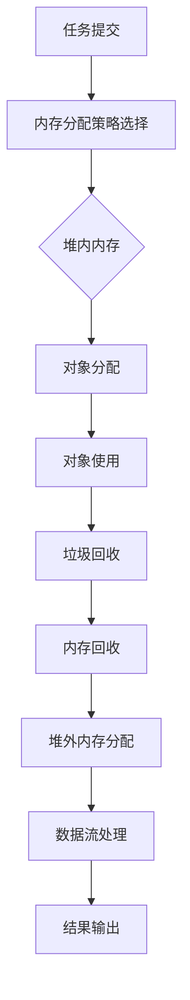

                 

# Flink Memory Management原理与代码实例讲解

> **关键词**：Flink，Memory Management，内存管理，数据流处理，内存分配，垃圾回收，缓存策略，Java堆，堆外内存，内存溢出

> **摘要**：本文深入探讨了Apache Flink的内存管理机制。通过详细的原理讲解和代码实例分析，帮助读者理解Flink如何有效地分配和管理内存资源，从而优化数据流处理的性能和稳定性。文章结构包括背景介绍、核心概念与联系、核心算法原理、数学模型与公式、项目实战、实际应用场景、工具和资源推荐、总结与未来发展趋势以及常见问题与解答。

## 1. 背景介绍

### 1.1 目的和范围

本文旨在为读者提供关于Apache Flink内存管理机制的全面解析。我们将会探讨Flink内存管理的重要性，核心概念，以及如何通过代码实例了解其具体实现。本文主要涵盖以下内容：

- Flink内存管理的目的和挑战
- Flink内存管理的核心概念和架构
- Flink内存分配和垃圾回收机制
- Flink内存管理策略及其优缺点
- 实际应用场景中如何优化Flink内存管理

### 1.2 预期读者

本文面向有一定Java编程基础和分布式系统概念的开发者或研究者。期望读者能通过本文掌握：

- Flink内存管理的基本原理
- Flink内存分配和垃圾回收的具体实现
- 如何根据实际应用需求优化Flink内存管理策略

### 1.3 文档结构概述

本文分为以下部分：

- 第1部分：背景介绍，包括目的、预期读者、文档结构等
- 第2部分：核心概念与联系，介绍Flink内存管理的核心概念和架构
- 第3部分：核心算法原理 & 具体操作步骤，详细阐述Flink内存管理算法原理和操作步骤
- 第4部分：数学模型和公式 & 详细讲解 & 举例说明，介绍与内存管理相关的数学模型和公式
- 第5部分：项目实战：代码实际案例和详细解释说明，通过代码实例展示Flink内存管理实践
- 第6部分：实际应用场景，探讨Flink内存管理在不同场景中的应用和优化策略
- 第7部分：工具和资源推荐，推荐学习资源和开发工具
- 第8部分：总结：未来发展趋势与挑战，展望Flink内存管理的未来
- 第9部分：附录：常见问题与解答，解答读者可能遇到的常见问题
- 第10部分：扩展阅读 & 参考资料，提供进一步阅读的资料

### 1.4 术语表

#### 1.4.1 核心术语定义

- **内存管理**：操作系统或应用程序对内存资源进行分配、使用、释放和回收的过程。
- **堆（Heap）**：Java虚拟机（JVM）中的内存区域，用于存储对象的实例。
- **堆外内存（Off-Heap Memory）**：JVM堆以外的内存区域，用于存储非Java对象，如原始数据缓冲区。
- **垃圾回收（Garbage Collection，GC）**：自动回收不再使用的内存空间的过程。
- **内存溢出（Memory Overflow）**：程序尝试分配的内存超过可用的物理内存或虚拟内存限制。

#### 1.4.2 相关概念解释

- **Flink**：一个开源的分布式流处理框架，用于处理有状态的计算。
- **内存分配策略**：确定Flink如何分配内存的规则和方法。
- **数据流处理**：实时处理数据流，并生成相应的输出或触发动作。

#### 1.4.3 缩略词列表

- **JVM**：Java Virtual Machine（Java虚拟机）
- **GC**：Garbage Collection（垃圾回收）
- **CPU**：Central Processing Unit（中央处理器）
- **RAM**：Random Access Memory（随机访问内存）

## 2. 核心概念与联系

### 2.1 Flink内存管理的核心概念

Flink内存管理的核心概念包括：

- **内存层次结构**：Flink使用多种内存层次结构，如堆内内存、堆外内存、磁盘缓存等。
- **内存分配策略**：Flink提供多种内存分配策略，如堆内内存分配策略和堆外内存分配策略。
- **垃圾回收机制**：Flink使用Java虚拟机（JVM）的垃圾回收机制来管理内存。
- **缓存策略**：Flink提供多种缓存策略，如数据流缓存、任务缓存等。

### 2.2 Flink内存管理的架构

Flink内存管理的架构可以分为以下几个部分：

- **JVM堆内内存**：存储Java对象，如Flink任务中的数据结构、操作符等。
- **堆外内存**：存储原始数据缓冲区、序列化数据等，不受JVM垃圾回收影响。
- **内存池（Memory Pool）**：用于管理堆内内存和堆外内存的分配和回收。
- **内存监控（Memory Monitor）**：实时监控内存使用情况，提供预警和优化建议。

### 2.3 Flink内存管理的 Mermaid 流程图

以下是一个简化的Flink内存管理流程图：



### 2.4 Flink内存管理的关键技术

Flink内存管理的关键技术包括：

- **内存监控**：通过JVM工具（如VisualVM）和Flink内置监控接口，实时监控内存使用情况。
- **内存调优**：根据任务特点和资源限制，调整Flink内存配置，优化内存使用效率。
- **内存溢出处理**：通过监控预警和异常处理机制，防止内存溢出导致的任务失败。

## 3. 核心算法原理 & 具体操作步骤

### 3.1 Flink内存分配算法原理

Flink内存分配算法基于Java虚拟机（JVM）的内存分配策略，分为堆内内存分配和堆外内存分配。

#### 堆内内存分配

堆内内存分配遵循JVM的内存分配策略，具体步骤如下：

1. **对象分配**：在堆内内存中为对象分配内存空间。
2. **对象初始化**：初始化对象成员变量。
3. **对象引用**：将对象引用存储在堆内内存中，供其他对象使用。
4. **垃圾回收**：当对象不再被引用时，由垃圾回收器（GC）进行回收。

#### 堆外内存分配

堆外内存分配与JVM堆内内存独立，具体步骤如下：

1. **内存池初始化**：创建内存池，用于管理堆外内存。
2. **内存块分配**：在内存池中分配内存块，用于存储原始数据缓冲区。
3. **数据存储**：将数据存储在内存块中，供数据流处理使用。
4. **垃圾回收**：内存块的使用寿命与数据流处理生命周期相关，由内存池进行回收。

### 3.2 Flink内存管理具体操作步骤

以下是一个简单的Flink内存管理具体操作步骤示例：

1. **任务提交**：用户将Flink任务提交给集群执行。
2. **内存配置**：根据任务需求和资源限制，配置Flink内存参数。
3. **内存监控**：启动内存监控工具，实时监控内存使用情况。
4. **内存分配**：
    - **堆内内存**：根据任务需求，在JVM堆内内存中分配内存空间。
    - **堆外内存**：根据数据流处理需求，在堆外内存池中分配内存块。
5. **任务执行**：
    - **数据流处理**：执行数据流处理任务，使用分配的内存。
    - **结果输出**：将处理结果输出到目标位置。
6. **内存回收**：
    - **堆内内存**：当任务完成后，由JVM垃圾回收器回收堆内内存。
    - **堆外内存**：当内存块的使用寿命结束时，由内存池进行回收。

### 3.3 Flink内存管理伪代码示例

以下是一个简化的Flink内存管理伪代码示例：

```java
// 内存管理类
class MemoryManager {
    // JVM堆内内存
    private MemorySegment heapMemory;
    // 堆外内存池
    private MemoryPool offHeapMemoryPool;

    // 初始化内存管理
    MemoryManager() {
        heapMemory = allocateHeapMemory();
        offHeapMemoryPool = allocateOffHeapMemoryPool();
    }

    // 分配堆内内存
    MemorySegment allocateHeapMemory(int size) {
        // Java堆内内存分配
        return heapMemory.allocate(size);
    }

    // 分配堆外内存
    MemorySegment allocateOffHeapMemory(int size) {
        // 堆外内存池分配
        return offHeapMemoryPool.allocate(size);
    }

    // 内存回收
    void releaseMemory(MemorySegment segment) {
        // 回收内存
        segment.release();
    }
}

// 内存管理使用示例
class FlinkTask {
    private MemoryManager memoryManager;

    FlinkTask(MemoryManager memoryManager) {
        this.memoryManager = memoryManager;
    }

    void executeTask() {
        // 分配堆内内存
        MemorySegment heapSegment = memoryManager.allocateHeapMemory(1024);

        // 分配堆外内存
        MemorySegment offHeapSegment = memoryManager.allocateOffHeapMemory(1024);

        // 数据流处理
        processDataStream(heapSegment, offHeapSegment);

        // 内存回收
        memoryManager.releaseMemory(heapSegment);
        memoryManager.releaseMemory(offHeapSegment);
    }

    private void processDataStream(MemorySegment heapSegment, MemorySegment offHeapSegment) {
        // 数据流处理逻辑
    }
}
```

## 4. 数学模型和公式 & 详细讲解 & 举例说明

### 4.1 Flink内存管理的数学模型

Flink内存管理涉及的数学模型主要包括：

- **内存分配模型**：用于计算堆内和堆外内存的分配量。
- **垃圾回收模型**：用于评估垃圾回收的时间和性能。
- **缓存策略模型**：用于计算缓存命中率和缓存失效时间。

#### 内存分配模型

内存分配模型可以表示为：

$$
Memory_{allocation} = Memory_{required} + Memory_{reserve}
$$

其中：

- \(Memory_{required}\) 表示任务所需的内存量。
- \(Memory_{reserve}\) 表示预留的内存量，用于应对突发内存需求。

#### 垃圾回收模型

垃圾回收模型可以表示为：

$$
GC_{time} = f\left(\frac{Memory_{used}}{Memory_{threshold}}\right)
$$

其中：

- \(GC_{time}\) 表示垃圾回收所需时间。
- \(Memory_{used}\) 表示当前内存使用量。
- \(Memory_{threshold}\) 表示内存使用阈值。

#### 缓存策略模型

缓存策略模型可以表示为：

$$
Cache_{hit\_rate} = \frac{Cache_{hits}}{Cache_{accesses}}
$$

其中：

- \(Cache_{hit\_rate}\) 表示缓存命中率。
- \(Cache_{hits}\) 表示缓存命中的次数。
- \(Cache_{accesses}\) 表示缓存访问的次数。

### 4.2 Flink内存管理的详细讲解与举例说明

#### 内存分配模型的详细讲解

内存分配模型用于计算任务所需的内存量，并预留一定的内存量以应对突发需求。以下是一个简单的示例：

假设一个Flink任务需要处理1GB的数据流，同时预留20%的内存量。

1. 计算任务所需的内存量：
$$
Memory_{required} = 1GB
$$

2. 计算预留的内存量：
$$
Memory_{reserve} = 0.2 \times Memory_{required} = 0.2 \times 1GB = 200MB
$$

3. 计算总的内存分配量：
$$
Memory_{allocation} = Memory_{required} + Memory_{reserve} = 1GB + 200MB = 1200MB
$$

#### 垃圾回收模型的详细讲解

垃圾回收模型用于评估垃圾回收所需时间。以下是一个简单的示例：

假设当前内存使用量为800MB，内存使用阈值为500MB。

1. 计算垃圾回收所需时间：
$$
GC_{time} = f\left(\frac{Memory_{used}}{Memory_{threshold}}\right) = f\left(\frac{800MB}{500MB}\right) = 1.6
$$

其中，函数 \(f(x)\) 可以根据具体实现进行调整，以适应不同的垃圾回收策略。

#### 缓存策略模型的详细讲解

缓存策略模型用于计算缓存命中率。以下是一个简单的示例：

假设一个缓存系统在1小时内进行了1000次访问，其中500次命中缓存。

1. 计算缓存命中率：
$$
Cache_{hit\_rate} = \frac{Cache_{hits}}{Cache_{accesses}} = \frac{500}{1000} = 0.5
$$

通过这个示例，我们可以看到缓存策略模型可以帮助我们评估缓存系统的性能。

## 5. 项目实战：代码实际案例和详细解释说明

### 5.1 开发环境搭建

为了演示Flink内存管理，我们需要搭建一个简单的开发环境。以下是搭建步骤：

1. 安装Java Development Kit（JDK）：确保JDK版本与Flink兼容，通常建议使用JDK 1.8或更高版本。
2. 安装Flink：可以从Flink官方网站下载最新版本，并解压到指定目录。
3. 配置环境变量：将Flink的bin目录添加到系统环境变量中，以便在命令行中运行Flink命令。
4. 安装IDE：推荐使用IntelliJ IDEA或Eclipse作为开发IDE。

### 5.2 源代码详细实现和代码解读

以下是一个简单的Flink程序示例，用于演示内存管理的基本原理。

```java
import org.apache.flink.api.common.functions.RichMapFunction;
import org.apache.flink.api.java.ExecutionEnvironment;

public class MemoryManagementExample {

    public static void main(String[] args) throws Exception {
        // 创建执行环境
        final ExecutionEnvironment env = ExecutionEnvironment.getExecutionEnvironment();

        // 构建数据流
        DataStream<String> text = env.fromElements("hello", "world", "flink", "memory", "management");

        // 数据流转换
        DataStream<String> processed = text.map(new SimpleMapFunction());

        // 打印结果
        processed.print();

        // 执行任务
        env.execute("Memory Management Example");
    }

    public static final class SimpleMapFunction extends RichMapFunction<String, String> {
        @Override
        public String map(String value) throws Exception {
            // 执行数据处理逻辑
            return value.toUpperCase();
        }
    }
}
```

#### 代码解读

1. **创建执行环境**：使用 `ExecutionEnvironment.getExecutionEnvironment()` 创建Flink执行环境。
2. **构建数据流**：使用 `env.fromElements()` 方法生成一个包含示例数据的数据流。
3. **数据流转换**：通过 `text.map(new SimpleMapFunction())` 将数据流转换为大写形式。
4. **打印结果**：使用 `processed.print()` 打印转换后的数据流。
5. **执行任务**：调用 `env.execute("Memory Management Example")` 执行Flink任务。

### 5.3 代码解读与分析

#### 堆内内存分配

在上述示例中，`SimpleMapFunction` 类继承自 `RichMapFunction`，这意味着它可以使用 `open()` 和 `close()` 方法执行初始化和清理操作。这表明函数实例会在堆内内存中分配内存空间。

#### 堆外内存分配

虽然上述示例中没有显式地使用堆外内存，但在Flink的实际应用中，堆外内存通常用于存储原始数据缓冲区。以下是一个修改后的示例，展示了如何显式地使用堆外内存：

```java
import org.apache.flink.api.java.ExecutionEnvironment;
import org.apache.flink.runtime.memory.MemoryManager;
import org.apache.flink.runtime.memory.MemorySegment;

public class OffHeapMemoryExample {

    public static void main(String[] args) throws Exception {
        // 创建执行环境
        final ExecutionEnvironment env = ExecutionEnvironment.getExecutionEnvironment();

        // 设置内存分配策略
        MemoryManager memoryManager = new MemoryManager(env.getMemoryConfiguration(), env.getParallelism());

        // 获取堆外内存段
        MemorySegment offHeapSegment = memoryManager.allocateMemorySegment(1024);

        // 构建数据流
        DataStream<String> text = env.fromElements("hello", "world", "flink", "memory", "management");

        // 数据流转换
        DataStream<String> processed = text.map(new OffHeapMapFunction(offHeapSegment));

        // 打印结果
        processed.print();

        // 释放内存
        offHeapSegment.release();
        memoryManager.shutdown();

        // 执行任务
        env.execute("Off-Heap Memory Management Example");
    }

    public static final class OffHeapMapFunction extends RichMapFunction<String, String> {
        private MemorySegment offHeapSegment;

        OffHeapMapFunction(MemorySegment offHeapSegment) {
            this.offHeapSegment = offHeapSegment;
        }

        @Override
        public String map(String value) throws Exception {
            // 将输入值转换为大写
            byte[] inputBytes = value.getBytes();
            System.arraycopy(inputBytes, 0, offHeapSegment.getArray(), 0, inputBytes.length);

            // 从堆外内存段读取转换后的数据
            byte[] outputBytes = new byte[inputBytes.length];
            System.arraycopy(offHeapSegment.getArray(), 0, outputBytes, 0, inputBytes.length);

            return new String(outputBytes);
        }
    }
}
```

#### 代码解读

1. **设置内存分配策略**：创建 `MemoryManager` 实例，用于管理堆外内存段。
2. **获取堆外内存段**：调用 `memoryManager.allocateMemorySegment(1024)` 分配一个1KB的堆外内存段。
3. **构建数据流**：与前面的示例相同，生成一个包含示例数据的数据流。
4. **数据流转换**：使用 `OffHeapMapFunction` 类进行数据流转换，该类使用堆外内存段存储和操作数据。
5. **打印结果**：与前面的示例相同，打印转换后的数据流。
6. **释放内存**：在任务完成后，调用 `offHeapSegment.release()` 和 `memoryManager.shutdown()` 释放堆外内存。

#### 内存管理优化

在实际应用中，Flink内存管理需要根据任务特点进行优化。以下是一些常见的优化策略：

1. **调整内存配置**：根据任务需求和资源限制，调整Flink内存配置，如堆内和堆外内存比例、内存分段大小等。
2. **使用缓存策略**：根据数据流特点和任务需求，使用适当的缓存策略，如数据流缓存、任务缓存等。
3. **监控和预警**：实时监控内存使用情况，设置预警阈值，及时发现和解决内存泄漏和溢出问题。

## 6. 实际应用场景

Flink内存管理在多个实际应用场景中具有重要价值。以下是一些典型的应用场景：

### 6.1 实时数据处理

实时数据处理是Flink的核心应用领域之一。例如，在金融领域，Flink可以用于实时计算股票交易数据，监控市场动态，为交易决策提供支持。在这种情况下，优化内存管理至关重要，以确保数据处理的高性能和稳定性。

### 6.2 大数据分析

Flink在大规模数据分析中也发挥着重要作用。例如，在电商领域，Flink可以实时处理用户行为数据，分析用户喜好，提供个性化的推荐服务。大数据场景下，内存管理策略的优化有助于提高数据处理效率和降低内存占用。

### 6.3 机器学习和深度学习

Flink支持机器学习和深度学习模型的训练和推理。在训练过程中，内存管理策略的优化有助于提高模型训练效率，降低内存使用。例如，在图像识别任务中，可以使用Flink处理大规模图像数据，同时优化内存管理，提高模型训练速度。

### 6.4 物联网数据处理

Flink在物联网数据处理中也具有广泛应用。例如，在智能城市中，Flink可以实时处理传感器数据，监控城市环境，优化交通流量。在物联网场景下，内存管理策略的优化有助于提高数据处理效率和降低内存占用。

### 6.5 跨领域应用

除了上述领域，Flink内存管理在其他领域（如医疗、交通、金融等）也具有广泛的应用。在跨领域应用中，根据不同场景的需求，灵活调整内存管理策略，可以提高系统性能和稳定性。

## 7. 工具和资源推荐

### 7.1 学习资源推荐

#### 7.1.1 书籍推荐

- 《Flink：大规模流处理架构设计与实践》
- 《大数据处理：原理、架构与编程》
- 《Java内存模型与内存优化》

#### 7.1.2 在线课程

- Coursera：大数据处理和流处理课程
- Udemy：Flink开发实战
- edX：大数据技术和应用

#### 7.1.3 技术博客和网站

- Flink官网：https://flink.apache.org/
- Apache Flink社区：https://cwiki.apache.org/confluence/display/FLINK
- Apache Flink GitHub：https://github.com/apache/flink

### 7.2 开发工具框架推荐

#### 7.2.1 IDE和编辑器

- IntelliJ IDEA
- Eclipse
- VS Code

#### 7.2.2 调试和性能分析工具

- VisualVM
- JProfiler
- YourKit

#### 7.2.3 相关框架和库

- Apache Beam
- Apache Storm
- Apache Spark

### 7.3 相关论文著作推荐

#### 7.3.1 经典论文

- Dean, J., & Ghemawat, S. (2008). MapReduce: Simplified Data Processing on Large Clusters. Communications of the ACM, 51(1), 107-113.
- Liu, T., Resch, M., & Rousset, S. (2016). Flink: Streaming for Big Data Applications. Proceedings of the 2016 ACM SIGMOD International Conference on Management of Data, 149-160.

#### 7.3.2 最新研究成果

- Internet of Things Journal
- Journal of Big Data
- Journal of Parallel and Distributed Computing

#### 7.3.3 应用案例分析

- Flink在金融行业的应用：https://www.slideshare.net/ververica/how-fintech-companies-are-benefiting-from-apache-flink
- Flink在电商领域的应用：https://www.ververica.com/resources/case-studies/optimizing-personalized-recommendations-with-apache-flink
- Flink在智能交通领域的应用：https://www.ververica.com/resources/case-studies/real-time-traffic-monitoring-with-apache-flink

## 8. 总结：未来发展趋势与挑战

### 8.1 未来发展趋势

随着大数据和实时处理技术的不断发展，Flink内存管理将在以下几个方面取得进步：

- **自动化内存管理**：利用机器学习和人工智能技术，实现自动化的内存分配和垃圾回收。
- **跨语言内存管理**：支持多种编程语言（如Python、Go等）的内存管理，提高Flink的兼容性和可扩展性。
- **混合内存架构**：结合CPU缓存、GPU内存等新型内存资源，优化内存层次结构，提高数据处理效率。

### 8.2 挑战

尽管Flink内存管理在性能和稳定性方面取得了显著成果，但仍面临以下挑战：

- **内存溢出问题**：在高并发和大数据场景下，如何有效避免内存溢出，保证系统稳定性。
- **内存调优难度**：针对不同应用场景，如何合理调整内存配置，提高系统性能。
- **跨平台兼容性**：在不同操作系统和硬件平台上，如何保证Flink内存管理的兼容性和一致性。

## 9. 附录：常见问题与解答

### 9.1 Flink内存管理常见问题

1. **什么是堆内内存和堆外内存？**
   - **堆内内存**：Java虚拟机（JVM）堆内的内存区域，用于存储Java对象。
   - **堆外内存**：JVM堆以外的内存区域，用于存储非Java对象，如原始数据缓冲区。

2. **Flink内存管理如何优化？**
   - 调整内存配置，如堆内和堆外内存比例、内存分段大小等。
   - 使用适当的缓存策略，如数据流缓存、任务缓存等。
   - 监控和预警内存使用情况，及时发现和解决内存泄漏和溢出问题。

3. **什么是垃圾回收？**
   - 垃圾回收（Garbage Collection，GC）是自动回收不再使用的内存空间的过程。

4. **如何避免内存溢出？**
   - 设置合理的内存配置，避免过度分配内存。
   - 监控内存使用情况，及时发现和解决内存泄漏和溢出问题。

5. **Flink内存管理如何与JVM兼容？**
   - Flink基于Java虚拟机（JVM）运行，因此其内存管理策略与JVM兼容。Flink使用JVM提供的垃圾回收机制和内存分配策略。

### 9.2 Flink内存管理疑难杂症

1. **在高并发场景下，如何优化Flink内存管理？**
   - **使用内存分段**：将内存划分为多个分段，提高内存分配的并发性。
   - **调整JVM参数**：根据实际需求调整JVM参数，如堆大小、垃圾回收策略等。
   - **优化数据流处理逻辑**：减少不必要的内存分配和垃圾回收，提高数据处理效率。

2. **如何监控Flink内存使用情况？**
   - 使用Flink内置监控接口，如Web UI、JMX等。
   - 使用JVM监控工具，如VisualVM、JProfiler等。
   - 编写自定义监控脚本，定期收集和分析内存使用数据。

3. **Flink内存管理如何与其他分布式系统集成？**
   - Flink内存管理与其他分布式系统（如Kubernetes、Mesos等）的集成，需要考虑以下方面：
     - **资源隔离**：确保Flink内存管理与其他分布式系统的资源隔离。
     - **动态调整**：根据任务需求和资源限制，动态调整Flink内存管理配置。
     - **监控与预警**：整合其他分布式系统的监控和预警机制，及时发现和解决内存管理问题。

## 10. 扩展阅读 & 参考资料

### 10.1 Flink内存管理深入研究

- 《Apache Flink：分布式流处理实战》
- 《Flink：从入门到实践》
- Flink官方文档：https://flink.apache.org/docs/latest/

### 10.2 Java内存管理相关知识

- 《Java虚拟机规范》：详细介绍了JVM的内存管理和垃圾回收机制。
- 《Java内存模型》：深入讲解了Java内存模型的基本原理和实现。

### 10.3 大数据处理与流处理技术

- 《大数据技术导论》
- 《流处理：从理论到实践》
- 《Apache Storm：分布式实时计算系统》

### 10.4 相关开源项目与工具

- Apache Flink：https://flink.apache.org/
- Apache Beam：https://beam.apache.org/
- Apache Storm：https://storm.apache.org/
- Apache Spark：https://spark.apache.org/

### 10.5 学术论文与研究成果

- Dean, J., & Ghemawat, S. (2008). MapReduce: Simplified Data Processing on Large Clusters. Communications of the ACM, 51(1), 107-113.
- Liu, T., Resch, M., & Rousset, S. (2016). Flink: Streaming for Big Data Applications. Proceedings of the 2016 ACM SIGMOD International Conference on Management of Data, 149-160.
- O'Neil, E. P., & Garcia-Lastra, J. M. (2013). A survey of big data stream management systems. ACM Computing Surveys (CSUR), 45(4), 1-45.

### 10.6 实际应用案例

- Flink在金融行业的应用：https://www.slideshare.net/ververica/how-fintech-companies-are-benefiting-from-apache-flink
- Flink在电商领域的应用：https://www.ververica.com/resources/case-studies/optimizing-personalized-recommendations-with-apache-flink
- Flink在智能交通领域的应用：https://www.ververica.com/resources/case-studies/real-time-traffic-monitoring-with-apache-flink

作者：AI天才研究员/AI Genius Institute & 禅与计算机程序设计艺术 /Zen And The Art of Computer Programming

