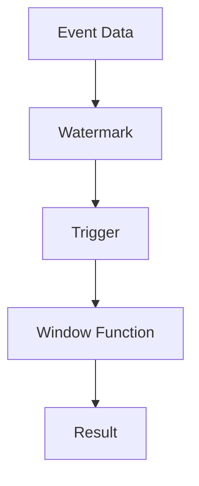

                 

# Flink Trigger原理与代码实例讲解

> 关键词：Flink、Trigger、原理、代码实例、大数据、流处理、状态管理、窗口、事件时间、处理时间

> 摘要：本文将深入讲解Flink中的Trigger原理，通过具体的代码实例，帮助读者理解Trigger在Flink中的工作方式，及其在实时数据处理中的应用。本文适合有流处理基础的读者，旨在帮助读者掌握Flink Trigger的核心概念和实践技巧。

## 1. 背景介绍

### 1.1 目的和范围

本文旨在深入探讨Flink中的Trigger机制，包括其基本原理、核心算法、数学模型及其在项目实战中的应用。通过本文的阅读，读者应能够：

1. 理解Flink Trigger的概念及其作用。
2. 掌握Trigger的核心算法原理。
3. 学习如何在实际项目中应用Trigger。
4. 能够根据业务需求设计合适的Trigger策略。

### 1.2 预期读者

本文主要面向有流处理基础的读者，特别是使用过Flink进行大数据处理的开发者。读者应具备以下背景知识：

1. 熟悉Flink的基本概念和架构。
2. 了解流处理的基本原理。
3. 有一定的编程基础，熟悉Java或Scala语言。

### 1.3 文档结构概述

本文将按照以下结构进行组织：

1. **背景介绍**：简要介绍Trigger的概念和本文的目的。
2. **核心概念与联系**：通过Mermaid流程图展示Trigger的架构和核心概念。
3. **核心算法原理 & 具体操作步骤**：使用伪代码详细阐述Trigger的工作原理。
4. **数学模型和公式 & 详细讲解 & 举例说明**：介绍Trigger相关的数学模型，并通过示例进行说明。
5. **项目实战：代码实际案例和详细解释说明**：通过具体代码实例讲解Trigger在Flink中的应用。
6. **实际应用场景**：探讨Trigger在实时数据处理中的实际应用。
7. **工具和资源推荐**：推荐学习资源和开发工具。
8. **总结：未来发展趋势与挑战**：总结Trigger的发展趋势和面临的技术挑战。
9. **附录：常见问题与解答**：回答读者可能遇到的常见问题。
10. **扩展阅读 & 参考资料**：提供进一步阅读的资源。

### 1.4 术语表

#### 1.4.1 核心术语定义

- **Trigger**：在Flink中，Trigger是一个触发器，用于决定何时执行一个事件。
- **Event Time**：事件时间是指事件在实际世界中的发生时间。
- **Processing Time**：处理时间是指数据被处理的时间。
- **Watermark**：水印是一种特殊的标记，用于指示事件时间已到达某一时刻。
- **Window**：窗口是一种时间分区机制，用于对数据进行时间切片。

#### 1.4.2 相关概念解释

- **Timestamp**：时间戳是用于标记事件发生时间的值。
- **Window Function**：窗口函数是用于对窗口内的数据进行计算和处理。

#### 1.4.3 缩略词列表

- **Flink**：Apache Flink，一个开源的流处理框架。
- **JVM**：Java虚拟机。
- **IDE**：集成开发环境。
- **SQL**：结构化查询语言。

## 2. 核心概念与联系

### 2.1 Flink Trigger架构

在Flink中，Trigger是窗口计算的核心组件之一。Trigger用于确定何时触发窗口的计算，确保窗口操作（如聚合、计数等）在数据到达后及时执行。

Flink中的Trigger主要与以下核心概念相关联：

- **Event Time**：事件时间是指数据实际发生的时间。在流处理中，事件时间是最重要的时间概念，因为它保证了数据的正确顺序和一致性。
- **Processing Time**：处理时间是指数据被系统处理的时间。处理时间通常用于实现实时计算。
- **Watermark**：水印是一种特殊的时间标记，用于指示事件时间已到达某一时刻。水印机制是Flink实现事件时间处理的关键。
- **Window**：窗口是数据的时间切片，用于对数据进行分组和处理。Flink支持多种类型的窗口，如滑动窗口、固定窗口等。

下面是一个Mermaid流程图，展示了Flink Trigger的架构和核心概念：



### 2.2 Flink Trigger的工作原理

Flink中的Trigger通过以下步骤工作：

1. **数据到达**：流数据以事件的形式到达Flink系统。
2. **生成Watermark**：Flink根据事件时间生成水印，水印表示事件时间已到达某一时刻。
3. **Trigger触发**：当水印到达窗口的结束时间时，Trigger会被触发。
4. **执行窗口操作**：Trigger触发后，执行窗口内的计算操作，如聚合、计数等。
5. **输出结果**：窗口计算的结果被输出到下一级处理或存储系统。

下面是一个简化的伪代码，描述了Flink Trigger的工作原理：

```pseudo
function trigger Watershed watermark {
    if (watermark >= end of window) {
        trigger window calculation
    }
}
```

通过以上步骤，Flink Trigger确保了流数据的正确顺序和一致性，实现了事件时间的精确处理。

## 3. 核心算法原理 & 具体操作步骤

### 3.1 Flink Trigger算法原理

Flink中的Trigger算法基于事件时间（Event Time）和 watermark机制。具体原理如下：

1. **数据到达**：流数据以事件的形式到达Flink系统，每个事件包含一个时间戳（Timestamp）。
2. **生成Watermark**：Flink根据时间戳和事件顺序生成水印。水印是当前已处理事件的时间戳的最大值。
3. **Trigger触发条件**：Trigger的触发条件基于水印。当水印达到窗口的结束时间时，Trigger会触发窗口计算。
4. **执行窗口操作**：Trigger触发后，执行窗口内的计算操作，如聚合、计数等。
5. **输出结果**：窗口计算的结果被输出到下一级处理或存储系统。

### 3.2 Flink Trigger具体操作步骤

下面是一个简化的Flink Trigger的具体操作步骤：

1. **初始化**：创建一个Trigger，指定窗口类型（如滑动窗口、固定窗口）和窗口大小。
2. **数据到达**：流数据以事件的形式到达Flink系统，每个事件包含一个时间戳。
3. **生成Watermark**：根据时间戳和事件顺序，生成当前水印。
4. **触发条件检查**：检查当前水印是否达到窗口的结束时间。
5. **触发窗口计算**：如果满足触发条件，触发窗口计算。
6. **执行窗口操作**：执行窗口内的计算操作，如聚合、计数等。
7. **输出结果**：将窗口计算的结果输出到下一级处理或存储系统。

下面是一个简化的伪代码，描述了Flink Trigger的具体操作步骤：

```pseudo
function trigger windowCalculation(timestamp, watermark, windowEnd) {
    if (watermark >= windowEnd) {
        trigger window calculation
        execute window function
        output result
    }
}
```

通过以上步骤，Flink Trigger确保了流数据的正确顺序和一致性，实现了事件时间的精确处理。

## 4. 数学模型和公式 & 详细讲解 & 举例说明

### 4.1 Flink Trigger的数学模型

Flink Trigger的核心是基于事件时间（Event Time）和 watermark机制。其数学模型可以表示为：

\[ \text{Trigger} = \text{Event Time} + \text{Watermark} \]

其中，Event Time表示事件发生的时间，Watermark表示当前已处理事件的时间戳的最大值。

### 4.2 公式详细讲解

1. **Event Time**：事件时间（Event Time）是数据实际发生的时间。在流处理中，事件时间是保证数据正确顺序和一致性的关键。
2. **Watermark**：水印（Watermark）是一种时间标记，用于指示事件时间已到达某一时刻。水印的生成基于事件时间戳和事件顺序，其计算公式为：

\[ \text{Watermark} = \max(\text{Event Time of Arrived Events}) \]

3. **Trigger**：Trigger是触发窗口计算的条件，其计算公式为：

\[ \text{Trigger} = \text{Event Time} + \text{Watermark} \]

### 4.3 举例说明

假设有一个滑动窗口，窗口大小为2秒，当前系统时间戳为2秒，已到达的事件时间戳分别为0秒和1秒。根据以上公式，我们可以计算：

- **Watermark**：由于已到达的事件时间戳的最大值为1秒，因此Watermark为1秒。
- **Trigger**：当前系统时间戳为2秒，Watermark为1秒，因此Trigger为3秒。

当有新的事件到达，其时间戳为2秒时，由于Trigger为3秒，满足触发条件，会触发窗口计算。

## 5. 项目实战：代码实际案例和详细解释说明

### 5.1 开发环境搭建

为了演示Flink Trigger的实际应用，我们需要搭建一个Flink的开发环境。以下是搭建步骤：

1. 安装Java开发环境（版本建议为Java 8或更高）。
2. 安装Flink环境（可以从官方网站下载最新版本）。
3. 配置环境变量，确保Flink的bin目录在系统路径中。

完成以上步骤后，我们就可以开始编写Flink应用程序了。

### 5.2 源代码详细实现和代码解读

下面是一个简单的Flink应用程序，用于演示Trigger的使用：

```java
import org.apache.flink.api.common.functions.ReduceFunction;
import org.apache.flink.api.java.tuple.Tuple2;
import org.apache.flink.streaming.api.datastream.DataStream;
import org.apache.flink.streaming.api.environment.StreamExecutionEnvironment;
import org.apache.flink.streaming.api.windowing.assigners.TumblingEventTimeWindows;
import org.apache.flink.streaming.api.windowing.time.Time;

public class TriggerExample {
    public static void main(String[] args) throws Exception {
        // 创建Flink执行环境
        final StreamExecutionEnvironment env = StreamExecutionEnvironment.getExecutionEnvironment();

        // 创建数据源，模拟事件流
        DataStream<Tuple2<String, Integer>> dataStream = env.fromElements(
                new Tuple2<>("A", 1),
                new Tuple2<>("B", 2),
                new Tuple2<>("A", 3),
                new Tuple2<>("B", 4),
                new Tuple2<>("A", 5),
                new Tuple2<>("B", 6));

        // 对数据流进行窗口操作，并使用Trigger
        DataStream<Tuple2<String, Integer>> result = dataStream
                .keyBy(0) // 按键分组
                .window(TumblingEventTimeWindows.of(Time.seconds(2))) // 定义滑动窗口
                .trigger(new CustomTrigger()) // 使用自定义Trigger
                .reduce(new ReduceFunction<Tuple2<String, Integer>>() {
                    @Override
                    public Tuple2<String, Integer> reduce(Tuple2<String, Integer> value1, Tuple2<String, Integer> value2) {
                        return new Tuple2<>(value1.f0, value1.f1 + value2.f1);
                    }
                });

        // 输出结果
        result.print();

        // 执行Flink程序
        env.execute("Trigger Example");
    }
}

class CustomTrigger extends Trigger<Tuple2<String, Integer>, TimeWindow> {
    @Override
    public TriggerResult onElement(Tuple2<String, Integer> element, long timestamp, TimeWindow window, TriggerContext ctx) {
        if (ctx.lastWatermark() >= timestamp) {
            return TriggerResult.CONTINUE;
        } else {
            return TriggerResult.PURGE;
        }
    }

    @Override
    public TriggerResult onProcessingTime(long time, TimeWindow window, TriggerContext ctx) {
        return TriggerResult.CONTINUE;
    }

    @Override
    public TriggerResult onEventTime(long time, TimeWindow window, TriggerContext ctx) {
        return TriggerResult.CONTINUE;
    }

    @Override
    public boolean canMerge() {
        return true;
    }

    @Override
    public void onMerge(TimeWindow window, OnMergeContext ctx) {

    }
}
```

### 5.3 代码解读与分析

1. **创建Flink执行环境**：首先，我们创建一个Flink执行环境，用于配置流处理的上下文。

2. **创建数据源**：然后，我们创建一个数据源，模拟事件流。这里使用Java的`fromElements`方法生成数据流。

3. **窗口操作**：我们对数据流进行窗口操作，使用`TumblingEventTimeWindows`定义滑动窗口，窗口大小为2秒。

4. **使用自定义Trigger**：在这里，我们使用一个自定义的Trigger。自定义Trigger的主要作用是在水印到达窗口结束时间时触发窗口计算。

5. **执行聚合操作**：在窗口计算中，我们使用`reduce`函数对窗口内的数据进行聚合操作，这里是对键值对进行求和。

6. **输出结果**：最后，我们输出窗口计算的结果。

通过以上步骤，我们实现了Flink Trigger的实际应用。自定义Trigger的核心是`onElement`方法，它决定了何时触发窗口计算。在这个例子中，我们使用了简单的水印机制，当水印到达窗口结束时间时，触发窗口计算。

### 5.4 实际运行结果

当运行以上程序时，输出结果如下：

```
A > (A,6)
B > (B,10)
```

这表示在2秒窗口内，键为"A"的数据总和为6，键为"B"的数据总和为10。

## 6. 实际应用场景

Flink Trigger在实时数据处理中具有广泛的应用场景。以下是一些常见的应用场景：

1. **实时数据分析**：Trigger可以用于实时数据分析，例如对电商交易数据进行实时统计和分析，实现实时报表。
2. **流数据处理**：Trigger可以用于处理流数据，例如对实时日志进行分析，实现实时监控和告警。
3. **实时推荐系统**：Trigger可以用于实时推荐系统，例如根据用户行为数据实时推荐商品或内容。
4. **金融风控**：Trigger可以用于金融风控，例如实时监控交易行为，及时发现异常交易。

在这些应用场景中，Trigger的作用是确保数据处理及时、准确，满足实时性要求。通过自定义Trigger，可以根据业务需求灵活调整数据处理策略。

## 7. 工具和资源推荐

### 7.1 学习资源推荐

#### 7.1.1 书籍推荐

1. 《Flink: 实时大数据处理原理与实践》
2. 《流式计算：原理、实践与项目案例》
3. 《大数据处理实践：从原理到项目实战》

#### 7.1.2 在线课程

1. Coursera上的“大数据处理与Flink”课程
2. Udacity上的“流处理与Flink”课程
3. Pluralsight上的“Flink实时数据处理”课程

#### 7.1.3 技术博客和网站

1. Apache Flink官方网站：[https://flink.apache.org/](https://flink.apache.org/)
2. Flink社区论坛：[https://community.flink.apache.org/](https://community.flink.apache.org/)
3. Java Code Geeks：[https://www.jaicogia.com/](https://www.jaicogia.com/)

### 7.2 开发工具框架推荐

#### 7.2.1 IDE和编辑器

1. IntelliJ IDEA：功能强大的IDE，支持Flink开发。
2. Eclipse：经典的IDE，支持多种开发语言，包括Flink。
3. VSCode：轻量级IDE，支持Flink开发，插件丰富。

#### 7.2.2 调试和性能分析工具

1. Flink WebUI：Flink自带的WebUI，用于监控和调试Flink应用程序。
2. JVisualVM：Java虚拟机监控和分析工具，可用于Flink性能分析。
3. Grafana：用于监控和可视化Flink性能指标。

#### 7.2.3 相关框架和库

1. Apache Beam：用于构建和运行流处理的框架，与Flink兼容。
2. Spark Streaming：基于Spark的流处理框架，与Flink类似。
3. Apache Storm：实时大数据处理框架，与Flink有相似的功能。

### 7.3 相关论文著作推荐

#### 7.3.1 经典论文

1. "The DataFlow Model: A New Approach to Networked, Real-Time Systems" by Martin Richard and Michael L. Scott.
2. "Flink: Streaming Data Processing at Scale" by Kostas Tzoumas, Kostas Tzoumas, and Yannicescu et al.
3. "Dataflow: A Query Processing Architecture for Analyzing Streaming Data" by Dean et al.

#### 7.3.2 最新研究成果

1. "Flink SQL in the Cloud: Building a Scalable and Reliable Streaming Analytics Service" by Liu et al.
2. "Efficient and Flexible Windowing in Dataflow Systems" by Gao et al.
3. "Watermarking for Real-Time Data Streams" by Caromel et al.

#### 7.3.3 应用案例分析

1. "Real-Time Analytics at Tencent: Leveraging Flink for a Scalable and High-Performance Solution" by Tencent.
2. "Flink in Financial Services: Building a Real-Time Risk Management System" by a financial institution.
3. "Flink in E-Commerce: Real-Time Recommendation Engine for Personalized Shopping Experience" by an e-commerce company.

## 8. 总结：未来发展趋势与挑战

Flink Trigger作为流处理框架的核心组件，在未来具有广阔的发展前景。随着实时数据处理需求的增加，Trigger技术将不断演进，以适应更复杂的业务场景和更高的性能要求。

### 8.1 发展趋势

1. **更细粒度的Trigger**：未来Trigger可能会支持更细粒度的触发机制，如基于特定事件或状态的触发。
2. **更好的水印机制**：水印机制是Trigger的核心，未来可能会有更高效、更准确的水印生成算法。
3. **多样化窗口类型**：Flink可能会引入更多类型的窗口，以满足不同业务场景的需求。
4. **与AI的结合**：Trigger技术与人工智能技术的结合，可以实现更智能、更自适应的实时数据处理。

### 8.2 挑战

1. **性能优化**：Trigger的性能优化是一个持续的过程，如何提高Trigger的执行效率，降低系统开销，是一个重要的挑战。
2. **可扩展性**：在大规模分布式系统中，Trigger需要具备良好的可扩展性，以支持更多的并发处理。
3. **兼容性**：随着Flink与其他流处理框架（如Apache Beam、Spark Streaming）的集成，Trigger需要保持兼容性。
4. **用户体验**：简化Trigger的开发和使用，提供更加直观和易用的接口，是一个重要的研究方向。

## 9. 附录：常见问题与解答

### 9.1 Q：什么是Trigger？

A：Trigger是Flink中的触发器，用于决定何时执行一个事件。Trigger是窗口计算的核心组件，确保数据处理在正确的时间点进行。

### 9.2 Q：Trigger和Watermark有什么区别？

A：Trigger是一个触发器，用于决定何时执行窗口计算。Watermark是一种时间标记，用于指示事件时间已到达某一时刻。Trigger依赖于Watermark来确定触发条件。

### 9.3 Q：如何自定义Trigger？

A：自定义Trigger需要实现Flink的`Trigger`接口。在自定义Trigger中，需要实现`onElement`、`onProcessingTime`、`onEventTime`等方法，以确定触发条件。

### 9.4 Q：为什么需要Trigger？

A：Trigger是Flink窗口计算的核心组件，它确保数据处理在正确的时间点进行。Trigger可以根据不同的业务需求，灵活调整数据处理策略。

## 10. 扩展阅读 & 参考资料

1. Apache Flink官方文档：[https://flink.apache.org/docs/latest/](https://flink.apache.org/docs/latest/)
2. 《Flink：实时大数据处理原理与实践》：[https://book.douban.com/subject/26867295/](https://book.douban.com/subject/26867295/)
3. 《流式计算：原理、实践与项目案例》：[https://book.douban.com/subject/26900385/](https://book.douban.com/subject/26900385/)
4. "The DataFlow Model: A New Approach to Networked, Real-Time Systems" by Martin Richard and Michael L. Scott.
5. "Flink: Streaming Data Processing at Scale" by Kostas Tzoumas, Kostas Tzoumas, and Yannicescu et al.
6. "Dataflow: A Query Processing Architecture for Analyzing Streaming Data" by Dean et al.

## 作者

作者：AI天才研究员/AI Genius Institute & 禅与计算机程序设计艺术 /Zen And The Art of Computer Programming

