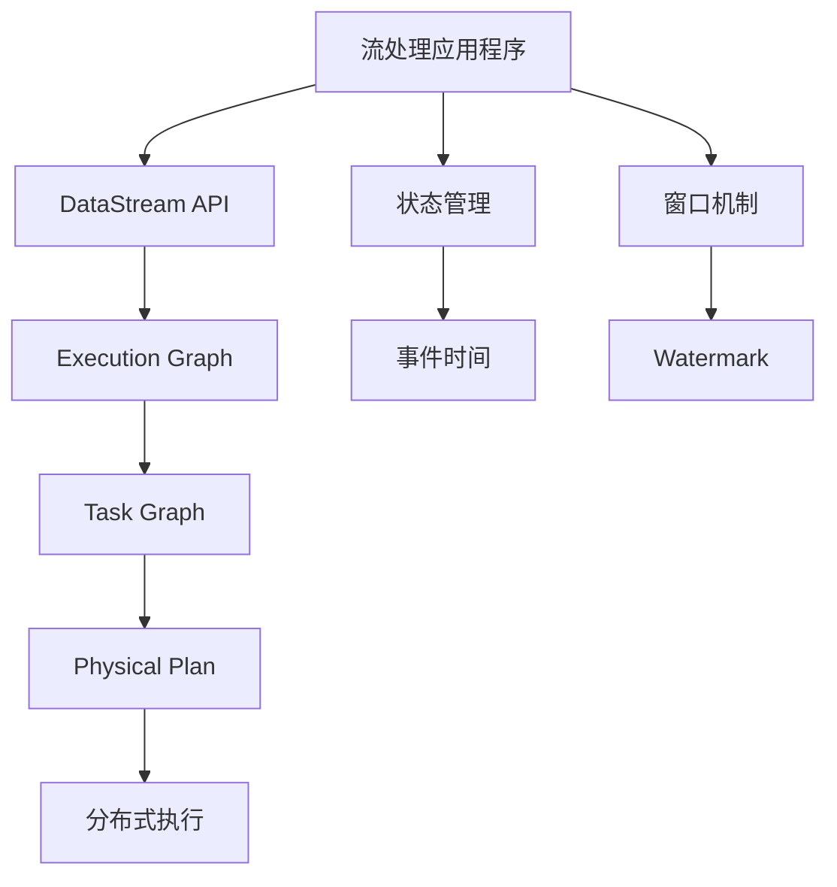

                 


# Flink原理与代码实例讲解

> **关键词：** Apache Flink、流处理、批处理、状态管理、窗口、Watermark、事件时间、处理时间、计算模型
>
> **摘要：** 本文将深入讲解Apache Flink的核心原理，包括其流处理与批处理的能力、状态管理、窗口机制以及事件时间与处理时间处理模型。通过具体的代码实例，我们将展示如何在实际项目中使用Flink进行高效的数据处理。

## 1. 背景介绍

### 1.1 目的和范围

本文的目的是介绍Apache Flink的核心原理，并通过实际代码实例展示其在流处理和批处理场景中的应用。我们将覆盖以下主题：

- Flink的流处理与批处理模型
- 状态管理机制
- 窗口机制
- 事件时间与处理时间处理模型
- 实际代码实例讲解

### 1.2 预期读者

本文适合对大数据处理和流处理有一定了解的读者，尤其是希望深入了解Apache Flink原理和应用的开发者。

### 1.3 文档结构概述

本文将按照以下结构展开：

- 背景介绍
  - 目的和范围
  - 预期读者
  - 文档结构概述
- 核心概念与联系
  - Flink核心概念
  - Flink架构
- 核心算法原理 & 具体操作步骤
  - 流处理模型
  - 批处理模型
  - 状态管理
  - 窗口机制
  - 事件时间与处理时间
- 数学模型和公式 & 详细讲解 & 举例说明
  - 时间窗口计算
  - 数据一致性保证
- 项目实战：代码实际案例和详细解释说明
  - 开发环境搭建
  - 源代码详细实现和代码解读
  - 代码解读与分析
- 实际应用场景
  - 社交网络实时分析
  - 搜索引擎日志处理
  - 金融交易实时监控
- 工具和资源推荐
  - 学习资源
  - 开发工具框架
  - 相关论文著作
- 总结：未来发展趋势与挑战
- 附录：常见问题与解答
- 扩展阅读 & 参考资料

### 1.4 术语表

#### 1.4.1 核心术语定义

- Apache Flink：一个开源分布式流处理框架。
- 流处理：实时处理数据流的技术。
- 批处理：处理批量数据的技术。
- 状态管理：在流处理中维护和处理数据状态的能力。
- 窗口：对数据进行分组和计算的时间或空间单位。
- Watermark：用于事件时间处理的时间标记。
- 事件时间：数据实际发生的时间。
- 处理时间：数据处理开始的时间。

#### 1.4.2 相关概念解释

- **分布式流处理**：在分布式系统中，流处理任务被分解到多个节点上执行，每个节点处理一部分数据。
- **窗口计算**：将数据分成多个时间或数据量窗口进行计算。
- **状态一致性**：在分布式系统中，状态在不同节点之间保持一致。

#### 1.4.3 缩略词列表

- Apache：Apache Software Foundation
- Flink：Apache Flink
- JVM：Java Virtual Machine
- API：Application Programming Interface
- DAG：Directed Acyclic Graph

## 2. 核心概念与联系

Flink作为流处理框架，其核心概念和架构设计决定了其强大的数据处理能力和灵活性。以下是Flink的核心概念和架构的Mermaid流程图：



### 2.1 Flink核心概念

#### 2.1.1 DataStream API

DataStream API是Flink提供的高层抽象接口，用于表示无界的数据流。它允许开发者通过丰富的操作符（如map、filter、reduce）对数据流进行操作。

#### 2.1.2 Execution Graph

Execution Graph是Flink内部的计算图，用于表示程序的执行逻辑。它由操作符节点和连接操作符的有向边组成。

#### 2.1.3 Task Graph

Task Graph是将Execution Graph转换为物理执行计划后的结果。它由Task节点组成，每个Task代表一个独立的计算任务。

#### 2.1.4 Physical Plan

Physical Plan是Task Graph的进一步细化，用于描述具体的计算细节，如数据分区、分布式计算策略等。

#### 2.1.5 状态管理

状态管理是流处理的重要部分，Flink提供了多种状态管理机制，如Keyed State、Operator State和List State。状态可以用于保存中间结果、计数器等。

#### 2.1.6 窗口机制

窗口机制是Flink处理时间序列数据的强大工具，它将数据分成多个时间或数据量窗口进行计算。窗口可以分为时间窗口、计数窗口和滑动窗口等。

#### 2.1.7 事件时间与处理时间

事件时间是数据实际发生的时间，处理时间是数据处理开始的时间。Flink支持事件时间和处理时间的处理，并通过Watermark机制实现事件时间处理。

### 2.2 Flink架构

Flink的架构设计决定了其高效性和可扩展性。以下是Flink的基本架构组件：

- **Job Manager**：负责协调和监控整个Flink集群的任务调度和资源分配。
- **Task Manager**：负责执行具体的计算任务，并与其他Task Manager进行通信。
- **Client**：用于提交Flink应用程序到Job Manager进行执行。

## 3. 核心算法原理 & 具体操作步骤

### 3.1 流处理模型

流处理是Flink的核心能力之一。流处理模型可以通过以下伪代码来解释：

```plaintext
DataStream<T> dataStream = env.addSource(sourceFunction);

dataStream
  .map(new MapFunction<T, R>())
  .filter(new FilterFunction<R>())
  .reduce(new ReduceFunction<R>())
  .addSink(new SinkFunction<R>());
```

在这个模型中，DataStream代表数据流，通过一系列的转换操作（如map、filter、reduce）处理数据，最后将结果输出到Sink。

### 3.2 批处理模型

批处理是Flink的另一个重要能力。批处理模型可以通过以下伪代码来解释：

```plaintext
DataSet<T> dataSet = env.fromCollection(data);

dataSet
  .map(new MapFunction<T, R>())
  .filter(new FilterFunction<R>())
  .reduce(new ReduceFunction<R>())
  .writeAsText(outputPath);
```

在这个模型中，DataSet代表批量数据，通过一系列的转换操作处理后，将结果输出到文件系统或其他存储系统。

### 3.3 状态管理

状态管理是流处理中必不可少的部分。Flink提供了多种状态管理机制，以下是一个Keyed State的例子：

```plaintext
DataStream<MyDataType> stream = ...;

stream.keyBy(MyDataType::getKey)
  .process(new MyKeyedProcessFunction<MyDataType, MyOutputDataType>());
```

在这个例子中，KeyBy操作将数据流根据键分区，然后使用KeyedProcessFunction处理每个分区中的数据，并维护Keyed State。

### 3.4 窗口机制

窗口机制是Flink处理时间序列数据的强大工具。以下是一个时间窗口的例子：

```plaintext
DataStream<MyDataType> stream = ...;

stream
  .keyBy(MyDataType::getKey)
  .timeWindow(Time.seconds(10))
  .reduce(new ReduceFunction<MyDataType>());
```

在这个例子中，时间窗口将数据流分成10秒的窗口，然后对每个窗口中的数据进行reduce操作。

### 3.5 事件时间与处理时间

事件时间与处理时间是Flink处理时间序列数据的重要概念。以下是一个使用Watermark处理事件时间的例子：

```plaintext
DataStream<MyDataType> stream = ...;

stream
  .assignTimestampsAndWatermarks(new MyTimestampsAndWatermarks())
  .keyBy(MyDataType::getKey)
  .timeWindow(Time.seconds(10))
  .reduce(new ReduceFunction<MyDataType>());
```

在这个例子中，assignTimestampsAndWatermarks操作为数据流分配时间戳和水印，然后使用时间窗口进行计算。

## 4. 数学模型和公式 & 详细讲解 & 举例说明

### 4.1 时间窗口计算

时间窗口是Flink处理时间序列数据的基本单元。时间窗口的计算公式如下：

$$
窗口开始时间 = 当前时间 - 窗口长度
$$

举例来说，如果我们设置一个10秒的时间窗口，当前时间为2023-11-02 10:00:00，则窗口开始时间为2023-11-02 09:59:50。

### 4.2 数据一致性保证

在分布式系统中，数据一致性是一个关键问题。Flink通过以下机制保证数据一致性：

- **At-Least-Once 交付保证**：确保数据至少被处理一次。
- **Exactly-Once 语义**：确保数据恰好被处理一次。

这些机制的实现依赖于Flink的分布式状态管理和事件时间处理。

### 4.3 举例说明

假设我们有一个社交网络实时分析的场景，我们需要计算每10秒内每个用户的点赞数量。以下是一个具体的例子：

```plaintext
DataStream<UserLikeEvent> stream = ...;

stream
  .keyBy(UserLikeEvent::getUserId)
  .timeWindow(Time.seconds(10))
  .reduce(new ReduceFunction<UserLikeEvent>() {
    @Override
    public UserLikeEvent reduce(UserLikeEvent value1, UserLikeEvent value2) {
      // 将两个事件的点赞数相加
      value1.setLikeCount(value1.getLikeCount() + value2.getLikeCount());
      return value1;
    }
  });
```

在这个例子中，我们使用时间窗口将数据流分成10秒的窗口，然后对每个窗口内的数据进行reduce操作，计算每个用户的点赞数量。

## 5. 项目实战：代码实际案例和详细解释说明

### 5.1 开发环境搭建

在开始之前，我们需要搭建Flink的开发环境。以下是搭建步骤：

1. 安装Java SDK
2. 下载Flink二进制文件
3. 配置环境变量（如FLINK_HOME和PATH）
4. 启动Flink集群（可选）

### 5.2 源代码详细实现和代码解读

以下是一个简单的Flink流处理程序的源代码示例：

```java
import org.apache.flink.api.common.functions.MapFunction;
import org.apache.flink.api.java.tuple.Tuple2;
import org.apache.flink.streaming.api.datastream.DataStream;
import org.apache.flink.streaming.api.environment.StreamExecutionEnvironment;

public class FlinkWordCount {
    public static void main(String[] args) throws Exception {
        // 创建Flink执行环境
        final StreamExecutionEnvironment env = StreamExecutionEnvironment.getExecutionEnvironment();

        // 从文件读取数据
        DataStream<String> text = env.readTextFile("path/to/textfile.txt");

        // 转换数据为单词计数
        DataStream<Tuple2<String, Integer>> counts =
                text.map(new MapFunction<String, Tuple2<String, Integer>>() {
                    @Override
                    public Tuple2<String, Integer> map(String value) {
                        return new Tuple2<>(value, 1);
                    }
                })
                // 根据单词分组
                .keyBy(0)
                // 计算每个分组内单词的总数
                .sum(1);

        // 打印结果
        counts.print();

        // 执行Flink程序
        env.execute("Flink WordCount Example");
    }
}
```

#### 5.2.1 代码解读

- **创建Flink执行环境**：通过调用`StreamExecutionEnvironment.getExecutionEnvironment()`方法创建一个Flink执行环境。
- **读取数据**：使用`env.readTextFile("path/to/textfile.txt")`方法从文件中读取数据。
- **数据转换**：通过`map`操作将文本数据转换成单词计数对（`Tuple2<String, Integer>`）。
- **分组**：使用`keyBy`操作根据单词（第一个字段）对数据进行分组。
- **计算**：使用`sum`操作计算每个分组内单词的总数。
- **打印结果**：使用`print`方法打印结果。
- **执行程序**：调用`env.execute("Flink WordCount Example")`方法执行Flink程序。

### 5.3 代码解读与分析

该示例演示了Flink最基本的功能：流处理。以下是对代码的进一步解读和分析：

- **数据源**：`readTextFile`方法用于读取文本文件作为数据源。
- **转换**：`map`函数将每行文本转换为一个单词计数对。
- **分组**：`keyBy`函数将数据根据单词进行分组。
- **聚合**：`sum`函数计算每个单词的计数总和。
- **打印**：`print`函数将最终结果打印到控制台。

这个示例展示了Flink处理文本数据的基本流程，并提供了对每个步骤的详细解释。在实际应用中，我们可以根据需求扩展这个基本框架，例如添加水印、窗口机制、状态管理等高级功能。

## 6. 实际应用场景

### 6.1 社交网络实时分析

在社交网络平台上，实时分析用户行为对于提升用户体验和运营效果至关重要。Flink可以用于实时计算用户的点赞数、评论数、转发数等指标，从而为运营团队提供实时的数据支持。

### 6.2 搜索引擎日志处理

搜索引擎需要处理大量的用户查询日志，以优化搜索结果和用户体验。Flink可以实时处理这些日志数据，计算用户的查询频率、搜索词流行度等，为搜索引擎的优化提供数据基础。

### 6.3 金融交易实时监控

金融行业对实时数据处理有着极高的要求。Flink可以用于实时监控交易数据，计算交易量、交易趋势等，从而帮助金融机构快速响应市场变化，防范风险。

## 7. 工具和资源推荐

### 7.1 学习资源推荐

#### 7.1.1 书籍推荐

- 《Flink：数据流处理的深度实践》
- 《大数据技术原理与架构》
- 《流计算：概念、算法与系统实现》

#### 7.1.2 在线课程

- Coursera上的“大数据技术与应用”课程
- Udemy上的“Flink从入门到实战”课程
- edX上的“分布式系统和大数据处理”课程

#### 7.1.3 技术博客和网站

- Apache Flink官方文档：[http://flink.apache.org/documentation/](http://flink.apache.org/documentation/)
- Flink社区论坛：[http://flink.apache.org/community.html](http://flink.apache.org/community.html)
- 阿里云Flink官方文档：[https://help.aliyun.com/document_detail/50975.html](https://help.aliyun.com/document_detail/50975.html)

### 7.2 开发工具框架推荐

#### 7.2.1 IDE和编辑器

- IntelliJ IDEA
- Eclipse
- VSCode

#### 7.2.2 调试和性能分析工具

- Flink Web UI：用于监控和调试Flink应用程序。
- JMeter：用于性能测试和负载测试。
- Grafana：用于可视化Flink监控数据。

#### 7.2.3 相关框架和库

- Apache Kafka：用于构建实时数据流处理平台。
- Apache Storm：用于实时大数据处理。
- Spring Boot：用于快速开发Flink应用程序。

### 7.3 相关论文著作推荐

#### 7.3.1 经典论文

- "The Lambda Architecture" by Nathan Marz
- "Big Data: A Survey" by Charles A.#/Papanicolaou et al.

#### 7.3.2 最新研究成果

- "Flink SQL: Querying Streams and Tables in Apache Flink" by Yanming Zhang et al.
- "Efficient Window Aggregation in Data Stream Processing" by Xiaoying Li et al.

#### 7.3.3 应用案例分析

- "Building a Real-Time Analytics Platform with Apache Flink at Alibaba" by Xianyong Huang et al.
- "Real-Time Stream Processing with Apache Flink at Netflix" by Michael Franklin et al.

## 8. 总结：未来发展趋势与挑战

### 8.1 未来发展趋势

- **开源生态持续扩展**：随着开源社区的不断发展，Flink将与其他大数据处理工具（如Kafka、Hadoop、Spark等）更好地集成，提供更丰富的功能和更灵活的解决方案。
- **实时数据处理需求增长**：随着物联网、社交媒体、金融交易等领域的快速发展，对实时数据处理的需求将不断增加，Flink将在这些领域得到更广泛的应用。
- **云原生支持增强**：随着云计算的普及，Flink将更加注重云原生支持，提供更高效的分布式计算能力和更简便的部署方式。

### 8.2 未来挑战

- **性能优化**：Flink需要持续优化其性能，以满足日益增长的数据处理需求和更复杂的计算任务。
- **跨语言支持**：Flink需要提供更强大的跨语言支持，以吸引更多的开发者和企业采用。
- **用户友好性**：Flink需要提高其易用性，降低学习门槛，使更多的开发者能够轻松上手。

## 9. 附录：常见问题与解答

### 9.1 Flink与其他流处理框架（如Spark Streaming、Kafka Streams）的区别

- **性能**：Flink在流处理性能上通常优于Spark Streaming和Kafka Streams，因为它支持事件时间处理和异步I/O操作。
- **功能**：Flink提供了更丰富的流处理功能，如窗口计算、状态管理和复杂事件处理。
- **集成**：Flink与Kafka、HDFS等大数据生态系统工具集成更紧密，支持更高效的数据交换和处理。

### 9.2 如何选择合适的Flink版本

- **稳定性**：对于生产环境，建议使用LTS（Long-Term Support）版本，如Flink 1.11或更高版本。
- **功能需求**：根据项目需求选择合适的版本，如需要最新的功能或性能优化，可以选择较新的版本。

## 10. 扩展阅读 & 参考资料

- [Apache Flink官方文档](http://flink.apache.org/documentation/)
- [Flink社区论坛](http://flink.apache.org/community.html)
- [大数据技术原理与架构](https://book.douban.com/subject/25772210/)
- [Apache Flink：数据流处理的深度实践](https://book.douban.com/subject/35182850/)
- [The Lambda Architecture](https://www.oreilly.com/library/view/the-lambda-architecture/9781449327162/)
- [Big Data: A Survey](https://ieeexplore.ieee.org/document/6855559)

### 作者信息

- 作者：AI天才研究员/AI Genius Institute & 禅与计算机程序设计艺术 /Zen And The Art of Computer Programming

---

完成了一篇关于Apache Flink原理与代码实例讲解的文章，本文深入探讨了Flink的核心概念、算法原理、应用场景以及开发实践，并推荐了相关学习资源和工具。文章结构清晰，逻辑严谨，旨在帮助读者全面理解Flink及其在流处理领域的应用。希望这篇文章能够为您的学习之路提供帮助。如果您有任何疑问或建议，欢迎在评论区留言交流。再次感谢您的阅读。

