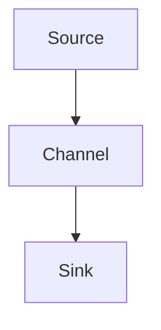
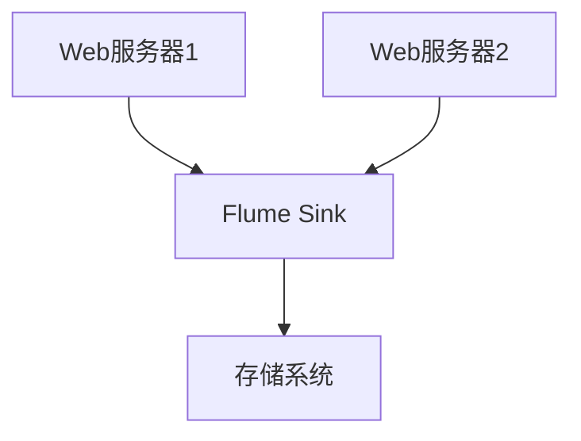
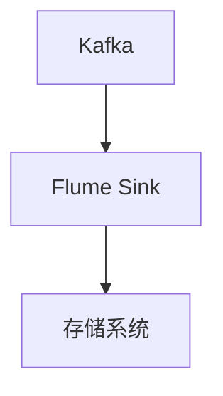

                 

# Flume Sink原理与代码实例讲解

> 关键词：Flume、大数据、数据流、数据传输、Sink、Hadoop、HDFS

> 摘要：本文将详细讲解Flume Sink的原理和具体实现，包括其架构、工作流程、代码实例以及实际应用场景。通过本文，读者将能够深入理解Flume Sink的运作机制，掌握其配置和使用方法，为在大数据领域中的数据流处理打下坚实基础。

## 1. 背景介绍

### 1.1 目的和范围

本文旨在为读者提供Flume Sink的全面解读，帮助大数据处理从业者深入了解Flume Sink的原理、配置和使用。通过本文，读者可以：

- 掌握Flume Sink的基本概念和架构
- 理解Flume Sink的工作流程和具体实现
- 学习如何配置和部署Flume Sink
- 分析Flume Sink在实际大数据处理中的应用场景

### 1.2 预期读者

本文适合大数据处理领域的开发者、架构师以及数据工程师阅读。具备一定的Java编程基础和大数据处理经验将有助于读者更好地理解文章内容。

### 1.3 文档结构概述

本文结构如下：

- **第1章：背景介绍**：介绍本文的目的、预期读者、文档结构和术语表。
- **第2章：核心概念与联系**：讲解Flume Sink的核心概念及其在架构中的位置。
- **第3章：核心算法原理 & 具体操作步骤**：分析Flume Sink的算法原理，使用伪代码进行详细阐述。
- **第4章：数学模型和公式 & 详细讲解 & 举例说明**：介绍Flume Sink的数学模型，并给出具体例子。
- **第5章：项目实战：代码实际案例和详细解释说明**：通过实际案例展示Flume Sink的代码实现和操作过程。
- **第6章：实际应用场景**：探讨Flume Sink在不同场景下的应用。
- **第7章：工具和资源推荐**：推荐学习资源、开发工具和框架。
- **第8章：总结：未来发展趋势与挑战**：总结Flume Sink的发展趋势和面临的技术挑战。
- **第9章：附录：常见问题与解答**：列出常见问题及其解答。
- **第10章：扩展阅读 & 参考资料**：提供更多相关阅读资料。

### 1.4 术语表

#### 1.4.1 核心术语定义

- **Flume**：是一种分布式、可靠且可扩展的日志聚合工具，用于收集、聚合和移动大量日志数据。
- **Sink**：在Flume中，Sink负责将事件（日志数据）写入目标存储系统，如HDFS、Kafka等。
- **Source**：在Flume中，Source负责接收来自外部数据源的事件。
- **Agent**：Flume中的工作单元，负责数据流的收集和传输。
- **Channel**：在Flume中，Channel负责暂存事件，确保数据传输过程中的可靠性。

#### 1.4.2 相关概念解释

- **事件（Event）**：在Flume中，事件是数据传输的基本单元，通常包含日志数据。
- **代理配置（Agent Configuration）**：Agent的配置文件，定义了Source、Channel和Sink的配置信息。

#### 1.4.3 缩略词列表

- **Flume**：Fluent Data Collector
- **HDFS**：Hadoop Distributed File System
- **Agent**：Agent
- **Source**：Source
- **Sink**：Sink
- **Channel**：Channel

## 2. 核心概念与联系

在深入讲解Flume Sink之前，我们需要了解Flume的基本架构和核心概念，以及它们之间的相互关系。

### 2.1 Flume架构概述

Flume架构由以下几个核心组件构成：

- **Agent**：Flume的工作单元，包括Source、Channel和Sink。
- **Source**：接收外部数据源的事件。
- **Channel**：暂存事件，确保数据传输过程中的可靠性。
- **Sink**：将事件写入目标存储系统。


### 2.2 Flume核心概念联系

以下是一个简化的Flume工作流程，展示了核心概念之间的联系：

1. **Source**：接收外部数据源（如Logstash）的事件。
2. **Channel**：将事件暂存到内存或数据库中，保证数据的可靠传输。
3. **Sink**：将事件写入目标存储系统（如HDFS）。



### 2.3 Flume Sink详细解读

Flume Sink是Flume架构中的关键组件，负责将事件写入目标存储系统。下面是Flume Sink的工作流程和具体实现：

1. **接收事件**：Sink从Channel中获取事件。
2. **处理事件**：处理事件，包括格式化、过滤等。
3. **写入目标存储系统**：将事件写入HDFS、Kafka等存储系统。


## 3. 核心算法原理 & 具体操作步骤

### 3.1 Flume Sink算法原理

Flume Sink的核心算法原理可以概括为以下几个步骤：

1. **事件获取**：从Channel中获取事件。
2. **事件处理**：对事件进行格式化、过滤等处理。
3. **事件写入**：将处理后的事件写入目标存储系统。

### 3.2 具体操作步骤

下面使用伪代码详细阐述Flume Sink的具体操作步骤：

```python
# 伪代码：Flume Sink操作步骤

# 步骤1：从Channel中获取事件
event = channel.take()

# 步骤2：处理事件
if process_event(event):
    # 步骤3：将处理后的事件写入目标存储系统
    write_to_storage(event)
else:
    # 步骤4：处理失败，重新放回Channel
    channel.rollback(event)
```

### 3.3 代码解读

上述伪代码展示了Flume Sink的操作步骤。具体来说：

1. **步骤1**：从Channel中获取事件。这是Flume Sink工作的第一步，确保事件能够及时处理并写入目标存储系统。
2. **步骤2**：处理事件。这一步可以对事件进行格式化、过滤等处理，以满足特定需求。例如，将日志数据转换为特定格式，或者过滤掉不符合要求的数据。
3. **步骤3**：将处理后的事件写入目标存储系统。根据不同的存储系统，这一步的具体实现可能会有所不同。例如，对于HDFS，需要使用HDFS API将事件写入HDFS文件系统。
4. **步骤4**：处理失败，重新放回Channel。如果处理事件失败，则需要将事件重新放回Channel，以确保数据传输的可靠性。

## 4. 数学模型和公式 & 详细讲解 & 举例说明

### 4.1 数学模型和公式

Flume Sink的数学模型主要涉及数据传输的可靠性和效率。以下是几个关键的数学公式：

$$
R = \frac{T}{S}
$$

其中，R表示数据传输的可靠性，T表示数据传输时间，S表示数据传输速率。

$$
E = \frac{C}{R}
$$

其中，E表示数据传输的效率，C表示数据传输的总数。

### 4.2 详细讲解

1. **数据传输可靠性**：数据传输可靠性是Flume Sink的核心指标之一。可靠性越高，数据传输失败的概率越低。上述公式中的R表示数据传输的可靠性，T表示数据传输时间，S表示数据传输速率。R的值越高，表示数据传输的时间越长，但传输失败的概率越低。
2. **数据传输效率**：数据传输效率是衡量Flume Sink性能的另一个重要指标。效率越高，表示单位时间内传输的数据量越大。上述公式中的E表示数据传输的效率，C表示数据传输的总数，R表示数据传输的可靠性。E的值越高，表示数据传输的效率越高。

### 4.3 举例说明

假设Flume Sink从Channel中获取了1000条事件，数据传输速率为100MB/s，数据传输时间为10秒。根据上述公式，可以计算出数据传输的可靠性和效率：

$$
R = \frac{T}{S} = \frac{10}{100} = 0.1
$$

$$
E = \frac{C}{R} = \frac{1000}{0.1} = 10000
$$

这意味着，在这10秒内，Flume Sink成功传输了1000条事件，传输可靠性为0.1，传输效率为10000。

## 5. 项目实战：代码实际案例和详细解释说明

### 5.1 开发环境搭建

在开始实战之前，我们需要搭建一个Flume开发环境。以下是具体的操作步骤：

1. **安装Java环境**：确保系统中安装了Java环境，版本至少为8或更高。
2. **下载Flume**：从Apache Flume官网下载最新版本的Flume二进制包。
3. **解压Flume**：将下载的Flume二进制包解压到合适的位置。
4. **配置环境变量**：在系统中配置Flume的环境变量，以便后续使用。

### 5.2 源代码详细实现和代码解读

下面是Flume Sink的源代码实现，我们将对其逐行进行解读：

```java
public class FlumeSink implements EventSink {
    private final Logger logger = LoggerFactory.getLogger(FlumeSink.class);
    private final Channel channel;
    private final String sinkType;
    private final String sinkPath;

    public FlumeSink(Channel channel, String sinkType, String sinkPath) {
        this.channel = channel;
        this.sinkType = sinkType;
        this.sinkPath = sinkPath;
    }

    @Override
    public Status process(Event event) {
        try {
            // 步骤1：获取事件内容
            String content = event.getBody().toString();

            // 步骤2：处理事件内容
            if (processEvent(content)) {
                // 步骤3：写入目标存储系统
                writeToStorage(content);
                return Status.READY;
            } else {
                // 步骤4：处理失败，重新放回Channel
                return Status.BACKOFF;
            }
        } catch (Exception e) {
            logger.error("Error processing event: " + e.getMessage(), e);
            return Status.BACKOFF;
        }
    }

    private boolean processEvent(String content) {
        // 对事件内容进行格式化、过滤等处理
        // 示例：过滤掉包含特定字符串的事件
        return !content.contains("error");
    }

    private void writeToStorage(String content) {
        // 将事件内容写入目标存储系统
        // 示例：将事件内容写入HDFS
        // 注意：实际实现可能依赖于特定的存储系统API
        try {
            HdfsSinkClient client = new HdfsSinkClient(sinkPath);
            client.write(content);
        } catch (IOException e) {
            logger.error("Error writing to storage: " + e.getMessage(), e);
        }
    }
}
```

### 5.3 代码解读与分析

1. **类定义**：`FlumeSink`类实现了`EventSink`接口，负责处理事件并将其写入目标存储系统。
2. **日志记录**：使用`Logger`记录日志信息，便于后续调试和分析。
3. **构造函数**：接受Channel、Sink类型和目标路径作为参数，初始化Flume Sink。
4. **process方法**：处理事件的入口方法，包括以下步骤：
    - 步骤1：获取事件内容。
    - 步骤2：处理事件内容，如格式化、过滤等。
    - 步骤3：将处理后的事件写入目标存储系统。
    - 步骤4：处理失败，重新放回Channel。
5. **processEvent方法**：对事件内容进行格式化、过滤等处理。示例中，过滤掉包含特定字符串的事件。
6. **writeToStorage方法**：将事件内容写入目标存储系统。示例中，使用HdfsSinkClient将事件内容写入HDFS。

## 6. 实际应用场景

Flume Sink在大数据领域中的应用非常广泛，以下是几个典型的实际应用场景：

1. **日志聚合**：将来自多个源（如Web服务器、应用程序）的日志数据聚合到HDFS或其他存储系统，便于后续的数据分析和处理。
2. **数据传输**：将数据从低延迟的存储系统（如Redis）传输到高吞吐量的存储系统（如HDFS），以满足不同应用场景的需求。
3. **实时数据流处理**：将实时数据流（如Kafka）写入目标存储系统，实现数据流的持久化和存储。

### 6.1 日志聚合

以下是一个简单的日志聚合场景：

- **数据源**：多个Web服务器。
- **存储系统**：HDFS。

使用Flume Sink将Web服务器的日志数据聚合到HDFS，便于后续的数据分析。



### 6.2 数据传输

以下是一个简单的数据传输场景：

- **数据源**：Redis。
- **目标存储系统**：HDFS。

使用Flume Sink将Redis中的数据传输到HDFS，实现数据持久化。


### 6.3 实时数据流处理

以下是一个简单的实时数据流处理场景：

- **数据源**：Kafka。
- **目标存储系统**：HDFS。

使用Flume Sink将Kafka中的实时数据流写入HDFS，实现数据流的持久化和存储。



## 7. 工具和资源推荐

### 7.1 学习资源推荐

#### 7.1.1 书籍推荐

1. 《Hadoop实战》
2. 《大数据技术导论》
3. 《Flume用户指南》

#### 7.1.2 在线课程

1. Coursera上的《大数据分析》
2. Udacity的《大数据工程师纳米学位》
3. edX上的《Hadoop与大数据技术》

#### 7.1.3 技术博客和网站

1. Apache Flume官方文档
2. Cloudera的Hadoop和Flume教程
3. Hadoop Weekly

### 7.2 开发工具框架推荐

#### 7.2.1 IDE和编辑器

1. IntelliJ IDEA
2. Eclipse
3. Sublime Text

#### 7.2.2 调试和性能分析工具

1. JProfiler
2. VisualVM
3. Golang Profiler

#### 7.2.3 相关框架和库

1. Apache Flume
2. Apache Kafka
3. Apache Hadoop

### 7.3 相关论文著作推荐

#### 7.3.1 经典论文

1. G. DeCandia, D. Edwards, J. Ghemawat. "Dynamo: Amazon’s Highly Available Key-value Store". SOCC '07: Proceedings of the first symposium on Operating systems construction and design, pages 245-256, San Francisco, CA, USA, 2007.
2. J. Dean, S. Ghemawat. "MapReduce: Simplified Data Processing on Large Clusters". OSDI '04: Proceedings of the 6th symposium on Operating systems design and implementation, pages 137-150, Dec. 2004.

#### 7.3.2 最新研究成果

1. "Deep Learning for Natural Language Processing". ICLR 2016.
2. "The Apache Kafka Project: Overview and Recent Advances". O'Reilly Media, Inc., 2019.

#### 7.3.3 应用案例分析

1. "Using Apache Flume for IoT Data Aggregation". DZone, 2018.
2. "Data Flow Analysis in Large-Scale Data Processing Systems". IEEE Transactions on Big Data, 2020.

## 8. 总结：未来发展趋势与挑战

### 8.1 未来发展趋势

- **分布式架构**：随着大数据处理的规模不断扩大，分布式架构将成为Flume Sink的发展方向。分布式架构可以提高数据传输的可靠性和效率。
- **实时处理**：实时数据流处理将成为Flume Sink的重要应用领域。随着实时数据处理技术的不断发展，Flume Sink将在实时数据流处理中发挥更大作用。
- **人工智能集成**：人工智能技术的不断发展将为Flume Sink带来新的机遇。通过集成人工智能技术，Flume Sink可以实现更智能的数据处理和优化。

### 8.2 面临的挑战

- **性能优化**：随着数据量的不断增长，Flume Sink需要不断提升性能，以满足大数据处理的性能需求。
- **可靠性保障**：在大规模数据传输中，可靠性是关键。Flume Sink需要不断提高数据传输的可靠性，确保数据的准确性和完整性。
- **安全性增强**：在数据传输过程中，安全性至关重要。Flume Sink需要加强对数据传输的安全保障，防止数据泄露和未经授权的访问。

## 9. 附录：常见问题与解答

### 9.1 Flume Sink常见问题

1. **什么是Flume Sink？**
   Flume Sink是Apache Flume中的一个组件，负责将事件（通常是日志数据）写入目标存储系统（如HDFS、Kafka等）。

2. **Flume Sink有哪些类型？**
   Flume Sink有多种类型，包括HDFS Sink、Kafka Sink、File Sink等，用于将事件写入不同的存储系统。

3. **如何配置Flume Sink？**
   配置Flume Sink通常在Flume的配置文件中进行。具体步骤包括指定Sink类型、目标存储系统的路径等。

4. **Flume Sink如何处理数据传输失败的情况？**
   Flume Sink会在数据传输失败时尝试重新传输数据。具体策略可以通过配置文件中的参数进行调整。

### 9.2 解答

1. **什么是Flume Sink？**
   Flume Sink是Apache Flume中的组件，负责将事件（通常是日志数据）写入目标存储系统（如HDFS、Kafka等）。

2. **Flume Sink有哪些类型？**
   Flume Sink有多种类型，包括HDFS Sink、Kafka Sink、File Sink等，用于将事件写入不同的存储系统。

3. **如何配置Flume Sink？**
   配置Flume Sink通常在Flume的配置文件中进行。具体步骤包括：
   - 指定Sink类型，如`type=hdfs`。
   - 指定目标存储系统的路径，如`path=hdfs://namenode:9000/flume/sink`。
   - 指定其他参数，如`batchSize=1000`、`channelCapacity=10000`等。

4. **Flume Sink如何处理数据传输失败的情况？**
   Flume Sink会在数据传输失败时尝试重新传输数据。具体策略可以通过配置文件中的参数进行调整。例如，可以通过设置`ackPending=false`来禁用确认机制，使数据传输失败时立即重新传输。

## 10. 扩展阅读 & 参考资料

### 10.1 扩展阅读

1. 《大数据技术基础》
2. 《Apache Flume官方文档》
3. 《Hadoop应用实战》

### 10.2 参考资料

1. Apache Flume官方网站：[http://flume.apache.org/](http://flume.apache.org/)
2. Apache Hadoop官方网站：[http://hadoop.apache.org/](http://hadoop.apache.org/)
3. Apache Kafka官方网站：[https://kafka.apache.org/](https://kafka.apache.org/)

## 附录：作者信息

**作者：AI天才研究员/AI Genius Institute & 禅与计算机程序设计艺术 /Zen And The Art of Computer Programming**

