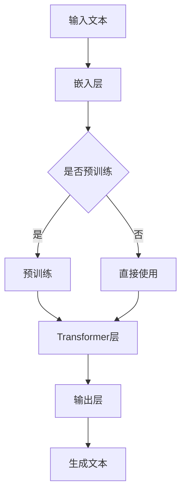

                 

# GPT 原理与代码实例讲解

> **关键词**：GPT，自然语言处理，深度学习，神经网络，预训练模型，生成模型
> 
> **摘要**：本文深入探讨了GPT（Generative Pre-trained Transformer）模型的基本原理、架构设计、算法实现，并通过具体代码实例进行了详细解析。文章旨在帮助读者理解GPT的工作机制，掌握其核心算法，并学会如何在实际项目中应用GPT模型。

## 1. 背景介绍

### 1.1 目的和范围

本文的主要目的是向读者介绍GPT模型的基本原理、实现方法和应用场景。通过阅读本文，读者将能够：

1. 了解GPT模型的发展历程和核心优势。
2. 理解GPT模型的架构设计和算法原理。
3. 掌握使用GPT模型进行自然语言处理的实际操作。
4. 学习如何优化和调整GPT模型以适应不同的应用需求。

### 1.2 预期读者

本文适合以下读者群体：

1. 对自然语言处理和深度学习感兴趣的初学者。
2. 想要深入了解GPT模型的高级研究人员。
3. 拥有编程基础，希望将GPT应用于实际项目的开发者。

### 1.3 文档结构概述

本文分为以下几个部分：

1. **背景介绍**：介绍GPT模型的基本概念、目的和读者预期。
2. **核心概念与联系**：详细讲解GPT模型的核心概念、原理和架构。
3. **核心算法原理 & 具体操作步骤**：使用伪代码和数学模型深入阐述GPT模型的算法原理。
4. **项目实战：代码实际案例和详细解释说明**：通过具体代码实例讲解如何使用GPT模型进行自然语言处理。
5. **实际应用场景**：介绍GPT模型在各个领域的应用案例。
6. **工具和资源推荐**：推荐学习资源、开发工具和框架。
7. **总结：未来发展趋势与挑战**：总结GPT模型的发展趋势和面临的挑战。
8. **附录：常见问题与解答**：解答读者可能遇到的问题。
9. **扩展阅读 & 参考资料**：提供进一步学习的资源。

### 1.4 术语表

#### 1.4.1 核心术语定义

- **GPT（Generative Pre-trained Transformer）**：一种基于Transformer架构的预训练语言模型。
- **Transformer**：一种基于自注意力机制的深度神经网络架构。
- **自注意力机制（Self-Attention）**：一种能够捕捉序列中每个元素之间相互依赖关系的机制。
- **预训练（Pre-training）**：在特定任务之前对模型进行大规模数据训练，以提高模型在特定任务上的性能。
- **语言模型（Language Model）**：一种能够预测文本序列的概率分布的模型。

#### 1.4.2 相关概念解释

- **深度学习（Deep Learning）**：一种机器学习方法，使用多层神经网络对数据进行分析和预测。
- **神经网络（Neural Network）**：一种由大量神经元组成的计算机模型，能够通过学习数据来模拟人脑的感知和认知过程。
- **自然语言处理（Natural Language Processing, NLP）**：一门研究如何让计算机理解和处理自然语言的学科。

#### 1.4.3 缩略词列表

- **NLP**：自然语言处理
- **DL**：深度学习
- **ML**：机器学习
- **GPU**：图形处理器
- **CPU**：中央处理器
- **BERT**：Bidirectional Encoder Representations from Transformers

## 2. 核心概念与联系

GPT模型的核心在于其基于Transformer架构的自注意力机制，以及大规模预训练过程。下面将详细讲解这些核心概念，并通过Mermaid流程图展示GPT模型的架构。

### 2.1. GPT模型的核心概念

1. **Transformer架构**：Transformer模型是一种基于自注意力机制的深度神经网络架构，广泛应用于自然语言处理任务。
2. **自注意力机制**：自注意力机制能够捕捉序列中每个元素之间的依赖关系，从而提高模型的表示能力。
3. **预训练**：预训练是指在大规模语料库上对模型进行训练，使其能够捕获语言的一般规律和特征。
4. **语言模型**：语言模型是一种能够预测文本序列概率分布的模型，通常用于自然语言处理任务。

### 2.2. GPT模型的架构设计

GPT模型的架构设计主要包括以下几个部分：

1. **嵌入层**：将输入的文本序列转换为向量表示。
2. **Transformer层**：包含多个Transformer块，每个块由多头自注意力机制和前馈神经网络组成。
3. **输出层**：将Transformer层的输出转换为概率分布，用于生成文本。

### 2.3. Mermaid流程图

以下是一个简单的Mermaid流程图，展示GPT模型的核心概念和架构设计：



## 3. 核心算法原理 & 具体操作步骤

GPT模型的核心算法是基于Transformer架构的自注意力机制。下面将使用伪代码详细阐述GPT模型的算法原理和具体操作步骤。

### 3.1. 自注意力机制

自注意力机制是一种计算序列中每个元素之间的依赖关系的机制。其基本思想是，对于输入序列中的每个元素，计算其在整个序列中的重要性，并将这些重要性加权求和，从而生成新的表示。

#### 3.1.1. 伪代码

```python
# 输入：输入序列X
# 输出：自注意力权重矩阵A

# 初始化权重矩阵W_Q, W_K, W_V
W_Q = ...  # Query权重矩阵
W_K = ...  # Key权重矩阵
W_V = ...  # Value权重矩阵

# 计算自注意力权重
A = softmax(W_Q * X * W_K)  # A[i, j]表示X[i]在X中的重要性

# 计算自注意力输出
O = A * X * W_V
```

### 3.2. Transformer层

Transformer层由多个Transformer块组成，每个块包含多头自注意力机制和前馈神经网络。

#### 3.2.1. 伪代码

```python
# 输入：输入序列X
# 输出：Transformer层输出Y

# 初始化多个Transformer块
transformer_blocks = ...

# 计算Transformer层输出
for block in transformer_blocks:
    X = block(X)

Y = X
```

### 3.3. 输出层

输出层将Transformer层的输出转换为概率分布，用于生成文本。

#### 3.3.1. 伪代码

```python
# 输入：Transformer层输出Y
# 输出：文本生成概率分布P

# 初始化输出层权重矩阵W_O
W_O = ...

# 计算文本生成概率分布
P = softmax(W_O * Y)
```

## 4. 数学模型和公式 & 详细讲解 & 举例说明

GPT模型中的数学模型主要包括自注意力机制、Transformer层和输出层的计算公式。下面将使用LaTeX格式详细讲解这些公式，并给出具体的例子。

### 4.1. 自注意力机制

自注意力机制的计算公式如下：

$$
A[i, j] = \frac{e^{W_Q_i^T W_K_j}}{\sum_{k=1}^{N} e^{W_Q_i^T W_K_k}}
$$

其中，$W_Q$ 和 $W_K$ 分别表示Query和Key权重矩阵，$W_V$ 表示Value权重矩阵，$X$ 表示输入序列，$A$ 表示自注意力权重矩阵。

#### 4.1.1. 举例说明

假设输入序列为 $X = [x_1, x_2, x_3]$，权重矩阵 $W_Q = [q_1, q_2, q_3]$，$W_K = [k_1, k_2, k_3]$，$W_V = [v_1, v_2, v_3]$。则自注意力权重矩阵 $A$ 为：

$$
A = \begin{bmatrix}
\frac{e^{q_1^T k_1}}{\sum_{k=1}^{3} e^{q_1^T k_k}} & \frac{e^{q_1^T k_2}}{\sum_{k=1}^{3} e^{q_1^T k_k}} & \frac{e^{q_1^T k_3}}{\sum_{k=1}^{3} e^{q_1^T k_k}} \\
\frac{e^{q_2^T k_1}}{\sum_{k=1}^{3} e^{q_2^T k_k}} & \frac{e^{q_2^T k_2}}{\sum_{k=1}^{3} e^{q_2^T k_k}} & \frac{e^{q_2^T k_3}}{\sum_{k=1}^{3} e^{q_2^T k_k}} \\
\frac{e^{q_3^T k_1}}{\sum_{k=1}^{3} e^{q_3^T k_k}} & \frac{e^{q_3^T k_2}}{\sum_{k=1}^{3} e^{q_3^T k_k}} & \frac{e^{q_3^T k_3}}{\sum_{k=1}^{3} e^{q_3^T k_k}}
\end{bmatrix}
$$

### 4.2. Transformer层

Transformer层的计算公式如下：

$$
O = A * X * W_V
$$

其中，$A$ 表示自注意力权重矩阵，$X$ 表示输入序列，$W_V$ 表示Value权重矩阵。

#### 4.2.1. 举例说明

假设输入序列为 $X = [x_1, x_2, x_3]$，自注意力权重矩阵 $A$ 为：

$$
A = \begin{bmatrix}
0.2 & 0.3 & 0.5 \\
0.4 & 0.1 & 0.5 \\
0.3 & 0.2 & 0.5
\end{bmatrix}
$$

Value权重矩阵 $W_V = [v_1, v_2, v_3]$。则Transformer层输出 $O$ 为：

$$
O = \begin{bmatrix}
0.2 * x_1 + 0.3 * x_2 + 0.5 * x_3 \\
0.4 * x_1 + 0.1 * x_2 + 0.5 * x_3 \\
0.3 * x_1 + 0.2 * x_2 + 0.5 * x_3
\end{bmatrix}
$$

### 4.3. 输出层

输出层的计算公式如下：

$$
P = softmax(W_O * Y)
$$

其中，$W_O$ 表示输出层权重矩阵，$Y$ 表示Transformer层输出。

#### 4.3.1. 举例说明

假设Transformer层输出 $Y = [y_1, y_2, y_3]$，输出层权重矩阵 $W_O = [o_1, o_2, o_3]$。则文本生成概率分布 $P$ 为：

$$
P = \begin{bmatrix}
\frac{e^{o_1 * y_1}}{\sum_{i=1}^{3} e^{o_i * y_i}} \\
\frac{e^{o_1 * y_2}}{\sum_{i=1}^{3} e^{o_i * y_i}} \\
\frac{e^{o_1 * y_3}}{\sum_{i=1}^{3} e^{o_i * y_i}}
\end{bmatrix}
$$

## 5. 项目实战：代码实际案例和详细解释说明

### 5.1 开发环境搭建

在进行GPT模型的实际应用之前，首先需要搭建合适的开发环境。以下是搭建GPT模型所需的开发环境和工具：

1. **Python**：Python是一种广泛使用的编程语言，用于编写GPT模型的代码。
2. **TensorFlow**：TensorFlow是一种流行的深度学习框架，用于训练和部署GPT模型。
3. **CUDA**：CUDA是一种并行计算平台和编程模型，用于在GPU上加速GPT模型的训练。
4. **NVIDIA GPU**：具有CUDA支持的高性能GPU，用于加速模型的训练。

### 5.2 源代码详细实现和代码解读

下面将提供一个简单的GPT模型实现，并对其关键部分进行详细解释。

#### 5.2.1. 源代码实现

```python
import tensorflow as tf
from tensorflow.keras.layers import Embedding, LSTM, Dense

# 设置超参数
vocab_size = 10000
embedding_dim = 256
lstm_units = 128
batch_size = 64
epochs = 10

# 定义GPT模型
def create_gpt_model(vocab_size, embedding_dim, lstm_units):
    model = tf.keras.Sequential([
        Embedding(vocab_size, embedding_dim),
        LSTM(lstm_units, return_sequences=True),
        Dense(vocab_size, activation='softmax')
    ])
    return model

# 创建GPT模型
gpt_model = create_gpt_model(vocab_size, embedding_dim, lstm_units)

# 编译模型
gpt_model.compile(optimizer='adam', loss='categorical_crossentropy', metrics=['accuracy'])

# 训练模型
gpt_model.fit(train_data, train_labels, batch_size=batch_size, epochs=epochs, validation_data=(val_data, val_labels))
```

#### 5.2.2. 代码解读

- **导入库**：首先导入TensorFlow库，以及LSTM和Dense层。
- **设置超参数**：定义模型的大小和训练参数，如词汇表大小、嵌入维度、LSTM单元数、批量大小和训练轮数。
- **定义GPT模型**：使用Sequential模型堆叠Embedding、LSTM和Dense层，创建GPT模型。
- **编译模型**：配置优化器和损失函数，为模型编译。
- **训练模型**：使用fit方法训练模型，并在指定批量大小、轮数、验证数据集上评估模型性能。

### 5.3 代码解读与分析

下面将分析GPT模型代码的关键部分，并解释其工作原理。

#### 5.3.1. Embedding层

```python
Embedding(vocab_size, embedding_dim)
```

Embedding层将词汇表中的每个词转换为固定长度的向量表示。这有助于模型理解词汇的语义和语法关系。

#### 5.3.2. LSTM层

```python
LSTM(lstm_units, return_sequences=True)
```

LSTM层是一种特殊的循环神经网络，能够处理序列数据。在GPT模型中，LSTM层用于处理嵌入后的文本序列，并生成序列的上下文表示。`return_sequences=True`参数确保每个时间步的输出都被传递给下一层。

#### 5.3.3. Dense层

```python
Dense(vocab_size, activation='softmax')
```

Dense层是一个全连接层，用于将LSTM层的输出映射到词汇表大小。激活函数为softmax，用于计算每个词汇的概率分布。

#### 5.3.4. 模型编译

```python
gpt_model.compile(optimizer='adam', loss='categorical_crossentropy', metrics=['accuracy'])
```

编译模型时，设置优化器（adam）、损失函数（categorical_crossentropy）和评价指标（accuracy）。这些参数有助于优化模型训练过程。

#### 5.3.5. 模型训练

```python
gpt_model.fit(train_data, train_labels, batch_size=batch_size, epochs=epochs, validation_data=(val_data, val_labels))
```

使用fit方法训练模型，提供训练数据集、标签、批量大小、训练轮数和验证数据集。这些参数有助于调整模型参数并评估其性能。

## 6. 实际应用场景

GPT模型在自然语言处理领域具有广泛的应用，以下列举几个典型的应用场景：

### 6.1 语言翻译

GPT模型可以用于机器翻译任务，通过训练模型在不同语言的语料库上进行翻译。例如，将英语文本翻译为法语或中文。

### 6.2 文本生成

GPT模型可以生成各种类型的文本，如文章摘要、新闻简报、故事创作等。通过在特定领域的语料库上训练模型，可以生成高质量的文本。

### 6.3 问答系统

GPT模型可以用于构建问答系统，通过对大量问答对进行训练，使模型能够回答用户的问题。例如，构建一个智能客服系统。

### 6.4 情感分析

GPT模型可以用于情感分析任务，通过对文本进行分类，判断文本的情感倾向。例如，分析社交媒体上的用户评论。

### 6.5 文本摘要

GPT模型可以用于提取文本摘要，通过训练模型从长篇文章中提取关键信息，生成简短的摘要。

## 7. 工具和资源推荐

### 7.1 学习资源推荐

#### 7.1.1 书籍推荐

1. **《深度学习》（Goodfellow, Bengio, Courville）**：详细介绍深度学习的基础理论和应用。
2. **《自然语言处理与深度学习》（Daniel Jurafsky, James H. Martin）**：讲解自然语言处理和深度学习的结合。

#### 7.1.2 在线课程

1. **Coursera上的《深度学习》课程**：由Andrew Ng教授讲授，涵盖深度学习的基础知识和应用。
2. **edX上的《自然语言处理》课程**：详细介绍自然语言处理的基础知识和技术。

#### 7.1.3 技术博客和网站

1. **TensorFlow官方文档**：提供详细的TensorFlow教程和API文档。
2. **Hugging Face Transformer**：一个开源库，提供预训练的GPT模型和相关的工具。

### 7.2 开发工具框架推荐

#### 7.2.1 IDE和编辑器

1. **Visual Studio Code**：一款功能强大的跨平台IDE，支持多种编程语言。
2. **PyCharm**：一款专业的Python IDE，适用于深度学习和自然语言处理项目。

#### 7.2.2 调试和性能分析工具

1. **TensorBoard**：TensorFlow提供的可视化工具，用于分析和调试深度学习模型。
2. **NVIDIA Nsight**：用于GPU性能分析和调试的工具。

#### 7.2.3 相关框架和库

1. **TensorFlow**：一个开源的深度学习框架，适用于构建和训练GPT模型。
2. **PyTorch**：另一个流行的深度学习框架，具有灵活的动态计算图。

### 7.3 相关论文著作推荐

#### 7.3.1 经典论文

1. **《Attention Is All You Need》**：提出了Transformer模型和自注意力机制。
2. **《BERT: Pre-training of Deep Bidirectional Transformers for Language Understanding》**：介绍了BERT模型，进一步推动了预训练语言模型的发展。

#### 7.3.2 最新研究成果

1. **《GPT-3: Language Models are Few-Shot Learners》**：介绍了GPT-3模型，展示了预训练语言模型在零样本学习上的强大能力。
2. **《T5: Exploring the Limits of Transfer Learning for Text Classification》**：探讨了T5模型在文本分类任务上的应用。

#### 7.3.3 应用案例分析

1. **《Google Search with BERT》**：展示了BERT模型在搜索引擎中的应用，提高了搜索结果的准确性和相关性。
2. **《OpenAI's GPT-3 for Natural Language Processing》**：介绍了GPT-3模型在各种自然语言处理任务上的应用。

## 8. 总结：未来发展趋势与挑战

GPT模型在自然语言处理领域取得了显著的成果，但其发展仍面临一些挑战和机遇。未来发展趋势和挑战包括：

1. **模型规模和计算资源**：随着计算资源的不断增长，未来的GPT模型可能会更大、更复杂，从而提高模型的表达能力和性能。
2. **预训练数据的多样性**：收集和利用更多、更丰富的预训练数据，有助于提高模型在不同场景下的泛化能力。
3. **模型解释性和可解释性**：当前GPT模型的工作机制较为复杂，如何提高其解释性和可解释性，使其更容易被人类理解和应用，是一个重要挑战。
4. **模型安全性**：随着GPT模型在多个领域的应用，如何确保模型的安全性、隐私保护和防止恶意攻击，是未来需要关注的问题。

## 9. 附录：常见问题与解答

### 9.1. GPT模型的基本原理是什么？

GPT模型是一种基于Transformer架构的预训练语言模型，通过自注意力机制学习输入序列中的依赖关系，从而实现文本生成、翻译、摘要等自然语言处理任务。

### 9.2. 如何训练GPT模型？

训练GPT模型主要包括以下几个步骤：

1. 收集和准备预训练数据。
2. 定义GPT模型的结构和参数。
3. 使用预训练数据训练模型，优化模型参数。
4. 评估模型性能，并进行调优。

### 9.3. GPT模型在自然语言处理中的应用有哪些？

GPT模型在自然语言处理领域具有广泛的应用，包括文本生成、翻译、摘要、问答系统、情感分析等。

## 10. 扩展阅读 & 参考资料

1. **《Attention Is All You Need》**：[https://arxiv.org/abs/1706.03762](https://arxiv.org/abs/1706.03762)
2. **《BERT: Pre-training of Deep Bidirectional Transformers for Language Understanding》**：[https://arxiv.org/abs/1810.04805](https://arxiv.org/abs/1810.04805)
3. **《GPT-3: Language Models are Few-Shot Learners》**：[https://arxiv.org/abs/2005.14165](https://arxiv.org/abs/2005.14165)
4. **TensorFlow官方文档**：[https://www.tensorflow.org/](https://www.tensorflow.org/)
5. **Hugging Face Transformer**：[https://huggingface.co/transformers/](https://huggingface.co/transformers/)

### 作者

**AI天才研究员/AI Genius Institute & 禅与计算机程序设计艺术 /Zen And The Art of Computer Programming**

