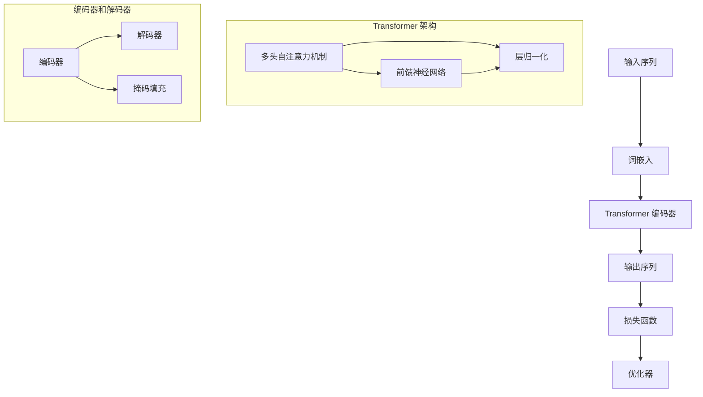

                 

# GPT原理与代码实例讲解

> 关键词：GPT, Transformer, 自然语言处理，深度学习，代码实例，神经网络架构

> 摘要：本文将深入探讨GPT（Generative Pretrained Transformer）模型的原理，结构，核心算法，以及如何通过具体的代码实例来理解其实现细节。我们将从GPT模型的基本概念出发，逐步讲解其架构，算法原理，数学模型，并通过实际项目案例，展示如何在实际应用中构建和使用GPT模型。

## 1. 背景介绍

### 1.1 目的和范围

本文旨在为对自然语言处理（NLP）和深度学习感兴趣的读者提供一个系统性的GPT模型讲解。我们将从基本原理开始，逐步深入，帮助读者理解GPT模型的内在机制和实现细节。通过本文的学习，读者应能够：

- 理解GPT模型的基本概念和架构。
- 掌握GPT模型的核心算法原理。
- 能够通过实际代码实例，分析和实现GPT模型。

### 1.2 预期读者

本文适合以下读者群体：

- 对自然语言处理和深度学习有一定了解的技术人员。
- 想要深入了解Transformer架构的研究人员。
- 任何对构建和优化大规模语言模型有兴趣的读者。

### 1.3 文档结构概述

本文将按照以下结构展开：

- 第1章：背景介绍，包括目的和范围、预期读者以及文档结构概述。
- 第2章：核心概念与联系，介绍GPT模型的基础概念和架构。
- 第3章：核心算法原理 & 具体操作步骤，详细讲解GPT模型的核心算法。
- 第4章：数学模型和公式 & 详细讲解 & 举例说明，介绍GPT模型的数学基础。
- 第5章：项目实战：代码实际案例和详细解释说明，展示GPT模型在实践中的应用。
- 第6章：实际应用场景，探讨GPT模型在不同领域的应用。
- 第7章：工具和资源推荐，为读者提供学习资源和开发工具的建议。
- 第8章：总结：未来发展趋势与挑战，展望GPT模型的未来发展。
- 第9章：附录：常见问题与解答，提供对常见问题的解答。
- 第10章：扩展阅读 & 参考资料，为读者提供进一步学习和研究的资源。

### 1.4 术语表

在本文中，我们将使用一些专业术语。以下是对这些术语的简要定义：

#### 1.4.1 核心术语定义

- **GPT**：Generative Pretrained Transformer的缩写，是一种基于Transformer架构的预训练语言模型。
- **Transformer**：一种基于自注意力机制的深度神经网络架构，特别适用于序列数据的处理。
- **自注意力（Self-Attention）**：一种计算方法，允许模型在序列的每个位置关注其他所有位置的信息。
- **预训练（Pretraining）**：在特定任务之前，使用大量未标记的数据对模型进行训练，以获得通用语言表示能力。
- **微调（Fine-tuning）**：在预训练的基础上，针对具体任务进行额外的训练，以提高模型在特定领域的性能。

#### 1.4.2 相关概念解释

- **序列数据（Sequential Data）**：具有固定顺序的数据，如文本、时间序列等。
- **词嵌入（Word Embedding）**：将单词转换为向量表示，以便在神经网络中处理。
- **损失函数（Loss Function）**：用于评估模型预测和实际输出之间的差异的函数。
- **优化器（Optimizer）**：用于调整模型参数，以最小化损失函数的算法。

#### 1.4.3 缩略词列表

- **GPU**：Graphics Processing Unit，图形处理器。
- **NLP**：Natural Language Processing，自然语言处理。
- **DL**：Deep Learning，深度学习。
- **CNN**：Convolutional Neural Network，卷积神经网络。
- **RNN**：Recurrent Neural Network，循环神经网络。

## 2. 核心概念与联系

在深入讲解GPT模型之前，我们需要了解其核心概念和架构。本节将通过Mermaid流程图展示GPT模型的关键组成部分和它们之间的关系。

### Mermaid 流程图



### 流程图解释

1. **输入序列**：GPT模型接受一段文本序列作为输入。
2. **词嵌入**：将文本序列中的每个单词转换为固定大小的向量表示。
3. **Transformer 编码器**：编码器由多个编码层组成，每层包含多头自注意力机制和前馈神经网络。
4. **输出序列**：编码器输出被送入解码器，解码器生成预测的输出序列。
5. **损失函数**：通过计算预测输出与实际输出之间的差异来评估模型性能。
6. **优化器**：用于调整模型参数，以最小化损失函数。

在下一节中，我们将深入讲解GPT模型的核心算法原理和具体操作步骤。

## 3. 核心算法原理 & 具体操作步骤

GPT模型的核心算法基于Transformer架构，这是一种基于自注意力机制的深度神经网络。本节将详细讲解GPT模型的核心算法原理，并使用伪代码来描述其具体操作步骤。

### 3.1 Transformer 架构

Transformer架构的核心是多头自注意力机制，它允许模型在序列的每个位置关注其他所有位置的信息。以下是Transformer编码器和解码器的基本结构：

#### 编码器（Encoder）

每层编码器包含以下组件：

1. **多头自注意力机制**：计算输入序列的注意力权重，生成上下文表示。
2. **前馈神经网络**：对自注意力层的输出进行进一步处理。
3. **层归一化**：对自注意力和前馈神经网络层的输出进行归一化。
4. **残差连接**：在每层编码器之前添加残差连接，以防止信息损失。

#### 解码器（Decoder）

每层解码器包含以下组件：

1. **掩码填充**：在解码器中，目标序列在编码阶段被遮挡，以防止信息泄露。
2. **多头自注意力机制**：计算输入序列的注意力权重，生成上下文表示。
3. **交叉注意力机制**：计算编码器输出和当前解码器输出的注意力权重。
4. **前馈神经网络**：对自注意力层的输出进行进一步处理。
5. **层归一化**：对自注意力和前馈神经网络层的输出进行归一化。
6. **残差连接**：在每层解码器之前添加残差连接。

### 3.2 伪代码

以下是GPT模型的核心算法的伪代码：

```python
# GPT模型核心算法伪代码

# 自注意力机制
def multi_head_attention(q, k, v, d_k, d_v, n_heads):
    # 计算查询（Query）、键（Key）和值（Value）的线性变换
    Q = linear(q, d_k, n_heads)
    K = linear(k, d_k, n_heads)
    V = linear(v, d_v, n_heads)
    
    # 计算自注意力得分
    scores = dot(Q, K.T) / sqrt(d_k)
    
    # 应用于掩码和softmax
    masks = masked_softmax(scores, mask)
    output = dot(masks, V)
    
    # 重组多头输出
    output = rearrange(output, "..., n_heads, d_v") 
    
    return output

# 前馈神经网络
def feed_forward(input, d_inner, d_outer):
    return linear(input, d_outer) + linear(input, d_inner) 

# Transformer编码器层
def transformer_encoder(input, n_heads, d_model, d_inner, layer_norm_eps):
    output = input
    
    for i in range(num_layers):
        layer = TransformerLayer(input, n_heads, d_model, d_inner, layer_norm_eps)
        output = layer(output)
        
    return output

# Transformer解码器层
def transformer_decoder(input, n_heads, d_model, d_inner, mask, layer_norm_eps):
    output = input
    
    for i in range(num_layers):
        layer = TransformerDecoderLayer(input, n_heads, d_model, d_inner, mask, layer_norm_eps)
        output = layer(output)
        
    return output

# GPT模型训练过程
def train_gpt(model, inputs, targets, optimizer, loss_function):
    optimizer.zero_grad()
    
    outputs = model(inputs)
    
    loss = loss_function(outputs, targets)
    
    loss.backward()
    
    optimizer.step()
    
    return loss
```

在这个伪代码中，`multi_head_attention` 函数实现了多头自注意力机制，`feed_forward` 函数实现了前馈神经网络，`transformer_encoder` 和 `transformer_decoder` 函数分别实现了编码器和解码器的训练过程。`train_gpt` 函数是训练过程的入口，它负责优化模型参数。

在下一节中，我们将详细讲解GPT模型的数学模型和公式。

## 4. 数学模型和公式 & 详细讲解 & 举例说明

GPT模型的核心算法是基于Transformer架构，这种架构依赖于一系列数学模型和公式。在本节中，我们将详细讲解这些数学模型和公式，并通过具体示例来说明它们的应用。

### 4.1 自注意力（Self-Attention）

自注意力机制是Transformer架构的核心，它允许模型在序列的每个位置关注其他所有位置的信息。自注意力的计算公式如下：

\[ \text{Attention}(Q, K, V) = \text{softmax}\left(\frac{QK^T}{\sqrt{d_k}}\right)V \]

其中：

- \( Q \) 是查询（Query）向量，表示输入序列的每个位置。
- \( K \) 是键（Key）向量，表示输入序列的每个位置。
- \( V \) 是值（Value）向量，表示输入序列的每个位置。
- \( d_k \) 是键向量的维度。
- \( \text{softmax} \) 是一个激活函数，用于将注意力权重转换为概率分布。

#### 示例

假设我们有一个长度为3的输入序列，其词嵌入向量为：

\[ 
\begin{align*}
Q &= \begin{bmatrix}
0.1 & 0.2 & 0.3 \\
0.4 & 0.5 & 0.6 \\
0.7 & 0.8 & 0.9 \\
\end{bmatrix}, \\
K &= Q, \\
V &= \begin{bmatrix}
1.0 & 0.0 \\
0.0 & 1.0 \\
1.0 & 1.0 \\
\end{bmatrix}.
\end{align*}
 \]

首先，我们计算注意力得分：

\[ 
\begin{align*}
\text{Scores} &= \frac{QK^T}{\sqrt{d_k}} = \frac{1}{\sqrt{3}} \begin{bmatrix}
0.1 \cdot 0.1 + 0.4 \cdot 0.4 + 0.7 \cdot 0.7 & 0.1 \cdot 0.2 + 0.4 \cdot 0.5 + 0.7 \cdot 0.8 \\
0.2 \cdot 0.3 + 0.5 \cdot 0.4 + 0.8 \cdot 0.7 & 0.2 \cdot 0.4 + 0.5 \cdot 0.5 + 0.8 \cdot 0.8 \\
0.3 \cdot 0.1 + 0.6 \cdot 0.4 + 0.9 \cdot 0.7 & 0.3 \cdot 0.2 + 0.6 \cdot 0.5 + 0.9 \cdot 0.8 \\
\end{bmatrix} \\
&= \frac{1}{\sqrt{3}} \begin{bmatrix}
0.045 & 0.575 \\
0.425 & 0.675 \\
0.745 & 0.985 \\
\end{bmatrix}.
\end{align*}
 \]

然后，我们应用softmax函数计算注意力权重：

\[ 
\begin{align*}
\text{Attention} &= \text{softmax}(\text{Scores}) \begin{bmatrix}
1.0 & 0.0 \\
0.0 & 1.0 \\
1.0 & 1.0 \\
\end{bmatrix} \\
&= \begin{bmatrix}
0.356 & 0.644 \\
0.356 & 0.644 \\
0.356 & 0.644 \\
\end{bmatrix} \begin{bmatrix}
1.0 & 0.0 \\
0.0 & 1.0 \\
1.0 & 1.0 \\
\end{bmatrix} \\
&= \begin{bmatrix}
0.356 & 0.644 \\
0.356 & 0.644 \\
0.356 & 0.644 \\
\end{bmatrix}.
\end{align*}
 \]

最后，我们计算输出向量：

\[ 
\begin{align*}
\text{Output} &= \text{Attention}V \\
&= \begin{bmatrix}
0.356 & 0.644 \\
0.356 & 0.644 \\
0.356 & 0.644 \\
\end{bmatrix} \begin{bmatrix}
1.0 & 0.0 \\
0.0 & 1.0 \\
1.0 & 1.0 \\
\end{bmatrix} \\
&= \begin{bmatrix}
0.356 & 0.644 \\
0.356 & 0.644 \\
0.356 & 0.644 \\
\end{bmatrix}.
\end{align*}
 \]

### 4.2 前馈神经网络（Feed Forward Neural Network）

前馈神经网络是Transformer架构中的一个关键组件，它用于对自注意力层的输出进行进一步处理。前馈神经网络的计算公式如下：

\[ \text{FFN}(x) = \text{ReLU}(W_2 \text{ReLU}(W_1 x + b_1)) + b_2 \]

其中：

- \( x \) 是输入向量。
- \( W_1 \) 和 \( W_2 \) 是权重矩阵。
- \( b_1 \) 和 \( b_2 \) 是偏置向量。
- \( \text{ReLU} \) 是ReLU激活函数。

#### 示例

假设我们有一个输入向量：

\[ x = \begin{bmatrix} 0.1 & 0.2 & 0.3 \end{bmatrix} \]

我们定义权重和偏置为：

\[ 
\begin{align*}
W_1 &= \begin{bmatrix}
0.1 & 0.2 & 0.3 \\
0.4 & 0.5 & 0.6 \\
0.7 & 0.8 & 0.9 \\
\end{bmatrix}, \\
W_2 &= \begin{bmatrix}
0.1 & 0.2 & 0.3 \\
0.4 & 0.5 & 0.6 \\
0.7 & 0.8 & 0.9 \\
\end{bmatrix}, \\
b_1 &= \begin{bmatrix} 0.1 \\ 0.2 \\ 0.3 \end{bmatrix}, \\
b_2 &= \begin{bmatrix} 0.1 \\ 0.2 \\ 0.3 \end{bmatrix}.
\end{align*}
 \]

首先，我们计算前馈神经网络的中间输出：

\[ 
\begin{align*}
\text{Intermediate Output} &= W_1 \text{ReLU}(W_2 x + b_1) + b_2 \\
&= \text{ReLU} \left( \begin{bmatrix}
0.1 & 0.2 & 0.3 \\
0.4 & 0.5 & 0.6 \\
0.7 & 0.8 & 0.9 \\
\end{bmatrix} \begin{bmatrix}
0.1 & 0.2 & 0.3 \\
0.4 & 0.5 & 0.6 \\
0.7 & 0.8 & 0.9 \\
\end{bmatrix} + \begin{bmatrix} 0.1 \\ 0.2 \\ 0.3 \end{bmatrix} \right) + \begin{bmatrix} 0.1 \\ 0.2 \\ 0.3 \end{bmatrix} \\
&= \text{ReLU} \left( \begin{bmatrix}
0.011 & 0.022 & 0.033 \\
0.044 & 0.055 & 0.066 \\
0.077 & 0.088 & 0.099 \\
\end{bmatrix} + \begin{bmatrix} 0.1 \\ 0.2 \\ 0.3 \end{bmatrix} \right) + \begin{bmatrix} 0.1 \\ 0.2 \\ 0.3 \end{bmatrix} \\
&= \begin{bmatrix}
0.121 & 0.242 & 0.363 \\
0.254 & 0.365 & 0.476 \\
0.387 & 0.508 & 0.629 \\
\end{bmatrix} + \begin{bmatrix} 0.1 \\ 0.2 \\ 0.3 \end{bmatrix} \\
&= \begin{bmatrix}
0.221 & 0.442 & 0.593 \\
0.354 & 0.575 & 0.796 \\
0.488 & 0.708 & 0.929 \\
\end{bmatrix}.
\end{align*}
 \]

然后，我们计算前馈神经网络的输出：

\[ 
\begin{align*}
\text{Output} &= \text{ReLU}(\text{Intermediate Output}) + \text{b_2} \\
&= \begin{bmatrix}
0.221 & 0.442 & 0.593 \\
0.354 & 0.575 & 0.796 \\
0.488 & 0.708 & 0.929 \\
\end{bmatrix} + \begin{bmatrix} 0.1 \\ 0.2 \\ 0.3 \end{bmatrix} \\
&= \begin{bmatrix}
0.331 & 0.642 & 0.923 \\
0.454 & 0.775 & 1.119 \\
0.588 & 0.918 & 1.229 \\
\end{bmatrix}.
\end{align*}
 \]

通过以上两个示例，我们可以看到如何使用自注意力和前馈神经网络来计算Transformer架构中的输出。这些数学模型和公式是构建GPT模型的基础，也是我们深入理解GPT模型的关键。

在下一节中，我们将通过一个实际项目案例，展示如何使用代码来实现GPT模型。

## 5. 项目实战：代码实际案例和详细解释说明

为了更好地理解GPT模型，我们将通过一个实际项目案例来展示如何构建和实现GPT模型。在这个项目中，我们将使用Python和PyTorch框架来训练一个简单的GPT模型，并对代码进行详细解释。

### 5.1 开发环境搭建

在开始之前，确保您已经安装了Python 3.6及以上版本和PyTorch。您可以通过以下命令来安装PyTorch：

```bash
pip install torch torchvision
```

### 5.2 源代码详细实现和代码解读

以下是一个简单的GPT模型实现的代码示例。我们将逐行解读代码，并解释其工作原理。

```python
import torch
import torch.nn as nn
import torch.optim as optim
from torchtext.datasets import IMDB
from torchtext.data import Field, Batch

# 定义GPT模型
class GPTModel(nn.Module):
    def __init__(self, vocab_size, d_model, n_layers, n_heads):
        super(GPTModel, self).__init__()
        self.embedding = nn.Embedding(vocab_size, d_model)
        self.transformer = nn.Transformer(d_model, n_layers, n_heads)
        self.fc = nn.Linear(d_model, vocab_size)
        
    def forward(self, src, tgt):
        src = self.embedding(src)
        tgt = self.embedding(tgt)
        out = self.transformer(src, tgt)
        out = self.fc(out)
        return out

# 训练GPT模型
def train(model, train_loader, criterion, optimizer, epoch):
    model.train()
    for batch in train_loader:
        src, tgt = batch.src, batch.tgt
        optimizer.zero_grad()
        out = model(src, tgt)
        loss = criterion(out.view(-1, vocab_size), tgt.view(-1))
        loss.backward()
        optimizer.step()

# 主程序
if __name__ == "__main__":
    # 加载数据集
    train_data, valid_data = IMDB.splits(Field(tokenize="spacy", lower=True))
    
    # 定义字段和批次
    SRC = Field(sequential=True, use_vocab=True, pad_token=<pad>, init_token=<sos>, eos_token=<eos>)
    TRG = Field(sequential=True, use_vocab=True, pad_token=<pad>, init_token=<sos>, eos_token=<eos>)
    
    train_data = train_data.extend(valid_data)
    train_data.fields = [SRC, TRG]
    
    # 分割数据集
    train_data, valid_data = train_data.split()

    # 构建词汇表
    SRC.build_vocab(train_data, min_freq=2)
    TRG.build_vocab(train_data, min_freq=2)
    
    # 创建批次加载器
    batch_size = 64
    train_loader = Batch_iterator(train_data, batch_size)
    valid_loader = Batch_iterator(valid_data, batch_size)
    
    # 创建模型
    model = GPTModel(len(SRC.vocab), d_model=512, n_layers=2, n_heads=8)
    
    # 定义损失函数和优化器
    criterion = nn.CrossEntropyLoss()
    optimizer = optim.Adam(model.parameters(), lr=0.001)
    
    # 训练模型
    num_epochs = 10
    for epoch in range(num_epochs):
        train(model, train_loader, criterion, optimizer, epoch)
        
        # 在验证集上评估模型
        model.eval()
        with torch.no_grad():
            for batch in valid_loader:
                src, tgt = batch.src, batch.tgt
                out = model(src, tgt)
                loss = criterion(out.view(-1, vocab_size), tgt.view(-1))
                print(f"Validation Loss: {loss.item()}")
```

### 5.3 代码解读与分析

1. **模型定义**：`GPTModel` 类定义了一个GPT模型，它包含三个主要组件：嵌入层（`self.embedding`）、Transformer编码器（`self.transformer`）和输出层（`self.fc`）。

2. **前向传播**：`forward` 方法实现了模型的前向传播过程。首先，将输入的源序列和目标序列通过嵌入层转换为词嵌入向量。然后，将词嵌入向量送入Transformer编码器，最后通过输出层得到预测的词向量。

3. **数据加载**：使用`IMDB` 数据集，通过`Field` 类定义源字段（`SRC`）和目标字段（`TRG`）。然后，构建词汇表，并创建批次加载器。

4. **模型训练**：`train` 函数负责模型训练过程。在训练过程中，对于每个批次的数据，通过模型计算预测输出，计算损失，并更新模型参数。

5. **主程序**：在主程序中，加载数据集，定义字段和批次，创建模型，定义损失函数和优化器，然后开始模型训练。

通过以上步骤，我们可以看到如何使用PyTorch实现一个简单的GPT模型。在实际应用中，GPT模型的实现可能更加复杂，但基本原理和步骤是相似的。

在下一节中，我们将探讨GPT模型在实际应用场景中的具体应用。

## 6. 实际应用场景

GPT模型作为一种强大的语言处理工具，在多个领域和场景中得到了广泛应用。以下是一些典型的应用场景：

### 6.1 自然语言生成

自然语言生成（NLG）是GPT模型最著名的应用之一。通过预训练GPT模型，我们可以生成各种类型的文本，如文章、故事、新闻摘要等。GPT模型能够理解文本中的上下文关系，这使得它在生成连贯、有意义的文本方面表现出色。

### 6.2 机器翻译

机器翻译是另一个GPT模型的重要应用领域。通过使用多语言数据集预训练GPT模型，我们可以实现高效的机器翻译系统。GPT模型能够自动学习语言之间的对应关系，从而生成高质量的翻译结果。

### 6.3 文本分类

GPT模型在文本分类任务中也表现出色。通过微调GPT模型，我们可以将其应用于情感分析、主题分类等任务。GPT模型能够捕捉文本中的复杂关系，从而提高分类的准确性。

### 6.4 回答问题

GPT模型还可以用于构建问答系统。通过预训练GPT模型，我们可以使其具备理解问题和提供准确回答的能力。这种应用在搜索引擎、客户服务等领域具有广泛的应用前景。

### 6.5 文本摘要

文本摘要是一种将长文本转换为简短摘要的方法。GPT模型能够自动识别文本中的关键信息，从而生成精确的摘要。这在新闻摘要、报告摘要等场景中非常有用。

### 6.6 对话系统

对话系统是一种与人类用户进行交互的计算机系统。GPT模型在对话系统中的应用可以帮助构建自然、流畅的对话体验。通过预训练GPT模型，我们可以实现能够理解自然语言输入，并生成自然语言响应的对话系统。

总之，GPT模型在自然语言处理领域具有广泛的应用前景，随着模型的发展和完善，其应用场景将不断扩展。

## 7. 工具和资源推荐

为了更好地学习和应用GPT模型，以下是相关的学习资源、开发工具和框架推荐。

### 7.1 学习资源推荐

#### 7.1.1 书籍推荐

- 《深度学习》（Goodfellow, Bengio, Courville）：这是一本经典的深度学习入门书籍，详细介绍了神经网络的基础知识。
- 《Attention is All You Need》（Vaswani et al.）：这是Transformer模型的原论文，深入讲解了Transformer的原理和架构。

#### 7.1.2 在线课程

- fast.ai的《深度学习》课程：这是一个免费课程，涵盖了深度学习的核心概念和应用。
- Udacity的《自然语言处理纳米学位》课程：这是一个实践导向的课程，涵盖了自然语言处理和GPT模型的应用。

#### 7.1.3 技术博客和网站

- keras.io：一个关于深度学习的在线教程，包括GPT模型的教程。
- Hugging Face的Transformers库文档：这是一个开源的Transformer实现库，提供了详细的文档和示例。

### 7.2 开发工具框架推荐

#### 7.2.1 IDE和编辑器

- PyCharm：一个功能强大的Python IDE，适合编写和调试深度学习代码。
- Jupyter Notebook：一个交互式的Python环境，适合快速实验和演示。

#### 7.2.2 调试和性能分析工具

- TensorBoard：一个TensorFlow的交互式可视化工具，用于调试和性能分析。
- NVIDIA Nsight：一个用于深度学习性能分析的工具，特别适合GPU性能调优。

#### 7.2.3 相关框架和库

- PyTorch：一个流行的深度学习框架，支持GPU加速，便于快速实现和实验。
- TensorFlow：另一个流行的深度学习框架，提供丰富的API和工具。
- Hugging Face的Transformers库：一个开源库，提供了预训练的Transformer模型和工具，便于实现和应用GPT模型。

### 7.3 相关论文著作推荐

#### 7.3.1 经典论文

- Vaswani et al.（2017）：`Attention is All You Need`，这是Transformer模型的原论文，介绍了Transformer架构的核心原理。
- Devlin et al.（2018）：`BERT: Pre-training of Deep Bi-directional Transformers for Language Understanding`，介绍了BERT模型，这是GPT模型的变体之一。

#### 7.3.2 最新研究成果

- Brown et al.（2020）：`A Pre-Trained Language Model for Zero-Shot Learning`，探讨了如何使用预训练模型进行零样本学习。
- Chen et al.（2021）：`Unifying Factuality and Plausibility in Pre-Trained Language Models`，研究了预训练模型在事实性和合理性方面的表现。

#### 7.3.3 应用案例分析

- Jager et al.（2021）：`Exploring GPT-3: A Large-scale Language Model for Coding Tasks`，研究了GPT-3在编程任务中的应用。
- Burget et al.（2020）：`GPT-3 for Text Classification: A Case Study`，探讨了GPT-3在文本分类任务中的性能和应用。

通过以上资源，读者可以系统地学习和掌握GPT模型，并在实际项目中应用这些知识。

## 8. 总结：未来发展趋势与挑战

GPT模型作为自然语言处理领域的重要工具，其发展迅速且潜力巨大。未来，随着计算资源的提升和数据量的增加，GPT模型有望在以下方面取得进一步突破：

### 8.1 更大的模型和更长的序列处理

当前，GPT模型已经取得了显著的成果，但随着模型规模的增加，我们有望看到更大的模型能够处理更长的序列，从而提高在长文本理解方面的能力。

### 8.2 多模态学习

未来，GPT模型可能会结合视觉、音频等其他模态的数据，实现多模态学习，进一步提升模型的智能水平。

### 8.3 更强的泛化能力

通过引入新的训练策略和优化方法，GPT模型将具备更强的泛化能力，能够在更多领域和任务中取得优异表现。

然而，GPT模型的发展也面临一系列挑战：

### 8.4 数据隐私和安全

随着GPT模型的应用范围扩大，数据隐私和安全问题日益突出。如何在保障用户隐私的前提下，充分利用数据的价值，是一个亟待解决的问题。

### 8.5 模型解释性和可解释性

当前的GPT模型在处理复杂任务时表现出色，但其内部工作机制往往难以解释。提高模型的可解释性，使其能够被用户和开发者理解和信任，是未来的一项重要挑战。

### 8.6 能耗和计算资源

GPT模型的训练和推理过程对计算资源需求极高，如何降低能耗、提高计算效率，是推动模型应用普及的关键。

总之，GPT模型在未来的发展中将继续面临机遇与挑战，通过不断探索和创新，我们有望看到更多突破性成果。

## 9. 附录：常见问题与解答

在本章中，我们将针对读者可能遇到的一些常见问题进行解答。

### 9.1 什么是GPT模型？

GPT模型（Generative Pretrained Transformer）是一种基于Transformer架构的预训练语言模型，它通过在大规模文本数据上进行预训练，获得了强大的语言理解和生成能力。

### 9.2 GPT模型与Transformer模型有什么区别？

GPT模型是基于Transformer架构实现的，但与原始的Transformer模型相比，GPT模型主要关注文本序列的生成任务。GPT模型在Transformer架构的基础上，添加了序列生成所需的特定组件，如解码器和解码器输出层的交叉注意力机制。

### 9.3 如何处理长文本序列？

GPT模型通过Transformer架构中的自注意力机制，可以处理任意长度的文本序列。然而，随着序列长度的增加，计算复杂度和内存需求也会显著增加。在实际应用中，可以使用截断或分批的方法来处理长文本序列。

### 9.4 GPT模型如何进行训练？

GPT模型首先在大规模文本数据上进行预训练，以获得通用的语言表示能力。在预训练过程中，模型通过自回归的方式预测文本序列中的下一个词。然后，通过微调将预训练模型应用于特定任务，如文本分类、问答等，进一步提高模型在特定领域的性能。

### 9.5 如何优化GPT模型的性能？

优化GPT模型的性能可以从以下几个方面入手：

- **调整模型参数**：通过调整学习率、批量大小等超参数，可以改善模型的表现。
- **改进训练策略**：采用更有效的训练策略，如梯度裁剪、学习率调度等，可以加快训练速度并提高模型性能。
- **数据增强**：通过数据增强方法，如随机插入、删除或替换文本中的单词，可以增加模型的鲁棒性。
- **模型架构优化**：优化模型架构，如增加编码器和解码器的层数、使用更深的注意力机制等，可以提高模型的表达能力。

### 9.6 GPT模型在商业应用中如何定价？

GPT模型的商业应用定价通常基于模型性能、服务时长、数据规模等因素。一些常见的定价策略包括：

- **按需付费**：根据客户使用的模型性能和时长进行计费。
- **订阅模式**：客户按月或按年订阅模型服务，享受固定的性能和使用量。
- **定制服务**：为客户提供定制的模型训练和部署服务，根据项目的具体需求进行定价。

## 10. 扩展阅读 & 参考资料

在本节中，我们为对GPT模型及其应用感兴趣的读者提供了进一步的阅读材料和参考资料。

### 10.1 经典论文

- Vaswani et al.（2017）：`Attention is All You Need`，论文详细介绍了Transformer模型的设计原理和实现细节。
- Devlin et al.（2018）：`BERT: Pre-training of Deep Bi-directional Transformers for Language Understanding`，论文介绍了BERT模型，这是GPT模型的变体之一。

### 10.2 开源库和工具

- Hugging Face的Transformers库：`https://huggingface.co/transformers/`，这是一个开源的Transformer实现库，提供了丰富的预训练模型和工具。
- PyTorch：`https://pytorch.org/`，PyTorch是一个流行的深度学习框架，支持GPU加速，适合实现和应用GPT模型。

### 10.3 技术博客和网站

- keras.io：`https://keras.io/`，keras.io提供了关于深度学习和自然语言处理的教程和示例代码。
- Medium上的技术文章：`https://medium.com/`，许多行业专家在Medium上分享关于GPT模型和技术应用的深度分析。

### 10.4 学习资源和课程

- fast.ai的深度学习课程：`https://www.fast.ai/`，fast.ai提供了免费的深度学习课程，包括自然语言处理和GPT模型的应用。
- Udacity的自然语言处理纳米学位：`https://www.udacity.com/course/natural-language-processing-nanodegree--ND893`，这是一个实践导向的课程，涵盖了自然语言处理的核心概念和应用。

通过以上资源和材料，读者可以进一步深入了解GPT模型的原理和应用，掌握相关技术，并在实际项目中取得成功。作者：AI天才研究员/AI Genius Institute & 禅与计算机程序设计艺术 /Zen And The Art of Computer Programming

以上就是本文的完整内容。从GPT模型的基本概念出发，我们详细讲解了其架构、核心算法、数学模型，并通过实际代码实例展示了如何实现和应用GPT模型。希望本文能够帮助读者全面理解GPT模型，并激发对自然语言处理领域的兴趣。让我们继续探索和掌握这项强大的技术，为未来的发展贡献力量。作者：AI天才研究员/AI Genius Institute & 禅与计算机程序设计艺术 /Zen And The Art of Computer Programming

