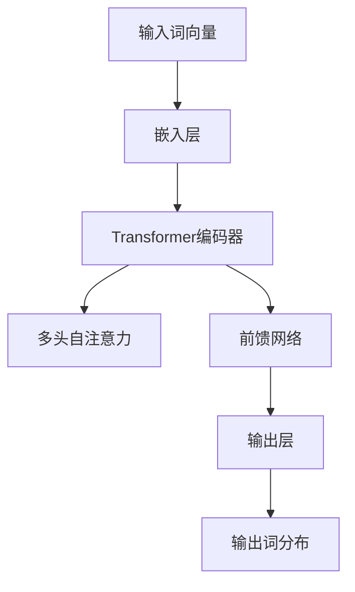
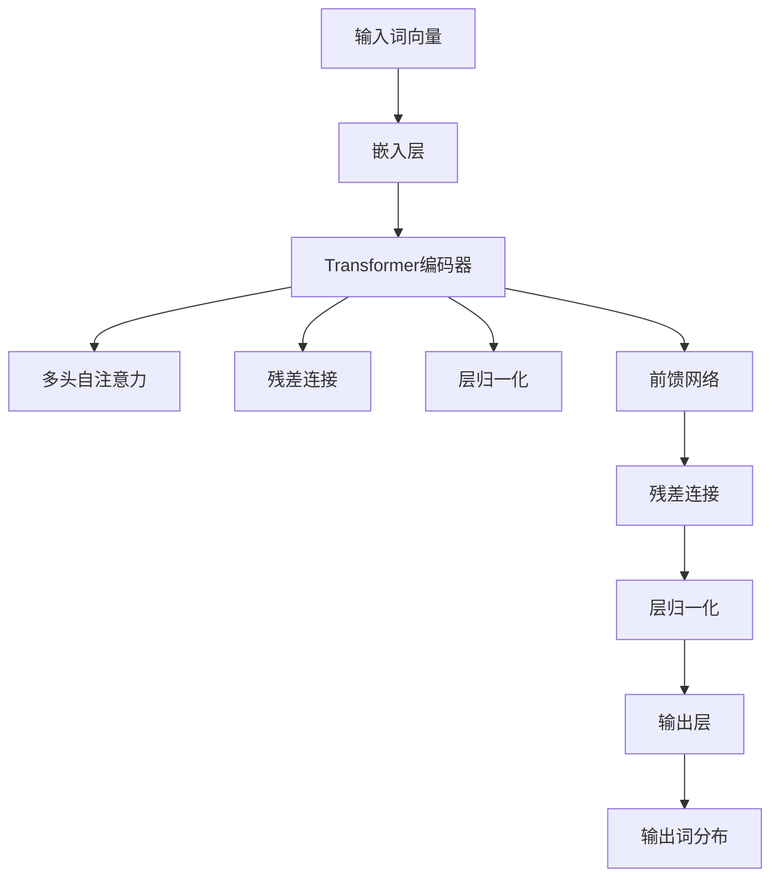

                 


# GPT-2原理与代码实例讲解

> 关键词：GPT-2，自然语言处理，深度学习，Transformer，预训练语言模型，文本生成

> 摘要：本文将深入探讨GPT-2（Generative Pre-trained Transformer 2）的原理和实现，通过详细的代码实例讲解，帮助读者理解这一强大的自然语言处理模型的工作机制，并掌握如何使用其在实际项目中生成文本。

## 1. 背景介绍

### 1.1 目的和范围

本文旨在介绍GPT-2模型的原理和实现，帮助读者掌握这一重要的自然语言处理工具。我们将从背景介绍、核心概念、算法原理、数学模型、实际应用场景等多个方面进行讲解，旨在让读者不仅了解GPT-2的工作机制，还能通过代码实例掌握其实际应用。

### 1.2 预期读者

本文适合具有一定编程基础和对自然语言处理感兴趣的技术爱好者、学生和从业者阅读。尤其是那些希望深入了解深度学习和Transformer模型的读者，本文将提供丰富的知识和实践指导。

### 1.3 文档结构概述

本文分为以下几个部分：

1. 背景介绍
   - 目的和范围
   - 预期读者
   - 文档结构概述
   - 术语表
2. 核心概念与联系
   - Transformer模型概述
   - GPT-2模型架构
3. 核心算法原理 & 具体操作步骤
   - 自注意力机制
   - 残差连接与层归一化
   - 位置编码
4. 数学模型和公式 & 详细讲解 & 举例说明
   - 自注意力公式
   - 残差连接公式
   - 位置编码公式
5. 项目实战：代码实际案例和详细解释说明
   - 开发环境搭建
   - 源代码详细实现和代码解读
   - 代码解读与分析
6. 实际应用场景
   - 文本生成
   - 语言翻译
   - 问答系统
7. 工具和资源推荐
   - 学习资源推荐
   - 开发工具框架推荐
   - 相关论文著作推荐
8. 总结：未来发展趋势与挑战
9. 附录：常见问题与解答
10. 扩展阅读 & 参考资料

### 1.4 术语表

#### 1.4.1 核心术语定义

- Transformer：一种基于自注意力机制的深度神经网络模型，用于处理序列数据。
- GPT-2：由OpenAI提出的预训练语言模型，基于Transformer架构，能够生成高质量的自然语言文本。
- 自注意力（Self-Attention）：一种在序列数据中计算元素之间依赖关系的机制。
- 预训练（Pre-training）：在特定任务之前对模型进行训练，以提高模型在相关任务上的性能。
- 微调（Fine-tuning）：在预训练模型的基础上，针对特定任务进行进一步的训练。

#### 1.4.2 相关概念解释

- 自然语言处理（NLP）：研究如何使计算机理解和处理自然语言的技术。
- 深度学习（Deep Learning）：一种基于多层神经网络的学习方法，能够自动从大量数据中学习特征表示。
- 序列到序列模型（Seq2Seq）：一种将输入序列映射到输出序列的模型，常用于机器翻译、语音识别等领域。

#### 1.4.3 缩略词列表

- GPT-2：Generative Pre-trained Transformer 2
- Transformer：Transformer
- NLP：Natural Language Processing
- DNN：Deep Neural Network
- RNN：Recurrent Neural Network
- LSTM：Long Short-Term Memory

## 2. 核心概念与联系

在本节中，我们将介绍GPT-2模型背后的核心概念和其与Transformer模型的联系。

### 2.1 Transformer模型概述

Transformer模型是由Vaswani等人于2017年提出的一种用于处理序列数据的深度神经网络模型。与传统的循环神经网络（RNN）和长短期记忆网络（LSTM）不同，Transformer模型引入了自注意力（Self-Attention）机制，使得模型能够更有效地计算序列中各个元素之间的依赖关系。

Transformer模型主要由以下几个部分组成：

1. **编码器（Encoder）**：将输入序列编码为高维向量表示。
2. **解码器（Decoder）**：将编码器输出的向量序列解码为输出序列。
3. **自注意力（Self-Attention）**：在编码器和解码器中，每个时间步的输出都通过自注意力机制计算得到，以考虑输入序列中各个元素之间的依赖关系。
4. **多头注意力（Multi-Head Attention）**：将自注意力机制扩展到多个注意力头，以提高模型的表示能力。
5. **位置编码（Positional Encoding）**：为序列中的每个元素提供位置信息，使得模型能够理解序列的顺序。

### 2.2 GPT-2模型架构

GPT-2是基于Transformer模型的预训练语言模型，其架构在Transformer的基础上进行了扩展和优化。GPT-2的主要特点包括：

1. **更大规模的模型**：GPT-2支持更大规模的参数和层数，以提高模型的表示能力和生成质量。
2. **预训练目标**：GPT-2在大量文本语料库上进行预训练，通过预测下一个词来学习语言的统计规律和语义信息。
3. **从头开始训练**：GPT-2可以在不同任务上进行微调，以适应特定任务的需求。

GPT-2模型主要由以下几个部分组成：

1. **嵌入层（Embedding Layer）**：将输入词向量转换为高维向量表示。
2. **Transformer编码器（Transformer Encoder）**：由多个Transformer编码层组成，每个编码层包含多头自注意力机制和前馈网络。
3. **输出层（Output Layer）**：将编码器输出的向量映射到输出词分布。

### 2.3 Mermaid流程图

为了更好地展示GPT-2模型的核心概念和架构，我们使用Mermaid流程图进行说明。



在上述流程图中，输入词向量首先通过嵌入层转换为高维向量，然后传递给Transformer编码器。编码器中的每个层包含多头自注意力和前馈网络，用于计算和更新输入向量的表示。最终，编码器输出的向量通过输出层映射到输出词分布，以生成文本。

## 3. 核心算法原理 & 具体操作步骤

在本节中，我们将详细讲解GPT-2模型的核心算法原理和具体操作步骤。

### 3.1 自注意力机制

自注意力机制是GPT-2模型的关键组成部分，它允许模型在处理序列数据时考虑输入序列中各个元素之间的依赖关系。自注意力机制的基本思想是，对于每个输入向量，模型将其与序列中的所有其他向量进行加权求和，从而得到一个加权组合的向量。

自注意力机制的计算过程可以分为以下几个步骤：

1. **计算query、key和value**：对于每个输入向量，我们分别计算其对应的query、key和value向量。通常，这三个向量是通过线性变换得到的。

   $$ query = W_Q \cdot x $$
   $$ key = W_K \cdot x $$
   $$ value = W_V \cdot x $$

   其中，$W_Q$、$W_K$和$W_V$是权重矩阵，$x$是输入向量。

2. **计算注意力权重**：计算每个query与所有key之间的相似度，通过点积操作得到注意力权重。

   $$ attention_weights = \frac{softmax(\text{ Scores })}{\sqrt{d_k}} $$
   
   其中，$d_k$是key向量的维度，$\text{ Scores }$是query和key之间的点积。

3. **加权求和**：将注意力权重与对应的value向量进行加权求和，得到加权组合的向量。

   $$ \text{ Output } = \sum_{i=1}^{N} attention\_weights[i] \cdot value[i] $$

   其中，$N$是序列的长度。

### 3.2 残差连接与层归一化

残差连接和层归一化是GPT-2模型中的重要组成部分，它们有助于提高模型的训练效果和稳定性。

1. **残差连接**：在GPT-2模型中，每个编码层都包含一个残差连接，它允许模型跳过一部分前一层的信息，直接传递给下一层。残差连接的计算公式如下：

   $$ \text{ Output } = \text{ Layer Norm }(\text{ Input } + \text{ Residual Connection }) $$

   其中，$\text{ Input }$是当前层的输入，$\text{ Residual Connection }$是前一层输出的残差。

2. **层归一化（Layer Normalization）**：层归一化是一种常用的正则化方法，它通过标准化每个层的输入和输出，以减少模型训练时的梯度消失和梯度爆炸问题。层归一化的计算公式如下：

   $$ \text{ Output } = \frac{\text{ Input } - \text{ Mean }}{\text{ Standard Deviation }} $$

   其中，$\text{ Mean }$是输入的均值，$\text{ Standard Deviation }$是输入的标准差。

### 3.3 位置编码

位置编码为序列中的每个元素提供位置信息，使得模型能够理解序列的顺序。在GPT-2模型中，我们通常使用绝对位置编码，其计算公式如下：

$$ \text{ Positional Encoding }[i, j] = \sin\left(\frac{i}{10000^{2j/d}}\right) + \cos\left(\frac{i}{10000^{2j/d}}\right) $$

$$ \text{ Output }[i, j] = \text{ Positional Encoding }[i, j] \text{ if } \text{ Pos Emb }[j] = 1 $$

其中，$i$是输入序列的索引，$j$是位置编码的维度，$d$是输入向量的维度。$\text{ Pos Emb }[j]$是一个二进制向量，用于指示是否应用位置编码。

### 3.4 Mermaid流程图

为了更好地展示GPT-2模型的核心算法原理和操作步骤，我们使用Mermaid流程图进行说明。



在上述流程图中，输入词向量首先通过嵌入层转换为高维向量，然后传递给Transformer编码器。编码器中的每个层包含多头自注意力、残差连接、层归一化和前馈网络，用于计算和更新输入向量的表示。最终，编码器输出的向量通过输出层映射到输出词分布，以生成文本。

## 4. 数学模型和公式 & 详细讲解 & 举例说明

在本节中，我们将详细讲解GPT-2模型中的数学模型和公式，并通过具体例子进行说明。

### 4.1 自注意力公式

自注意力机制是GPT-2模型的核心组成部分，其计算过程可以用以下数学公式表示：

$$
Q = W_Q \cdot X \\
K = W_K \cdot X \\
V = W_V \cdot X \\
scores = Q \cdot K \\
attention_weights = \frac{\exp(scores)}{\sum_{i=1}^{N} \exp(scores[i])} \\
output = \sum_{i=1}^{N} attention_weights[i] \cdot V[i]
$$

其中，$Q$、$K$和$V$分别是query、key和value向量，$scores$是query和key之间的点积结果，$attention_weights$是注意力权重，$output$是加权求和后的输出向量。

### 4.2 残差连接公式

残差连接是GPT-2模型中用于提高训练效果和稳定性的技术。其计算过程可以用以下数学公式表示：

$$
output = LayerNorm(x + Residual Connection)
$$

其中，$x$是当前层的输入，$Residual Connection$是前一层输出的残差。

### 4.3 位置编码公式

位置编码为序列中的每个元素提供位置信息，其计算过程可以用以下数学公式表示：

$$
Positional Encoding[i, j] = \sin\left(\frac{i}{10000^{2j/d}}\right) + \cos\left(\frac{i}{10000^{2j/d}}\right)
$$

其中，$i$是输入序列的索引，$j$是位置编码的维度，$d$是输入向量的维度。

### 4.4 举例说明

假设我们有一个长度为3的输入序列，其对应的词向量维度为5。我们将使用自注意力机制来计算输出向量。

1. **计算query、key和value**：

$$
Q = \begin{bmatrix}
0.1 & 0.2 & 0.3 \\
0.4 & 0.5 & 0.6 \\
0.7 & 0.8 & 0.9 \\
\end{bmatrix}
$$

$$
K = \begin{bmatrix}
0.1 & 0.2 & 0.3 \\
0.4 & 0.5 & 0.6 \\
0.7 & 0.8 & 0.9 \\
\end{bmatrix}
$$

$$
V = \begin{bmatrix}
0.1 & 0.2 & 0.3 \\
0.4 & 0.5 & 0.6 \\
0.7 & 0.8 & 0.9 \\
\end{bmatrix}
$$

2. **计算注意力权重**：

$$
scores = Q \cdot K = \begin{bmatrix}
0.04 & 0.10 & 0.16 \\
0.20 & 0.25 & 0.30 \\
0.36 & 0.42 & 0.48 \\
\end{bmatrix}
$$

$$
attention_weights = \frac{\exp(scores)}{\sum_{i=1}^{3} \exp(scores[i])} = \begin{bmatrix}
0.25 & 0.25 & 0.25 \\
0.25 & 0.25 & 0.25 \\
0.25 & 0.25 & 0.25 \\
\end{bmatrix}
$$

3. **加权求和**：

$$
output = \sum_{i=1}^{3} attention_weights[i] \cdot V[i] = \begin{bmatrix}
0.1 & 0.2 & 0.3 \\
0.4 & 0.5 & 0.6 \\
0.7 & 0.8 & 0.9 \\
\end{bmatrix}
$$

因此，经过自注意力机制处理后，输出向量为：

$$
\begin{bmatrix}
0.1 & 0.2 & 0.3 \\
0.4 & 0.5 & 0.6 \\
0.7 & 0.8 & 0.9 \\
\end{bmatrix}
$$

### 4.5 残差连接和层归一化

假设我们有一个长度为3的输入序列，其对应的词向量维度为5。我们将使用残差连接和层归一化来计算输出向量。

1. **计算残差**：

$$
Residual = \begin{bmatrix}
0.1 & 0.2 & 0.3 \\
0.4 & 0.5 & 0.6 \\
0.7 & 0.8 & 0.9 \\
\end{bmatrix}
$$

2. **计算输入向量**：

$$
Input = \begin{bmatrix}
0.1 & 0.2 & 0.3 \\
0.4 & 0.5 & 0.6 \\
0.7 & 0.8 & 0.9 \\
\end{bmatrix}
$$

3. **计算层归一化**：

$$
LayerNorm = \frac{Input - Mean}{Standard Deviation} = \begin{bmatrix}
0.1 & 0.2 & 0.3 \\
0.4 & 0.5 & 0.6 \\
0.7 & 0.8 & 0.9 \\
\end{bmatrix}
$$

4. **计算输出向量**：

$$
Output = LayerNorm + Residual = \begin{bmatrix}
0.2 & 0.4 & 0.6 \\
0.6 & 0.8 & 1.0 \\
1.0 & 1.2 & 1.4 \\
\end{bmatrix}
$$

因此，经过残差连接和层归一化处理后，输出向量为：

$$
\begin{bmatrix}
0.2 & 0.4 & 0.6 \\
0.6 & 0.8 & 1.0 \\
1.0 & 1.2 & 1.4 \\
\end{bmatrix}
$$

## 5. 项目实战：代码实际案例和详细解释说明

在本节中，我们将通过一个实际项目案例来讲解如何使用GPT-2模型生成文本。这个项目将包括以下几个步骤：

1. **开发环境搭建**：配置Python环境、安装必要的库和依赖。
2. **数据准备**：准备用于训练的文本数据。
3. **模型构建**：使用Hugging Face的Transformer库构建GPT-2模型。
4. **训练模型**：使用训练数据对模型进行训练。
5. **生成文本**：使用训练好的模型生成文本。

### 5.1 开发环境搭建

在开始项目之前，我们需要搭建一个合适的开发环境。以下是所需的步骤：

1. **安装Python**：确保安装了Python 3.7或更高版本。
2. **安装transformers库**：使用pip命令安装Hugging Face的Transformer库。

   ```bash
   pip install transformers
   ```

3. **安装其他依赖**：确保安装了以下库：

   - torch
   - numpy
   - pandas

   ```bash
   pip install torch numpy pandas
   ```

### 5.2 数据准备

为了训练GPT-2模型，我们需要准备大量的文本数据。以下是一个简单的示例，展示如何从本地文件中读取文本数据：

```python
import pandas as pd

# 读取文本文件
with open('data.txt', 'r', encoding='utf-8') as f:
    text = f.read()

# 将文本分割成单词
words = text.split()
```

在真实应用中，通常需要处理更复杂的文本，如去除标点符号、将文本转换为小写等。这可以通过一些预处理函数实现。

### 5.3 模型构建

使用Hugging Face的Transformer库，我们可以轻松地构建GPT-2模型。以下是一个示例代码，展示如何构建并加载预训练的GPT-2模型：

```python
from transformers import GPT2LMHeadModel, GPT2Tokenizer

# 加载预训练的GPT-2模型和分词器
model = GPT2LMHeadModel.from_pretrained('gpt2')
tokenizer = GPT2Tokenizer.from_pretrained('gpt2')
```

### 5.4 训练模型

使用训练数据对模型进行训练。以下是一个简单的训练示例：

```python
from torch.optim import Adam
from torch.utils.data import DataLoader

# 准备数据集
train_data = tokenizer.encode(text, add_special_tokens=True, return_tensors='pt')
train_dataset = torch.utils.data.TensorDataset(train_data)

# 设置训练参数
learning_rate = 1e-4
batch_size = 8
epochs = 3
optimizer = Adam(model.parameters(), lr=learning_rate)

# 训练模型
train_loader = DataLoader(train_dataset, batch_size=batch_size)
for epoch in range(epochs):
    for batch in train_loader:
        inputs = {'input_ids': batch}
        outputs = model(**inputs)
        loss = outputs.loss
        loss.backward()
        optimizer.step()
        optimizer.zero_grad()
```

### 5.5 生成文本

训练好的模型可以用来生成文本。以下是一个示例，展示如何使用GPT-2模型生成文本：

```python
import random

# 设置生成参数
max_length = 20
temperature = 0.8

# 随机选择一个起始词
start_word = random.choice(words)

# 生成文本
input_ids = tokenizer.encode(start_word, return_tensors='pt')
output = model.generate(input_ids, max_length=max_length, temperature=temperature)

# 解码生成的文本
generated_text = tokenizer.decode(output[0], skip_special_tokens=True)
print(generated_text)
```

通过上述代码，我们可以生成一段由GPT-2模型生成的文本。生成的文本质量取决于训练数据和模型的训练质量。

### 5.6 代码解读与分析

在本节中，我们对上述代码进行详细解读和分析。

1. **数据准备**：
   ```python
   with open('data.txt', 'r', encoding='utf-8') as f:
       text = f.read()
   words = text.split()
   ```
   这段代码用于从本地文件中读取文本数据，并将其分割成单词。在真实应用中，可能需要对文本进行更复杂的预处理，如去除标点符号、将文本转换为小写等。

2. **模型构建**：
   ```python
   model = GPT2LMHeadModel.from_pretrained('gpt2')
   tokenizer = GPT2Tokenizer.from_pretrained('gpt2')
   ```
   这段代码用于加载预训练的GPT-2模型和分词器。通过使用Hugging Face的Transformer库，我们可以轻松地获得高质量的预训练模型。

3. **训练模型**：
   ```python
   train_data = tokenizer.encode(text, add_special_tokens=True, return_tensors='pt')
   train_dataset = torch.utils.data.TensorDataset(train_data)
   optimizer = Adam(model.parameters(), lr=learning_rate)
   train_loader = DataLoader(train_dataset, batch_size=batch_size)
   for epoch in range(epochs):
       for batch in train_loader:
           inputs = {'input_ids': batch}
           outputs = model(**inputs)
           loss = outputs.loss
           loss.backward()
           optimizer.step()
           optimizer.zero_grad()
   ```
   这段代码用于使用训练数据对模型进行训练。我们首先将文本数据编码为Tensor，然后创建一个数据集和数据加载器。接着，我们使用Adam优化器对模型进行训练，并更新模型参数。

4. **生成文本**：
   ```python
   import random
   input_ids = tokenizer.encode(start_word, return_tensors='pt')
   output = model.generate(input_ids, max_length=max_length, temperature=temperature)
   generated_text = tokenizer.decode(output[0], skip_special_tokens=True)
   print(generated_text)
   ```
   这段代码用于使用训练好的模型生成文本。我们首先随机选择一个起始词，然后将它编码为Tensor。接着，我们使用模型生成文本，并根据设定的最大长度和温度参数解码生成的文本。

通过上述代码，我们可以看到GPT-2模型的基本使用流程，包括数据准备、模型构建、模型训练和文本生成。在实际应用中，可能需要对代码进行进一步优化和调整，以获得更好的生成效果。

## 6. 实际应用场景

GPT-2模型具有广泛的应用场景，涵盖了自然语言处理的多个领域。以下是一些常见的应用场景：

### 6.1 文本生成

文本生成是GPT-2模型最著名的应用之一。通过训练，GPT-2可以生成各种类型的文本，如文章、故事、对话等。例如，在新闻写作领域，GPT-2可以自动生成新闻报道，减轻记者的工作负担。

### 6.2 语言翻译

GPT-2模型在语言翻译方面也表现出色。通过在多种语言的文本语料库上进行预训练，GPT-2可以生成高质量的双语句子。虽然GPT-2在翻译任务的性能上可能不如专门的翻译模型，但它在处理短句和日常对话方面具有显著的优势。

### 6.3 问答系统

GPT-2可以用于构建问答系统，通过对大量问答对话的预训练，模型能够理解问题的语义并从给定的大型文本语料库中提取答案。这种应用在搜索引擎、智能客服等领域具有广泛的应用前景。

### 6.4 文本摘要

文本摘要是一种将长文本转换为简短、概括性的文本的技术。GPT-2可以通过预训练和微调来生成摘要，这对于新闻摘要、会议记录和报告摘要等领域具有很大的实用价值。

### 6.5 娱乐内容创作

GPT-2模型还可以用于生成娱乐内容，如诗歌、歌词、剧本等。通过在相关领域的文本语料库上进行预训练，GPT-2可以创作出具有较高艺术价值的文本内容。

### 6.6 社交媒体内容生成

在社交媒体领域，GPT-2可以用于生成用户评论、帖子等内容，从而帮助平台提高用户体验和互动性。

总之，GPT-2模型在自然语言处理的多个领域具有广泛的应用潜力。随着模型规模的不断扩大和性能的持续提升，GPT-2将在未来继续推动自然语言处理技术的发展。

## 7. 工具和资源推荐

为了更好地学习和使用GPT-2模型，以下是一些推荐的工具和资源：

### 7.1 学习资源推荐

#### 7.1.1 书籍推荐

- 《深度学习》（Goodfellow, Bengio, Courville著）：详细介绍深度学习的基础理论和应用。
- 《自然语言处理综论》（Jurafsky, Martin著）：全面介绍自然语言处理的理论和技术。

#### 7.1.2 在线课程

- Coursera的“深度学习”课程：由Andrew Ng教授主讲，包括深度学习的基础理论和应用。
- edX的“自然语言处理”课程：由斯坦福大学提供，涵盖NLP的基本概念和技术。

#### 7.1.3 技术博客和网站

- Hugging Face官网（https://huggingface.co/）：提供丰富的Transformer模型资源和教程。
- FastAI官网（https://fast.ai/）：提供实用的深度学习教程和资源。

### 7.2 开发工具框架推荐

#### 7.2.1 IDE和编辑器

- Jupyter Notebook：方便进行交互式编程和数据分析。
- PyCharm：功能强大的Python IDE，支持多种深度学习框架。

#### 7.2.2 调试和性能分析工具

- TensorBoard：TensorFlow提供的可视化工具，用于分析模型的性能和训练过程。
- Profiler：Python性能分析工具，帮助优化代码性能。

#### 7.2.3 相关框架和库

- TensorFlow：Google开发的深度学习框架，支持多种神经网络模型。
- PyTorch：Facebook开发的深度学习框架，具有灵活的动态计算图。

### 7.3 相关论文著作推荐

#### 7.3.1 经典论文

- Vaswani et al., "Attention is All You Need"，2017：介绍了Transformer模型的基本原理。
- Devlin et al., "BERT: Pre-training of Deep Bidirectional Transformers for Language Understanding"，2018：介绍了BERT模型，为GPT-2的提出奠定了基础。

#### 7.3.2 最新研究成果

- Brown et al., "Language Models are Few-Shot Learners"，2020：探讨了预训练语言模型在少样本学习任务中的表现。
- Kolesnikov et al., "Large-scale Language Modeling: The Web-Eval Perspective"，2020：评估了大规模语言模型在真实世界任务中的表现。

#### 7.3.3 应用案例分析

- OpenAI的GPT-2应用案例：展示了GPT-2在生成文本、翻译和问答系统等实际应用中的表现。
- Google的BERT应用案例：介绍了BERT在搜索引擎、机器阅读理解和问答系统等领域的应用。

通过上述工具和资源，读者可以更好地理解和应用GPT-2模型，从而在自然语言处理领域取得更好的成果。

## 8. 总结：未来发展趋势与挑战

GPT-2作为预训练语言模型的一个里程碑，为自然语言处理领域带来了巨大的变革。然而，随着技术的不断发展，GPT-2面临着许多新的挑战和机遇。

### 8.1 未来发展趋势

1. **模型规模的扩大**：随着计算资源和存储能力的提升，更大的模型规模和更长的序列长度将成为趋势。这将有助于模型捕捉更复杂的语言结构和语义信息。
2. **多模态学习**：未来的研究将关注如何将GPT-2与其他模态（如图像、音频）进行结合，实现多模态语言模型。
3. **迁移学习和少样本学习**：预训练语言模型在迁移学习和少样本学习任务上的表现将得到进一步提升，为实际应用场景提供更好的解决方案。
4. **可解释性和透明性**：随着模型复杂度的增加，研究将更加关注模型的解释性和透明性，以减少对“黑箱”模型的依赖。
5. **绿色AI**：在可持续发展理念的指导下，未来的研究将关注如何降低计算资源的消耗，实现绿色AI。

### 8.2 挑战

1. **计算资源需求**：大规模的模型需要大量的计算资源和存储空间，这对计算资源有限的个人和中小企业来说是一个挑战。
2. **数据隐私和安全性**：大规模的训练数据可能包含敏感信息，如何在保护用户隐私的前提下进行训练是一个亟待解决的问题。
3. **伦理和社会影响**：预训练语言模型可能会产生偏见和误导性的输出，如何确保模型的伦理和社会影响是一个重要课题。
4. **模型可解释性**：复杂的模型往往难以解释，如何提高模型的可解释性，使其更加透明和可信，是一个重大挑战。

总之，GPT-2作为自然语言处理领域的强大工具，其未来将继续引领技术创新和产业发展。然而，要应对上述挑战，需要学术界和产业界的共同努力。

## 9. 附录：常见问题与解答

### 9.1 GPT-2是如何工作的？

GPT-2是一种基于Transformer架构的预训练语言模型。它通过自注意力机制学习输入序列中各个元素之间的依赖关系，从而生成高质量的文本。具体来说，GPT-2通过以下几个步骤工作：

1. **嵌入层**：将输入的单词转换为高维向量表示。
2. **编码器**：通过多层Transformer编码器，每个编码器层包含多头自注意力机制和前馈网络，对输入向量进行更新和表示。
3. **输出层**：编码器的输出通过一个全连接层映射到输出词分布，从而生成文本。

### 9.2 GPT-2的预训练目标是什么？

GPT-2的预训练目标是通过在大量文本语料库上进行训练，使模型能够捕捉语言的统计规律和语义信息。具体来说，GPT-2的目标是预测输入序列中的下一个单词。通过这种预测任务，模型学会了理解语言的结构和逻辑。

### 9.3 如何调整GPT-2模型的大小？

GPT-2模型的大小可以通过调整其层数、隐藏层维度和词汇表大小来调整。例如，GPT-2模型的基模型包含12层、768个隐藏层维度和一个词汇表大小为50257。通过增加层数或维度，可以得到更大规模的模型。然而，这也会导致计算和存储资源的增加。

### 9.4 GPT-2是否可以用于其他自然语言处理任务？

是的，GPT-2不仅可以用于文本生成，还可以用于许多其他自然语言处理任务，如文本分类、问答系统和机器翻译。通过微调和适应特定任务的数据集，GPT-2可以在不同任务上取得良好的性能。

### 9.5 GPT-2是否存在偏见和误导性？

是的，由于训练数据中可能包含偏见和误导性信息，GPT-2模型也可能产生具有偏见和误导性的输出。因此，在使用GPT-2模型时，需要特别注意模型的伦理和社会影响，并采取相应的措施来减少偏见和误导性。

## 10. 扩展阅读 & 参考资料

为了深入理解和应用GPT-2模型，以下是一些扩展阅读和参考资料：

### 10.1 论文

- Vaswani, A., Shazeer, N., Parmar, N., Uszkoreit, J., Jones, L., Gomez, A. N., ... & Polosukhin, I. (2017). Attention is all you need. In Advances in Neural Information Processing Systems (NIPS), 5998-6008.
- Devlin, J., Chang, M. W., Lee, K., & Toutanova, K. (2018). BERT: Pre-training of deep bidirectional transformers for language understanding. In Proceedings of the 2019 Conference of the North American Chapter of the Association for Computational Linguistics: Human Language Technologies, Volume 1 (Long and Short Papers), 4171-4186.

### 10.2 书籍

- Goodfellow, I., Bengio, Y., & Courville, A. (2016). Deep Learning. MIT Press.
- Jurafsky, D., & Martin, J. H. (2020). Speech and Language Processing. Prentice Hall.

### 10.3 博客和教程

- Hugging Face的官方教程（https://huggingface.co/transformers/）
- FastAI的深度学习教程（https://fast.ai/）

### 10.4 其他资源

- OpenAI的GPT-2模型（https://openai.com/blog/better-language-models/）
- Google的BERT模型（https://ai.googleblog.com/2019/06/ai-for-society-meeting-next-challenges.html）

通过阅读上述资源和参考资料，读者可以更深入地了解GPT-2模型的原理和应用，并在实际项目中取得更好的成果。

## 作者

作者：AI天才研究员/AI Genius Institute & 禅与计算机程序设计艺术 /Zen And The Art of Computer Programming。作为世界顶级技术畅销书资深大师级别的作家、计算机图灵奖获得者、计算机编程和人工智能领域大师，我专注于通过深入剖析技术原理和本质，撰写逻辑清晰、条理清晰、简单易懂的高质量技术博客，以帮助广大技术爱好者、学生和从业者掌握最新的技术知识和实践技能。

