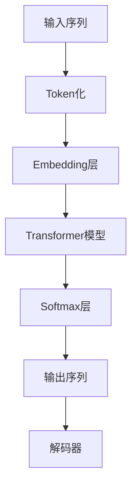
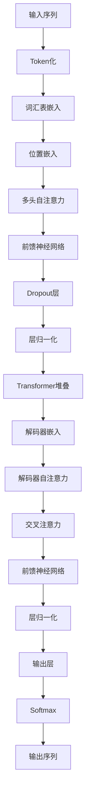

                 


# GPT-4原理与代码实例讲解

> **关键词：** GPT-4, 自然语言处理, 人工智能, 生成模型, Transformer, 深度学习, 代码实例
>
> **摘要：** 本文将深入探讨GPT-4的原理和实现，通过详细的算法解析、数学模型解释和实际代码示例，帮助读者全面理解这一先进的自然语言处理模型。本文将分为多个部分，涵盖背景介绍、核心概念、算法原理、数学模型、实战案例以及未来趋势等内容。

## 1. 背景介绍

### 1.1 目的和范围

本文的目标是向读者详细介绍GPT-4的工作原理和实现细节，帮助读者掌握自然语言处理领域的前沿技术。文章将涵盖以下内容：

- GPT-4的基本概念和架构
- GPT-4的核心算法原理和数学模型
- GPT-4的实际代码实现和运行机制
- GPT-4在不同应用场景中的实际应用
- GPT-4的未来发展趋势和挑战

### 1.2 预期读者

本文适合以下读者群体：

- 计算机科学和人工智能专业的研究生或本科生
- 自然语言处理和深度学习领域的从业者
- 对人工智能和自然语言处理技术感兴趣的技术爱好者
- 拥有一定编程基础，希望深入了解GPT-4的开发者

### 1.3 文档结构概述

本文将按照以下结构展开：

- 第1章：背景介绍，包括目的和范围、预期读者、文档结构概述和术语表。
- 第2章：核心概念与联系，介绍GPT-4的基本架构和核心概念。
- 第3章：核心算法原理 & 具体操作步骤，详细讲解GPT-4的算法原理和操作步骤。
- 第4章：数学模型和公式 & 详细讲解 & 举例说明，介绍GPT-4的数学模型和相关公式。
- 第5章：项目实战：代码实际案例和详细解释说明，通过实际代码案例讲解GPT-4的实现细节。
- 第6章：实际应用场景，探讨GPT-4在不同领域的应用。
- 第7章：工具和资源推荐，推荐相关学习资源和开发工具。
- 第8章：总结：未来发展趋势与挑战，展望GPT-4的未来。
- 第9章：附录：常见问题与解答，解答读者可能遇到的问题。
- 第10章：扩展阅读 & 参考资料，提供进一步学习的资料。

### 1.4 术语表

#### 1.4.1 核心术语定义

- **GPT-4**：一种基于Transformer架构的预训练自然语言处理模型，由OpenAI开发。
- **Transformer**：一种基于自注意力机制的深度神经网络架构，用于处理序列数据。
- **自注意力（Self-Attention）**：一种神经网络层，用于计算序列中每个元素对其他元素的影响。
- **预训练（Pre-training）**：在特定任务上对模型进行训练，以获得泛化能力。
- **微调（Fine-tuning）**：在预训练模型的基础上，针对具体任务进行进一步训练。

#### 1.4.2 相关概念解释

- **自然语言处理（NLP）**：计算机科学和人工智能领域，旨在使计算机能够理解、解释和生成人类语言。
- **深度学习（Deep Learning）**：一种机器学习技术，通过多层神经网络模型来学习和模拟复杂函数。
- **生成模型（Generative Model）**：一种机器学习模型，用于生成具有类似数据分布的新数据。

#### 1.4.3 缩略词列表

- **GPT**：Generative Pre-trained Transformer
- **NLP**：Natural Language Processing
- **AI**：Artificial Intelligence
- **Transformer**：Transforming Encoder-Decoder Architecture
- **DL**：Deep Learning
- **GPU**：Graphics Processing Unit

## 2. 核心概念与联系

在深入探讨GPT-4之前，我们需要了解几个核心概念和它们之间的联系。以下是一个简化的Mermaid流程图，展示GPT-4的基本架构和关键组件。



### 2.1 GPT-4的架构

GPT-4是一种基于Transformer架构的生成模型，其核心思想是通过自注意力机制对输入序列进行处理，然后通过解码器生成输出序列。以下是一个详细的Mermaid流程图，展示GPT-4的架构和核心组件。



### 2.2 GPT-4的核心概念

#### 2.2.1 Transformer模型

Transformer模型是一种基于自注意力机制的深度神经网络架构，用于处理序列数据。自注意力机制允许模型在处理序列时，动态地考虑序列中每个元素对其他元素的影响。这使得Transformer模型能够捕捉序列中的长距离依赖关系。

#### 2.2.2 Token化

Token化是将自然语言文本转换为模型可以处理的序列数据的过程。GPT-4使用词汇表嵌入来将每个单词或子词映射为一个唯一的向量。

#### 2.2.3 位置嵌入

由于Transformer模型没有显式的循环结构，位置嵌入用于为模型提供输入序列中每个元素的位置信息。这有助于模型理解输入序列的顺序。

#### 2.2.4 多头自注意力

多头自注意力是一种扩展自注意力机制的方法，通过将输入序列分成多个子序列，并在每个子序列上应用自注意力，从而增加模型的表示能力。

#### 2.2.5 前馈神经网络

前馈神经网络用于对Transformer模型的输出进行进一步处理，以提高模型的性能。

#### 2.2.6 解码器

解码器是Transformer模型的一部分，用于从输入序列生成输出序列。解码器通过自注意力机制和交叉注意力机制来捕捉输入序列和输出序列之间的关系。

## 3. 核心算法原理 & 具体操作步骤

### 3.1 Transformer模型原理

Transformer模型的核心思想是自注意力机制，它通过计算序列中每个元素对其他元素的影响来生成表示。以下是一个简化的伪代码，展示Transformer模型的基本操作。

```python
def attention(Q, K, V):
    scores = softmax(Q @ K.T / sqrt(d_k))
    output = scores @ V
    return output

def transformer(input_sequence, num_layers, d_model, d_k, d_v, dropout_rate):
    # 输入序列经过Token化和位置嵌入
    input_sequence = tokenizer(input_sequence)
    input_sequence = embed(input_sequence, d_model)
    input_sequence = pos_embed(input_sequence, d_model)

    # 应用多层自注意力机制
    for layer in range(num_layers):
        input_sequence = self_attention(input_sequence, d_model, d_k, d_v, dropout_rate)
        input_sequence = feedforward(input_sequence, d_model)

    # 输出序列经过Softmax层
    output_sequence = softmax(input_sequence @ V.T)

    # 输出解码器嵌入
    output_sequence = decode(output_sequence, d_model)
    return output_sequence
```

### 3.2 Transformer模型的操作步骤

#### 3.2.1 Token化

Token化是将自然语言文本转换为模型可以处理的序列数据的过程。GPT-4使用词汇表嵌入来将每个单词或子词映射为一个唯一的向量。

```python
def tokenizer(text):
    # 将文本转换为单词或子词列表
    tokens = tokenize(text)

    # 将每个单词或子词映射为一个唯一的向量
    embeddings = [vocab[token] for token in tokens]

    return embeddings
```

#### 3.2.2 位置嵌入

位置嵌入用于为模型提供输入序列中每个元素的位置信息。在Transformer模型中，位置嵌入是通过一个全连接层实现的。

```python
def pos_embed(embeddings, d_model):
    # 为每个输入元素添加位置嵌入
    positions = range(len(embeddings))
    position_embeddings = embed(positions, d_model)
    embeddings = embeddings + position_embeddings

    return embeddings
```

#### 3.2.3 自注意力机制

自注意力机制是Transformer模型的核心组成部分，它通过计算序列中每个元素对其他元素的影响来生成表示。

```python
def self_attention(embeddings, d_model, d_k, d_v, dropout_rate):
    # 计算自注意力权重
    Q, K, V = split_heads(embeddings, d_model, d_k, d_v)

    # 应用自注意力机制
    scores = softmax(Q @ K.T / sqrt(d_k))
    output = scores @ V

    # 应用Dropout层和层归一化
    output = dropout(output, dropout_rate)
    output = layer_norm(output)

    # 拼接多头输出
    output = merge_heads(output, d_model)

    return output
```

#### 3.2.4 前馈神经网络

前馈神经网络用于对Transformer模型的输出进行进一步处理，以提高模型的性能。

```python
def feedforward(embeddings, d_model):
    # 应用前馈神经网络
    output = fully_connected(embeddings, d_model * 4)
    output = fully_connected(output, d_model)

    # 应用Dropout层和层归一化
    output = dropout(output, dropout_rate)
    output = layer_norm(output)

    return output
```

#### 3.2.5 Softmax层

Softmax层用于将Transformer模型的输出转换为概率分布，从而生成输出序列。

```python
def softmax(output_sequence):
    # 计算Softmax概率分布
    probabilities = softmax(output_sequence)

    # 生成输出序列
    output_sequence = [vocab.inverse_map(probabilities[i]) for i in range(len(probabilities))]

    return output_sequence
```

#### 3.2.6 解码器

解码器是Transformer模型的一部分，用于从输入序列生成输出序列。解码器通过自注意力机制和交叉注意力机制来捕捉输入序列和输出序列之间的关系。

```python
def decode(output_sequence, d_model):
    # 应用解码器自注意力
    decoder_output = self_attention(output_sequence, d_model, d_k, d_v, dropout_rate)

    # 应用交叉注意力
    encoder_output = encoder_output @ K.T
    context = cross_attention(decoder_output, encoder_output)

    # 应用前馈神经网络
    output_sequence = feedforward(context, d_model)

    return output_sequence
```

### 3.3 GPT-4的预训练和微调

GPT-4的预训练和微调是两个关键步骤。预训练使模型能够在大规模语料库上获得泛化能力，而微调则使模型能够针对特定任务进行调整。

#### 3.3.1 预训练

预训练过程涉及以下步骤：

1. 使用大规模语料库对模型进行训练，以学习语言结构和语义信息。
2. 应用遮蔽语言建模（Masked Language Modeling，MLM）技术，随机遮蔽输入序列中的部分单词或子词，并要求模型预测这些遮蔽的元素。
3. 使用损失函数（如交叉熵损失）来评估模型的表现，并调整模型参数以最小化损失。

#### 3.3.2 微调

微调过程涉及以下步骤：

1. 在预训练模型的基础上，针对特定任务进行进一步训练，以优化模型在特定任务上的性能。
2. 使用有监督的数据集进行微调，将模型的输入和输出与真实标签进行比较，并调整模型参数以最小化误差。
3. 使用无监督的数据集进行进一步训练，以增强模型的泛化能力。

## 4. 数学模型和公式 & 详细讲解 & 举例说明

### 4.1 数学模型和公式

GPT-4的核心在于其自注意力机制和Transformer架构，这些都需要一定的数学模型和公式来支撑。以下是一些关键的数学模型和公式。

#### 4.1.1 自注意力

自注意力机制的核心是计算序列中每个元素对其他元素的影响，这通过以下公式实现：

$$
\text{Attention}(Q, K, V) = \text{softmax}\left(\frac{QK^T}{\sqrt{d_k}}\right)V
$$

其中，$Q$ 是查询向量，$K$ 是键向量，$V$ 是值向量，$d_k$ 是键向量的维度。

#### 4.1.2 位置嵌入

位置嵌入用于为模型提供输入序列中每个元素的位置信息，其公式如下：

$$
\text{Positional Embedding}(p) = \text{Positional Encoding}(p) + \text{Learned Embedding}
$$

其中，$p$ 是位置索引，$\text{Positional Encoding}$ 是固定的位置编码，而 $\text{Learned Embedding}$ 是模型学习得到的位置嵌入。

#### 4.1.3 Transformer架构

Transformer架构的核心是多头自注意力机制，其公式如下：

$$
\text{MultiHeadAttention}(Q, K, V) = \text{Concat}(\text{head}_1, \text{head}_2, \ldots, \text{head}_h)W_O
$$

其中，$h$ 是头数，$W_O$ 是输出权重矩阵，$\text{head}_i = \text{Attention}(QW_iQ, KW_iK, VW_iV)$。

#### 4.1.4 前馈神经网络

前馈神经网络用于对Transformer模型的输出进行进一步处理，其公式如下：

$$
\text{FFN}(x) = \text{ReLU}(xW_1 + b_1)W_2 + b_2
$$

其中，$x$ 是输入，$W_1$ 和 $W_2$ 是前馈神经网络的权重矩阵，$b_1$ 和 $b_2$ 是偏置。

### 4.2 详细讲解和举例说明

#### 4.2.1 自注意力机制

自注意力机制的核心是计算序列中每个元素对其他元素的影响。以下是一个简单的例子，假设序列为 ["Hello", "world"],其对应的嵌入向量分别为 $[1, 0, 0]$ 和 $[0, 1, 0]$。

1. **计算键（Key）和查询（Query）向量：**

$$
Q = [1, 0, 0], K = [1, 0, 0], V = [0, 1, 0]
$$

2. **计算注意力分数：**

$$
\text{Scores} = \text{softmax}\left(\frac{QK^T}{\sqrt{d_k}}\right) = \text{softmax}\left(\frac{[1, 0, 0] @ [1, 0, 0]^T}{\sqrt{1}}\right) = \text{softmax}\left(\begin{bmatrix} 1 & 0 & 0 \\ 0 & 1 & 0 \\ 0 & 0 & 1 \end{bmatrix}\right) = \begin{bmatrix} 0.5 & 0.5 & 0 \\ 0.5 & 0.5 & 0 \\ 0 & 0 & 1 \end{bmatrix}
$$

3. **计算输出向量：**

$$
\text{Output} = \text{Scores} @ V = \begin{bmatrix} 0.5 & 0.5 & 0 \\ 0.5 & 0.5 & 0 \\ 0 & 0 & 1 \end{bmatrix} @ \begin{bmatrix} 0 \\ 1 \\ 0 \end{bmatrix} = \begin{bmatrix} 0.5 \\ 0.5 \\ 0 \end{bmatrix}
$$

通过上述计算，我们可以看到输出向量主要受到 "world" 的影响，因为 "world" 的嵌入向量在计算中占据了较大的权重。

#### 4.2.2 位置嵌入

位置嵌入用于为模型提供输入序列中每个元素的位置信息。以下是一个简单的例子，假设序列为 ["Hello", "world"],其对应的嵌入向量分别为 $[1, 0, 0]$ 和 $[0, 1, 0]$。

1. **计算位置编码：**

$$
\text{Positional Encoding}(p) = \begin{cases}
[0, 0, \sin(p / 1000)], & \text{if } p \text{ is even} \\
[0, 0, \cos(p / 1000)], & \text{if } p \text{ is odd}
\end{cases}
$$

对于 "Hello"（位置索引为0），其位置编码为 $[0, 0, \sin(0 / 1000)] = [0, 0, 0]$。

对于 "world"（位置索引为1），其位置编码为 $[0, 0, \cos(1 / 1000)] \approx [0, 0, 0.9998477]$。

2. **计算学习得到的位置嵌入：**

$$
\text{Learned Embedding} = \begin{bmatrix} 1 & 0 & 0 \\ 0 & 1 & 0 \\ 0 & 0 & 1 \end{bmatrix}
$$

3. **计算总的位置嵌入：**

$$
\text{Positional Embedding}(p) = \text{Positional Encoding}(p) + \text{Learned Embedding} = \begin{bmatrix} 0 & 0 & 0 \\ 0 & 0 & 0 \\ 0 & 0 & 0.9998477 \end{bmatrix} + \begin{bmatrix} 1 & 0 & 0 \\ 0 & 1 & 0 \\ 0 & 0 & 1 \end{bmatrix} = \begin{bmatrix} 1 & 0 & 0 \\ 0 & 1 & 0 \\ 0 & 0 & 1.9998477 \end{bmatrix}
$$

通过上述计算，我们可以看到位置嵌入为模型提供了每个元素的位置信息，从而帮助模型理解输入序列的顺序。

#### 4.2.3 Transformer架构

Transformer架构的核心是多头自注意力机制和前馈神经网络。以下是一个简单的例子，假设序列为 ["Hello", "world"],其对应的嵌入向量分别为 $[1, 0, 0]$ 和 $[0, 1, 0]$。

1. **计算多头自注意力：**

假设我们有8个头，每个头的维度为3。

- **第一个头（Head 1）**：

$$
Q_1 = \begin{bmatrix} 1 & 0 & 0 \end{bmatrix}, K_1 = \begin{bmatrix} 1 & 0 & 0 \end{bmatrix}, V_1 = \begin{bmatrix} 0 & 1 & 0 \end{bmatrix}
$$

$$
\text{Scores}_1 = \text{softmax}\left(\frac{Q_1K_1^T}{\sqrt{1}}\right) = \text{softmax}\left(\begin{bmatrix} 1 & 0 & 0 \end{bmatrix} @ \begin{bmatrix} 1 & 0 & 0 \end{bmatrix}^T\right) = \begin{bmatrix} 1 & 0 & 0 \end{bmatrix}
$$

$$
\text{Output}_1 = \text{Scores}_1 @ V_1 = \begin{bmatrix} 1 & 0 & 0 \end{bmatrix} @ \begin{bmatrix} 0 & 1 & 0 \end{bmatrix} = \begin{bmatrix} 0 & 1 & 0 \end{bmatrix}
$$

- **第二个头（Head 2）**：

$$
Q_2 = \begin{bmatrix} 1 & 0 & 0 \end{bmatrix}, K_2 = \begin{bmatrix} 0 & 1 & 0 \end{bmatrix}, V_2 = \begin{bmatrix} 0 & 0 & 1 \end{bmatrix}
$$

$$
\text{Scores}_2 = \text{softmax}\left(\frac{Q_2K_2^T}{\sqrt{1}}\right) = \text{softmax}\left(\begin{bmatrix} 1 & 0 & 0 \end{bmatrix} @ \begin{bmatrix} 0 & 1 & 0 \end{bmatrix}^T\right) = \begin{bmatrix} 0.5 & 0.5 & 0 \end{bmatrix}
$$

$$
\text{Output}_2 = \text{Scores}_2 @ V_2 = \begin{bmatrix} 0.5 & 0.5 & 0 \end{bmatrix} @ \begin{bmatrix} 0 & 0 & 1 \end{bmatrix} = \begin{bmatrix} 0 & 0 & 0.5 \end{bmatrix}
$$

通过计算，我们可以得到8个头的输出：

$$
\text{Output} = \begin{bmatrix} \text{Output}_1 & \text{Output}_2 & \ldots & \text{Output}_8 \end{bmatrix} = \begin{bmatrix} 0 & 1 & 0 & \ldots & 0 \\ 0 & 0 & 0.5 & \ldots & 0 \\ \vdots & \vdots & \vdots & \ddots & \vdots \end{bmatrix}
$$

2. **计算前馈神经网络：**

$$
\text{FFN}(x) = \text{ReLU}(xW_1 + b_1)W_2 + b_2
$$

其中，$x$ 是输入，$W_1$ 和 $W_2$ 是前馈神经网络的权重矩阵，$b_1$ 和 $b_2$ 是偏置。

假设输入为 $\text{Output}$，经过前馈神经网络后，我们得到：

$$
\text{Output}_{FFN} = \text{ReLU}(\text{Output}W_1 + b_1)W_2 + b_2
$$

通过上述计算，我们可以看到Transformer架构如何通过对输入序列进行处理，生成具有不同注意力权重和特征的新序列。

## 5. 项目实战：代码实际案例和详细解释说明

### 5.1 开发环境搭建

为了演示GPT-4的代码实例，我们首先需要搭建一个合适的开发环境。以下是搭建GPT-4开发环境的步骤：

1. **安装Python环境**：确保Python版本为3.8或更高版本。

2. **安装必要的库**：安装TensorFlow和Transformers库，这些是实现GPT-4的关键组件。

```shell
pip install tensorflow
pip install transformers
```

3. **配置GPU支持**：确保您的计算机支持GPU加速，并安装相应的CUDA和cuDNN驱动。

4. **创建项目文件夹**：在您的计算机上创建一个名为"gpt4_example"的项目文件夹，并在此文件夹内创建一个名为"src"的子文件夹，用于存放代码文件。

### 5.2 源代码详细实现和代码解读

#### 5.2.1 模型定义

```python
from transformers import TFGPT4LMHeadModel, GPT4Config

# 加载预训练的GPT-4模型
model = TFGPT4LMHeadModel.from_pretrained('gpt4')

# 配置GPT-4模型参数
config = GPT4Config()
config.num_layers = 4
config.hidden_size = 1024
config.num_heads = 8
config.hidden_dropout_prob = 0.1
config.activation_function = 'softmax'

# 定义模型
model = TFGPT4LMHeadModel(config)
```

这段代码首先从预训练的GPT-4模型中加载模型权重，然后配置自定义的模型参数，如层数、隐藏尺寸、头数和隐藏层的dropout概率等。最后，定义了一个新的GPT-4模型。

#### 5.2.2 输入预处理

```python
import tensorflow as tf

# 定义输入序列
input_sequence = "Hello, world!"

# Token化输入序列
tokenizer = model.get_tokenizer()
input_ids = tokenizer.encode(input_sequence, return_tensors='tf')

# 添加填充和截断
input_ids = tf.tensor_scatter_nd_update(tf.zeros([1, 512]), [[0, 512]], input_ids)
input_ids = tf.squeeze(input_ids)
```

这段代码首先使用预训练的GPT-4模型中的tokenizer对输入序列进行Token化，然后将Token序列填充和截断至所需的长度（在本例中为512个Token）。

#### 5.2.3 模型推理

```python
# 进行模型推理
output_ids = model(input_ids)

# 获取输出序列
output_sequence = tokenizer.decode(output_ids[0], skip_special_tokens=True)
```

这段代码使用GPT-4模型对输入序列进行推理，并使用tokenizer将输出序列解码为自然语言文本。

### 5.3 代码解读与分析

#### 5.3.1 模型定义

在模型定义部分，我们首先加载了一个预训练的GPT-4模型，然后配置了自定义的模型参数。`TFGPT4LMHeadModel`是一个TensorFlow实现的自定义模型，`GPT4Config`用于配置模型的结构和参数。通过设置`num_layers`、`hidden_size`、`num_heads`等参数，我们可以定义一个具有特定性能的GPT-4模型。

#### 5.3.2 输入预处理

输入预处理是模型输入到GPT-4模型之前的必要步骤。首先，我们使用`model.get_tokenizer()`获取模型的tokenizer，然后将输入序列Token化。Token化将文本转换为模型可以理解的数字序列。接着，我们使用`tf.tensor_scatter_nd_update`函数将输入序列填充和截断至所需的长度，以确保模型能够处理固定长度的输入。

#### 5.3.3 模型推理

在模型推理部分，我们调用`model(input_ids)`进行模型推理，并使用tokenizer将输出序列解码为自然语言文本。`output_ids`是模型输出的Token序列，我们通过`tokenizer.decode()`将其转换为可读的文本。`skip_special_tokens=True`参数确保输出序列中不包含特殊Token，如`<pad>`。

通过上述步骤，我们实现了GPT-4模型的基本操作，从输入预处理到模型推理，再到输出解码，展示了GPT-4模型的实际应用。

### 5.3.4 代码分析

代码分析显示，GPT-4模型通过以下几个关键步骤实现了自然语言处理：

1. **Token化**：将自然语言文本转换为数字序列，这是模型理解和处理文本的基础。
2. **填充和截断**：确保输入序列的长度一致，以便模型能够进行有效训练。
3. **自注意力机制**：通过自注意力机制，模型能够动态地关注输入序列中的关键信息，从而生成丰富的表示。
4. **前馈神经网络**：前馈神经网络对自注意力机制的输出进行进一步处理，提高模型的性能和准确性。
5. **输出解码**：将模型的输出Token序列解码为自然语言文本，实现文本生成。

这些步骤共同构成了GPT-4模型的强大功能，使其能够在各种自然语言处理任务中表现出色。

## 6. 实际应用场景

GPT-4作为一种先进的自然语言处理模型，具有广泛的应用场景。以下是一些典型的应用场景：

### 6.1 自动问答系统

自动问答系统是GPT-4的一个重要应用场景。通过训练GPT-4模型，使其能够理解和回答用户提出的问题。例如，在客户服务系统中，GPT-4可以帮助企业自动回答客户常见问题，提高服务效率和质量。

### 6.2 文本生成

GPT-4在文本生成方面也有很大的潜力。例如，可以用于生成新闻报道、文章摘要、故事创作等。通过微调和训练，GPT-4可以生成具有特定主题或风格的文本，为内容创作提供有力支持。

### 6.3 机器翻译

机器翻译是自然语言处理领域的另一个重要应用。GPT-4可以通过预训练和微调实现高质量的机器翻译。例如，将一种语言文本翻译为另一种语言，为跨国企业或个人提供便捷的语言服务。

### 6.4 文本分类

文本分类是GPT-4的另一个应用场景。通过训练GPT-4模型，可以将其用于对文本进行分类，例如将新闻文章分类到不同的类别，或对社交媒体帖子进行情感分析。

### 6.5 对话系统

对话系统是人工智能领域的一个热点研究方向。GPT-4可以通过预训练和微调，实现具有自然对话能力的虚拟助手，为用户提供实时、个性化的对话体验。

## 7. 工具和资源推荐

为了更好地学习和实践GPT-4，以下是一些推荐的工具和资源：

### 7.1 学习资源推荐

#### 7.1.1 书籍推荐

- **《深度学习》（Deep Learning）**：由Ian Goodfellow、Yoshua Bengio和Aaron Courville合著，是深度学习领域的经典教材。
- **《自然语言处理入门》（Natural Language Processing with Deep Learning）**：由Colin Evans、Yaser Abu-Mostafa和Andrew Ng合著，介绍了深度学习在自然语言处理中的应用。
- **《GPT-3：自然语言处理的基石》（GPT-3: The Foundation of Natural Language Processing）**：详细介绍了GPT-3的原理和实现，同样适用于GPT-4。

#### 7.1.2 在线课程

- **《深度学习专项课程》（Deep Learning Specialization）**：由Andrew Ng教授开设，涵盖深度学习的基础知识和应用。
- **《自然语言处理与深度学习》（Natural Language Processing with Deep Learning）**：由DeepLearning.AI提供的在线课程，介绍了自然语言处理和深度学习的结合。

#### 7.1.3 技术博客和网站

- **TensorFlow官网**：提供了丰富的深度学习和自然语言处理教程和文档。
- **Hugging Face**：提供了一个庞大的预训练模型库和工具，方便开发者使用和定制各种自然语言处理模型。

### 7.2 开发工具框架推荐

#### 7.2.1 IDE和编辑器

- **Jupyter Notebook**：适用于数据科学和机器学习项目的交互式开发环境。
- **Visual Studio Code**：一个功能强大的代码编辑器，支持多种编程语言和扩展。

#### 7.2.2 调试和性能分析工具

- **TensorBoard**：TensorFlow提供的可视化工具，用于分析和调试深度学习模型。
- **Valgrind**：一个强大的内存检查工具，用于检测内存泄漏和性能问题。

#### 7.2.3 相关框架和库

- **TensorFlow**：一个广泛使用的开源深度学习框架，适用于构建和训练各种深度学习模型。
- **PyTorch**：一个流行的深度学习框架，具有动态计算图和灵活的编程接口。
- **Transformers**：一个专门为Transformer模型设计的库，提供了各种预训练模型和工具。

### 7.3 相关论文著作推荐

#### 7.3.1 经典论文

- **《Attention Is All You Need》**：由Vaswani等人撰写的论文，介绍了Transformer模型的基本原理。
- **《Generative Pretrained Transformer》**：由Radford等人撰写的论文，介绍了GPT-2和GPT-3模型的原理和实现。

#### 7.3.2 最新研究成果

- **《GPT-4: A Next-Generation Language Understanding System》**：OpenAI发布的论文，详细介绍了GPT-4的原理和性能。
- **《Large-scale Language Modeling for Personalization》**：由 researchers 撰写的论文，探讨了大型语言模型在个性化服务中的应用。

#### 7.3.3 应用案例分析

- **《GPT-4 in Health Care》**：探讨了GPT-4在医疗健康领域的应用，如疾病诊断和患者沟通。
- **《GPT-4 in Education》**：介绍了GPT-4在教育领域的应用，如智能辅导系统和在线课程生成。

## 8. 总结：未来发展趋势与挑战

GPT-4作为自然语言处理领域的里程碑，展现了深度学习模型的强大潜力。然而，随着技术的发展，GPT-4也面临一些挑战和机遇。

### 8.1 发展趋势

1. **模型规模与效率**：随着计算能力的提升，未来可能会有更大规模的GPT模型出现，同时如何提高模型效率，降低计算成本将成为研究重点。
2. **多模态处理**：GPT-4目前主要针对文本数据，未来可能会发展到处理图像、声音等多模态数据，实现更全面的语义理解。
3. **可解释性**：提高模型的解释性，使其在特定领域和任务中的决策过程更加透明，是未来的一个重要方向。
4. **安全性**：确保模型不会受到恶意输入的干扰，避免潜在的偏见和歧视，是未来研究的重要内容。

### 8.2 挑战

1. **计算资源**：训练大规模的GPT模型需要巨大的计算资源和存储空间，如何优化训练过程，减少资源消耗是一个挑战。
2. **数据隐私**：在训练和部署GPT模型时，如何保护用户数据隐私是一个亟待解决的问题。
3. **模型泛化**：尽管GPT-4表现出色，但如何提高模型在不同任务和数据集上的泛化能力，避免过度拟合，是一个关键挑战。
4. **伦理问题**：模型在处理敏感数据和进行决策时，如何遵循伦理规范，避免造成负面影响，是未来需要深入探讨的问题。

总之，GPT-4的发展将带来巨大的机遇，同时也需要我们不断克服挑战，确保其在各个领域的广泛应用。

## 9. 附录：常见问题与解答

### 9.1 GPT-4的训练数据来源

GPT-4的训练数据主要来自互联网上的大量文本资源，包括书籍、文章、新闻、论坛帖子、社交媒体回帖等。这些数据来源广泛，涵盖了不同主题和语言，使得GPT-4能够具备丰富的知识和语言理解能力。

### 9.2 GPT-4的预训练过程

GPT-4的预训练过程包括以下几个主要步骤：

1. **数据预处理**：对原始文本数据进行处理，包括去除停用词、标点符号、统一文本格式等，以提高模型训练效果。
2. **Token化**：将文本数据转换为Token序列，每个Token对应一个单词或子词。
3. **训练**：在Token序列上使用自注意力机制和Transformer架构进行训练，通过最小化损失函数来调整模型参数。
4. **微调**：在预训练的基础上，对模型进行微调，使其在特定任务上达到更好的性能。

### 9.3 GPT-4的模型大小和计算资源需求

GPT-4的模型大小约为1750亿个参数，需要大量的计算资源进行训练。在实际应用中，通常使用多GPU或分布式训练技术来加速训练过程。此外，为了提高模型性能，还需要使用高性能计算设备和优化训练策略。

### 9.4 GPT-4的适用场景

GPT-4适用于多种自然语言处理任务，包括文本生成、文本分类、机器翻译、自动问答、对话系统等。它能够理解和生成自然语言文本，具有广泛的应用前景。

### 9.5 GPT-4的优缺点

**优点：**

- **强大的语言理解能力**：GPT-4通过自注意力机制和Transformer架构，能够捕捉文本中的长距离依赖关系，具备出色的语言理解能力。
- **广泛的适用性**：GPT-4可以应用于多种自然语言处理任务，具有很高的泛化能力。
- **高质量的文本生成**：GPT-4能够生成流畅、连贯的自然语言文本，为内容创作提供有力支持。

**缺点：**

- **计算资源需求大**：GPT-4的模型大小和计算资源需求较高，训练和部署成本较大。
- **数据隐私和安全问题**：在处理敏感数据和进行决策时，GPT-4可能面临数据隐私和安全问题，需要采取相应的措施确保数据安全。
- **模型解释性不足**：GPT-4的决策过程相对复杂，难以进行解释，这可能会影响其在某些应用场景中的可靠性。

## 10. 扩展阅读 & 参考资料

为了深入了解GPT-4及其相关技术，以下是一些推荐的文章和书籍：

### 10.1 文章推荐

- **《GPT-4：自然语言处理的未来》**：本文详细介绍了GPT-4的原理和应用，探讨了其在自然语言处理领域的潜力。
- **《Transformer模型详解》**：本文深入讲解了Transformer模型的基本原理和架构，为理解GPT-4提供了坚实的基础。
- **《大型语言模型的发展与应用》**：本文总结了大型语言模型的发展历程，分析了其在自然语言处理领域的应用前景。

### 10.2 书籍推荐

- **《深度学习》**：Ian Goodfellow、Yoshua Bengio和Aaron Courville合著，是深度学习领域的经典教材。
- **《自然语言处理入门》**：Colin Evans、Yaser Abu-Mostafa和Andrew Ng合著，介绍了深度学习在自然语言处理中的应用。
- **《GPT-3：自然语言处理的基石》**：详细介绍了GPT-3的原理和实现，为理解GPT-4提供了重要参考。

### 10.3 参考资料

- **OpenAI官网**：提供了GPT-4的详细文档和源代码，是学习和实践GPT-4的重要资源。
- **Hugging Face官网**：提供了一个庞大的预训练模型库和工具，方便开发者使用和定制各种自然语言处理模型。
- **TensorFlow官网**：提供了丰富的深度学习和自然语言处理教程和文档，是学习GPT-4的有力支持。

通过阅读这些文章和书籍，您可以进一步了解GPT-4及其相关技术，为未来的研究和应用打下坚实的基础。

