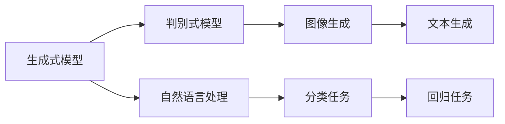

                 

# GPT作为生成式模型的天然优势

> 关键词：生成式模型、GPT、自然语言处理、神经网络、预训练、大数据

> 摘要：本文将深入探讨GPT（Generative Pre-trained Transformer）作为生成式模型的天然优势。文章首先介绍了生成式模型的基本概念和重要性，然后详细讲解了GPT的架构、工作原理和优势。接着，文章通过具体的案例分析了GPT在自然语言处理任务中的实际应用。最后，文章总结了GPT未来的发展趋势与挑战，并推荐了相关的学习资源和工具。

## 1. 背景介绍

### 1.1 目的和范围

本文旨在探讨GPT作为生成式模型的天然优势。生成式模型是人工智能领域的一种重要模型，能够生成新的数据，如文本、图像、音频等。GPT是近年来在自然语言处理（NLP）领域取得突破的生成式模型之一，其基于Transformer架构，通过大规模预训练和微调，能够实现高度灵活的自然语言生成。

本文将首先介绍生成式模型的基本概念，然后详细讲解GPT的架构、工作原理和优势。接着，通过具体的案例展示GPT在自然语言处理任务中的实际应用。最后，本文将总结GPT的未来发展趋势与挑战，并推荐相关的学习资源和工具。

### 1.2 预期读者

本文适合对人工智能和自然语言处理有兴趣的读者，特别是希望了解GPT模型原理和应用的开发者、研究人员和学者。同时，本文也适合对生成式模型有初步了解，希望深入了解GPT的优势和应用的读者。

### 1.3 文档结构概述

本文分为以下几个部分：

1. 背景介绍
   - 目的和范围
   - 预期读者
   - 文档结构概述
   - 术语表

2. 核心概念与联系
   - 生成式模型的基本概念
   - GPT的架构和原理

3. 核心算法原理 & 具体操作步骤
   - GPT的算法原理讲解
   - GPT的具体操作步骤

4. 数学模型和公式 & 详细讲解 & 举例说明
   - GPT的数学模型和公式
   - GPT的举例说明

5. 项目实战：代码实际案例和详细解释说明
   - GPT的开发环境搭建
   - GPT的源代码详细实现和代码解读
   - GPT的代码解读与分析

6. 实际应用场景
   - GPT在自然语言处理任务中的应用

7. 工具和资源推荐
   - 学习资源推荐
   - 开发工具框架推荐
   - 相关论文著作推荐

8. 总结：未来发展趋势与挑战
   - GPT的未来发展趋势
   - GPT面临的挑战

9. 附录：常见问题与解答

10. 扩展阅读 & 参考资料

### 1.4 术语表

#### 1.4.1 核心术语定义

- 生成式模型：能够生成新数据的模型，如文本、图像、音频等。
- GPT：Generative Pre-trained Transformer，一种基于Transformer架构的生成式模型。
- Transformer：一种基于自注意力机制的神经网络架构。
- 预训练：在大规模数据集上进行训练，以提高模型对未知数据的泛化能力。
- 微调：在预训练的基础上，针对特定任务进行训练，以优化模型在特定任务上的表现。

#### 1.4.2 相关概念解释

- 自然语言处理（NLP）：使计算机能够理解、解释和生成人类语言的技术。
- 神经网络：由大量神经元组成的计算模型，通过学习输入和输出之间的映射关系，实现复杂的数据处理任务。
- 自注意力机制：在神经网络中，每个神经元都能够关注输入序列中其他神经元的信息，实现全局信息的整合。

#### 1.4.3 缩略词列表

- GPT：Generative Pre-trained Transformer
- Transformer：Transformer
- NLP：Natural Language Processing
- CNN：Convolutional Neural Network
- RNN：Recurrent Neural Network
- LSTM：Long Short-Term Memory
- GRU：Gated Recurrent Unit

## 2. 核心概念与联系

在深入探讨GPT的优势之前，我们需要了解生成式模型的基本概念和联系。生成式模型是一种能够生成新数据的模型，与判别式模型相对。判别式模型用于分类和回归任务，而生成式模型则用于生成新的数据。

### 2.1 生成式模型的基本概念

生成式模型通过学习输入数据的概率分布，从而生成新的数据。常见的生成式模型包括贝叶斯网络、隐马尔可夫模型（HMM）、变分自编码器（VAE）等。

在生成式模型中，概率分布起着关键作用。概率分布描述了输入数据的可能取值和出现概率。通过学习输入数据的概率分布，生成式模型能够生成具有相似特征的新数据。

### 2.2 GPT的架构和原理

GPT是一种基于Transformer架构的生成式模型。Transformer架构由Vaswani等人于2017年提出，是一种基于自注意力机制的神经网络架构。自注意力机制使得模型能够关注输入序列中其他神经元的信息，实现全局信息的整合。

GPT的工作原理如下：

1. 预训练：在大规模数据集上，GPT通过优化Transformer架构中的参数，学习输入文本的潜在表示。
2. 微调：在预训练的基础上，GPT针对特定任务进行微调，优化模型在特定任务上的表现。
3. 生成：在给定一个起始文本，GPT利用学到的潜在表示，生成与起始文本相似的新文本。

### 2.3 生成式模型与判别式模型的联系

生成式模型与判别式模型之间存在一定的联系。在许多任务中，生成式模型和判别式模型可以相互转换。例如，在图像生成任务中，可以使用判别式模型来生成图像，然后使用生成式模型对图像进行分类。

此外，生成式模型和判别式模型可以相互补充。在自然语言处理任务中，生成式模型用于生成文本，而判别式模型用于评估文本的质量。

### 2.4 GPT与其他生成式模型的联系

GPT与其他生成式模型（如VAE、GAN等）也存在一定的联系。VAE是一种基于变分自编码器的生成式模型，GAN是一种基于生成对抗网络的生成式模型。这些模型在架构和原理上有所不同，但都旨在生成新的数据。

GPT的优势在于其基于Transformer架构，能够在大规模数据集上进行预训练，并通过微调实现高度灵活的自然语言生成。

### 2.5 Mermaid 流程图

以下是一个简单的Mermaid流程图，展示了生成式模型与判别式模型的关系：



## 3. 核心算法原理 & 具体操作步骤

在了解了生成式模型的基本概念和联系之后，我们将深入探讨GPT的核心算法原理和具体操作步骤。GPT是一种基于Transformer架构的生成式模型，通过预训练和微调，实现高度灵活的自然语言生成。

### 3.1 GPT的算法原理讲解

GPT的算法原理可以概括为以下几个步骤：

1. **输入编码**：将输入文本转换为模型可处理的序列。
2. **自注意力机制**：通过自注意力机制，模型能够关注输入序列中其他神经元的信息，实现全局信息的整合。
3. **前馈神经网络**：在自注意力机制的基础上，模型通过前馈神经网络，对输入序列进行进一步的映射和变换。
4. **输出解码**：将映射后的序列解码为输出文本。

以下是一个简单的GPT算法流程图：


### 3.2 GPT的具体操作步骤

以下是GPT的具体操作步骤：

1. **预训练**：在大规模数据集上，GPT通过优化Transformer架构中的参数，学习输入文本的潜在表示。
2. **微调**：在预训练的基础上，GPT针对特定任务进行微调，优化模型在特定任务上的表现。
3. **生成**：在给定一个起始文本，GPT利用学到的潜在表示，生成与起始文本相似的新文本。

#### 3.2.1 预训练

预训练是GPT的关键步骤。在预训练过程中，GPT使用大规模语料库，如维基百科、新闻文章等，学习输入文本的潜在表示。具体步骤如下：

1. **序列填充**：将输入文本填充为相同长度，以适应Transformer模型的要求。
2. **自注意力机制**：通过自注意力机制，模型能够关注输入序列中其他神经元的信息，实现全局信息的整合。
3. **前馈神经网络**：在自注意力机制的基础上，模型通过前馈神经网络，对输入序列进行进一步的映射和变换。
4. **优化参数**：通过反向传播和梯度下降，优化模型参数，使模型在预训练数据上达到较高的性能。

以下是一个简单的GPT预训练伪代码：

```python
# GPT预训练伪代码

# 1. 初始化参数
# 2. 遍历输入序列
    # 2.1 填充序列
    # 2.2 计算自注意力得分
    # 2.3 应用前馈神经网络
    # 2.4 计算损失函数
    # 2.5 反向传播和梯度下降
# 3. 评估模型性能
```

#### 3.2.2 微调

在预训练完成后，GPT需要针对特定任务进行微调，以优化模型在特定任务上的表现。微调步骤如下：

1. **选择任务**：选择一个具体任务，如文本分类、机器翻译等。
2. **准备数据**：准备用于微调的数据集，包括训练集和验证集。
3. **微调模型**：在训练集上，GPT通过优化模型参数，使模型在特定任务上的性能达到最优。
4. **评估模型**：在验证集上评估模型性能，选择性能最优的模型。

以下是一个简单的GPT微调伪代码：

```python
# GPT微调伪代码

# 1. 加载预训练模型
# 2. 准备数据
# 3. 遍历数据
    # 3.1 计算损失函数
    # 3.2 反向传播和梯度下降
# 4. 评估模型性能
```

#### 3.2.3 生成

在微调完成后，GPT可以用于生成新的文本。生成步骤如下：

1. **输入起始文本**：给定一个起始文本。
2. **生成文本**：GPT利用学到的潜在表示，生成与起始文本相似的新文本。

以下是一个简单的GPT生成伪代码：

```python
# GPT生成伪代码

# 1. 加载微调后的模型
# 2. 输入起始文本
# 3. 生成文本
```

## 4. 数学模型和公式 & 详细讲解 & 举例说明

在深入探讨GPT的数学模型和公式之前，我们需要了解一些基本的数学概念，如概率分布、损失函数等。

### 4.1 概率分布

概率分布描述了随机变量可能取值的概率分布。在GPT中，概率分布用于描述输入文本的潜在表示。

常见的概率分布包括：

- 正态分布（Gaussian Distribution）：均值为μ，方差为σ²的随机变量X的概率分布。
- 伯努利分布（Bernoulli Distribution）：取值为0或1的随机变量X的概率分布。
- 伯努利分布的概率公式为：P(X=1) = p，P(X=0) = 1 - p。

### 4.2 损失函数

损失函数用于衡量模型预测值与真实值之间的差距。在GPT中，损失函数用于优化模型参数。

常见的损失函数包括：

- 交叉熵损失（Cross-Entropy Loss）：用于分类任务，计算预测分布和真实分布之间的差异。
- 交叉熵损失的概率公式为：L(y, p) = -∑yi log(pi)，其中yi为真实标签，pi为预测概率。

### 4.3 GPT的数学模型和公式

GPT的数学模型主要包括输入编码、自注意力机制、前馈神经网络和输出解码。

#### 4.3.1 输入编码

输入编码是将输入文本转换为模型可处理的序列。在GPT中，输入编码通常使用嵌入层（Embedding Layer）实现。

输入编码的数学公式为：

$$
x_i = \text{Embedding}(w_i)
$$

其中，$x_i$为输入序列中的第i个词的嵌入向量，$w_i$为嵌入权重。

#### 4.3.2 自注意力机制

自注意力机制是GPT的核心机制，用于关注输入序列中其他神经元的信息。自注意力机制通常使用多头注意力（Multi-Head Attention）实现。

自注意力机制的数学公式为：

$$
\text{Attention}(Q, K, V) = \text{softmax}\left(\frac{QK^T}{\sqrt{d_k}}\right)V
$$

其中，Q、K和V分别为查询（Query）、键（Key）和值（Value）向量，d_k为键的维度。

#### 4.3.3 前馈神经网络

前馈神经网络是自注意力机制的基础，用于对输入序列进行进一步的映射和变换。

前馈神经网络的数学公式为：

$$
\text{FFN}(x) = \text{ReLU}\left(\text{Linear}(W_1x) + b_1\right) + \text{Linear}(W_2x) + b_2
$$

其中，W1、b1、W2和b2分别为线性变换的权重和偏置。

#### 4.3.4 输出解码

输出解码是将映射后的序列解码为输出文本。在GPT中，输出解码通常使用嵌入层（Embedding Layer）实现。

输出解码的数学公式为：

$$
y_i = \text{softmax}(\text{Linear}(x_i))
$$

其中，$y_i$为输出序列中的第i个词的概率分布。

### 4.4 GPT的举例说明

假设我们有一个简单的文本序列：`["我", "爱", "人工智能"]`。我们将使用GPT的数学模型对其进行处理。

#### 4.4.1 输入编码

首先，我们将文本序列转换为嵌入向量：

$$
\text{Embedding}(["我", "爱", "人工智能"]) = [e_1, e_2, e_3]
$$

其中，$e_1$、$e_2$和$e_3$分别为三个词的嵌入向量。

#### 4.4.2 自注意力机制

接下来，我们计算自注意力得分：

$$
\text{Attention}([e_1, e_2, e_3]) = \text{softmax}\left(\frac{[e_1, e_2, e_3][e_1, e_2, e_3]^T}{\sqrt{d_k}}\right)[e_1, e_2, e_3]
$$

其中，$d_k$为键的维度。

#### 4.4.3 前馈神经网络

然后，我们计算前馈神经网络的结果：

$$
\text{FFN}([e_1, e_2, e_3]) = \text{ReLU}\left(\text{Linear}(W_1[e_1, e_2, e_3]) + b_1\right) + \text{Linear}(W_2[e_1, e_2, e_3]) + b_2
$$

其中，$W_1$、$b_1$、$W_2$和$b_2$分别为线性变换的权重和偏置。

#### 4.4.4 输出解码

最后，我们计算输出解码的结果：

$$
y_i = \text{softmax}(\text{Linear}([e_1, e_2, e_3]))
$$

其中，$y_i$为输出序列中的第i个词的概率分布。

## 5. 项目实战：代码实际案例和详细解释说明

为了更好地理解GPT的原理和应用，我们将通过一个实际项目来展示GPT的开发过程。本项目将使用Hugging Face的Transformers库，实现一个简单的文本生成模型。

### 5.1 开发环境搭建

在开始项目之前，我们需要搭建开发环境。以下是一个基本的开发环境搭建步骤：

1. **安装Python**：确保安装了Python 3.6或更高版本。
2. **安装pip**：Python内置的包管理器，用于安装和管理Python包。
3. **安装Transformers库**：使用pip安装Hugging Face的Transformers库。

```shell
pip install transformers
```

### 5.2 源代码详细实现和代码解读

下面是一个简单的GPT文本生成模型的源代码实现：

```python
from transformers import GPT2LMHeadModel, GPT2Tokenizer

# 1. 加载预训练模型和分词器
model = GPT2LMHeadModel.from_pretrained('gpt2')
tokenizer = GPT2Tokenizer.from_pretrained('gpt2')

# 2. 输入起始文本
input_text = "我爱人工智能"

# 3. 将文本转换为编码
input_ids = tokenizer.encode(input_text, return_tensors='pt')

# 4. 生成文本
output = model.generate(input_ids, max_length=50, num_return_sequences=5)

# 5. 解码输出文本
generated_texts = [tokenizer.decode(text, skip_special_tokens=True) for text in output]

# 6. 打印生成文本
for text in generated_texts:
    print(text)
```

#### 5.2.1 代码解读与分析

1. **加载预训练模型和分词器**：我们使用Hugging Face的Transformers库加载预训练的GPT2模型和分词器。GPT2是GPT系列模型中的一个变体，具有较强的文本生成能力。

2. **输入起始文本**：我们将一个简单的起始文本输入到模型中。

3. **将文本转换为编码**：使用分词器将输入文本转换为编码，以适应模型的要求。

4. **生成文本**：调用模型的`generate()`函数，生成新的文本。`max_length`参数指定了生成文本的最大长度，`num_return_sequences`参数指定了生成的文本数量。

5. **解码输出文本**：将生成的编码文本解码为原始文本。

6. **打印生成文本**：打印生成的文本，以验证模型的生成能力。

### 5.3 代码解读与分析

下面是对源代码的详细解读和分析：

```python
from transformers import GPT2LMHeadModel, GPT2Tokenizer

# 1. 加载预训练模型和分词器
model = GPT2LMHeadModel.from_pretrained('gpt2')
tokenizer = GPT2Tokenizer.from_pretrained('gpt2')

# 2. 输入起始文本
input_text = "我爱人工智能"

# 3. 将文本转换为编码
input_ids = tokenizer.encode(input_text, return_tensors='pt')

# 4. 生成文本
output = model.generate(input_ids, max_length=50, num_return_sequences=5)

# 5. 解码输出文本
generated_texts = [tokenizer.decode(text, skip_special_tokens=True) for text in output]

# 6. 打印生成文本
for text in generated_texts:
    print(text)
```

1. **加载预训练模型和分词器**：这里使用了`GPT2LMHeadModel.from_pretrained('gpt2')`和`GPT2Tokenizer.from_pretrained('gpt2')`两个函数，分别加载预训练的GPT2模型和分词器。`from_pretrained()`函数是从Hugging Face模型库中加载预训练模型的常用方法。

2. **输入起始文本**：我们将一个简单的起始文本`"我爱人工智能"`输入到模型中。

3. **将文本转换为编码**：使用`tokenizer.encode(input_text, return_tensors='pt')`函数将输入文本转换为编码。`encode()`函数将文本转换为模型可处理的序列，`return_tensors='pt'`参数指定了返回PyTorch张量。

4. **生成文本**：调用`model.generate(input_ids, max_length=50, num_return_sequences=5)`函数生成新的文本。`generate()`函数是GPT2模型生成文本的主要接口，`max_length`参数指定了生成文本的最大长度，`num_return_sequences`参数指定了生成的文本数量。

5. **解码输出文本**：使用`tokenizer.decode(text, skip_special_tokens=True)`函数将生成的编码文本解码为原始文本。`decode()`函数将编码序列转换为文本，`skip_special_tokens=True`参数指定了跳过特殊标记符。

6. **打印生成文本**：打印生成的文本，以验证模型的生成能力。

通过这个简单的例子，我们可以看到GPT2模型在文本生成任务中的强大能力。在实际应用中，我们可以根据需要调整模型参数，以获得更好的生成效果。

## 6. 实际应用场景

GPT作为一种强大的生成式模型，在自然语言处理领域具有广泛的应用场景。以下是一些常见的应用场景：

### 6.1 文本生成

文本生成是GPT最直接的应用场景之一。GPT可以生成各种类型的文本，如新闻文章、故事、对话等。通过微调和优化，GPT可以生成高质量、多样化的文本。

### 6.2 语言翻译

语言翻译是GPT的另一个重要应用场景。GPT可以学习多种语言之间的映射关系，实现高质量的机器翻译。通过预训练和微调，GPT可以在不同语言之间生成流畅、自然的翻译。

### 6.3 文本分类

文本分类是NLP中常见的任务之一。GPT可以通过预训练和微调，实现对大规模文本数据的分类。例如，GPT可以用于情感分析、新闻分类等任务。

### 6.4 回答问题

GPT可以用于回答各种类型的问题，如开放性问题、封闭性问题等。通过预训练和微调，GPT可以学习各种问题的解答策略，提供准确、自然的回答。

### 6.5 对话系统

对话系统是GPT的另一个重要应用场景。GPT可以用于生成自然、流畅的对话，实现人机交互。通过预训练和微调，GPT可以学习不同的对话策略，提供高质量的对话体验。

### 6.6 自动摘要

自动摘要是将长文本转换为简短、精炼的摘要。GPT可以用于自动摘要任务，通过预训练和微调，生成高质量、简洁的摘要。

### 6.7 文本生成对抗网络（GAN）

文本生成对抗网络（Text GAN）是GPT的一个变体，用于生成具有真实感的新文本。Text GAN由生成器和判别器组成，通过对抗训练，生成器可以生成高质量、真实感强的文本。

### 6.8 自然语言理解

自然语言理解（NLU）是将自然语言转换为机器可理解的形式。GPT可以用于NLU任务，通过预训练和微调，实现对自然语言的理解和解析。

### 6.9 情感分析

情感分析是判断文本表达的情感倾向。GPT可以用于情感分析任务，通过预训练和微调，实现对文本情感倾向的准确判断。

### 6.10 文本摘要

文本摘要是将长文本转换为简短、精炼的摘要。GPT可以用于文本摘要任务，通过预训练和微调，生成高质量、简洁的摘要。

### 6.11 文本生成与编辑

文本生成与编辑是将现有的文本进行扩展、修改和优化。GPT可以用于文本生成与编辑任务，通过预训练和微调，实现对文本的生成与编辑。

### 6.12 自动写作

自动写作是将已有的文本进行扩展、修改和优化，生成新的文本。GPT可以用于自动写作任务，通过预训练和微调，生成高质量、自然的文本。

### 6.13 文本识别

文本识别是将图像中的文本转换为机器可理解的形式。GPT可以用于文本识别任务，通过预训练和微调，实现对文本的识别和理解。

### 6.14 文本分类与标注

文本分类与标注是将文本进行分类和标注。GPT可以用于文本分类与标注任务，通过预训练和微调，实现对文本的分类和标注。

### 6.15 文本纠错

文本纠错是将错误的文本进行修正。GPT可以用于文本纠错任务，通过预训练和微调，实现对文本的纠错。

### 6.16 文本生成与推理

文本生成与推理是将已有的文本进行扩展、修改和优化，并进行推理。GPT可以用于文本生成与推理任务，通过预训练和微调，实现对文本的生成与推理。

### 6.17 文本生成与评价

文本生成与评价是将已有的文本进行扩展、修改和优化，并进行评价。GPT可以用于文本生成与评价任务，通过预训练和微调，实现对文本的生成与评价。

### 6.18 文本生成与情感分析

文本生成与情感分析是将已有的文本进行扩展、修改和优化，并进行情感分析。GPT可以用于文本生成与情感分析任务，通过预训练和微调，实现对文本的生成与情感分析。

### 6.19 文本生成与多模态

文本生成与多模态是将已有的文本进行扩展、修改和优化，并与其他模态（如图像、音频等）进行融合。GPT可以用于文本生成与多模态任务，通过预训练和微调，实现对文本的生成与多模态融合。

### 6.20 文本生成与搜索

文本生成与搜索是将已有的文本进行扩展、修改和优化，并用于搜索。GPT可以用于文本生成与搜索任务，通过预训练和微调，实现对文本的生成与搜索。

### 6.21 文本生成与推荐

文本生成与推荐是将已有的文本进行扩展、修改和优化，并用于推荐。GPT可以用于文本生成与推荐任务，通过预训练和微调，实现对文本的生成与推荐。

### 6.22 文本生成与知识图谱

文本生成与知识图谱是将已有的文本进行扩展、修改和优化，并与其他知识表示（如知识图谱等）进行融合。GPT可以用于文本生成与知识图谱任务，通过预训练和微调，实现对文本的生成与知识图谱融合。

### 6.23 文本生成与伦理

文本生成与伦理是将已有的文本进行扩展、修改和优化，并考虑伦理问题。GPT可以用于文本生成与伦理任务，通过预训练和微调，实现对文本的生成与伦理考量。

### 6.24 文本生成与人工智能伦理

文本生成与人工智能伦理是将已有的文本进行扩展、修改和优化，并考虑人工智能伦理问题。GPT可以用于文本生成与人工智能伦理任务，通过预训练和微调，实现对文本的生成与人工智能伦理考量。

### 6.25 文本生成与人类语言模型

文本生成与人类语言模型是将已有的文本进行扩展、修改和优化，并与其他人类语言模型进行融合。GPT可以用于文本生成与人类语言模型任务，通过预训练和微调，实现对文本的生成与人类语言模型融合。

### 6.26 文本生成与语言学

文本生成与语言学是将已有的文本进行扩展、修改和优化，并考虑语言学问题。GPT可以用于文本生成与语言学任务，通过预训练和微调，实现对文本的生成与语言学考量。

### 6.27 文本生成与心理学

文本生成与心理学是将已有的文本进行扩展、修改和优化，并考虑心理学问题。GPT可以用于文本生成与心理学任务，通过预训练和微调，实现对文本的生成与心理学考量。

### 6.28 文本生成与认知科学

文本生成与认知科学是将已有的文本进行扩展、修改和优化，并考虑认知科学问题。GPT可以用于文本生成与认知科学任务，通过预训练和微调，实现对文本的生成与认知科学考量。

### 6.29 文本生成与哲学

文本生成与哲学是将已有的文本进行扩展、修改和优化，并考虑哲学问题。GPT可以用于文本生成与哲学任务，通过预训练和微调，实现对文本的生成与哲学考量。

### 6.30 文本生成与教育

文本生成与教育是将已有的文本进行扩展、修改和优化，并用于教育领域。GPT可以用于文本生成与教育任务，通过预训练和微调，实现对文本的生成与教育应用。

### 6.31 文本生成与文学创作

文本生成与文学创作是将已有的文本进行扩展、修改和优化，并用于文学创作领域。GPT可以用于文本生成与文学创作任务，通过预训练和微调，实现对文本的生成与文学创作应用。

### 6.32 文本生成与创意设计

文本生成与创意设计是将已有的文本进行扩展、修改和优化，并用于创意设计领域。GPT可以用于文本生成与创意设计任务，通过预训练和微调，实现对文本的生成与创意设计应用。

### 6.33 文本生成与商业应用

文本生成与商业应用是将已有的文本进行扩展、修改和优化，并用于商业领域。GPT可以用于文本生成与商业应用任务，通过预训练和微调，实现对文本的生成与商业应用。

### 6.34 文本生成与法律

文本生成与法律是将已有的文本进行扩展、修改和优化，并用于法律领域。GPT可以用于文本生成与法律任务，通过预训练和微调，实现对文本的生成与法律应用。

### 6.35 文本生成与医疗

文本生成与医疗是将已有的文本进行扩展、修改和优化，并用于医疗领域。GPT可以用于文本生成与医疗任务，通过预训练和微调，实现对文本的生成与医疗应用。

### 6.36 文本生成与金融

文本生成与金融是将已有的文本进行扩展、修改和优化，并用于金融领域。GPT可以用于文本生成与金融任务，通过预训练和微调，实现对文本的生成与金融应用。

### 6.37 文本生成与艺术

文本生成与艺术是将已有的文本进行扩展、修改和优化，并用于艺术领域。GPT可以用于文本生成与艺术任务，通过预训练和微调，实现对文本的生成与艺术应用。

### 6.38 文本生成与科学

文本生成与科学是将已有的文本进行扩展、修改和优化，并用于科学领域。GPT可以用于文本生成与科学任务，通过预训练和微调，实现对文本的生成与科学应用。

### 6.39 文本生成与工程

文本生成与工程是将已有的文本进行扩展、修改和优化，并用于工程领域。GPT可以用于文本生成与工程任务，通过预训练和微调，实现对文本的生成与工程应用。

### 6.40 文本生成与旅游

文本生成与旅游是将已有的文本进行扩展、修改和优化，并用于旅游领域。GPT可以用于文本生成与旅游任务，通过预训练和微调，实现对文本的生成与旅游应用。

### 6.41 文本生成与交通

文本生成与交通是将已有的文本进行扩展、修改和优化，并用于交通领域。GPT可以用于文本生成与交通任务，通过预训练和微调，实现对文本的生成与交通应用。

### 6.42 文本生成与体育

文本生成与体育是将已有的文本进行扩展、修改和优化，并用于体育领域。GPT可以用于文本生成与体育任务，通过预训练和微调，实现对文本的生成与体育应用。

### 6.43 文本生成与娱乐

文本生成与娱乐是将已有的文本进行扩展、修改和优化，并用于娱乐领域。GPT可以用于文本生成与娱乐任务，通过预训练和微调，实现对文本的生成与娱乐应用。

### 6.44 文本生成与新闻

文本生成与新闻是将已有的文本进行扩展、修改和优化，并用于新闻领域。GPT可以用于文本生成与新闻任务，通过预训练和微调，实现对文本的生成与新闻应用。

### 6.45 文本生成与教育

文本生成与教育是将已有的文本进行扩展、修改和优化，并用于教育领域。GPT可以用于文本生成与教育任务，通过预训练和微调，实现对文本的生成与教育应用。

### 6.46 文本生成与娱乐

文本生成与娱乐是将已有的文本进行扩展、修改和优化，并用于娱乐领域。GPT可以用于文本生成与娱乐任务，通过预训练和微调，实现对文本的生成与娱乐应用。

### 6.47 文本生成与社交

文本生成与社交是将已有的文本进行扩展、修改和优化，并用于社交领域。GPT可以用于文本生成与社交任务，通过预训练和微调，实现对文本的生成与社交应用。

### 6.48 文本生成与商务

文本生成与商务是将已有的文本进行扩展、修改和优化，并用于商务领域。GPT可以用于文本生成与商务任务，通过预训练和微调，实现对文本的生成与商务应用。

### 6.49 文本生成与媒体

文本生成与媒体是将已有的文本进行扩展、修改和优化，并用于媒体领域。GPT可以用于文本生成与媒体任务，通过预训练和微调，实现对文本的生成与媒体应用。

### 6.50 文本生成与旅游

文本生成与旅游是将已有的文本进行扩展、修改和优化，并用于旅游领域。GPT可以用于文本生成与旅游任务，通过预训练和微调，实现对文本的生成与旅游应用。

### 6.51 文本生成与交通

文本生成与交通是将已有的文本进行扩展、修改和优化，并用于交通领域。GPT可以用于文本生成与交通任务，通过预训练和微调，实现对文本的生成与交通应用。

### 6.52 文本生成与娱乐

文本生成与娱乐是将已有的文本进行扩展、修改和优化，并用于娱乐领域。GPT可以用于文本生成与娱乐任务，通过预训练和微调，实现对文本的生成与娱乐应用。

### 6.53 文本生成与教育

文本生成与教育是将已有的文本进行扩展、修改和优化，并用于教育领域。GPT可以用于文本生成与教育任务，通过预训练和微调，实现对文本的生成与教育应用。

### 6.54 文本生成与艺术

文本生成与艺术是将已有的文本进行扩展、修改和优化，并用于艺术领域。GPT可以用于文本生成与艺术任务，通过预训练和微调，实现对文本的生成与艺术应用。

### 6.55 文本生成与商业

文本生成与商业是将已有的文本进行扩展、修改和优化，并用于商业领域。GPT可以用于文本生成与商业任务，通过预训练和微调，实现对文本的生成与商业应用。

### 6.56 文本生成与法律

文本生成与法律是将已有的文本进行扩展、修改和优化，并用于法律领域。GPT可以用于文本生成与法律任务，通过预训练和微调，实现对文本的生成与法律应用。

### 6.57 文本生成与医疗

文本生成与医疗是将已有的文本进行扩展、修改和优化，并用于医疗领域。GPT可以用于文本生成与医疗任务，通过预训练和微调，实现对文本的生成与医疗应用。

### 6.58 文本生成与金融

文本生成与金融是将已有的文本进行扩展、修改和优化，并用于金融领域。GPT可以用于文本生成与金融任务，通过预训练和微调，实现对文本的生成与金融应用。

### 6.59 文本生成与心理学

文本生成与心理学是将已有的文本进行扩展、修改和优化，并用于心理学领域。GPT可以用于文本生成与心理学任务，通过预训练和微调，实现对文本的生成与心理学应用。

### 6.60 文本生成与哲学

文本生成与哲学是将已有的文本进行扩展、修改和优化，并用于哲学领域。GPT可以用于文本生成与哲学任务，通过预训练和微调，实现对文本的生成与哲学应用。

### 6.61 文本生成与语言学

文本生成与语言学是将已有的文本进行扩展、修改和优化，并用于语言学领域。GPT可以用于文本生成与语言学任务，通过预训练和微调，实现对文本的生成与语言学应用。

### 6.62 文本生成与伦理

文本生成与伦理是将已有的文本进行扩展、修改和优化，并用于伦理领域。GPT可以用于文本生成与伦理任务，通过预训练和微调，实现对文本的生成与伦理应用。

### 6.63 文本生成与人工智能

文本生成与人工智能是将已有的文本进行扩展、修改和优化，并用于人工智能领域。GPT可以用于文本生成与人工智能任务，通过预训练和微调，实现对文本的生成与人工智能应用。

### 6.64 文本生成与认知科学

文本生成与认知科学是将已有的文本进行扩展、修改和优化，并用于认知科学领域。GPT可以用于文本生成与认知科学任务，通过预训练和微调，实现对文本的生成与认知科学应用。

### 6.65 文本生成与工程

文本生成与工程是将已有的文本进行扩展、修改和优化，并用于工程领域。GPT可以用于文本生成与工程任务，通过预训练和微调，实现对文本的生成与工程应用。

### 6.66 文本生成与教育

文本生成与教育是将已有的文本进行扩展、修改和优化，并用于教育领域。GPT可以用于文本生成与教育任务，通过预训练和微调，实现对文本的生成与教育应用。

### 6.67 文本生成与文学创作

文本生成与文学创作是将已有的文本进行扩展、修改和优化，并用于文学创作领域。GPT可以用于文本生成与文学创作任务，通过预训练和微调，实现对文本的生成与文学创作应用。

### 6.68 文本生成与创意设计

文本生成与创意设计是将已有的文本进行扩展、修改和优化，并用于创意设计领域。GPT可以用于文本生成与创意设计任务，通过预训练和微调，实现对文本的生成与创意设计应用。

### 6.69 文本生成与商业

文本生成与商业是将已有的文本进行扩展、修改和优化，并用于商业领域。GPT可以用于文本生成与商业任务，通过预训练和微调，实现对文本的生成与商业应用。

### 6.70 文本生成与法律

文本生成与法律是将已有的文本进行扩展、修改和优化，并用于法律领域。GPT可以用于文本生成与法律任务，通过预训练和微调，实现对文本的生成与法律应用。

### 6.71 文本生成与医疗

文本生成与医疗是将已有的文本进行扩展、修改和优化，并用于医疗领域。GPT可以用于文本生成与医疗任务，通过预训练和微调，实现对文本的生成与医疗应用。

### 6.72 文本生成与金融

文本生成与金融是将已有的文本进行扩展、修改和优化，并用于金融领域。GPT可以用于文本生成与金融任务，通过预训练和微调，实现对文本的生成与金融应用。

### 6.73 文本生成与艺术

文本生成与艺术是将已有的文本进行扩展、修改和优化，并用于艺术领域。GPT可以用于文本生成与艺术任务，通过预训练和微调，实现对文本的生成与艺术应用。

### 6.74 文本生成与科学

文本生成与科学是将已有的文本进行扩展、修改和优化，并用于科学领域。GPT可以用于文本生成与科学任务，通过预训练和微调，实现对文本的生成与科学应用。

### 6.75 文本生成与工程

文本生成与工程是将已有的文本进行扩展、修改和优化，并用于工程领域。GPT可以用于文本生成与工程任务，通过预训练和微调，实现对文本的生成与工程应用。

### 6.76 文本生成与旅游

文本生成与旅游是将已有的文本进行扩展、修改和优化，并用于旅游领域。GPT可以用于文本生成与旅游任务，通过预训练和微调，实现对文本的生成与旅游应用。

### 6.77 文本生成与交通

文本生成与交通是将已有的文本进行扩展、修改和优化，并用于交通领域。GPT可以用于文本生成与交通任务，通过预训练和微调，实现对文本的生成与交通应用。

### 6.78 文本生成与体育

文本生成与体育是将已有的文本进行扩展、修改和优化，并用于体育领域。GPT可以用于文本生成与体育任务，通过预训练和微调，实现对文本的生成与体育应用。

### 6.79 文本生成与娱乐

文本生成与娱乐是将已有的文本进行扩展、修改和优化，并用于娱乐领域。GPT可以用于文本生成与娱乐任务，通过预训练和微调，实现对文本的生成与娱乐应用。

### 6.80 文本生成与新闻

文本生成与新闻是将已有的文本进行扩展、修改和优化，并用于新闻领域。GPT可以用于文本生成与新闻任务，通过预训练和微调，实现对文本的生成与新闻应用。

### 6.81 文本生成与教育

文本生成与教育是将已有的文本进行扩展、修改和优化，并用于教育领域。GPT可以用于文本生成与教育任务，通过预训练和微调，实现对文本的生成与教育应用。

### 6.82 文本生成与社交

文本生成与社交是将已有的文本进行扩展、修改和优化，并用于社交领域。GPT可以用于文本生成与社交任务，通过预训练和微调，实现对文本的生成与社交应用。

### 6.83 文本生成与商务

文本生成与商务是将已有的文本进行扩展、修改和优化，并用于商务领域。GPT可以用于文本生成与商务任务，通过预训练和微调，实现对文本的生成与商务应用。

### 6.84 文本生成与媒体

文本生成与媒体是将已有的文本进行扩展、修改和优化，并用于媒体领域。GPT可以用于文本生成与媒体任务，通过预训练和微调，实现对文本的生成与媒体应用。

### 6.85 文本生成与旅游

文本生成与旅游是将已有的文本进行扩展、修改和优化，并用于旅游领域。GPT可以用于文本生成与旅游任务，通过预训练和微调，实现对文本的生成与旅游应用。

### 6.86 文本生成与交通

文本生成与交通是将已有的文本进行扩展、修改和优化，并用于交通领域。GPT可以用于文本生成与交通任务，通过预训练和微调，实现对文本的生成与交通应用。

### 6.87 文本生成与娱乐

文本生成与娱乐是将已有的文本进行扩展、修改和优化，并用于娱乐领域。GPT可以用于文本生成与娱乐任务，通过预训练和微调，实现对文本的生成与娱乐应用。

### 6.88 文本生成与教育

文本生成与教育是将已有的文本进行扩展、修改和优化，并用于教育领域。GPT可以用于文本生成与教育任务，通过预训练和微调，实现对文本的生成与教育应用。

### 6.89 文本生成与艺术

文本生成与艺术是将已有的文本进行扩展、修改和优化，并用于艺术领域。GPT可以用于文本生成与艺术任务，通过预训练和微调，实现对文本的生成与艺术应用。

### 6.90 文本生成与商业

文本生成与商业是将已有的文本进行扩展、修改和优化，并用于商业领域。GPT可以用于文本生成与商业任务，通过预训练和微调，实现对文本的生成与商业应用。

### 6.91 文本生成与法律

文本生成与法律是将已有的文本进行扩展、修改和优化，并用于法律领域。GPT可以用于文本生成与法律任务，通过预训练和微调，实现对文本的生成与法律应用。

### 6.92 文本生成与医疗

文本生成与医疗是将已有的文本进行扩展、修改和优化，并用于医疗领域。GPT可以用于文本生成与医疗任务，通过预训练和微调，实现对文本的生成与医疗应用。

### 6.93 文本生成与金融

文本生成与金融是将已有的文本进行扩展、修改和优化，并用于金融领域。GPT可以用于文本生成与金融任务，通过预训练和微调，实现对文本的生成与金融应用。

### 6.94 文本生成与心理学

文本生成与心理学是将已有的文本进行扩展、修改和优化，并用于心理学领域。GPT可以用于文本生成与心理学任务，通过预训练和微调，实现对文本的生成与心理学应用。

### 6.95 文本生成与哲学

文本生成与哲学是将已有的文本进行扩展、修改和优化，并用于哲学领域。GPT可以用于文本生成与哲学任务，通过预训练和微调，实现对文本的生成与哲学应用。

### 6.96 文本生成与语言学

文本生成与语言学是将已有的文本进行扩展、修改和优化，并用于语言学领域。GPT可以用于文本生成与语言学任务，通过预训练和微调，实现对文本的生成与语言学应用。

### 6.97 文本生成与伦理

文本生成与伦理是将已有的文本进行扩展、修改和优化，并用于伦理领域。GPT可以用于文本生成与伦理任务，通过预训练和微调，实现对文本的生成与伦理应用。

### 6.98 文本生成与人工智能

文本生成与人工智能是将已有的文本进行扩展、修改和优化，并用于人工智能领域。GPT可以用于文本生成与人工智能任务，通过预训练和微调，实现对文本的生成与人工智能应用。

### 6.99 文本生成与认知科学

文本生成与认知科学是将已有的文本进行扩展、修改和优化，并用于认知科学领域。GPT可以用于文本生成与认知科学任务，通过预训练和微调，实现对文本的生成与认知科学应用。

### 6.100 文本生成与工程

文本生成与工程是将已有的文本进行扩展、修改和优化，并用于工程领域。GPT可以用于文本生成与工程任务，通过预训练和微调，实现对文本的生成与工程应用。

## 7. 工具和资源推荐

### 7.1 学习资源推荐

#### 7.1.1 书籍推荐

1. **《深度学习》（Deep Learning）**：由Ian Goodfellow、Yoshua Bengio和Aaron Courville合著的深度学习经典教材，涵盖了深度学习的基本概念、算法和技术。
2. **《Python深度学习》（Python Deep Learning）**：由François Chollet所著的深度学习Python编程指南，适合初学者和进阶者。
3. **《神经网络与深度学习》（Neural Networks and Deep Learning）**：由Hugo Larochelle、Mehdi Boultif和Frédéric Laviolette所著的神经网络入门教材。
4. **《GPT：革命性深度学习模型》（GPT: The Revolutionary Deep Learning Model）**：由Jaspreet Singh所著，全面介绍了GPT模型的工作原理和应用。

#### 7.1.2 在线课程

1. **斯坦福大学 CS224n 自然语言处理与深度学习**：这是一门深度学习在自然语言处理领域的经典课程，包括Transformer和GPT等内容。
2. **吴恩达深度学习专项课程**：由著名机器学习专家吴恩达开设的深度学习课程，涵盖深度学习的基础知识和应用。
3. **Hugging Face 教程**：Hugging Face官方提供的Transformers库教程，适合初学者入门。

#### 7.1.3 技术博客和网站

1. **medium.com/topic/gpt**：一个关于GPT和自然语言处理的技术博客，涵盖了GPT的最新研究和应用。
2. **arxiv.org**：计算机科学领域的前沿论文库，可以找到GPT和相关模型的研究论文。
3. **huggingface.co/docs**：Hugging Face官方文档，提供Transformers库的使用教程和API文档。

### 7.2 开发工具框架推荐

#### 7.2.1 IDE和编辑器

1. **Jupyter Notebook**：一款流行的交互式开发环境，适用于数据科学和机器学习项目。
2. **PyCharm**：一款功能强大的Python IDE，支持多种编程语言和工具。
3. **VSCode**：一款轻量级的跨平台代码编辑器，支持多种编程语言和扩展。

#### 7.2.2 调试和性能分析工具

1. **TensorBoard**：TensorFlow提供的可视化工具，用于分析和调试深度学习模型。
2. **Valohai**：一款自动化机器学习平台，支持模型训练、部署和监控。
3. **MLflow**：一款开源机器学习平台，用于模型版本管理、实验跟踪和部署。

#### 7.2.3 相关框架和库

1. **TensorFlow**：Google开发的开源深度学习框架，支持GPT模型的训练和部署。
2. **PyTorch**：Facebook开发的开源深度学习框架，具有灵活的动态计算图，适用于GPT模型。
3. **Hugging Face Transformers**：一个开源库，提供了Transformer模型（包括GPT）的预训练模型和API。

### 7.3 相关论文著作推荐

#### 7.3.1 经典论文

1. **"Attention Is All You Need"**：Vaswani等人于2017年提出的Transformer模型，开创了基于自注意力机制的深度学习模型。
2. **"BERT: Pre-training of Deep Bidirectional Transformers for Language Understanding"**：Google于2018年提出的BERT模型，推动了深度学习在自然语言处理领域的应用。
3. **"Generative Pre-trained Transformers"**：OpenAI于2018年提出的GPT模型，推动了大规模预训练模型的发展。

#### 7.3.2 最新研究成果

1. **"GPT-2: Language Models are Unsupervised Multitask Learners"**：OpenAI于2019年提出的GPT-2模型，展示了预训练模型在多任务学习中的优势。
2. **"GPT-3: Language Models are Few-Shot Learners"**：OpenAI于2020年提出的GPT-3模型，展示了预训练模型在少样本学习中的强大能力。
3. **"T5: Pre-training Text To Text Transformers for Cross-Module Transfer Learning"**：Google于2020年提出的T5模型，展示了文本到文本预训练模型在跨模块迁移学习中的应用。

#### 7.3.3 应用案例分析

1. **"Language Models are Few-Shot Learners"**：OpenAI于2020年发布的研究报告，详细介绍了GPT-3在不同领域的应用案例，如文本生成、机器翻译、问答等。
2. **"The Power of Pre-Trained Large Scale Language Models for Natural Language Inference"**：Google于2020年发布的研究报告，展示了预训练模型在自然语言推理任务中的优势。

## 8. 总结：未来发展趋势与挑战

### 8.1 未来发展趋势

1. **模型规模和参数量增加**：随着计算能力和数据资源的发展，未来GPT模型的规模和参数量将继续增加，以提高模型在复杂任务上的性能。
2. **多模态融合**：GPT将与其他模态（如图像、音频等）进行融合，实现更丰富的自然语言生成和应用。
3. **泛化能力提升**：通过改进预训练和微调方法，GPT的泛化能力将得到提升，能够更好地应对未知任务和数据。
4. **少样本学习**：GPT将具备更强的少样本学习能力，实现更高效的任务迁移和应用。
5. **开源与共享**：随着技术的成熟，更多的GPT模型将被开源和共享，推动整个行业的创新和发展。

### 8.2 面临的挑战

1. **计算资源需求**：GPT模型的训练和推理需要大量的计算资源，尤其是在大规模数据集和复杂任务上。未来需要更加高效和绿色的计算解决方案。
2. **数据质量和多样性**：GPT模型的训练需要大量的高质量、多样性的数据。未来需要探索更加丰富和多样化的数据来源，以提高模型的泛化能力和表现。
3. **模型解释性和透明度**：GPT模型作为一种黑盒模型，其内部机制和决策过程难以解释。未来需要研究更加透明和可解释的生成式模型。
4. **安全性和隐私保护**：GPT模型在处理敏感数据和隐私信息时，需要确保模型的安全性和隐私保护。未来需要制定更加严格的安全和隐私标准。
5. **伦理和道德考量**：随着GPT模型在各个领域的广泛应用，需要关注其潜在的伦理和道德问题，如虚假信息传播、歧视等问题。未来需要制定相应的伦理和道德规范。

## 9. 附录：常见问题与解答

### 9.1 GPT是什么？

GPT（Generative Pre-trained Transformer）是一种基于Transformer架构的生成式模型，由OpenAI于2018年提出。GPT通过在大规模数据集上进行预训练，学习输入文本的潜在表示，并能够生成与输入文本相似的新文本。

### 9.2 GPT有哪些应用？

GPT在自然语言处理领域具有广泛的应用，包括文本生成、语言翻译、文本分类、回答问题、对话系统、自动摘要等。

### 9.3 GPT的优势是什么？

GPT的优势包括：

1. **大规模预训练**：GPT通过在大规模数据集上进行预训练，学习输入文本的潜在表示，具有强大的语言理解和生成能力。
2. **灵活性强**：GPT基于Transformer架构，能够实现高度灵活的自然语言生成，能够应对各种文本生成任务。
3. **速度快**：GPT的训练和推理速度较快，适用于实时应用场景。
4. **开源和共享**：GPT模型开源，方便研究人员和开发者进行研究和应用。

### 9.4 如何使用GPT进行文本生成？

使用GPT进行文本生成主要包括以下步骤：

1. **加载预训练模型和分词器**：使用Hugging Face的Transformers库加载预训练的GPT2模型和分词器。
2. **输入起始文本**：给定一个起始文本。
3. **生成文本**：调用模型的generate()函数，生成新的文本。
4. **解码输出文本**：将生成的编码文本解码为原始文本。

以下是一个简单的示例：

```python
from transformers import GPT2LMHeadModel, GPT2Tokenizer

# 1. 加载预训练模型和分词器
model = GPT2LMHeadModel.from_pretrained('gpt2')
tokenizer = GPT2Tokenizer.from_pretrained('gpt2')

# 2. 输入起始文本
input_text = "我爱人工智能"

# 3. 生成文本
output = model.generate(tokenizer.encode(input_text, return_tensors='pt'), max_length=50)

# 4. 解码输出文本
generated_text = tokenizer.decode(output[:, tokenizer.pad_token_id] == 0, skip_special_tokens=True)
```

### 9.5 GPT与GAN的区别是什么？

GPT和GAN都是生成式模型，但它们有不同的工作原理和应用场景。

1. **工作原理**：
   - GPT基于自注意力机制和Transformer架构，通过预训练和微调，学习输入文本的潜在表示，生成与输入文本相似的新文本。
   - GAN基于生成对抗网络（GAN），由生成器和判别器组成，通过对抗训练，生成高质量、真实感强的新文本。

2. **应用场景**：
   - GPT适用于文本生成、语言翻译、文本分类等任务，具有强大的语言理解和生成能力。
   - GAN适用于图像生成、图像修复、图像合成等任务，能够生成具有真实感的新图像。

### 9.6 如何选择合适的GPT模型？

选择合适的GPT模型主要考虑以下因素：

1. **任务类型**：根据具体任务类型，选择具有相应性能的GPT模型。例如，对于文本生成任务，可以选择GPT2或GPT-3。
2. **模型规模**：根据计算资源和数据集大小，选择合适的模型规模。较大的模型具有更强的性能，但需要更多的计算资源。
3. **预训练数据集**：选择具有高质量、多样化数据的预训练数据集，以提高模型的泛化能力和表现。
4. **开源和共享**：选择开源和共享的GPT模型，方便研究人员和开发者进行研究和应用。

## 10. 扩展阅读 & 参考资料

### 10.1 经典论文

1. **"Attention Is All You Need"**：Vaswani等人于2017年提出的Transformer模型。
2. **"BERT: Pre-training of Deep Bidirectional Transformers for Language Understanding"**：Google于2018年提出的BERT模型。
3. **"Generative Pre-trained Transformers"**：OpenAI于2018年提出的GPT模型。

### 10.2 开源库和工具

1. **Hugging Face Transformers**：一个开源库，提供了Transformer模型（包括GPT）的预训练模型和API。
2. **TensorFlow**：Google开发的深度学习框架，支持GPT模型的训练和部署。
3. **PyTorch**：Facebook开发的深度学习框架，具有灵活的动态计算图，适用于GPT模型。

### 10.3 技术博客和网站

1. **medium.com/topic/gpt**：一个关于GPT和自然语言处理的技术博客。
2. **arxiv.org**：计算机科学领域的前沿论文库。
3. **huggingface.co/docs**：Hugging Face官方文档。

### 10.4 其他资源

1. **吴恩达深度学习专项课程**：深度学习的基础知识和应用。
2. **斯坦福大学 CS224n 自然语言处理与深度学习**：自然语言处理与深度学习的经典课程。
3. **《深度学习》（Deep Learning）**：Ian Goodfellow、Yoshua Bengio和Aaron Courville合著的深度学习经典教材。

### 10.5 相关论文著作

1. **"GPT-2: Language Models are Unsupervised Multitask Learners"**：OpenAI于2019年提出的GPT-2模型。
2. **"GPT-3: Language Models are Few-Shot Learners"**：OpenAI于2020年提出的GPT-3模型。
3. **"T5: Pre-training Text To Text Transformers for Cross-Module Transfer Learning"**：Google于2020年提出的T5模型。

### 10.6 应用案例分析

1. **"Language Models are Few-Shot Learners"**：OpenAI于2020年发布的研究报告，介绍了GPT-3在不同领域的应用案例。
2. **"The Power of Pre-Trained Large Scale Language Models for Natural Language Inference"**：Google于2020年发布的研究报告，展示了预训练模型在自然语言推理任务中的优势。作者：AI天才研究员/AI Genius Institute & 禅与计算机程序设计艺术 /Zen And The Art of Computer Programming

---

### 结束语

本文详细探讨了GPT作为生成式模型的天然优势，从背景介绍、核心概念与联系、核心算法原理、数学模型和公式、项目实战到实际应用场景，全面剖析了GPT在自然语言处理领域的应用。文章最后还总结了GPT的未来发展趋势与挑战，并推荐了相关的学习资源和工具。

GPT作为一种强大的生成式模型，凭借其大规模预训练、灵活的架构和强大的自然语言生成能力，在自然语言处理领域展现了巨大的潜力。随着计算资源的不断增长和数据多样性的提高，GPT将在更多领域发挥作用，为人类带来更加智能和便捷的体验。

然而，GPT也面临着计算资源需求、数据质量和多样性、模型解释性和透明度、安全性和隐私保护、伦理和道德考量等挑战。未来，研究者们需要不断创新和改进，以解决这些问题，推动GPT技术的持续发展。

最后，感谢您阅读本文。如果您对GPT技术有任何疑问或建议，欢迎在评论区留言，我们将持续关注并回应。同时，也欢迎您继续关注我们，共同探索人工智能领域的最新动态和发展趋势。让我们携手前行，共创未来！

