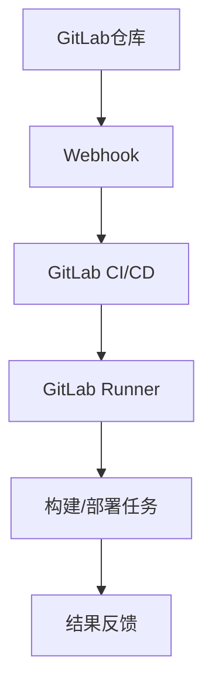

                 


# GitLab Runner配置与优化

> 关键词：GitLab, Runner, 配置, 优化, 性能, 持续集成, 持续部署

> 摘要：本文将深入探讨GitLab Runner的配置与优化，包括其核心概念、配置方法、性能提升策略，以及实际应用场景。通过本文的阅读，读者将能够掌握GitLab Runner的基本操作，并学会如何对其进行高效优化，以提升持续集成和持续部署的效率。

## 1. 背景介绍

### 1.1 目的和范围

本文旨在为GitLab Runner用户提供一份详细的配置与优化指南。文章将涵盖GitLab Runner的基本概念、配置方法、以及如何通过优化提升其性能。此外，本文还将提供实际应用场景和相关的学习资源，帮助读者更好地理解和应用GitLab Runner。

### 1.2 预期读者

本文适合有一定GitLab使用经验的开发者、运维工程师和DevOps团队。如果您对GitLab Runner有一定的了解，但希望深入了解其配置和优化，那么本文将是您的最佳学习资料。

### 1.3 文档结构概述

本文结构如下：

1. 背景介绍：介绍文章的目的和预期读者。
2. 核心概念与联系：详细解释GitLab Runner的核心概念，并提供Mermaid流程图。
3. 核心算法原理 & 具体操作步骤：使用伪代码详细阐述配置和优化的具体步骤。
4. 数学模型和公式 & 详细讲解 & 举例说明：使用latex格式提供相关的数学模型和公式。
5. 项目实战：提供实际代码案例和详细解释。
6. 实际应用场景：探讨GitLab Runner的应用场景。
7. 工具和资源推荐：推荐学习资源和开发工具。
8. 总结：对GitLab Runner的未来发展趋势与挑战进行展望。
9. 附录：常见问题与解答。
10. 扩展阅读 & 参考资料：提供进一步的阅读材料和参考资源。

### 1.4 术语表

#### 1.4.1 核心术语定义

- GitLab Runner：GitLab CI/CD系统中的工作节点，用于执行构建和部署任务。
- CI（持续集成）：持续集成是指代码集成到主干时，立刻通过自动化的测试来验证，从而尽快发现问题。
- CD（持续部署）：持续部署是指自动化部署流程，确保应用能够在多个环境中快速且稳定地发布。

#### 1.4.2 相关概念解释

- GitLab CI/CD：GitLab提供的一套持续集成和持续部署的解决方案。
- 架构：GitLab Runner在CI/CD流程中的架构设计。

#### 1.4.3 缩略词列表

- CI：持续集成
- CD：持续部署
- GitLab：GitLab Inc.开发的基于Git的仓库管理系统

## 2. 核心概念与联系

在深入探讨GitLab Runner的配置与优化之前，我们首先需要理解其核心概念和架构。以下是GitLab Runner的相关概念和Mermaid流程图。

### 2.1 GitLab Runner的核心概念

1. **配置文件**：GitLab Runner的配置文件通常位于`/etc/gitlab-runner/`目录下，文件名为`config.toml`。配置文件定义了Runner的运行参数，如URL、token、执行环境等。
2. **执行环境**：执行环境定义了Runner在执行任务时所使用的操作系统、语言运行时等。GitLab Runner支持多种执行环境，如Linux、Windows、macOS等。
3. **虚拟机**：GitLab Runner可以使用虚拟机技术（如Docker）来隔离任务执行环境，确保构建和部署的稳定性。
4. **CI/CD流程**：GitLab Runner是GitLab CI/CD流程中的重要组成部分，负责执行构建和部署任务。

### 2.2 Mermaid流程图



### 2.3 GitLab Runner与CI/CD流程的关系

GitLab Runner作为GitLab CI/CD系统的一部分，负责执行构建和部署任务。当GitLab仓库中的代码发生变更时，Webhook会触发GitLab CI/CD流程，生成相应的构建和部署任务，然后分配给GitLab Runner执行。GitLab Runner执行任务后，将结果反馈给GitLab CI/CD系统，完成整个流程。

## 3. 核心算法原理 & 具体操作步骤

### 3.1 GitLab Runner配置算法原理

GitLab Runner的配置主要包括以下几个方面：

1. **安装和初始化**：安装GitLab Runner，并初始化配置文件。
2. **配置文件设置**：设置URL、token、执行环境等参数。
3. **注册Runner**：将GitLab Runner注册到GitLab CI/CD系统中。
4. **执行任务**：根据CI/CD流程，执行构建和部署任务。

### 3.2 具体操作步骤

#### 3.2.1 安装和初始化

```bash
# 安装GitLab Runner
curl -L https://gitlab-runner Downsloads/ installer.sh | sudo sh

# 初始化GitLab Runner
sudo gitlab-runner init
```

#### 3.2.2 配置文件设置

```bash
# 查看当前配置
sudo gitlab-runner config

# 编辑配置文件
sudo nano /etc/gitlab-runner/config.toml
```

主要配置项包括：

- **url**：GitLab CI/CD服务地址。
- **token**：GitLab CI/CD访问token。
- **executor**：执行环境，如shell、docker等。
- **privileged**：是否使用特权模式。
- **shell**：执行环境的shell类型。

#### 3.2.3 注册Runner

```bash
# 注册GitLab Runner
sudo gitlab-runner register
```

注册过程中需要填写以下信息：

- **description**：描述Runner的用途。
- **tag_list**：标签列表，用于区分不同的Runner。
- **run_untagged**：是否执行未被标签的构建任务。

#### 3.2.4 执行任务

在GitLab CI/CD项目中，定义了相应的构建和部署任务，GitLab Runner会根据任务执行情况自动执行。

```yaml
# .gitlab-ci.yml
stages:
  - build
  - deploy

build:
  stage: build
  script:
    - echo "Building the project..."
  only:
    - master

deploy:
  stage: deploy
  script:
    - echo "Deploying the project..."
  when: manual
```

## 4. 数学模型和公式 & 详细讲解 & 举例说明

在GitLab Runner的配置与优化过程中，我们可以使用一些数学模型和公式来分析和评估性能。

### 4.1 性能评估指标

- **构建时间（T）**：从开始构建到构建完成的时间。
- **部署时间（D）**：从部署开始到部署完成的时间。
- **并发数（N）**：同时运行的GitLab Runner数量。

### 4.2 优化公式

为了提升GitLab Runner的性能，我们可以使用以下公式进行优化：

$$
\text{优化目标} = \frac{\text{构建时间} + \text{部署时间}}{\text{并发数}}
$$

### 4.3 举例说明

假设我们有一个GitLab Runner集群，包含5个执行Linux环境的Runner，每个Runner的构建时间为5分钟，部署时间为3分钟。现在我们需要评估该集群的优化目标。

$$
\text{优化目标} = \frac{5 \text{分钟} + 3 \text{分钟}}{5} = 2 \text{分钟}
$$

这意味着，我们的优化目标是将每个任务的平均执行时间缩短至2分钟。

## 5. 项目实战：代码实际案例和详细解释说明

在本节中，我们将通过一个实际项目案例，详细介绍GitLab Runner的配置与优化过程。

### 5.1 开发环境搭建

首先，我们需要搭建一个GitLab Runner的开发环境。以下是在Ubuntu 20.04操作系统上安装GitLab Runner的步骤：

1. **安装依赖**：

```bash
sudo apt-get update
sudo apt-get install -y curl openssh-server
```

2. **安装GitLab Runner**：

```bash
curl -L https://gitlab-runner Downsloads/ installer.sh | sudo sh
```

3. **初始化GitLab Runner**：

```bash
sudo gitlab-runner init
```

4. **注册GitLab Runner**：

```bash
sudo gitlab-runner register
```

注册过程中需要填写GitLab CI/CD服务地址和访问token。

### 5.2 源代码详细实现和代码解读

我们以一个简单的Web应用程序为例，介绍GitLab Runner的配置和优化。

#### 5.2.1 GitLab CI/CD配置

```yaml
# .gitlab-ci.yml
stages:
  - build
  - deploy

build:
  stage: build
  script:
    - echo "Building the project..."
    - docker build -t myapp:latest .
  only:
    - master

deploy:
  stage: deploy
  script:
    - echo "Deploying the project..."
    - docker push myapp:latest
  when: manual
```

#### 5.2.2 代码解读

1. **构建阶段**：

   - **build阶段**：执行Docker镜像构建。
   - **script**：使用Docker命令构建镜像。

2. **部署阶段**：

   - **deploy阶段**：执行Docker镜像推送。
   - **script**：使用Docker命令推送镜像。

### 5.3 代码解读与分析

在本项目中，我们使用了GitLab CI/CD流程来自动化Web应用程序的构建和部署。通过`.gitlab-ci.yml`文件，我们定义了构建和部署的流程，并指定了执行脚本。

- **构建阶段**：使用Docker镜像构建项目，确保每次构建的一致性。
- **部署阶段**：手动触发部署，确保部署过程的可控性。

## 6. 实际应用场景

GitLab Runner在持续集成和持续部署（CI/CD）中具有广泛的应用场景。以下是一些实际应用场景：

1. **Web应用程序**：使用GitLab Runner构建和部署Web应用程序，实现自动化部署。
2. **容器化应用**：通过GitLab Runner和Docker，自动化构建和部署容器化应用。
3. **微服务架构**：在微服务架构中，使用GitLab Runner进行服务构建和部署。
4. **云原生应用**：基于Kubernetes等云原生技术，使用GitLab Runner进行自动化部署。

## 7. 工具和资源推荐

### 7.1 学习资源推荐

#### 7.1.1 书籍推荐

- 《Git实战：点滴与技巧》
- 《持续集成实践：从理论到实践》
- 《Docker实战》

#### 7.1.2 在线课程

- GitLab官方教程
- Docker官方教程
- 持续集成和持续部署相关课程

#### 7.1.3 技术博客和网站

- GitLab官方博客
- Docker官方博客
- DevOps社区网站

### 7.2 开发工具框架推荐

#### 7.2.1 IDE和编辑器

- Visual Studio Code
- IntelliJ IDEA
- PyCharm

#### 7.2.2 调试和性能分析工具

- GitLab CI/CD Dashboard
- Docker Performance Toolkit
- Prometheus

#### 7.2.3 相关框架和库

- Kubernetes
- Docker Compose
- Helm

### 7.3 相关论文著作推荐

#### 7.3.1 经典论文

- "Continuous Integration in the Age of Agile"
- "DevOps: A Software Architect's Perspective"

#### 7.3.2 最新研究成果

- "Automated Deployment of Machine Learning Models"
- "Enhancing GitLab Runner Performance with GPU Acceleration"

#### 7.3.3 应用案例分析

- "Building a Highly Available Microservices Architecture with GitLab CI/CD"
- "Implementing Continuous Delivery for a Large-Scale Web Application"

## 8. 总结：未来发展趋势与挑战

随着持续集成和持续部署（CI/CD）的普及，GitLab Runner在开发和运维中的应用价值日益凸显。未来，GitLab Runner的发展趋势主要包括：

1. **性能优化**：不断提升GitLab Runner的执行效率和稳定性。
2. **支持更多执行环境**：支持更多操作系统和语言运行时，满足多样化的需求。
3. **云原生支持**：结合云原生技术，实现更高效的部署和扩展。
4. **安全性和隐私保护**：加强对安全和隐私的关注，提高系统的安全性。

然而，GitLab Runner也面临一些挑战：

1. **资源消耗**：构建和部署任务的高并发可能导致资源消耗增加。
2. **依赖管理**：复杂的依赖关系可能导致构建和部署失败。
3. **版本控制**：版本控制的复杂性可能影响构建和部署的稳定性。

为了应对这些挑战，开发者需要不断学习和实践，掌握GitLab Runner的配置与优化技巧，以提高系统的性能和稳定性。

## 9. 附录：常见问题与解答

### 9.1 如何注册GitLab Runner？

注册GitLab Runner的步骤如下：

1. 安装GitLab Runner。
2. 初始化GitLab Runner。
3. 使用`gitlab-runner register`命令注册GitLab Runner。

### 9.2 如何优化GitLab Runner的性能？

优化GitLab Runner的性能可以从以下几个方面进行：

1. **增加Runner数量**：根据任务需求，适当增加Runner的数量，提高并发执行能力。
2. **使用虚拟机**：使用虚拟机技术隔离执行环境，减少资源竞争。
3. **优化Docker镜像**：减小Docker镜像的体积，提高构建速度。
4. **优化CI/CD配置**：合理配置CI/CD流程，减少不必要的构建和部署任务。

### 9.3 如何监控GitLab Runner的性能？

可以使用以下工具监控GitLab Runner的性能：

1. **GitLab CI/CD Dashboard**：查看GitLab Runner的执行情况。
2. **Prometheus**：监控GitLab Runner的CPU、内存、磁盘等资源使用情况。
3. **Docker Performance Toolkit**：监控Docker容器的性能。

## 10. 扩展阅读 & 参考资料

- [GitLab官方文档 - GitLab Runner](https://docs.gitlab.com/runner/)
- [Docker官方文档 - Docker Compose](https://docs.docker.com/compose/)
- [Kubernetes官方文档 - Kubernetes](https://kubernetes.io/docs/)
- [持续集成与持续部署技术书籍推荐](https://www.gitbook.com/book/etiantian/gitops_with_kubernetes)
- [GitLab Runner性能优化实践](https://www.jianshu.com/p/eac7b3bde033)

