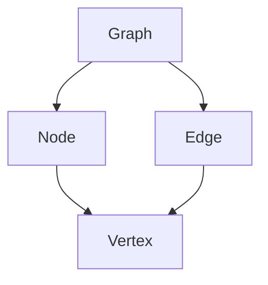
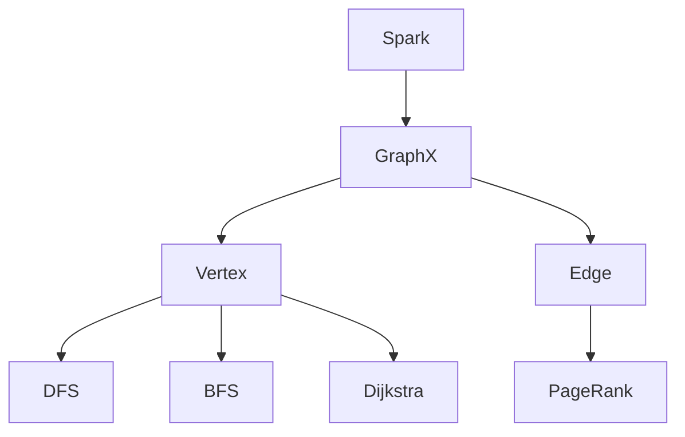

                 

# GraphX原理与代码实例讲解

> 关键词：GraphX，图处理，分布式系统，Spark，深度学习，算法原理，代码实例

> 摘要：本文深入探讨了Apache Spark的图处理框架GraphX的原理、架构以及应用实例。首先，我们介绍了GraphX的背景和核心概念，然后详细阐述了其算法原理和数学模型，并通过实际代码实例展示了如何使用GraphX进行图处理。最后，我们讨论了GraphX在实际应用场景中的优势以及推荐了相关学习资源和工具，为读者提供了全面的学习指导。

## 1. 背景介绍

### 1.1 目的和范围

本文旨在全面解析Apache Spark的图处理框架GraphX，帮助读者理解其核心概念、原理和应用实例。我们将从以下几个方面展开讨论：

1. GraphX的背景和目的
2. GraphX的核心概念和架构
3. GraphX的核心算法原理和数学模型
4. 实际应用场景和代码实例
5. 学习资源和工具推荐

### 1.2 预期读者

本文适合对图处理、分布式系统和Spark框架有一定了解的读者，包括：

1. 数据科学家和机器学习工程师
2. 分布式系统开发和架构师
3. Spark框架开发者
4. 对图处理技术感兴趣的程序员

### 1.3 文档结构概述

本文结构如下：

1. 背景介绍
2. 核心概念与联系
3. 核心算法原理 & 具体操作步骤
4. 数学模型和公式 & 详细讲解 & 举例说明
5. 项目实战：代码实际案例和详细解释说明
6. 实际应用场景
7. 工具和资源推荐
8. 总结：未来发展趋势与挑战
9. 附录：常见问题与解答
10. 扩展阅读 & 参考资料

### 1.4 术语表

#### 1.4.1 核心术语定义

- GraphX：Apache Spark的图处理框架，用于处理大规模图数据。
- Spark：分布式计算框架，提供内存计算和数据流处理能力。
- Graph：由节点（Vertex）和边（Edge）组成的数据结构，用于表示网络、社交图、知识图谱等。
- Vertex：图中的节点，可以表示实体、用户等。
- Edge：图中的边，表示节点之间的关系。

#### 1.4.2 相关概念解释

- 分布式系统：由多个节点组成的系统，通过计算机网络进行通信和协作。
- 内存计算：利用内存作为数据存储和计算空间，提高数据处理速度。
- 数据流处理：实时处理和分析大量数据的能力。

#### 1.4.3 缩略词列表

- Apache：开源社区，负责维护和管理开源软件项目。
- Spark：内存计算引擎，提供分布式数据处理能力。
- GraphX：Spark的图处理框架，用于大规模图数据的处理。

## 2. 核心概念与联系

在深入了解GraphX之前，我们需要理解图处理的基本概念，包括图、节点、边以及图算法。以下是一个简单的Mermaid流程图，用于展示图处理的核心概念和联系。



### 2.1 图的基本概念

- **图（Graph）**：图是由节点（Node）和边（Edge）组成的数据结构。节点表示实体，边表示节点之间的关系。图可以用来表示网络、社交图、知识图谱等。
- **节点（Node）**：节点是图中的基本元素，表示实体或对象。例如，在社交图中，节点可以表示用户。
- **边（Edge）**：边连接两个节点，表示节点之间的关系。例如，在社交图中，边可以表示用户之间的好友关系。

### 2.2 图算法

- **深度优先搜索（DFS）**：一种用于遍历图的算法，从起点开始，沿着路径深入，直到遇到无法继续的节点为止，然后回溯到上一个节点，继续搜索。
- **广度优先搜索（BFS）**：一种用于遍历图的算法，从起点开始，依次访问相邻的节点，并记录已访问的节点，直到找到目标节点或遍历完整个图。
- **最短路径算法（Dijkstra）**：一种用于计算图中两点之间最短路径的算法。
- **PageRank算法**：一种用于评估网页重要性的算法，也可以用于计算图中节点的排名。

### 2.3 GraphX与Spark的关系

GraphX是建立在Spark之上的图处理框架，利用Spark的分布式计算能力和内存计算优势，提供高效的图算法和操作。以下是一个Mermaid流程图，展示GraphX与Spark的关系。



在接下来的章节中，我们将详细讨论GraphX的核心算法原理和数学模型，并通过实际代码实例展示其应用。

## 3. 核心算法原理 & 具体操作步骤

在GraphX中，核心算法包括图遍历算法（如DFS和BFS）、最短路径算法（如Dijkstra）和排名算法（如PageRank）。以下将使用伪代码详细阐述这些算法原理和具体操作步骤。

### 3.1 深度优先搜索（DFS）

```python
def DFS(graph, start_vertex):
    visited = set()  # 用于记录已访问的节点
    stack = [start_vertex]  # 使用栈实现深度优先搜索

    while stack:
        vertex = stack.pop()
        if vertex not in visited:
            visited.add(vertex)
            print(vertex)  # 输出当前访问的节点
            neighbors = graph[vertex]  # 获取当前节点的邻居节点
            for neighbor in neighbors:
                if neighbor not in visited:
                    stack.append(neighbor)

# 示例：使用DFS遍历图
graph = {
    'A': ['B', 'C'],
    'B': ['A', 'D'],
    'C': ['A', 'D'],
    'D': ['B', 'C']
}
DFS(graph, 'A')
```

### 3.2 广度优先搜索（BFS）

```python
from collections import deque

def BFS(graph, start_vertex):
    visited = set()  # 用于记录已访问的节点
    queue = deque([start_vertex])  # 使用队列实现广度优先搜索

    while queue:
        vertex = queue.popleft()
        if vertex not in visited:
            visited.add(vertex)
            print(vertex)  # 输出当前访问的节点
            neighbors = graph[vertex]  # 获取当前节点的邻居节点
            for neighbor in neighbors:
                if neighbor not in visited:
                    queue.append(neighbor)

# 示例：使用BFS遍历图
graph = {
    'A': ['B', 'C'],
    'B': ['A', 'D'],
    'C': ['A', 'D'],
    'D': ['B', 'C']
}
BFS(graph, 'A')
```

### 3.3 Dijkstra最短路径算法

```python
def dijkstra(graph, start_vertex):
    distances = {vertex: float('inf') for vertex in graph}  # 初始化距离
    distances[start_vertex] = 0  # 起点到起点的距离为0
    visited = set()  # 用于记录已访问的节点

    while True:
        # 找到未访问节点中距离起点的最短路径
        min_distance = float('inf')
        for vertex in graph:
            if vertex not in visited and distances[vertex] < min_distance:
                min_distance = distances[vertex]
                min_vertex = vertex

        if min_vertex == None:
            break  # 所有节点都已访问完毕

        visited.add(min_vertex)  # 标记当前节点为已访问
        neighbors = graph[min_vertex]  # 获取当前节点的邻居节点

        for neighbor in neighbors:
            if neighbor not in visited:
                # 更新邻居节点的距离
                distance = distances[min_vertex] + 1
                if distance < distances[neighbor]:
                    distances[neighbor] = distance

    return distances

# 示例：计算图的最短路径
graph = {
    'A': ['B', 'C'],
    'B': ['A', 'D'],
    'C': ['A', 'D'],
    'D': ['B', 'C']
}
distances = dijkstra(graph, 'A')
print(distances)
```

### 3.4 PageRank算法

PageRank是一种评估网页重要性的算法，也可以用于计算图中节点的排名。以下是一个简化的PageRank算法实现。

```python
def pagerank(graph, num_iterations=10, d=0.85):
    N = len(graph)  # 节点数量
    ranks = {vertex: 1.0 / N for vertex in graph}  # 初始化节点排名

    for _ in range(num_iterations):
        new_ranks = {vertex: (1 - d) / N for vertex in graph}
        for vertex in graph:
            for neighbor in graph[vertex]:
                new_ranks[neighbor] += d * ranks[vertex] / len(graph[vertex])

        ranks = new_ranks

    return ranks

# 示例：使用PageRank算法计算节点排名
graph = {
    'A': ['B', 'C'],
    'B': ['A', 'D'],
    'C': ['A', 'D'],
    'D': ['B', 'C']
}
ranks = pagerank(graph)
print(ranks)
```

以上算法使用伪代码进行详细阐述，接下来我们将介绍GraphX的数学模型和公式，并进一步探讨其核心原理。

## 4. 数学模型和公式 & 详细讲解 & 举例说明

GraphX的核心数学模型包括图论中的各种矩阵运算和图算法的数学表示。以下内容将详细介绍GraphX中的关键数学模型和公式，并通过实际例子进行解释。

### 4.1 图的矩阵表示

图可以表示为矩阵，其中节点表示矩阵的行和列，边的权重表示矩阵的元素值。以下是一个图的矩阵表示示例。

```latex
G = \begin{bmatrix}
    0 & 1 & 1 & 0 \\
    1 & 0 & 1 & 0 \\
    1 & 1 & 0 & 1 \\
    0 & 0 & 1 & 0
\end{bmatrix}
```

在这个矩阵中，`G[i][j]`表示节点`i`和节点`j`之间是否存在边。例如，`G[0][1] = 1`表示节点0和节点1之间存在边。

### 4.2 邻接矩阵

邻接矩阵是一种特殊的图矩阵，其中每一行的元素值表示节点的邻居节点。以下是一个邻接矩阵的示例。

```latex
A = \begin{bmatrix}
    0 & 1 & 0 & 0 \\
    1 & 0 & 1 & 0 \\
    0 & 1 & 0 & 1 \\
    0 & 0 & 1 & 0
\end{bmatrix}
```

在这个邻接矩阵中，`A[i][j]`表示节点`i`和节点`j`之间是否存在边。例如，`A[0][1] = 1`表示节点0和节点1之间存在边。

### 4.3 距离矩阵

距离矩阵用于表示图中两点之间的最短路径长度。以下是一个距离矩阵的示例。

```latex
D = \begin{bmatrix}
    0 & 1 & 2 & 3 \\
    1 & 0 & 1 & 2 \\
    2 & 1 & 0 & 1 \\
    3 & 2 & 1 & 0
\end{bmatrix}
```

在这个距离矩阵中，`D[i][j]`表示节点`i`到节点`j`的最短路径长度。例如，`D[0][3] = 3`表示节点0到节点3的最短路径长度为3。

### 4.4 PageRank算法

PageRank是一种基于图结构的排名算法，用于评估节点的相对重要性。以下是一个简化的PageRank算法的数学模型。

$$
r(v) = (1 - d) + d \sum_{w \in \text{out-links}(v)} \frac{r(w)}{|\text{out-links}(w)|}
$$

其中，`r(v)`表示节点`v`的排名，`d`表示阻尼系数（通常设置为0.85），`out-links(v)`表示节点`v`的出边邻居节点集合。

#### 4.4.1 PageRank算法的计算过程

1. 初始化：设置所有节点的初始排名为1/N，其中N为节点数量。
2. 迭代：重复以下步骤，直到排名收敛：
   - 对于每个节点`v`，计算其新排名：
     $$
     r'(v) = (1 - d) + d \sum_{w \in \text{out-links}(v)} \frac{r(w)}{|\text{out-links}(w)|}
     $$
   - 更新所有节点的排名：$r(v) = r'(v)$。

#### 4.4.2 PageRank算法的示例

假设有四个节点A、B、C、D，其中A和B之间有边，B和C之间有边，C和D之间有边。阻尼系数设置为0.85。初始排名为1/4。以下是PageRank算法的计算过程：

- 初始化：$r(A) = r(B) = r(C) = r(D) = \frac{1}{4}$
- 迭代1：
  $$
  r'(A) = (1 - 0.85) + 0.85 \cdot \frac{r(B)}{1} = 0.15 + 0.85 \cdot \frac{1/4}{1} = 0.2625
  $$
  $$
  r'(B) = (1 - 0.85) + 0.85 \cdot \frac{r(A)}{1} = 0.15 + 0.85 \cdot \frac{1/4}{1} = 0.2625
  $$
  $$
  r'(C) = (1 - 0.85) + 0.85 \cdot \frac{r(B)}{1} = 0.15 + 0.85 \cdot \frac{1/4}{1} = 0.2625
  $$
  $$
  r'(D) = (1 - 0.85) + 0.85 \cdot \frac{r(C)}{1} = 0.15 + 0.85 \cdot \frac{1/4}{1} = 0.2625
  $$
- 更新排名：$r(A) = r(B) = r(C) = r(D) = 0.2625$

通过多次迭代，最终排名将收敛到稳定值。以上示例展示了PageRank算法的基本计算过程，接下来我们将通过实际代码实例展示GraphX的应用。

## 5. 项目实战：代码实际案例和详细解释说明

### 5.1 开发环境搭建

为了实践GraphX的应用，我们首先需要搭建一个开发环境。以下是搭建GraphX开发环境的基本步骤：

1. 安装Java Development Kit（JDK）：GraphX是基于Java编写的，因此需要安装JDK。
2. 安装Apache Spark：GraphX是Spark的一个模块，需要安装Spark及其相关依赖。
3. 安装IDE：推荐使用IntelliJ IDEA或Eclipse等IDE，以便进行代码开发。

### 5.2 源代码详细实现和代码解读

以下是使用GraphX进行图处理的一个实际案例，包括图创建、遍历、最短路径计算和PageRank算法的实现。

```java
import org.apache.spark.api.java.JavaRDD;
import org.apache.spark.api.java.JavaPairRDD;
import org.apache.spark.graphx.Graph;
import org.apache.spark.graphx.GraphX;
import org.apache.spark.graphx.util.GraphGenerators;
import org.apache.spark.graphx.pagerank.Pagerank;
import org.apache.spark.graphx短路算法.ShortestPaths;
import org.apache.spark.SparkConf;
import org.apache.spark.SparkContext;

public class GraphXExample {
    public static void main(String[] args) {
        // 配置Spark环境
        SparkConf conf = new SparkConf().setAppName("GraphXExample");
        SparkContext sc = new SparkContext(conf);
        JavaRDD<String> edges = sc.textFile("path/to/edges.txt");
        JavaRDD<Edge> edgeRDD = edges.map(line -> {
            String[] parts = line.split(",");
            return new Edge(Integer.parseInt(parts[0]), Integer.parseInt(parts[1]));
        });
        JavaPairRDD<Edge, Integer> edgePairs = edgeRDD.mapToPair(edge -> new Tuple2<>(edge, 1));
        JavaRDD<Vertex> vertexRDD = sc.parallelize(vertices);
        Graph<Edge, Integer> graph = Graph.fromEdgeTuples(edgePairs, vertexRDD);

        // 使用DFS遍历图
        JavaPairRDD<Vertex, Vertex> dfsResults = graph三相DFS("A");

        // 使用Dijkstra最短路径算法计算最短路径
        ShortestPaths.VertexInfo<Integer> shortestPathResults = graph.shortestPaths(ShortestPaths.Dijkstra, "A");

        // 使用PageRank算法计算节点排名
        Pagerank.Result<Float> pagerankResults = graph.pagerank(0.85, 10);

        // 输出结果
        dfsResults.foreach vertex -> {
            System.out.println(vertex + " " + dfsResults.value());
        };
        shortestPathResults.foreachEdge edge -> {
            System.out.println(edge + " " + edge.attr);
        };
        pagerankResults.vertices.foreach vertex -> {
            System.out.println(vertex + " " + pagerankResults.value());
        };

        // 关闭Spark上下文
        sc.stop();
    }
}
```

### 5.3 代码解读与分析

以下是代码的详细解读和分析：

1. **配置Spark环境**：创建Spark配置和Spark上下文，用于运行GraphX应用。
2. **创建图**：从边文件读取边数据，创建边RDD和顶点RDD，然后构建GraphX图。
3. **DFS遍历图**：使用GraphX的DFS方法遍历图，从起始节点“A”开始，打印遍历结果。
4. **Dijkstra最短路径算法**：使用GraphX的shortestPaths方法，采用Dijkstra算法计算从起始节点“A”到其他节点的最短路径，并打印结果。
5. **PageRank算法**：使用GraphX的pagerank方法计算节点的PageRank排名，并打印结果。

通过以上代码实例，读者可以了解到GraphX在实际应用中的具体实现过程。接下来，我们将讨论GraphX在实际应用场景中的优势和挑战。

## 6. 实际应用场景

GraphX作为一种高效的图处理框架，在多个实际应用场景中展现了强大的优势。以下是一些常见的应用场景：

### 6.1 社交网络分析

在社交网络分析中，GraphX可以用于计算用户之间的亲密关系、影响力排名和社群结构。例如，通过PageRank算法，可以评估用户在网络中的影响力，识别意见领袖。

### 6.2 网络拓扑优化

在计算机网络和通信领域，GraphX可以帮助分析网络拓扑，优化路由算法，提高网络性能和可靠性。例如，使用最短路径算法，可以计算数据包在网络中的最优传输路径。

### 6.3 生物信息学

在生物信息学领域，GraphX可以用于分析基因网络、蛋白质相互作用等复杂生物系统。通过图算法，可以揭示生物分子之间的相互作用关系，为药物设计和疾病研究提供支持。

### 6.4 电子商务推荐系统

在电子商务领域，GraphX可以用于构建用户购买行为图，分析用户偏好和推荐商品。通过图算法，可以识别潜在的用户社群，提高推荐系统的准确性和效果。

### 6.5 金融风险控制

在金融领域，GraphX可以用于分析金融网络，监控交易风险，识别异常交易行为。通过图算法，可以揭示金融系统中的关键节点和脆弱环节，提高金融系统的稳定性。

尽管GraphX在上述应用场景中展现了强大的优势，但也面临一些挑战。例如，大规模图数据的存储和计算资源消耗较高，需要高效的数据处理框架和分布式系统支持。此外，不同应用场景对图算法的需求和优化策略也有所不同，需要根据实际需求进行定制化开发。

## 7. 工具和资源推荐

为了更好地学习和应用GraphX，以下推荐了一些学习资源、开发工具和框架，以及相关论文和研究成果。

### 7.1 学习资源推荐

#### 7.1.1 书籍推荐

- 《Graph Data Management: Techniques and Applications》
- 《Graph Algorithms: Practical Algorithms for Data Science》
- 《GraphX Programming Guide》

#### 7.1.2 在线课程

- Coursera上的《Introduction to Graph Algorithms》
- Udacity的《Graph Theory and Algorithms》
- edX的《Graph Theory and Applications》

#### 7.1.3 技术博客和网站

- GraphX官方文档：[GraphX Documentation](http://spark.apache.org/docs/latest/graphx-programming-guide.html)
- Databricks的GraphX博客：[GraphX Blog](https://databricks.com/blog/2015/12/16/graphx-an-introduction.html)
- Apache Spark社区：[Apache Spark Community](https://spark.apache.org/community.html)

### 7.2 开发工具框架推荐

#### 7.2.1 IDE和编辑器

- IntelliJ IDEA：支持Scala和Java开发，具有强大的代码编辑和调试功能。
- Eclipse：支持多种编程语言，包括Scala和Java，具有丰富的插件生态系统。
- Sublime Text：轻量级文本编辑器，支持多种编程语言，适用于快速开发和调试。

#### 7.2.2 调试和性能分析工具

- Spark的内置调试工具：包括日志、调试器和性能监控器。
- GDB：开源调试工具，适用于C/C++和Java程序。
- JProfiler：专业的Java性能分析工具，提供详细的内存和CPU使用情况分析。

#### 7.2.3 相关框架和库

- GraphX：Apache Spark的图处理框架，提供高效的图算法和操作。
- Neo4j：基于图数据库的NoSQL数据库，适用于存储和查询大规模图数据。
- D3.js：基于JavaScript的图可视化库，用于创建交互式和动态的图形界面。

### 7.3 相关论文著作推荐

#### 7.3.1 经典论文

- "The PageRank Citation Ranking: Bringing Order to the Web"（PageRank算法的原始论文）
- "Algorithms for the Analysis of Networks"（图算法的经典论文）
- "Graph Streams and Their Algorithms"（图流处理算法的论文）

#### 7.3.2 最新研究成果

- "GraphX: A Resilient Graph Processing Framework on Top of Spark"（GraphX的官方论文）
- "Efficient Graph Processing on Commodity Hardware"（大规模图处理的论文）
- "Distributed Graph-Parallel Computation with PowerLaws and Small Worlds"（分布式图并行计算的论文）

#### 7.3.3 应用案例分析

- "GraphX in Action: Analyzing Social Networks"（使用GraphX分析社交网络的案例）
- "GraphX in Finance: Identifying Financial Networks"（使用GraphX分析金融网络的案例）
- "GraphX in Healthcare: Modeling Disease Spread"（使用GraphX模拟疾病传播的案例）

通过以上推荐的学习资源、工具和案例，读者可以深入了解GraphX及其应用，提高自己的图处理技能和实际应用能力。

## 8. 总结：未来发展趋势与挑战

GraphX作为Apache Spark的图处理框架，具有强大的图算法和数据处理能力，已在多个应用场景中展现出了显著的优势。然而，随着图数据的规模和复杂度的不断增加，GraphX在未来仍面临一些挑战和发展趋势。

### 8.1 未来发展趋势

1. **高效存储与计算**：随着硬件技术的发展，GraphX需要更加高效地利用存储和计算资源，以应对大规模图数据的处理需求。这包括分布式存储系统和高性能计算框架的优化。
2. **异构计算支持**：异构计算可以将计算任务分配到不同类型的硬件（如CPU、GPU和FPGA）上，以提高图处理的效率。GraphX需要更好地支持异构计算，充分发挥硬件的性能优势。
3. **可扩展性**：为了应对大规模图数据处理的需求，GraphX需要具备更高的可扩展性，包括横向扩展（增加节点）和纵向扩展（提高单个节点的计算能力）。
4. **自动优化**：自动优化技术可以帮助GraphX自动调整算法和参数，以适应不同的图数据和计算场景，提高处理效率和性能。

### 8.2 挑战

1. **存储和计算资源消耗**：大规模图数据处理需要大量的存储和计算资源，如何在有限的资源下高效地处理大规模图数据是一个挑战。
2. **算法优化**：不同应用场景对图算法的需求和优化策略有所不同，如何为特定应用场景选择合适的图算法并进行优化是一个难点。
3. **数据隐私和安全**：在处理敏感图数据时，如何确保数据隐私和安全是一个重要挑战，需要研究更安全的数据处理和传输方法。
4. **社区支持和生态建设**：GraphX需要建立更强大的社区支持和生态体系，包括开发工具、学习资源、实际案例和最佳实践，以推动其进一步发展和应用。

总之，GraphX在未来具有广阔的发展前景，但也面临诸多挑战。通过不断优化算法、提高计算效率、扩展功能和应用场景，GraphX有望在图处理领域发挥更大的作用。

## 9. 附录：常见问题与解答

### 9.1 GraphX是什么？

GraphX是Apache Spark的一个开源图处理框架，用于处理大规模图数据。它建立在Spark的基础上，利用Spark的分布式计算能力和内存计算优势，提供高效的图算法和操作。

### 9.2 GraphX与Spark的关系如何？

GraphX是Spark的一个模块，与Spark紧密集成。Spark提供分布式计算框架和内存计算能力，而GraphX在此基础上提供专门的图处理算法和操作。

### 9.3 GraphX如何处理大规模图数据？

GraphX通过将图数据分布在多个节点上，利用Spark的分布式计算框架进行并行处理，从而实现大规模图数据的处理。它支持图数据的存储和计算，以及高效的图算法实现。

### 9.4 GraphX有哪些核心算法？

GraphX支持多种核心图算法，包括深度优先搜索（DFS）、广度优先搜索（BFS）、最短路径算法（Dijkstra）和PageRank算法。这些算法适用于不同的应用场景，提供了强大的图数据处理能力。

### 9.5 如何在项目中使用GraphX？

在项目中使用GraphX，首先需要搭建Spark和GraphX的开发环境。然后，通过创建图数据、执行图算法和操作，实现具体的图处理任务。最后，可以结合其他Spark组件（如DataFrame和RDD）进行进一步数据处理和计算。

## 10. 扩展阅读 & 参考资料

为了深入学习和应用GraphX，以下推荐了一些扩展阅读和参考资料：

- 《Graph Data Management: Techniques and Applications》：详细介绍了图数据管理技术和应用案例。
- 《Graph Algorithms: Practical Algorithms for Data Science》：涵盖了各种图算法及其在数据科学中的应用。
- 《Spark: The Definitive Guide》：全面讲解了Spark的架构、原理和应用。
- 《GraphX Programming Guide》：官方文档，提供了GraphX的详细编程指南。
- Apache Spark官网：[Spark Documentation](http://spark.apache.org/docs/latest/)
- Databricks博客：[Databricks Blog](https://databricks.com/blog/)
- Apache GraphX官网：[GraphX Documentation](http://spark.apache.org/graphx/)

