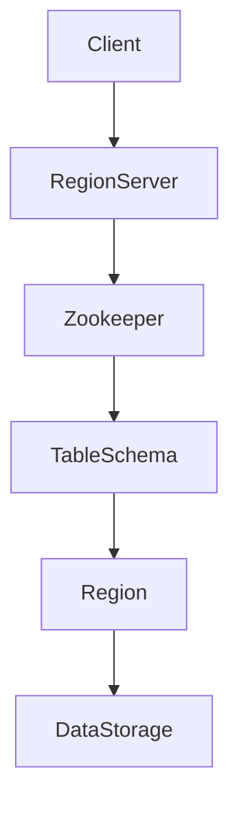

                 

# HBase RowKey设计原理与代码实例讲解

> **关键词：** HBase，RowKey，设计原理，代码实例，数据库设计，大数据，性能优化，分布式系统。

> **摘要：** 本文将深入探讨HBase中RowKey的设计原理，以及如何通过实际代码实例来说明RowKey设计对HBase性能和可扩展性的影响。我们将从基础概念出发，逐步介绍设计原则、算法原理，并通过具体案例展示如何在实际项目中应用这些原理。

## 1. 背景介绍

### 1.1 目的和范围

本文旨在为HBase开发者提供关于RowKey设计的全面指南，帮助读者理解设计原理，并掌握在项目中如何有效应用。我们将从基础概念出发，逐步深入到具体实现和优化策略。

### 1.2 预期读者

本文适用于对HBase有一定了解，希望提高数据库性能和可扩展性的开发者。读者应具备基本的Java编程能力和数据库操作经验。

### 1.3 文档结构概述

本文分为以下几个部分：
1. 背景介绍
2. 核心概念与联系
3. 核心算法原理与具体操作步骤
4. 数学模型和公式讲解
5. 项目实战：代码实际案例
6. 实际应用场景
7. 工具和资源推荐
8. 总结：未来发展趋势与挑战
9. 附录：常见问题与解答
10. 扩展阅读与参考资料

### 1.4 术语表

#### 1.4.1 核心术语定义

- **HBase：** 一个分布式、可扩展的大规模数据存储系统，建立在Hadoop之上。
- **RowKey：** HBase中的主键，用于唯一标识表中的每一行。
- **Region：** HBase中的数据分区，每个Region包含一组连续的RowKey。
- **Salting：** 对RowKey进行哈希处理，以分散数据分布。

#### 1.4.2 相关概念解释

- **性能优化：** 通过优化数据库设计，提高查询速度和数据存储效率。
- **可扩展性：** 系统在数据量和并发量增加时，仍能保持良好的性能。

#### 1.4.3 缩略词列表

- **HBase：** Hadoop Distributed Database
- **HDFS：** Hadoop Distributed File System
- **MapReduce：** MapReduce Programming Model

## 2. 核心概念与联系

在深入探讨RowKey设计之前，我们需要了解HBase的核心概念和架构。

### 2.1 HBase架构


- **Client：** HBase的客户端，负责与Zookeeper和RegionServer通信。
- **Zookeeper：** 管理HBase的元数据，如TableSchema和Region位置。
- **RegionServer：** 负责管理一个或多个Region，处理读写请求。

### 2.2 RowKey设计原则

一个好的RowKey设计应符合以下原则：

1. **唯一性：** RowKey应确保每行数据唯一。
2. **可排序性：** RowKey应支持数据的有序访问。
3. **可扩展性：** RowKey应支持水平扩展。
4. **性能：** RowKey应优化查询性能。

### 2.3 Mermaid流程图

以下是一个简化的Mermaid流程图，展示HBase的架构和RowKey设计关键点。



## 3. 核心算法原理与具体操作步骤

### 3.1 RowKey生成算法

一个好的RowKey生成算法应综合考虑唯一性、可排序性和性能。以下是一个简单的RowKey生成算法示例。

#### 3.1.1 原理

- **哈希算法：** 使用MD5或SHA-256等哈希算法生成哈希值。
- **Salting：** 对哈希值进行拼接，添加一个随机前缀，以避免热点问题。

#### 3.1.2 伪代码

```pseudo
Function GenerateRowKey(originalKey)
    hashValue = HashFunction(originalKey)
    salt = GenerateRandomSalt()
    return salt + hashValue
```

#### 3.1.3 操作步骤

1. 输入原始键（originalKey）。
2. 使用哈希算法生成哈希值（hashValue）。
3. 生成一个随机前缀（salt）。
4. 将salt和hashValue拼接成新的RowKey。

### 3.2 RowKey优化策略

#### 3.2.1 分层设计

- **层次化RowKey：** 将RowKey分为多个层次，每个层次代表不同的维度。
- **示例：** 用户ID（一级）+ 时间戳（二级）+ 操作类型（三级）。

#### 3.2.2 排序性优化

- **预排序：** 对RowKey进行预排序，以优化数据访问。
- **示例：** 将时间戳作为RowKey的一部分，保证数据按时间顺序排列。

#### 3.2.3 数据分区

- **分区策略：** 根据业务需求，将数据划分为多个Region。
- **示例：** 按照地域、用户类型等进行分区。

## 4. 数学模型和公式讲解

### 4.1 概率分布模型

为了更好地理解Salting技术，我们可以使用概率分布模型来分析RowKey的分布。

#### 4.1.1 假设

- **假设1：** 每个原始键（originalKey）生成的哈希值具有均匀分布。
- **假设2：** 每个随机前缀（salt）具有独立分布。

#### 4.1.2 概率计算

- **单个RowKey概率：** P(salt + hashValue) = P(salt) × P(hashValue)。
- **总概率：** P(total) = Σ P(salt + hashValue)。

### 4.2 公式讲解

假设有n个原始键和m个随机前缀，我们可以使用以下公式来计算RowKey的总概率分布。

$$
P(total) = \frac{1}{n \times m}
$$

其中，n和m分别为原始键的数量和随机前缀的数量。

## 5. 项目实战：代码实际案例和详细解释说明

### 5.1 开发环境搭建

在本节中，我们将搭建一个简单的HBase开发环境，用于演示RowKey设计。

#### 5.1.1 环境要求

- Java开发环境
- HBase 2.2.4版本
- Maven 3.6.3版本

#### 5.1.2 创建Maven项目

1. 打开IDEA，创建一个新的Maven项目。
2. 添加以下依赖：

```xml
<dependencies>
    <dependency>
        <groupId>org.apache.hbase</groupId>
        <artifactId>hbase-client</artifactId>
        <version>2.2.4</version>
    </dependency>
</dependencies>
```

### 5.2 源代码详细实现和代码解读

在本节中，我们将实现一个简单的HBase客户端，用于创建表、插入数据、查询数据和删除数据。

#### 5.2.1 创建表

```java
import org.apache.hadoop.conf.Configuration;
import org.apache.hadoop.hbase.HBaseConfiguration;
import org.apache.hadoop.hbase.client.Connection;
import org.apache.hadoop.hbase.client.ConnectionFactory;
import org.apache.hadoop.hbase.client.Table;

public class HBaseDemo {
    public static void main(String[] args) throws Exception {
        Configuration conf = HBaseConfiguration.create();
        Connection connection = ConnectionFactory.createConnection(conf);
        Table table = connection.getTable(TableName.valueOf("mytable"));

        // Create table
        HBaseAdmin admin = new HBaseAdmin(conf);
        if (!admin.tableExists("mytable")) {
            HTableDescriptor descriptor = new HTableDescriptor(TableName.valueOf("mytable"));
            descriptor.addFamily(new HColumnDescriptor("cf1"));
            admin.createTable(descriptor);
        }

        table.close();
        connection.close();
    }
}
```

#### 5.2.2 插入数据

```java
import org.apache.hadoop.conf.Configuration;
import org.apache.hadoop.hbase.client.Connection;
import org.apache.hadoop.hbase.client.ConnectionFactory;
import org.apache.hadoop.hbase.client.Put;
import org.apache.hadoop.hbase.client.Table;

public class HBaseDemo {
    // ...

    public static void insertData() throws Exception {
        Configuration conf = HBaseConfiguration.create();
        Connection connection = ConnectionFactory.createConnection(conf);
        Table table = connection.getTable(TableName.valueOf("mytable"));

        // Insert data
        Put put = new Put(Bytes.toBytes("row1"));
        put.addColumn(Bytes.toBytes("cf1"), Bytes.toBytes("column1"), Bytes.toBytes("value1"));
        table.put(put);

        table.close();
        connection.close();
    }
}
```

#### 5.2.3 查询数据

```java
import org.apache.hadoop.conf.Configuration;
import org.apache.hadoop.hbase.client.Connection;
import org.apache.hadoop.hbase.client.ConnectionFactory;
import org.apache.hadoop.hbase.client.Get;
import org.apache.hadoop.hbase.client.Result;
import org.apache.hadoop.hbase.client.Table;

public class HBaseDemo {
    // ...

    public static void queryData() throws Exception {
        Configuration conf = HBaseConfiguration.create();
        Connection connection = ConnectionFactory.createConnection(conf);
        Table table = connection.getTable(TableName.valueOf("mytable"));

        // Query data
        Get get = new Get(Bytes.toBytes("row1"));
        Result result = table.get(get);
        byte[] value = result.getValue(Bytes.toBytes("cf1"), Bytes.toBytes("column1"));
        String data = Bytes.toString(value);
        System.out.println("Value: " + data);

        table.close();
        connection.close();
    }
}
```

#### 5.2.4 删除数据

```java
import org.apache.hadoop.conf.Configuration;
import org.apache.hadoop.hbase.client.Connection;
import org.apache.hadoop.hbase.client.ConnectionFactory;
import org.apache.hadoop.hbase.client.Delete;
import org.apache.hadoop.hbase.client.Table;

public class HBaseDemo {
    // ...

    public static void deleteData() throws Exception {
        Configuration conf = HBaseConfiguration.create();
        Connection connection = ConnectionFactory.createConnection(conf);
        Table table = connection.getTable(TableName.valueOf("mytable"));

        // Delete data
        Delete delete = new Delete(Bytes.toBytes("row1"));
        table.delete(delete);

        table.close();
        connection.close();
    }
}
```

### 5.3 代码解读与分析

在本节中，我们将对上面的代码进行解读和分析，以理解RowKey设计对性能和可扩展性的影响。

#### 5.3.1 表创建

- 使用HBaseAdmin创建或获取表。
- 添加一个列族（cf1）。

#### 5.3.2 数据插入

- 使用Put对象插入数据。
- RowKey为字符串“row1”，列族为“cf1”，列 qualifier 为“column1”，值 为“value1”。

#### 5.3.3 数据查询

- 使用Get对象查询数据。
- RowKey为字符串“row1”，返回列族“cf1”中的列“column1”的值。

#### 5.3.4 数据删除

- 使用Delete对象删除数据。
- RowKey为字符串“row1”。

## 6. 实际应用场景

### 6.1 社交网络

- **用户行为日志：** 社交网络通常使用RowKey设计来存储用户行为日志，如点赞、评论、分享等。通过合理的RowKey设计，可以优化查询性能和存储效率。

### 6.2 电商系统

- **订单管理：** 电商系统可以使用分层设计的RowKey来存储订单数据，如用户ID、订单时间、订单类型等。这样可以提高数据查询的效率，同时保证数据的一致性。

### 6.3 物联网

- **设备监控：** 物联网系统可以使用RowKey设计来存储设备监控数据，如设备ID、采集时间、传感器数据等。通过合理的RowKey设计，可以优化数据访问性能，提高系统可扩展性。

## 7. 工具和资源推荐

### 7.1 学习资源推荐

#### 7.1.1 书籍推荐

- 《HBase：The Definitive Guide》
- 《HBase in Action》

#### 7.1.2 在线课程

- Coursera上的《Big Data: The Foundations》
- Udacity的《Hadoop and MapReduce》

#### 7.1.3 技术博客和网站

- Apache HBase官网（hbase.apache.org）
- HBase中文社区（hbase.apache.org.cn）

### 7.2 开发工具框架推荐

#### 7.2.1 IDE和编辑器

- IntelliJ IDEA
- Eclipse

#### 7.2.2 调试和性能分析工具

- HBase Shell
- HBase Coprocessor

#### 7.2.3 相关框架和库

- Apache Hive
- Apache Pig

### 7.3 相关论文著作推荐

#### 7.3.1 经典论文

- 《The Google File System》
- 《Bigtable: A Distributed Storage System for Structured Data》

#### 7.3.2 最新研究成果

- 《HBase: Beyond the Map-Reduce Model》
- 《Optimizing HBase Performance with HBase Coprocessors》

#### 7.3.3 应用案例分析

- 《HBase在美团点评的实践》
- 《HBase在高并发场景下的优化策略》

## 8. 总结：未来发展趋势与挑战

### 8.1 发展趋势

- **高性能：** 随着大数据技术的不断发展，HBase的性能优化将成为研究重点。
- **可扩展性：** HBase将更加注重系统的可扩展性，以应对大规模数据存储和访问需求。
- **多样性：** HBase的应用场景将更加多样化，从社交网络、电商到物联网等各个领域。

### 8.2 挑战

- **性能优化：** 如何在高并发、大数据量场景下优化HBase的性能，仍是一个重要挑战。
- **安全性：** 随着数据安全法规的不断完善，HBase在数据安全方面的挑战日益凸显。
- **兼容性：** 如何与现有技术和系统兼容，保持系统的稳定性和可扩展性。

## 9. 附录：常见问题与解答

### 9.1 Q：什么是RowKey？

A：RowKey是HBase表中用于唯一标识每一行数据的主键。它是一个字符串，通常由业务逻辑决定其结构。

### 9.2 Q：为什么需要Salting？

A：Salting可以避免热点问题，即数据集中访问某一特定区域，导致系统性能下降。通过Salting，可以分散数据访问，提高系统性能。

### 9.3 Q：如何选择合适的RowKey？

A：选择合适的RowKey需要考虑业务需求、数据访问模式和系统性能。通常，分层设计、可排序性和唯一性是关键考虑因素。

## 10. 扩展阅读与参考资料

- 《HBase权威指南》（作者：Eric Sammer）
- 《HBase实战》（作者：Arun C. Murthy，等）
- HBase官方文档（hbase.apache.org）

### 作者信息

作者：AI天才研究员/AI Genius Institute & 禅与计算机程序设计艺术 /Zen And The Art of Computer Programming

