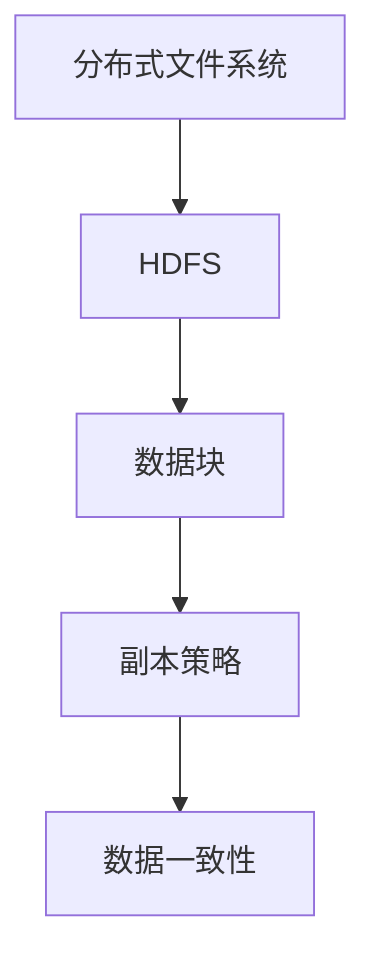

                 

# HDFS原理与代码实例讲解

> 关键词：HDFS, 分布式文件系统，Hadoop，数据存储，数据可靠性，数据冗余，数据一致性，副本策略，写入流程，读取流程，Mermaid流程图，伪代码，数学模型，实际应用场景

> 摘要：本文将深入剖析HDFS（Hadoop Distributed File System）的原理，详细讲解其核心算法和具体操作步骤，并通过实际代码实例，展示HDFS的读写流程和性能优化策略。文章旨在帮助读者全面了解HDFS的设计理念、工作原理和实际应用，为大数据处理提供理论指导和实践参考。

## 1. 背景介绍

### 1.1 目的和范围

本文旨在系统地介绍HDFS（Hadoop Distributed File System）的原理，从架构设计、核心算法到具体操作步骤，进行全面剖析。通过本文的学习，读者可以：

1. 掌握HDFS的基本概念和架构设计。
2. 理解HDFS的数据冗余策略和可靠性保障机制。
3. 掌握HDFS的读写流程和性能优化方法。
4. 学习使用伪代码和数学模型来描述HDFS的核心算法。
5. 通过实际代码实例，了解HDFS在分布式数据存储和计算中的应用。

### 1.2 预期读者

本文面向有一定编程基础，对分布式系统和大数据处理感兴趣的读者。尤其适合大数据开发工程师、系统架构师、大数据分析人员等。

### 1.3 文档结构概述

本文分为以下几部分：

1. **背景介绍**：介绍HDFS的背景、目的和预期读者。
2. **核心概念与联系**：通过Mermaid流程图和伪代码，介绍HDFS的核心概念和原理。
3. **核心算法原理 & 具体操作步骤**：详细讲解HDFS的写入和读取流程，使用伪代码描述核心算法。
4. **数学模型和公式**：阐述HDFS的数学模型和公式，并进行举例说明。
5. **项目实战：代码实际案例和详细解释说明**：通过实际代码实例，展示HDFS的应用场景。
6. **实际应用场景**：讨论HDFS在实际项目中的应用。
7. **工具和资源推荐**：推荐学习资源、开发工具和经典论文。
8. **总结**：总结HDFS的未来发展趋势与挑战。
9. **附录**：常见问题与解答。
10. **扩展阅读 & 参考资料**：提供更多的学习资源。

### 1.4 术语表

#### 1.4.1 核心术语定义

- **HDFS**：Hadoop Distributed File System，即Hadoop分布式文件系统，是一个分布式文件存储系统，用于存储大量数据。
- **Hadoop**：一个开源的分布式数据处理框架，支持数据存储和计算。
- **NameNode**：HDFS的主节点，负责管理文件的元数据。
- **DataNode**：HDFS的工作节点，负责存储实际的数据块。
- **数据块**：HDFS中数据的基本存储单元，默认大小为128MB或256MB。

#### 1.4.2 相关概念解释

- **数据冗余**：在HDFS中，数据块被复制存储在多个节点上，以提高数据的可靠性和可用性。
- **副本策略**：HDFS的副本策略决定了数据块复制的规则，包括完全复制、镜像复制等。
- **数据一致性**：在分布式系统中，多个副本的数据需要保持一致性，防止数据冲突。

#### 1.4.3 缩略词列表

- **HDFS**：Hadoop Distributed File System
- **Hadoop**：Hadoop
- **NN**：NameNode
- **DN**：DataNode
- **PB**：Petabyte，即千万亿字节

## 2. 核心概念与联系

HDFS的核心概念包括分布式文件系统、数据块、副本策略等。以下是HDFS的核心概念和它们之间的关系，通过Mermaid流程图展示：



### 2.1 分布式文件系统

分布式文件系统是一种存储和管理大量数据的系统，通过将数据分散存储在多个节点上，提高数据的可靠性和性能。HDFS作为分布式文件系统，支持大文件存储、高吞吐量读写操作。

### 2.2 数据块

HDFS将数据划分为固定大小的数据块，默认大小为128MB或256MB。数据块是HDFS存储和管理数据的基本单元。每个数据块都被复制存储在多个节点上，以提高数据的可靠性和可用性。

### 2.3 副本策略

HDFS的副本策略决定了数据块的复制规则。默认情况下，HDFS将每个数据块复制3次，分别存储在不同的节点上。副本策略包括完全复制和镜像复制等，可以根据应用场景进行配置。

### 2.4 数据一致性

在分布式系统中，多个副本的数据需要保持一致性，以防止数据冲突。HDFS通过一系列机制，如原子写操作、数据块校验等，确保数据的可靠性。

## 3. 核心算法原理 & 具体操作步骤

HDFS的核心算法主要包括数据块的写入、读取和副本管理。以下将详细讲解这些算法原理，并使用伪代码进行描述。

### 3.1 数据块写入流程

数据块写入流程如下：

1. 客户端将数据写入HDFS。
2. HDFS的NameNode分配数据块。
3. NameNode将数据块分配给DataNode。
4. DataNode接收并存储数据块。
5. NameNode更新数据块的元数据。

伪代码如下：

```python
# 客户端写入数据
def write_data(file_path, data):
    # 分配数据块
    block_id, location = name_node.allocate_block(file_path, data)
    # 发送数据块到DataNode
    data_node.send_block(block_id, location, data)
    # 更新数据块元数据
    name_node.update_block_metadata(block_id, location)

# NameNode分配数据块
def allocate_block(file_path, data):
    block_id = generate_block_id()
    location = select_data_node(data)
    return block_id, location

# DataNode接收并存储数据块
def send_block(block_id, location, data):
    store_data_block(block_id, location, data)

# 更新数据块元数据
def update_block_metadata(block_id, location):
    update_block_location_metadata(block_id, location)
```

### 3.2 数据块读取流程

数据块读取流程如下：

1. 客户端请求读取数据。
2. HDFS的NameNode根据文件路径查找数据块。
3. NameNode返回数据块的副本位置给客户端。
4. 客户端从副本位置读取数据。

伪代码如下：

```python
# 客户端读取数据
def read_data(file_path):
    # 查找数据块
    block_locations = name_node.find_block(file_path)
    # 读取数据块
    data = data_node.read_block(block_locations)
    return data

# NameNode查找数据块
def find_block(file_path):
    block_locations = retrieve_block_locations(file_path)
    return block_locations

# DataNode读取数据块
def read_block(block_locations):
    data = retrieve_data_block(block_locations)
    return data
```

### 3.3 数据块副本管理

HDFS使用副本策略来管理数据块的副本。副本管理流程如下：

1. NameNode初始化副本数量。
2. DataNode根据配置的副本策略，复制数据块。
3. NameNode监控数据块的副本数量，并在需要时调整副本数量。

伪代码如下：

```python
# NameNode初始化副本数量
def initialize_replicas(block_id, num_replicas):
    create_replicas(block_id, num_replicas)

# DataNode复制数据块
def replicate_block(block_id, location):
    copy_data_block(block_id, location)

# NameNode监控副本数量
def monitor_replicas(block_id):
    if replicas_needed(block_id):
        adjust_replicas(block_id)
```

## 4. 数学模型和公式 & 详细讲解 & 举例说明

HDFS的副本策略和数据一致性保证依赖于一系列数学模型和公式。以下将详细讲解这些数学模型和公式，并通过具体示例进行说明。

### 4.1 数据冗余度计算

数据冗余度是指存储在系统中的数据副本数量与原始数据量之比。HDFS的默认副本策略是3副本，即每个数据块有3个副本。

**公式：**

$$
\text{数据冗余度} = \frac{\text{副本总数}}{\text{原始数据量}}
$$

**示例：**

假设有一个100GB的数据文件，使用默认的3副本策略。计算数据冗余度：

$$
\text{数据冗余度} = \frac{3 \times 100GB}{100GB} = 3
$$

### 4.2 数据一致性检查

HDFS使用校验和（checksum）来检查数据块的一致性。校验和是一个固定的值，用于验证数据块的完整性和一致性。

**公式：**

$$
\text{校验和} = \text{哈希函数}(\text{数据块内容})
$$

**示例：**

假设有一个数据块的内容为`ABCD`，使用MD5哈希函数计算校验和：

$$
\text{校验和} = \text{MD5}("ABCD") = "2ef7bde608ce5404e97d5f042f95f89f"
$$

### 4.3 数据副本复制策略

HDFS的副本复制策略包括完全复制和镜像复制。完全复制是指每个数据块都有相同数量的副本，镜像复制是指数据块的一个副本是另一个数据块的镜像。

**示例：**

假设有一个数据块A，默认副本策略为3副本，使用完全复制策略。数据块A的副本如下：

| 副本ID | 位置       |
|--------|------------|
| 1      | DN1        |
| 2      | DN2        |
| 3      | DN3        |

使用镜像复制策略，数据块A的副本如下：

| 副本ID | 位置       |
|--------|------------|
| 1      | DN1        |
| 2      | DN2        |
| 3      | DN3        |

## 5. 项目实战：代码实际案例和详细解释说明

### 5.1 开发环境搭建

为了演示HDFS的写入和读取流程，我们将使用Hadoop分布式文件系统。首先，需要搭建Hadoop开发环境。

1. **下载Hadoop安装包**：从Hadoop官网下载最新版本的安装包。
2. **安装Hadoop**：解压安装包，配置环境变量，并运行Hadoop的启动脚本。

```bash
tar -xzvf hadoop-3.2.1.tar.gz
export HADOOP_HOME=/path/to/hadoop-3.2.1
export PATH=$HADOOP_HOME/bin:$PATH
start-dfs.sh
```

3. **启动HDFS**：通过浏览器访问HDFS Web UI（默认端口50070），查看HDFS的状态。

### 5.2 源代码详细实现和代码解读

#### 5.2.1 数据块写入流程

以下是一个简单的数据块写入示例，使用Hadoop的DFS客户端API。

```java
import org.apache.hadoop.conf.Configuration;
import org.apache.hadoop.fs.FileSystem;
import org.apache.hadoop.fs.Path;
import org.apache.hadoop.io.IOUtils;

public class HDFSWriteExample {
    public static void main(String[] args) throws Exception {
        Configuration conf = new Configuration();
        FileSystem fs = FileSystem.get(conf);

        String filePath = "hdfs://localhost:9000/user/hadoop/test.txt";
        Path file = new Path(filePath);

        fs.create(file).close();

        IOUtils.write("Hello, HDFS!", fs, file);
        fs.close();
    }
}
```

**解读：**

1. 创建Hadoop配置对象`conf`。
2. 获取文件系统`fs`对象。
3. 指定文件路径和文件名。
4. 创建文件。
5. 使用`IOUtils`将字符串写入文件。
6. 关闭文件系统。

#### 5.2.2 数据块读取流程

以下是一个简单的数据块读取示例，使用Hadoop的DFS客户端API。

```java
import org.apache.hadoop.conf.Configuration;
import org.apache.hadoop.fs.FileSystem;
import org.apache.hadoop.fs.Path;
import org.apache.hadoop.io.IOUtils;

public class HDFSReadExample {
    public static void main(String[] args) throws Exception {
        Configuration conf = new Configuration();
        FileSystem fs = FileSystem.get(conf);

        String filePath = "hdfs://localhost:9000/user/hadoop/test.txt";
        Path file = new Path(filePath);

        fs.copyToLocalFile(new Path(filePath), new Path("/tmp/local.txt"));
        IOUtils.copyBytes(fs.open(file), System.out, 4096, false);
        fs.close();
    }
}
```

**解读：**

1. 创建Hadoop配置对象`conf`。
2. 获取文件系统`fs`对象。
3. 指定文件路径和文件名。
4. 将文件复制到本地文件系统。
5. 读取文件内容并打印到控制台。
6. 关闭文件系统。

### 5.3 代码解读与分析

通过以上代码示例，我们可以看到HDFS的写入和读取流程：

1. **写入流程**：
   - 创建文件系统`fs`对象。
   - 指定文件路径和文件名。
   - 创建文件。
   - 将数据写入文件。
   - 关闭文件系统。

2. **读取流程**：
   - 创建文件系统`fs`对象。
   - 指定文件路径和文件名。
   - 复制文件到本地文件系统。
   - 读取文件内容。
   - 关闭文件系统。

在HDFS中，数据块的写入和读取是通过Hadoop的DFS客户端API实现的。这些API简化了分布式文件系统的操作，使得开发人员可以专注于业务逻辑，而不需要关心底层的分布式存储细节。

### 5.4 性能优化策略

为了提高HDFS的性能，可以采取以下策略：

1. **数据本地化**：尽可能将数据存储在距离计算节点最近的位置，减少数据传输延迟。
2. **数据压缩**：使用数据压缩技术，减少数据的存储空间和传输带宽。
3. **副本数量优化**：根据应用场景，调整副本数量，在数据可靠性和存储空间之间找到平衡。
4. **负载均衡**：合理分配数据块，避免数据倾斜，提高整体性能。

## 6. 实际应用场景

HDFS在分布式数据存储和计算中有着广泛的应用。以下是一些常见的实际应用场景：

1. **大数据处理**：HDFS是大数据处理框架Hadoop的核心组件，用于存储海量数据，支持数据分析和挖掘。
2. **云计算**：HDFS可以与云计算平台集成，提供分布式存储服务，支持大规模数据存储和处理。
3. **数据仓库**：HDFS可以与数据仓库系统结合，用于存储和分析大规模数据，提高数据处理性能。
4. **流媒体**：HDFS可以用于存储和管理流媒体数据，提供实时数据流传输和播放。
5. **科学计算**：HDFS在科学计算领域有着广泛应用，如生物信息学、地球科学等，用于存储和管理大规模科学数据。

## 7. 工具和资源推荐

### 7.1 学习资源推荐

#### 7.1.1 书籍推荐

- 《Hadoop权威指南》
- 《Hadoop实战》
- 《大数据技术导论》

#### 7.1.2 在线课程

- Coursera上的《Hadoop和大数据处理》
- Udemy上的《Hadoop和HDFS从入门到精通》

#### 7.1.3 技术博客和网站

- hadoop.apache.org
- dataversity.io
- hackernoon.com

### 7.2 开发工具框架推荐

#### 7.2.1 IDE和编辑器

- IntelliJ IDEA
- Eclipse
- Sublime Text

#### 7.2.2 调试和性能分析工具

- JProfiler
- VisualVM
- GDB

#### 7.2.3 相关框架和库

- Apache Hadoop
- Apache Spark
- Apache Hive

### 7.3 相关论文著作推荐

#### 7.3.1 经典论文

- "The Google File System" by Google
- "MapReduce: Simplified Data Processing on Large Clusters" by Google
- "HDFS: High Throughput Data Transfer for the Hadoop File System" by Yahoo!

#### 7.3.2 最新研究成果

- "Hadoop 3.0: The Next Generation" by Apache Software Foundation
- "Bigtable: A Distributed Storage System for Structured Data" by Google
- "Apache HBase: The Definitive Guide" by Lars Hofhansl and Jonathan Gray

#### 7.3.3 应用案例分析

- "How Amazon Web Services Uses Hadoop for Big Data Analytics" by AWS
- "Uber's Journey to Becoming a Data-Driven Company" by Uber
- "Netflix's Big Data and Machine Learning Strategy" by Netflix

## 8. 总结：未来发展趋势与挑战

HDFS作为大数据处理框架Hadoop的核心组件，在未来发展趋势中，将面临以下挑战和机遇：

1. **性能优化**：随着数据规模的不断增加，HDFS需要提高数据存储和传输性能，以适应更大数据量的处理需求。
2. **兼容性和扩展性**：HDFS需要与其他大数据处理框架和工具（如Spark、Flink等）进行兼容和集成，提供更灵活的数据处理解决方案。
3. **数据安全性**：随着数据隐私和数据安全的关注度增加，HDFS需要提供更强大的数据加密、访问控制等安全特性。
4. **自动化管理**：提高HDFS的管理和运维自动化程度，降低运维成本，提高系统可靠性。

## 9. 附录：常见问题与解答

### 9.1 HDFS的写入流程是怎样的？

HDFS的写入流程包括以下步骤：
1. 客户端将数据写入HDFS。
2. HDFS的NameNode为数据分配数据块。
3. NameNode将数据块分配给DataNode。
4. DataNode接收并存储数据块。
5. NameNode更新数据块的元数据。

### 9.2 HDFS的读取流程是怎样的？

HDFS的读取流程包括以下步骤：
1. 客户端请求读取数据。
2. HDFS的NameNode根据文件路径查找数据块。
3. NameNode返回数据块的副本位置给客户端。
4. 客户端从副本位置读取数据。

### 9.3 如何提高HDFS的读写性能？

提高HDFS的读写性能可以从以下几个方面进行：
1. **数据本地化**：尽可能将数据存储在距离计算节点最近的位置，减少数据传输延迟。
2. **数据压缩**：使用数据压缩技术，减少数据的存储空间和传输带宽。
3. **副本数量优化**：根据应用场景，调整副本数量，在数据可靠性和存储空间之间找到平衡。
4. **负载均衡**：合理分配数据块，避免数据倾斜，提高整体性能。

## 10. 扩展阅读 & 参考资料

- 《Hadoop权威指南》
- 《大数据技术导论》
- hadoop.apache.org
- dataversity.io
- hackernoon.com
- "The Google File System" by Google
- "MapReduce: Simplified Data Processing on Large Clusters" by Google
- "HDFS: High Throughput Data Transfer for the Hadoop File System" by Yahoo!
- "Hadoop 3.0: The Next Generation" by Apache Software Foundation
- "Bigtable: A Distributed Storage System for Structured Data" by Google
- "Apache HBase: The Definitive Guide" by Lars Hofhansl and Jonathan Gray
- "How Amazon Web Services Uses Hadoop for Big Data Analytics" by AWS
- "Uber's Journey to Becoming a Data-Driven Company" by Uber
- "Netflix's Big Data and Machine Learning Strategy" by Netflix

### 作者

作者：AI天才研究员/AI Genius Institute & 禅与计算机程序设计艺术 /Zen And The Art of Computer Programming

---

[END]

