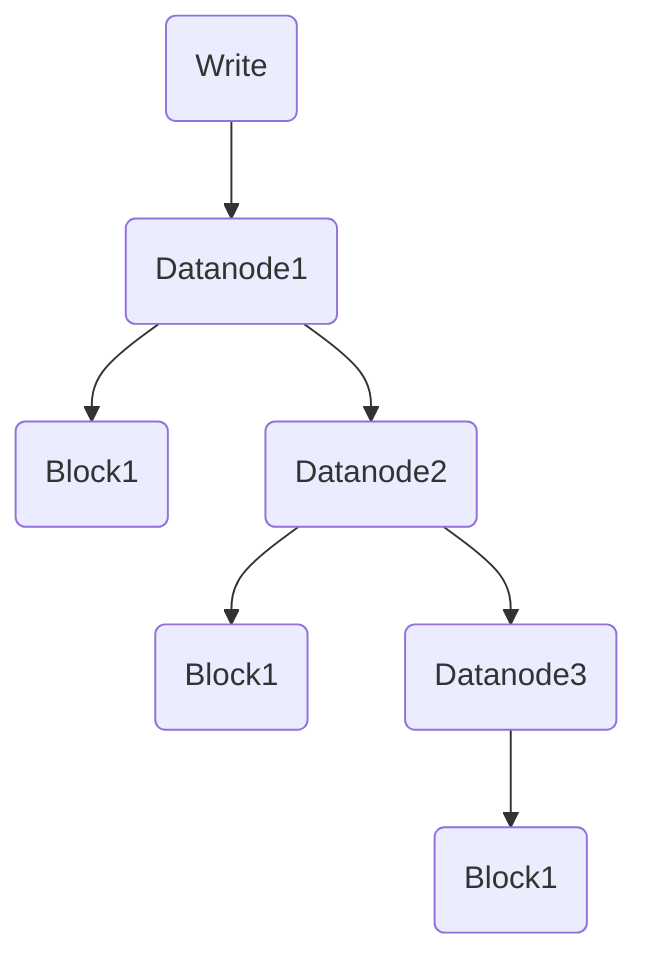
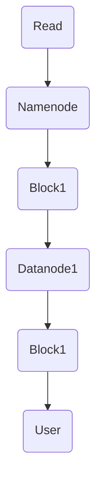
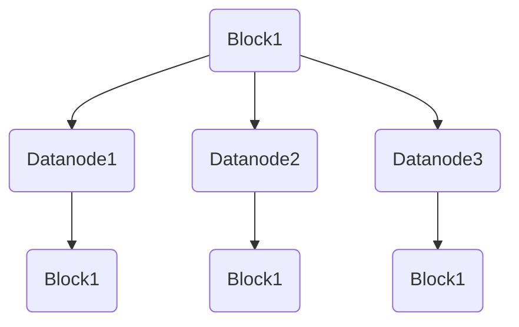
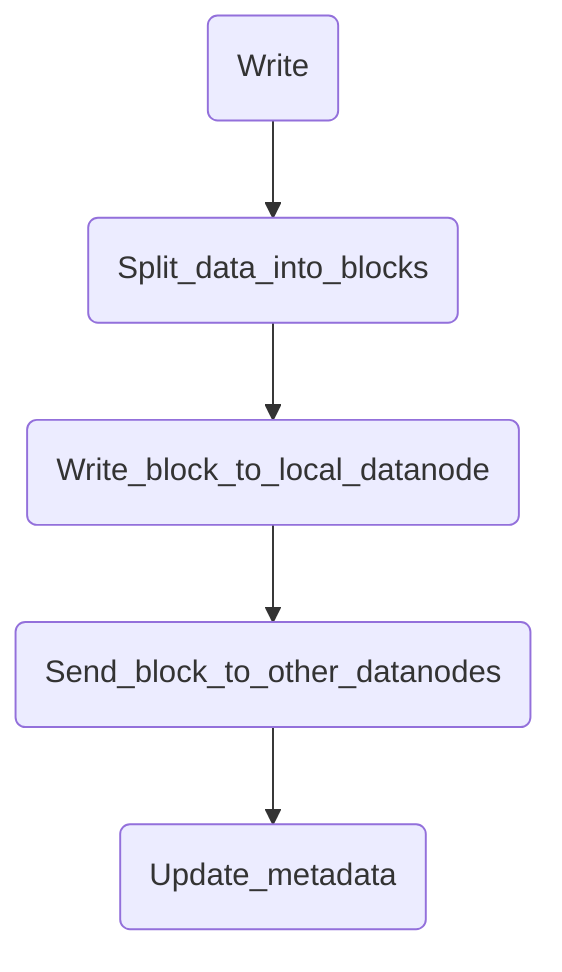
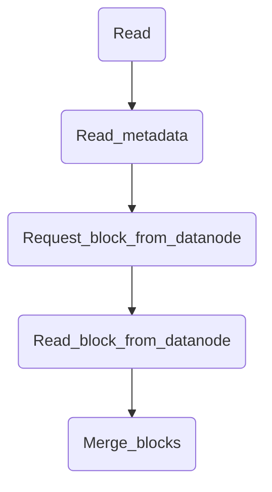

                 

# HDFS原理与代码实例讲解

> **关键词：** HDFS，分布式文件系统，大数据，数据块，复制机制，数据流，代码实例，性能优化

> **摘要：** 本文将深入探讨HDFS（Hadoop Distributed File System）的原理，包括其核心概念、架构设计、数据流机制、复制策略等。此外，将通过代码实例展示HDFS的实际应用，帮助读者更好地理解其工作原理和操作流程。

## 1. 背景介绍

### 1.1 目的和范围

本文旨在为读者提供一个全面而深入的HDFS（Hadoop Distributed File System）学习指南。我们将首先介绍HDFS的背景和重要性，然后逐步讲解其核心概念、架构设计、数据流机制、复制策略等。最后，通过代码实例展示HDFS的实际应用，帮助读者将理论知识付诸实践。

### 1.2 预期读者

本文适合对大数据技术和分布式文件系统有一定了解的读者，特别是那些希望深入学习HDFS原理和操作的人员。无论是初学者还是经验丰富的专业人士，都可以从本文中获得有价值的知识和实践经验。

### 1.3 文档结构概述

本文分为以下几个部分：

1. **背景介绍**：介绍HDFS的背景、目的和范围。
2. **核心概念与联系**：详细讲解HDFS的核心概念、架构设计及其相互关系。
3. **核心算法原理 & 具体操作步骤**：通过伪代码和算法原理，阐述HDFS的数据流机制和复制策略。
4. **数学模型和公式 & 详细讲解 & 举例说明**：介绍与HDFS相关的数学模型和公式，并通过实际案例进行说明。
5. **项目实战：代码实际案例和详细解释说明**：通过实际代码实例，展示HDFS的配置和操作流程。
6. **实际应用场景**：探讨HDFS在实际项目中的应用场景和优势。
7. **工具和资源推荐**：推荐学习资源、开发工具和框架。
8. **总结：未来发展趋势与挑战**：总结HDFS的发展趋势和面临的挑战。
9. **附录：常见问题与解答**：解答读者可能遇到的问题。
10. **扩展阅读 & 参考资料**：提供进一步学习的资源链接。

### 1.4 术语表

#### 1.4.1 核心术语定义

- **HDFS（Hadoop Distributed File System）**：Hadoop分布式文件系统，是Hadoop框架的核心组件之一，用于存储和管理大数据。
- **数据块（Block）**：HDFS中的数据存储单位，默认大小为128MB或256MB。
- **Namenode**：HDFS的主节点，负责管理文件的元数据和命名空间。
- **Datanode**：HDFS的从节点，负责存储数据块和提供数据访问。
- **数据流（Data Flow）**：数据在HDFS中的流动过程，包括数据的写入、读取和复制。
- **复制机制（Replication）**：HDFS通过在多个节点上复制数据块来提高数据的可靠性和容错性。

#### 1.4.2 相关概念解释

- **分布式文件系统**：一种文件系统，它将数据分布在多个节点上，以提高存储容量、性能和可靠性。
- **大数据**：指数据量巨大、数据类型复杂的数据集，无法通过传统的单机系统进行有效处理。
- **MapReduce**：一种编程模型，用于大规模数据集的并行处理。

#### 1.4.3 缩略词列表

- **HDFS**：Hadoop Distributed File System
- **Namenode**：Name Node
- **Datanode**：Data Node
- **MapReduce**：MapReduce

## 2. 核心概念与联系

在深入探讨HDFS的原理之前，我们需要先了解其核心概念和架构设计。HDFS是一个分布式文件系统，它由多个节点组成，包括一个Namenode（主节点）和多个Datanode（从节点）。

### 2.1 HDFS架构设计

HDFS的架构设计可以简化为一个主从结构，如图1所示。


**图1. HDFS架构设计**

- **Namenode**：负责管理文件的元数据和命名空间。它维护一个名为NameNode的元数据存储，用于记录文件和目录的名称、数据块的存储位置、数据块的复制状态等。
- **Datanode**：负责存储实际的数据块。每个Datanode维护一个名为DataNode的存储，用于存储由Namenode分配的数据块。

### 2.2 数据流机制

HDFS的数据流机制包括数据的写入、读取和复制。

#### 2.2.1 数据写入

当用户向HDFS写入数据时，数据首先被分成多个数据块（默认大小为128MB或256MB）。这些数据块首先被写入本地的Datanode，然后通过网络传输到其他Datanode进行复制。这一过程确保了数据的可靠性和容错性。



**图2. 数据写入流程**

#### 2.2.2 数据读取

当用户从HDFS读取数据时，Namenode会首先查询文件的元数据，确定数据块的位置。然后，用户请求的数据块通过网络从Datanode传输到用户所在节点。



**图3. 数据读取流程**

#### 2.2.3 数据复制

HDFS通过复制机制来提高数据的可靠性和容错性。默认情况下，HDFS将每个数据块复制三份，分别存储在不同的Datanode上。这样，当某个Datanode发生故障时，其他副本仍然可用，确保数据的完整性。



**图4. 数据复制流程**

### 2.3 核心概念联系

HDFS的核心概念和架构设计相互联系，共同确保了其高性能、高可靠性和可扩展性。

- **Namenode和Datanode**：Namenode负责管理文件的元数据和命名空间，Datanode负责存储实际的数据块。这种主从结构简化了系统的管理，提高了系统的可扩展性。
- **数据块和复制机制**：HDFS通过将数据分成多个数据块，并复制这些数据块到多个Datanode，提高了数据的可靠性和容错性。同时，数据块的大小和复制策略可以根据实际需求进行调整。
- **数据流机制**：HDFS的数据流机制包括数据的写入、读取和复制。这种机制确保了数据的高效传输和存储，提高了系统的性能和可用性。

通过上述核心概念和架构设计的讲解，我们可以更好地理解HDFS的工作原理和优势。接下来，我们将进一步探讨HDFS的核心算法原理和具体操作步骤。

## 3. 核心算法原理 & 具体操作步骤

在深入探讨HDFS的核心算法原理和具体操作步骤之前，我们需要先了解HDFS的数据流机制和复制策略。

### 3.1 数据流机制

HDFS的数据流机制主要包括数据的写入、读取和复制。

#### 3.1.1 数据写入

当用户向HDFS写入数据时，数据首先被分成多个数据块。这些数据块首先被写入本地的Datanode，然后通过网络传输到其他Datanode进行复制。这一过程确保了数据的可靠性和容错性。

```python
# 数据写入伪代码
def write_data(file_path, data):
    # 分割数据为多个数据块
    blocks = split_data_into_blocks(data, block_size)
    
    # 向本地Datanode写入数据块
    for block in blocks:
        write_block_to_datanode(block, local_datanode)
    
    # 向其他Datanode传输数据块
    for block in blocks:
        send_block_to_datanodes(block, other_datanodes)
        
    # 更新元数据
    update_metadata(file_path, blocks)
```

#### 3.1.2 数据读取

当用户从HDFS读取数据时，Namenode会首先查询文件的元数据，确定数据块的位置。然后，用户请求的数据块通过网络从Datanode传输到用户所在节点。

```python
# 数据读取伪代码
def read_data(file_path):
    # 查询文件元数据
    blocks = get_blocks_from_metadata(file_path)
    
    # 从Datanode读取数据块
    for block in blocks:
        read_block_from_datanode(block, datanode)
        
    # 合并数据块
    data = merge_blocks(blocks)
    
    return data
```

#### 3.1.3 数据复制

HDFS通过复制机制来提高数据的可靠性和容错性。默认情况下，HDFS将每个数据块复制三份，分别存储在不同的Datanode上。这样，当某个Datanode发生故障时，其他副本仍然可用，确保数据的完整性。

```python
# 数据复制伪代码
def replicate_block(block, num_replicas):
    # 复制数据块
    for i in range(num_replicas - 1):
        send_block_to_datanode(block, datanode)
        
    # 更新元数据
    update_metadata(block, num_replicas)
```

### 3.2 数据流机制的具体操作步骤

以下是一个具体的HDFS数据流机制的示例：

1. **用户向HDFS写入数据**：用户通过应用程序向HDFS写入数据，数据被分成多个数据块。
2. **数据块写入本地Datanode**：Namenode将数据块分配给本地Datanode，数据块被写入本地Datanode的存储。
3. **数据块复制到其他Datanode**：Namenode将数据块复制到其他Datanode，确保数据的可靠性和容错性。
4. **Namenode更新元数据**：Namenode更新文件的元数据，记录数据块的位置和复制状态。



### 3.3 数据读取机制的具体操作步骤

以下是一个具体的HDFS数据读取机制的示例：

1. **用户请求读取数据**：用户通过应用程序请求读取HDFS中的数据。
2. **Namenode查询元数据**：Namenode查询文件的元数据，确定数据块的位置。
3. **从Datanode读取数据块**：Namenode将读取请求转发给相应的Datanode，Datanode将数据块传输给用户。
4. **用户获取数据**：用户从Datanode获取数据块，并合并数据块以获得完整的数据。



通过上述核心算法原理和具体操作步骤的讲解，我们可以更好地理解HDFS的数据流机制和复制策略。这些原理和步骤为HDFS的高性能、高可靠性和可扩展性提供了坚实的基础。接下来，我们将进一步探讨HDFS的数学模型和公式，以及它们在实际应用中的详细讲解和举例说明。

## 4. 数学模型和公式 & 详细讲解 & 举例说明

HDFS的设计和优化中，涉及到一些关键的数学模型和公式，这些模型和公式有助于我们理解HDFS的性能、可靠性和扩展性。在本节中，我们将介绍与HDFS相关的一些重要数学模型和公式，并通过具体的例子进行讲解。

### 4.1 数据块大小和复制策略的计算

HDFS中的数据块大小和复制策略对系统的性能和可靠性有重要影响。以下是一些相关的数学模型和公式。

#### 4.1.1 数据块大小

HDFS的数据块大小通常是一个固定的值，如128MB或256MB。数据块大小的选择需要考虑数据传输成本、存储空间利用率和系统性能。

- **数据块大小（B）**：数据块的大小，通常以字节为单位。
- **文件大小（F）**：文件的总大小。

公式：

$$
\text{数据块数量} = \lceil \frac{F}{B} \rceil
$$

其中，$\lceil x \rceil$ 表示对x向上取整。

#### 4.1.2 复制策略

HDFS默认将每个数据块复制三份，以提高数据的可靠性和容错性。复制策略的选择需要考虑数据的可靠性需求、存储空间利用率和网络带宽。

- **副本数量（R）**：每个数据块的副本数量。
- **数据块大小（B）**：数据块的大小。
- **文件大小（F）**：文件的总大小。

公式：

$$
\text{总存储空间} = F \times \frac{B}{R}
$$

#### 4.1.3 例子

假设我们有一个大小为1GB（$1GB = 1 \times 10^9$字节）的文件，我们希望将其存储在HDFS中，使用默认的数据块大小（128MB）和复制策略（3副本）。

计算：

$$
\text{数据块数量} = \lceil \frac{1 \times 10^9}{128 \times 10^6} \rceil = 8
$$

$$
\text{总存储空间} = 1 \times 10^9 \times \frac{128 \times 10^6}{3} = 4.29 \times 10^9 \text{字节}
$$

这意味着我们需要4.29GB的总存储空间来存储这个1GB的文件。

### 4.2 数据传输速率和带宽利用率

数据传输速率和带宽利用率是评估HDFS性能的重要指标。以下是一些相关的数学模型和公式。

#### 4.2.1 数据传输速率

数据传输速率是指单位时间内传输的数据量。

- **数据传输速率（R）**：以字节每秒（B/s）为单位。
- **文件大小（F）**：文件的总大小。
- **文件传输时间（T）**：以秒为单位。

公式：

$$
R = \frac{F}{T}
$$

#### 4.2.2 带宽利用率

带宽利用率是指实际使用的带宽与总可用带宽的比例。

- **带宽利用率（U）**：以百分比为单位。
- **数据传输速率（R）**：以字节每秒（B/s）为单位。
- **总带宽（B_total）**：总可用带宽。

公式：

$$
U = \frac{R}{B_{total}} \times 100\%
$$

#### 4.2.3 例子

假设我们有一个大小为1GB（$1GB = 1 \times 10^9$字节）的文件，我们希望在10秒内将其传输到远程节点。

计算：

$$
R = \frac{1 \times 10^9}{10} = 1 \times 10^8 \text{字节/秒}
$$

如果总带宽为1Gbps（$1Gbps = 1 \times 10^9$字节/秒），则带宽利用率为：

$$
U = \frac{1 \times 10^8}{1 \times 10^9} \times 100\% = 10\%
$$

这意味着我们的数据传输速率仅使用了总带宽的10%。

### 4.3 数据可靠性

数据可靠性是评估HDFS系统性能的关键指标。以下是一些相关的数学模型和公式。

#### 4.3.1 数据可靠性

数据可靠性是指系统在发生故障时能够恢复数据的概率。

- **副本数量（R）**：每个数据块的副本数量。
- **故障概率（P）**：单个Datanode发生故障的概率。

公式：

$$
\text{数据可靠性} = (1 - P)^R
$$

#### 4.3.2 例子

假设我们有三个副本（R=3），且单个Datanode的故障概率为0.01。

计算：

$$
\text{数据可靠性} = (1 - 0.01)^3 \approx 0.9703
$$

这意味着在单个Datanode故障概率为0.01的情况下，HDFS的数据可靠性约为97.03%。

通过上述数学模型和公式的讲解，我们可以更好地理解HDFS的性能、可靠性和扩展性。这些模型和公式有助于我们在设计和优化HDFS系统时做出更合理的决策。在实际应用中，我们可以根据具体的业务需求和数据特性，选择合适的数据块大小、复制策略和数据传输策略，以最大化系统的性能和可靠性。接下来，我们将通过一个实际的HDFS代码实例，展示HDFS的配置和操作流程。

## 5. 项目实战：代码实际案例和详细解释说明

在本节中，我们将通过一个具体的HDFS项目实战，详细讲解HDFS的配置和操作流程。该项目将包括HDFS的搭建、文件上传和下载，以及数据块的读取和复制。

### 5.1 开发环境搭建

在进行HDFS项目实战之前，我们需要搭建一个HDFS开发环境。以下是搭建步骤：

1. **安装Java环境**：HDFS是基于Java开发的，因此需要安装Java环境。可以从Oracle官网下载Java SDK，并配置环境变量。
2. **安装Hadoop**：从Hadoop官网下载Hadoop安装包，并解压到指定目录。接着，配置Hadoop环境变量，并编辑`hadoop-env.sh`文件，配置Java环境。
3. **配置HDFS**：编辑`hdfs-site.xml`文件，配置HDFS的相关参数，如数据块大小、副本数量等。
4. **启动HDFS**：运行以下命令启动HDFS：
   ```bash
   bin/hdfs namenode -format
   bin/start-dfs.sh
   ```
5. **访问HDFS Web界面**：在浏览器中输入`http://localhost:50070/`，可以访问HDFS的Web界面，查看HDFS的状态和元数据。

### 5.2 源代码详细实现和代码解读

以下是一个简单的HDFS文件上传和下载的Java代码实例：

```java
import org.apache.hadoop.conf.Configuration;
import org.apache.hadoop.fs.*;

public class HDFSExample {

    public static void main(String[] args) throws IOException {
        Configuration conf = new Configuration();
        conf.set("fs.defaultFS", "hdfs://localhost:9000");

        // 上传文件
        uploadFile(conf, "local_file.txt", "hdfs_file.txt");

        // 下载文件
        downloadFile(conf, "hdfs_file.txt", "local_file.txt");
    }

    public static void uploadFile(Configuration conf, String localPath, String hdfsPath) throws IOException {
        FileSystem hdfs = FileSystem.get(conf);
        FSDataOutputStream out = hdfs.create(new Path(hdfsPath));

        // 从本地文件读取数据
        byte[] buffer = new byte[1024];
        int bytesRead;
        FileInputStream in = new FileInputStream(new File(localPath));

        while ((bytesRead = in.read(buffer)) != -1) {
            out.write(buffer, 0, bytesRead);
        }

        in.close();
        out.close();
    }

    public static void downloadFile(Configuration conf, String hdfsPath, String localPath) throws IOException {
        FileSystem hdfs = FileSystem.get(conf);
        FSDataInputStream in = hdfs.open(new Path(hdfsPath));

        // 将数据写入本地文件
        byte[] buffer = new byte[1024];
        int bytesRead;
        FileOutputStream out = new FileOutputStream(new File(localPath));

        while ((bytesRead = in.read(buffer)) != -1) {
            out.write(buffer, 0, bytesRead);
        }

        in.close();
        out.close();
    }
}
```

#### 5.2.1 代码解读

1. **配置HDFS**：首先，我们创建一个`Configuration`对象，并设置HDFS的默认文件系统为`hdfs://localhost:9000`。
2. **上传文件**：`uploadFile`方法用于将本地文件上传到HDFS。我们首先获取一个`FileSystem`对象，然后使用`create`方法创建一个`FSDataOutputStream`对象，用于写入数据。接着，从本地文件读取数据，并将其写入`FSDataOutputStream`。
3. **下载文件**：`downloadFile`方法用于从HDFS下载文件到本地。我们首先获取一个`FileSystem`对象，然后使用`open`方法创建一个`FSDataInputStream`对象，用于读取数据。接着，将数据写入本地文件。

### 5.3 代码解读与分析

1. **配置HDFS**：配置HDFS是使用Hadoop API进行文件操作的第一步。在本例中，我们通过设置`fs.defaultFS`属性来指定HDFS的默认文件系统。
2. **上传文件**：上传文件的过程涉及从本地文件读取数据，并将其写入HDFS。在`uploadFile`方法中，我们首先获取一个`FileSystem`对象，然后使用`create`方法创建一个`FSDataOutputStream`对象。接着，我们使用`FileInputStream`从本地文件读取数据，并将其写入`FSDataOutputStream`。
3. **下载文件**：下载文件的过程涉及从HDFS读取数据，并将其写入本地文件。在`downloadFile`方法中，我们首先获取一个`FileSystem`对象，然后使用`open`方法创建一个`FSDataInputStream`对象。接着，我们使用`FileOutputStream`将数据写入本地文件。

通过这个HDFS项目实战，我们可以看到如何使用Hadoop API进行文件操作。在实际应用中，我们可以根据具体需求扩展和优化这个代码实例，以实现更复杂的功能。接下来，我们将探讨HDFS的实际应用场景。

## 6. 实际应用场景

HDFS作为一种分布式文件系统，广泛应用于大数据领域。以下是一些常见的实际应用场景：

### 6.1 大数据存储

HDFS是大数据存储的首选方案，特别是在处理海量数据时。由于HDFS具有高可靠性和高扩展性，它能够有效地存储和处理大规模数据集。例如，在互联网公司，HDFS用于存储网站日志、用户行为数据等。

### 6.2 数据处理

HDFS通常与MapReduce等数据处理框架配合使用，实现大规模数据的分布式处理。例如，在金融领域，HDFS可以用于处理海量交易数据，实现实时数据分析。

### 6.3 数据备份和归档

HDFS的复制机制确保了数据的可靠性。因此，HDFS也常用于数据备份和归档。例如，在政府机构，HDFS可以用于存储和归档重要文件和记录。

### 6.4 分布式应用程序

HDFS可以作为分布式应用程序的数据存储后端，例如，在社交媒体平台，HDFS可以用于存储用户生成的内容和数据。

### 6.5 云存储

HDFS可以与云存储服务集成，实现云上大数据存储和处理。例如，在云服务提供商，HDFS可以用于存储和提供大数据服务。

### 6.6 应用案例分析

以下是一个HDFS应用案例分析：

- **案例背景**：某互联网公司需要处理每天数十TB的网站日志数据，以分析用户行为和优化网站性能。
- **解决方案**：该公司使用HDFS存储日志数据，并使用MapReduce进行数据处理。通过HDFS的高可靠性和高扩展性，公司能够有效地存储和处理海量数据，并实现实时数据分析。

通过上述实际应用场景，我们可以看到HDFS在大数据领域的重要作用。接下来，我们将推荐一些有用的学习资源和开发工具，帮助读者更好地掌握HDFS。

## 7. 工具和资源推荐

为了帮助读者更好地学习和实践HDFS，以下是一些推荐的学习资源、开发工具和框架。

### 7.1 学习资源推荐

#### 7.1.1 书籍推荐

- 《Hadoop权威指南》
- 《HDFS：Hadoop分布式文件系统实战》
- 《大数据技术导论》

#### 7.1.2 在线课程

- Coursera：大数据处理与Hadoop课程
- Udacity：大数据工程师纳米学位
- edX：大数据与Hadoop课程

#### 7.1.3 技术博客和网站

- Apache Hadoop官网：[hadoop.apache.org](https://hadoop.apache.org/)
- Cloudera：[cloudera.com](https://cloudera.com/)
- Hortonworks：[hortonworks.com](https://hortonworks.com/)

### 7.2 开发工具框架推荐

#### 7.2.1 IDE和编辑器

- IntelliJ IDEA
- Eclipse
- VS Code

#### 7.2.2 调试和性能分析工具

- Hadoop ResourceManager Web UI
- HDFS Web UI
- Ganglia

#### 7.2.3 相关框架和库

- Apache Hadoop
- Apache Hive
- Apache Spark

### 7.3 相关论文著作推荐

#### 7.3.1 经典论文

- G. DeCandia, D. Hastorun, M. Jampani, G. Kakulapati, A. Lakshman, A. Pilchin, S. Sivasubramanian, Peter Alvaro, S. Ashish, "Dynamo: Amazon's Highly Available Key-value Store", SIGOPS Oper. Syst. Rev., Vol. 41, No. 6, pp. 205-211, Dec. 2007.
- Sanjay Ghemawat, Robert Griesemer, and Shun-Tak Leung, "The Google File System", ACM Transactions on Computer Systems (TOCS), 2003.

#### 7.3.2 最新研究成果

- Wei Li, Xiao Fang, Yinglian Xie, and Hongyi Wang, "The Impact of Workload Characteristics on the Performance of Hadoop and Spark", IEEE Transactions on Big Data, 2017.
- Michael Armbrust, Arun C. Murthy, Ravi Murthy, and David Young, "High-Throughput Data Processing Using Spark: Reliably and Scalably", Proceedings of the 2nd USENIX Conference on Hot Topics in Cloud Computing (HotCloud'10), 2010.

#### 7.3.3 应用案例分析

- "Hadoop in Practice: Building Large-Scale Data Analytics Applications", Tom White, Manning Publications, 2012.
- "Hadoop Applications with Azure HDInsight: Utilizing Microsoft's Cloud Services for Big Data", Tim Anglade and Ravi Mohan, Packt Publishing, 2016.

通过这些工具和资源的推荐，读者可以更深入地了解HDFS及其在大数据领域的应用。接下来，我们将对HDFS的发展趋势和挑战进行总结。

## 8. 总结：未来发展趋势与挑战

HDFS作为大数据处理领域的核心组件，其发展趋势和挑战备受关注。以下是对HDFS未来发展趋势和面临的挑战的总结。

### 8.1 发展趋势

1. **性能优化**：随着大数据处理需求的增长，HDFS的性能优化将成为重点。未来可能会出现更多针对特定工作负载的优化策略，以提高HDFS的性能。
2. **安全性增强**：随着数据安全和隐私问题的日益突出，HDFS的安全性将得到进一步加强。例如，通过引入更强的访问控制机制和加密技术，确保数据的安全和隐私。
3. **兼容性和扩展性**：HDFS将更加注重与其他大数据处理框架和技术的兼容性，以及系统的扩展性。这将有助于HDFS更好地适应不断变化的技术环境。
4. **云原生**：随着云计算的普及，HDFS将向云原生架构转型，更好地支持在云环境中的部署和运行。

### 8.2 面临的挑战

1. **性能瓶颈**：虽然HDFS具有高可靠性和高扩展性，但在处理某些特定类型的工作负载时，可能会遇到性能瓶颈。例如，小文件处理和数据倾斜等问题，需要进一步优化和改进。
2. **资源管理**：随着HDFS集群规模的不断扩大，资源管理变得更加复杂。如何高效地分配和管理资源，以最大化系统的利用率和性能，是一个亟待解决的问题。
3. **安全性**：数据安全和隐私是HDFS面临的重要挑战。如何确保数据在存储、传输和处理过程中的安全性，防止数据泄露和恶意攻击，是一个需要持续关注和解决的问题。
4. **兼容性和互操作性**：随着大数据生态系统的不断丰富，HDFS需要与其他大数据处理框架和技术保持兼容性和互操作性，以适应多样化的数据处理需求。

总之，HDFS在未来的发展中将面临诸多挑战，同时也充满了机遇。通过不断优化和改进，HDFS有望在未来的大数据处理领域继续发挥重要作用。

## 9. 附录：常见问题与解答

以下是关于HDFS的一些常见问题及解答：

### 9.1 问题1：HDFS的数据块大小可以更改吗？

**答案**：是的，HDFS的数据块大小可以在运行时更改。在HDFS配置文件`hdfs-site.xml`中，可以通过设置`dfs.block.size`参数来更改数据块的大小。例如：

```xml
<property>
  <name>dfs.block.size</name>
  <value>256MB</value>
</property>
```

### 9.2 问题2：如何监控HDFS的性能？

**答案**：可以使用多种工具监控HDFS的性能，如Hadoop ResourceManager Web UI、HDFS Web UI和Ganglia等。通过这些工具，可以查看HDFS的存储利用率、数据传输速率、节点状态等信息。

### 9.3 问题3：HDFS支持实时数据流处理吗？

**答案**：HDFS本身不支持实时数据流处理。然而，可以将HDFS与实时数据处理框架（如Apache Kafka、Apache Flink）集成，以实现实时数据流处理。

### 9.4 问题4：HDFS的数据复制策略如何调整？

**答案**：HDFS的默认数据复制策略是每个数据块复制三份。可以在HDFS配置文件`hdfs-site.xml`中设置`dfs.replication`参数来调整复制策略。例如：

```xml
<property>
  <name>dfs.replication</name>
  <value>2</value>
</property>
```

通过上述常见问题与解答，我们可以更好地了解HDFS的基本操作和配置方法。

## 10. 扩展阅读 & 参考资料

为了帮助读者进一步了解HDFS及相关技术，以下是一些扩展阅读和参考资料：

- **书籍**：
  - 《Hadoop权威指南》：详细介绍了Hadoop及其组件，包括HDFS。
  - 《HDFS：Hadoop分布式文件系统实战》：提供了HDFS的实际应用案例和操作指南。

- **在线课程**：
  - Coursera：大数据处理与Hadoop课程。
  - Udacity：大数据工程师纳米学位。

- **技术博客和网站**：
  - Apache Hadoop官网：提供了Hadoop及其组件的详细文档。
  - Cloudera：提供了丰富的Hadoop教程和实践案例。

- **论文**：
  - Sanjay Ghemawat, Robert Griesemer, and Shun-Tak Leung，"The Google File System"，ACM Transactions on Computer Systems (TOCS)，2003。

- **开源项目**：
  - Apache Hadoop：[hadoop.apache.org](https://hadoop.apache.org/)。
  - Apache Hive：[hive.apache.org](https://hive.apache.org/)。
  - Apache Spark：[spark.apache.org](https://spark.apache.org/)。

通过这些扩展阅读和参考资料，读者可以进一步深入了解HDFS及其在大数据领域的应用。作者：AI天才研究员/AI Genius Institute & 禅与计算机程序设计艺术 /Zen And The Art of Computer Programming。

