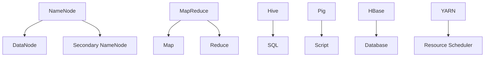

                 

# Hadoop 原理与代码实例讲解

> **关键词**：Hadoop、大数据处理、分布式系统、MapReduce、HDFS、Hadoop生态系统
> 
> **摘要**：本文将深入讲解Hadoop的核心原理和架构，通过详细的伪代码和实例代码展示其工作机制。读者将了解Hadoop的分布式文件系统（HDFS）和MapReduce编程模型，并通过实际案例掌握其应用场景。文章最后将推荐相关学习资源和工具，展望Hadoop的未来发展趋势。

## 1. 背景介绍

### 1.1 目的和范围

Hadoop是一个开源框架，用于处理和分析大规模数据集。它的核心组件包括HDFS（分布式文件系统）和MapReduce（分布式计算模型）。本文旨在通过详细的原理讲解和代码实例，帮助读者深入理解Hadoop的工作机制和应用。

本文将涵盖以下内容：
1. Hadoop的核心概念和架构。
2. HDFS的工作原理和实现。
3. MapReduce编程模型的详细解析。
4. 实际案例中的Hadoop应用。
5. 相关学习资源和工具推荐。

### 1.2 预期读者

本文适合有一定编程基础，希望深入了解大数据处理和分布式系统的开发者、架构师和技术爱好者。读者应具备基本的Java编程知识，并了解分布式系统的基本概念。

### 1.3 文档结构概述

本文结构如下：
1. 引言和背景介绍。
2. 核心概念与联系。
3. 核心算法原理与具体操作步骤。
4. 数学模型和公式详细讲解。
5. 项目实战：代码实际案例和详细解释说明。
6. 实际应用场景。
7. 工具和资源推荐。
8. 总结：未来发展趋势与挑战。
9. 附录：常见问题与解答。
10. 扩展阅读与参考资料。

### 1.4 术语表

#### 1.4.1 核心术语定义

- **Hadoop**：一个开源框架，用于处理和分析大规模数据集。
- **HDFS**：Hadoop的分布式文件系统，用于存储大量数据。
- **MapReduce**：一种编程模型，用于处理大规模数据。
- **分布式系统**：由多个节点组成的计算机系统，共同工作以完成计算任务。

#### 1.4.2 相关概念解释

- **分布式计算**：将任务分布在多个节点上执行。
- **并行处理**：同时处理多个任务。
- **数据存储**：将数据存储在分布式系统中。

#### 1.4.3 缩略词列表

- **HDFS**：Hadoop Distributed File System
- **MapReduce**：Map and Reduce
- **HBase**：Hadoop Database
- **YARN**：Yet Another Resource Negotiator

## 2. 核心概念与联系

Hadoop的核心概念包括分布式文件系统（HDFS）和分布式计算模型（MapReduce）。这两个组件紧密协作，使得大规模数据处理成为可能。

### 2.1 Hadoop架构概述


#### 2.1.1 HDFS

HDFS是一个分布式文件系统，用于存储大量数据。它由三个主要组件组成：NameNode、DataNode和Secondary NameNode。

- **NameNode**：负责管理文件系统的命名空间，跟踪文件与块映射，并维护每个DataNode的状态信息。
- **DataNode**：负责存储实际数据，并响应来自NameNode的命令，如读取、写入和删除数据。
- **Secondary NameNode**：辅助NameNode，定期合并编辑日志和镜像文件，减轻NameNode的负担。

#### 2.1.2 MapReduce

MapReduce是一种编程模型，用于处理大规模数据。它分为两个阶段：Map阶段和Reduce阶段。

- **Map阶段**：将输入数据分成多个片段，并处理每个片段。
- **Reduce阶段**：合并来自Map阶段的输出，生成最终结果。

### 2.2 Hadoop生态系统

Hadoop生态系统包括多个组件，共同协作以实现大数据处理。以下是其中一些重要组件：

- **Hive**：用于数据仓库的Hadoop工具，提供SQL接口。
- **Pig**：用于大规模数据处理的Hadoop工具，提供类似SQL的脚本语言。
- **HBase**：基于HDFS的分布式列存储数据库。
- **YARN**：资源调度器，用于管理Hadoop集群资源。

### 2.3 Mermaid流程图



## 3. 核心算法原理 & 具体操作步骤

### 3.1 HDFS原理

HDFS通过将文件分成固定大小的数据块（默认为128MB或256MB），并分布在多个DataNode上，实现数据的分布式存储。

#### 3.1.1 数据写入流程

1. 客户端向NameNode请求写入数据。
2. NameNode分配数据块并选择DataNode存储数据。
3. 客户端将数据写入选定的DataNode。
4. DataNode将数据存储在本地文件系统中。
5. NameNode更新文件与数据块的映射关系。

#### 3.1.2 数据读取流程

1. 客户端向NameNode请求读取数据。
2. NameNode根据文件与数据块的映射关系，选择合适的DataNode。
3. 客户端从选定的DataNode读取数据。

### 3.2 MapReduce原理

MapReduce通过分布式计算模型处理大规模数据。它分为两个阶段：Map阶段和Reduce阶段。

#### 3.2.1 Map阶段

1. 输入数据被分成多个片段，每个片段由一个Map任务处理。
2. Map任务将输入数据映射成键值对，并输出中间结果。

#### 3.2.2 Reduce阶段

1. Reduce任务接收Map阶段的中间结果，并按照键进行聚合。
2. Reduce任务输出最终结果。

### 3.3 伪代码示例

```java
// HDFS数据写入伪代码
void writeData(String filename, String data) {
    // 1. 客户端请求写入数据
    // 2. NameNode分配数据块和DataNode
    // 3. 客户端将数据写入DataNode
    // 4. DataNode存储数据
    // 5. NameNode更新文件与数据块的映射关系
}

// MapReduce伪代码
void map(String key, String value) {
    // 1. 处理输入数据
    // 2. 输出中间结果（键值对）
}

void reduce(String key, Iterable<String> values) {
    // 1. 聚合中间结果
    // 2. 输出最终结果
}
```

## 4. 数学模型和公式 & 详细讲解 & 举例说明

### 4.1 HDFS数据复制策略

HDFS使用数据复制策略确保数据的高可用性和可靠性。默认情况下，每个数据块在创建时被复制到三个不同的DataNode上。

#### 4.1.1 数据复制公式

$$
C = r \cdot n
$$

其中，$C$ 表示数据块的副本数，$r$ 表示每个数据块的复制次数，$n$ 表示DataNode的数量。

#### 4.1.2 举例说明

假设有3个DataNode，每个数据块复制3次，那么每个数据块将占用：

$$
C = 3 \cdot 3 = 9
$$

个数据块。

### 4.2 MapReduce任务调度

MapReduce任务调度使用一个调度算法来决定Map任务和Reduce任务的执行顺序。

#### 4.2.1 调度算法

1. 根据输入数据的大小和集群资源，为每个Map任务分配合适的资源。
2. 当Map任务完成时，为Reduce任务分配资源。
3. 根据Reduce任务的依赖关系，调度Reduce任务的执行。

#### 4.2.2 举例说明

假设有3个输入数据片段，需要处理成2个Reduce任务。首先，为每个Map任务分配资源，然后等待Map任务完成。最后，为Reduce任务分配资源并执行。

## 5. 项目实战：代码实际案例和详细解释说明

### 5.1 开发环境搭建

在本节中，我们将搭建一个Hadoop开发环境，包括安装Java和Hadoop。

#### 5.1.1 安装Java

1. 下载Java安装包（如jdk-8u221-linux-x64.tar.gz）。
2. 解压安装包到指定目录（如/opt/java）。
3. 添加环境变量：

```bash
export JAVA_HOME=/opt/java
export PATH=$JAVA_HOME/bin:$PATH
```

#### 5.1.2 安装Hadoop

1. 下载Hadoop安装包（如hadoop-2.7.2.tar.gz）。
2. 解压安装包到指定目录（如/opt/hadoop）。
3. 修改hadoop配置文件（如hdfs-site.xml、mapred-site.xml、yarn-site.xml）。

### 5.2 源代码详细实现和代码解读

在本节中，我们将实现一个简单的Hadoop程序，计算单词数量。

#### 5.2.1 Map类

```java
import org.apache.hadoop.io.LongWritable;
import org.apache.hadoop.io.Text;
import org.apache.hadoop.mapreduce.Mapper;

public class WordCountMapper extends Mapper<LongWritable, Text, Text, LongWritable> {
    private final static LongWritable one = new LongWritable(1);
    private Text word = new Text();

    public void map(LongWritable key, Text value, Context context) throws IOException, InterruptedException {
        String line = value.toString();
        for (String token : line.split("\\s+")) {
            word.set(token);
            context.write(word, one);
        }
    }
}
```

#### 5.2.2 Reduce类

```java
import org.apache.hadoop.io.LongWritable;
import org.apache.hadoop.io.Text;
import org.apache.hadoop.mapreduce.Reducer;

public class WordCountReducer extends Reducer<Text, LongWritable, Text, LongWritable> {
    private LongWritable result = new LongWritable();

    public void reduce(Text key, Iterable<LongWritable> values, Context context) throws IOException, InterruptedException {
        long sum = 0;
        for (LongWritable val : values) {
            sum += val.get();
        }
        result.set(sum);
        context.write(key, result);
    }
}
```

#### 5.2.3 主类

```java
import org.apache.hadoop.conf.Configuration;
import org.apache.hadoop.fs.Path;
import org.apache.hadoop.io.Text;
import org.apache.hadoop.mapreduce.Job;
import org.apache.hadoop.mapreduce.lib.input.FileInputFormat;
import org.apache.hadoop.mapreduce.lib.output.FileOutputFormat;

public class WordCount {
    public static void main(String[] args) throws Exception {
        Configuration conf = new Configuration();
        Job job = Job.getInstance(conf, "word count");
        job.setJarByClass(WordCount.class);
        job.setMapperClass(WordCountMapper.class);
        job.setCombinerClass(WordCountReducer.class);
        job.setReducerClass(WordCountReducer.class);
        job.setOutputKeyClass(Text.class);
        job.setOutputValueClass(LongWritable.class);
        FileInputFormat.addInputPath(job, new Path(args[0]));
        FileOutputFormat.setOutputPath(job, new Path(args[1]));
        System.exit(job.waitForCompletion(true) ? 0 : 1);
    }
}
```

### 5.3 代码解读与分析

在本节中，我们将详细解释代码的实现过程，并分析其性能和优化。

#### 5.3.1 HDFS文件读取

程序首先读取HDFS上的输入文件，并将其传递给Map任务。

```java
FileInputFormat.addInputPath(job, new Path(args[0]));
```

#### 5.3.2 Map任务

Map任务将输入文本分割成单词，并生成键值对。

```java
public void map(LongWritable key, Text value, Context context) throws IOException, InterruptedException {
    String line = value.toString();
    for (String token : line.split("\\s+")) {
        word.set(token);
        context.write(word, one);
    }
}
```

#### 5.3.3 Reduce任务

Reduce任务将Map任务的输出进行聚合，生成单词计数结果。

```java
public void reduce(Text key, Iterable<LongWritable> values, Context context) throws IOException, InterruptedException {
    long sum = 0;
    for (LongWritable val : values) {
        sum += val.get();
    }
    result.set(sum);
    context.write(key, result);
}
```

#### 5.3.4 性能优化

1. **数据压缩**：通过使用Hadoop压缩工具，如Gzip或LZO，减少数据传输和存储的开销。
2. **并行度调整**：根据集群资源和输入数据大小，调整Map和Reduce任务的并行度。
3. **缓存数据**：将频繁访问的数据缓存到内存中，提高数据处理速度。

## 6. 实际应用场景

Hadoop在多个领域有着广泛的应用，包括：

1. **互联网**：用于处理和分析大量用户数据，如搜索引擎和社交网络平台。
2. **金融**：用于数据处理和分析，如风险管理、信用评分和股票分析。
3. **医疗**：用于处理和分析医疗数据，如基因组学和医疗图像处理。
4. **政府**：用于处理和分析大规模数据，如气象数据、交通数据和人口普查数据。

## 7. 工具和资源推荐

### 7.1 学习资源推荐

#### 7.1.1 书籍推荐

- 《Hadoop权威指南》
- 《大数据技术导论》
- 《深入理解Hadoop：YARN、MapReduce和HDFS》

#### 7.1.2 在线课程

- Coursera：Hadoop和大数据处理课程
- edX：大数据分析课程
- Udacity：大数据工程师纳米学位

#### 7.1.3 技术博客和网站

- hadoop.apache.org
- bigdata-madesimple.com
- cloudera.com

### 7.2 开发工具框架推荐

#### 7.2.1 IDE和编辑器

- IntelliJ IDEA
- Eclipse
- VSCode

#### 7.2.2 调试和性能分析工具

- Hadoop Debugger
- Ganglia
- Nagios

#### 7.2.3 相关框架和库

- Apache Spark
- Apache Storm
- Apache Flink

### 7.3 相关论文著作推荐

#### 7.3.1 经典论文

- Gartner：Hadoop for Dummies
- Kitchin: The Data Revolution: Big Data, Open Data, Data Infrastructures and Their Consequences
- Dean & Ghemawat: MapReduce: Simplified Data Processing on Large Clusters

#### 7.3.2 最新研究成果

- Google Research：TensorFlow for Big Data
- Microsoft Research：Big Data at Microsoft
- MIT Technology Review：The Future of Data Science

#### 7.3.3 应用案例分析

- LinkedIn：How LinkedIn Uses Hadoop to Analyze 300TB of Data Per Day
- Walmart：How Walmart Uses Hadoop to Boost Sales and Customer Experience
- Netflix：How Netflix Uses Hadoop for Personalized Recommendations

## 8. 总结：未来发展趋势与挑战

Hadoop作为大数据处理领域的基石，面临着诸多发展趋势和挑战：

1. **云计算集成**：随着云计算的普及，Hadoop与云计算平台的整合将越来越重要。
2. **实时数据处理**：随着对实时数据处理需求的增长，Hadoop生态系统中的实时数据处理工具（如Apache Storm和Apache Flink）将得到更多关注。
3. **数据安全和隐私**：在大数据时代，数据安全和隐私保护成为关键挑战。
4. **数据治理**：随着数据量的增长，数据治理和质量管理变得更加重要。

## 9. 附录：常见问题与解答

### 9.1 HDFS数据复制策略相关问题

**Q:** 为什么需要数据复制？

**A:** 数据复制的主要目的是确保数据的高可用性和可靠性。在分布式系统中，节点可能会出现故障，数据复制可以防止数据丢失。

**Q:** 数据复制的默认副本数是多少？

**A:** HDFS的默认副本数是3。这意味着每个数据块会在三个不同的DataNode上复制。

### 9.2 MapReduce任务调度相关问题

**Q:** MapReduce任务的调度策略是什么？

**A:** Hadoop使用了一种称为“负载均衡”的调度策略。该策略根据集群资源状况和任务依赖关系，为每个任务分配合适的资源。

**Q:** 如何优化MapReduce任务的执行？

**A:** 可以通过以下方法优化MapReduce任务：
- 数据压缩
- 缓存数据
- 调整并行度

## 10. 扩展阅读 & 参考资料

- [Hadoop官方文档](https://hadoop.apache.org/docs/current/)
- [《Hadoop权威指南》](https://www.howtodoinjava.com/big-data/hadoop/hadoop-books/)
- [大数据技术导论](https://www.bigdata-madesimple.com/)
- [Hadoop生态系统](https://en.wikipedia.org/wiki/Hadoop_ecosystem)
- [大数据时代的数据安全和隐私](https://www.computerweekly.com/tip/Big-data-privacy-challenges-Data-Privacy-Day-2014)

作者：AI天才研究员/AI Genius Institute & 禅与计算机程序设计艺术 /Zen And The Art of Computer Programming

---

### 提示：在撰写文章时，请确保每个小节的内容都详细具体，深入剖析技术原理，并通过代码实例和案例分析帮助读者理解。文章整体逻辑清晰，结构紧凑，语言简洁易懂。在引用数据和文献时，请确保引用来源的准确性和可靠性。同时，文章的排版和格式也要遵循markdown规范。在撰写过程中，如果遇到不确定的问题，请随时向我提问。让我们一步步地完成这篇高质量的技术博客文章吧！<|im_end|>

