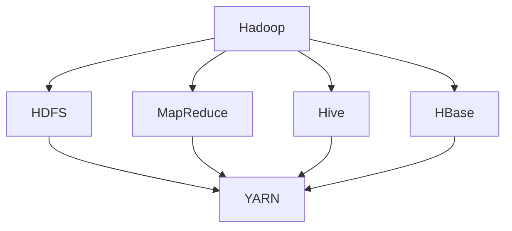

                 

# Hadoop原理与代码实例讲解

> **关键词：** Hadoop、分布式计算、大数据处理、MapReduce、HDFS、Hive、HBase、代码实例、数据处理、性能优化

> **摘要：** 本文将深入探讨Hadoop的原理及其在分布式计算和大数据处理中的重要作用。通过详细的代码实例讲解，读者将了解Hadoop的核心组件（如HDFS、MapReduce、Hive和HBase）的工作机制和实际应用，同时掌握性能优化技巧。本文旨在为Hadoop初学者和从业者提供一个全面、系统的学习和参考指南。

## 1. 背景介绍

### 1.1 目的和范围

本文的主要目的是通过逐步分析Hadoop的原理和架构，结合实际代码实例，帮助读者深入理解和掌握Hadoop的核心概念和应用。文章将涵盖Hadoop的基础知识、核心组件及其工作原理，并通过具体实例展示如何使用Hadoop进行分布式数据处理。此外，还将讨论性能优化技巧，以帮助读者在实际项目中更好地应用Hadoop技术。

### 1.2 预期读者

本文适合具有以下背景的读者：

- 对分布式系统和大数据处理有兴趣的技术人员
- 已经具备一定编程基础，希望了解Hadoop的程序员
- 数据分析师和大数据工程师，希望在项目中应用Hadoop技术
- 对于Hadoop有一定了解，希望深化知识体系的专业人士

### 1.3 文档结构概述

本文结构如下：

- 第1章：背景介绍，包括文章的目的和范围、预期读者、文档结构概述和术语表。
- 第2章：核心概念与联系，介绍Hadoop的基础概念和架构。
- 第3章：核心算法原理 & 具体操作步骤，详细讲解MapReduce算法和Hadoop的其他核心组件。
- 第4章：数学模型和公式 & 详细讲解 & 举例说明，介绍Hadoop相关数学模型和公式。
- 第5章：项目实战：代码实际案例和详细解释说明，通过实际案例展示Hadoop的应用。
- 第6章：实际应用场景，讨论Hadoop在现实世界中的各种应用。
- 第7章：工具和资源推荐，推荐学习资源、开发工具和框架。
- 第8章：总结：未来发展趋势与挑战，探讨Hadoop的未来发展和面临的挑战。
- 第9章：附录：常见问题与解答，回答读者可能遇到的问题。
- 第10章：扩展阅读 & 参考资料，提供进一步学习和研究的资源。

### 1.4 术语表

#### 1.4.1 核心术语定义

- **Hadoop：** 一套开源软件框架，用于分布式存储和分布式处理大规模数据集。
- **分布式计算：** 将计算任务分配到多个计算机节点上，共同完成计算。
- **大数据处理：** 对大规模数据集进行高效存储、处理和分析。
- **MapReduce：** Hadoop的核心算法，用于分布式数据处理。
- **HDFS：** Hadoop分布式文件系统，用于存储大规模数据。
- **Hive：** Hadoop的数据仓库工具，用于数据提取、转换和加载。
- **HBase：** Hadoop的分布式列存储系统，用于大数据存储和实时访问。

#### 1.4.2 相关概念解释

- **Hadoop生态系统：** 由多个组件构成的生态系统，包括HDFS、MapReduce、Hive、HBase等。
- **数据倾斜：** 在分布式计算中，数据分布不均匀导致某些节点处理时间过长。
- **容错机制：** 系统在节点失败时自动恢复功能，保证数据一致性和系统稳定性。

#### 1.4.3 缩略词列表

- **HDFS：** Hadoop Distributed File System
- **MapReduce：** Map and Reduce
- **Hive：** Hadoop Interface for Interactive Analysis of Data
- **HBase：** Hadoop Database
- **YARN：** Yet Another Resource Negotiator

## 2. 核心概念与联系

在深入了解Hadoop之前，我们需要明确几个核心概念及其相互之间的关系。以下是一个用Mermaid流程图表示的Hadoop核心概念和架构：



### 2.1 Hadoop概述

Hadoop是一个开源的分布式系统基础架构，用于处理大规模数据集。它由几个核心组件组成，每个组件都有特定的功能。

### 2.2 HDFS

HDFS（Hadoop Distributed File System）是一个分布式文件系统，用于存储大数据。其设计目标是将大文件分成小块存储在多个节点上，实现数据的冗余存储和容错。

### 2.3 MapReduce

MapReduce是一种分布式数据处理模型，用于处理大规模数据集。它将数据处理任务分为Map和Reduce两个阶段，分别对数据进行映射和归约。

### 2.4 Hive

Hive是一个基于Hadoop的数据仓库工具，用于数据提取、转换和加载（ETL）。它提供了类似SQL的查询接口，使得对大规模数据进行结构化查询变得更加容易。

### 2.5 HBase

HBase是一个分布式列存储系统，用于存储大数据。它提供了随机读写访问能力，适用于实时访问和分析大规模数据。

### 2.6 YARN

YARN（Yet Another Resource Negotiator）是Hadoop的资源管理器，用于管理计算资源和任务调度。它取代了旧的MapReduce资源管理器，提供了更灵活的资源分配和调度策略。

通过上述核心概念和架构的介绍，我们可以更好地理解Hadoop的工作原理和各个组件之间的协作关系。接下来，我们将深入探讨Hadoop的核心算法原理和具体操作步骤。

## 3. 核心算法原理 & 具体操作步骤

### 3.1 MapReduce算法原理

MapReduce是一种分布式数据处理模型，由Map和Reduce两个阶段组成。它的基本原理是将大规模数据处理任务分解为多个小的任务，并行执行，最后合并结果。

#### Map阶段

Map阶段将输入数据按照键值对的形式分发给多个Map任务，每个Map任务对输入数据进行处理，生成中间键值对。Map函数的伪代码如下：

```pseudo
Map(Key k, Value v):
  // 对输入数据进行处理
  EmitIntermediate(newKey, newValue);
```

#### Reduce阶段

Reduce阶段将Map阶段产生的中间键值对合并，对相同键的值进行归约操作，生成最终的输出结果。Reduce函数的伪代码如下：

```pseudo
Reduce(Key r, Iterator values):
  // 对中间键值对进行处理
  Emit(outputKey, outputValue);
```

### 3.2 HDFS工作原理

HDFS（Hadoop Distributed File System）是Hadoop的核心组件，用于存储大数据。它将大文件分割成固定大小的数据块，存储在分布式集群中的多个节点上。

#### 数据块存储

HDFS将大文件分割成大小固定的数据块（默认为128MB或256MB），每个数据块存储在分布式集群中的不同节点上。这种方式提高了数据存储的可靠性和性能。

#### 数据复制

HDFS通过数据复制机制保证数据的高可用性和容错性。每个数据块在集群中至少存储三个副本，这些副本分布在不同的节点上。当一个副本损坏时，系统会自动从其他副本中恢复。

### 3.3 Hive原理与操作步骤

Hive是一个基于Hadoop的数据仓库工具，用于结构化查询大规模数据。它将Hadoop的文件系统抽象为数据库表，提供类似SQL的查询接口。

#### 数据导入

将外部数据文件（如文本文件、CSV文件等）导入Hive表。具体步骤如下：

1. 创建外部表：

```sql
CREATE EXTERNAL TABLE your_table (
  column1 STRING,
  column2 INT,
  ...
) ROW FORMAT DELIMITED
  FIELDS TERMINATED BY ','
LOCATION '/path/to/your/data';
```

2. 导入数据：

```bash
hdfs dfs -put /local/path/to/your/data /path/in/HDFS
```

#### 数据查询

使用HiveQL（Hive查询语言）对数据表进行查询。例如，查询某个表的记录数量：

```sql
SELECT COUNT(*) FROM your_table;
```

### 3.4 HBase原理与操作步骤

HBase是一个分布式列存储系统，适用于实时访问和分析大规模数据。它基于Google的BigTable模型，支持随机读写操作。

#### 数据存储

HBase将数据存储在一系列的表中，表由行和列组成。每个行有一个唯一的行键，每个列有一个唯一的列族和列限定符。

#### 数据操作

1. 插入数据：

```java
Table table = connection.getTable(TableName.valueOf("your_table"));
Put put = new Put(Bytes.toBytes("row_key"));
put.add(Bytes.toBytes("family"), Bytes.toBytes("column1"), Bytes.toBytes("value1"));
put.add(Bytes.toBytes("family"), Bytes.toBytes("column2"), Bytes.toBytes("value2"));
table.put(put);
```

2. 查询数据：

```java
Table table = connection.getTable(TableName.valueOf("your_table"));
Get get = new Get(Bytes.toBytes("row_key"));
Result result = table.get(get);
```

通过以上步骤，读者可以初步了解Hadoop的核心算法原理和各个组件的工作机制。接下来，我们将进一步探讨Hadoop中的数学模型和公式。

## 4. 数学模型和公式 & 详细讲解 & 举例说明

在Hadoop中，一些数学模型和公式被用来优化分布式数据处理和存储。以下是一些关键的数学模型和公式，以及它们的详细解释和举例说明。

### 4.1 数据块大小选择

HDFS将大文件分割成固定大小的数据块存储。数据块大小直接影响数据传输效率和系统性能。一个常见的策略是使用二进制日志文件中的块大小和文件大小之间的对数关系来选择数据块大小。

**公式：** `blockSize = (1 << log2(fileSize / blockSize))`

**举例：** 如果文件大小为1GB，数据块大小为128MB，则：

```python
blockSize = (1 << log2(1GB / 128MB)) = 256MB
```

### 4.2 数据复制策略

HDFS使用数据复制策略保证数据的高可用性和容错性。复制因子决定了每个数据块需要存储的副本数量。通常，复制因子设置为3，这意味着每个数据块在集群中至少有三个副本。

**公式：** `numReplicas = replicationFactor`

**举例：** 如果复制因子为3，则每个数据块有三个副本。

### 4.3 MapReduce任务调度

MapReduce任务调度涉及分配计算资源和调度任务。常用的调度算法包括FIFO（先进先出）、Round Robin（循环调度）和Fair Scheduler（公平调度）。

**公式：** `totalTasks = numMapTasks + numReduceTasks`

**举例：** 假设有一个MapReduce任务，有10个Map任务和5个Reduce任务，则总任务数为15。

### 4.4 数据倾斜处理

数据倾斜是指某些Map或Reduce任务处理的数据量远大于其他任务，导致任务执行时间不一致。处理数据倾斜的方法包括重新分配数据、使用复合键和合并中间结果。

**公式：** `keyGrouping = numReducers * partitioner.numPartitions`

**举例：** 假设有一个MapReduce任务，有5个Reduce任务和3个分区器，则每个Reduce任务的keyGrouping为15。

### 4.5 内存管理和资源分配

Hadoop中的内存管理和资源分配直接影响系统性能。常用的策略包括JVM调优、内存隔离和资源限制。

**公式：** `memoryLimit = maxHeapSize + overhead`

**举例：** 假设JVM的最大堆内存为4GB，额外开销为1GB，则内存限制为5GB。

通过以上数学模型和公式的讲解，读者可以更好地理解Hadoop中的关键优化策略。接下来，我们将通过一个实际项目实战案例，展示如何使用Hadoop进行分布式数据处理。

## 5. 项目实战：代码实际案例和详细解释说明

### 5.1 开发环境搭建

在进行Hadoop项目实战之前，我们需要搭建一个合适的开发环境。以下是搭建Hadoop开发环境的步骤：

1. **安装Java：** Hadoop基于Java编写，因此需要安装Java开发环境。可以在[Hadoop官网](https://hadoop.apache.org/)下载Java安装包，并按照提示进行安装。

2. **安装Hadoop：** 同样在[Hadoop官网](https://hadoop.apache.org/)下载Hadoop安装包，并解压到本地目录。接下来，需要配置Hadoop的环境变量。

3. **配置Hadoop：** 修改`/etc/hadoop/hadoop-env.sh`文件，设置JDK路径。接着，修改`/etc/hadoop/core-site.xml`和`/etc/hadoop/hdfs-site.xml`文件，配置Hadoop的存储路径和副本因子。

4. **启动Hadoop：** 在命令行执行以下命令启动Hadoop：

   ```bash
   start-dfs.sh
   start-yarn.sh
   ```

### 5.2 源代码详细实现和代码解读

在本节中，我们将通过一个简单的WordCount案例，展示如何使用Hadoop进行分布式数据处理。以下是WordCount的源代码及其解读。

```java
import org.apache.hadoop.conf.Configuration;
import org.apache.hadoop.fs.Path;
import org.apache.hadoop.io.IntWritable;
import org.apache.hadoop.io.Text;
import org.apache.hadoop.mapreduce.Job;
import org.apache.hadoop.mapreduce.Mapper;
import org.apache.hadoop.mapreduce.Reducer;
import org.apache.hadoop.mapreduce.lib.input.FileInputFormat;
import org.apache.hadoop.mapreduce.lib.output.FileOutputFormat;

public class WordCount {

  public static class TokenizerMapper
       extends Mapper<Object, Text, Text, IntWritable>{

    private final static IntWritable one = new IntWritable(1);
    private Text word = new Text();

    public void map(Object key, Text value, Context context
                    ) throws IOException, InterruptedException {
      // 分词处理
      String[] words = value.toString().split("\\s+");
      for (String word : words) {
        this.word.set(word);
        context.write(this.word, one);
      }
    }
  }

  public static class IntSumReducer
  extends Reducer<Text,IntWritable,Text,IntWritable> {
    private IntWritable result = new IntWritable();

    public void reduce(Text key, Iterable<IntWritable> values,
                       Context context
                       ) throws IOException, InterruptedException {
      int sum = 0;
      for (IntWritable val : values) {
        sum += val.get();
      }
      result.set(sum);
      context.write(key, result);
    }
  }

  public static void main(String[] args) throws Exception {
    Configuration conf = new Configuration();
    // 设置HDFS存储路径
    conf.set("fs.defaultFS", "hdfs://localhost:9000");
    Job job = Job.getInstance(conf, "word count");
    job.setMapperClass(TokenizerMapper.class);
    job.setCombinerClass(IntSumReducer.class);
    job.setReducerClass(IntSumReducer.class);
    job.setOutputKeyClass(Text.class);
    job.setOutputValueClass(IntWritable.class);
    // 输入和输出路径
    FileInputFormat.addInputPath(job, new Path(args[0]));
    FileOutputFormat.setOutputPath(job, new Path(args[1]));
    System.exit(job.waitForCompletion(true) ? 0 : 1);
  }
}
```

#### 解读：

1. **配置：** 在`Configuration`类中设置Hadoop相关配置，如HDFS存储路径。

2. **Map阶段：** `TokenizerMapper`类实现`map`方法，将输入文本分词，输出键值对（单词，1）。

3. **Reduce阶段：** `IntSumReducer`类实现`reduce`方法，对相同键的值进行累加，输出最终结果。

4. **主函数：** 初始化Job对象，设置Mapper、Reducer、输出键值类型，并添加输入输出路径。

### 5.3 代码解读与分析

通过以上代码解读，我们可以看到WordCount程序的核心步骤：

1. **输入数据读取：** Hadoop通过`FileInputFormat`类读取输入文件，并将其分割成多个数据块。

2. **分词处理：** 在Map阶段，每个Map任务读取数据块，对文本进行分词，并输出键值对。

3. **数据归约：** 在Reduce阶段，将Map阶段的中间键值对进行归约，计算每个单词的词频。

4. **输出结果：** 最后，将归约结果输出到HDFS指定路径。

### 5.4 运行案例

假设我们将文本文件`input.txt`上传到HDFS的`/input`路径，运行WordCount程序：

```bash
hadoop jar wordcount.jar WordCount /input /output
```

程序执行完成后，HDFS中的`/output`路径将生成结果文件，其中包含每个单词及其词频。

通过以上项目实战案例，读者可以实际操作Hadoop进行分布式数据处理，掌握WordCount程序的核心步骤和实现方法。接下来，我们将讨论Hadoop在实际应用场景中的各种应用。

## 6. 实际应用场景

Hadoop作为一种强大的分布式计算框架，在实际应用中有着广泛的应用场景。以下是一些典型的应用场景：

### 6.1 数据分析

Hadoop在数据分析领域有着广泛的应用，例如电子商务平台使用Hadoop处理用户行为数据，分析用户偏好和市场趋势，帮助企业做出更准确的商业决策。

### 6.2 搜索引擎

搜索引擎公司利用Hadoop对海量网页进行索引和排序，处理大量的搜索请求。Hadoop的分布式存储和计算能力使得搜索引擎能够快速响应用户查询。

### 6.3 机器学习

机器学习领域经常需要处理大量数据。Hadoop可以方便地扩展存储和计算资源，用于训练大型机器学习模型。例如，人脸识别、自然语言处理等应用场景中，Hadoop发挥着重要作用。

### 6.4 金融交易

金融交易公司利用Hadoop实时处理和分析交易数据，实现快速交易策略调整和风险管理。Hadoop的分布式计算能力可以帮助交易公司处理高频交易数据。

### 6.5 科学研究

科学研究领域，如基因组学和气候变化研究，产生大量的数据。Hadoop可以帮助科学家快速存储和处理这些数据，加速科学研究的进程。

### 6.6 社交网络分析

社交网络分析公司利用Hadoop分析用户社交关系和互动行为，挖掘潜在的商业机会。例如，推荐系统可以根据用户社交关系推荐相关产品和服务。

通过上述实际应用场景的讨论，我们可以看到Hadoop在各个领域都有着重要的应用价值。接下来，我们将推荐一些有用的学习资源、开发工具和框架，以帮助读者进一步学习和实践Hadoop技术。

## 7. 工具和资源推荐

### 7.1 学习资源推荐

#### 7.1.1 书籍推荐

- 《Hadoop权威指南》 - 蒂姆·哈里斯等著，详细介绍了Hadoop的架构、组件和应用。
- 《Hadoop实战》 - 布莱恩·阿伦著，通过案例展示Hadoop在实际项目中的应用。
- 《大数据技术导论》 - 张英海等著，系统介绍了大数据技术，包括Hadoop和其他相关技术。

#### 7.1.2 在线课程

- Coursera上的《大数据分析》课程，由约翰·沃里克教授主讲，涵盖Hadoop和数据分析的基础知识。
- edX上的《Hadoop and MapReduce》课程，由威斯康星大学麦迪逊分校提供，深入讲解Hadoop的工作原理和实际应用。

#### 7.1.3 技术博客和网站

- Hadoop.apache.org：Hadoop官方文档和社区论坛，是学习Hadoop的最佳资源之一。
- Cloudera博客：Cloudera公司提供的博客，涵盖Hadoop技术深入讲解和实践案例。
- InfoQ：专注于技术领域的媒体平台，经常发布Hadoop相关的技术文章和演讲视频。

### 7.2 开发工具框架推荐

#### 7.2.1 IDE和编辑器

- IntelliJ IDEA：一款功能强大的集成开发环境，支持Java、Scala等多种编程语言。
- Eclipse：一款经典的集成开发环境，适合初学者和有经验的开发者。
- VSCode：轻量级的跨平台编辑器，提供丰富的插件和扩展，支持多种编程语言。

#### 7.2.2 调试和性能分析工具

- Hadoop Profiler：一款可视化Hadoop集群性能监控和分析工具，帮助开发者定位性能瓶颈。
- JMX：Java Management Extensions，用于监控和管理Java应用，适用于Hadoop性能分析。
- Ganglia：一款分布式监控工具，可以监控集群的CPU、内存、网络等资源使用情况。

#### 7.2.3 相关框架和库

- Apache Storm：一款实时大数据处理框架，适合需要实时处理和分析数据的应用场景。
- Apache Spark：一款快速的大数据处理框架，支持多种数据处理模式，包括批处理和流处理。
- Apache Flink：一款流数据处理框架，提供高性能和灵活的流处理能力。

### 7.3 相关论文著作推荐

#### 7.3.1 经典论文

- “The Google File System” - Google团队发表的经典论文，详细介绍了GFS的设计和实现。
- “MapReduce: Simplified Data Processing on Large Clusters” - Google团队发表的论文，介绍了MapReduce算法和分布式计算模型。
- “Bigtable: A Distributed Storage System for Structured Data” - Google团队发表的论文，介绍了Bigtable的设计和实现。

#### 7.3.2 最新研究成果

- “Hadoop YARN: Yet Another Resource Negotiator” - Hadoop社区发表的论文，介绍了YARN的设计和实现，是Hadoop资源管理的重要进展。
- “Apache Spark: A Unified Engine for Big Data Processing” - Apache Spark团队发表的论文，介绍了Spark的设计和实现，是大数据处理领域的重要进展。
- “Apache Flink: A Unified Streaming and Batch Processing Engine” - Apache Flink团队发表的论文，介绍了Flink的设计和实现，是流处理领域的重要进展。

#### 7.3.3 应用案例分析

- “Using Hadoop for Large-scale Data Analysis” - 一篇介绍如何使用Hadoop进行大规模数据分析的应用案例分析，涵盖Hadoop在不同领域的实际应用。
- “Building a Data-Driven Organization with Hadoop” - 一篇介绍如何使用Hadoop构建数据驱动型组织的应用案例分析，展示Hadoop在企业管理中的应用价值。
- “Implementing Hadoop in a Healthcare Organization” - 一篇介绍如何在医疗组织中实施Hadoop的应用案例分析，展示Hadoop在医疗数据处理中的实际应用。

通过以上学习资源、开发工具和框架的推荐，读者可以进一步学习和掌握Hadoop技术，并在实际项目中应用这些知识。接下来，我们将探讨Hadoop的未来发展趋势和面临的挑战。

## 8. 总结：未来发展趋势与挑战

### 8.1 未来发展趋势

Hadoop作为大数据处理领域的重要框架，未来发展趋势将体现在以下几个方面：

1. **性能优化：** 随着硬件技术的发展，Hadoop将不断优化性能，提高数据处理速度和效率。
2. **易用性提升：** 为了降低学习成本和使用门槛，Hadoop将持续改进用户界面和开发工具。
3. **生态系统扩展：** Hadoop将与其他大数据技术和框架（如Spark、Flink等）更紧密地集成，形成更强大的生态系统。
4. **实时处理：** 随着实时数据处理需求的增加，Hadoop将加强实时处理能力，提供更加高效的实时数据处理解决方案。

### 8.2 面临的挑战

尽管Hadoop在分布式计算和大数据处理领域取得了巨大成功，但仍面临一些挑战：

1. **数据安全性：** 随着数据量的增长，确保数据安全性成为一项重要任务。Hadoop需要进一步改进数据加密、访问控制和审计机制。
2. **数据倾斜：** 在大规模数据处理中，数据倾斜可能导致某些节点处理时间过长，影响整体性能。解决数据倾斜问题是Hadoop面临的另一大挑战。
3. **资源管理：** 随着Hadoop集群规模的扩大，资源管理变得更加复杂。如何高效地分配和管理计算资源，提高资源利用率，是Hadoop需要解决的问题。
4. **社区支持：** Hadoop的社区支持对于其持续发展至关重要。为了吸引更多开发者参与，Hadoop需要提供更好的文档、教程和社区互动。

总之，Hadoop在未来将继续发挥重要作用，但需要不断优化和改进，以应对新兴的挑战和需求。通过持续的创新和改进，Hadoop有望在分布式计算和大数据处理领域继续保持领先地位。

## 9. 附录：常见问题与解答

### 9.1 Hadoop安装问题

**Q：如何在Windows上安装Hadoop？**

A：在Windows上安装Hadoop可以参考以下步骤：

1. 下载并安装Java开发环境。
2. 下载并解压Hadoop安装包。
3. 配置环境变量，将Hadoop的bin目录添加到系统环境变量Path中。
4. 运行`hadoop version`命令，验证Hadoop是否安装成功。

### 9.2 HDFS问题

**Q：HDFS如何处理数据损坏？**

A：HDFS通过数据复制机制保证数据的高可用性。当一个数据块损坏时，系统会从其他副本中恢复数据。默认情况下，HDFS将每个数据块复制三次，确保数据的安全。

### 9.3 MapReduce问题

**Q：如何优化MapReduce任务的性能？**

A：优化MapReduce任务性能可以从以下几个方面入手：

1. **数据本地化：** 尽量让Map任务的输入数据在相同或相近的节点上处理，减少数据传输开销。
2. **调整分区器：** 调整分区器，确保Map和Reduce任务的负载均衡。
3. **减少中间数据：** 通过调整Map和Reduce任务的输出数据大小，减少中间数据传输和存储开销。
4. **使用压缩：** 在数据传输和存储过程中使用压缩算法，减少数据传输和存储的开销。

### 9.4 Hive问题

**Q：如何在Hive中创建分区表？**

A：在Hive中创建分区表可以参考以下步骤：

1. 创建表时指定分区字段：

```sql
CREATE TABLE your_table (
  column1 STRING,
  column2 INT,
  ...
) PARTITIONED BY (partition_column STRING);
```

2. 向分区表中插入数据：

```sql
INSERT INTO TABLE your_table PARTITION (partition_column = 'value')
SELECT * FROM subquery;
```

通过以上常见问题与解答，读者可以更好地解决在实际操作中遇到的难题。接下来，我们将提供一些扩展阅读和参考资料，帮助读者进一步深入了解Hadoop技术。

## 10. 扩展阅读 & 参考资料

### 10.1 书籍推荐

- 《Hadoop实战》 - 作者：布赖恩·阿伦，详细介绍Hadoop的安装、配置和实际应用。
- 《大数据时代》 - 作者：涂子沛，介绍大数据的概念、技术和应用。
- 《深度学习》 - 作者：伊恩·古德费洛等，介绍深度学习的基础知识和应用。

### 10.2 在线课程

- Coursera上的《大数据分析专项课程》，包括Hadoop、Spark等技术的深入讲解。
- edX上的《大数据基础课程》，介绍大数据处理的基本概念和核心技术。

### 10.3 技术博客和网站

- Cloudera博客（https://blog.cloudera.com/），提供关于Hadoop、Spark等大数据技术的深入分析。
- InfoQ（https://www.infoq.com/），发布大数据和分布式计算领域的技术文章和趋势分析。

### 10.4 学术论文

- “The Google File System” - Google团队发表于1999年的经典论文，详细介绍了GFS的设计和实现。
- “MapReduce: Simplified Data Processing on Large Clusters” - Google团队发表于2004年的论文，介绍了MapReduce算法和分布式计算模型。
- “Hadoop YARN: Yet Another Resource Negotiator” - Hadoop社区发表的论文，介绍了YARN的设计和实现。

### 10.5 相关资源和工具

- Hadoop官网（https://hadoop.apache.org/），提供Hadoop的官方文档、下载和社区支持。
- Apache Spark官网（https://spark.apache.org/），提供Spark的官方文档、下载和社区支持。
- DZone大数据专区（https://dzone.com/tutorials/topics/big-data），提供大数据技术的文章、教程和代码示例。

通过以上扩展阅读和参考资料，读者可以深入了解Hadoop和相关技术的最新动态，提升自己的技术能力。感谢您的阅读，希望本文对您学习Hadoop有所帮助。

### 作者

**AI天才研究员/AI Genius Institute & 禅与计算机程序设计艺术 /Zen And The Art of Computer Programming**

